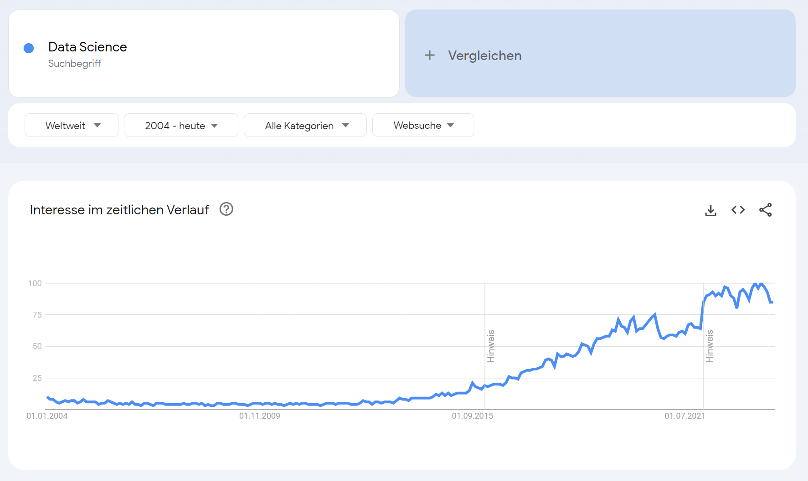
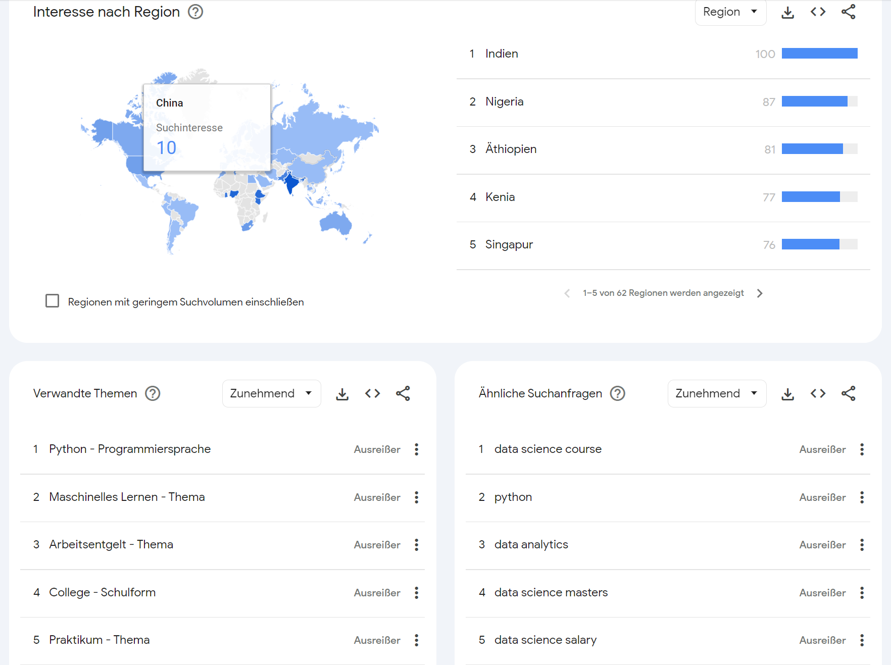
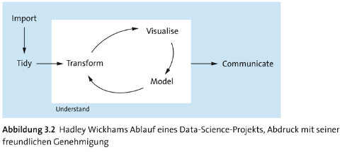
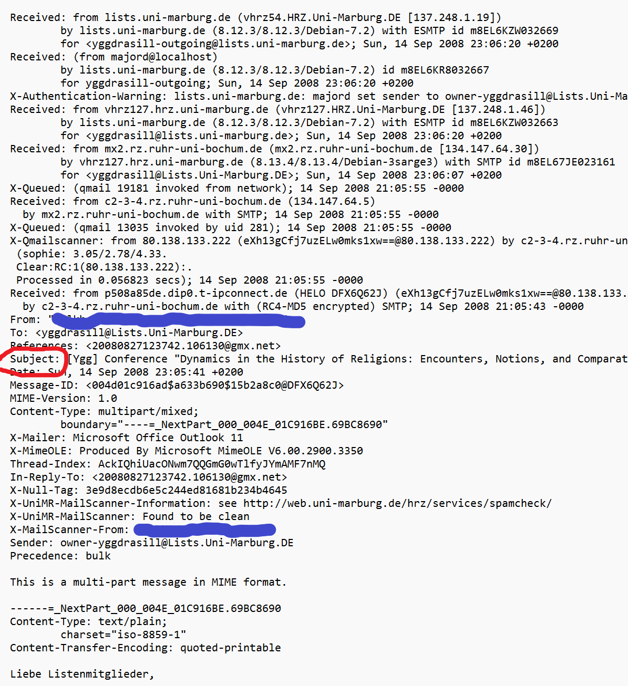
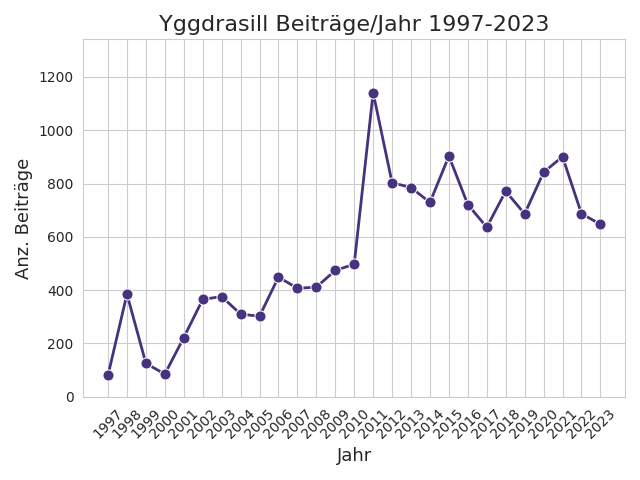
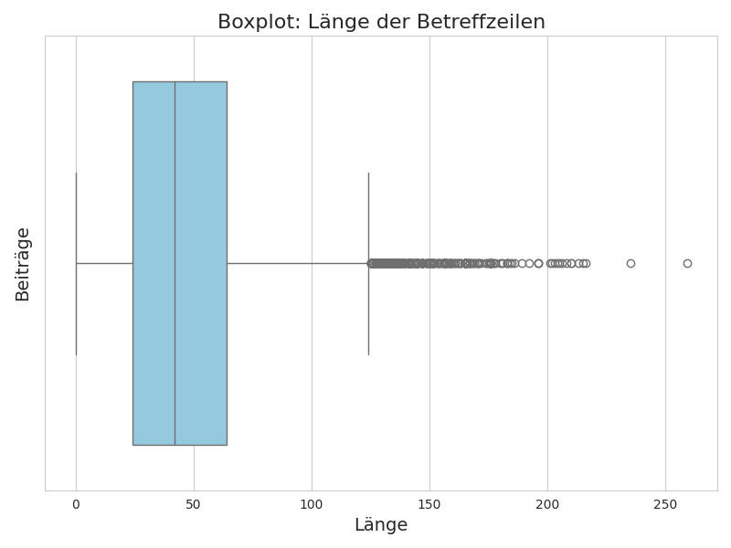

<html lang="en">
<head><meta charset="utf-8"/>
<meta content="width=device-width, initial-scale=1.0" name="viewport"/>
<title>DS_Vortrag</title>

<style type="text/css">
    div#notebook {
 font-family: sans-serif;
 font-size: 13pt;
 line-height: 170%;
 color: #cdd2e9;
 -webkit-font-smoothing: antialiased !important;
 padding-top: 25px !important;
}
body,
div.body {
 font-family: sans-serif;
 font-size: 13pt;
 color: #a2b0c7;
 background-color: #262931;
 background: #262931;
 -webkit-font-smoothing: antialiased !important;
}
body.notebook_app {
 padding: 0;
 background-color: #262931;
 background: #262931;
 padding-right: 0px !important;
 overflow-y: hidden;
}
a {
 font-family: sans-serif;
 color: #a2b0c7;
 -webkit-font-smoothing: antialiased !important;
}
a:hover,
a:focus {
 color: #d8dcee;
 -webkit-font-smoothing: antialiased !important;
}
div#maintoolbar {
 position: absolute;
 width: 90%;
 margin-left: -10%;
 padding-right: 8%;
 float: left;
 background: transparent !important;
}
#maintoolbar {
 margin-bottom: -3px;
 margin-top: 0px;
 border: 0px;
 min-height: 27px;
 padding-top: 2px;
 padding-bottom: 0px;
}
#maintoolbar .container {
 width: 75%;
 margin-right: auto;
 margin-left: auto;
}
.list_header,
div#notebook_list_header.row.list_header {
 font-size: 14pt;
 color: #d8dcee;
 background-color: transparent;
 height: 35px;
}
i.fa.fa-folder {
 display: inline-block;
 font: normal normal normal 14px "FontAwesome";
 font-family: "FontAwesome" !important;
 text-rendering: auto;
 -webkit-font-smoothing: antialiased;
 font-size: 18px;
 -moz-osx-font-smoothing: grayscale;
}
#running .panel-group .panel .panel-heading {
 font-size: 14pt;
 color: #a2b0c7;
 padding: 8px 8px;
 background: #2e3642;
 background-color: #2e3642;
}
#running .panel-group .panel .panel-heading a {
 font-size: 14pt;
 color: #a2b0c7;
}
#running .panel-group .panel .panel-heading a:focus,
#running .panel-group .panel .panel-heading a:hover {
 font-size: 14pt;
 color: #a2b0c7;
}
#running .panel-group .panel .panel-body .list_container .list_item {
 background: #384152;
 background-color: #384152;
 padding: 2px;
 border-bottom: 2px solid rgba(80,92,133,.22);
}
#running .panel-group .panel .panel-body .list_container .list_item:hover {
 background: #384152;
 background-color: #384152;
}
#running .panel-group .panel .panel-body {
 padding: 2px;
}
button#refresh_running_list {
 border: none !important;
}
button#refresh_cluster_list {
 border: none !important;
}
div.running_list_info.toolbar_info {
 font-size: 15px;
 padding: 4px 0 4px 0;
 margin-top: 5px;
 margin-bottom: 8px;
 height: 24px;
 line-height: 24px;
 text-shadow: none;
}
.list_placeholder {
 font-weight: normal;
}
#tree-selector {
 padding: 0px;
 border-color: transparent;
}
#project_name > ul > li > a > i.fa.fa-home {
 color: #4c8be2;
 font-size: 17pt;
 display: inline-block;
 position: static;
 padding: 0px 0px;
 font-weight: normal;
 text-align: center;
 vertical-align: text-top;
}
.fa-folder:before {
 color: #4c8be2;
}
.fa-arrow-up:before {
 font-size: 14px;
}
.fa-arrow-down:before {
 font-size: 14px;
}
span#last-modified.btn.btn-xs.btn-default.sort-action:hover .fa,
span#sort-name.btn.btn-xs.btn-default.sort-action:hover .fa {
 color: #4c8be2;
}
.folder_icon:before {
 display: inline-block;
 font: normal normal normal 14px/1 FontAwesome;
 font-size: inherit;
 text-rendering: auto;
 -webkit-font-smoothing: antialiased;
 -moz-osx-font-smoothing: grayscale;
 content: "\f07b";
 color: #4c8be2;
}
.notebook_icon:before {
 display: inline-block;
 font: normal normal normal 14px/1 FontAwesome;
 font-size: inherit;
 text-rendering: auto;
 -webkit-font-smoothing: antialiased;
 -moz-osx-font-smoothing: grayscale;
 content: "\f02d";
 position: relative;
 color: #48a667 !important;
 top: 0px;
}
.file_icon:before {
 display: inline-block;
 font: normal normal normal 14px/1 FontAwesome;
 font-size: inherit;
 text-rendering: auto;
 -webkit-font-smoothing: antialiased;
 -moz-osx-font-smoothing: grayscale;
 content: "\f15b";
 position: relative;
 top: 0px;
 color: #899ab8 !important;
}
#project_name a {
 display: inline-flex;
 padding-left: 7px;
 margin-left: -2px;
 text-align: -webkit-auto;
 vertical-align: baseline;
 font-size: 18px;
}
div#notebook_toolbar div.dynamic-instructions {
 font-family: sans-serif;
 font-size: 17px;
 color: #546379;
}
span#login_widget > .button,
#logout {
 font-family: "Proxima Nova", sans-serif;
 color: #a2b0c7;
 background: transparent;
 background-color: transparent;
 border: 2px solid #3a4452;
 font-weight: normal;
 box-shadow: none;
 text-shadow: none;
 border-radius: 3px;
 margin-right: 10px;
 padding: 2px 7px;
}
span#login_widget > .button:hover,
#logout:hover {
 color: #4c8be2;
 background-color: transparent;
 background: transparent;
 border: 2px solid #4c8be2;
 background-image: none;
 box-shadow: none !important;
 border-radius: 3px;
}
span#login_widget > .button:focus,
#logout:focus,
span#login_widget > .button.focus,
#logout.focus,
span#login_widget > .button:active,
#logout:active,
span#login_widget > .button.active,
#logout.active,
.open > .dropdown-togglespan#login_widget > .button,
.open > .dropdown-toggle#logout {
 color: #e4e8ee;
 background-color: #a2b0c7;
 background: #a2b0c7;
 border-color: #a2b0c7;
 background-image: none;
 box-shadow: none !important;
 border-radius: 2px;
}
body > #header #header-container {
 padding-bottom: 0px;
 padding-top: 4px;
 box-sizing: border-box;
 -moz-box-sizing: border-box;
 -webkit-box-sizing: border-box;
}
body > #header {
 background: #262931;
 background-color: #262931;
 position: relative;
 z-index: 100;
}
.list_container {
 font-size: 13pt;
 color: #a2b0c7;
 border: none;
 text-shadow: none !important;
}
.list_container > div {
 border-bottom: 1px solid rgba(80,92,133,.22);
 font-size: 13pt;
}
.list_header > div,
.list_item > div {
 padding-top: 6px;
 padding-bottom: 2px;
 padding-left: 0px;
}
.list_header > div .item_link,
.list_item > div .item_link {
 margin-left: -1px;
 vertical-align: middle;
 line-height: 22px;
 font-size: 13pt;
}
.item_icon {
 color: #4c8be2;
 font-size: 13pt;
 vertical-align: middle;
}
.list_item input:not([type="checkbox"]) {
 padding-right: 0px;
 height: 1.75em;
 width: 25%;
 margin: 0px 0 0;
 margin-top: 0px;
}
.list_header > div .item_link,
.list_item > div .item_link {
 margin-left: -1px;
 vertical-align: middle;
 line-height: 1.5em;
 font-size: 12pt;
 display: inline-table;
 position: static;
}
#button-select-all {
 height: 34px;
 min-width: 55px;
 z-index: 0;
 border: none !important;
 padding-top: 0px;
 padding-bottom: 0px;
 margin-bottom: 0px;
 margin-top: 0px;
 left: -3px;
 border-radius: 0px !important;
}
#button-select-all:focus,
#button-select-all:active:focus,
#button-select-all.active:focus,
#button-select-all.focus,
#button-select-all:active.focus,
#button-select-all.active.focus {
 background-color: #3a4452 !important;
 background: #3a4452 !important;
}
button#tree-selector-btn {
 height: 34px;
 font-size: 12.0pt;
 border: none;
 left: 0px;
 border-radius: 0px !important;
}
input#select-all.pull-left.tree-selector {
 margin-left: 7px;
 margin-right: 2px;
 margin-top: 2px;
 top: 4px;
}
input[type="radio"],
input[type="checkbox"] {
 margin-top: 1px;
 line-height: normal;
}
.delete-button {
 border: none !important;
}
i.fa.fa-trash {
 font-size: 13.5pt;
}
.list_container a {
 font-size: 16px;
 color: #a2b0c7;
 border: none;
 text-shadow: none !important;
 font-weight: normal;
 font-style: normal;
}
div.list_container a:hover {
 color: #d8dcee;
}
.list_header > div input,
.list_item > div input {
 margin-right: 7px;
 margin-left: 12px;
 vertical-align: baseline;
 line-height: 22px;
 position: relative;
 top: -1px;
}
div.list_item:hover {
 background-color: rgba(80,92,133,.05);
}
.breadcrumb > li {
 font-size: 12.0pt;
 color: #a2b0c7;
 border: none;
 text-shadow: none !important;
}
.breadcrumb > li + li:before {
 content: "/\00a0";
 padding: 0px;
 color: #a2b0c7;
 font-size: 18px;
}
#project_name > .breadcrumb {
 padding: 0px;
 margin-bottom: 0px;
 background-color: transparent;
 font-weight: normal;
 margin-top: -2px;
}
ul#tabs a {
 font-family: sans-serif;
 font-size: 13.5pt;
 font-weight: normal;
 font-style: normal;
 text-shadow: none !important;
}
.nav-tabs {
 font-family: sans-serif;
 font-size: 13.5pt;
 font-weight: normal;
 font-style: normal;
 background-color: transparent;
 border-color: transparent;
 text-shadow: none !important;
 border: 2px solid transparent;
}
.nav-tabs > li > a:active,
.nav-tabs > li > a:focus,
.nav-tabs > li > a:hover,
.nav-tabs > li.active > a,
.nav-tabs > li.active > a:focus,
.nav-tabs > li.active > a:hover,
.nav-tabs > li.active > a,
.nav-tabs > li.active > a:hover,
.nav-tabs > li.active > a:focus {
 color: #4c8be2;
 background-color: transparent;
 border-color: transparent;
 border-bottom: 2px solid transparent;
}
.nav > li.disabled > a,
.nav > li.disabled > a:hover {
 color: #546379;
}
.nav-tabs > li > a:before {
 content: "";
 position: absolute;
 width: 100%;
 height: 2px;
 bottom: -2px;
 left: 0;
 background-color: #4c8be2;
 visibility: hidden;
 -webkit-transform: perspective(0)scaleX(0);
 transform: perspective(0)scaleX(0);
 -webkit-transition: ease 220ms;
 transition: ease 220ms;
 -webkit-font-smoothing: antialiased !important;
}
.nav-tabs > li > a:hover:before {
 visibility: visible;
 -webkit-transform: perspective(1)scaleX(1);
 transform: perspective(1)scaleX(1);
}
.nav-tabs > li.active > a:before {
 content: "";
 position: absolute;
 width: 100%;
 height: 2px;
 bottom: -2px;
 left: 0;
 background-color: #4c8be2;
 visibility: visible;
 -webkit-transform: perspective(1)scaleX(1);
 transform: perspective(1)scaleX(1);
 -webkit-font-smoothing: subpixel-antialiased !important;
}
div#notebook {
 font-family: sans-serif;
 font-size: 13pt;
 padding-top: 4px;
}
.notebook_app {
 background-color: #262931;
}
#notebook-container {
 padding: 13px 2px;
 background-color: #262931;
 min-height: 0px;
 box-shadow: none;
 width: 980px;
 margin-right: auto;
 margin-left: auto;
}
div#ipython-main-app.container {
 width: 980px;
 margin-right: auto;
 margin-left: auto;
 margin-right: auto;
 margin-left: auto;
}
.container {
 width: 980px;
 margin-right: auto;
 margin-left: auto;
}
div#menubar-container {
 width: 100%;
 width: 980px;
}
div#header-container {
 width: 980px;
}
.notebook_app #header,
.edit_app #header {
 box-shadow: none !important;
 background-color: #262931;
 border-bottom: 2px solid rgba(80,92,133,.22);
}
#header,
.edit_app #header {
 font-family: sans-serif;
 font-size: 13pt;
 box-shadow: none;
 background-color: #262931;
}
#header .header-bar,
.edit_app #header .header-bar {
 background: #262931;
 background-color: #262931;
}
body > #header .header-bar {
 width: 100%;
 background: #262931;
}
span.checkpoint_status,
span.autosave_status {
 font-size: small;
 display: none;
}
#menubar,
div#menubar {
 background-color: #262931;
 padding-top: 0px !important;
}
#menubar .navbar,
.navbar-default {
 background-color: #262931;
 margin-bottom: 0px;
 margin-top: 0px;
}
.navbar {
 border: none;
}
div.navbar-text,
.navbar-text,
.navbar-text.indicator_area,
p.navbar-text.indicator_area {
 margin-top: 8px !important;
 margin-bottom: 0px;
 color: #4c8be2;
}
.navbar-default {
 font-family: sans-serif;
 font-size: 13pt;
 background-color: #262931;
 border-color: #343d4b;
 line-height: 1.5em;
 padding-bottom: 0px;
}
.navbar-default .navbar-nav > li > a {
 font-family: sans-serif;
 font-size: 13pt;
 color: #a2b0c7;
 display: block;
 line-height: 1.5em;
 padding-top: 14px;
 padding-bottom: 11px;
}
.navbar-default .navbar-nav > li > a:hover,
.navbar-default .navbar-nav > li > a:focus {
 color: #d8dcee !important;
 background-color: rgba(80,92,133,.22) !important;
 border-color: #343d4b !important;
 line-height: 1.5em;
 transition: 80ms ease;
}
.navbar-default .navbar-nav > .open > a,
.navbar-default .navbar-nav > .open > a:hover,
.navbar-default .navbar-nav > .open > a:focus {
 color: #e4e8ee;
 background-color: #384251;
 border-color: #384251;
 line-height: 1.5em;
}
.navbar-nav > li > .dropdown-menu {
 margin-top: 0px;
}
.navbar-nav {
 margin: 0;
}
div.notification_widget.info,
.notification_widget.info,
.notification_widget:active:hover,
.notification_widget.active:hover,
.open > .dropdown-toggle.notification_widget:hover,
.notification_widget:active:focus,
.notification_widget.active:focus,
.open > .dropdown-toggle.notification_widget:focus,
.notification_widget:active.focus,
.notification_widget.active.focus,
.open > .dropdown-toggle.notification_widget.focus,
div#notification_notebook.notification_widget.btn.btn-xs.navbar-btn,
div#notification_notebook.notification_widget.btn.btn-xs.navbar-btn:hover,
div#notification_notebook.notification_widget.btn.btn-xs.navbar-btn:focus {
 color: #899ab8 !important;
 background-color: transparent !important;
 border-color: transparent !important;
 padding-bottom: 0px !important;
 margin-bottom: 0px !important;
 font-size: 9pt !important;
 z-index: 0;
}
div#notification_notebook.notification_widget.btn.btn-xs.navbar-btn {
 font-size: 9pt !important;
 z-index: 0;
}
.notification_widget {
 color: #4c8be2;
 z-index: -500;
 font-size: 9pt;
 background: transparent;
 background-color: transparent;
 margin-right: 3px;
 border: none;
}
.notification_widget,
div.notification_widget {
 margin-right: 0px;
 margin-left: 0px;
 padding-right: 0px;
 vertical-align: text-top !important;
 margin-top: 6px !important;
 background: transparent !important;
 background-color: transparent !important;
 font-size: 9pt !important;
 border: none;
}
.navbar-btn.btn-xs:hover {
 border: none !important;
 background: transparent !important;
 background-color: transparent !important;
 color: #a2b0c7 !important;
}
div.notification_widget.info,
.notification_widget.info {
 display: none !important;
}
.edit_mode .modal_indicator:before {
 display: none;
}
.command_mode .modal_indicator:before {
 display: none;
}
.item_icon {
 color: #4c8be2;
}
.item_buttons .kernel-name {
 font-size: 13pt;
 color: #4c8be2;
}
.running_notebook_icon:before {
 color: #48a667 !important;
 font: normal normal normal 15px/1 FontAwesome;
 font-size: 15px;
 text-rendering: auto;
 -webkit-font-smoothing: antialiased;
 -moz-osx-font-smoothing: grayscale;
 content: "\f10c";
 vertical-align: middle;
 position: static;
 display: inherit;
}
.item_buttons .running-indicator {
 padding-top: 4px;
 color: #48a667;
 font-family: sans-serif;
 text-rendering: auto;
 -webkit-font-smoothing: antialiased;
}
#notification_trusted {
 font-family: sans-serif;
 border: none;
 background: transparent;
 background-color: transparent;
 margin-bottom: 0px !important;
 vertical-align: bottom !important;
 color: #546379 !important;
 cursor: default !important;
}
#notification_area,
div.notification_area {
 float: right !important;
 position: static;
 cursor: pointer;
 padding-top: 6px;
 padding-right: 4px;
}
div#notification_notebook.notification_widget.btn.btn-xs.navbar-btn {
 font-size: 9pt !important;
 z-index: 0;
 margin-top: -5px !important;
}
#modal_indicator {
 float: right !important;
 color: #4c8be2;
 background: #262931;
 background-color: #262931;
 margin-top: 8px !important;
 margin-left: 0px;
}
#kernel_indicator {
 float: right !important;
 color: #4c8be2;
 background: #262931;
 background-color: #262931;
 border-left: 2px solid #4c8be2;
 padding-top: 0px;
 padding-bottom: 4px;
 margin-top: 10px !important;
 margin-left: -2px;
 padding-left: 5px !important;
}
#kernel_indicator .kernel_indicator_name {
 font-size: 17px;
 color: #4c8be2;
 background: #262931;
 background-color: #262931;
 padding-left: 5px;
 padding-right: 5px;
 margin-top: 4px;
 vertical-align: text-top;
 padding-bottom: 0px;
}
.kernel_idle_icon:before {
 display: inline-block;
 font: normal normal normal 22px/1 FontAwesome;
 font-size: 22px;
 text-rendering: auto;
 -webkit-font-smoothing: antialiased;
 cursor: pointer;
 margin-left: 0px !important;
 opacity: 0.7;
 vertical-align: bottom;
 margin-top: 1px;
 content: "\f1db";
}
.kernel_busy_icon:before {
 display: inline-block;
 font: normal normal normal 22px/1 FontAwesome;
 font-size: 22px;
 -webkit-animation: pulsate 2s infinite ease-out;
 animation: pulsate 2s infinite ease-out;
 text-rendering: auto;
 -webkit-font-smoothing: antialiased;
 cursor: pointer;
 margin-left: 0px !important;
 vertical-align: bottom;
 margin-top: 1px;
 content: "\f111";
}
@-webkit-keyframes pulsate {
 0% {
  -webkit-transform: scale(1.0,1.0);
  opacity: 0.8;
 }
 8% {
  -webkit-transform: scale(1.0,1.0);
  opacity: 0.8;
 }
 50% {
  -webkit-transform: scale(0.75,0.75);
  opacity: 0.3;
 }
 92% {
  -webkit-transform: scale(1.0,1.0);
  opacity: 0.8;
 }
 100% {
  -webkit-transform: scale(1.0,1.0);
  opacity: 0.8;
 }
}
div.notification_widget.info,
.notification_widget.info,
.notification_widget:active:hover,
.notification_widget.active:hover,
.open > .dropdown-toggle.notification_widget:hover,
.notification_widget:active:focus,
.notification_widget.active:focus,
.open > .dropdown-toggle.notification_widget:focus,
.notification_widget:active.focus,
.notification_widget.active.focus,
.open > .dropdown-toggle.notification_widget.focus,
div#notification_notebook.notification_widget.btn.btn-xs.navbar-btn,
div#notification_notebook.notification_widget.btn.btn-xs.navbar-btn:hover,
div#notification_notebook.notification_widget.btn.btn-xs.navbar-btn:focus {
 color: #899ab8;
 background-color: #262931;
 border-color: #262931;
}
#notification_area,
div.notification_area {
 float: right !important;
 position: static;
}
.notification_widget,
div.notification_widget {
 margin-right: 0px;
 margin-left: 0px;
 padding-right: 0px;
 vertical-align: text-top !important;
 margin-top: 6px !important;
 z-index: 1000;
}
#kernel_logo_widget,
#kernel_logo_widget .current_kernel_logo {
 display: none;
}
div#ipython_notebook {
 display: none;
}
i.fa.fa-icon {
 -webkit-font-smoothing: antialiased;
 -moz-osx-font-smoothing: grayscale;
 text-rendering: auto;
}
.fa {
 display: inline-block;
 font: normal normal normal 10pt/1 "FontAwesome", sans-serif;
 text-rendering: auto;
 -webkit-font-smoothing: antialiased;
 -moz-osx-font-smoothing: grayscale;
}
.dropdown-menu {
 font-family: sans-serif;
 font-size: 13pt;
 box-shadow: none;
 padding: 0px;
 text-align: left;
 border: none;
 background-color: #384251;
 background: #384251;
 line-height: 1;
}
.dropdown-menu:hover {
 font-family: sans-serif;
 font-size: 13pt;
 box-shadow: none;
 padding: 0px;
 text-align: left;
 border: none;
 background-color: #384251;
 box-shadow: none;
 line-height: 1;
}
.dropdown-menu > li > a {
 font-family: sans-serif;
 font-size: 12.0pt;
 display: block;
 padding: 10px 20px 9px 10px;
 color: #a2b0c7;
 background-color: #384251;
 background: #384251;
}
.dropdown-menu > li > a:hover,
.dropdown-menu > li > a:focus {
 color: #d8dcee;
 background-color: #343d4b;
 background: #343d4b;
 border-color: #343d4b;
 transition: 200ms ease;
}
.dropdown-menu .divider {
 height: 1px;
 margin: 0px 0px;
 overflow: hidden;
 background-color: rgba(80,92,133,.45);
}
.dropdown-submenu > .dropdown-menu {
 display: none;
 top: 2px !important;
 left: 100%;
 margin-top: -2px;
 margin-left: 0px;
 padding-top: 0px;
 transition: 200ms ease;
}
.dropdown-menu > .disabled > a,
.dropdown-menu > .disabled > a:hover,
.dropdown-menu > .disabled > a:focus {
 font-family: sans-serif;
 font-size: 12.0pt;
 font-weight: normal;
 color: #546379;
 padding: none;
 display: block;
 clear: both;
 white-space: nowrap;
}
.dropdown-submenu > a:after {
 color: #a2b0c7;
 margin-right: -16px;
 margin-top: 0px;
 display: inline-block;
}
.dropdown-submenu:hover > a:after,
.dropdown-submenu:active > a:after,
.dropdown-submenu:focus > a:after,
.dropdown-submenu:visited > a:after {
 color: #4c8be2;
 margin-right: -16px;
 display: inline-block !important;
}
div.kse-dropdown > .dropdown-menu,
.kse-dropdown > .dropdown-menu {
 min-width: 0;
 top: 94%;
}
.btn,
.btn-default {
 font-family: sans-serif;
 color: #a2b0c7;
 background: #3a4452;
 background-color: #3a4452;
 border: 2px solid #3a4452;
 font-weight: normal;
 box-shadow: none;
 text-shadow: none;
 border-radius: 3px;
 font-size: initial;
}
.btn:hover,
.btn:active:hover,
.btn.active:hover,
.btn-default:hover,
.open > .dropdown-toggle.btn-default:hover,
.open > .dropdown-toggle.btn:hover {
 color: #4c8be2;
 border: 2px solid #363f4c;
 background-color: #363f4c;
 background: #363f4c;
 background-image: none;
 box-shadow: none !important;
 border-radius: 3px;
}
.btn:active,
.btn.active,
.btn:active:focus,
.btn.active:focus,
.btn:active.focus,
.btn.active.focus,
.btn-default:focus,
.btn-default.focus,
.btn-default:active,
.btn-default.active,
.btn-default:active:hover,
.btn-default.active:hover,
.btn-default:active:focus,
.btn-default.active:focus,
.btn-default:active.focus,
.btn-default.active.focus,
.open > .dropdown-toggle.btn:focus,
.open > .dropdown-toggle.btn.focus,
.open > .dropdown-toggle.btn-default:hover,
.open > .dropdown-toggle.btn-default:focus,
.open > .dropdown-toggle.btn-default.hover,
.open > .dropdown-toggle.btn-default.focus {
 color: #4c8be2;
 border: 2px solid #363f4c;
 background-color: #363f4c !important;
 background: #363f4c !important;
 background-image: none;
 box-shadow: none !important;
 border-radius: 3px;
}
.btn-default:active:hover,
.btn-default.active:hover,
.btn-default:active:focus,
.btn-default.active:focus,
.btn-default:active.focus,
.btn-default.active.focus {
 color: #157bff !important;
 background-color: #3a4452;
 border-color: #33517c !important;
 transition: 2000ms ease;
}
.btn:focus,
.btn.focus,
.btn:active:focus,
.btn.active:focus,
.btn:active,
.btn.active,
.btn:active.focus,
.btn.active.focus {
 color: #157bff !important;
 outline: none !important;
 outline-width: 0px !important;
 background: #33517c !important;
 background-color: #33517c !important;
 border-color: #33517c !important;
 transition: 200ms ease !important;
}
.item_buttons > .btn,
.item_buttons > .btn-group,
.item_buttons > .input-group {
 font-size: 13pt;
 background: transparent;
 background-color: transparent;
 border: 0px solid #2e3642;
 border-bottom: 2px solid transparent;
 margin-left: 5px;
 padding-top: 4px !important;
}
.item_buttons > .btn:hover,
.item_buttons > .btn-group:hover,
.item_buttons > .input-group:hover,
.item_buttons > .btn.active,
.item_buttons > .btn-group.active,
.item_buttons > .input-group.active,
.item_buttons > .btn.focus {
 margin-left: 5px;
 background: #2a313c;
 padding-top: 4px !important;
 background-color: transparent;
 border: 0px solid transparent;
 border-bottom: 2px solid #4c8be2;
 border-radius: 0px;
 transition: none;
}
.item_buttons {
 line-height: 1.5em !important;
}
.item_buttons .btn {
 min-width: 11ex;
}
.btn-group > .btn:first-child {
 margin-left: 3px;
}
.btn-group > .btn-mini,
.btn-sm,
.btn-group-sm > .btn,
.btn-xs,
.btn-group-xs > .btn,
.alternate_upload .btn-upload,
.btn-group,
.btn-group-vertical {
 font-size: inherit;
 font-weight: normal;
 height: inherit;
 line-height: inherit;
}
.btn-xs,
.btn-group-xs > .btn {
 font-size: initial !important;
 background-image: none;
 font-weight: normal;
 text-shadow: none;
 display: inline-table;
 padding: 2px 5px;
 line-height: 1.45;
}
.btn-group > .btn:first-child {
 margin-left: 3px;
}
div#new-buttons > button,
#new-buttons > button,
div#refresh_notebook_list,
#refresh_notebook_list {
 background: transparent;
 background-color: transparent;
 border: none;
}
div#new-buttons > button:hover,
#new-buttons > button:hover,
div#refresh_notebook_list,
#refresh_notebook_list,
div.alternate_upload .btn-upload,
.alternate_upload .btn-upload,
div.dynamic-buttons > button,
.dynamic-buttons > button,
.dynamic-buttons > button:focus,
.dynamic-buttons > button:active:focus,
.dynamic-buttons > button.active:focus,
.dynamic-buttons > button.focus,
.dynamic-buttons > button:active.focus,
.dynamic-buttons > button.active.focus,
#new-buttons > button:focus,
#new-buttons > button:active:focus,
#new-buttons > button.active:focus,
#new-buttons > button.focus,
#new-buttons > button:active.focus,
#new-buttons > button.active.focus,
.alternate_upload .btn-upload:focus,
.alternate_upload .btn-upload:active:focus,
.alternate_upload .btn-upload.active:focus,
.alternate_upload .btn-upload.focus,
.alternate_upload .btn-upload:active.focus,
.alternate_upload .btn-upload.active.focus {
 background: transparent !important;
 background-color: transparent !important;
 border: none !important;
}
.alternate_upload input.fileinput {
 text-align: center;
 vertical-align: bottom;
 margin-left: -.5ex;
 display: inline-table;
 border: solid 0px #3a4452;
 margin-bottom: -1ex;
}
.alternate_upload .btn-upload {
 display: inline-table;
 background: transparent;
 border: none;
}
.btn-group .btn + .btn,
.btn-group .btn + .btn-group,
.btn-group .btn-group + .btn,
.btn-group .btn-group + .btn-group {
 margin-left: -2px;
}
.btn-group > .btn:first-child:not(:last-child):not(.dropdown-toggle) {
 border-bottom-right-radius: 0;
 border-top-right-radius: 0;
 z-index: 2;
}
.dropdown-header {
 font-family: sans-serif !important;
 font-size: 13pt !important;
 color: #4c8be2 !important;
 border-bottom: none !important;
 padding: 0px !important;
 margin: 6px 6px 0px !important;
}
span#last-modified.btn.btn-xs.btn-default.sort-action,
span#sort-name.btn.btn-xs.btn-default.sort-action,
span#file-size.btn.btn-xs.btn-default.sort-action {
 font-family: sans-serif;
 font-size: 16px;
 background-color: transparent;
 background: transparent;
 border: none;
 color: #a2b0c7;
 padding-bottom: 0px;
 margin-bottom: 0px;
 vertical-align: sub;
}
span#last-modified.btn.btn-xs.btn-default.sort-action {
 margin-left: 19px;
}
button.close {
 border: 0px none;
 font-family: sans-serif;
 font-size: 20pt;
 font-weight: normal;
}
.dynamic-buttons {
 padding-top: 0px;
 display: inline-block;
}
.close {
 color: #dc6972;
 opacity: .5;
 text-shadow: none;
 font-weight: normal;
}
.close:hover {
 color: #dc6972;
 opacity: 1;
 font-weight: normal;
}
div.nbext-enable-btns .btn[disabled],
div.nbext-enable-btns .btn[disabled]:hover,
.btn-default.disabled,
.btn-default[disabled],
.btn-default.disabled:hover,
.btn-default[disabled]:hover,
fieldset[disabled] .btn-default:hover,
.btn-default.disabled:focus,
.btn-default[disabled]:focus,
fieldset[disabled] .btn-default:focus,
.btn-default.disabled.focus,
.btn-default[disabled].focus,
fieldset[disabled] .btn-default.focus {
 color: #92a2bd;
 background: #38424f;
 background-color: #38424f;
 border-color: #38424f;
 transition: 200ms ease;
}
.input-group-addon {
 padding: 2px 5px;
 font-size: 13pt;
 font-weight: normal;
 height: auto;
 color: #a2b0c7;
 text-align: center;
 background-color: transparent;
 border: 2px solid transparent !important;
 text-transform: capitalize;
}
a.btn.btn-default.input-group-addon:hover {
 background: transparent !important;
 background-color: transparent !important;
}
.btn-group > .btn + .dropdown-toggle {
 padding-left: 8px;
 padding-right: 8px;
 height: 100%;
}
.btn-group > .btn + .dropdown-toggle:hover {
 background: #363f4c !important;
}
.input-group-btn {
 position: relative;
 font-size: inherit;
 white-space: nowrap;
 background: #2e3642;
 background-color: #2e3642;
 border: none;
}
.input-group-btn:hover {
 background: #2a313c;
 background-color: #2a313c;
 border: none;
}
.input-group-btn:first-child > .btn,
.input-group-btn:first-child > .btn-group {
 background: #2e3642;
 background-color: #2e3642;
 border: none;
 margin-left: 2px;
 margin-right: -1px;
 font-size: inherit;
}
.input-group-btn:first-child > .btn:hover,
.input-group-btn:first-child > .btn-group:hover {
 background: #363f4c;
 background-color: #363f4c;
 border: none;
 font-size: inherit;
 transition: 200ms ease;
}
div.modal .btn-group > .btn:first-child {
 background: #2e3642;
 background-color: #2e3642;
 border: 1px solid #2c343f;
 margin-top: 0px !important;
 margin-left: 0px;
 margin-bottom: 2px;
}
div.modal .btn-group > .btn:first-child:hover {
 background: #2a313c;
 background-color: #2a313c;
 border: 1px solid #2a313c;
 transition: 200ms ease;
}
div.modal > button,
div.modal-footer > button {
 background: #2e3642;
 background-color: #2e3642;
 border-color: #2e3642;
}
div.modal > button:hover,
div.modal-footer > button:hover {
 background: #2a313c;
 background-color: #2a313c;
 border-color: #2a313c;
 transition: 200ms ease;
}
.modal-content {
 font-family: sans-serif;
 font-size: 12.0pt;
 position: relative;
 background: #2e3642;
 background-color: #2e3642;
 border: none;
 border-radius: 1px;
 background-clip: padding-box;
 outline: none;
}
.modal-header {
 font-family: sans-serif;
 font-size: 13pt;
 color: #a2b0c7;
 background: #2e3642;
 background-color: #2e3642;
 border-color: rgba(80,92,133,.22);
 padding: 12px;
 min-height: 16.4286px;
}
.modal-content h4 {
 font-family: sans-serif;
 font-size: 16pt;
 color: #a2b0c7;
 padding: 5px;
}
.modal-body {
 background-color: #384152;
 position: relative;
 padding: 15px;
}
.modal-footer {
 padding: 8px;
 text-align: right;
 background-color: #384152;
 border-top: none;
}
.alert-info {
 background-color: #4a5467;
 border-color: rgba(80,92,133,.22);
 color: #a2b0c7;
}
.modal-header .close {
 margin-top: -5px;
 font-size: 25pt;
}
.modal-backdrop,
.modal-backdrop.in {
 opacity: 0.85;
 background-color: notebook-bg;
}
div.panel,
div.panel-default,
.panel,
.panel-default {
 font-family: sans-serif;
 font-size: 13pt;
 background-color: #384152;
 color: #a2b0c7;
 margin-bottom: 14px;
 border: 0;
 box-shadow: none;
}
div.panel > .panel-heading,
div.panel-default > .panel-heading {
 font-size: 14pt;
 color: #a2b0c7;
 background: #2e3642;
 background-color: #2e3642;
 border: 0;
}
.modal .modal-dialog {
 min-width: 950px;
 margin: 50px auto;
}
div.container-fluid {
 margin-right: auto;
 margin-left: auto;
 padding-left: 0px;
 padding-right: 5px;
}
div.form-control,
.form-control {
 font-family: sans-serif;
 font-size: initial;
 color: #a2b0c7;
 background-color: #2a313c;
 border: 1px solid #2a313c !important;
 margin-left: 2px;
 box-shadow: none;
 transition: border-color 0.15s ease-in-out 0s, box-shadow 0.15s ease-in-out 0s;
}
.form-control-static {
 min-height: inherit;
 height: inherit;
}
.form-group.list-group-item {
 color: #a2b0c7;
 background-color: #384152;
 border-color: rgba(80,92,133,.22);
 margin-bottom: 0px;
}
.form-group .input-group {
 float: left;
}
input,
button,
select,
textarea {
 background-color: #2a313c;
 font-weight: normal;
 border: 1px solid rgba(80,92,133,.22);
}
select.form-control.select-xs {
 height: 33px;
 font-size: 13pt;
}
.toolbar select,
.toolbar label {
 width: auto;
 vertical-align: middle;
 margin-right: 0px;
 margin-bottom: 0px;
 display: inline;
 font-size: 92%;
 margin-left: 10px;
 padding: 0px;
 background: #3a4452 !important;
 background-color: #3a4452 !important;
 border: 2px solid #3a4452 !important;
}
.form-control:focus {
 border-color: #4c8be2;
 outline: 2px solid #3572c6;
 -webkit-box-shadow: none;
}
::-webkit-input-placeholder {
 color: #546379;
}
::-moz-placeholder {
 color: #546379;
}
:-ms-input-placeholder {
 color: #546379;
}
:-moz-placeholder {
 color: #546379;
}
[dir="ltr"] #find-and-replace .input-group-btn + .form-control {
 border: 2px solid rgba(80,92,133,.22) !important;
}
[dir="ltr"] #find-and-replace .input-group-btn + .form-control:focus {
 border-color: #4c8be2;
 outline: 2px solid #3572c6;
 -webkit-box-shadow: none;
 box-shadow: none;
}
div.output.output_scroll {
 box-shadow: none;
}
::-webkit-scrollbar {
 width: 11px;
 max-height: 9px;
 background-color: #292d3a;
 border-radius: 3px;
 border: none;
}
::-webkit-scrollbar-track {
 background: #292d3a;
 border: none;
 width: 11px;
 max-height: 9px;
}
::-webkit-scrollbar-thumb {
 border-radius: 2px;
 border: none;
 background: #3f4555;
 background-clip: content-box;
 width: 11px;
}
HTML,
body,
div,
dl,
dt,
dd,
ul,
ol,
li,
h1,
h2,
h3,
h4,
h5,
h6,
pre,
code,
form,
fieldset,
legend,
input,
button,
textarea,
p,
blockquote,
th,
td,
span,
a {
 text-rendering: geometricPrecision;
 -webkit-font-smoothing: subpixel-antialiased;
 font-weight: 400;
}
div.input_area {
 background-color: #303845;
 background: #303845;
 padding-right: 1.2em;
 border: 0px;
 border-radius: 0px;
 border-top-right-radius: 4px;
 border-bottom-right-radius: 4px;
}
div.cell {
 padding: 0px;
 background: #303845;
 background-color: #303845;
 border: medium solid #262931;
 border-radius: 4px;
 top: 0;
}
div.cell.selected {
 background: #303845;
 background-color: #303845;
 border: medium solid #262931;
 padding: 0px;
 border-radius: 5px;
}
.edit_mode div.cell.selected {
 padding: 0px;
 background: #303845;
 background-color: #303845;
 border: medium solid #262931;
 border-radius: 5px;
}
div.cell.edit_mode {
 padding: 0px;
 background: #303845;
 background-color: #303845;
}
div.CodeMirror-sizer {
 margin-left: 0px;
 margin-bottom: -21px;
 border-right-width: 16px;
 min-height: 37px;
 padding-right: 0px;
 padding-bottom: 0px;
 margin-top: 0px;
}
div.cell.selected:before,
.edit_mode div.cell.selected:before,
div.cell.selected:before,
div.cell.selected.jupyter-soft-selected:before {
 background: #303845 !important;
 border: none;
 border-radius: 3px;
 position: absolute;
 display: block;
 top: 0px;
 left: 0px;
 width: 0px;
 height: 100%;
}
div.cell.text_cell.selected::before,
.edit_mode div.cell.text_cell.selected:before,
div.cell.text_cell.selected:before,
div.cell.text_cell.selected.jupyter-soft-selected:before {
 background: #303845 !important;
 background-color: #303845 !important;
 border-color: #2769c3 !important;
}
div.cell.code_cell .input {
 border-left: 5px solid #303845 !important;
 border-radius: 3px;
 border-bottom-left-radius: 3px;
 border-top-left-radius: 3px;
}
div.cell.code_cell.selected .input {
 border-left: 5px solid #2769c3 !important;
 border-radius: 3px;
}
.edit_mode div.cell.code_cell.selected .input {
 border-left: 5px solid #33517c !important;
 border-radius: 3px;
}
.edit_mode div.cell.selected:before {
 height: 100%;
 border-left: 5px solid #33517c !important;
 border-radius: 3px;
}
div.cell.jupyter-soft-selected,
div.cell.selected.jupyter-soft-selected {
 border-left-color: #33517c !important;
 border-left-width: 0px !important;
 padding-left: 7px !important;
 border-right-color: #33517c !important;
 border-right-width: 0px !important;
 background: #33517c !important;
 border-radius: 6px !important;
}
div.cell.selected.jupyter-soft-selected .input {
 border-left: 5px solid #303845 !important;
}
div.cell.selected.jupyter-soft-selected {
 border-left-color: #2769c3;
 border-color: #262931;
 padding-left: 7px;
 border-radius: 6px;
}
div.cell.code_cell.selected .input {
 border-left: none;
 border-radius: 3px;
}
div.cell.selected.jupyter-soft-selected .prompt,
div.cell.text_cell.selected.jupyter-soft-selected .prompt {
 top: 0;
 border-left: #303845 !important;
 border-radius: 2px;
}
div.cell.text_cell.selected.jupyter-soft-selected .input_prompt {
 border-left: none !important;
}
div.cell.text_cell.jupyter-soft-selected,
div.cell.text_cell.selected.jupyter-soft-selected {
 border-left-color: #33517c !important;
 border-left-width: 0px !important;
 padding-left: 26px !important;
 border-right-color: #33517c !important;
 border-right-width: 0px !important;
 background: #33517c !important;
 border-radius: 5px !important;
}
div.cell.jupyter-soft-selected .input,
div.cell.selected.jupyter-soft-selected .input {
 border-left-color: #33517c !important;
}
div.prompt,
.prompt {
 font-family: monospace, monospace;
 font-size: 9pt !important;
 font-weight: normal;
 color: #446489;
 line-height: 170%;
 padding: 0px;
 padding-top: 4px;
 padding-left: 0px;
 padding-right: 1px;
 text-align: right !important;
 min-width: 11.5ex !important;
 width: 11.5ex !important;
}
div.prompt.input_prompt {
 font-size: 9pt !important;
 background-color: #303845;
 border-top: 0px;
 border-top-right-radius: 0px;
 border-bottom-left-radius: 0px;
 border-bottom-right-radius: 0px;
 padding-right: 3px;
 min-width: 11.5ex;
 width: 11.5ex !important;
}
div.cell.code_cell .input_prompt {
 border-right: 2px solid #3572c6;
}
div.cell.selected .prompt {
 top: 0;
}
.edit_mode div.cell.selected .prompt {
 top: 0;
}
.edit_mode div.cell.selected .prompt {
 top: 0;
}
.run_this_cell {
 visibility: hidden;
 color: transparent;
 padding-top: 0px;
 padding-bottom: 0px;
 padding-left: 3px;
 padding-right: 12px;
 width: 1.5ex;
 width: 0ex;
 background: transparent;
 background-color: transparent;
}
div.code_cell:hover div.input .run_this_cell {
 visibility: visible;
}
div.cell.code_cell.rendered.selected .run_this_cell:hover {
 background-color: #282e39;
 background: #282e39;
 color: #2769c3 !important;
}
div.cell.code_cell.rendered.unselected .run_this_cell:hover {
 background-color: #282e39;
 background: #282e39;
 color: #2769c3 !important;
}
i.fa-step-forward.fa {
 display: inline-block;
 font: normal normal normal 9px "FontAwesome";
}
.fa-step-forward:before {
 content: "\f04b";
}
div.cell.selected.jupyter-soft-selected .run_this_cell,
div.cell.selected.jupyter-soft-selected .run_this_cell:hover,
div.cell.unselected.jupyter-soft-selected .run_this_cell:hover,
div.cell.code_cell.rendered.selected.jupyter-soft-selected .run_this_cell:hover,
div.cell.code_cell.rendered.unselected.jupyter-soft-selected .run_this_cell:hover {
 background-color: #33517c !important;
 background: #33517c !important;
 color: #33517c !important;
}
div.output_wrapper {
 background-color: #384151;
 border: 0px;
 left: 0px;
 margin-bottom: 0em;
 margin-top: 0em;
 border-top-right-radius: 0px;
 border-top-left-radius: 0px;
}
div.output_subarea.output_text.output_stream.output_stdout,
div.output_subarea.output_text {
 font-family: monospace, monospace;
 font-size: 8.5pt !important;
 line-height: 150% !important;
 background-color: #384151;
 color: #cdd2e9;
 border-top-right-radius: 0px;
 border-top-left-radius: 0px;
 margin-left: 11.5px;
}
div.output_area pre {
 font-family: monospace, monospace;
 font-size: 8.5pt !important;
 line-height: 151% !important;
 color: #cdd2e9;
 border-top-right-radius: 0px;
 border-top-left-radius: 0px;
}
div.output_area {
 display: -webkit-box;
}
div.output_html {
 font-family: monospace, monospace;
 font-size: 8.5pt;
 color: #dbdfef;
 background-color: #384151;
 background: #384151;
}
div.output_subarea {
 overflow-x: auto;
 padding: 1.2em !important;
 -webkit-box-flex: 1;
 -moz-box-flex: 1;
 box-flex: 1;
 flex: 1;
}
div.btn.btn-default.output_collapsed {
 background: #242a33;
 background-color: #242a33;
 border-color: #242a33;
}
div.btn.btn-default.output_collapsed:hover {
 background: #1f252d;
 background-color: #1f252d;
 border-color: #1f252d;
}
div.prompt.output_prompt {
 font-family: monospace, monospace;
 font-weight: bold !important;
 background-color: #384151;
 color: transparent;
 border-bottom-left-radius: 4px;
 border-top-right-radius: 0px;
 border-top-left-radius: 0px;
 border-bottom-right-radius: 0px;
 min-width: 11.5ex !important;
 width: 11.5ex !important;
 border-right: 2px solid transparent;
}
div.out_prompt_overlay.prompt {
 font-family: monospace, monospace;
 font-weight: bold !important;
 background-color: #384151;
 border-bottom-left-radius: 2px;
 border-top-right-radius: 0px;
 border-top-left-radius: 0px;
 border-bottom-right-radius: 0px;
 min-width: 11.5ex !important;
 width: 11.5ex !important;
 border-right: 2px solid transparent;
 color: transparent;
}
div.out_prompt_overlay.prompt:hover {
 background-color: #3e4458;
 box-shadow: none !important;
 border: none;
 border-bottom-left-radius: 2px;
 -webkit-border-: 2px;
 -moz-border-radius: 2px;
 border-top-right-radius: 0px;
 border-top-left-radius: 0px;
 min-width: 11.5ex !important;
 width: 11.5ex !important;
 border-right: 2px solid #3e4458 !important;
}
div.cell.code_cell .output_prompt {
 border-right: 2px solid transparent;
 color: transparent;
}
div.cell.selected .output_prompt,
div.cell.selected .out_prompt_overlay.prompt {
 border-left: 5px solid #33517c;
 border-right: 2px solid #384151;
 border-radius: 0px !important;
}
.edit_mode div.cell.selected .output_prompt,
.edit_mode div.cell.selected .out_prompt_overlay.prompt {
 border-left: 5px solid #33517c;
 border-right: 2px solid #384151;
 border-radius: 0px !important;
}
div.text_cell,
div.text_cell_render pre,
div.text_cell_render {
 font-family: sans-serif;
 font-size: 13pt;
 line-height: 130% !important;
 color: #abc1e2;
 background: #303845;
 background-color: #303845;
 border-radius: 0px;
}
div .text_cell_render {
 padding: 0.4em 0.4em 0.4em 0.4em;
}
div.cell.text_cell .CodeMirror-lines {
 padding-top: .7em !important;
 padding-bottom: .4em !important;
 padding-left: .5em !important;
 padding-right: .5em !important;
 margin-top: .4em;
 margin-bottom: .3em;
}
div.cell.text_cell.unrendered div.input_area,
div.cell.text_cell.rendered div.input_area {
 background-color: #303845;
 background: #303845;
 border: 0px;
 border-radius: 2px;
}
div.cell.text_cell .CodeMirror,
div.cell.text_cell .CodeMirror pre {
 line-height: 170% !important;
}
div.cell.text_cell.rendered.selected {
 font-family: sans-serif;
 line-height: 170% !important;
 background: #303845;
 background-color: #303845;
 border-radius: 0px;
}
div.cell.text_cell.unrendered.selected {
 font-family: sans-serif;
 line-height: 170% !important;
 background: #303845;
 background-color: #303845;
 border-radius: 0px;
}
div.cell.text_cell.selected {
 font-family: sans-serif;
 line-height: 170% !important;
 background: #303845;
 background-color: #303845;
 border-radius: 0px;
}
.edit_mode div.cell.text_cell.selected {
 font-family: sans-serif;
 line-height: 170% !important;
 background: #303845;
 background-color: #303845;
 border-radius: 0px;
}
div.text_cell.unrendered,
div.text_cell.unrendered.selected,
div.edit_mode div.text_cell.unrendered {
 font-family: sans-serif;
 line-height: 170% !important;
 background: #303845;
 background-color: #303845;
 border-radius: 0px;
}
div.cell.text_cell .prompt {
 border-right: 0;
 min-width: 11.5ex !important;
 width: 11.5ex !important;
}
div.cell.text_cell.rendered .prompt {
 font-family: monospace, monospace;
 font-size: 9.5pt !important;
 font-weight: normal;
 color: #446489 !important;
 text-align: right !important;
 min-width: 14.5ex !important;
 width: 14.5ex !important;
 background-color: #303845;
 border-right: 2px solid rgba(53,114,198,.5);
 border-left: 4px solid #303845;
}
div.cell.text_cell.unrendered .prompt {
 font-family: monospace, monospace;
 font-size: 9.5pt !important;
 font-weight: normal;
 color: #446489 !important;
 text-align: right !important;
 min-width: 14.5ex !important;
 width: 14.5ex !important;
 border-right: 2px solid rgba(53,114,198,.5);
 border-left: 4px solid #303845;
 background-color: #303845;
}
div.cell.text_cell.rendered .prompt {
 border-right: 2px solid rgba(53,114,198,.5);
}
div.cell.text_cell.rendered.selected .prompt {
 top: 0;
 border-left: 4px solid #2769c3;
 border-right: 2px solid rgba(53,114,198,.5);
}
div.text_cell.unrendered.selected .prompt,
div.text_cell.rendered.selected .prompt {
 top: 0;
 background: #303845;
 border-left: 4px solid #33517c;
 border-right: 2px solid rgba(53,114,198,.5);
}
div.rendered_html code {
 font-family: monospace, monospace;
 font-size: 11pt;
 padding-top: 3px;
 padding-left: 2px;
 color: #cdd2e9;
 background: #2a313c;
 background-color: #2a313c;
}
pre,
code,
kbd,
samp {
 white-space: pre-wrap;
}
.well code,
code {
 font-family: monospace, monospace;
 font-size: 11pt !important;
 line-height: 170% !important;
 color: #abc1e2;
 background: #2a313c;
 background-color: #2a313c;
 border-color: #2a313c;
}
kbd {
 padding: 1px;
 font-size: 11pt;
 font-weight: 800;
 color: #cdd2e9;
 background-color: transparent !important;
 border: 0;
 box-shadow: none;
}
pre {
 display: block;
 padding: 8.5px;
 margin: 0 0 9px;
 font-size: 12.0pt;
 line-height: 1.42857143;
 color: #cdd2e9;
 background-color: #fafafa;
 border: 1px solid #2a313c;
 border-radius: 2px;
}
div.rendered_html {
 color: #abc1e2;
}
.rendered_html * + ul {
 margin-top: .4em;
 margin-bottom: .3em;
}
.rendered_html * + p {
 margin-top: .5em;
 margin-bottom: .5em;
}
div.rendered_html pre {
 font-family: monospace, monospace;
 font-size: 11pt !important;
 line-height: 170% !important;
 color: #abc1e2 !important;
 background: #2a313c;
 background-color: #2a313c;
 max-width: 80%;
 border-radius: 0px;
 border-left: 3px solid #2a313c;
 max-width: 80%;
 border-radius: 0px;
 padding-left: 5px;
 margin-left: 6px;
}
div.text_cell_render pre,
div.text_cell_render code {
 font-family: monospace, monospace;
 font-size: 11pt !important;
 line-height: 170% !important;
 color: #abc1e2;
 background: #262931;
 background-color: #262931;
 max-width: 80%;
 border-radius: 0px;
 border-left: none;
}
div.text_cell_render pre {
 border-left: 3px solid #3572c6 !important;
 max-width: 80%;
 border-radius: 0px;
 padding-left: 5px;
 margin-left: 6px;
}
div.text_cell_render h1,
div.rendered_html h1,
div.text_cell_render h2,
div.rendered_html h2,
div.text_cell_render h3,
div.rendered_html h3,
div.text_cell_render h4,
div.rendered_html h4,
div.text_cell_render h5,
div.rendered_html h5 {
 font-family: sans-serif;
 margin: 0.4em .2em .3em .2em !important;
}
.rendered_html h1:first-child,
.rendered_html h2:first-child,
.rendered_html h3:first-child,
.rendered_html h4:first-child,
.rendered_html h5:first-child,
.rendered_html h6:first-child {
 margin-top: 0.2em !important;
 margin-bottom: 0.2em !important;
}
.rendered_html h1,
.text_cell_render h1 {
 color: #4c8be2 !important;
 font-size: 200%;
 text-align: left;
 font-style: normal;
 font-weight: normal;
}
.rendered_html h2,
.text_cell_render h2 {
 color: #4c8be2 !important;
 font-size: 170%;
 font-style: normal;
 font-weight: normal;
}
.rendered_html h3,
.text_cell_render h3 {
 color: #4c8be2 !important;
 font-size: 140%;
 font-style: normal;
 font-weight: normal;
}
.rendered_html h4,
.text_cell_render h4 {
 color: #4c8be2 !important;
 font-size: 110%;
 font-style: normal;
 font-weight: normal;
}
.rendered_html h5,
.text_cell_render h5 {
 color: #4c8be2 !important;
 font-size: 100%;
 font-style: normal;
 font-weight: normal;
}
hr {
 margin-top: 8px;
 margin-bottom: 10px;
 border: 0;
 border-top: 1px solid #4c8be2;
}
.rendered_html hr {
 color: #4c8be2;
 background-color: #4c8be2;
 margin-right: 2em;
}
#complete > select > option:hover {
 background: #343d4b;
 background-color: #343d4b;
}
div#_vivaldi-spatnav-focus-indicator._vivaldi-spatnav-focus-indicator {
 position: absolute;
 z-index: 9999999999;
 top: 0px;
 left: 0px;
 box-shadow: none;
 pointer-events: none;
 border-radius: 2px;
}
.rendered_html tr,
.rendered_html th,
.rendered_html td {
 text-align: left;
 vertical-align: middle;
 padding: 0.42em 0.47em;
 line-height: normal;
 white-space: normal;
 max-width: none;
 border: none;
}
.rendered_html td {
 font-family: sans-serif !important;
 font-size: 9.3pt;
}
.rendered_html table {
 font-family: sans-serif !important;
 margin-left: 8px;
 margin-right: auto;
 border: none;
 border-collapse: collapse;
 border-spacing: 0;
 color: #dbdfef;
 table-layout: fixed;
}
.rendered_html thead {
 font-family: sans-serif !important;
 font-size: 10.3pt !important;
 background: #2e3642;
 color: #d4d8ec;
 border-bottom: 1px solid #2e3642;
 vertical-align: bottom;
}
.rendered_html tbody tr:nth-child(odd) {
 background: #434d61;
}
.rendered_html tbody tr {
 background: #3d4658;
}
.rendered_html tbody tr:hover:nth-child(odd) {
 background: #414b5e;
}
.rendered_html tbody tr:hover {
 background: #3b4355;
}
.rendered_html * + table {
 margin-top: .05em;
}
div.widget-area {
 background-color: #384151;
 background: #384151;
 color: #cdd2e9;
}
div.widget-area a {
 font-family: sans-serif;
 font-size: 12.0pt;
 font-weight: normal;
 font-style: normal;
 color: #a2b0c7;
 text-shadow: none !important;
}
div.widget-area a:hover,
div.widget-area a:focus {
 font-family: sans-serif;
 font-size: 12.0pt;
 font-weight: normal;
 font-style: normal;
 color: #d8dcee;
 background: rgba(80,92,133,.22);
 background-color: rgba(80,92,133,.22);
 border-color: transparent;
 background-image: none;
 text-shadow: none !important;
}
div.widget_item.btn-group > button.btn.btn-default.widget-combo-btn,
div.widget_item.btn-group > button.btn.btn-default.widget-combo-btn:hover {
 background: #2c343f;
 background-color: #2c343f;
 border: 2px solid #2c343f !important;
 font-size: inherit;
 z-index: 0;
}
div.jupyter-widgets.widget-hprogress.widget-hbox {
 display: inline-table !important;
 width: 38% !important;
 margin-left: 10px;
}
div.jupyter-widgets.widget-hprogress.widget-hbox .widget-label,
div.widget-hbox .widget-label,
.widget-hbox .widget-label,
.widget-inline-hbox .widget-label,
div.widget-label {
 text-align: -webkit-auto !important;
 margin-left: 15px !important;
 max-width: 240px !important;
 min-width: 100px !important;
 vertical-align: text-top !important;
 color: #cdd2e9 !important;
 font-size: 14px !important;
}
.widget-hprogress .progress {
 flex-grow: 1;
 height: 20px;
 margin-top: auto;
 margin-left: 12px;
 margin-bottom: auto;
 width: 300px;
}
.progress {
 overflow: hidden;
 height: 22px;
 margin-bottom: 10px;
 padding-left: 10px;
 background-color: #546379 !important;
 border-radius: 2px;
 -webkit-box-shadow: none;
 box-shadow: none;
 z-index: 10;
}
.progress-bar-danger {
 background-color: #e74c3c !important;
}
.progress-bar-info {
 background-color: #3498db !important;
}
.progress-bar-warning {
 background-color: #ff914d !important;
}
.progress-bar-success {
 background-color: #83a83b !important;
}
.widget-select select {
 margin-left: 12px;
}
.rendered_html :link {
 font-family: sans-serif;
 font-size: 100%;
 color: #4c8be2;
 text-decoration: underline;
}
.rendered_html :visited,
.rendered_html :visited:active,
.rendered_html :visited:focus {
 color: #6297e0;
}
.rendered_html :visited:hover,
.rendered_html :link:hover {
 font-family: sans-serif;
 font-size: 100%;
 color: #1671ef;
}
div.cell.text_cell a.anchor-link:link {
 font-size: inherit;
 text-decoration: none;
 padding: 0px 20px;
 visibility: none;
 color: rgba(0,0,0,.32);
}
div.cell.text_cell a.anchor-link:link:hover {
 font-size: inherit;
 color: #61afef;
}
.navbar-text {
 margin-top: 4px;
 margin-bottom: 0px;
}
#clusters > a {
 color: #61afef;
 text-decoration: underline;
 cursor: auto;
}
#clusters > a:hover {
 color: #4c8be2;
 text-decoration: underline;
 cursor: auto;
}
#nbextensions-configurator-container > div.row.container-fluid.nbext-selector > h3 {
 font-size: 17px;
 margin-top: 5px;
 margin-bottom: 8px;
 height: 24px;
 padding: 4px 0 4px 0;
}
div#nbextensions-configurator-container.container,
#nbextensions-configurator-container.container {
 width: 100%;
 margin-right: auto;
 margin-left: auto;
}
div.nbext-selector > nav > .nav > li > a {
 font-family: sans-serif;
 font-size: 10.5pt;
 padding: 2px 5px;
}
div.nbext-selector > nav > .nav > li > a:hover {
 background: transparent;
}
div.nbext-selector > nav > .nav > li:hover {
 background-color: rgba(80,92,133,.22) !important;
 background: rgba(80,92,133,.22) !important;
}
div.nbext-selector > nav > .nav > li.active:hover {
 background: transparent !important;
 background-color: transparent !important;
}
.nav-pills > li.active > a,
.nav-pills > li.active > a:active,
.nav-pills > li.active > a:hover,
.nav-pills > li.active > a:focus {
 color: #e4e8ee;
 background-color: rgba(80,92,133,.22) !important;
 background: rgba(80,92,133,.22) !important;
 -webkit-backface-visibility: hidden;
 -webkit-font-smoothing: subpixel-antialiased !important;
}
div.nbext-readme > .nbext-readme-contents > .rendered_html {
 font-family: sans-serif;
 font-size: 11.5pt;
 line-height: 145%;
 padding: 1em 1em;
 color: #abc1e2;
 background-color: #303845;
 -webkit-box-shadow: none;
 -moz-box-shadow: none;
 box-shadow: none;
}
.nbext-icon,
.nbext-desc,
.nbext-compat-div,
.nbext-enable-btns,
.nbext-params {
 margin-bottom: 8px;
 font-size: 11.5pt;
}
div.nbext-readme > .nbext-readme-contents {
 padding: 0;
 overflow-y: hidden;
}
div.nbext-readme > .nbext-readme-contents:not(:empty) {
 margin-top: 0.5em;
 margin-bottom: 2em;
 border: none;
 border-top-color: rgba(53,114,198,.2);
}
.nbext-showhide-incompat {
 padding-bottom: 0.5em;
 color: #92a2bd;
 font-size: 10.5pt;
}
.nbext-filter-menu.dropdown-menu > li > a:hover,
.nbext-filter-menu.dropdown-menu > li > a:focus,
.nbext-filter-menu.dropdown-menu > li > a.ui-state-focus {
 color: #d8dcee !important;
 background-color: #343d4b !important;
 background: #343d4b !important;
 border-color: #343d4b !important;
}
.nbext-filter-input-wrap > .nbext-filter-input-subwrap,
.nbext-filter-input-wrap > .nbext-filter-input-subwrap > input {
 border: none;
 outline: none;
 background-color: transparent;
 padding: 0;
 vertical-align: middle;
 margin-top: -2px;
}
span.rendered_html code {
 background-color: transparent;
 color: #a2b0c7;
}
#nbextensions-configurator-container > div.row.container-fluid.nbext-selector {
 padding-left: 0px;
 padding-right: 0px;
}
.nbext-filter-menu {
 max-height: 55vh !important;
 overflow-y: auto;
 outline: none;
 border: none;
}
.nbext-filter-menu:hover {
 border: none;
}
.alert-warning {
 background-color: #384152;
 border-color: #384152;
 color: #a2b0c7;
}
.notification_widget.danger {
 color: #ffffff;
 background-color: #e74c3c;
 border-color: #e74c3c;
 padding-right: 5px;
}
#nbextensions-configurator-container > div.nbext-buttons.tree-buttons.no-padding.pull-right > span > button {
 border: none !important;
}
button#refresh_running_list {
 border: none !important;
}
mark,
.mark {
 background-color: #303845;
 color: #abc1e2;
 padding: .15em;
}
a.text-warning,
a.text-warning:hover {
 color: #546379;
}
a.text-warning.bg-warning {
 background-color: #262931;
}
span.bg-success.text-success {
 background-color: transparent;
 color: #48a667;
}
span.bg-danger.text-danger {
 background-color: #262931;
 color: #dc6972;
}
.has-success .input-group-addon {
 color: #48a667;
 border-color: transparent;
 background: inherit;
 background-color: rgba(83,180,115,.10);
}
.has-success .form-control {
 border-color: #48a667;
 -webkit-box-shadow: inset 0 1px 1px rgba(0,0,0,0.025);
 box-shadow: inset 0 1px 1px rgba(0,0,0,0.025);
}
.has-error .input-group-addon {
 color: #dc6972;
 border-color: transparent;
 background: inherit;
 background-color: rgba(192,57,67,.10);
}
.has-error .form-control {
 border-color: #dc6972;
 -webkit-box-shadow: inset 0 1px 1px rgba(0,0,0,0.025);
 box-shadow: inset 0 1px 1px rgba(0,0,0,0.025);
}
.kse-input-group-pretty > kbd {
 font-family: monospace, monospace;
 color: #a2b0c7;
 font-weight: normal;
 background: transparent;
}
.kse-input-group-pretty > kbd {
 font-family: monospace, monospace;
 color: #a2b0c7;
 font-weight: normal;
 background: transparent;
}
div.nbext-enable-btns .btn[disabled],
div.nbext-enable-btns .btn[disabled]:hover,
.btn-default.disabled,
.btn-default[disabled] {
 background: #38424f;
 background-color: #38424f;
 color: #98a8c1;
}
label#Keyword-Filter {
 display: none;
}
.input-group .nbext-list-btn-add,
.input-group-btn:last-child > .btn-group > .btn {
 background: #2e3642;
 background-color: #2e3642;
 border-color: #2e3642;
 border: 2px solid #2e3642;
}
.input-group .nbext-list-btn-add:hover,
.input-group-btn:last-child > .btn-group > .btn:hover {
 background: #2a313c;
 background-color: #2a313c;
 border-color: #2a313c;
 border: 2px solid #2a313c;
}
#notebook-container > div.cell.code_cell.rendered.selected > div.widget-area > div.widget-subarea > div > div.widget_item.btn-group > button.btn.btn-default.dropdown-toggle.widget-combo-carrot-btn {
 background: #2e3642;
 background-color: #2e3642;
 border-color: #2e3642;
}
#notebook-container > div.cell.code_cell.rendered.selected > div.widget-area > div.widget-subarea > div > div.widget_item.btn-group > button.btn.btn-default.dropdown-toggle.widget-combo-carrot-btn:hover {
 background: #2a313c;
 background-color: #2a313c;
 border-color: #2a313c;
}
.ui-widget-content {
 background: #3a4452;
 background-color: #3a4452;
 border: 2px solid #3a4452;
 color: #a2b0c7;
}
div.collapsible_headings_toggle {
 color: rgba(80,92,133,.45) !important;
}
div.collapsible_headings_toggle:hover {
 color: #4c8be2 !important;
}
.collapsible_headings_toggle .h1,
.collapsible_headings_toggle .h2,
.collapsible_headings_toggle .h3,
.collapsible_headings_toggle .h4,
.collapsible_headings_toggle .h5,
.collapsible_headings_toggle .h6 {
 margin: 0.3em .4em 0em 0em !important;
 line-height: 1.2 !important;
}
div.collapsible_headings_toggle .fa-caret-down:before,
div.collapsible_headings_toggle .fa-caret-right:before {
 font-size: xx-large;
 transition: transform 1000ms;
 transform: none !important;
}
.collapsible_headings_collapsed.collapsible_headings_ellipsis .rendered_html h1:after,
.collapsible_headings_collapsed.collapsible_headings_ellipsis .rendered_html h2:after,
.collapsible_headings_collapsed.collapsible_headings_ellipsis .rendered_html h3:after,
.collapsible_headings_collapsed.collapsible_headings_ellipsis .rendered_html h4:after,
.collapsible_headings_collapsed.collapsible_headings_ellipsis .rendered_html h5:after,
.collapsible_headings_collapsed.collapsible_headings_ellipsis .rendered_html h6:after {
 position: absolute;
 right: 0;
 bottom: 20% !important;
 content: "[\002026]";
 color: rgba(80,92,133,.45) !important;
 padding: 0.5em 0em 0em 0em !important;
}
.collapsible_headings_ellipsis .rendered_html h1,
.collapsible_headings_ellipsis .rendered_html h2,
.collapsible_headings_ellipsis .rendered_html h3,
.collapsible_headings_ellipsis .rendered_html h4,
.collapsible_headings_ellipsis .rendered_html h5,
.collapsible_headings_ellipsis .rendered_html h6,
.collapsible_headings_toggle .fa {
 transition: transform 1000ms !important;
 -webkit-transform: inherit !important;
 -moz-transform: inherit !important;
 -ms-transform: inherit !important;
 -o-transform: inherit !important;
 transform: inherit !important;
 padding-right: 0px !important;
}
#toc-wrapper {
 z-index: 90;
 position: fixed !important;
 display: flex;
 flex-direction: column;
 overflow: hidden;
 padding: 10px;
 border-style: solid;
 border-width: thin;
 border-right-width: medium !important;
 background-color: #262931 !important;
}
#toc-wrapper.ui-draggable.ui-resizable.sidebar-wrapper {
 border-color: rgba(80,92,133,.22) !important;
}
#toc a,
#navigate_menu a,
.toc {
 color: #a2b0c7 !important;
 font-size: 11pt !important;
}
#toc li > span:hover {
 background-color: #343d4b !important;
}
#toc a:hover,
#navigate_menu a:hover,
.toc {
 color: #e4e8ee !important;
 font-size: 11pt !important;
}
#toc-wrapper .toc-item-num {
 color: #4c8be2 !important;
 font-size: 11pt !important;
}
input.raw_input {
 font-family: monospace, monospace;
 font-size: 11pt !important;
 color: #cdd2e9;
 background-color: #2a313c;
 border-color: #282f39;
 background: #282f39;
 width: auto;
 vertical-align: baseline;
 padding: 0em 0.25em;
 margin: 0em 0.25em;
 -webkit-box-shadow: none;
 box-shadow: none;
}
audio,
video {
 display: inline;
 vertical-align: middle;
 align-content: center;
 margin-left: 20%;
}
.cmd-palette .modal-body {
 padding: 0px;
 margin: 0px;
}
.cmd-palette form {
 background: #293547;
 background-color: #293547;
}
.typeahead-field input:last-child,
.typeahead-hint {
 background: #293547;
 background-color: #293547;
 z-index: 1;
}
.typeahead-field input {
 font-family: sans-serif;
 color: #cdd2e9;
 border: none;
 font-size: 28pt;
 display: inline-block;
 line-height: inherit;
 padding: 3px 10px;
 height: 70px;
}
.typeahead-select {
 background-color: #293547;
}
body > div.modal.cmd-palette.typeahead-field {
 display: table;
 border-collapse: separate;
 background-color: #2b3850;
}
.typeahead-container button {
 font-family: sans-serif;
 font-size: 28pt;
 background-color: #2e3642;
 border: none;
 display: inline-block;
 line-height: inherit;
 padding: 3px 10px;
 height: 70px;
}
.typeahead-search-icon {
 min-width: 40px;
 min-height: 55px;
 display: block;
 vertical-align: middle;
 text-align: center;
}
.typeahead-container button:focus,
.typeahead-container button:hover {
 color: #d8dcee;
 background-color: #2a313c;
 border-color: #363f4c;
}
.typeahead-list > li.typeahead-group.active > a,
.typeahead-list > li.typeahead-group > a,
.typeahead-list > li.typeahead-group > a:focus,
.typeahead-list > li.typeahead-group > a:hover {
 display: none;
}
.typeahead-dropdown > li > a,
.typeahead-list > li > a {
 color: #a2b0c7;
 text-decoration: none;
}
.typeahead-dropdown,
.typeahead-list {
 font-family: sans-serif;
 font-size: 13pt;
 color: #a2b0c7;
 background-color: #202937;
 border: none;
 background-clip: padding-box;
 margin-top: 0px;
 padding: 3px 2px 3px 0px;
 line-height: 1.7;
}
.typeahead-dropdown > li.active > a,
.typeahead-dropdown > li > a:focus,
.typeahead-dropdown > li > a:hover,
.typeahead-list > li.active > a,
.typeahead-list > li > a:focus,
.typeahead-list > li > a:hover {
 color: #d8dcee;
 background-color: #2b3850;
 border-color: #2b3850;
}
.command-shortcut:before {
 content: "(command)";
 padding-right: 3px;
 color: #546379;
}
.edit-shortcut:before {
 content: "(edit)";
 padding-right: 3px;
 color: #546379;
}
ul.typeahead-list i {
 margin-left: 1px;
 width: 18px;
 margin-right: 10px;
}
ul.typeahead-list {
 max-height: 50vh;
 overflow: auto;
}
.typeahead-list > li {
 position: relative;
 border: none;
}
div.input.typeahead-hint,
input.typeahead-hint,
body > div.modal.cmd-palette.in > div > div > div > form > div > div.typeahead-field > span.typeahead-query > input.typeahead-hint {
 color: #546379 !important;
 background-color: transparent;
 padding: 3px 10px;
}
.typeahead-dropdown > li > a,
.typeahead-list > li > a {
 display: block;
 padding: 5px;
 clear: both;
 font-weight: 400;
 line-height: 1.7;
 border: 1px solid #202937;
 border-bottom-color: rgba(80,92,133,.45);
}
body > div.modal.cmd-palette.in > div {
 min-width: 750px;
 margin: 150px auto;
}
.typeahead-container strong {
 font-weight: bolder;
 color: #4c8be2;
}
#find-and-replace #replace-preview .match,
#find-and-replace #replace-preview .insert {
 color: #ffffff;
 background-color: #2769c3;
 border-color: #2769c3;
 border-style: solid;
 border-width: 1px;
 border-radius: 0px;
}
#find-and-replace #replace-preview .replace .match {
 background-color: #dc6972;
 border-color: #dc6972;
 border-radius: 0px;
}
#find-and-replace #replace-preview .replace .insert {
 background-color: #48a667;
 border-color: #48a667;
 border-radius: 0px;
}
.jupyter-dashboard-menu-item.selected::before {
 font-family: 'FontAwesome' !important;
 content: '\f00c' !important;
 position: absolute !important;
 color: #4c8be2 !important;
 left: 0px !important;
 top: 13px !important;
 font-size: 12px !important;
}
.shortcut_key,
span.shortcut_key {
 display: inline-block;
 width: 16ex;
 text-align: right;
 font-family: monospace;
}
.jupyter-keybindings {
 padding: 1px;
 line-height: 24px;
 border-bottom: 1px solid rgba(80,92,133,.22);
}
.jupyter-keybindings i {
 background: #2a313c;
 font-size: small;
 padding: 5px;
 margin-left: 7px;
}
div#short-key-bindings-intro.well,
.well {
 background-color: #2e3642;
 border: 1px solid #2e3642;
 color: #a2b0c7;
 border-radius: 2px;
 -webkit-box-shadow: none;
 box-shadow: none;
}
#texteditor-backdrop {
 background: #262931;
 background-color: #262931;
}
#texteditor-backdrop #texteditor-container .CodeMirror-gutter,
#texteditor-backdrop #texteditor-container .CodeMirror-gutters {
 background: #343c4b;
 background-color: #343c4b;
 color: #667fb1;
}
.edit_app #menubar .navbar {
 margin-bottom: 0px;
}
#texteditor-backdrop #texteditor-container {
 padding: 0px;
 background-color: #303845;
 box-shadow: none;
}
.terminal-app {
 background: #262931;
}
.terminal-app > #header {
 background: #262931;
}
.terminal-app .terminal {
 font-family: monospace, monospace;
 font-size: 11pt;
 line-height: 170%;
 color: #cdd2e9;
 background: #303845;
 padding: 0.4em;
 border-radius: 2px;
 -webkit-box-shadow: none;
 box-shadow: none;
}
.terminal .xterm-viewport {
 background-color: #303845;
 color: #cdd2e9;
 overflow-y: auto;
}
.terminal .xterm-color-0 {
 color: #4c8be2;
}
.terminal .xterm-color-1 {
 color: #e39194;
}
.terminal .xterm-color-2 {
 color: #caa6ec;
}
.terminal .xterm-color-3 {
 color: #e39194;
}
.terminal .xterm-color-4 {
 color: #efaa8e;
}
.terminal .xterm-color-5 {
 color: #8fca9a;
}
.terminal .xterm-color-6 {
 color: #77abe7;
}
.terminal .xterm-color-7 {
 color: #77abe7;
}
.terminal .xterm-color-8 {
 color: #61afef;
}
.terminal .xterm-color-9 {
 color: #8fca9a;
}
.terminal .xterm-color-10 {
 color: #e39194;
}
.terminal .xterm-color-14 {
 color: #77abe7;
}
.terminal .xterm-bg-color-15 {
 background-color: #303845;
}
.terminal:not(.xterm-cursor-style-underline):not(.xterm-cursor-style-bar) .terminal-cursor {
 background-color: #4c8be2;
 color: #303845;
}
.terminal:not(.focus) .terminal-cursor {
 outline: 1px solid #4c8be2;
 outline-offset: -1px;
}
.celltoolbar {
 font-size: 100%;
 padding-top: 3px;
 border-color: transparent;
 border-bottom: thin solid rgba(53,114,198,.2);
 background: transparent;
}
.cell-tag,
.tags-input input,
.tags-input button {
 color: #a2b0c7;
 background-color: #262931;
 background-image: none;
 border: 1px solid #a2b0c7;
 border-radius: 1px;
 box-shadow: none;
 width: inherit;
 font-size: inherit;
 height: 22px;
 line-height: 22px;
}
#notebook-container > div.cell.code_cell.rendered.selected > div.input > div.inner_cell > div.ctb_hideshow.ctb_show > div > div > button,
#notebook-container > div.input > div.inner_cell > div.ctb_hideshow.ctb_show > div > div > button {
 font-size: 10pt;
 color: #a2b0c7;
 background-color: #262931;
 background-image: none;
 border: 1px solid #a2b0c7;
 border-radius: 1px;
 box-shadow: none;
 width: inherit;
 font-size: inherit;
 height: 22px;
 line-height: 22px;
}
div#pager #pager-contents {
 background: #262931 !important;
 background-color: #262931 !important;
}
div#pager pre {
 color: #cdd2e9 !important;
 background: #303845 !important;
 background-color: #303845 !important;
 padding: 0.4em;
}
div#pager .ui-resizable-handle {
 top: 0px;
 height: 8px;
 background: #4c8be2 !important;
 border-top: 1px solid #4c8be2;
 border-bottom: 1px solid #4c8be2;
}
div.CodeMirror,
div.CodeMirror pre {
 font-family: monospace, monospace;
 font-size: 11pt;
 line-height: 170%;
 color: #cdd2e9;
}
div.CodeMirror-lines {
 padding-bottom: .9em;
 padding-left: .5em;
 padding-right: 1.5em;
 padding-top: .7em;
}
span.ansiblack,
.ansi-black-fg {
 color: #2b303b;
}
span.ansiblue,
.ansi-blue-fg,
.ansi-blue-intense-fg {
 color: #61afef;
}
span.ansigray,
.ansi-gray-fg,
.ansi-gray-intense-fg {
 color: #899ab8;
}
span.ansigreen,
.ansi-green-fg {
 color: #8fca9a;
}
.ansi-green-intense-fg {
 color: #899ab8;
}
span.ansipurple,
.ansi-purple-fg,
.ansi-purple-intense-fg {
 color: #b399ef;
}
span.ansicyan,
.ansi-cyan-fg,
.ansi-cyan-intense-fg {
 color: #b399ef;
}
span.ansiyellow,
.ansi-yellow-fg,
.ansi-yellow-intense-fg {
 color: #ddd7a3;
}
span.ansired,
.ansi-red-fg,
.ansi-red-intense-fg {
 color: #e39194;
}
div.output-stderr {
 background-color: #e39194;
}
div.output-stderr pre {
 color: #d0d4e6;
}
div.js-error {
 color: #e39194;
}
.ipython_tooltip {
 font-family: monospace, monospace;
 font-size: 11pt;
 line-height: 170%;
 border: 2px solid #2b333f;
 background: #3c4657;
 background-color: #3c4657;
 border-radius: 2px;
 overflow-x: visible;
 overflow-y: visible;
 box-shadow: none;
 position: absolute;
 z-index: 1000;
}
.ipython_tooltip .tooltiptext pre {
 font-family: monospace, monospace;
 font-size: 11pt;
 line-height: 170%;
 background: #3c4657;
 background-color: #3c4657;
 color: #cdd2e9;
 overflow-x: visible;
 overflow-y: visible;
 max-width: 900px;
}
div#tooltip.ipython_tooltip {
 overflow-x: wrap;
 overflow-y: visible;
 max-width: 800px;
}
div.tooltiptext.bigtooltip {
 overflow-x: visible;
 overflow-y: scroll;
 height: 400px;
 max-width: 800px;
}
.cm-s-ipython.CodeMirror {
 font-family: monospace, monospace;
 font-size: 11pt;
 background: #303845;
 color: #cdd2e9;
 border-radius: 2px;
 font-style: normal;
 font-weight: normal;
}
.cm-s-ipython div.CodeMirror-selected {
 background: #42495e;
}
.CodeMirror-gutters {
 border: none;
 border-right: 1px solid #343c4b !important;
 background-color: #343c4b !important;
 background: #343c4b !important;
 border-radius: 0px;
 white-space: nowrap;
}
.cm-s-ipython .CodeMirror-gutters {
 background: #343c4b;
 border: none;
 border-radius: 0px;
 width: 36px;
}
.cm-s-ipython .CodeMirror-linenumber {
 color: #667fb1;
}
.CodeMirror-sizer {
 margin-left: 40px;
}
.CodeMirror-linenumber,
div.CodeMirror-linenumber,
.CodeMirror-gutter.CodeMirror-linenumberdiv.CodeMirror-gutter.CodeMirror-linenumber {
 padding-right: 1px;
 margin-left: 0px;
 margin: 0px;
 width: 26px !important;
 padding: 0px;
 text-align: right;
}
.CodeMirror-linenumber {
 color: #667fb1;
}
.cm-s-ipython .CodeMirror-cursor {
 border-left: 2px solid #0095ff !important;
}
.cm-s-ipython span.cm-comment {
 color: #667fb1;
 font-style: italic;
}
.cm-s-ipython span.cm-atom {
 color: #caa6ec;
}
.cm-s-ipython span.cm-number {
 color: #efaa8e;
}
.cm-s-ipython span.cm-property {
 color: #cdd2e9;
}
.cm-s-ipython span.cm-attribute {
 color: #cdd2e9;
}
.cm-s-ipython span.cm-keyword {
 color: #caa6ec;
 font-weight: normal;
}
.cm-s-ipython span.cm-string {
 color: #8fca9a;
}
.cm-s-ipython span.cm-meta {
 color: #ddd7a3;
}
.cm-s-ipython span.cm-operator {
 color: #77abe7;
}
.cm-s-ipython span.cm-builtin {
 color: #e39194;
}
.cm-s-ipython span.cm-variable {
 color: #cdd2e9;
}
.cm-s-ipython span.cm-variable-2 {
 color: #e39194;
}
.cm-s-ipython span.cm-variable-3 {
 color: #ddd7a3;
}
.cm-s-ipython span.cm-def {
 color: #77abe7;
 font-weight: normal;
}
.cm-s-ipython span.cm-error {
 background: rgba(191,97,106,.4);
}
.cm-s-ipython span.cm-tag {
 color: #caa6ec;
}
.cm-s-ipython span.cm-link {
 color: #61afef;
}
.cm-s-ipython span.cm-storage {
 color: #caa6ec;
}
.cm-s-ipython span.cm-entity {
 color: #e39194;
}
.cm-s-ipython span.cm-quote {
 color: #8fca9a;
}
div.CodeMirror span.CodeMirror-matchingbracket {
 color: #ffffff;
 font-weight: bold;
 background-color: #4c8be2;
}
div.CodeMirror span.CodeMirror-nonmatchingbracket {
 color: #ffffff;
 font-weight: bold;
 background: rgba(191,97,106,.4) !important;
}
.cm-header-1 {
 font-size: 215%;
}
.cm-header-2 {
 font-size: 180%;
}
.cm-header-3 {
 font-size: 150%;
}
.cm-header-4 {
 font-size: 120%;
}
.cm-header-5 {
 font-size: 100%;
}
.cm-s-default .cm-hr {
 color: #77abe7;
}
div.cell.text_cell .cm-s-default .cm-header {
 font-family: sans-serif;
 font-weight: normal;
 color: #4c8be2 !important;
 margin-top: 0.3em !important;
 margin-bottom: 0.3em !important;
}
div.cell.text_cell .cm-s-default span.cm-variable-2 {
 color: #abc1e2 !important;
}
div.cell.text_cell .cm-s-default span.cm-variable-3 {
 color: #ddd7a3 !important;
}
.cm-s-default span.cm-comment {
 color: #667fb1 !important;
}
.cm-s-default .cm-tag {
 color: #8fb36a;
}
.cm-s-default .cm-builtin {
 color: #e39194;
}
.cm-s-default .cm-string {
 color: #8fca9a;
}
.cm-s-default .cm-keyword {
 color: #caa6ec;
}
.cm-s-default .cm-number {
 color: #efaa8e;
}
.cm-s-default .cm-error {
 color: #caa6ec;
}
.cm-s-default .cm-link {
 color: #61afef;
}
.cm-s-default .cm-atom {
 color: #efaa8e;
}
.cm-s-default .cm-def {
 color: #77abe7;
}
.CodeMirror-cursor {
 border-left: 2px solid #0095ff !important;
 border-right: none;
 width: 0;
}
.cm-s-default div.CodeMirror-selected {
 background: #42495e;
}
.cm-s-default .cm-selected {
 background: #42495e;
}
.MathJax_Display,
.MathJax {
 border: 0 !important;
 font-size: 100% !important;
 text-align: center !important;
 margin: 0em !important;
 line-height: 2.25 !important;
}
.MathJax:focus,
body :focus .MathJax {
 display: inline-block !important;
}
.MathJax:focus,
body :focus .MathJax {
 display: inline-block !important;
}
.completions {
 position: absolute;
 z-index: 110;
 overflow: hidden;
 border: medium solid #3572c6;
 box-shadow: none;
 line-height: 1;
}
.completions select {
 background: #303845;
 background-color: #303845;
 outline: none;
 border: none;
 padding: 0px;
 margin: 0px;
 margin-left: 2px;
 overflow: auto;
 font-family: monospace, monospace;
 font-size: 11pt;
 color: #cdd2e9;
 width: auto;
}
div#maintoolbar {
 margin-left: 8px !important;
}
.toolbar.container {
 width: 100% !important;
}
span.save_widget span.filename {
 margin-left: 8px;
 height: initial;
 font-size: 100%;
 color: #4c8be2;
 background-color: #303845;
}
span.save_widget span.filename:hover {
 color: #61afef;
 background-color: #303845;
}
#menubar {
 padding-top: 4px;
 background-color: #262931;
}

    
  </style>
<style type="text/css">
/*-----------------------------------------------------------------------------
| Copyright (c) Jupyter Development Team.
| Distributed under the terms of the Modified BSD License.
|----------------------------------------------------------------------------*/

/*
 * Mozilla scrollbar styling
 */

/* use standard opaque scrollbars for most nodes */
[data-jp-theme-scrollbars='true'] {
  scrollbar-color: rgb(var(--jp-scrollbar-thumb-color))
    var(--jp-scrollbar-background-color);
}

/* for code nodes, use a transparent style of scrollbar. These selectors
 * will match lower in the tree, and so will override the above */
[data-jp-theme-scrollbars='true'] .CodeMirror-hscrollbar,
[data-jp-theme-scrollbars='true'] .CodeMirror-vscrollbar {
  scrollbar-color: rgba(var(--jp-scrollbar-thumb-color), 0.5) transparent;
}

/* tiny scrollbar */

.jp-scrollbar-tiny {
  scrollbar-color: rgba(var(--jp-scrollbar-thumb-color), 0.5) transparent;
  scrollbar-width: thin;
}

/* tiny scrollbar */

.jp-scrollbar-tiny::-webkit-scrollbar,
.jp-scrollbar-tiny::-webkit-scrollbar-corner {
  background-color: transparent;
  height: 4px;
  width: 4px;
}

.jp-scrollbar-tiny::-webkit-scrollbar-thumb {
  background: rgba(var(--jp-scrollbar-thumb-color), 0.5);
}

.jp-scrollbar-tiny::-webkit-scrollbar-track:horizontal {
  border-left: 0 solid transparent;
  border-right: 0 solid transparent;
}

.jp-scrollbar-tiny::-webkit-scrollbar-track:vertical {
  border-top: 0 solid transparent;
  border-bottom: 0 solid transparent;
}

/*
 * Lumino
 */

.lm-ScrollBar[data-orientation='horizontal'] {
  min-height: 16px;
  max-height: 16px;
  min-width: 45px;
  border-top: 1px solid #a0a0a0;
}

.lm-ScrollBar[data-orientation='vertical'] {
  min-width: 16px;
  max-width: 16px;
  min-height: 45px;
  border-left: 1px solid #a0a0a0;
}

.lm-ScrollBar-button {
  background-color: #f0f0f0;
  background-position: center center;
  min-height: 15px;
  max-height: 15px;
  min-width: 15px;
  max-width: 15px;
}

.lm-ScrollBar-button:hover {
  background-color: #dadada;
}

.lm-ScrollBar-button.lm-mod-active {
  background-color: #cdcdcd;
}

.lm-ScrollBar-track {
  background: #f0f0f0;
}

.lm-ScrollBar-thumb {
  background: #cdcdcd;
}

.lm-ScrollBar-thumb:hover {
  background: #bababa;
}

.lm-ScrollBar-thumb.lm-mod-active {
  background: #a0a0a0;
}

.lm-ScrollBar[data-orientation='horizontal'] .lm-ScrollBar-thumb {
  height: 100%;
  min-width: 15px;
  border-left: 1px solid #a0a0a0;
  border-right: 1px solid #a0a0a0;
}

.lm-ScrollBar[data-orientation='vertical'] .lm-ScrollBar-thumb {
  width: 100%;
  min-height: 15px;
  border-top: 1px solid #a0a0a0;
  border-bottom: 1px solid #a0a0a0;
}

.lm-ScrollBar[data-orientation='horizontal']
  .lm-ScrollBar-button[data-action='decrement'] {
  background-image: var(--jp-icon-caret-left);
  background-size: 17px;
}

.lm-ScrollBar[data-orientation='horizontal']
  .lm-ScrollBar-button[data-action='increment'] {
  background-image: var(--jp-icon-caret-right);
  background-size: 17px;
}

.lm-ScrollBar[data-orientation='vertical']
  .lm-ScrollBar-button[data-action='decrement'] {
  background-image: var(--jp-icon-caret-up);
  background-size: 17px;
}

.lm-ScrollBar[data-orientation='vertical']
  .lm-ScrollBar-button[data-action='increment'] {
  background-image: var(--jp-icon-caret-down);
  background-size: 17px;
}

/*
 * Copyright (c) Jupyter Development Team.
 * Distributed under the terms of the Modified BSD License.
 */

/*-----------------------------------------------------------------------------
| Copyright (c) Jupyter Development Team.
| Copyright (c) 2014-2017, PhosphorJS Contributors
|
| Distributed under the terms of the BSD 3-Clause License.
|
| The full license is in the file LICENSE, distributed with this software.
|----------------------------------------------------------------------------*/

.lm-Widget {
  box-sizing: border-box;
  position: relative;
  overflow: hidden;
}

.lm-Widget.lm-mod-hidden {
  display: none !important;
}

/*
 * Copyright (c) Jupyter Development Team.
 * Distributed under the terms of the Modified BSD License.
 */

.lm-AccordionPanel[data-orientation='horizontal'] > .lm-AccordionPanel-title {
  /* Title is rotated for horizontal accordion panel using CSS */
  display: block;
  transform-origin: top left;
  transform: rotate(-90deg) translate(-100%);
}

/*
 * Copyright (c) Jupyter Development Team.
 * Distributed under the terms of the Modified BSD License.
 */

/*-----------------------------------------------------------------------------
| Copyright (c) Jupyter Development Team.
| Copyright (c) 2014-2017, PhosphorJS Contributors
|
| Distributed under the terms of the BSD 3-Clause License.
|
| The full license is in the file LICENSE, distributed with this software.
|----------------------------------------------------------------------------*/

.lm-CommandPalette {
  display: flex;
  flex-direction: column;
  -webkit-user-select: none;
  -moz-user-select: none;
  -ms-user-select: none;
  user-select: none;
}

.lm-CommandPalette-search {
  flex: 0 0 auto;
}

.lm-CommandPalette-content {
  flex: 1 1 auto;
  margin: 0;
  padding: 0;
  min-height: 0;
  overflow: auto;
  list-style-type: none;
}

.lm-CommandPalette-header {
  overflow: hidden;
  white-space: nowrap;
  text-overflow: ellipsis;
}

.lm-CommandPalette-item {
  display: flex;
  flex-direction: row;
}

.lm-CommandPalette-itemIcon {
  flex: 0 0 auto;
}

.lm-CommandPalette-itemContent {
  flex: 1 1 auto;
  overflow: hidden;
}

.lm-CommandPalette-itemShortcut {
  flex: 0 0 auto;
}

.lm-CommandPalette-itemLabel {
  overflow: hidden;
  white-space: nowrap;
  text-overflow: ellipsis;
}

.lm-close-icon {
  border: 1px solid transparent;
  background-color: transparent;
  position: absolute;
  z-index: 1;
  right: 3%;
  top: 0;
  bottom: 0;
  margin: auto;
  padding: 7px 0;
  display: none;
  vertical-align: middle;
  outline: 0;
  cursor: pointer;
}
.lm-close-icon:after {
  content: 'X';
  display: block;
  width: 15px;
  height: 15px;
  text-align: center;
  color: #000;
  font-weight: normal;
  font-size: 12px;
  cursor: pointer;
}

/*
 * Copyright (c) Jupyter Development Team.
 * Distributed under the terms of the Modified BSD License.
 */

/*-----------------------------------------------------------------------------
| Copyright (c) Jupyter Development Team.
| Copyright (c) 2014-2017, PhosphorJS Contributors
|
| Distributed under the terms of the BSD 3-Clause License.
|
| The full license is in the file LICENSE, distributed with this software.
|----------------------------------------------------------------------------*/

.lm-DockPanel {
  z-index: 0;
}

.lm-DockPanel-widget {
  z-index: 0;
}

.lm-DockPanel-tabBar {
  z-index: 1;
}

.lm-DockPanel-handle {
  z-index: 2;
}

.lm-DockPanel-handle.lm-mod-hidden {
  display: none !important;
}

.lm-DockPanel-handle:after {
  position: absolute;
  top: 0;
  left: 0;
  width: 100%;
  height: 100%;
  content: '';
}

.lm-DockPanel-handle[data-orientation='horizontal'] {
  cursor: ew-resize;
}

.lm-DockPanel-handle[data-orientation='vertical'] {
  cursor: ns-resize;
}

.lm-DockPanel-handle[data-orientation='horizontal']:after {
  left: 50%;
  min-width: 8px;
  transform: translateX(-50%);
}

.lm-DockPanel-handle[data-orientation='vertical']:after {
  top: 50%;
  min-height: 8px;
  transform: translateY(-50%);
}

.lm-DockPanel-overlay {
  z-index: 3;
  box-sizing: border-box;
  pointer-events: none;
}

.lm-DockPanel-overlay.lm-mod-hidden {
  display: none !important;
}

/*
 * Copyright (c) Jupyter Development Team.
 * Distributed under the terms of the Modified BSD License.
 */

/*-----------------------------------------------------------------------------
| Copyright (c) Jupyter Development Team.
| Copyright (c) 2014-2017, PhosphorJS Contributors
|
| Distributed under the terms of the BSD 3-Clause License.
|
| The full license is in the file LICENSE, distributed with this software.
|----------------------------------------------------------------------------*/

.lm-Menu {
  z-index: 10000;
  position: absolute;
  white-space: nowrap;
  overflow-x: hidden;
  overflow-y: auto;
  outline: none;
  -webkit-user-select: none;
  -moz-user-select: none;
  -ms-user-select: none;
  user-select: none;
}

.lm-Menu-content {
  margin: 0;
  padding: 0;
  display: table;
  list-style-type: none;
}

.lm-Menu-item {
  display: table-row;
}

.lm-Menu-item.lm-mod-hidden,
.lm-Menu-item.lm-mod-collapsed {
  display: none !important;
}

.lm-Menu-itemIcon,
.lm-Menu-itemSubmenuIcon {
  display: table-cell;
  text-align: center;
}

.lm-Menu-itemLabel {
  display: table-cell;
  text-align: left;
}

.lm-Menu-itemShortcut {
  display: table-cell;
  text-align: right;
}

/*
 * Copyright (c) Jupyter Development Team.
 * Distributed under the terms of the Modified BSD License.
 */

/*-----------------------------------------------------------------------------
| Copyright (c) Jupyter Development Team.
| Copyright (c) 2014-2017, PhosphorJS Contributors
|
| Distributed under the terms of the BSD 3-Clause License.
|
| The full license is in the file LICENSE, distributed with this software.
|----------------------------------------------------------------------------*/

.lm-MenuBar {
  outline: none;
  -webkit-user-select: none;
  -moz-user-select: none;
  -ms-user-select: none;
  user-select: none;
}

.lm-MenuBar-content {
  margin: 0;
  padding: 0;
  display: flex;
  flex-direction: row;
  list-style-type: none;
}

.lm-MenuBar-item {
  box-sizing: border-box;
}

.lm-MenuBar-itemIcon,
.lm-MenuBar-itemLabel {
  display: inline-block;
}

/*
 * Copyright (c) Jupyter Development Team.
 * Distributed under the terms of the Modified BSD License.
 */

/*-----------------------------------------------------------------------------
| Copyright (c) Jupyter Development Team.
| Copyright (c) 2014-2017, PhosphorJS Contributors
|
| Distributed under the terms of the BSD 3-Clause License.
|
| The full license is in the file LICENSE, distributed with this software.
|----------------------------------------------------------------------------*/

.lm-ScrollBar {
  display: flex;
  -webkit-user-select: none;
  -moz-user-select: none;
  -ms-user-select: none;
  user-select: none;
}

.lm-ScrollBar[data-orientation='horizontal'] {
  flex-direction: row;
}

.lm-ScrollBar[data-orientation='vertical'] {
  flex-direction: column;
}

.lm-ScrollBar-button {
  box-sizing: border-box;
  flex: 0 0 auto;
}

.lm-ScrollBar-track {
  box-sizing: border-box;
  position: relative;
  overflow: hidden;
  flex: 1 1 auto;
}

.lm-ScrollBar-thumb {
  box-sizing: border-box;
  position: absolute;
}

/*
 * Copyright (c) Jupyter Development Team.
 * Distributed under the terms of the Modified BSD License.
 */

/*-----------------------------------------------------------------------------
| Copyright (c) Jupyter Development Team.
| Copyright (c) 2014-2017, PhosphorJS Contributors
|
| Distributed under the terms of the BSD 3-Clause License.
|
| The full license is in the file LICENSE, distributed with this software.
|----------------------------------------------------------------------------*/

.lm-SplitPanel-child {
  z-index: 0;
}

.lm-SplitPanel-handle {
  z-index: 1;
}

.lm-SplitPanel-handle.lm-mod-hidden {
  display: none !important;
}

.lm-SplitPanel-handle:after {
  position: absolute;
  top: 0;
  left: 0;
  width: 100%;
  height: 100%;
  content: '';
}

.lm-SplitPanel[data-orientation='horizontal'] > .lm-SplitPanel-handle {
  cursor: ew-resize;
}

.lm-SplitPanel[data-orientation='vertical'] > .lm-SplitPanel-handle {
  cursor: ns-resize;
}

.lm-SplitPanel[data-orientation='horizontal'] > .lm-SplitPanel-handle:after {
  left: 50%;
  min-width: 8px;
  transform: translateX(-50%);
}

.lm-SplitPanel[data-orientation='vertical'] > .lm-SplitPanel-handle:after {
  top: 50%;
  min-height: 8px;
  transform: translateY(-50%);
}

/*
 * Copyright (c) Jupyter Development Team.
 * Distributed under the terms of the Modified BSD License.
 */

/*-----------------------------------------------------------------------------
| Copyright (c) Jupyter Development Team.
| Copyright (c) 2014-2017, PhosphorJS Contributors
|
| Distributed under the terms of the BSD 3-Clause License.
|
| The full license is in the file LICENSE, distributed with this software.
|----------------------------------------------------------------------------*/

.lm-TabBar {
  display: flex;
  -webkit-user-select: none;
  -moz-user-select: none;
  -ms-user-select: none;
  user-select: none;
}

.lm-TabBar[data-orientation='horizontal'] {
  flex-direction: row;
  align-items: flex-end;
}

.lm-TabBar[data-orientation='vertical'] {
  flex-direction: column;
  align-items: flex-end;
}

.lm-TabBar-content {
  margin: 0;
  padding: 0;
  display: flex;
  flex: 1 1 auto;
  list-style-type: none;
}

.lm-TabBar[data-orientation='horizontal'] > .lm-TabBar-content {
  flex-direction: row;
}

.lm-TabBar[data-orientation='vertical'] > .lm-TabBar-content {
  flex-direction: column;
}

.lm-TabBar-tab {
  display: flex;
  flex-direction: row;
  box-sizing: border-box;
  overflow: hidden;
  touch-action: none; /* Disable native Drag/Drop */
}

.lm-TabBar-tabIcon,
.lm-TabBar-tabCloseIcon {
  flex: 0 0 auto;
}

.lm-TabBar-tabLabel {
  flex: 1 1 auto;
  overflow: hidden;
  white-space: nowrap;
}

.lm-TabBar-tabInput {
  user-select: all;
  width: 100%;
  box-sizing: border-box;
}

.lm-TabBar-tab.lm-mod-hidden {
  display: none !important;
}

.lm-TabBar-addButton.lm-mod-hidden {
  display: none !important;
}

.lm-TabBar.lm-mod-dragging .lm-TabBar-tab {
  position: relative;
}

.lm-TabBar.lm-mod-dragging[data-orientation='horizontal'] .lm-TabBar-tab {
  left: 0;
  transition: left 150ms ease;
}

.lm-TabBar.lm-mod-dragging[data-orientation='vertical'] .lm-TabBar-tab {
  top: 0;
  transition: top 150ms ease;
}

.lm-TabBar.lm-mod-dragging .lm-TabBar-tab.lm-mod-dragging {
  transition: none;
}

.lm-TabBar-tabLabel .lm-TabBar-tabInput {
  user-select: all;
  width: 100%;
  box-sizing: border-box;
  background: inherit;
}

/*
 * Copyright (c) Jupyter Development Team.
 * Distributed under the terms of the Modified BSD License.
 */

/*-----------------------------------------------------------------------------
| Copyright (c) Jupyter Development Team.
| Copyright (c) 2014-2017, PhosphorJS Contributors
|
| Distributed under the terms of the BSD 3-Clause License.
|
| The full license is in the file LICENSE, distributed with this software.
|----------------------------------------------------------------------------*/

.lm-TabPanel-tabBar {
  z-index: 1;
}

.lm-TabPanel-stackedPanel {
  z-index: 0;
}

/*
 * Copyright (c) Jupyter Development Team.
 * Distributed under the terms of the Modified BSD License.
 */

/*-----------------------------------------------------------------------------
| Copyright (c) Jupyter Development Team.
| Copyright (c) 2014-2017, PhosphorJS Contributors
|
| Distributed under the terms of the BSD 3-Clause License.
|
| The full license is in the file LICENSE, distributed with this software.
|----------------------------------------------------------------------------*/

/*-----------------------------------------------------------------------------
| Copyright (c) Jupyter Development Team.
| Distributed under the terms of the Modified BSD License.
|----------------------------------------------------------------------------*/

.jp-Collapse {
  display: flex;
  flex-direction: column;
  align-items: stretch;
}

.jp-Collapse-header {
  padding: 1px 12px;
  background-color: var(--jp-layout-color1);
  border-bottom: solid var(--jp-border-width) var(--jp-border-color2);
  color: var(--jp-ui-font-color1);
  cursor: pointer;
  display: flex;
  align-items: center;
  font-size: var(--jp-ui-font-size0);
  font-weight: 600;
  text-transform: uppercase;
  user-select: none;
}

.jp-Collapser-icon {
  height: 16px;
}

.jp-Collapse-header-collapsed .jp-Collapser-icon {
  transform: rotate(-90deg);
  margin: auto 0;
}

.jp-Collapser-title {
  line-height: 25px;
}

.jp-Collapse-contents {
  padding: 0 12px;
  background-color: var(--jp-layout-color1);
  color: var(--jp-ui-font-color1);
  overflow: auto;
}

/*-----------------------------------------------------------------------------
| Copyright (c) Jupyter Development Team.
| Distributed under the terms of the Modified BSD License.
|----------------------------------------------------------------------------*/

/* This file was auto-generated by ensureUiComponents() in @jupyterlab/buildutils */

/**
 * (DEPRECATED) Support for consuming icons as CSS background images
 */

/* Icons urls */

:root {
  --jp-icon-add-above: url(data:image/svg+xml;base64,PHN2ZyB3aWR0aD0iMTQiIGhlaWdodD0iMTQiIHZpZXdCb3g9IjAgMCAxNCAxNCIgZmlsbD0ibm9uZSIgeG1sbnM9Imh0dHA6Ly93d3cudzMub3JnLzIwMDAvc3ZnIj4KPGcgY2xpcC1wYXRoPSJ1cmwoI2NsaXAwXzEzN18xOTQ5MikiPgo8cGF0aCBjbGFzcz0ianAtaWNvbjMiIGQ9Ik00Ljc1IDQuOTMwNjZINi42MjVWNi44MDU2NkM2LjYyNSA3LjAxMTkxIDYuNzkzNzUgNy4xODA2NiA3IDcuMTgwNjZDNy4yMDYyNSA3LjE4MDY2IDcuMzc1IDcuMDExOTEgNy4zNzUgNi44MDU2NlY0LjkzMDY2SDkuMjVDOS40NTYyNSA0LjkzMDY2IDkuNjI1IDQuNzYxOTEgOS42MjUgNC41NTU2NkM5LjYyNSA0LjM0OTQxIDkuNDU2MjUgNC4xODA2NiA5LjI1IDQuMTgwNjZINy4zNzVWMi4zMDU2NkM3LjM3NSAyLjA5OTQxIDcuMjA2MjUgMS45MzA2NiA3IDEuOTMwNjZDNi43OTM3NSAxLjkzMDY2IDYuNjI1IDIuMDk5NDEgNi42MjUgMi4zMDU2NlY0LjE4MDY2SDQuNzVDNC41NDM3NSA0LjE4MDY2IDQuMzc1IDQuMzQ5NDEgNC4zNzUgNC41NTU2NkM0LjM3NSA0Ljc2MTkxIDQuNTQzNzUgNC45MzA2NiA0Ljc1IDQuOTMwNjZaIiBmaWxsPSIjNjE2MTYxIiBzdHJva2U9IiM2MTYxNjEiIHN0cm9rZS13aWR0aD0iMC43Ii8+CjwvZz4KPHBhdGggY2xhc3M9ImpwLWljb24zIiBmaWxsLXJ1bGU9ImV2ZW5vZGQiIGNsaXAtcnVsZT0iZXZlbm9kZCIgZD0iTTExLjUgOS41VjExLjVMMi41IDExLjVWOS41TDExLjUgOS41Wk0xMiA4QzEyLjU1MjMgOCAxMyA4LjQ0NzcyIDEzIDlWMTJDMTMgMTIuNTUyMyAxMi41NTIzIDEzIDEyIDEzTDIgMTNDMS40NDc3MiAxMyAxIDEyLjU1MjMgMSAxMlY5QzEgOC40NDc3MiAxLjQ0NzcxIDggMiA4TDEyIDhaIiBmaWxsPSIjNjE2MTYxIi8+CjxkZWZzPgo8Y2xpcFBhdGggaWQ9ImNsaXAwXzEzN18xOTQ5MiI+CjxyZWN0IGNsYXNzPSJqcC1pY29uMyIgd2lkdGg9IjYiIGhlaWdodD0iNiIgZmlsbD0id2hpdGUiIHRyYW5zZm9ybT0ibWF0cml4KC0xIDAgMCAxIDEwIDEuNTU1NjYpIi8+CjwvY2xpcFBhdGg+CjwvZGVmcz4KPC9zdmc+Cg==);
  --jp-icon-add-below: url(data:image/svg+xml;base64,PHN2ZyB3aWR0aD0iMTQiIGhlaWdodD0iMTQiIHZpZXdCb3g9IjAgMCAxNCAxNCIgZmlsbD0ibm9uZSIgeG1sbnM9Imh0dHA6Ly93d3cudzMub3JnLzIwMDAvc3ZnIj4KPGcgY2xpcC1wYXRoPSJ1cmwoI2NsaXAwXzEzN18xOTQ5OCkiPgo8cGF0aCBjbGFzcz0ianAtaWNvbjMiIGQ9Ik05LjI1IDEwLjA2OTNMNy4zNzUgMTAuMDY5M0w3LjM3NSA4LjE5NDM0QzcuMzc1IDcuOTg4MDkgNy4yMDYyNSA3LjgxOTM0IDcgNy44MTkzNEM2Ljc5Mzc1IDcuODE5MzQgNi42MjUgNy45ODgwOSA2LjYyNSA4LjE5NDM0TDYuNjI1IDEwLjA2OTNMNC43NSAxMC4wNjkzQzQuNTQzNzUgMTAuMDY5MyA0LjM3NSAxMC4yMzgxIDQuMzc1IDEwLjQ0NDNDNC4zNzUgMTAuNjUwNiA0LjU0Mzc1IDEwLjgxOTMgNC43NSAxMC44MTkzTDYuNjI1IDEwLjgxOTNMNi42MjUgMTIuNjk0M0M2LjYyNSAxMi45MDA2IDYuNzkzNzUgMTMuMDY5MyA3IDEzLjA2OTNDNy4yMDYyNSAxMy4wNjkzIDcuMzc1IDEyLjkwMDYgNy4zNzUgMTIuNjk0M0w3LjM3NSAxMC44MTkzTDkuMjUgMTAuODE5M0M5LjQ1NjI1IDEwLjgxOTMgOS42MjUgMTAuNjUwNiA5LjYyNSAxMC40NDQzQzkuNjI1IDEwLjIzODEgOS40NTYyNSAxMC4wNjkzIDkuMjUgMTAuMDY5M1oiIGZpbGw9IiM2MTYxNjEiIHN0cm9rZT0iIzYxNjE2MSIgc3Ryb2tlLXdpZHRoPSIwLjciLz4KPC9nPgo8cGF0aCBjbGFzcz0ianAtaWNvbjMiIGZpbGwtcnVsZT0iZXZlbm9kZCIgY2xpcC1ydWxlPSJldmVub2RkIiBkPSJNMi41IDUuNUwyLjUgMy41TDExLjUgMy41TDExLjUgNS41TDIuNSA1LjVaTTIgN0MxLjQ0NzcyIDcgMSA2LjU1MjI4IDEgNkwxIDNDMSAyLjQ0NzcyIDEuNDQ3NzIgMiAyIDJMMTIgMkMxMi41NTIzIDIgMTMgMi40NDc3MiAxMyAzTDEzIDZDMTMgNi41NTIyOSAxMi41NTIzIDcgMTIgN0wyIDdaIiBmaWxsPSIjNjE2MTYxIi8+CjxkZWZzPgo8Y2xpcFBhdGggaWQ9ImNsaXAwXzEzN18xOTQ5OCI+CjxyZWN0IGNsYXNzPSJqcC1pY29uMyIgd2lkdGg9IjYiIGhlaWdodD0iNiIgZmlsbD0id2hpdGUiIHRyYW5zZm9ybT0ibWF0cml4KDEgMS43NDg0NmUtMDcgMS43NDg0NmUtMDcgLTEgNCAxMy40NDQzKSIvPgo8L2NsaXBQYXRoPgo8L2RlZnM+Cjwvc3ZnPgo=);
  --jp-icon-add: url(data:image/svg+xml;base64,PHN2ZyB4bWxucz0iaHR0cDovL3d3dy53My5vcmcvMjAwMC9zdmciIHdpZHRoPSIxNiIgdmlld0JveD0iMCAwIDI0IDI0Ij4KICA8ZyBjbGFzcz0ianAtaWNvbjMiIGZpbGw9IiM2MTYxNjEiPgogICAgPHBhdGggZD0iTTE5IDEzaC02djZoLTJ2LTZINXYtMmg2VjVoMnY2aDZ2MnoiLz4KICA8L2c+Cjwvc3ZnPgo=);
  --jp-icon-bell: url(data:image/svg+xml;base64,PHN2ZyB4bWxucz0iaHR0cDovL3d3dy53My5vcmcvMjAwMC9zdmciIHdpZHRoPSIxNiIgdmlld0JveD0iMCAwIDE2IDE2IiB2ZXJzaW9uPSIxLjEiPgogICA8cGF0aCBjbGFzcz0ianAtaWNvbjIganAtaWNvbi1zZWxlY3RhYmxlIiBmaWxsPSIjMzMzMzMzIgogICAgICBkPSJtOCAwLjI5Yy0xLjQgMC0yLjcgMC43My0zLjYgMS44LTEuMiAxLjUtMS40IDMuNC0xLjUgNS4yLTAuMTggMi4yLTAuNDQgNC0yLjMgNS4zbDAuMjggMS4zaDVjMC4wMjYgMC42NiAwLjMyIDEuMSAwLjcxIDEuNSAwLjg0IDAuNjEgMiAwLjYxIDIuOCAwIDAuNTItMC40IDAuNi0xIDAuNzEtMS41aDVsMC4yOC0xLjNjLTEuOS0wLjk3LTIuMi0zLjMtMi4zLTUuMy0wLjEzLTEuOC0wLjI2LTMuNy0xLjUtNS4yLTAuODUtMS0yLjItMS44LTMuNi0xLjh6bTAgMS40YzAuODggMCAxLjkgMC41NSAyLjUgMS4zIDAuODggMS4xIDEuMSAyLjcgMS4yIDQuNCAwLjEzIDEuNyAwLjIzIDMuNiAxLjMgNS4yaC0xMGMxLjEtMS42IDEuMi0zLjQgMS4zLTUuMiAwLjEzLTEuNyAwLjMtMy4zIDEuMi00LjQgMC41OS0wLjcyIDEuNi0xLjMgMi41LTEuM3ptLTAuNzQgMTJoMS41Yy0wLjAwMTUgMC4yOCAwLjAxNSAwLjc5LTAuNzQgMC43OS0wLjczIDAuMDAxNi0wLjcyLTAuNTMtMC43NC0wLjc5eiIgLz4KPC9zdmc+Cg==);
  --jp-icon-bug-dot: url(data:image/svg+xml;base64,PHN2ZyB3aWR0aD0iMjQiIGhlaWdodD0iMjQiIHZpZXdCb3g9IjAgMCAyNCAyNCIgZmlsbD0ibm9uZSIgeG1sbnM9Imh0dHA6Ly93d3cudzMub3JnLzIwMDAvc3ZnIj4KICAgIDxnIGNsYXNzPSJqcC1pY29uMyBqcC1pY29uLXNlbGVjdGFibGUiIGZpbGw9IiM2MTYxNjEiPgogICAgICAgIDxwYXRoIGZpbGwtcnVsZT0iZXZlbm9kZCIgY2xpcC1ydWxlPSJldmVub2RkIiBkPSJNMTcuMTkgOEgyMFYxMEgxNy45MUMxNy45NiAxMC4zMyAxOCAxMC42NiAxOCAxMVYxMkgyMFYxNEgxOC41SDE4VjE0LjAyNzVDMTUuNzUgMTQuMjc2MiAxNCAxNi4xODM3IDE0IDE4LjVDMTQgMTkuMjA4IDE0LjE2MzUgMTkuODc3OSAxNC40NTQ5IDIwLjQ3MzlDMTMuNzA2MyAyMC44MTE3IDEyLjg3NTcgMjEgMTIgMjFDOS43OCAyMSA3Ljg1IDE5Ljc5IDYuODEgMThINFYxNkg2LjA5QzYuMDQgMTUuNjcgNiAxNS4zNCA2IDE1VjE0SDRWMTJINlYxMUM2IDEwLjY2IDYuMDQgMTAuMzMgNi4wOSAxMEg0VjhINi44MUM3LjI2IDcuMjIgNy44OCA2LjU1IDguNjIgNi4wNEw3IDQuNDFMOC40MSAzTDEwLjU5IDUuMTdDMTEuMDQgNS4wNiAxMS41MSA1IDEyIDVDMTIuNDkgNSAxMi45NiA1LjA2IDEzLjQyIDUuMTdMMTUuNTkgM0wxNyA0LjQxTDE1LjM3IDYuMDRDMTYuMTIgNi41NSAxNi43NCA3LjIyIDE3LjE5IDhaTTEwIDE2SDE0VjE0SDEwVjE2Wk0xMCAxMkgxNFYxMEgxMFYxMloiIGZpbGw9IiM2MTYxNjEiLz4KICAgICAgICA8cGF0aCBkPSJNMjIgMTguNUMyMiAyMC40MzMgMjAuNDMzIDIyIDE4LjUgMjJDMTYuNTY3IDIyIDE1IDIwLjQzMyAxNSAxOC41QzE1IDE2LjU2NyAxNi41NjcgMTUgMTguNSAxNUMyMC40MzMgMTUgMjIgMTYuNTY3IDIyIDE4LjVaIiBmaWxsPSIjNjE2MTYxIi8+CiAgICA8L2c+Cjwvc3ZnPgo=);
  --jp-icon-bug: url(data:image/svg+xml;base64,PHN2ZyB2aWV3Qm94PSIwIDAgMjQgMjQiIHdpZHRoPSIxNiIgeG1sbnM9Imh0dHA6Ly93d3cudzMub3JnLzIwMDAvc3ZnIj4KICA8ZyBjbGFzcz0ianAtaWNvbjMganAtaWNvbi1zZWxlY3RhYmxlIiBmaWxsPSIjNjE2MTYxIj4KICAgIDxwYXRoIGQ9Ik0yMCA4aC0yLjgxYy0uNDUtLjc4LTEuMDctMS40NS0xLjgyLTEuOTZMMTcgNC40MSAxNS41OSAzbC0yLjE3IDIuMTdDMTIuOTYgNS4wNiAxMi40OSA1IDEyIDVjLS40OSAwLS45Ni4wNi0xLjQxLjE3TDguNDEgMyA3IDQuNDFsMS42MiAxLjYzQzcuODggNi41NSA3LjI2IDcuMjIgNi44MSA4SDR2MmgyLjA5Yy0uMDUuMzMtLjA5LjY2LS4wOSAxdjFINHYyaDJ2MWMwIC4zNC4wNC42Ny4wOSAxSDR2MmgyLjgxYzEuMDQgMS43OSAyLjk3IDMgNS4xOSAzczQuMTUtMS4yMSA1LjE5LTNIMjB2LTJoLTIuMDljLjA1LS4zMy4wOS0uNjYuMDktMXYtMWgydi0yaC0ydi0xYzAtLjM0LS4wNC0uNjctLjA5LTFIMjBWOHptLTYgOGgtNHYtMmg0djJ6bTAtNGgtNHYtMmg0djJ6Ii8+CiAgPC9nPgo8L3N2Zz4K);
  --jp-icon-build: url(data:image/svg+xml;base64,PHN2ZyB3aWR0aD0iMTYiIHZpZXdCb3g9IjAgMCAyNCAyNCIgeG1sbnM9Imh0dHA6Ly93d3cudzMub3JnLzIwMDAvc3ZnIj4KICA8ZyBjbGFzcz0ianAtaWNvbjMiIGZpbGw9IiM2MTYxNjEiPgogICAgPHBhdGggZD0iTTE0LjkgMTcuNDVDMTYuMjUgMTcuNDUgMTcuMzUgMTYuMzUgMTcuMzUgMTVDMTcuMzUgMTMuNjUgMTYuMjUgMTIuNTUgMTQuOSAxMi41NUMxMy41NCAxMi41NSAxMi40NSAxMy42NSAxMi40NSAxNUMxMi40NSAxNi4zNSAxMy41NCAxNy40NSAxNC45IDE3LjQ1Wk0yMC4xIDE1LjY4TDIxLjU4IDE2Ljg0QzIxLjcxIDE2Ljk1IDIxLjc1IDE3LjEzIDIxLjY2IDE3LjI5TDIwLjI2IDE5LjcxQzIwLjE3IDE5Ljg2IDIwIDE5LjkyIDE5LjgzIDE5Ljg2TDE4LjA5IDE5LjE2QzE3LjczIDE5LjQ0IDE3LjMzIDE5LjY3IDE2LjkxIDE5Ljg1TDE2LjY0IDIxLjdDMTYuNjIgMjEuODcgMTYuNDcgMjIgMTYuMyAyMkgxMy41QzEzLjMyIDIyIDEzLjE4IDIxLjg3IDEzLjE1IDIxLjdMMTIuODkgMTkuODVDMTIuNDYgMTkuNjcgMTIuMDcgMTkuNDQgMTEuNzEgMTkuMTZMOS45NjAwMiAxOS44NkM5LjgxMDAyIDE5LjkyIDkuNjIwMDIgMTkuODYgOS41NDAwMiAxOS43MUw4LjE0MDAyIDE3LjI5QzguMDUwMDIgMTcuMTMgOC4wOTAwMiAxNi45NSA4LjIyMDAyIDE2Ljg0TDkuNzAwMDIgMTUuNjhMOS42NTAwMSAxNUw5LjcwMDAyIDE0LjMxTDguMjIwMDIgMTMuMTZDOC4wOTAwMiAxMy4wNSA4LjA1MDAyIDEyLjg2IDguMTQwMDIgMTIuNzFMOS41NDAwMiAxMC4yOUM5LjYyMDAyIDEwLjEzIDkuODEwMDIgMTAuMDcgOS45NjAwMiAxMC4xM0wxMS43MSAxMC44NEMxMi4wNyAxMC41NiAxMi40NiAxMC4zMiAxMi44OSAxMC4xNUwxMy4xNSA4LjI4OTk4QzEzLjE4IDguMTI5OTggMTMuMzIgNy45OTk5OCAxMy41IDcuOTk5OThIMTYuM0MxNi40NyA3Ljk5OTk4IDE2LjYyIDguMTI5OTggMTYuNjQgOC4yODk5OEwxNi45MSAxMC4xNUMxNy4zMyAxMC4zMiAxNy43MyAxMC41NiAxOC4wOSAxMC44NEwxOS44MyAxMC4xM0MyMCAxMC4wNyAyMC4xNyAxMC4xMyAyMC4yNiAxMC4yOUwyMS42NiAxMi43MUMyMS43NSAxMi44NiAyMS43MSAxMy4wNSAyMS41OCAxMy4xNkwyMC4xIDE0LjMxTDIwLjE1IDE1TDIwLjEgMTUuNjhaIi8+CiAgICA8cGF0aCBkPSJNNy4zMjk2NiA3LjQ0NDU0QzguMDgzMSA3LjAwOTU0IDguMzM5MzIgNi4wNTMzMiA3LjkwNDMyIDUuMjk5ODhDNy40NjkzMiA0LjU0NjQzIDYuNTA4MSA0LjI4MTU2IDUuNzU0NjYgNC43MTY1NkM1LjM5MTc2IDQuOTI2MDggNS4xMjY5NSA1LjI3MTE4IDUuMDE4NDkgNS42NzU5NEM0LjkxMDA0IDYuMDgwNzEgNC45NjY4MiA2LjUxMTk4IDUuMTc2MzQgNi44NzQ4OEM1LjYxMTM0IDcuNjI4MzIgNi41NzYyMiA3Ljg3OTU0IDcuMzI5NjYgNy40NDQ1NFpNOS42NTcxOCA0Ljc5NTkzTDEwLjg2NzIgNC45NTE3OUMxMC45NjI4IDQuOTc3NDEgMTEuMDQwMiA1LjA3MTMzIDExLjAzODIgNS4xODc5M0wxMS4wMzg4IDYuOTg4OTNDMTEuMDQ1NSA3LjEwMDU0IDEwLjk2MTYgNy4xOTUxOCAxMC44NTUgNy4yMTA1NEw5LjY2MDAxIDcuMzgwODNMOS4yMzkxNSA4LjEzMTg4TDkuNjY5NjEgOS4yNTc0NUM5LjcwNzI5IDkuMzYyNzEgOS42NjkzNCA5LjQ3Njk5IDkuNTc0MDggOS41MzE5OUw4LjAxNTIzIDEwLjQzMkM3LjkxMTMxIDEwLjQ5MiA3Ljc5MzM3IDEwLjQ2NzcgNy43MjEwNSAxMC4zODI0TDYuOTg3NDggOS40MzE4OEw2LjEwOTMxIDkuNDMwODNMNS4zNDcwNCAxMC4zOTA1QzUuMjg5MDkgMTAuNDcwMiA1LjE3MzgzIDEwLjQ5MDUgNS4wNzE4NyAxMC40MzM5TDMuNTEyNDUgOS41MzI5M0MzLjQxMDQ5IDkuNDc2MzMgMy4zNzY0NyA5LjM1NzQxIDMuNDEwNzUgOS4yNTY3OUwzLjg2MzQ3IDguMTQwOTNMMy42MTc0OSA3Ljc3NDg4TDMuNDIzNDcgNy4zNzg4M0wyLjIzMDc1IDcuMjEyOTdDMi4xMjY0NyA3LjE5MjM1IDIuMDQwNDkgNy4xMDM0MiAyLjA0MjQ1IDYuOTg2ODJMMi4wNDE4NyA1LjE4NTgyQzIuMDQzODMgNS4wNjkyMiAyLjExOTA5IDQuOTc5NTggMi4yMTcwNCA0Ljk2OTIyTDMuNDIwNjUgNC43OTM5M0wzLjg2NzQ5IDQuMDI3ODhMMy40MTEwNSAyLjkxNzMxQzMuMzczMzcgMi44MTIwNCAzLjQxMTMxIDIuNjk3NzYgMy41MTUyMyAyLjYzNzc2TDUuMDc0MDggMS43Mzc3NkM1LjE2OTM0IDEuNjgyNzYgNS4yODcyOSAxLjcwNzA0IDUuMzU5NjEgMS43OTIzMUw2LjExOTE1IDIuNzI3ODhMNi45ODAwMSAyLjczODkzTDcuNzI0OTYgMS43ODkyMkM3Ljc5MTU2IDEuNzA0NTggNy45MTU0OCAxLjY3OTIyIDguMDA4NzkgMS43NDA4Mkw5LjU2ODIxIDIuNjQxODJDOS42NzAxNyAyLjY5ODQyIDkuNzEyODUgMi44MTIzNCA5LjY4NzIzIDIuOTA3OTdMOS4yMTcxOCA0LjAzMzgzTDkuNDYzMTYgNC4zOTk4OEw5LjY1NzE4IDQuNzk1OTNaIi8+CiAgPC9nPgo8L3N2Zz4K);
  --jp-icon-caret-down-empty-thin: url(data:image/svg+xml;base64,PHN2ZyB4bWxucz0iaHR0cDovL3d3dy53My5vcmcvMjAwMC9zdmciIHdpZHRoPSIxNiIgdmlld0JveD0iMCAwIDIwIDIwIj4KCTxnIGNsYXNzPSJqcC1pY29uMyIgZmlsbD0iIzYxNjE2MSIgc2hhcGUtcmVuZGVyaW5nPSJnZW9tZXRyaWNQcmVjaXNpb24iPgoJCTxwb2x5Z29uIGNsYXNzPSJzdDEiIHBvaW50cz0iOS45LDEzLjYgMy42LDcuNCA0LjQsNi42IDkuOSwxMi4yIDE1LjQsNi43IDE2LjEsNy40ICIvPgoJPC9nPgo8L3N2Zz4K);
  --jp-icon-caret-down-empty: url(data:image/svg+xml;base64,PHN2ZyB4bWxucz0iaHR0cDovL3d3dy53My5vcmcvMjAwMC9zdmciIHdpZHRoPSIxNiIgdmlld0JveD0iMCAwIDE4IDE4Ij4KICA8ZyBjbGFzcz0ianAtaWNvbjMiIGZpbGw9IiM2MTYxNjEiIHNoYXBlLXJlbmRlcmluZz0iZ2VvbWV0cmljUHJlY2lzaW9uIj4KICAgIDxwYXRoIGQ9Ik01LjIsNS45TDksOS43bDMuOC0zLjhsMS4yLDEuMmwtNC45LDVsLTQuOS01TDUuMiw1Ljl6Ii8+CiAgPC9nPgo8L3N2Zz4K);
  --jp-icon-caret-down: url(data:image/svg+xml;base64,PHN2ZyB4bWxucz0iaHR0cDovL3d3dy53My5vcmcvMjAwMC9zdmciIHdpZHRoPSIxNiIgdmlld0JveD0iMCAwIDE4IDE4Ij4KICA8ZyBjbGFzcz0ianAtaWNvbjMiIGZpbGw9IiM2MTYxNjEiIHNoYXBlLXJlbmRlcmluZz0iZ2VvbWV0cmljUHJlY2lzaW9uIj4KICAgIDxwYXRoIGQ9Ik01LjIsNy41TDksMTEuMmwzLjgtMy44SDUuMnoiLz4KICA8L2c+Cjwvc3ZnPgo=);
  --jp-icon-caret-left: url(data:image/svg+xml;base64,PHN2ZyB4bWxucz0iaHR0cDovL3d3dy53My5vcmcvMjAwMC9zdmciIHdpZHRoPSIxNiIgdmlld0JveD0iMCAwIDE4IDE4Ij4KCTxnIGNsYXNzPSJqcC1pY29uMyIgZmlsbD0iIzYxNjE2MSIgc2hhcGUtcmVuZGVyaW5nPSJnZW9tZXRyaWNQcmVjaXNpb24iPgoJCTxwYXRoIGQ9Ik0xMC44LDEyLjhMNy4xLDlsMy44LTMuOGwwLDcuNkgxMC44eiIvPgogIDwvZz4KPC9zdmc+Cg==);
  --jp-icon-caret-right: url(data:image/svg+xml;base64,PHN2ZyB4bWxucz0iaHR0cDovL3d3dy53My5vcmcvMjAwMC9zdmciIHdpZHRoPSIxNiIgdmlld0JveD0iMCAwIDE4IDE4Ij4KICA8ZyBjbGFzcz0ianAtaWNvbjMiIGZpbGw9IiM2MTYxNjEiIHNoYXBlLXJlbmRlcmluZz0iZ2VvbWV0cmljUHJlY2lzaW9uIj4KICAgIDxwYXRoIGQ9Ik03LjIsNS4yTDEwLjksOWwtMy44LDMuOFY1LjJINy4yeiIvPgogIDwvZz4KPC9zdmc+Cg==);
  --jp-icon-caret-up-empty-thin: url(data:image/svg+xml;base64,PHN2ZyB4bWxucz0iaHR0cDovL3d3dy53My5vcmcvMjAwMC9zdmciIHdpZHRoPSIxNiIgdmlld0JveD0iMCAwIDIwIDIwIj4KCTxnIGNsYXNzPSJqcC1pY29uMyIgZmlsbD0iIzYxNjE2MSIgc2hhcGUtcmVuZGVyaW5nPSJnZW9tZXRyaWNQcmVjaXNpb24iPgoJCTxwb2x5Z29uIGNsYXNzPSJzdDEiIHBvaW50cz0iMTUuNCwxMy4zIDkuOSw3LjcgNC40LDEzLjIgMy42LDEyLjUgOS45LDYuMyAxNi4xLDEyLjYgIi8+Cgk8L2c+Cjwvc3ZnPgo=);
  --jp-icon-caret-up: url(data:image/svg+xml;base64,PHN2ZyB4bWxucz0iaHR0cDovL3d3dy53My5vcmcvMjAwMC9zdmciIHdpZHRoPSIxNiIgdmlld0JveD0iMCAwIDE4IDE4Ij4KCTxnIGNsYXNzPSJqcC1pY29uMyIgZmlsbD0iIzYxNjE2MSIgc2hhcGUtcmVuZGVyaW5nPSJnZW9tZXRyaWNQcmVjaXNpb24iPgoJCTxwYXRoIGQ9Ik01LjIsMTAuNUw5LDYuOGwzLjgsMy44SDUuMnoiLz4KICA8L2c+Cjwvc3ZnPgo=);
  --jp-icon-case-sensitive: url(data:image/svg+xml;base64,PHN2ZyB4bWxucz0iaHR0cDovL3d3dy53My5vcmcvMjAwMC9zdmciIHdpZHRoPSIxNiIgdmlld0JveD0iMCAwIDIwIDIwIj4KICA8ZyBjbGFzcz0ianAtaWNvbjIiIGZpbGw9IiM0MTQxNDEiPgogICAgPHJlY3QgeD0iMiIgeT0iMiIgd2lkdGg9IjE2IiBoZWlnaHQ9IjE2Ii8+CiAgPC9nPgogIDxnIGNsYXNzPSJqcC1pY29uLWFjY2VudDIiIGZpbGw9IiNGRkYiPgogICAgPHBhdGggZD0iTTcuNiw4aDAuOWwzLjUsOGgtMS4xTDEwLDE0SDZsLTAuOSwySDRMNy42LDh6IE04LDkuMUw2LjQsMTNoMy4yTDgsOS4xeiIvPgogICAgPHBhdGggZD0iTTE2LjYsOS44Yy0wLjIsMC4xLTAuNCwwLjEtMC43LDAuMWMtMC4yLDAtMC40LTAuMS0wLjYtMC4yYy0wLjEtMC4xLTAuMi0wLjQtMC4yLTAuNyBjLTAuMywwLjMtMC42LDAuNS0wLjksMC43Yy0wLjMsMC4xLTAuNywwLjItMS4xLDAuMmMtMC4zLDAtMC41LDAtMC43LTAuMWMtMC4yLTAuMS0wLjQtMC4yLTAuNi0wLjNjLTAuMi0wLjEtMC4zLTAuMy0wLjQtMC41IGMtMC4xLTAuMi0wLjEtMC40LTAuMS0wLjdjMC0wLjMsMC4xLTAuNiwwLjItMC44YzAuMS0wLjIsMC4zLTAuNCwwLjQtMC41QzEyLDcsMTIuMiw2LjksMTIuNSw2LjhjMC4yLTAuMSwwLjUtMC4xLDAuNy0wLjIgYzAuMy0wLjEsMC41LTAuMSwwLjctMC4xYzAuMiwwLDAuNC0wLjEsMC42LTAuMWMwLjIsMCwwLjMtMC4xLDAuNC0wLjJjMC4xLTAuMSwwLjItMC4yLDAuMi0wLjRjMC0xLTEuMS0xLTEuMy0xIGMtMC40LDAtMS40LDAtMS40LDEuMmgtMC45YzAtMC40LDAuMS0wLjcsMC4yLTFjMC4xLTAuMiwwLjMtMC40LDAuNS0wLjZjMC4yLTAuMiwwLjUtMC4zLDAuOC0wLjNDMTMuMyw0LDEzLjYsNCwxMy45LDQgYzAuMywwLDAuNSwwLDAuOCwwLjFjMC4zLDAsMC41LDAuMSwwLjcsMC4yYzAuMiwwLjEsMC40LDAuMywwLjUsMC41QzE2LDUsMTYsNS4yLDE2LDUuNnYyLjljMCwwLjIsMCwwLjQsMCwwLjUgYzAsMC4xLDAuMSwwLjIsMC4zLDAuMmMwLjEsMCwwLjIsMCwwLjMsMFY5Ljh6IE0xNS4yLDYuOWMtMS4yLDAuNi0zLjEsMC4yLTMuMSwxLjRjMCwxLjQsMy4xLDEsMy4xLTAuNVY2Ljl6Ii8+CiAgPC9nPgo8L3N2Zz4K);
  --jp-icon-check: url(data:image/svg+xml;base64,PHN2ZyB4bWxucz0iaHR0cDovL3d3dy53My5vcmcvMjAwMC9zdmciIHdpZHRoPSIxNiIgdmlld0JveD0iMCAwIDI0IDI0Ij4KICA8ZyBjbGFzcz0ianAtaWNvbjMganAtaWNvbi1zZWxlY3RhYmxlIiBmaWxsPSIjNjE2MTYxIj4KICAgIDxwYXRoIGQ9Ik05IDE2LjE3TDQuODMgMTJsLTEuNDIgMS40MUw5IDE5IDIxIDdsLTEuNDEtMS40MXoiLz4KICA8L2c+Cjwvc3ZnPgo=);
  --jp-icon-circle-empty: url(data:image/svg+xml;base64,PHN2ZyB4bWxucz0iaHR0cDovL3d3dy53My5vcmcvMjAwMC9zdmciIHdpZHRoPSIxNiIgdmlld0JveD0iMCAwIDI0IDI0Ij4KICA8ZyBjbGFzcz0ianAtaWNvbjMiIGZpbGw9IiM2MTYxNjEiPgogICAgPHBhdGggZD0iTTEyIDJDNi40NyAyIDIgNi40NyAyIDEyczQuNDcgMTAgMTAgMTAgMTAtNC40NyAxMC0xMFMxNy41MyAyIDEyIDJ6bTAgMThjLTQuNDEgMC04LTMuNTktOC04czMuNTktOCA4LTggOCAzLjU5IDggOC0zLjU5IDgtOCA4eiIvPgogIDwvZz4KPC9zdmc+Cg==);
  --jp-icon-circle: url(data:image/svg+xml;base64,PHN2ZyB2aWV3Qm94PSIwIDAgMTggMTgiIHdpZHRoPSIxNiIgeG1sbnM9Imh0dHA6Ly93d3cudzMub3JnLzIwMDAvc3ZnIj4KICA8ZyBjbGFzcz0ianAtaWNvbjMiIGZpbGw9IiM2MTYxNjEiPgogICAgPGNpcmNsZSBjeD0iOSIgY3k9IjkiIHI9IjgiLz4KICA8L2c+Cjwvc3ZnPgo=);
  --jp-icon-clear: url(data:image/svg+xml;base64,PHN2ZyB4bWxucz0iaHR0cDovL3d3dy53My5vcmcvMjAwMC9zdmciIHdpZHRoPSIxNiIgdmlld0JveD0iMCAwIDI0IDI0Ij4KICA8bWFzayBpZD0iZG9udXRIb2xlIj4KICAgIDxyZWN0IHdpZHRoPSIyNCIgaGVpZ2h0PSIyNCIgZmlsbD0id2hpdGUiIC8+CiAgICA8Y2lyY2xlIGN4PSIxMiIgY3k9IjEyIiByPSI4IiBmaWxsPSJibGFjayIvPgogIDwvbWFzaz4KCiAgPGcgY2xhc3M9ImpwLWljb24zIiBmaWxsPSIjNjE2MTYxIj4KICAgIDxyZWN0IGhlaWdodD0iMTgiIHdpZHRoPSIyIiB4PSIxMSIgeT0iMyIgdHJhbnNmb3JtPSJyb3RhdGUoMzE1LCAxMiwgMTIpIi8+CiAgICA8Y2lyY2xlIGN4PSIxMiIgY3k9IjEyIiByPSIxMCIgbWFzaz0idXJsKCNkb251dEhvbGUpIi8+CiAgPC9nPgo8L3N2Zz4K);
  --jp-icon-close: url(data:image/svg+xml;base64,PHN2ZyB2aWV3Qm94PSIwIDAgMjQgMjQiIHdpZHRoPSIxNiIgeG1sbnM9Imh0dHA6Ly93d3cudzMub3JnLzIwMDAvc3ZnIj4KICA8ZyBjbGFzcz0ianAtaWNvbi1ub25lIGpwLWljb24tc2VsZWN0YWJsZS1pbnZlcnNlIGpwLWljb24zLWhvdmVyIiBmaWxsPSJub25lIj4KICAgIDxjaXJjbGUgY3g9IjEyIiBjeT0iMTIiIHI9IjExIi8+CiAgPC9nPgoKICA8ZyBjbGFzcz0ianAtaWNvbjMganAtaWNvbi1zZWxlY3RhYmxlIGpwLWljb24tYWNjZW50Mi1ob3ZlciIgZmlsbD0iIzYxNjE2MSI+CiAgICA8cGF0aCBkPSJNMTkgNi40MUwxNy41OSA1IDEyIDEwLjU5IDYuNDEgNSA1IDYuNDEgMTAuNTkgMTIgNSAxNy41OSA2LjQxIDE5IDEyIDEzLjQxIDE3LjU5IDE5IDE5IDE3LjU5IDEzLjQxIDEyeiIvPgogIDwvZz4KCiAgPGcgY2xhc3M9ImpwLWljb24tbm9uZSBqcC1pY29uLWJ1c3kiIGZpbGw9Im5vbmUiPgogICAgPGNpcmNsZSBjeD0iMTIiIGN5PSIxMiIgcj0iNyIvPgogIDwvZz4KPC9zdmc+Cg==);
  --jp-icon-code-check: url(data:image/svg+xml;base64,PHN2ZyB4bWxucz0iaHR0cDovL3d3dy53My5vcmcvMjAwMC9zdmciIHdpZHRoPSIyNCIgdmlld0JveD0iMCAwIDI0IDI0Ij4KICA8ZyBjbGFzcz0ianAtaWNvbjMganAtaWNvbi1zZWxlY3RhYmxlIiBmaWxsPSIjNjE2MTYxIiBzaGFwZS1yZW5kZXJpbmc9Imdlb21ldHJpY1ByZWNpc2lvbiI+CiAgICA8cGF0aCBkPSJNNi41OSwzLjQxTDIsOEw2LjU5LDEyLjZMOCwxMS4xOEw0LjgyLDhMOCw0LjgyTDYuNTksMy40MU0xMi40MSwzLjQxTDExLDQuODJMMTQuMTgsOEwxMSwxMS4xOEwxMi40MSwxMi42TDE3LDhMMTIuNDEsMy40MU0yMS41OSwxMS41OUwxMy41LDE5LjY4TDkuODMsMTZMOC40MiwxNy40MUwxMy41LDIyLjVMMjMsMTNMMjEuNTksMTEuNTlaIiAvPgogIDwvZz4KPC9zdmc+Cg==);
  --jp-icon-code: url(data:image/svg+xml;base64,PHN2ZyB3aWR0aD0iMjIiIGhlaWdodD0iMjIiIHZpZXdCb3g9IjAgMCAyOCAyOCIgeG1sbnM9Imh0dHA6Ly93d3cudzMub3JnLzIwMDAvc3ZnIj4KCTxnIGNsYXNzPSJqcC1pY29uMyIgZmlsbD0iIzYxNjE2MSI+CgkJPHBhdGggZD0iTTExLjQgMTguNkw2LjggMTRMMTEuNCA5LjRMMTAgOEw0IDE0TDEwIDIwTDExLjQgMTguNlpNMTYuNiAxOC42TDIxLjIgMTRMMTYuNiA5LjRMMTggOEwyNCAxNEwxOCAyMEwxNi42IDE4LjZWMTguNloiLz4KCTwvZz4KPC9zdmc+Cg==);
  --jp-icon-collapse-all: url(data:image/svg+xml;base64,PHN2ZyB4bWxucz0iaHR0cDovL3d3dy53My5vcmcvMjAwMC9zdmciIHdpZHRoPSIxNiIgdmlld0JveD0iMCAwIDI0IDI0Ij4KICAgIDxnIGNsYXNzPSJqcC1pY29uMyIgZmlsbD0iIzYxNjE2MSI+CiAgICAgICAgPHBhdGgKICAgICAgICAgICAgZD0iTTggMmMxIDAgMTEgMCAxMiAwczIgMSAyIDJjMCAxIDAgMTEgMCAxMnMwIDItMiAyQzIwIDE0IDIwIDQgMjAgNFMxMCA0IDYgNGMwLTIgMS0yIDItMnoiIC8+CiAgICAgICAgPHBhdGgKICAgICAgICAgICAgZD0iTTE4IDhjMC0xLTEtMi0yLTJTNSA2IDQgNnMtMiAxLTIgMmMwIDEgMCAxMSAwIDEyczEgMiAyIDJjMSAwIDExIDAgMTIgMHMyLTEgMi0yYzAtMSAwLTExIDAtMTJ6bS0yIDB2MTJINFY4eiIgLz4KICAgICAgICA8cGF0aCBkPSJNNiAxM3YyaDh2LTJ6IiAvPgogICAgPC9nPgo8L3N2Zz4K);
  --jp-icon-console: url(data:image/svg+xml;base64,PHN2ZyB4bWxucz0iaHR0cDovL3d3dy53My5vcmcvMjAwMC9zdmciIHdpZHRoPSIxNiIgdmlld0JveD0iMCAwIDIwMCAyMDAiPgogIDxnIGNsYXNzPSJqcC1jb25zb2xlLWljb24tYmFja2dyb3VuZC1jb2xvciBqcC1pY29uLXNlbGVjdGFibGUiIGZpbGw9IiMwMjg4RDEiPgogICAgPHBhdGggZD0iTTIwIDE5LjhoMTYwdjE1OS45SDIweiIvPgogIDwvZz4KICA8ZyBjbGFzcz0ianAtY29uc29sZS1pY29uLWNvbG9yIGpwLWljb24tc2VsZWN0YWJsZS1pbnZlcnNlIiBmaWxsPSIjZmZmIj4KICAgIDxwYXRoIGQ9Ik0xMDUgMTI3LjNoNDB2MTIuOGgtNDB6TTUxLjEgNzdMNzQgOTkuOWwtMjMuMyAyMy4zIDEwLjUgMTAuNSAyMy4zLTIzLjNMOTUgOTkuOSA4NC41IDg5LjQgNjEuNiA2Ni41eiIvPgogIDwvZz4KPC9zdmc+Cg==);
  --jp-icon-copy: url(data:image/svg+xml;base64,PHN2ZyB2aWV3Qm94PSIwIDAgMTggMTgiIHdpZHRoPSIxNiIgeG1sbnM9Imh0dHA6Ly93d3cudzMub3JnLzIwMDAvc3ZnIj4KICA8ZyBjbGFzcz0ianAtaWNvbjMiIGZpbGw9IiM2MTYxNjEiPgogICAgPHBhdGggZD0iTTExLjksMUgzLjJDMi40LDEsMS43LDEuNywxLjcsMi41djEwLjJoMS41VjIuNWg4LjdWMXogTTE0LjEsMy45aC04Yy0wLjgsMC0xLjUsMC43LTEuNSwxLjV2MTAuMmMwLDAuOCwwLjcsMS41LDEuNSwxLjVoOCBjMC44LDAsMS41LTAuNywxLjUtMS41VjUuNEMxNS41LDQuNiwxNC45LDMuOSwxNC4xLDMuOXogTTE0LjEsMTUuNWgtOFY1LjRoOFYxNS41eiIvPgogIDwvZz4KPC9zdmc+Cg==);
  --jp-icon-copyright: url(data:image/svg+xml;base64,PHN2ZyB4bWxucz0iaHR0cDovL3d3dy53My5vcmcvMjAwMC9zdmciIGVuYWJsZS1iYWNrZ3JvdW5kPSJuZXcgMCAwIDI0IDI0IiBoZWlnaHQ9IjI0IiB2aWV3Qm94PSIwIDAgMjQgMjQiIHdpZHRoPSIyNCI+CiAgPGcgY2xhc3M9ImpwLWljb24zIiBmaWxsPSIjNjE2MTYxIj4KICAgIDxwYXRoIGQ9Ik0xMS44OCw5LjE0YzEuMjgsMC4wNiwxLjYxLDEuMTUsMS42MywxLjY2aDEuNzljLTAuMDgtMS45OC0xLjQ5LTMuMTktMy40NS0zLjE5QzkuNjQsNy42MSw4LDksOCwxMi4xNCBjMCwxLjk0LDAuOTMsNC4yNCwzLjg0LDQuMjRjMi4yMiwwLDMuNDEtMS42NSwzLjQ0LTIuOTVoLTEuNzljLTAuMDMsMC41OS0wLjQ1LDEuMzgtMS42MywxLjQ0QzEwLjU1LDE0LjgzLDEwLDEzLjgxLDEwLDEyLjE0IEMxMCw5LjI1LDExLjI4LDkuMTYsMTEuODgsOS4xNHogTTEyLDJDNi40OCwyLDIsNi40OCwyLDEyczQuNDgsMTAsMTAsMTBzMTAtNC40OCwxMC0xMFMxNy41MiwyLDEyLDJ6IE0xMiwyMGMtNC40MSwwLTgtMy41OS04LTggczMuNTktOCw4LThzOCwzLjU5LDgsOFMxNi40MSwyMCwxMiwyMHoiLz4KICA8L2c+Cjwvc3ZnPgo=);
  --jp-icon-cut: url(data:image/svg+xml;base64,PHN2ZyB2aWV3Qm94PSIwIDAgMjQgMjQiIHdpZHRoPSIxNiIgeG1sbnM9Imh0dHA6Ly93d3cudzMub3JnLzIwMDAvc3ZnIj4KICA8ZyBjbGFzcz0ianAtaWNvbjMiIGZpbGw9IiM2MTYxNjEiPgogICAgPHBhdGggZD0iTTkuNjQgNy42NGMuMjMtLjUuMzYtMS4wNS4zNi0xLjY0IDAtMi4yMS0xLjc5LTQtNC00UzIgMy43OSAyIDZzMS43OSA0IDQgNGMuNTkgMCAxLjE0LS4xMyAxLjY0LS4zNkwxMCAxMmwtMi4zNiAyLjM2QzcuMTQgMTQuMTMgNi41OSAxNCA2IDE0Yy0yLjIxIDAtNCAxLjc5LTQgNHMxLjc5IDQgNCA0IDQtMS43OSA0LTRjMC0uNTktLjEzLTEuMTQtLjM2LTEuNjRMMTIgMTRsNyA3aDN2LTFMOS42NCA3LjY0ek02IDhjLTEuMSAwLTItLjg5LTItMnMuOS0yIDItMiAyIC44OSAyIDItLjkgMi0yIDJ6bTAgMTJjLTEuMSAwLTItLjg5LTItMnMuOS0yIDItMiAyIC44OSAyIDItLjkgMi0yIDJ6bTYtNy41Yy0uMjggMC0uNS0uMjItLjUtLjVzLjIyLS41LjUtLjUuNS4yMi41LjUtLjIyLjUtLjUuNXpNMTkgM2wtNiA2IDIgMiA3LTdWM3oiLz4KICA8L2c+Cjwvc3ZnPgo=);
  --jp-icon-delete: url(data:image/svg+xml;base64,PHN2ZyB4bWxucz0iaHR0cDovL3d3dy53My5vcmcvMjAwMC9zdmciIHZpZXdCb3g9IjAgMCAyNCAyNCIgd2lkdGg9IjE2cHgiIGhlaWdodD0iMTZweCI+CiAgICA8cGF0aCBkPSJNMCAwaDI0djI0SDB6IiBmaWxsPSJub25lIiAvPgogICAgPHBhdGggY2xhc3M9ImpwLWljb24zIiBmaWxsPSIjNjI2MjYyIiBkPSJNNiAxOWMwIDEuMS45IDIgMiAyaDhjMS4xIDAgMi0uOSAyLTJWN0g2djEyek0xOSA0aC0zLjVsLTEtMWgtNWwtMSAxSDV2MmgxNFY0eiIgLz4KPC9zdmc+Cg==);
  --jp-icon-download: url(data:image/svg+xml;base64,PHN2ZyB2aWV3Qm94PSIwIDAgMjQgMjQiIHdpZHRoPSIxNiIgeG1sbnM9Imh0dHA6Ly93d3cudzMub3JnLzIwMDAvc3ZnIj4KICA8ZyBjbGFzcz0ianAtaWNvbjMiIGZpbGw9IiM2MTYxNjEiPgogICAgPHBhdGggZD0iTTE5IDloLTRWM0g5djZINWw3IDcgNy03ek01IDE4djJoMTR2LTJINXoiLz4KICA8L2c+Cjwvc3ZnPgo=);
  --jp-icon-duplicate: url(data:image/svg+xml;base64,PHN2ZyB3aWR0aD0iMTQiIGhlaWdodD0iMTQiIHZpZXdCb3g9IjAgMCAxNCAxNCIgZmlsbD0ibm9uZSIgeG1sbnM9Imh0dHA6Ly93d3cudzMub3JnLzIwMDAvc3ZnIj4KPHBhdGggY2xhc3M9ImpwLWljb24zIiBmaWxsLXJ1bGU9ImV2ZW5vZGQiIGNsaXAtcnVsZT0iZXZlbm9kZCIgZD0iTTIuNzk5OTggMC44NzVIOC44OTU4MkM5LjIwMDYxIDAuODc1IDkuNDQ5OTggMS4xMzkxNCA5LjQ0OTk4IDEuNDYxOThDOS40NDk5OCAxLjc4NDgyIDkuMjAwNjEgMi4wNDg5NiA4Ljg5NTgyIDIuMDQ4OTZIMy4zNTQxNUMzLjA0OTM2IDIuMDQ4OTYgMi43OTk5OCAyLjMxMzEgMi43OTk5OCAyLjYzNTk0VjkuNjc5NjlDMi43OTk5OCAxMC4wMDI1IDIuNTUwNjEgMTAuMjY2NyAyLjI0NTgyIDEwLjI2NjdDMS45NDEwMyAxMC4yNjY3IDEuNjkxNjUgMTAuMDAyNSAxLjY5MTY1IDkuNjc5NjlWMi4wNDg5NkMxLjY5MTY1IDEuNDAzMjggMi4xOTA0IDAuODc1IDIuNzk5OTggMC44NzVaTTUuMzY2NjUgMTEuOVY0LjU1SDExLjA4MzNWMTEuOUg1LjM2NjY1Wk00LjE0MTY1IDQuMTQxNjdDNC4xNDE2NSAzLjY5MDYzIDQuNTA3MjggMy4zMjUgNC45NTgzMiAzLjMyNUgxMS40OTE3QzExLjk0MjcgMy4zMjUgMTIuMzA4MyAzLjY5MDYzIDEyLjMwODMgNC4xNDE2N1YxMi4zMDgzQzEyLjMwODMgMTIuNzU5NCAxMS45NDI3IDEzLjEyNSAxMS40OTE3IDEzLjEyNUg0Ljk1ODMyQzQuNTA3MjggMTMuMTI1IDQuMTQxNjUgMTIuNzU5NCA0LjE0MTY1IDEyLjMwODNWNC4xNDE2N1oiIGZpbGw9IiM2MTYxNjEiLz4KPHBhdGggY2xhc3M9ImpwLWljb24zIiBkPSJNOS40MzU3NCA4LjI2NTA3SDguMzY0MzFWOS4zMzY1QzguMzY0MzEgOS40NTQzNSA4LjI2Nzg4IDkuNTUwNzggOC4xNTAwMiA5LjU1MDc4QzguMDMyMTcgOS41NTA3OCA3LjkzNTc0IDkuNDU0MzUgNy45MzU3NCA5LjMzNjVWOC4yNjUwN0g2Ljg2NDMxQzYuNzQ2NDUgOC4yNjUwNyA2LjY1MDAyIDguMTY4NjQgNi42NTAwMiA4LjA1MDc4QzYuNjUwMDIgNy45MzI5MiA2Ljc0NjQ1IDcuODM2NSA2Ljg2NDMxIDcuODM2NUg3LjkzNTc0VjYuNzY1MDdDNy45MzU3NCA2LjY0NzIxIDguMDMyMTcgNi41NTA3OCA4LjE1MDAyIDYuNTUwNzhDOC4yNjc4OCA2LjU1MDc4IDguMzY0MzEgNi42NDcyMSA4LjM2NDMxIDYuNzY1MDdWNy44MzY1SDkuNDM1NzRDOS41NTM2IDcuODM2NSA5LjY1MDAyIDcuOTMyOTIgOS42NTAwMiA4LjA1MDc4QzkuNjUwMDIgOC4xNjg2NCA5LjU1MzYgOC4yNjUwNyA5LjQzNTc0IDguMjY1MDdaIiBmaWxsPSIjNjE2MTYxIiBzdHJva2U9IiM2MTYxNjEiIHN0cm9rZS13aWR0aD0iMC41Ii8+Cjwvc3ZnPgo=);
  --jp-icon-edit: url(data:image/svg+xml;base64,PHN2ZyB2aWV3Qm94PSIwIDAgMjQgMjQiIHdpZHRoPSIxNiIgeG1sbnM9Imh0dHA6Ly93d3cudzMub3JnLzIwMDAvc3ZnIj4KICA8ZyBjbGFzcz0ianAtaWNvbjMiIGZpbGw9IiM2MTYxNjEiPgogICAgPHBhdGggZD0iTTMgMTcuMjVWMjFoMy43NUwxNy44MSA5Ljk0bC0zLjc1LTMuNzVMMyAxNy4yNXpNMjAuNzEgNy4wNGMuMzktLjM5LjM5LTEuMDIgMC0xLjQxbC0yLjM0LTIuMzRjLS4zOS0uMzktMS4wMi0uMzktMS40MSAwbC0xLjgzIDEuODMgMy43NSAzLjc1IDEuODMtMS44M3oiLz4KICA8L2c+Cjwvc3ZnPgo=);
  --jp-icon-ellipses: url(data:image/svg+xml;base64,PHN2ZyB2aWV3Qm94PSIwIDAgMjQgMjQiIHdpZHRoPSIxNiIgeG1sbnM9Imh0dHA6Ly93d3cudzMub3JnLzIwMDAvc3ZnIj4KICA8ZyBjbGFzcz0ianAtaWNvbjMiIGZpbGw9IiM2MTYxNjEiPgogICAgPGNpcmNsZSBjeD0iNSIgY3k9IjEyIiByPSIyIi8+CiAgICA8Y2lyY2xlIGN4PSIxMiIgY3k9IjEyIiByPSIyIi8+CiAgICA8Y2lyY2xlIGN4PSIxOSIgY3k9IjEyIiByPSIyIi8+CiAgPC9nPgo8L3N2Zz4K);
  --jp-icon-error: url(data:image/svg+xml;base64,PHN2ZyB4bWxucz0iaHR0cDovL3d3dy53My5vcmcvMjAwMC9zdmciIHdpZHRoPSIxNiIgdmlld0JveD0iMCAwIDI0IDI0Ij4KPGcgY2xhc3M9ImpwLWljb24zIiBmaWxsPSIjNjE2MTYxIj48Y2lyY2xlIGN4PSIxMiIgY3k9IjE5IiByPSIyIi8+PHBhdGggZD0iTTEwIDNoNHYxMmgtNHoiLz48L2c+CjxwYXRoIGZpbGw9Im5vbmUiIGQ9Ik0wIDBoMjR2MjRIMHoiLz4KPC9zdmc+Cg==);
  --jp-icon-expand-all: url(data:image/svg+xml;base64,PHN2ZyB4bWxucz0iaHR0cDovL3d3dy53My5vcmcvMjAwMC9zdmciIHdpZHRoPSIxNiIgdmlld0JveD0iMCAwIDI0IDI0Ij4KICAgIDxnIGNsYXNzPSJqcC1pY29uMyIgZmlsbD0iIzYxNjE2MSI+CiAgICAgICAgPHBhdGgKICAgICAgICAgICAgZD0iTTggMmMxIDAgMTEgMCAxMiAwczIgMSAyIDJjMCAxIDAgMTEgMCAxMnMwIDItMiAyQzIwIDE0IDIwIDQgMjAgNFMxMCA0IDYgNGMwLTIgMS0yIDItMnoiIC8+CiAgICAgICAgPHBhdGgKICAgICAgICAgICAgZD0iTTE4IDhjMC0xLTEtMi0yLTJTNSA2IDQgNnMtMiAxLTIgMmMwIDEgMCAxMSAwIDEyczEgMiAyIDJjMSAwIDExIDAgMTIgMHMyLTEgMi0yYzAtMSAwLTExIDAtMTJ6bS0yIDB2MTJINFY4eiIgLz4KICAgICAgICA8cGF0aCBkPSJNMTEgMTBIOXYzSDZ2MmgzdjNoMnYtM2gzdi0yaC0zeiIgLz4KICAgIDwvZz4KPC9zdmc+Cg==);
  --jp-icon-extension: url(data:image/svg+xml;base64,PHN2ZyB4bWxucz0iaHR0cDovL3d3dy53My5vcmcvMjAwMC9zdmciIHdpZHRoPSIxNiIgdmlld0JveD0iMCAwIDI0IDI0Ij4KICA8ZyBjbGFzcz0ianAtaWNvbjMiIGZpbGw9IiM2MTYxNjEiPgogICAgPHBhdGggZD0iTTIwLjUgMTFIMTlWN2MwLTEuMS0uOS0yLTItMmgtNFYzLjVDMTMgMi4xMiAxMS44OCAxIDEwLjUgMVM4IDIuMTIgOCAzLjVWNUg0Yy0xLjEgMC0xLjk5LjktMS45OSAydjMuOEgzLjVjMS40OSAwIDIuNyAxLjIxIDIuNyAyLjdzLTEuMjEgMi43LTIuNyAyLjdIMlYyMGMwIDEuMS45IDIgMiAyaDMuOHYtMS41YzAtMS40OSAxLjIxLTIuNyAyLjctMi43IDEuNDkgMCAyLjcgMS4yMSAyLjcgMi43VjIySDE3YzEuMSAwIDItLjkgMi0ydi00aDEuNWMxLjM4IDAgMi41LTEuMTIgMi41LTIuNVMyMS44OCAxMSAyMC41IDExeiIvPgogIDwvZz4KPC9zdmc+Cg==);
  --jp-icon-fast-forward: url(data:image/svg+xml;base64,PHN2ZyB4bWxucz0iaHR0cDovL3d3dy53My5vcmcvMjAwMC9zdmciIHdpZHRoPSIyNCIgaGVpZ2h0PSIyNCIgdmlld0JveD0iMCAwIDI0IDI0Ij4KICAgIDxnIGNsYXNzPSJqcC1pY29uMyIgZmlsbD0iIzYxNjE2MSI+CiAgICAgICAgPHBhdGggZD0iTTQgMThsOC41LTZMNCA2djEyem05LTEydjEybDguNS02TDEzIDZ6Ii8+CiAgICA8L2c+Cjwvc3ZnPgo=);
  --jp-icon-file-upload: url(data:image/svg+xml;base64,PHN2ZyB4bWxucz0iaHR0cDovL3d3dy53My5vcmcvMjAwMC9zdmciIHdpZHRoPSIxNiIgdmlld0JveD0iMCAwIDI0IDI0Ij4KICA8ZyBjbGFzcz0ianAtaWNvbjMiIGZpbGw9IiM2MTYxNjEiPgogICAgPHBhdGggZD0iTTkgMTZoNnYtNmg0bC03LTctNyA3aDR6bS00IDJoMTR2Mkg1eiIvPgogIDwvZz4KPC9zdmc+Cg==);
  --jp-icon-file: url(data:image/svg+xml;base64,PHN2ZyB4bWxucz0iaHR0cDovL3d3dy53My5vcmcvMjAwMC9zdmciIHdpZHRoPSIxNiIgdmlld0JveD0iMCAwIDIyIDIyIj4KICA8cGF0aCBjbGFzcz0ianAtaWNvbjMganAtaWNvbi1zZWxlY3RhYmxlIiBmaWxsPSIjNjE2MTYxIiBkPSJNMTkuMyA4LjJsLTUuNS01LjVjLS4zLS4zLS43LS41LTEuMi0uNUgzLjljLS44LjEtMS42LjktMS42IDEuOHYxNC4xYzAgLjkuNyAxLjYgMS42IDEuNmgxNC4yYy45IDAgMS42LS43IDEuNi0xLjZWOS40Yy4xLS41LS4xLS45LS40LTEuMnptLTUuOC0zLjNsMy40IDMuNmgtMy40VjQuOXptMy45IDEyLjdINC43Yy0uMSAwLS4yIDAtLjItLjJWNC43YzAtLjIuMS0uMy4yLS4zaDcuMnY0LjRzMCAuOC4zIDEuMWMuMy4zIDEuMS4zIDEuMS4zaDQuM3Y3LjJzLS4xLjItLjIuMnoiLz4KPC9zdmc+Cg==);
  --jp-icon-filter-dot: url(data:image/svg+xml;base64,PHN2ZyB4bWxucz0iaHR0cDovL3d3dy53My5vcmcvMjAwMC9zdmciIHdpZHRoPSIxNiIgdmlld0JveD0iMCAwIDI0IDI0Ij4KICA8ZyBjbGFzcz0ianAtaWNvbjMiIGZpbGw9IiNGRkYiPgogICAgPHBhdGggZD0iTTE0LDEyVjE5Ljg4QzE0LjA0LDIwLjE4IDEzLjk0LDIwLjUgMTMuNzEsMjAuNzFDMTMuMzIsMjEuMSAxMi42OSwyMS4xIDEyLjMsMjAuNzFMMTAuMjksMTguN0MxMC4wNiwxOC40NyA5Ljk2LDE4LjE2IDEwLDE3Ljg3VjEySDkuOTdMNC4yMSw0LjYyQzMuODcsNC4xOSAzLjk1LDMuNTYgNC4zOCwzLjIyQzQuNTcsMy4wOCA0Ljc4LDMgNSwzVjNIMTlWM0MxOS4yMiwzIDE5LjQzLDMuMDggMTkuNjIsMy4yMkMyMC4wNSwzLjU2IDIwLjEzLDQuMTkgMTkuNzksNC42MkwxNC4wMywxMkgxNFoiIC8+CiAgPC9nPgogIDxnIGNsYXNzPSJqcC1pY29uLWRvdCIgZmlsbD0iI0ZGRiI+CiAgICA8Y2lyY2xlIGN4PSIxOCIgY3k9IjE3IiByPSIzIj48L2NpcmNsZT4KICA8L2c+Cjwvc3ZnPgo=);
  --jp-icon-filter-list: url(data:image/svg+xml;base64,PHN2ZyB4bWxucz0iaHR0cDovL3d3dy53My5vcmcvMjAwMC9zdmciIHdpZHRoPSIxNiIgdmlld0JveD0iMCAwIDI0IDI0Ij4KICA8ZyBjbGFzcz0ianAtaWNvbjMiIGZpbGw9IiM2MTYxNjEiPgogICAgPHBhdGggZD0iTTEwIDE4aDR2LTJoLTR2MnpNMyA2djJoMThWNkgzem0zIDdoMTJ2LTJINnYyeiIvPgogIDwvZz4KPC9zdmc+Cg==);
  --jp-icon-filter: url(data:image/svg+xml;base64,PHN2ZyB4bWxucz0iaHR0cDovL3d3dy53My5vcmcvMjAwMC9zdmciIHdpZHRoPSIxNiIgdmlld0JveD0iMCAwIDI0IDI0Ij4KICA8ZyBjbGFzcz0ianAtaWNvbjMiIGZpbGw9IiNGRkYiPgogICAgPHBhdGggZD0iTTE0LDEyVjE5Ljg4QzE0LjA0LDIwLjE4IDEzLjk0LDIwLjUgMTMuNzEsMjAuNzFDMTMuMzIsMjEuMSAxMi42OSwyMS4xIDEyLjMsMjAuNzFMMTAuMjksMTguN0MxMC4wNiwxOC40NyA5Ljk2LDE4LjE2IDEwLDE3Ljg3VjEySDkuOTdMNC4yMSw0LjYyQzMuODcsNC4xOSAzLjk1LDMuNTYgNC4zOCwzLjIyQzQuNTcsMy4wOCA0Ljc4LDMgNSwzVjNIMTlWM0MxOS4yMiwzIDE5LjQzLDMuMDggMTkuNjIsMy4yMkMyMC4wNSwzLjU2IDIwLjEzLDQuMTkgMTkuNzksNC42MkwxNC4wMywxMkgxNFoiIC8+CiAgPC9nPgo8L3N2Zz4K);
  --jp-icon-folder-favorite: url(data:image/svg+xml;base64,PHN2ZyB4bWxucz0iaHR0cDovL3d3dy53My5vcmcvMjAwMC9zdmciIGhlaWdodD0iMjRweCIgdmlld0JveD0iMCAwIDI0IDI0IiB3aWR0aD0iMjRweCIgZmlsbD0iIzAwMDAwMCI+CiAgPHBhdGggZD0iTTAgMGgyNHYyNEgwVjB6IiBmaWxsPSJub25lIi8+PHBhdGggY2xhc3M9ImpwLWljb24zIGpwLWljb24tc2VsZWN0YWJsZSIgZmlsbD0iIzYxNjE2MSIgZD0iTTIwIDZoLThsLTItMkg0Yy0xLjEgMC0yIC45LTIgMnYxMmMwIDEuMS45IDIgMiAyaDE2YzEuMSAwIDItLjkgMi0yVjhjMC0xLjEtLjktMi0yLTJ6bS0yLjA2IDExTDE1IDE1LjI4IDEyLjA2IDE3bC43OC0zLjMzLTIuNTktMi4yNCAzLjQxLS4yOUwxNSA4bDEuMzQgMy4xNCAzLjQxLjI5LTIuNTkgMi4yNC43OCAzLjMzeiIvPgo8L3N2Zz4K);
  --jp-icon-folder: url(data:image/svg+xml;base64,PHN2ZyB4bWxucz0iaHR0cDovL3d3dy53My5vcmcvMjAwMC9zdmciIHdpZHRoPSIxNiIgdmlld0JveD0iMCAwIDI0IDI0Ij4KICA8cGF0aCBjbGFzcz0ianAtaWNvbjMganAtaWNvbi1zZWxlY3RhYmxlIiBmaWxsPSIjNjE2MTYxIiBkPSJNMTAgNEg0Yy0xLjEgMC0xLjk5LjktMS45OSAyTDIgMThjMCAxLjEuOSAyIDIgMmgxNmMxLjEgMCAyLS45IDItMlY4YzAtMS4xLS45LTItMi0yaC04bC0yLTJ6Ii8+Cjwvc3ZnPgo=);
  --jp-icon-home: url(data:image/svg+xml;base64,PHN2ZyB4bWxucz0iaHR0cDovL3d3dy53My5vcmcvMjAwMC9zdmciIGhlaWdodD0iMjRweCIgdmlld0JveD0iMCAwIDI0IDI0IiB3aWR0aD0iMjRweCIgZmlsbD0iIzAwMDAwMCI+CiAgPHBhdGggZD0iTTAgMGgyNHYyNEgweiIgZmlsbD0ibm9uZSIvPjxwYXRoIGNsYXNzPSJqcC1pY29uMyBqcC1pY29uLXNlbGVjdGFibGUiIGZpbGw9IiM2MTYxNjEiIGQ9Ik0xMCAyMHYtNmg0djZoNXYtOGgzTDEyIDMgMiAxMmgzdjh6Ii8+Cjwvc3ZnPgo=);
  --jp-icon-html5: url(data:image/svg+xml;base64,PHN2ZyB4bWxucz0iaHR0cDovL3d3dy53My5vcmcvMjAwMC9zdmciIHdpZHRoPSIxNiIgdmlld0JveD0iMCAwIDUxMiA1MTIiPgogIDxwYXRoIGNsYXNzPSJqcC1pY29uMCBqcC1pY29uLXNlbGVjdGFibGUiIGZpbGw9IiMwMDAiIGQ9Ik0xMDguNCAwaDIzdjIyLjhoMjEuMlYwaDIzdjY5aC0yM1Y0NmgtMjF2MjNoLTIzLjJNMjA2IDIzaC0yMC4zVjBoNjMuN3YyM0gyMjl2NDZoLTIzbTUzLjUtNjloMjQuMWwxNC44IDI0LjNMMzEzLjIgMGgyNC4xdjY5aC0yM1YzNC44bC0xNi4xIDI0LjgtMTYuMS0yNC44VjY5aC0yMi42bTg5LjItNjloMjN2NDYuMmgzMi42VjY5aC01NS42Ii8+CiAgPHBhdGggY2xhc3M9ImpwLWljb24tc2VsZWN0YWJsZSIgZmlsbD0iI2U0NGQyNiIgZD0iTTEwNy42IDQ3MWwtMzMtMzcwLjRoMzYyLjhsLTMzIDM3MC4yTDI1NS43IDUxMiIvPgogIDxwYXRoIGNsYXNzPSJqcC1pY29uLXNlbGVjdGFibGUiIGZpbGw9IiNmMTY1MjkiIGQ9Ik0yNTYgNDgwLjVWMTMxaDE0OC4zTDM3NiA0NDciLz4KICA8cGF0aCBjbGFzcz0ianAtaWNvbi1zZWxlY3RhYmxlLWludmVyc2UiIGZpbGw9IiNlYmViZWIiIGQ9Ik0xNDIgMTc2LjNoMTE0djQ1LjRoLTY0LjJsNC4yIDQ2LjVoNjB2NDUuM0gxNTQuNG0yIDIyLjhIMjAybDMuMiAzNi4zIDUwLjggMTMuNnY0Ny40bC05My4yLTI2Ii8+CiAgPHBhdGggY2xhc3M9ImpwLWljb24tc2VsZWN0YWJsZS1pbnZlcnNlIiBmaWxsPSIjZmZmIiBkPSJNMzY5LjYgMTc2LjNIMjU1Ljh2NDUuNGgxMDkuNm0tNC4xIDQ2LjVIMjU1Ljh2NDUuNGg1NmwtNS4zIDU5LTUwLjcgMTMuNnY0Ny4ybDkzLTI1LjgiLz4KPC9zdmc+Cg==);
  --jp-icon-image: url(data:image/svg+xml;base64,PHN2ZyB4bWxucz0iaHR0cDovL3d3dy53My5vcmcvMjAwMC9zdmciIHdpZHRoPSIxNiIgdmlld0JveD0iMCAwIDIyIDIyIj4KICA8cGF0aCBjbGFzcz0ianAtaWNvbi1icmFuZDQganAtaWNvbi1zZWxlY3RhYmxlLWludmVyc2UiIGZpbGw9IiNGRkYiIGQ9Ik0yLjIgMi4yaDE3LjV2MTcuNUgyLjJ6Ii8+CiAgPHBhdGggY2xhc3M9ImpwLWljb24tYnJhbmQwIGpwLWljb24tc2VsZWN0YWJsZSIgZmlsbD0iIzNGNTFCNSIgZD0iTTIuMiAyLjJ2MTcuNWgxNy41bC4xLTE3LjVIMi4yem0xMi4xIDIuMmMxLjIgMCAyLjIgMSAyLjIgMi4ycy0xIDIuMi0yLjIgMi4yLTIuMi0xLTIuMi0yLjIgMS0yLjIgMi4yLTIuMnpNNC40IDE3LjZsMy4zLTguOCAzLjMgNi42IDIuMi0zLjIgNC40IDUuNEg0LjR6Ii8+Cjwvc3ZnPgo=);
  --jp-icon-info: url(data:image/svg+xml;base64,PHN2ZyB4bWxucz0iaHR0cDovL3d3dy53My5vcmcvMjAwMC9zdmciIHdpZHRoPSIxNiIgdmlld0JveD0iMCAwIDUwLjk3OCA1MC45NzgiPgoJPGcgY2xhc3M9ImpwLWljb24zIiBmaWxsPSIjNjE2MTYxIj4KCQk8cGF0aCBkPSJNNDMuNTIsNy40NThDMzguNzExLDIuNjQ4LDMyLjMwNywwLDI1LjQ4OSwwQzE4LjY3LDAsMTIuMjY2LDIuNjQ4LDcuNDU4LDcuNDU4CgkJCWMtOS45NDMsOS45NDEtOS45NDMsMjYuMTE5LDAsMzYuMDYyYzQuODA5LDQuODA5LDExLjIxMiw3LjQ1NiwxOC4wMzEsNy40NThjMCwwLDAuMDAxLDAsMC4wMDIsMAoJCQljNi44MTYsMCwxMy4yMjEtMi42NDgsMTguMDI5LTcuNDU4YzQuODA5LTQuODA5LDcuNDU3LTExLjIxMiw3LjQ1Ny0xOC4wM0M1MC45NzcsMTguNjcsNDguMzI4LDEyLjI2Niw0My41Miw3LjQ1OHoKCQkJIE00Mi4xMDYsNDIuMTA1Yy00LjQzMiw0LjQzMS0xMC4zMzIsNi44NzItMTYuNjE1LDYuODcyaC0wLjAwMmMtNi4yODUtMC4wMDEtMTIuMTg3LTIuNDQxLTE2LjYxNy02Ljg3MgoJCQljLTkuMTYyLTkuMTYzLTkuMTYyLTI0LjA3MSwwLTMzLjIzM0MxMy4zMDMsNC40NCwxOS4yMDQsMiwyNS40ODksMmM2LjI4NCwwLDEyLjE4NiwyLjQ0LDE2LjYxNyw2Ljg3MgoJCQljNC40MzEsNC40MzEsNi44NzEsMTAuMzMyLDYuODcxLDE2LjYxN0M0OC45NzcsMzEuNzcyLDQ2LjUzNiwzNy42NzUsNDIuMTA2LDQyLjEwNXoiLz4KCQk8cGF0aCBkPSJNMjMuNTc4LDMyLjIxOGMtMC4wMjMtMS43MzQsMC4xNDMtMy4wNTksMC40OTYtMy45NzJjMC4zNTMtMC45MTMsMS4xMS0xLjk5NywyLjI3Mi0zLjI1MwoJCQljMC40NjgtMC41MzYsMC45MjMtMS4wNjIsMS4zNjctMS41NzVjMC42MjYtMC43NTMsMS4xMDQtMS40NzgsMS40MzYtMi4xNzVjMC4zMzEtMC43MDcsMC40OTUtMS41NDEsMC40OTUtMi41CgkJCWMwLTEuMDk2LTAuMjYtMi4wODgtMC43NzktMi45NzljLTAuNTY1LTAuODc5LTEuNTAxLTEuMzM2LTIuODA2LTEuMzY5Yy0xLjgwMiwwLjA1Ny0yLjk4NSwwLjY2Ny0zLjU1LDEuODMyCgkJCWMtMC4zMDEsMC41MzUtMC41MDMsMS4xNDEtMC42MDcsMS44MTRjLTAuMTM5LDAuNzA3LTAuMjA3LDEuNDMyLTAuMjA3LDIuMTc0aC0yLjkzN2MtMC4wOTEtMi4yMDgsMC40MDctNC4xMTQsMS40OTMtNS43MTkKCQkJYzEuMDYyLTEuNjQsMi44NTUtMi40ODEsNS4zNzgtMi41MjdjMi4xNiwwLjAyMywzLjg3NCwwLjYwOCw1LjE0MSwxLjc1OGMxLjI3OCwxLjE2LDEuOTI5LDIuNzY0LDEuOTUsNC44MTEKCQkJYzAsMS4xNDItMC4xMzcsMi4xMTEtMC40MSwyLjkxMWMtMC4zMDksMC44NDUtMC43MzEsMS41OTMtMS4yNjgsMi4yNDNjLTAuNDkyLDAuNjUtMS4wNjgsMS4zMTgtMS43MywyLjAwMgoJCQljLTAuNjUsMC42OTctMS4zMTMsMS40NzktMS45ODcsMi4zNDZjLTAuMjM5LDAuMzc3LTAuNDI5LDAuNzc3LTAuNTY1LDEuMTk5Yy0wLjE2LDAuOTU5LTAuMjE3LDEuOTUxLTAuMTcxLDIuOTc5CgkJCUMyNi41ODksMzIuMjE4LDIzLjU3OCwzMi4yMTgsMjMuNTc4LDMyLjIxOHogTTIzLjU3OCwzOC4yMnYtMy40ODRoMy4wNzZ2My40ODRIMjMuNTc4eiIvPgoJPC9nPgo8L3N2Zz4K);
  --jp-icon-inspector: url(data:image/svg+xml;base64,PHN2ZyB4bWxucz0iaHR0cDovL3d3dy53My5vcmcvMjAwMC9zdmciIHdpZHRoPSIxNiIgdmlld0JveD0iMCAwIDI0IDI0Ij4KICA8cGF0aCBjbGFzcz0ianAtaW5zcGVjdG9yLWljb24tY29sb3IganAtaWNvbi1zZWxlY3RhYmxlIiBmaWxsPSIjNjE2MTYxIiBkPSJNMjAgNEg0Yy0xLjEgMC0xLjk5LjktMS45OSAyTDIgMThjMCAxLjEuOSAyIDIgMmgxNmMxLjEgMCAyLS45IDItMlY2YzAtMS4xLS45LTItMi0yem0tNSAxNEg0di00aDExdjR6bTAtNUg0VjloMTF2NHptNSA1aC00VjloNHY5eiIvPgo8L3N2Zz4K);
  --jp-icon-json: url(data:image/svg+xml;base64,PHN2ZyB4bWxucz0iaHR0cDovL3d3dy53My5vcmcvMjAwMC9zdmciIHdpZHRoPSIxNiIgdmlld0JveD0iMCAwIDIyIDIyIj4KICA8ZyBjbGFzcz0ianAtanNvbi1pY29uLWNvbG9yIGpwLWljb24tc2VsZWN0YWJsZSIgZmlsbD0iI0Y5QTgyNSI+CiAgICA8cGF0aCBkPSJNMjAuMiAxMS44Yy0xLjYgMC0xLjcuNS0xLjcgMSAwIC40LjEuOS4xIDEuMy4xLjUuMS45LjEgMS4zIDAgMS43LTEuNCAyLjMtMy41IDIuM2gtLjl2LTEuOWguNWMxLjEgMCAxLjQgMCAxLjQtLjggMC0uMyAwLS42LS4xLTEgMC0uNC0uMS0uOC0uMS0xLjIgMC0xLjMgMC0xLjggMS4zLTItMS4zLS4yLTEuMy0uNy0xLjMtMiAwLS40LjEtLjguMS0xLjIuMS0uNC4xLS43LjEtMSAwLS44LS40LS43LTEuNC0uOGgtLjVWNC4xaC45YzIuMiAwIDMuNS43IDMuNSAyLjMgMCAuNC0uMS45LS4xIDEuMy0uMS41LS4xLjktLjEgMS4zIDAgLjUuMiAxIDEuNyAxdjEuOHpNMS44IDEwLjFjMS42IDAgMS43LS41IDEuNy0xIDAtLjQtLjEtLjktLjEtMS4zLS4xLS41LS4xLS45LS4xLTEuMyAwLTEuNiAxLjQtMi4zIDMuNS0yLjNoLjl2MS45aC0uNWMtMSAwLTEuNCAwLTEuNC44IDAgLjMgMCAuNi4xIDEgMCAuMi4xLjYuMSAxIDAgMS4zIDAgMS44LTEuMyAyQzYgMTEuMiA2IDExLjcgNiAxM2MwIC40LS4xLjgtLjEgMS4yLS4xLjMtLjEuNy0uMSAxIDAgLjguMy44IDEuNC44aC41djEuOWgtLjljLTIuMSAwLTMuNS0uNi0zLjUtMi4zIDAtLjQuMS0uOS4xLTEuMy4xLS41LjEtLjkuMS0xLjMgMC0uNS0uMi0xLTEuNy0xdi0xLjl6Ii8+CiAgICA8Y2lyY2xlIGN4PSIxMSIgY3k9IjEzLjgiIHI9IjIuMSIvPgogICAgPGNpcmNsZSBjeD0iMTEiIGN5PSI4LjIiIHI9IjIuMSIvPgogIDwvZz4KPC9zdmc+Cg==);
  --jp-icon-julia: url(data:image/svg+xml;base64,PHN2ZyB4bWxucz0iaHR0cDovL3d3dy53My5vcmcvMjAwMC9zdmciIHdpZHRoPSIxNiIgdmlld0JveD0iMCAwIDMyNSAzMDAiPgogIDxnIGNsYXNzPSJqcC1icmFuZDAganAtaWNvbi1zZWxlY3RhYmxlIiBmaWxsPSIjY2IzYzMzIj4KICAgIDxwYXRoIGQ9Ik0gMTUwLjg5ODQzOCAyMjUgQyAxNTAuODk4NDM4IDI2Ni40MjE4NzUgMTE3LjMyMDMxMiAzMDAgNzUuODk4NDM4IDMwMCBDIDM0LjQ3NjU2MiAzMDAgMC44OTg0MzggMjY2LjQyMTg3NSAwLjg5ODQzOCAyMjUgQyAwLjg5ODQzOCAxODMuNTc4MTI1IDM0LjQ3NjU2MiAxNTAgNzUuODk4NDM4IDE1MCBDIDExNy4zMjAzMTIgMTUwIDE1MC44OTg0MzggMTgzLjU3ODEyNSAxNTAuODk4NDM4IDIyNSIvPgogIDwvZz4KICA8ZyBjbGFzcz0ianAtYnJhbmQwIGpwLWljb24tc2VsZWN0YWJsZSIgZmlsbD0iIzM4OTgyNiI+CiAgICA8cGF0aCBkPSJNIDIzNy41IDc1IEMgMjM3LjUgMTE2LjQyMTg3NSAyMDMuOTIxODc1IDE1MCAxNjIuNSAxNTAgQyAxMjEuMDc4MTI1IDE1MCA4Ny41IDExNi40MjE4NzUgODcuNSA3NSBDIDg3LjUgMzMuNTc4MTI1IDEyMS4wNzgxMjUgMCAxNjIuNSAwIEMgMjAzLjkyMTg3NSAwIDIzNy41IDMzLjU3ODEyNSAyMzcuNSA3NSIvPgogIDwvZz4KICA8ZyBjbGFzcz0ianAtYnJhbmQwIGpwLWljb24tc2VsZWN0YWJsZSIgZmlsbD0iIzk1NThiMiI+CiAgICA8cGF0aCBkPSJNIDMyNC4xMDE1NjIgMjI1IEMgMzI0LjEwMTU2MiAyNjYuNDIxODc1IDI5MC41MjM0MzggMzAwIDI0OS4xMDE1NjIgMzAwIEMgMjA3LjY3OTY4OCAzMDAgMTc0LjEwMTU2MiAyNjYuNDIxODc1IDE3NC4xMDE1NjIgMjI1IEMgMTc0LjEwMTU2MiAxODMuNTc4MTI1IDIwNy42Nzk2ODggMTUwIDI0OS4xMDE1NjIgMTUwIEMgMjkwLjUyMzQzOCAxNTAgMzI0LjEwMTU2MiAxODMuNTc4MTI1IDMyNC4xMDE1NjIgMjI1Ii8+CiAgPC9nPgo8L3N2Zz4K);
  --jp-icon-jupyter-favicon: url(data:image/svg+xml;base64,PHN2ZyB3aWR0aD0iMTUyIiBoZWlnaHQ9IjE2NSIgdmlld0JveD0iMCAwIDE1MiAxNjUiIHZlcnNpb249IjEuMSIgeG1sbnM9Imh0dHA6Ly93d3cudzMub3JnLzIwMDAvc3ZnIj4KICAgPGcgY2xhc3M9ImpwLWp1cHl0ZXItaWNvbi1jb2xvciIgZmlsbD0iI0YzNzcyNiI+CiAgICA8cGF0aCB0cmFuc2Zvcm09InRyYW5zbGF0ZSgwLjA3ODk0NywgMTEwLjU4MjkyNykiIGQ9Ik03NS45NDIyODQyLDI5LjU4MDQ1NjEgQzQzLjMwMjM5NDcsMjkuNTgwNDU2MSAxNC43OTY3ODMyLDE3LjY1MzQ2MzQgMCwwIEM1LjUxMDgzMjExLDE1Ljg0MDY4MjkgMTUuNzgxNTM4OSwyOS41NjY3NzMyIDI5LjM5MDQ5NDcsMzkuMjc4NDE3MSBDNDIuOTk5Nyw0OC45ODk4NTM3IDU5LjI3MzcsNTQuMjA2NzgwNSA3NS45NjA1Nzg5LDU0LjIwNjc4MDUgQzkyLjY0NzQ1NzksNTQuMjA2NzgwNSAxMDguOTIxNDU4LDQ4Ljk4OTg1MzcgMTIyLjUzMDY2MywzOS4yNzg0MTcxIEMxMzYuMTM5NDUzLDI5LjU2Njc3MzIgMTQ2LjQxMDI4NCwxNS44NDA2ODI5IDE1MS45MjExNTgsMCBDMTM3LjA4Nzg2OCwxNy42NTM0NjM0IDEwOC41ODI1ODksMjkuNTgwNDU2MSA3NS45NDIyODQyLDI5LjU4MDQ1NjEgTDc1Ljk0MjI4NDIsMjkuNTgwNDU2MSBaIiAvPgogICAgPHBhdGggdHJhbnNmb3JtPSJ0cmFuc2xhdGUoMC4wMzczNjgsIDAuNzA0ODc4KSIgZD0iTTc1Ljk3ODQ1NzksMjQuNjI2NDA3MyBDMTA4LjYxODc2MywyNC42MjY0MDczIDEzNy4xMjQ0NTgsMzYuNTUzNDQxNSAxNTEuOTIxMTU4LDU0LjIwNjc4MDUgQzE0Ni40MTAyODQsMzguMzY2MjIyIDEzNi4xMzk0NTMsMjQuNjQwMTMxNyAxMjIuNTMwNjYzLDE0LjkyODQ4NzggQzEwOC45MjE0NTgsNS4yMTY4NDM5IDkyLjY0NzQ1NzksMCA3NS45NjA1Nzg5LDAgQzU5LjI3MzcsMCA0Mi45OTk3LDUuMjE2ODQzOSAyOS4zOTA0OTQ3LDE0LjkyODQ4NzggQzE1Ljc4MTUzODksMjQuNjQwMTMxNyA1LjUxMDgzMjExLDM4LjM2NjIyMiAwLDU0LjIwNjc4MDUgQzE0LjgzMzA4MTYsMzYuNTg5OTI5MyA0My4zMzg1Njg0LDI0LjYyNjQwNzMgNzUuOTc4NDU3OSwyNC42MjY0MDczIEw3NS45Nzg0NTc5LDI0LjYyNjQwNzMgWiIgLz4KICA8L2c+Cjwvc3ZnPgo=);
  --jp-icon-jupyter: url(data:image/svg+xml;base64,PHN2ZyB3aWR0aD0iMzkiIGhlaWdodD0iNTEiIHZpZXdCb3g9IjAgMCAzOSA1MSIgeG1sbnM9Imh0dHA6Ly93d3cudzMub3JnLzIwMDAvc3ZnIj4KICA8ZyB0cmFuc2Zvcm09InRyYW5zbGF0ZSgtMTYzOCAtMjI4MSkiPgogICAgIDxnIGNsYXNzPSJqcC1qdXB5dGVyLWljb24tY29sb3IiIGZpbGw9IiNGMzc3MjYiPgogICAgICA8cGF0aCB0cmFuc2Zvcm09InRyYW5zbGF0ZSgxNjM5Ljc0IDIzMTEuOTgpIiBkPSJNIDE4LjI2NDYgNy4xMzQxMUMgMTAuNDE0NSA3LjEzNDExIDMuNTU4NzIgNC4yNTc2IDAgMEMgMS4zMjUzOSAzLjgyMDQgMy43OTU1NiA3LjEzMDgxIDcuMDY4NiA5LjQ3MzAzQyAxMC4zNDE3IDExLjgxNTIgMTQuMjU1NyAxMy4wNzM0IDE4LjI2OSAxMy4wNzM0QyAyMi4yODIzIDEzLjA3MzQgMjYuMTk2MyAxMS44MTUyIDI5LjQ2OTQgOS40NzMwM0MgMzIuNzQyNCA3LjEzMDgxIDM1LjIxMjYgMy44MjA0IDM2LjUzOCAwQyAzMi45NzA1IDQuMjU3NiAyNi4xMTQ4IDcuMTM0MTEgMTguMjY0NiA3LjEzNDExWiIvPgogICAgICA8cGF0aCB0cmFuc2Zvcm09InRyYW5zbGF0ZSgxNjM5LjczIDIyODUuNDgpIiBkPSJNIDE4LjI3MzMgNS45MzkzMUMgMjYuMTIzNSA1LjkzOTMxIDMyLjk3OTMgOC44MTU4MyAzNi41MzggMTMuMDczNEMgMzUuMjEyNiA5LjI1MzAzIDMyLjc0MjQgNS45NDI2MiAyOS40Njk0IDMuNjAwNEMgMjYuMTk2MyAxLjI1ODE4IDIyLjI4MjMgMCAxOC4yNjkgMEMgMTQuMjU1NyAwIDEwLjM0MTcgMS4yNTgxOCA3LjA2ODYgMy42MDA0QyAzLjc5NTU2IDUuOTQyNjIgMS4zMjUzOSA5LjI1MzAzIDAgMTMuMDczNEMgMy41Njc0NSA4LjgyNDYzIDEwLjQyMzIgNS45MzkzMSAxOC4yNzMzIDUuOTM5MzFaIi8+CiAgICA8L2c+CiAgICA8ZyBjbGFzcz0ianAtaWNvbjMiIGZpbGw9IiM2MTYxNjEiPgogICAgICA8cGF0aCB0cmFuc2Zvcm09InRyYW5zbGF0ZSgxNjY5LjMgMjI4MS4zMSkiIGQ9Ik0gNS44OTM1MyAyLjg0NEMgNS45MTg4OSAzLjQzMTY1IDUuNzcwODUgNC4wMTM2NyA1LjQ2ODE1IDQuNTE2NDVDIDUuMTY1NDUgNS4wMTkyMiA0LjcyMTY4IDUuNDIwMTUgNC4xOTI5OSA1LjY2ODUxQyAzLjY2NDMgNS45MTY4OCAzLjA3NDQ0IDYuMDAxNTEgMi40OTgwNSA1LjkxMTcxQyAxLjkyMTY2IDUuODIxOSAxLjM4NDYzIDUuNTYxNyAwLjk1NDg5OCA1LjE2NDAxQyAwLjUyNTE3IDQuNzY2MzMgMC4yMjIwNTYgNC4yNDkwMyAwLjA4MzkwMzcgMy42Nzc1N0MgLTAuMDU0MjQ4MyAzLjEwNjExIC0wLjAyMTIzIDIuNTA2MTcgMC4xNzg3ODEgMS45NTM2NEMgMC4zNzg3OTMgMS40MDExIDAuNzM2ODA5IDAuOTIwODE3IDEuMjA3NTQgMC41NzM1MzhDIDEuNjc4MjYgMC4yMjYyNTkgMi4yNDA1NSAwLjAyNzU5MTkgMi44MjMyNiAwLjAwMjY3MjI5QyAzLjYwMzg5IC0wLjAzMDcxMTUgNC4zNjU3MyAwLjI0OTc4OSA0Ljk0MTQyIDAuNzgyNTUxQyA1LjUxNzExIDEuMzE1MzEgNS44NTk1NiAyLjA1Njc2IDUuODkzNTMgMi44NDRaIi8+CiAgICAgIDxwYXRoIHRyYW5zZm9ybT0idHJhbnNsYXRlKDE2MzkuOCAyMzIzLjgxKSIgZD0iTSA3LjQyNzg5IDMuNTgzMzhDIDcuNDYwMDggNC4zMjQzIDcuMjczNTUgNS4wNTgxOSA2Ljg5MTkzIDUuNjkyMTNDIDYuNTEwMzEgNi4zMjYwNyA1Ljk1MDc1IDYuODMxNTYgNS4yODQxMSA3LjE0NDZDIDQuNjE3NDcgNy40NTc2MyAzLjg3MzcxIDcuNTY0MTQgMy4xNDcwMiA3LjQ1MDYzQyAyLjQyMDMyIDcuMzM3MTIgMS43NDMzNiA3LjAwODcgMS4yMDE4NCA2LjUwNjk1QyAwLjY2MDMyOCA2LjAwNTIgMC4yNzg2MSA1LjM1MjY4IDAuMTA1MDE3IDQuNjMyMDJDIC0wLjA2ODU3NTcgMy45MTEzNSAtMC4wMjYyMzYxIDMuMTU0OTQgMC4yMjY2NzUgMi40NTg1NkMgMC40Nzk1ODcgMS43NjIxNyAwLjkzMTY5NyAxLjE1NzEzIDEuNTI1NzYgMC43MjAwMzNDIDIuMTE5ODMgMC4yODI5MzUgMi44MjkxNCAwLjAzMzQzOTUgMy41NjM4OSAwLjAwMzEzMzQ0QyA0LjU0NjY3IC0wLjAzNzQwMzMgNS41MDUyOSAwLjMxNjcwNiA2LjIyOTYxIDAuOTg3ODM1QyA2Ljk1MzkzIDEuNjU4OTYgNy4zODQ4NCAyLjU5MjM1IDcuNDI3ODkgMy41ODMzOEwgNy40Mjc4OSAzLjU4MzM4WiIvPgogICAgICA8cGF0aCB0cmFuc2Zvcm09InRyYW5zbGF0ZSgxNjM4LjM2IDIyODYuMDYpIiBkPSJNIDIuMjc0NzEgNC4zOTYyOUMgMS44NDM2MyA0LjQxNTA4IDEuNDE2NzEgNC4zMDQ0NSAxLjA0Nzk5IDQuMDc4NDNDIDAuNjc5MjY4IDMuODUyNCAwLjM4NTMyOCAzLjUyMTE0IDAuMjAzMzcxIDMuMTI2NTZDIDAuMDIxNDEzNiAyLjczMTk4IC0wLjA0MDM3OTggMi4yOTE4MyAwLjAyNTgxMTYgMS44NjE4MUMgMC4wOTIwMDMxIDEuNDMxOCAwLjI4MzIwNCAxLjAzMTI2IDAuNTc1MjEzIDAuNzEwODgzQyAwLjg2NzIyMiAwLjM5MDUxIDEuMjQ2OTEgMC4xNjQ3MDggMS42NjYyMiAwLjA2MjA1OTJDIDIuMDg1NTMgLTAuMDQwNTg5NyAyLjUyNTYxIC0wLjAxNTQ3MTQgMi45MzA3NiAwLjEzNDIzNUMgMy4zMzU5MSAwLjI4Mzk0MSAzLjY4NzkyIDAuNTUxNTA1IDMuOTQyMjIgMC45MDMwNkMgNC4xOTY1MiAxLjI1NDYyIDQuMzQxNjkgMS42NzQzNiA0LjM1OTM1IDIuMTA5MTZDIDQuMzgyOTkgMi42OTEwNyA0LjE3Njc4IDMuMjU4NjkgMy43ODU5NyAzLjY4NzQ2QyAzLjM5NTE2IDQuMTE2MjQgMi44NTE2NiA0LjM3MTE2IDIuMjc0NzEgNC4zOTYyOUwgMi4yNzQ3MSA0LjM5NjI5WiIvPgogICAgPC9nPgogIDwvZz4+Cjwvc3ZnPgo=);
  --jp-icon-jupyterlab-wordmark: url(data:image/svg+xml;base64,PHN2ZyB4bWxucz0iaHR0cDovL3d3dy53My5vcmcvMjAwMC9zdmciIHdpZHRoPSIyMDAiIHZpZXdCb3g9IjAgMCAxODYwLjggNDc1Ij4KICA8ZyBjbGFzcz0ianAtaWNvbjIiIGZpbGw9IiM0RTRFNEUiIHRyYW5zZm9ybT0idHJhbnNsYXRlKDQ4MC4xMzY0MDEsIDY0LjI3MTQ5MykiPgogICAgPGcgdHJhbnNmb3JtPSJ0cmFuc2xhdGUoMC4wMDAwMDAsIDU4Ljg3NTU2NikiPgogICAgICA8ZyB0cmFuc2Zvcm09InRyYW5zbGF0ZSgwLjA4NzYwMywgMC4xNDAyOTQpIj4KICAgICAgICA8cGF0aCBkPSJNLTQyNi45LDE2OS44YzAsNDguNy0zLjcsNjQuNy0xMy42LDc2LjRjLTEwLjgsMTAtMjUsMTUuNS0zOS43LDE1LjVsMy43LDI5IGMyMi44LDAuMyw0NC44LTcuOSw2MS45LTIzLjFjMTcuOC0xOC41LDI0LTQ0LjEsMjQtODMuM1YwSC00Mjd2MTcwLjFMLTQyNi45LDE2OS44TC00MjYuOSwxNjkuOHoiLz4KICAgICAgPC9nPgogICAgPC9nPgogICAgPGcgdHJhbnNmb3JtPSJ0cmFuc2xhdGUoMTU1LjA0NTI5NiwgNTYuODM3MTA0KSI+CiAgICAgIDxnIHRyYW5zZm9ybT0idHJhbnNsYXRlKDEuNTYyNDUzLCAxLjc5OTg0MikiPgogICAgICAgIDxwYXRoIGQ9Ik0tMzEyLDE0OGMwLDIxLDAsMzkuNSwxLjcsNTUuNGgtMzEuOGwtMi4xLTMzLjNoLTAuOGMtNi43LDExLjYtMTYuNCwyMS4zLTI4LDI3LjkgYy0xMS42LDYuNi0yNC44LDEwLTM4LjIsOS44Yy0zMS40LDAtNjktMTcuNy02OS04OVYwaDM2LjR2MTEyLjdjMCwzOC43LDExLjYsNjQuNyw0NC42LDY0LjdjMTAuMy0wLjIsMjAuNC0zLjUsMjguOS05LjQgYzguNS01LjksMTUuMS0xNC4zLDE4LjktMjMuOWMyLjItNi4xLDMuMy0xMi41LDMuMy0xOC45VjAuMmgzNi40VjE0OEgtMzEyTC0zMTIsMTQ4eiIvPgogICAgICA8L2c+CiAgICA8L2c+CiAgICA8ZyB0cmFuc2Zvcm09InRyYW5zbGF0ZSgzOTAuMDEzMzIyLCA1My40Nzk2MzgpIj4KICAgICAgPGcgdHJhbnNmb3JtPSJ0cmFuc2xhdGUoMS43MDY0NTgsIDAuMjMxNDI1KSI+CiAgICAgICAgPHBhdGggZD0iTS00NzguNiw3MS40YzAtMjYtMC44LTQ3LTEuNy02Ni43aDMyLjdsMS43LDM0LjhoMC44YzcuMS0xMi41LDE3LjUtMjIuOCwzMC4xLTI5LjcgYzEyLjUtNywyNi43LTEwLjMsNDEtOS44YzQ4LjMsMCw4NC43LDQxLjcsODQuNywxMDMuM2MwLDczLjEtNDMuNywxMDkuMi05MSwxMDkuMmMtMTIuMSwwLjUtMjQuMi0yLjItMzUtNy44IGMtMTAuOC01LjYtMTkuOS0xMy45LTI2LjYtMjQuMmgtMC44VjI5MWgtMzZ2LTIyMEwtNDc4LjYsNzEuNEwtNDc4LjYsNzEuNHogTS00NDIuNiwxMjUuNmMwLjEsNS4xLDAuNiwxMC4xLDEuNywxNS4xIGMzLDEyLjMsOS45LDIzLjMsMTkuOCwzMS4xYzkuOSw3LjgsMjIuMSwxMi4xLDM0LjcsMTIuMWMzOC41LDAsNjAuNy0zMS45LDYwLjctNzguNWMwLTQwLjctMjEuMS03NS42LTU5LjUtNzUuNiBjLTEyLjksMC40LTI1LjMsNS4xLTM1LjMsMTMuNGMtOS45LDguMy0xNi45LDE5LjctMTkuNiwzMi40Yy0xLjUsNC45LTIuMywxMC0yLjUsMTUuMVYxMjUuNkwtNDQyLjYsMTI1LjZMLTQ0Mi42LDEyNS42eiIvPgogICAgICA8L2c+CiAgICA8L2c+CiAgICA8ZyB0cmFuc2Zvcm09InRyYW5zbGF0ZSg2MDYuNzQwNzI2LCA1Ni44MzcxMDQpIj4KICAgICAgPGcgdHJhbnNmb3JtPSJ0cmFuc2xhdGUoMC43NTEyMjYsIDEuOTg5Mjk5KSI+CiAgICAgICAgPHBhdGggZD0iTS00NDAuOCwwbDQzLjcsMTIwLjFjNC41LDEzLjQsOS41LDI5LjQsMTIuOCw0MS43aDAuOGMzLjctMTIuMiw3LjktMjcuNywxMi44LTQyLjQgbDM5LjctMTE5LjJoMzguNUwtMzQ2LjksMTQ1Yy0yNiw2OS43LTQzLjcsMTA1LjQtNjguNiwxMjcuMmMtMTIuNSwxMS43LTI3LjksMjAtNDQuNiwyMy45bC05LjEtMzEuMSBjMTEuNy0zLjksMjIuNS0xMC4xLDMxLjgtMTguMWMxMy4yLTExLjEsMjMuNy0yNS4yLDMwLjYtNDEuMmMxLjUtMi44LDIuNS01LjcsMi45LTguOGMtMC4zLTMuMy0xLjItNi42LTIuNS05LjdMLTQ4MC4yLDAuMSBoMzkuN0wtNDQwLjgsMEwtNDQwLjgsMHoiLz4KICAgICAgPC9nPgogICAgPC9nPgogICAgPGcgdHJhbnNmb3JtPSJ0cmFuc2xhdGUoODIyLjc0ODEwNCwgMC4wMDAwMDApIj4KICAgICAgPGcgdHJhbnNmb3JtPSJ0cmFuc2xhdGUoMS40NjQwNTAsIDAuMzc4OTE0KSI+CiAgICAgICAgPHBhdGggZD0iTS00MTMuNywwdjU4LjNoNTJ2MjguMmgtNTJWMTk2YzAsMjUsNywzOS41LDI3LjMsMzkuNWM3LjEsMC4xLDE0LjItMC43LDIxLjEtMi41IGwxLjcsMjcuN2MtMTAuMywzLjctMjEuMyw1LjQtMzIuMiw1Yy03LjMsMC40LTE0LjYtMC43LTIxLjMtMy40Yy02LjgtMi43LTEyLjktNi44LTE3LjktMTIuMWMtMTAuMy0xMC45LTE0LjEtMjktMTQuMS01Mi45IFY4Ni41aC0zMVY1OC4zaDMxVjkuNkwtNDEzLjcsMEwtNDEzLjcsMHoiLz4KICAgICAgPC9nPgogICAgPC9nPgogICAgPGcgdHJhbnNmb3JtPSJ0cmFuc2xhdGUoOTc0LjQzMzI4NiwgNTMuNDc5NjM4KSI+CiAgICAgIDxnIHRyYW5zZm9ybT0idHJhbnNsYXRlKDAuOTkwMDM0LCAwLjYxMDMzOSkiPgogICAgICAgIDxwYXRoIGQ9Ik0tNDQ1LjgsMTEzYzAuOCw1MCwzMi4yLDcwLjYsNjguNiw3MC42YzE5LDAuNiwzNy45LTMsNTUuMy0xMC41bDYuMiwyNi40IGMtMjAuOSw4LjktNDMuNSwxMy4xLTY2LjIsMTIuNmMtNjEuNSwwLTk4LjMtNDEuMi05OC4zLTEwMi41Qy00ODAuMiw0OC4yLTQ0NC43LDAtMzg2LjUsMGM2NS4yLDAsODIuNyw1OC4zLDgyLjcsOTUuNyBjLTAuMSw1LjgtMC41LDExLjUtMS4yLDE3LjJoLTE0MC42SC00NDUuOEwtNDQ1LjgsMTEzeiBNLTMzOS4yLDg2LjZjMC40LTIzLjUtOS41LTYwLjEtNTAuNC02MC4xIGMtMzYuOCwwLTUyLjgsMzQuNC01NS43LDYwLjFILTMzOS4yTC0zMzkuMiw4Ni42TC0zMzkuMiw4Ni42eiIvPgogICAgICA8L2c+CiAgICA8L2c+CiAgICA8ZyB0cmFuc2Zvcm09InRyYW5zbGF0ZSgxMjAxLjk2MTA1OCwgNTMuNDc5NjM4KSI+CiAgICAgIDxnIHRyYW5zZm9ybT0idHJhbnNsYXRlKDEuMTc5NjQwLCAwLjcwNTA2OCkiPgogICAgICAgIDxwYXRoIGQ9Ik0tNDc4LjYsNjhjMC0yMy45LTAuNC00NC41LTEuNy02My40aDMxLjhsMS4yLDM5LjloMS43YzkuMS0yNy4zLDMxLTQ0LjUsNTUuMy00NC41IGMzLjUtMC4xLDcsMC40LDEwLjMsMS4ydjM0LjhjLTQuMS0wLjktOC4yLTEuMy0xMi40LTEuMmMtMjUuNiwwLTQzLjcsMTkuNy00OC43LDQ3LjRjLTEsNS43LTEuNiwxMS41LTEuNywxNy4ydjEwOC4zaC0zNlY2OCBMLTQ3OC42LDY4eiIvPgogICAgICA8L2c+CiAgICA8L2c+CiAgPC9nPgoKICA8ZyBjbGFzcz0ianAtaWNvbi13YXJuMCIgZmlsbD0iI0YzNzcyNiI+CiAgICA8cGF0aCBkPSJNMTM1Mi4zLDMyNi4yaDM3VjI4aC0zN1YzMjYuMnogTTE2MDQuOCwzMjYuMmMtMi41LTEzLjktMy40LTMxLjEtMy40LTQ4Ljd2LTc2IGMwLTQwLjctMTUuMS04My4xLTc3LjMtODMuMWMtMjUuNiwwLTUwLDcuMS02Ni44LDE4LjFsOC40LDI0LjRjMTQuMy05LjIsMzQtMTUuMSw1My0xNS4xYzQxLjYsMCw0Ni4yLDMwLjIsNDYuMiw0N3Y0LjIgYy03OC42LTAuNC0xMjIuMywyNi41LTEyMi4zLDc1LjZjMCwyOS40LDIxLDU4LjQsNjIuMiw1OC40YzI5LDAsNTAuOS0xNC4zLDYyLjItMzAuMmgxLjNsMi45LDI1LjZIMTYwNC44eiBNMTU2NS43LDI1Ny43IGMwLDMuOC0wLjgsOC0yLjEsMTEuOGMtNS45LDE3LjItMjIuNywzNC00OS4yLDM0Yy0xOC45LDAtMzQuOS0xMS4zLTM0LjktMzUuM2MwLTM5LjUsNDUuOC00Ni42LDg2LjItNDUuOFYyNTcuN3ogTTE2OTguNSwzMjYuMiBsMS43LTMzLjZoMS4zYzE1LjEsMjYuOSwzOC43LDM4LjIsNjguMSwzOC4yYzQ1LjQsMCw5MS4yLTM2LjEsOTEuMi0xMDguOGMwLjQtNjEuNy0zNS4zLTEwMy43LTg1LjctMTAzLjcgYy0zMi44LDAtNTYuMywxNC43LTY5LjMsMzcuNGgtMC44VjI4aC0zNi42djI0NS43YzAsMTguMS0wLjgsMzguNi0xLjcsNTIuNUgxNjk4LjV6IE0xNzA0LjgsMjA4LjJjMC01LjksMS4zLTEwLjksMi4xLTE1LjEgYzcuNi0yOC4xLDMxLjEtNDUuNCw1Ni4zLTQ1LjRjMzkuNSwwLDYwLjUsMzQuOSw2MC41LDc1LjZjMCw0Ni42LTIzLjEsNzguMS02MS44LDc4LjFjLTI2LjksMC00OC4zLTE3LjYtNTUuNS00My4zIGMtMC44LTQuMi0xLjctOC44LTEuNy0xMy40VjIwOC4yeiIvPgogIDwvZz4KPC9zdmc+Cg==);
  --jp-icon-kernel: url(data:image/svg+xml;base64,PHN2ZyB4bWxucz0iaHR0cDovL3d3dy53My5vcmcvMjAwMC9zdmciIHdpZHRoPSIxNiIgdmlld0JveD0iMCAwIDI0IDI0Ij4KICAgIDxwYXRoIGNsYXNzPSJqcC1pY29uMiIgZmlsbD0iIzYxNjE2MSIgZD0iTTE1IDlIOXY2aDZWOXptLTIgNGgtMnYtMmgydjJ6bTgtMlY5aC0yVjdjMC0xLjEtLjktMi0yLTJoLTJWM2gtMnYyaC0yVjNIOXYySDdjLTEuMSAwLTIgLjktMiAydjJIM3YyaDJ2MkgzdjJoMnYyYzAgMS4xLjkgMiAyIDJoMnYyaDJ2LTJoMnYyaDJ2LTJoMmMxLjEgMCAyLS45IDItMnYtMmgydi0yaC0ydi0yaDJ6bS00IDZIN1Y3aDEwdjEweiIvPgo8L3N2Zz4K);
  --jp-icon-keyboard: url(data:image/svg+xml;base64,PHN2ZyB4bWxucz0iaHR0cDovL3d3dy53My5vcmcvMjAwMC9zdmciIHdpZHRoPSIxNiIgdmlld0JveD0iMCAwIDI0IDI0Ij4KICA8cGF0aCBjbGFzcz0ianAtaWNvbjMganAtaWNvbi1zZWxlY3RhYmxlIiBmaWxsPSIjNjE2MTYxIiBkPSJNMjAgNUg0Yy0xLjEgMC0xLjk5LjktMS45OSAyTDIgMTdjMCAxLjEuOSAyIDIgMmgxNmMxLjEgMCAyLS45IDItMlY3YzAtMS4xLS45LTItMi0yem0tOSAzaDJ2MmgtMlY4em0wIDNoMnYyaC0ydi0yek04IDhoMnYySDhWOHptMCAzaDJ2Mkg4di0yem0tMSAySDV2LTJoMnYyem0wLTNINVY4aDJ2MnptOSA3SDh2LTJoOHYyem0wLTRoLTJ2LTJoMnYyem0wLTNoLTJWOGgydjJ6bTMgM2gtMnYtMmgydjJ6bTAtM2gtMlY4aDJ2MnoiLz4KPC9zdmc+Cg==);
  --jp-icon-launch: url(data:image/svg+xml;base64,PHN2ZyB2aWV3Qm94PSIwIDAgMzIgMzIiIHdpZHRoPSIzMiIgeG1sbnM9Imh0dHA6Ly93d3cudzMub3JnLzIwMDAvc3ZnIj4KICA8ZyBjbGFzcz0ianAtaWNvbjMganAtaWNvbi1zZWxlY3RhYmxlIiBmaWxsPSIjNjE2MTYxIj4KICAgIDxwYXRoIGQ9Ik0yNiwyOEg2YTIuMDAyNywyLjAwMjcsMCwwLDEtMi0yVjZBMi4wMDI3LDIuMDAyNywwLDAsMSw2LDRIMTZWNkg2VjI2SDI2VjE2aDJWMjZBMi4wMDI3LDIuMDAyNywwLDAsMSwyNiwyOFoiLz4KICAgIDxwb2x5Z29uIHBvaW50cz0iMjAgMiAyMCA0IDI2LjU4NiA0IDE4IDEyLjU4NiAxOS40MTQgMTQgMjggNS40MTQgMjggMTIgMzAgMTIgMzAgMiAyMCAyIi8+CiAgPC9nPgo8L3N2Zz4K);
  --jp-icon-launcher: url(data:image/svg+xml;base64,PHN2ZyB4bWxucz0iaHR0cDovL3d3dy53My5vcmcvMjAwMC9zdmciIHdpZHRoPSIxNiIgdmlld0JveD0iMCAwIDI0IDI0Ij4KICA8cGF0aCBjbGFzcz0ianAtaWNvbjMganAtaWNvbi1zZWxlY3RhYmxlIiBmaWxsPSIjNjE2MTYxIiBkPSJNMTkgMTlINVY1aDdWM0g1YTIgMiAwIDAwLTIgMnYxNGEyIDIgMCAwMDIgMmgxNGMxLjEgMCAyLS45IDItMnYtN2gtMnY3ek0xNCAzdjJoMy41OWwtOS44MyA5LjgzIDEuNDEgMS40MUwxOSA2LjQxVjEwaDJWM2gtN3oiLz4KPC9zdmc+Cg==);
  --jp-icon-line-form: url(data:image/svg+xml;base64,PHN2ZyB4bWxucz0iaHR0cDovL3d3dy53My5vcmcvMjAwMC9zdmciIHdpZHRoPSIxNiIgdmlld0JveD0iMCAwIDI0IDI0Ij4KICAgIDxwYXRoIGZpbGw9IndoaXRlIiBkPSJNNS44OCA0LjEyTDEzLjc2IDEybC03Ljg4IDcuODhMOCAyMmwxMC0xMEw4IDJ6Ii8+Cjwvc3ZnPgo=);
  --jp-icon-link: url(data:image/svg+xml;base64,PHN2ZyB2aWV3Qm94PSIwIDAgMjQgMjQiIHdpZHRoPSIxNiIgeG1sbnM9Imh0dHA6Ly93d3cudzMub3JnLzIwMDAvc3ZnIj4KICA8ZyBjbGFzcz0ianAtaWNvbjMiIGZpbGw9IiM2MTYxNjEiPgogICAgPHBhdGggZD0iTTMuOSAxMmMwLTEuNzEgMS4zOS0zLjEgMy4xLTMuMWg0VjdIN2MtMi43NiAwLTUgMi4yNC01IDVzMi4yNCA1IDUgNWg0di0xLjlIN2MtMS43MSAwLTMuMS0xLjM5LTMuMS0zLjF6TTggMTNoOHYtMkg4djJ6bTktNmgtNHYxLjloNGMxLjcxIDAgMy4xIDEuMzkgMy4xIDMuMXMtMS4zOSAzLjEtMy4xIDMuMWgtNFYxN2g0YzIuNzYgMCA1LTIuMjQgNS01cy0yLjI0LTUtNS01eiIvPgogIDwvZz4KPC9zdmc+Cg==);
  --jp-icon-list: url(data:image/svg+xml;base64,PHN2ZyB4bWxucz0iaHR0cDovL3d3dy53My5vcmcvMjAwMC9zdmciIHdpZHRoPSIxNiIgdmlld0JveD0iMCAwIDI0IDI0Ij4KICAgIDxwYXRoIGNsYXNzPSJqcC1pY29uMiBqcC1pY29uLXNlbGVjdGFibGUiIGZpbGw9IiM2MTYxNjEiIGQ9Ik0xOSA1djE0SDVWNWgxNG0xLjEtMkgzLjljLS41IDAtLjkuNC0uOS45djE2LjJjMCAuNC40LjkuOS45aDE2LjJjLjQgMCAuOS0uNS45LS45VjMuOWMwLS41LS41LS45LS45LS45ek0xMSA3aDZ2MmgtNlY3em0wIDRoNnYyaC02di0yem0wIDRoNnYyaC02ek03IDdoMnYySDd6bTAgNGgydjJIN3ptMCA0aDJ2Mkg3eiIvPgo8L3N2Zz4K);
  --jp-icon-markdown: url(data:image/svg+xml;base64,PHN2ZyB4bWxucz0iaHR0cDovL3d3dy53My5vcmcvMjAwMC9zdmciIHdpZHRoPSIxNiIgdmlld0JveD0iMCAwIDIyIDIyIj4KICA8cGF0aCBjbGFzcz0ianAtaWNvbi1jb250cmFzdDAganAtaWNvbi1zZWxlY3RhYmxlIiBmaWxsPSIjN0IxRkEyIiBkPSJNNSAxNC45aDEybC02LjEgNnptOS40LTYuOGMwLTEuMy0uMS0yLjktLjEtNC41LS40IDEuNC0uOSAyLjktMS4zIDQuM2wtMS4zIDQuM2gtMkw4LjUgNy45Yy0uNC0xLjMtLjctMi45LTEtNC4zLS4xIDEuNi0uMSAzLjItLjIgNC42TDcgMTIuNEg0LjhsLjctMTFoMy4zTDEwIDVjLjQgMS4yLjcgMi43IDEgMy45LjMtMS4yLjctMi42IDEtMy45bDEuMi0zLjdoMy4zbC42IDExaC0yLjRsLS4zLTQuMnoiLz4KPC9zdmc+Cg==);
  --jp-icon-move-down: url(data:image/svg+xml;base64,PHN2ZyB3aWR0aD0iMTQiIGhlaWdodD0iMTQiIHZpZXdCb3g9IjAgMCAxNCAxNCIgZmlsbD0ibm9uZSIgeG1sbnM9Imh0dHA6Ly93d3cudzMub3JnLzIwMDAvc3ZnIj4KPHBhdGggY2xhc3M9ImpwLWljb24zIiBkPSJNMTIuNDcxIDcuNTI4OTlDMTIuNzYzMiA3LjIzNjg0IDEyLjc2MzIgNi43NjMxNiAxMi40NzEgNi40NzEwMVY2LjQ3MTAxQzEyLjE3OSA2LjE3OTA1IDExLjcwNTcgNi4xNzg4NCAxMS40MTM1IDYuNDcwNTRMNy43NSAxMC4xMjc1VjEuNzVDNy43NSAxLjMzNTc5IDcuNDE0MjEgMSA3IDFWMUM2LjU4NTc5IDEgNi4yNSAxLjMzNTc5IDYuMjUgMS43NVYxMC4xMjc1TDIuNTk3MjYgNi40NjgyMkMyLjMwMzM4IDYuMTczODEgMS44MjY0MSA2LjE3MzU5IDEuNTMyMjYgNi40Njc3NFY2LjQ2Nzc0QzEuMjM4MyA2Ljc2MTcgMS4yMzgzIDcuMjM4MyAxLjUzMjI2IDcuNTMyMjZMNi4yOTI4OSAxMi4yOTI5QzYuNjgzNDIgMTIuNjgzNCA3LjMxNjU4IDEyLjY4MzQgNy43MDcxMSAxMi4yOTI5TDEyLjQ3MSA3LjUyODk5WiIgZmlsbD0iIzYxNjE2MSIvPgo8L3N2Zz4K);
  --jp-icon-move-up: url(data:image/svg+xml;base64,PHN2ZyB3aWR0aD0iMTQiIGhlaWdodD0iMTQiIHZpZXdCb3g9IjAgMCAxNCAxNCIgZmlsbD0ibm9uZSIgeG1sbnM9Imh0dHA6Ly93d3cudzMub3JnLzIwMDAvc3ZnIj4KPHBhdGggY2xhc3M9ImpwLWljb24zIiBkPSJNMS41Mjg5OSA2LjQ3MTAxQzEuMjM2ODQgNi43NjMxNiAxLjIzNjg0IDcuMjM2ODQgMS41Mjg5OSA3LjUyODk5VjcuNTI4OTlDMS44MjA5NSA3LjgyMDk1IDIuMjk0MjYgNy44MjExNiAyLjU4NjQ5IDcuNTI5NDZMNi4yNSAzLjg3MjVWMTIuMjVDNi4yNSAxMi42NjQyIDYuNTg1NzkgMTMgNyAxM1YxM0M3LjQxNDIxIDEzIDcuNzUgMTIuNjY0MiA3Ljc1IDEyLjI1VjMuODcyNUwxMS40MDI3IDcuNTMxNzhDMTEuNjk2NiA3LjgyNjE5IDEyLjE3MzYgNy44MjY0MSAxMi40Njc3IDcuNTMyMjZWNy41MzIyNkMxMi43NjE3IDcuMjM4MyAxMi43NjE3IDYuNzYxNyAxMi40Njc3IDYuNDY3NzRMNy43MDcxMSAxLjcwNzExQzcuMzE2NTggMS4zMTY1OCA2LjY4MzQyIDEuMzE2NTggNi4yOTI4OSAxLjcwNzExTDEuNTI4OTkgNi40NzEwMVoiIGZpbGw9IiM2MTYxNjEiLz4KPC9zdmc+Cg==);
  --jp-icon-new-folder: url(data:image/svg+xml;base64,PHN2ZyB4bWxucz0iaHR0cDovL3d3dy53My5vcmcvMjAwMC9zdmciIHdpZHRoPSIxNiIgdmlld0JveD0iMCAwIDI0IDI0Ij4KICA8ZyBjbGFzcz0ianAtaWNvbjMiIGZpbGw9IiM2MTYxNjEiPgogICAgPHBhdGggZD0iTTIwIDZoLThsLTItMkg0Yy0xLjExIDAtMS45OS44OS0xLjk5IDJMMiAxOGMwIDEuMTEuODkgMiAyIDJoMTZjMS4xMSAwIDItLjg5IDItMlY4YzAtMS4xMS0uODktMi0yLTJ6bS0xIDhoLTN2M2gtMnYtM2gtM3YtMmgzVjloMnYzaDN2MnoiLz4KICA8L2c+Cjwvc3ZnPgo=);
  --jp-icon-not-trusted: url(data:image/svg+xml;base64,PHN2ZyBmaWxsPSJub25lIiB4bWxucz0iaHR0cDovL3d3dy53My5vcmcvMjAwMC9zdmciIHdpZHRoPSIxNiIgdmlld0JveD0iMCAwIDI1IDI1Ij4KICAgIDxwYXRoIGNsYXNzPSJqcC1pY29uMiIgc3Ryb2tlPSIjMzMzMzMzIiBzdHJva2Utd2lkdGg9IjIiIHRyYW5zZm9ybT0idHJhbnNsYXRlKDMgMykiIGQ9Ik0xLjg2MDk0IDExLjQ0MDlDMC44MjY0NDggOC43NzAyNyAwLjg2Mzc3OSA2LjA1NzY0IDEuMjQ5MDcgNC4xOTkzMkMyLjQ4MjA2IDMuOTMzNDcgNC4wODA2OCAzLjQwMzQ3IDUuNjAxMDIgMi44NDQ5QzcuMjM1NDkgMi4yNDQ0IDguODU2NjYgMS41ODE1IDkuOTg3NiAxLjA5NTM5QzExLjA1OTcgMS41ODM0MSAxMi42MDk0IDIuMjQ0NCAxNC4yMTggMi44NDMzOUMxNS43NTAzIDMuNDEzOTQgMTcuMzk5NSAzLjk1MjU4IDE4Ljc1MzkgNC4yMTM4NUMxOS4xMzY0IDYuMDcxNzcgMTkuMTcwOSA4Ljc3NzIyIDE4LjEzOSAxMS40NDA5QzE3LjAzMDMgMTQuMzAzMiAxNC42NjY4IDE3LjE4NDQgOS45OTk5OSAxOC45MzU0QzUuMzMzMTkgMTcuMTg0NCAyLjk2OTY4IDE0LjMwMzIgMS44NjA5NCAxMS40NDA5WiIvPgogICAgPHBhdGggY2xhc3M9ImpwLWljb24yIiBzdHJva2U9IiMzMzMzMzMiIHN0cm9rZS13aWR0aD0iMiIgdHJhbnNmb3JtPSJ0cmFuc2xhdGUoOS4zMTU5MiA5LjMyMDMxKSIgZD0iTTcuMzY4NDIgMEwwIDcuMzY0NzkiLz4KICAgIDxwYXRoIGNsYXNzPSJqcC1pY29uMiIgc3Ryb2tlPSIjMzMzMzMzIiBzdHJva2Utd2lkdGg9IjIiIHRyYW5zZm9ybT0idHJhbnNsYXRlKDkuMzE1OTIgMTYuNjgzNikgc2NhbGUoMSAtMSkiIGQ9Ik03LjM2ODQyIDBMMCA3LjM2NDc5Ii8+Cjwvc3ZnPgo=);
  --jp-icon-notebook: url(data:image/svg+xml;base64,PHN2ZyB4bWxucz0iaHR0cDovL3d3dy53My5vcmcvMjAwMC9zdmciIHdpZHRoPSIxNiIgdmlld0JveD0iMCAwIDIyIDIyIj4KICA8ZyBjbGFzcz0ianAtbm90ZWJvb2staWNvbi1jb2xvciBqcC1pY29uLXNlbGVjdGFibGUiIGZpbGw9IiNFRjZDMDAiPgogICAgPHBhdGggZD0iTTE4LjcgMy4zdjE1LjRIMy4zVjMuM2gxNS40bTEuNS0xLjVIMS44djE4LjNoMTguM2wuMS0xOC4zeiIvPgogICAgPHBhdGggZD0iTTE2LjUgMTYuNWwtNS40LTQuMy01LjYgNC4zdi0xMWgxMXoiLz4KICA8L2c+Cjwvc3ZnPgo=);
  --jp-icon-numbering: url(data:image/svg+xml;base64,PHN2ZyB3aWR0aD0iMjIiIGhlaWdodD0iMjIiIHZpZXdCb3g9IjAgMCAyOCAyOCIgeG1sbnM9Imh0dHA6Ly93d3cudzMub3JnLzIwMDAvc3ZnIj4KCTxnIGNsYXNzPSJqcC1pY29uMyIgZmlsbD0iIzYxNjE2MSI+CgkJPHBhdGggZD0iTTQgMTlINlYxOS41SDVWMjAuNUg2VjIxSDRWMjJIN1YxOEg0VjE5Wk01IDEwSDZWNkg0VjdINVYxMFpNNCAxM0g1LjhMNCAxNS4xVjE2SDdWMTVINS4yTDcgMTIuOVYxMkg0VjEzWk05IDdWOUgyM1Y3SDlaTTkgMjFIMjNWMTlIOVYyMVpNOSAxNUgyM1YxM0g5VjE1WiIvPgoJPC9nPgo8L3N2Zz4K);
  --jp-icon-offline-bolt: url(data:image/svg+xml;base64,PHN2ZyB4bWxucz0iaHR0cDovL3d3dy53My5vcmcvMjAwMC9zdmciIHZpZXdCb3g9IjAgMCAyNCAyNCIgd2lkdGg9IjE2Ij4KICA8ZyBjbGFzcz0ianAtaWNvbjMiIGZpbGw9IiM2MTYxNjEiPgogICAgPHBhdGggZD0iTTEyIDIuMDJjLTUuNTEgMC05Ljk4IDQuNDctOS45OCA5Ljk4czQuNDcgOS45OCA5Ljk4IDkuOTggOS45OC00LjQ3IDkuOTgtOS45OFMxNy41MSAyLjAyIDEyIDIuMDJ6TTExLjQ4IDIwdi02LjI2SDhMMTMgNHY2LjI2aDMuMzVMMTEuNDggMjB6Ii8+CiAgPC9nPgo8L3N2Zz4K);
  --jp-icon-palette: url(data:image/svg+xml;base64,PHN2ZyB4bWxucz0iaHR0cDovL3d3dy53My5vcmcvMjAwMC9zdmciIHdpZHRoPSIxNiIgdmlld0JveD0iMCAwIDI0IDI0Ij4KICA8ZyBjbGFzcz0ianAtaWNvbjMiIGZpbGw9IiM2MTYxNjEiPgogICAgPHBhdGggZD0iTTE4IDEzVjIwSDRWNkg5LjAyQzkuMDcgNS4yOSA5LjI0IDQuNjIgOS41IDRINEMyLjkgNCAyIDQuOSAyIDZWMjBDMiAyMS4xIDIuOSAyMiA0IDIySDE4QzE5LjEgMjIgMjAgMjEuMSAyMCAyMFYxNUwxOCAxM1pNMTkuMyA4Ljg5QzE5Ljc0IDguMTkgMjAgNy4zOCAyMCA2LjVDMjAgNC4wMSAxNy45OSAyIDE1LjUgMkMxMy4wMSAyIDExIDQuMDEgMTEgNi41QzExIDguOTkgMTMuMDEgMTEgMTUuNDkgMTFDMTYuMzcgMTEgMTcuMTkgMTAuNzQgMTcuODggMTAuM0wyMSAxMy40MkwyMi40MiAxMkwxOS4zIDguODlaTTE1LjUgOUMxNC4xMiA5IDEzIDcuODggMTMgNi41QzEzIDUuMTIgMTQuMTIgNCAxNS41IDRDMTYuODggNCAxOCA1LjEyIDE4IDYuNUMxOCA3Ljg4IDE2Ljg4IDkgMTUuNSA5WiIvPgogICAgPHBhdGggZmlsbC1ydWxlPSJldmVub2RkIiBjbGlwLXJ1bGU9ImV2ZW5vZGQiIGQ9Ik00IDZIOS4wMTg5NEM5LjAwNjM5IDYuMTY1MDIgOSA2LjMzMTc2IDkgNi41QzkgOC44MTU3NyAxMC4yMTEgMTAuODQ4NyAxMi4wMzQzIDEySDlWMTRIMTZWMTIuOTgxMUMxNi41NzAzIDEyLjkzNzcgMTcuMTIgMTIuODIwNyAxNy42Mzk2IDEyLjYzOTZMMTggMTNWMjBINFY2Wk04IDhINlYxMEg4VjhaTTYgMTJIOFYxNEg2VjEyWk04IDE2SDZWMThIOFYxNlpNOSAxNkgxNlYxOEg5VjE2WiIvPgogIDwvZz4KPC9zdmc+Cg==);
  --jp-icon-paste: url(data:image/svg+xml;base64,PHN2ZyBoZWlnaHQ9IjI0IiB2aWV3Qm94PSIwIDAgMjQgMjQiIHdpZHRoPSIyNCIgeG1sbnM9Imh0dHA6Ly93d3cudzMub3JnLzIwMDAvc3ZnIj4KICAgIDxnIGNsYXNzPSJqcC1pY29uMyIgZmlsbD0iIzYxNjE2MSI+CiAgICAgICAgPHBhdGggZD0iTTE5IDJoLTQuMThDMTQuNC44NCAxMy4zIDAgMTIgMGMtMS4zIDAtMi40Ljg0LTIuODIgMkg1Yy0xLjEgMC0yIC45LTIgMnYxNmMwIDEuMS45IDIgMiAyaDE0YzEuMSAwIDItLjkgMi0yVjRjMC0xLjEtLjktMi0yLTJ6bS03IDBjLjU1IDAgMSAuNDUgMSAxcy0uNDUgMS0xIDEtMS0uNDUtMS0xIC40NS0xIDEtMXptNyAxOEg1VjRoMnYzaDEwVjRoMnYxNnoiLz4KICAgIDwvZz4KPC9zdmc+Cg==);
  --jp-icon-pdf: url(data:image/svg+xml;base64,PHN2ZwogICB4bWxucz0iaHR0cDovL3d3dy53My5vcmcvMjAwMC9zdmciIHZpZXdCb3g9IjAgMCAyMiAyMiIgd2lkdGg9IjE2Ij4KICAgIDxwYXRoIHRyYW5zZm9ybT0icm90YXRlKDQ1KSIgY2xhc3M9ImpwLWljb24tc2VsZWN0YWJsZSIgZmlsbD0iI0ZGMkEyQSIKICAgICAgIGQ9Im0gMjIuMzQ0MzY5LC0zLjAxNjM2NDIgaCA1LjYzODYwNCB2IDEuNTc5MjQzMyBoIC0zLjU0OTIyNyB2IDEuNTA4NjkyOTkgaCAzLjMzNzU3NiBWIDEuNjUwODE1NCBoIC0zLjMzNzU3NiB2IDMuNDM1MjYxMyBoIC0yLjA4OTM3NyB6IG0gLTcuMTM2NDQ0LDEuNTc5MjQzMyB2IDQuOTQzOTU0MyBoIDAuNzQ4OTIgcSAxLjI4MDc2MSwwIDEuOTUzNzAzLC0wLjYzNDk1MzUgMC42NzgzNjksLTAuNjM0OTUzNSAwLjY3ODM2OSwtMS44NDUxNjQxIDAsLTEuMjA0NzgzNTUgLTAuNjcyOTQyLC0xLjgzNDMxMDExIC0wLjY3Mjk0MiwtMC42Mjk1MjY1OSAtMS45NTkxMywtMC42Mjk1MjY1OSB6IG0gLTIuMDg5Mzc3LC0xLjU3OTI0MzMgaCAyLjIwMzM0MyBxIDEuODQ1MTY0LDAgMi43NDYwMzksMC4yNjU5MjA3IDAuOTA2MzAxLDAuMjYwNDkzNyAxLjU1MjEwOCwwLjg5MDAyMDMgMC41Njk4MywwLjU0ODEyMjMgMC44NDY2MDUsMS4yNjQ0ODAwNiAwLjI3Njc3NCwwLjcxNjM1NzgxIDAuMjc2Nzc0LDEuNjIyNjU4OTQgMCwwLjkxNzE1NTEgLTAuMjc2Nzc0LDEuNjM4OTM5OSAtMC4yNzY3NzUsMC43MTYzNTc4IC0wLjg0NjYwNSwxLjI2NDQ4IC0wLjY1MTIzNCwwLjYyOTUyNjYgLTEuNTYyOTYyLDAuODk1NDQ3MyAtMC45MTE3MjgsMC4yNjA0OTM3IC0yLjczNTE4NSwwLjI2MDQ5MzcgaCAtMi4yMDMzNDMgeiBtIC04LjE0NTg1NjUsMCBoIDMuNDY3ODIzIHEgMS41NDY2ODE2LDAgMi4zNzE1Nzg1LDAuNjg5MjIzIDAuODMwMzI0LDAuNjgzNzk2MSAwLjgzMDMyNCwxLjk1MzcwMzE0IDAsMS4yNzUzMzM5NyAtMC44MzAzMjQsMS45NjQ1NTcwNiBRIDkuOTg3MTk2MSwyLjI3NDkxNSA4LjQ0MDUxNDUsMi4yNzQ5MTUgSCA3LjA2MjA2ODQgViA1LjA4NjA3NjcgSCA0Ljk3MjY5MTUgWiBtIDIuMDg5Mzc2OSwxLjUxNDExOTkgdiAyLjI2MzAzOTQzIGggMS4xNTU5NDEgcSAwLjYwNzgxODgsMCAwLjkzODg2MjksLTAuMjkzMDU1NDcgMC4zMzEwNDQxLC0wLjI5ODQ4MjQxIDAuMzMxMDQ0MSwtMC44NDExNzc3MiAwLC0wLjU0MjY5NTMxIC0wLjMzMTA0NDEsLTAuODM1NzUwNzQgLTAuMzMxMDQ0MSwtMC4yOTMwNTU1IC0wLjkzODg2MjksLTAuMjkzMDU1NSB6IgovPgo8L3N2Zz4K);
  --jp-icon-python: url(data:image/svg+xml;base64,PHN2ZyB4bWxucz0iaHR0cDovL3d3dy53My5vcmcvMjAwMC9zdmciIHdpZHRoPSIxNiIgdmlld0JveD0iLTEwIC0xMCAxMzEuMTYxMzYxNjk0MzM1OTQgMTMyLjM4ODk5OTkzODk2NDg0Ij4KICA8cGF0aCBjbGFzcz0ianAtaWNvbi1zZWxlY3RhYmxlIiBmaWxsPSIjMzA2OTk4IiBkPSJNIDU0LjkxODc4NSw5LjE5Mjc0MjFlLTQgQyA1MC4zMzUxMzIsMC4wMjIyMTcyNyA0NS45NTc4NDYsMC40MTMxMzY5NyA0Mi4xMDYyODUsMS4wOTQ2NjkzIDMwLjc2MDA2OSwzLjA5OTE3MzEgMjguNzAwMDM2LDcuMjk0NzcxNCAyOC43MDAwMzUsMTUuMDMyMTY5IHYgMTAuMjE4NzUgaCAyNi44MTI1IHYgMy40MDYyNSBoIC0yNi44MTI1IC0xMC4wNjI1IGMgLTcuNzkyNDU5LDAgLTE0LjYxNTc1ODgsNC42ODM3MTcgLTE2Ljc0OTk5OTgsMTMuNTkzNzUgLTIuNDYxODE5OTgsMTAuMjEyOTY2IC0yLjU3MTAxNTA4LDE2LjU4NjAyMyAwLDI3LjI1IDEuOTA1OTI4Myw3LjkzNzg1MiA2LjQ1NzU0MzIsMTMuNTkzNzQ4IDE0LjI0OTk5OTgsMTMuNTkzNzUgaCA5LjIxODc1IHYgLTEyLjI1IGMgMCwtOC44NDk5MDIgNy42NTcxNDQsLTE2LjY1NjI0OCAxNi43NSwtMTYuNjU2MjUgaCAyNi43ODEyNSBjIDcuNDU0OTUxLDAgMTMuNDA2MjUzLC02LjEzODE2NCAxMy40MDYyNSwtMTMuNjI1IHYgLTI1LjUzMTI1IGMgMCwtNy4yNjYzMzg2IC02LjEyOTk4LC0xMi43MjQ3NzcxIC0xMy40MDYyNSwtMTMuOTM3NDk5NyBDIDY0LjI4MTU0OCwwLjMyNzk0Mzk3IDU5LjUwMjQzOCwtMC4wMjAzNzkwMyA1NC45MTg3ODUsOS4xOTI3NDIxZS00IFogbSAtMTQuNSw4LjIxODc1MDEyNTc5IGMgMi43Njk1NDcsMCA1LjAzMTI1LDIuMjk4NjQ1NiA1LjAzMTI1LDUuMTI0OTk5NiAtMmUtNiwyLjgxNjMzNiAtMi4yNjE3MDMsNS4wOTM3NSAtNS4wMzEyNSw1LjA5Mzc1IC0yLjc3OTQ3NiwtMWUtNiAtNS4wMzEyNSwtMi4yNzc0MTUgLTUuMDMxMjUsLTUuMDkzNzUgLTEwZS03LC0yLjgyNjM1MyAyLjI1MTc3NCwtNS4xMjQ5OTk2IDUuMDMxMjUsLTUuMTI0OTk5NiB6Ii8+CiAgPHBhdGggY2xhc3M9ImpwLWljb24tc2VsZWN0YWJsZSIgZmlsbD0iI2ZmZDQzYiIgZD0ibSA4NS42Mzc1MzUsMjguNjU3MTY5IHYgMTEuOTA2MjUgYyAwLDkuMjMwNzU1IC03LjgyNTg5NSwxNi45OTk5OTkgLTE2Ljc1LDE3IGggLTI2Ljc4MTI1IGMgLTcuMzM1ODMzLDAgLTEzLjQwNjI0OSw2LjI3ODQ4MyAtMTMuNDA2MjUsMTMuNjI1IHYgMjUuNTMxMjQ3IGMgMCw3LjI2NjM0NCA2LjMxODU4OCwxMS41NDAzMjQgMTMuNDA2MjUsMTMuNjI1MDA0IDguNDg3MzMxLDIuNDk1NjEgMTYuNjI2MjM3LDIuOTQ2NjMgMjYuNzgxMjUsMCA2Ljc1MDE1NSwtMS45NTQzOSAxMy40MDYyNTMsLTUuODg3NjEgMTMuNDA2MjUsLTEzLjYyNTAwNCBWIDg2LjUwMDkxOSBoIC0yNi43ODEyNSB2IC0zLjQwNjI1IGggMjYuNzgxMjUgMTMuNDA2MjU0IGMgNy43OTI0NjEsMCAxMC42OTYyNTEsLTUuNDM1NDA4IDEzLjQwNjI0MSwtMTMuNTkzNzUgMi43OTkzMywtOC4zOTg4ODYgMi42ODAyMiwtMTYuNDc1Nzc2IDAsLTI3LjI1IC0xLjkyNTc4LC03Ljc1NzQ0MSAtNS42MDM4NywtMTMuNTkzNzUgLTEzLjQwNjI0MSwtMTMuNTkzNzUgeiBtIC0xNS4wNjI1LDY0LjY1NjI1IGMgMi43Nzk0NzgsM2UtNiA1LjAzMTI1LDIuMjc3NDE3IDUuMDMxMjUsNS4wOTM3NDcgLTJlLTYsMi44MjYzNTQgLTIuMjUxNzc1LDUuMTI1MDA0IC01LjAzMTI1LDUuMTI1MDA0IC0yLjc2OTU1LDAgLTUuMDMxMjUsLTIuMjk4NjUgLTUuMDMxMjUsLTUuMTI1MDA0IDJlLTYsLTIuODE2MzMgMi4yNjE2OTcsLTUuMDkzNzQ3IDUuMDMxMjUsLTUuMDkzNzQ3IHoiLz4KPC9zdmc+Cg==);
  --jp-icon-r-kernel: url(data:image/svg+xml;base64,PHN2ZyB4bWxucz0iaHR0cDovL3d3dy53My5vcmcvMjAwMC9zdmciIHdpZHRoPSIxNiIgdmlld0JveD0iMCAwIDIyIDIyIj4KICA8cGF0aCBjbGFzcz0ianAtaWNvbi1jb250cmFzdDMganAtaWNvbi1zZWxlY3RhYmxlIiBmaWxsPSIjMjE5NkYzIiBkPSJNNC40IDIuNWMxLjItLjEgMi45LS4zIDQuOS0uMyAyLjUgMCA0LjEuNCA1LjIgMS4zIDEgLjcgMS41IDEuOSAxLjUgMy41IDAgMi0xLjQgMy41LTIuOSA0LjEgMS4yLjQgMS43IDEuNiAyLjIgMyAuNiAxLjkgMSAzLjkgMS4zIDQuNmgtMy44Yy0uMy0uNC0uOC0xLjctMS4yLTMuN3MtMS4yLTIuNi0yLjYtMi42aC0uOXY2LjRINC40VjIuNXptMy43IDYuOWgxLjRjMS45IDAgMi45LS45IDIuOS0yLjNzLTEtMi4zLTIuOC0yLjNjLS43IDAtMS4zIDAtMS42LjJ2NC41aC4xdi0uMXoiLz4KPC9zdmc+Cg==);
  --jp-icon-react: url(data:image/svg+xml;base64,PHN2ZyB4bWxucz0iaHR0cDovL3d3dy53My5vcmcvMjAwMC9zdmciIHdpZHRoPSIxNiIgdmlld0JveD0iMTUwIDE1MCA1NDEuOSAyOTUuMyI+CiAgPGcgY2xhc3M9ImpwLWljb24tYnJhbmQyIGpwLWljb24tc2VsZWN0YWJsZSIgZmlsbD0iIzYxREFGQiI+CiAgICA8cGF0aCBkPSJNNjY2LjMgMjk2LjVjMC0zMi41LTQwLjctNjMuMy0xMDMuMS04Mi40IDE0LjQtNjMuNiA4LTExNC4yLTIwLjItMTMwLjQtNi41LTMuOC0xNC4xLTUuNi0yMi40LTUuNnYyMi4zYzQuNiAwIDguMy45IDExLjQgMi42IDEzLjYgNy44IDE5LjUgMzcuNSAxNC45IDc1LjctMS4xIDkuNC0yLjkgMTkuMy01LjEgMjkuNC0xOS42LTQuOC00MS04LjUtNjMuNS0xMC45LTEzLjUtMTguNS0yNy41LTM1LjMtNDEuNi01MCAzMi42LTMwLjMgNjMuMi00Ni45IDg0LTQ2LjlWNzhjLTI3LjUgMC02My41IDE5LjYtOTkuOSA1My42LTM2LjQtMzMuOC03Mi40LTUzLjItOTkuOS01My4ydjIyLjNjMjAuNyAwIDUxLjQgMTYuNSA4NCA0Ni42LTE0IDE0LjctMjggMzEuNC00MS4zIDQ5LjktMjIuNiAyLjQtNDQgNi4xLTYzLjYgMTEtMi4zLTEwLTQtMTkuNy01LjItMjktNC43LTM4LjIgMS4xLTY3LjkgMTQuNi03NS44IDMtMS44IDYuOS0yLjYgMTEuNS0yLjZWNzguNWMtOC40IDAtMTYgMS44LTIyLjYgNS42LTI4LjEgMTYuMi0zNC40IDY2LjctMTkuOSAxMzAuMS02Mi4yIDE5LjItMTAyLjcgNDkuOS0xMDIuNyA4Mi4zIDAgMzIuNSA0MC43IDYzLjMgMTAzLjEgODIuNC0xNC40IDYzLjYtOCAxMTQuMiAyMC4yIDEzMC40IDYuNSAzLjggMTQuMSA1LjYgMjIuNSA1LjYgMjcuNSAwIDYzLjUtMTkuNiA5OS45LTUzLjYgMzYuNCAzMy44IDcyLjQgNTMuMiA5OS45IDUzLjIgOC40IDAgMTYtMS44IDIyLjYtNS42IDI4LjEtMTYuMiAzNC40LTY2LjcgMTkuOS0xMzAuMSA2Mi0xOS4xIDEwMi41LTQ5LjkgMTAyLjUtODIuM3ptLTEzMC4yLTY2LjdjLTMuNyAxMi45LTguMyAyNi4yLTEzLjUgMzkuNS00LjEtOC04LjQtMTYtMTMuMS0yNC00LjYtOC05LjUtMTUuOC0xNC40LTIzLjQgMTQuMiAyLjEgMjcuOSA0LjcgNDEgNy45em0tNDUuOCAxMDYuNWMtNy44IDEzLjUtMTUuOCAyNi4zLTI0LjEgMzguMi0xNC45IDEuMy0zMCAyLTQ1LjIgMi0xNS4xIDAtMzAuMi0uNy00NS0xLjktOC4zLTExLjktMTYuNC0yNC42LTI0LjItMzgtNy42LTEzLjEtMTQuNS0yNi40LTIwLjgtMzkuOCA2LjItMTMuNCAxMy4yLTI2LjggMjAuNy0zOS45IDcuOC0xMy41IDE1LjgtMjYuMyAyNC4xLTM4LjIgMTQuOS0xLjMgMzAtMiA0NS4yLTIgMTUuMSAwIDMwLjIuNyA0NSAxLjkgOC4zIDExLjkgMTYuNCAyNC42IDI0LjIgMzggNy42IDEzLjEgMTQuNSAyNi40IDIwLjggMzkuOC02LjMgMTMuNC0xMy4yIDI2LjgtMjAuNyAzOS45em0zMi4zLTEzYzUuNCAxMy40IDEwIDI2LjggMTMuOCAzOS44LTEzLjEgMy4yLTI2LjkgNS45LTQxLjIgOCA0LjktNy43IDkuOC0xNS42IDE0LjQtMjMuNyA0LjYtOCA4LjktMTYuMSAxMy0yNC4xek00MjEuMiA0MzBjLTkuMy05LjYtMTguNi0yMC4zLTI3LjgtMzIgOSAuNCAxOC4yLjcgMjcuNS43IDkuNCAwIDE4LjctLjIgMjcuOC0uNy05IDExLjctMTguMyAyMi40LTI3LjUgMzJ6bS03NC40LTU4LjljLTE0LjItMi4xLTI3LjktNC43LTQxLTcuOSAzLjctMTIuOSA4LjMtMjYuMiAxMy41LTM5LjUgNC4xIDggOC40IDE2IDEzLjEgMjQgNC43IDggOS41IDE1LjggMTQuNCAyMy40ek00MjAuNyAxNjNjOS4zIDkuNiAxOC42IDIwLjMgMjcuOCAzMi05LS40LTE4LjItLjctMjcuNS0uNy05LjQgMC0xOC43LjItMjcuOC43IDktMTEuNyAxOC4zLTIyLjQgMjcuNS0zMnptLTc0IDU4LjljLTQuOSA3LjctOS44IDE1LjYtMTQuNCAyMy43LTQuNiA4LTguOSAxNi0xMyAyNC01LjQtMTMuNC0xMC0yNi44LTEzLjgtMzkuOCAxMy4xLTMuMSAyNi45LTUuOCA0MS4yLTcuOXptLTkwLjUgMTI1LjJjLTM1LjQtMTUuMS01OC4zLTM0LjktNTguMy01MC42IDAtMTUuNyAyMi45LTM1LjYgNTguMy01MC42IDguNi0zLjcgMTgtNyAyNy43LTEwLjEgNS43IDE5LjYgMTMuMiA0MCAyMi41IDYwLjktOS4yIDIwLjgtMTYuNiA0MS4xLTIyLjIgNjAuNi05LjktMy4xLTE5LjMtNi41LTI4LTEwLjJ6TTMxMCA0OTBjLTEzLjYtNy44LTE5LjUtMzcuNS0xNC45LTc1LjcgMS4xLTkuNCAyLjktMTkuMyA1LjEtMjkuNCAxOS42IDQuOCA0MSA4LjUgNjMuNSAxMC45IDEzLjUgMTguNSAyNy41IDM1LjMgNDEuNiA1MC0zMi42IDMwLjMtNjMuMiA0Ni45LTg0IDQ2LjktNC41LS4xLTguMy0xLTExLjMtMi43em0yMzcuMi03Ni4yYzQuNyAzOC4yLTEuMSA2Ny45LTE0LjYgNzUuOC0zIDEuOC02LjkgMi42LTExLjUgMi42LTIwLjcgMC01MS40LTE2LjUtODQtNDYuNiAxNC0xNC43IDI4LTMxLjQgNDEuMy00OS45IDIyLjYtMi40IDQ0LTYuMSA2My42LTExIDIuMyAxMC4xIDQuMSAxOS44IDUuMiAyOS4xem0zOC41LTY2LjdjLTguNiAzLjctMTggNy0yNy43IDEwLjEtNS43LTE5LjYtMTMuMi00MC0yMi41LTYwLjkgOS4yLTIwLjggMTYuNi00MS4xIDIyLjItNjAuNiA5LjkgMy4xIDE5LjMgNi41IDI4LjEgMTAuMiAzNS40IDE1LjEgNTguMyAzNC45IDU4LjMgNTAuNi0uMSAxNS43LTIzIDM1LjYtNTguNCA1MC42ek0zMjAuOCA3OC40eiIvPgogICAgPGNpcmNsZSBjeD0iNDIwLjkiIGN5PSIyOTYuNSIgcj0iNDUuNyIvPgogIDwvZz4KPC9zdmc+Cg==);
  --jp-icon-redo: url(data:image/svg+xml;base64,PHN2ZyB4bWxucz0iaHR0cDovL3d3dy53My5vcmcvMjAwMC9zdmciIGhlaWdodD0iMjQiIHZpZXdCb3g9IjAgMCAyNCAyNCIgd2lkdGg9IjE2Ij4KICA8ZyBjbGFzcz0ianAtaWNvbjMiIGZpbGw9IiM2MTYxNjEiPgogICAgICA8cGF0aCBkPSJNMCAwaDI0djI0SDB6IiBmaWxsPSJub25lIi8+PHBhdGggZD0iTTE4LjQgMTAuNkMxNi41NSA4Ljk5IDE0LjE1IDggMTEuNSA4Yy00LjY1IDAtOC41OCAzLjAzLTkuOTYgNy4yMkwzLjkgMTZjMS4wNS0zLjE5IDQuMDUtNS41IDcuNi01LjUgMS45NSAwIDMuNzMuNzIgNS4xMiAxLjg4TDEzIDE2aDlWN2wtMy42IDMuNnoiLz4KICA8L2c+Cjwvc3ZnPgo=);
  --jp-icon-refresh: url(data:image/svg+xml;base64,PHN2ZyB4bWxucz0iaHR0cDovL3d3dy53My5vcmcvMjAwMC9zdmciIHdpZHRoPSIxNiIgdmlld0JveD0iMCAwIDE4IDE4Ij4KICAgIDxnIGNsYXNzPSJqcC1pY29uMyIgZmlsbD0iIzYxNjE2MSI+CiAgICAgICAgPHBhdGggZD0iTTkgMTMuNWMtMi40OSAwLTQuNS0yLjAxLTQuNS00LjVTNi41MSA0LjUgOSA0LjVjMS4yNCAwIDIuMzYuNTIgMy4xNyAxLjMzTDEwIDhoNVYzbC0xLjc2IDEuNzZDMTIuMTUgMy42OCAxMC42NiAzIDkgMyA1LjY5IDMgMy4wMSA1LjY5IDMuMDEgOVM1LjY5IDE1IDkgMTVjMi45NyAwIDUuNDMtMi4xNiA1LjktNWgtMS41MmMtLjQ2IDItMi4yNCAzLjUtNC4zOCAzLjV6Ii8+CiAgICA8L2c+Cjwvc3ZnPgo=);
  --jp-icon-regex: url(data:image/svg+xml;base64,PHN2ZyB4bWxucz0iaHR0cDovL3d3dy53My5vcmcvMjAwMC9zdmciIHdpZHRoPSIxNiIgdmlld0JveD0iMCAwIDIwIDIwIj4KICA8ZyBjbGFzcz0ianAtaWNvbjIiIGZpbGw9IiM0MTQxNDEiPgogICAgPHJlY3QgeD0iMiIgeT0iMiIgd2lkdGg9IjE2IiBoZWlnaHQ9IjE2Ii8+CiAgPC9nPgoKICA8ZyBjbGFzcz0ianAtaWNvbi1hY2NlbnQyIiBmaWxsPSIjRkZGIj4KICAgIDxjaXJjbGUgY2xhc3M9InN0MiIgY3g9IjUuNSIgY3k9IjE0LjUiIHI9IjEuNSIvPgogICAgPHJlY3QgeD0iMTIiIHk9IjQiIGNsYXNzPSJzdDIiIHdpZHRoPSIxIiBoZWlnaHQ9IjgiLz4KICAgIDxyZWN0IHg9IjguNSIgeT0iNy41IiB0cmFuc2Zvcm09Im1hdHJpeCgwLjg2NiAtMC41IDAuNSAwLjg2NiAtMi4zMjU1IDcuMzIxOSkiIGNsYXNzPSJzdDIiIHdpZHRoPSI4IiBoZWlnaHQ9IjEiLz4KICAgIDxyZWN0IHg9IjEyIiB5PSI0IiB0cmFuc2Zvcm09Im1hdHJpeCgwLjUgLTAuODY2IDAuODY2IDAuNSAtMC42Nzc5IDE0LjgyNTIpIiBjbGFzcz0ic3QyIiB3aWR0aD0iMSIgaGVpZ2h0PSI4Ii8+CiAgPC9nPgo8L3N2Zz4K);
  --jp-icon-run: url(data:image/svg+xml;base64,PHN2ZyBoZWlnaHQ9IjI0IiB2aWV3Qm94PSIwIDAgMjQgMjQiIHdpZHRoPSIyNCIgeG1sbnM9Imh0dHA6Ly93d3cudzMub3JnLzIwMDAvc3ZnIj4KICAgIDxnIGNsYXNzPSJqcC1pY29uMyIgZmlsbD0iIzYxNjE2MSI+CiAgICAgICAgPHBhdGggZD0iTTggNXYxNGwxMS03eiIvPgogICAgPC9nPgo8L3N2Zz4K);
  --jp-icon-running: url(data:image/svg+xml;base64,PHN2ZyB4bWxucz0iaHR0cDovL3d3dy53My5vcmcvMjAwMC9zdmciIHdpZHRoPSIxNiIgdmlld0JveD0iMCAwIDUxMiA1MTIiPgogIDxnIGNsYXNzPSJqcC1pY29uMyIgZmlsbD0iIzYxNjE2MSI+CiAgICA8cGF0aCBkPSJNMjU2IDhDMTE5IDggOCAxMTkgOCAyNTZzMTExIDI0OCAyNDggMjQ4IDI0OC0xMTEgMjQ4LTI0OFMzOTMgOCAyNTYgOHptOTYgMzI4YzAgOC44LTcuMiAxNi0xNiAxNkgxNzZjLTguOCAwLTE2LTcuMi0xNi0xNlYxNzZjMC04LjggNy4yLTE2IDE2LTE2aDE2MGM4LjggMCAxNiA3LjIgMTYgMTZ2MTYweiIvPgogIDwvZz4KPC9zdmc+Cg==);
  --jp-icon-save: url(data:image/svg+xml;base64,PHN2ZyBoZWlnaHQ9IjI0IiB2aWV3Qm94PSIwIDAgMjQgMjQiIHdpZHRoPSIyNCIgeG1sbnM9Imh0dHA6Ly93d3cudzMub3JnLzIwMDAvc3ZnIj4KICAgIDxnIGNsYXNzPSJqcC1pY29uMyIgZmlsbD0iIzYxNjE2MSI+CiAgICAgICAgPHBhdGggZD0iTTE3IDNINWMtMS4xMSAwLTIgLjktMiAydjE0YzAgMS4xLjg5IDIgMiAyaDE0YzEuMSAwIDItLjkgMi0yVjdsLTQtNHptLTUgMTZjLTEuNjYgMC0zLTEuMzQtMy0zczEuMzQtMyAzLTMgMyAxLjM0IDMgMy0xLjM0IDMtMyAzem0zLTEwSDVWNWgxMHY0eiIvPgogICAgPC9nPgo8L3N2Zz4K);
  --jp-icon-search: url(data:image/svg+xml;base64,PHN2ZyB2aWV3Qm94PSIwIDAgMTggMTgiIHdpZHRoPSIxNiIgeG1sbnM9Imh0dHA6Ly93d3cudzMub3JnLzIwMDAvc3ZnIj4KICA8ZyBjbGFzcz0ianAtaWNvbjMiIGZpbGw9IiM2MTYxNjEiPgogICAgPHBhdGggZD0iTTEyLjEsMTAuOWgtMC43bC0wLjItMC4yYzAuOC0wLjksMS4zLTIuMiwxLjMtMy41YzAtMy0yLjQtNS40LTUuNC01LjRTMS44LDQuMiwxLjgsNy4xczIuNCw1LjQsNS40LDUuNCBjMS4zLDAsMi41LTAuNSwzLjUtMS4zbDAuMiwwLjJ2MC43bDQuMSw0LjFsMS4yLTEuMkwxMi4xLDEwLjl6IE03LjEsMTAuOWMtMi4xLDAtMy43LTEuNy0zLjctMy43czEuNy0zLjcsMy43LTMuN3MzLjcsMS43LDMuNywzLjcgUzkuMiwxMC45LDcuMSwxMC45eiIvPgogIDwvZz4KPC9zdmc+Cg==);
  --jp-icon-settings: url(data:image/svg+xml;base64,PHN2ZyB4bWxucz0iaHR0cDovL3d3dy53My5vcmcvMjAwMC9zdmciIHdpZHRoPSIxNiIgdmlld0JveD0iMCAwIDI0IDI0Ij4KICA8cGF0aCBjbGFzcz0ianAtaWNvbjMganAtaWNvbi1zZWxlY3RhYmxlIiBmaWxsPSIjNjE2MTYxIiBkPSJNMTkuNDMgMTIuOThjLjA0LS4zMi4wNy0uNjQuMDctLjk4cy0uMDMtLjY2LS4wNy0uOThsMi4xMS0xLjY1Yy4xOS0uMTUuMjQtLjQyLjEyLS42NGwtMi0zLjQ2Yy0uMTItLjIyLS4zOS0uMy0uNjEtLjIybC0yLjQ5IDFjLS41Mi0uNC0xLjA4LS43My0xLjY5LS45OGwtLjM4LTIuNjVBLjQ4OC40ODggMCAwMDE0IDJoLTRjLS4yNSAwLS40Ni4xOC0uNDkuNDJsLS4zOCAyLjY1Yy0uNjEuMjUtMS4xNy41OS0xLjY5Ljk4bC0yLjQ5LTFjLS4yMy0uMDktLjQ5IDAtLjYxLjIybC0yIDMuNDZjLS4xMy4yMi0uMDcuNDkuMTIuNjRsMi4xMSAxLjY1Yy0uMDQuMzItLjA3LjY1LS4wNy45OHMuMDMuNjYuMDcuOThsLTIuMTEgMS42NWMtLjE5LjE1LS4yNC40Mi0uMTIuNjRsMiAzLjQ2Yy4xMi4yMi4zOS4zLjYxLjIybDIuNDktMWMuNTIuNCAxLjA4LjczIDEuNjkuOThsLjM4IDIuNjVjLjAzLjI0LjI0LjQyLjQ5LjQyaDRjLjI1IDAgLjQ2LS4xOC40OS0uNDJsLjM4LTIuNjVjLjYxLS4yNSAxLjE3LS41OSAxLjY5LS45OGwyLjQ5IDFjLjIzLjA5LjQ5IDAgLjYxLS4yMmwyLTMuNDZjLjEyLS4yMi4wNy0uNDktLjEyLS42NGwtMi4xMS0xLjY1ek0xMiAxNS41Yy0xLjkzIDAtMy41LTEuNTctMy41LTMuNXMxLjU3LTMuNSAzLjUtMy41IDMuNSAxLjU3IDMuNSAzLjUtMS41NyAzLjUtMy41IDMuNXoiLz4KPC9zdmc+Cg==);
  --jp-icon-share: url(data:image/svg+xml;base64,PHN2ZyB3aWR0aD0iMTYiIHZpZXdCb3g9IjAgMCAyNCAyNCIgeG1sbnM9Imh0dHA6Ly93d3cudzMub3JnLzIwMDAvc3ZnIj4KICA8ZyBjbGFzcz0ianAtaWNvbjMiIGZpbGw9IiM2MTYxNjEiPgogICAgPHBhdGggZD0iTSAxOCAyIEMgMTYuMzU0OTkgMiAxNSAzLjM1NDk5MDQgMTUgNSBDIDE1IDUuMTkwOTUyOSAxNS4wMjE3OTEgNS4zNzcxMjI0IDE1LjA1NjY0MSA1LjU1ODU5MzggTCA3LjkyMTg3NSA5LjcyMDcwMzEgQyA3LjM5ODUzOTkgOS4yNzc4NTM5IDYuNzMyMDc3MSA5IDYgOSBDIDQuMzU0OTkwNCA5IDMgMTAuMzU0OTkgMyAxMiBDIDMgMTMuNjQ1MDEgNC4zNTQ5OTA0IDE1IDYgMTUgQyA2LjczMjA3NzEgMTUgNy4zOTg1Mzk5IDE0LjcyMjE0NiA3LjkyMTg3NSAxNC4yNzkyOTcgTCAxNS4wNTY2NDEgMTguNDM5NDUzIEMgMTUuMDIxNTU1IDE4LjYyMTUxNCAxNSAxOC44MDgzODYgMTUgMTkgQyAxNSAyMC42NDUwMSAxNi4zNTQ5OSAyMiAxOCAyMiBDIDE5LjY0NTAxIDIyIDIxIDIwLjY0NTAxIDIxIDE5IEMgMjEgMTcuMzU0OTkgMTkuNjQ1MDEgMTYgMTggMTYgQyAxNy4yNjc0OCAxNiAxNi42MDE1OTMgMTYuMjc5MzI4IDE2LjA3ODEyNSAxNi43MjI2NTYgTCA4Ljk0MzM1OTQgMTIuNTU4NTk0IEMgOC45NzgyMDk1IDEyLjM3NzEyMiA5IDEyLjE5MDk1MyA5IDEyIEMgOSAxMS44MDkwNDcgOC45NzgyMDk1IDExLjYyMjg3OCA4Ljk0MzM1OTQgMTEuNDQxNDA2IEwgMTYuMDc4MTI1IDcuMjc5Mjk2OSBDIDE2LjYwMTQ2IDcuNzIyMTQ2MSAxNy4yNjc5MjMgOCAxOCA4IEMgMTkuNjQ1MDEgOCAyMSA2LjY0NTAwOTYgMjEgNSBDIDIxIDMuMzU0OTkwNCAxOS42NDUwMSAyIDE4IDIgeiBNIDE4IDQgQyAxOC41NjQxMjkgNCAxOSA0LjQzNTg3MDYgMTkgNSBDIDE5IDUuNTY0MTI5NCAxOC41NjQxMjkgNiAxOCA2IEMgMTcuNDM1ODcxIDYgMTcgNS41NjQxMjk0IDE3IDUgQyAxNyA0LjQzNTg3MDYgMTcuNDM1ODcxIDQgMTggNCB6IE0gNiAxMSBDIDYuNTY0MTI5NCAxMSA3IDExLjQzNTg3MSA3IDEyIEMgNyAxMi41NjQxMjkgNi41NjQxMjk0IDEzIDYgMTMgQyA1LjQzNTg3MDYgMTMgNSAxMi41NjQxMjkgNSAxMiBDIDUgMTEuNDM1ODcxIDUuNDM1ODcwNiAxMSA2IDExIHogTSAxOCAxOCBDIDE4LjU2NDEyOSAxOCAxOSAxOC40MzU4NzEgMTkgMTkgQyAxOSAxOS41NjQxMjkgMTguNTY0MTI5IDIwIDE4IDIwIEMgMTcuNDM1ODcxIDIwIDE3IDE5LjU2NDEyOSAxNyAxOSBDIDE3IDE4LjQzNTg3MSAxNy40MzU4NzEgMTggMTggMTggeiIvPgogIDwvZz4KPC9zdmc+Cg==);
  --jp-icon-spreadsheet: url(data:image/svg+xml;base64,PHN2ZyB4bWxucz0iaHR0cDovL3d3dy53My5vcmcvMjAwMC9zdmciIHdpZHRoPSIxNiIgdmlld0JveD0iMCAwIDIyIDIyIj4KICA8cGF0aCBjbGFzcz0ianAtaWNvbi1jb250cmFzdDEganAtaWNvbi1zZWxlY3RhYmxlIiBmaWxsPSIjNENBRjUwIiBkPSJNMi4yIDIuMnYxNy42aDE3LjZWMi4ySDIuMnptMTUuNCA3LjdoLTUuNVY0LjRoNS41djUuNXpNOS45IDQuNHY1LjVINC40VjQuNGg1LjV6bS01LjUgNy43aDUuNXY1LjVINC40di01LjV6bTcuNyA1LjV2LTUuNWg1LjV2NS41aC01LjV6Ii8+Cjwvc3ZnPgo=);
  --jp-icon-stop: url(data:image/svg+xml;base64,PHN2ZyBoZWlnaHQ9IjI0IiB2aWV3Qm94PSIwIDAgMjQgMjQiIHdpZHRoPSIyNCIgeG1sbnM9Imh0dHA6Ly93d3cudzMub3JnLzIwMDAvc3ZnIj4KICAgIDxnIGNsYXNzPSJqcC1pY29uMyIgZmlsbD0iIzYxNjE2MSI+CiAgICAgICAgPHBhdGggZD0iTTAgMGgyNHYyNEgweiIgZmlsbD0ibm9uZSIvPgogICAgICAgIDxwYXRoIGQ9Ik02IDZoMTJ2MTJINnoiLz4KICAgIDwvZz4KPC9zdmc+Cg==);
  --jp-icon-tab: url(data:image/svg+xml;base64,PHN2ZyB4bWxucz0iaHR0cDovL3d3dy53My5vcmcvMjAwMC9zdmciIHdpZHRoPSIxNiIgdmlld0JveD0iMCAwIDI0IDI0Ij4KICA8ZyBjbGFzcz0ianAtaWNvbjMiIGZpbGw9IiM2MTYxNjEiPgogICAgPHBhdGggZD0iTTIxIDNIM2MtMS4xIDAtMiAuOS0yIDJ2MTRjMCAxLjEuOSAyIDIgMmgxOGMxLjEgMCAyLS45IDItMlY1YzAtMS4xLS45LTItMi0yem0wIDE2SDNWNWgxMHY0aDh2MTB6Ii8+CiAgPC9nPgo8L3N2Zz4K);
  --jp-icon-table-rows: url(data:image/svg+xml;base64,PHN2ZyBoZWlnaHQ9IjI0IiB2aWV3Qm94PSIwIDAgMjQgMjQiIHdpZHRoPSIyNCIgeG1sbnM9Imh0dHA6Ly93d3cudzMub3JnLzIwMDAvc3ZnIj4KICAgIDxnIGNsYXNzPSJqcC1pY29uMyIgZmlsbD0iIzYxNjE2MSI+CiAgICAgICAgPHBhdGggZD0iTTAgMGgyNHYyNEgweiIgZmlsbD0ibm9uZSIvPgogICAgICAgIDxwYXRoIGQ9Ik0yMSw4SDNWNGgxOFY4eiBNMjEsMTBIM3Y0aDE4VjEweiBNMjEsMTZIM3Y0aDE4VjE2eiIvPgogICAgPC9nPgo8L3N2Zz4K);
  --jp-icon-tag: url(data:image/svg+xml;base64,PHN2ZyB3aWR0aD0iMjgiIGhlaWdodD0iMjgiIHZpZXdCb3g9IjAgMCA0MyAyOCIgeG1sbnM9Imh0dHA6Ly93d3cudzMub3JnLzIwMDAvc3ZnIj4KCTxnIGNsYXNzPSJqcC1pY29uMyIgZmlsbD0iIzYxNjE2MSI+CgkJPHBhdGggZD0iTTI4LjgzMzIgMTIuMzM0TDMyLjk5OTggMTYuNTAwN0wzNy4xNjY1IDEyLjMzNEgyOC44MzMyWiIvPgoJCTxwYXRoIGQ9Ik0xNi4yMDk1IDIxLjYxMDRDMTUuNjg3MyAyMi4xMjk5IDE0Ljg0NDMgMjIuMTI5OSAxNC4zMjQ4IDIxLjYxMDRMNi45ODI5IDE0LjcyNDVDNi41NzI0IDE0LjMzOTQgNi4wODMxMyAxMy42MDk4IDYuMDQ3ODYgMTMuMDQ4MkM1Ljk1MzQ3IDExLjUyODggNi4wMjAwMiA4LjYxOTQ0IDYuMDY2MjEgNy4wNzY5NUM2LjA4MjgxIDYuNTE0NzcgNi41NTU0OCA2LjA0MzQ3IDcuMTE4MDQgNi4wMzA1NUM5LjA4ODYzIDUuOTg0NzMgMTMuMjYzOCA1LjkzNTc5IDEzLjY1MTggNi4zMjQyNUwyMS43MzY5IDEzLjYzOUMyMi4yNTYgMTQuMTU4NSAyMS43ODUxIDE1LjQ3MjQgMjEuMjYyIDE1Ljk5NDZMMTYuMjA5NSAyMS42MTA0Wk05Ljc3NTg1IDguMjY1QzkuMzM1NTEgNy44MjU2NiA4LjYyMzUxIDcuODI1NjYgOC4xODI4IDguMjY1QzcuNzQzNDYgOC43MDU3MSA3Ljc0MzQ2IDkuNDE3MzMgOC4xODI4IDkuODU2NjdDOC42MjM4MiAxMC4yOTY0IDkuMzM1ODIgMTAuMjk2NCA5Ljc3NTg1IDkuODU2NjdDMTAuMjE1NiA5LjQxNzMzIDEwLjIxNTYgOC43MDUzMyA5Ljc3NTg1IDguMjY1WiIvPgoJPC9nPgo8L3N2Zz4K);
  --jp-icon-terminal: url(data:image/svg+xml;base64,PHN2ZyB4bWxucz0iaHR0cDovL3d3dy53My5vcmcvMjAwMC9zdmciIHdpZHRoPSIxNiIgdmlld0JveD0iMCAwIDI0IDI0IiA+CiAgICA8cmVjdCBjbGFzcz0ianAtdGVybWluYWwtaWNvbi1iYWNrZ3JvdW5kLWNvbG9yIGpwLWljb24tc2VsZWN0YWJsZSIgd2lkdGg9IjIwIiBoZWlnaHQ9IjIwIiB0cmFuc2Zvcm09InRyYW5zbGF0ZSgyIDIpIiBmaWxsPSIjMzMzMzMzIi8+CiAgICA8cGF0aCBjbGFzcz0ianAtdGVybWluYWwtaWNvbi1jb2xvciBqcC1pY29uLXNlbGVjdGFibGUtaW52ZXJzZSIgZD0iTTUuMDU2NjQgOC43NjE3MkM1LjA1NjY0IDguNTk3NjYgNS4wMzEyNSA4LjQ1MzEyIDQuOTgwNDcgOC4zMjgxMkM0LjkzMzU5IDguMTk5MjIgNC44NTU0NyA4LjA4MjAzIDQuNzQ2MDkgNy45NzY1NkM0LjY0MDYyIDcuODcxMDkgNC41IDcuNzc1MzkgNC4zMjQyMiA3LjY4OTQ1QzQuMTUyMzQgNy41OTk2MSAzLjk0MzM2IDcuNTExNzIgMy42OTcyNyA3LjQyNTc4QzMuMzAyNzMgNy4yODUxNiAyLjk0MzM2IDcuMTM2NzIgMi42MTkxNCA2Ljk4MDQ3QzIuMjk0OTIgNi44MjQyMiAyLjAxNzU4IDYuNjQyNTggMS43ODcxMSA2LjQzNTU1QzEuNTYwNTUgNi4yMjg1MiAxLjM4NDc3IDUuOTg4MjggMS4yNTk3NyA1LjcxNDg0QzEuMTM0NzcgNS40Mzc1IDEuMDcyMjcgNS4xMDkzOCAxLjA3MjI3IDQuNzMwNDdDMS4wNzIyNyA0LjM5ODQ0IDEuMTI4OTEgNC4wOTU3IDEuMjQyMTkgMy44MjIyN0MxLjM1NTQ3IDMuNTQ0OTIgMS41MTU2MiAzLjMwNDY5IDEuNzIyNjYgMy4xMDE1NkMxLjkyOTY5IDIuODk4NDQgMi4xNzk2OSAyLjczNDM3IDIuNDcyNjYgMi42MDkzOEMyLjc2NTYyIDIuNDg0MzggMy4wOTE4IDIuNDA0MyAzLjQ1MTE3IDIuMzY5MTRWMS4xMDkzOEg0LjM4ODY3VjIuMzgwODZDNC43NDAyMyAyLjQyNzczIDUuMDU2NjQgMi41MjM0NCA1LjMzNzg5IDIuNjY3OTdDNS42MTkxNCAyLjgxMjUgNS44NTc0MiAzLjAwMTk1IDYuMDUyNzMgMy4yMzYzM0M2LjI1MTk1IDMuNDY2OCA2LjQwNDMgMy43NDAyMyA2LjUwOTc3IDQuMDU2NjRDNi42MTkxNCA0LjM2OTE0IDYuNjczODMgNC43MjA3IDYuNjczODMgNS4xMTEzM0g1LjA0NDkyQzUuMDQ0OTIgNC42Mzg2NyA0LjkzNzUgNC4yODEyNSA0LjcyMjY2IDQuMDM5MDZDNC41MDc4MSAzLjc5Mjk3IDQuMjE2OCAzLjY2OTkyIDMuODQ5NjEgMy42Njk5MkMzLjY1MDM5IDMuNjY5OTIgMy40NzY1NiAzLjY5NzI3IDMuMzI4MTIgMy43NTE5NUMzLjE4MzU5IDMuODAyNzMgMy4wNjQ0NSAzLjg3Njk1IDIuOTcwNyAzLjk3NDYxQzIuODc2OTUgNC4wNjgzNiAyLjgwNjY0IDQuMTc5NjkgMi43NTk3NyA0LjMwODU5QzIuNzE2OCA0LjQzNzUgMi42OTUzMSA0LjU3ODEyIDIuNjk1MzEgNC43MzA0N0MyLjY5NTMxIDQuODgyODEgMi43MTY4IDUuMDE5NTMgMi43NTk3NyA1LjE0MDYyQzIuODA2NjQgNS4yNTc4MSAyLjg4MjgxIDUuMzY3MTkgMi45ODgyOCA1LjQ2ODc1QzMuMDk3NjYgNS41NzAzMSAzLjI0MDIzIDUuNjY3OTcgMy40MTYwMiA1Ljc2MTcyQzMuNTkxOCA1Ljg1MTU2IDMuODEwNTUgNS45NDMzNiA0LjA3MjI3IDYuMDM3MTFDNC40NjY4IDYuMTg1NTUgNC44MjQyMiA2LjMzOTg0IDUuMTQ0NTMgNi41QzUuNDY0ODQgNi42NTYyNSA1LjczODI4IDYuODM5ODQgNS45NjQ4NCA3LjA1MDc4QzYuMTk1MzEgNy4yNTc4MSA2LjM3MTA5IDcuNSA2LjQ5MjE5IDcuNzc3MzRDNi42MTcxOSA4LjA1MDc4IDYuNjc5NjkgOC4zNzUgNi42Nzk2OSA4Ljc1QzYuNjc5NjkgOS4wOTM3NSA2LjYyMzA1IDkuNDA0MyA2LjUwOTc3IDkuNjgxNjRDNi4zOTY0OCA5Ljk1NTA4IDYuMjM0MzggMTAuMTkxNCA2LjAyMzQ0IDEwLjM5MDZDNS44MTI1IDEwLjU4OTggNS41NTg1OSAxMC43NSA1LjI2MTcyIDEwLjg3MTFDNC45NjQ4NCAxMC45ODgzIDQuNjMyODEgMTEuMDY0NSA0LjI2NTYyIDExLjA5OTZWMTIuMjQ4SDMuMzMzOThWMTEuMDk5NkMzLjAwMTk1IDExLjA2ODQgMi42Nzk2OSAxMC45OTYxIDIuMzY3MTkgMTAuODgyOEMyLjA1NDY5IDEwLjc2NTYgMS43NzczNCAxMC41OTc3IDEuNTM1MTYgMTAuMzc4OUMxLjI5Njg4IDEwLjE2MDIgMS4xMDU0NyA5Ljg4NDc3IDAuOTYwOTM4IDkuNTUyNzNDMC44MTY0MDYgOS4yMTY4IDAuNzQ0MTQxIDguODE0NDUgMC43NDQxNDEgOC4zNDU3SDIuMzc4OTFDMi4zNzg5MSA4LjYyNjk1IDIuNDE5OTIgOC44NjMyOCAyLjUwMTk1IDkuMDU0NjlDMi41ODM5OCA5LjI0MjE5IDIuNjg5NDUgOS4zOTI1OCAyLjgxODM2IDkuNTA1ODZDMi45NTExNyA5LjYxNTIzIDMuMTAxNTYgOS42OTMzNiAzLjI2OTUzIDkuNzQwMjNDMy40Mzc1IDkuNzg3MTEgMy42MDkzOCA5LjgxMDU1IDMuNzg1MTYgOS44MTA1NUM0LjIwMzEyIDkuODEwNTUgNC41MTk1MyA5LjcxMjg5IDQuNzM0MzggOS41MTc1OEM0Ljk0OTIyIDkuMzIyMjcgNS4wNTY2NCA5LjA3MDMxIDUuMDU2NjQgOC43NjE3MlpNMTMuNDE4IDEyLjI3MTVIOC4wNzQyMlYxMUgxMy40MThWMTIuMjcxNVoiIHRyYW5zZm9ybT0idHJhbnNsYXRlKDMuOTUyNjQgNikiIGZpbGw9IndoaXRlIi8+Cjwvc3ZnPgo=);
  --jp-icon-text-editor: url(data:image/svg+xml;base64,PHN2ZyB4bWxucz0iaHR0cDovL3d3dy53My5vcmcvMjAwMC9zdmciIHdpZHRoPSIxNiIgdmlld0JveD0iMCAwIDI0IDI0Ij4KICA8cGF0aCBjbGFzcz0ianAtdGV4dC1lZGl0b3ItaWNvbi1jb2xvciBqcC1pY29uLXNlbGVjdGFibGUiIGZpbGw9IiM2MTYxNjEiIGQ9Ik0xNSAxNUgzdjJoMTJ2LTJ6bTAtOEgzdjJoMTJWN3pNMyAxM2gxOHYtMkgzdjJ6bTAgOGgxOHYtMkgzdjJ6TTMgM3YyaDE4VjNIM3oiLz4KPC9zdmc+Cg==);
  --jp-icon-toc: url(data:image/svg+xml;base64,PHN2ZyB4bWxucz0iaHR0cDovL3d3dy53My5vcmcvMjAwMC9zdmciIHdpZHRoPSIyNCIgaGVpZ2h0PSIyNCIgdmlld0JveD0iMCAwIDI0IDI0Ij4KICA8ZyBjbGFzcz0ianAtaWNvbjMganAtaWNvbi1zZWxlY3RhYmxlIiBmaWxsPSIjNjE2MTYxIj4KICAgIDxwYXRoIGQ9Ik03LDVIMjFWN0g3VjVNNywxM1YxMUgyMVYxM0g3TTQsNC41QTEuNSwxLjUgMCAwLDEgNS41LDZBMS41LDEuNSAwIDAsMSA0LDcuNUExLjUsMS41IDAgMCwxIDIuNSw2QTEuNSwxLjUgMCAwLDEgNCw0LjVNNCwxMC41QTEuNSwxLjUgMCAwLDEgNS41LDEyQTEuNSwxLjUgMCAwLDEgNCwxMy41QTEuNSwxLjUgMCAwLDEgMi41LDEyQTEuNSwxLjUgMCAwLDEgNCwxMC41TTcsMTlWMTdIMjFWMTlIN000LDE2LjVBMS41LDEuNSAwIDAsMSA1LjUsMThBMS41LDEuNSAwIDAsMSA0LDE5LjVBMS41LDEuNSAwIDAsMSAyLjUsMThBMS41LDEuNSAwIDAsMSA0LDE2LjVaIiAvPgogIDwvZz4KPC9zdmc+Cg==);
  --jp-icon-tree-view: url(data:image/svg+xml;base64,PHN2ZyBoZWlnaHQ9IjI0IiB2aWV3Qm94PSIwIDAgMjQgMjQiIHdpZHRoPSIyNCIgeG1sbnM9Imh0dHA6Ly93d3cudzMub3JnLzIwMDAvc3ZnIj4KICAgIDxnIGNsYXNzPSJqcC1pY29uMyIgZmlsbD0iIzYxNjE2MSI+CiAgICAgICAgPHBhdGggZD0iTTAgMGgyNHYyNEgweiIgZmlsbD0ibm9uZSIvPgogICAgICAgIDxwYXRoIGQ9Ik0yMiAxMVYzaC03djNIOVYzSDJ2OGg3VjhoMnYxMGg0djNoN3YtOGgtN3YzaC0yVjhoMnYzeiIvPgogICAgPC9nPgo8L3N2Zz4K);
  --jp-icon-trusted: url(data:image/svg+xml;base64,PHN2ZyBmaWxsPSJub25lIiB4bWxucz0iaHR0cDovL3d3dy53My5vcmcvMjAwMC9zdmciIHdpZHRoPSIxNiIgdmlld0JveD0iMCAwIDI0IDI1Ij4KICAgIDxwYXRoIGNsYXNzPSJqcC1pY29uMiIgc3Ryb2tlPSIjMzMzMzMzIiBzdHJva2Utd2lkdGg9IjIiIHRyYW5zZm9ybT0idHJhbnNsYXRlKDIgMykiIGQ9Ik0xLjg2MDk0IDExLjQ0MDlDMC44MjY0NDggOC43NzAyNyAwLjg2Mzc3OSA2LjA1NzY0IDEuMjQ5MDcgNC4xOTkzMkMyLjQ4MjA2IDMuOTMzNDcgNC4wODA2OCAzLjQwMzQ3IDUuNjAxMDIgMi44NDQ5QzcuMjM1NDkgMi4yNDQ0IDguODU2NjYgMS41ODE1IDkuOTg3NiAxLjA5NTM5QzExLjA1OTcgMS41ODM0MSAxMi42MDk0IDIuMjQ0NCAxNC4yMTggMi44NDMzOUMxNS43NTAzIDMuNDEzOTQgMTcuMzk5NSAzLjk1MjU4IDE4Ljc1MzkgNC4yMTM4NUMxOS4xMzY0IDYuMDcxNzcgMTkuMTcwOSA4Ljc3NzIyIDE4LjEzOSAxMS40NDA5QzE3LjAzMDMgMTQuMzAzMiAxNC42NjY4IDE3LjE4NDQgOS45OTk5OSAxOC45MzU0QzUuMzMzMiAxNy4xODQ0IDIuOTY5NjggMTQuMzAzMiAxLjg2MDk0IDExLjQ0MDlaIi8+CiAgICA8cGF0aCBjbGFzcz0ianAtaWNvbjIiIGZpbGw9IiMzMzMzMzMiIHN0cm9rZT0iIzMzMzMzMyIgdHJhbnNmb3JtPSJ0cmFuc2xhdGUoOCA5Ljg2NzE5KSIgZD0iTTIuODYwMTUgNC44NjUzNUwwLjcyNjU0OSAyLjk5OTU5TDAgMy42MzA0NUwyLjg2MDE1IDYuMTMxNTdMOCAwLjYzMDg3Mkw3LjI3ODU3IDBMMi44NjAxNSA0Ljg2NTM1WiIvPgo8L3N2Zz4K);
  --jp-icon-undo: url(data:image/svg+xml;base64,PHN2ZyB2aWV3Qm94PSIwIDAgMjQgMjQiIHdpZHRoPSIxNiIgeG1sbnM9Imh0dHA6Ly93d3cudzMub3JnLzIwMDAvc3ZnIj4KICA8ZyBjbGFzcz0ianAtaWNvbjMiIGZpbGw9IiM2MTYxNjEiPgogICAgPHBhdGggZD0iTTEyLjUgOGMtMi42NSAwLTUuMDUuOTktNi45IDIuNkwyIDd2OWg5bC0zLjYyLTMuNjJjMS4zOS0xLjE2IDMuMTYtMS44OCA1LjEyLTEuODggMy41NCAwIDYuNTUgMi4zMSA3LjYgNS41bDIuMzctLjc4QzIxLjA4IDExLjAzIDE3LjE1IDggMTIuNSA4eiIvPgogIDwvZz4KPC9zdmc+Cg==);
  --jp-icon-user: url(data:image/svg+xml;base64,PHN2ZyB3aWR0aD0iMTYiIHZpZXdCb3g9IjAgMCAyNCAyNCIgeG1sbnM9Imh0dHA6Ly93d3cudzMub3JnLzIwMDAvc3ZnIj4KICA8ZyBjbGFzcz0ianAtaWNvbjMiIGZpbGw9IiM2MTYxNjEiPgogICAgPHBhdGggZD0iTTE2IDdhNCA0IDAgMTEtOCAwIDQgNCAwIDAxOCAwek0xMiAxNGE3IDcgMCAwMC03IDdoMTRhNyA3IDAgMDAtNy03eiIvPgogIDwvZz4KPC9zdmc+Cg==);
  --jp-icon-users: url(data:image/svg+xml;base64,PHN2ZyB3aWR0aD0iMjQiIGhlaWdodD0iMjQiIHZlcnNpb249IjEuMSIgdmlld0JveD0iMCAwIDM2IDI0IiB4bWxucz0iaHR0cDovL3d3dy53My5vcmcvMjAwMC9zdmciPgogPGcgY2xhc3M9ImpwLWljb24zIiB0cmFuc2Zvcm09Im1hdHJpeCgxLjczMjcgMCAwIDEuNzMyNyAtMy42MjgyIC4wOTk1NzcpIiBmaWxsPSIjNjE2MTYxIj4KICA8cGF0aCB0cmFuc2Zvcm09Im1hdHJpeCgxLjUsMCwwLDEuNSwwLC02KSIgZD0ibTEyLjE4NiA3LjUwOThjLTEuMDUzNSAwLTEuOTc1NyAwLjU2NjUtMi40Nzg1IDEuNDEwMiAwLjc1MDYxIDAuMzEyNzcgMS4zOTc0IDAuODI2NDggMS44NzMgMS40NzI3aDMuNDg2M2MwLTEuNTkyLTEuMjg4OS0yLjg4MjgtMi44ODA5LTIuODgyOHoiLz4KICA8cGF0aCBkPSJtMjAuNDY1IDIuMzg5NWEyLjE4ODUgMi4xODg1IDAgMCAxLTIuMTg4NCAyLjE4ODUgMi4xODg1IDIuMTg4NSAwIDAgMS0yLjE4ODUtMi4xODg1IDIuMTg4NSAyLjE4ODUgMCAwIDEgMi4xODg1LTIuMTg4NSAyLjE4ODUgMi4xODg1IDAgMCAxIDIuMTg4NCAyLjE4ODV6Ii8+CiAgPHBhdGggdHJhbnNmb3JtPSJtYXRyaXgoMS41LDAsMCwxLjUsMCwtNikiIGQ9Im0zLjU4OTggOC40MjE5Yy0xLjExMjYgMC0yLjAxMzcgMC45MDExMS0yLjAxMzcgMi4wMTM3aDIuODE0NWMwLjI2Nzk3LTAuMzczMDkgMC41OTA3LTAuNzA0MzUgMC45NTg5OC0wLjk3ODUyLTAuMzQ0MzMtMC42MTY4OC0xLjAwMzEtMS4wMzUyLTEuNzU5OC0xLjAzNTJ6Ii8+CiAgPHBhdGggZD0ibTYuOTE1NCA0LjYyM2ExLjUyOTQgMS41Mjk0IDAgMCAxLTEuNTI5NCAxLjUyOTQgMS41Mjk0IDEuNTI5NCAwIDAgMS0xLjUyOTQtMS41Mjk0IDEuNTI5NCAxLjUyOTQgMCAwIDEgMS41Mjk0LTEuNTI5NCAxLjUyOTQgMS41Mjk0IDAgMCAxIDEuNTI5NCAxLjUyOTR6Ii8+CiAgPHBhdGggZD0ibTYuMTM1IDEzLjUzNWMwLTMuMjM5MiAyLjYyNTktNS44NjUgNS44NjUtNS44NjUgMy4yMzkyIDAgNS44NjUgMi42MjU5IDUuODY1IDUuODY1eiIvPgogIDxjaXJjbGUgY3g9IjEyIiBjeT0iMy43Njg1IiByPSIyLjk2ODUiLz4KIDwvZz4KPC9zdmc+Cg==);
  --jp-icon-vega: url(data:image/svg+xml;base64,PHN2ZyB4bWxucz0iaHR0cDovL3d3dy53My5vcmcvMjAwMC9zdmciIHdpZHRoPSIxNiIgdmlld0JveD0iMCAwIDIyIDIyIj4KICA8ZyBjbGFzcz0ianAtaWNvbjEganAtaWNvbi1zZWxlY3RhYmxlIiBmaWxsPSIjMjEyMTIxIj4KICAgIDxwYXRoIGQ9Ik0xMC42IDUuNGwyLjItMy4ySDIuMnY3LjNsNC02LjZ6Ii8+CiAgICA8cGF0aCBkPSJNMTUuOCAyLjJsLTQuNCA2LjZMNyA2LjNsLTQuOCA4djUuNWgxNy42VjIuMmgtNHptLTcgMTUuNEg1LjV2LTQuNGgzLjN2NC40em00LjQgMEg5LjhWOS44aDMuNHY3Ljh6bTQuNCAwaC0zLjRWNi41aDMuNHYxMS4xeiIvPgogIDwvZz4KPC9zdmc+Cg==);
  --jp-icon-word: url(data:image/svg+xml;base64,PHN2ZyB4bWxucz0iaHR0cDovL3d3dy53My5vcmcvMjAwMC9zdmciIHdpZHRoPSIxNiIgdmlld0JveD0iMCAwIDIwIDIwIj4KIDxnIGNsYXNzPSJqcC1pY29uMiIgZmlsbD0iIzQxNDE0MSI+CiAgPHJlY3QgeD0iMiIgeT0iMiIgd2lkdGg9IjE2IiBoZWlnaHQ9IjE2Ii8+CiA8L2c+CiA8ZyBjbGFzcz0ianAtaWNvbi1hY2NlbnQyIiB0cmFuc2Zvcm09InRyYW5zbGF0ZSguNDMgLjA0MDEpIiBmaWxsPSIjZmZmIj4KICA8cGF0aCBkPSJtNC4xNCA4Ljc2cTAuMDY4Mi0xLjg5IDIuNDItMS44OSAxLjE2IDAgMS42OCAwLjQyIDAuNTY3IDAuNDEgMC41NjcgMS4xNnYzLjQ3cTAgMC40NjIgMC41MTQgMC40NjIgMC4xMDMgMCAwLjItMC4wMjMxdjAuNzE0cS0wLjM5OSAwLjEwMy0wLjY1MSAwLjEwMy0wLjQ1MiAwLTAuNjkzLTAuMjItMC4yMzEtMC4yLTAuMjg0LTAuNjYyLTAuOTU2IDAuODcyLTIgMC44NzItMC45MDMgMC0xLjQ3LTAuNDcyLTAuNTI1LTAuNDcyLTAuNTI1LTEuMjYgMC0wLjI2MiAwLjA0NTItMC40NzIgMC4wNTY3LTAuMjIgMC4xMTYtMC4zNzggMC4wNjgyLTAuMTY4IDAuMjMxLTAuMzA0IDAuMTU4LTAuMTQ3IDAuMjYyLTAuMjQyIDAuMTE2LTAuMDkxNCAwLjM2OC0wLjE2OCAwLjI2Mi0wLjA5MTQgMC4zOTktMC4xMjYgMC4xMzYtMC4wNDUyIDAuNDcyLTAuMTAzIDAuMzM2LTAuMDU3OCAwLjUwNC0wLjA3OTggMC4xNTgtMC4wMjMxIDAuNTY3LTAuMDc5OCAwLjU1Ni0wLjA2ODIgMC43NzctMC4yMjEgMC4yMi0wLjE1MiAwLjIyLTAuNDQxdi0wLjI1MnEwLTAuNDMtMC4zNTctMC42NjItMC4zMzYtMC4yMzEtMC45NzYtMC4yMzEtMC42NjIgMC0wLjk5OCAwLjI2Mi0wLjMzNiAwLjI1Mi0wLjM5OSAwLjc5OHptMS44OSAzLjY4cTAuNzg4IDAgMS4yNi0wLjQxIDAuNTA0LTAuNDIgMC41MDQtMC45MDN2LTEuMDVxLTAuMjg0IDAuMTM2LTAuODYxIDAuMjMxLTAuNTY3IDAuMDkxNC0wLjk4NyAwLjE1OC0wLjQyIDAuMDY4Mi0wLjc2NiAwLjMyNi0wLjMzNiAwLjI1Mi0wLjMzNiAwLjcwNHQwLjMwNCAwLjcwNCAwLjg2MSAwLjI1MnoiIHN0cm9rZS13aWR0aD0iMS4wNSIvPgogIDxwYXRoIGQ9Im0xMCA0LjU2aDAuOTQ1djMuMTVxMC42NTEtMC45NzYgMS44OS0wLjk3NiAxLjE2IDAgMS44OSAwLjg0IDAuNjgyIDAuODQgMC42ODIgMi4zMSAwIDEuNDctMC43MDQgMi40Mi0wLjcwNCAwLjg4Mi0xLjg5IDAuODgyLTEuMjYgMC0xLjg5LTEuMDJ2MC43NjZoLTAuODV6bTIuNjIgMy4wNHEtMC43NDYgMC0xLjE2IDAuNjQtMC40NTIgMC42My0wLjQ1MiAxLjY4IDAgMS4wNSAwLjQ1MiAxLjY4dDEuMTYgMC42M3EwLjc3NyAwIDEuMjYtMC42MyAwLjQ5NC0wLjY0IDAuNDk0LTEuNjggMC0xLjA1LTAuNDcyLTEuNjgtMC40NjItMC42NC0xLjI2LTAuNjR6IiBzdHJva2Utd2lkdGg9IjEuMDUiLz4KICA8cGF0aCBkPSJtMi43MyAxNS44IDEzLjYgMC4wMDgxYzAuMDA2OSAwIDAtMi42IDAtMi42IDAtMC4wMDc4LTEuMTUgMC0xLjE1IDAtMC4wMDY5IDAtMC4wMDgzIDEuNS0wLjAwODMgMS41LTJlLTMgLTAuMDAxNC0xMS4zLTAuMDAxNC0xMS4zLTAuMDAxNGwtMC4wMDU5Mi0xLjVjMC0wLjAwNzgtMS4xNyAwLjAwMTMtMS4xNyAwLjAwMTN6IiBzdHJva2Utd2lkdGg9Ii45NzUiLz4KIDwvZz4KPC9zdmc+Cg==);
  --jp-icon-yaml: url(data:image/svg+xml;base64,PHN2ZyB4bWxucz0iaHR0cDovL3d3dy53My5vcmcvMjAwMC9zdmciIHdpZHRoPSIxNiIgdmlld0JveD0iMCAwIDIyIDIyIj4KICA8ZyBjbGFzcz0ianAtaWNvbi1jb250cmFzdDIganAtaWNvbi1zZWxlY3RhYmxlIiBmaWxsPSIjRDgxQjYwIj4KICAgIDxwYXRoIGQ9Ik03LjIgMTguNnYtNS40TDMgNS42aDMuM2wxLjQgMy4xYy4zLjkuNiAxLjYgMSAyLjUuMy0uOC42LTEuNiAxLTIuNWwxLjQtMy4xaDMuNGwtNC40IDcuNnY1LjVsLTIuOS0uMXoiLz4KICAgIDxjaXJjbGUgY2xhc3M9InN0MCIgY3g9IjE3LjYiIGN5PSIxNi41IiByPSIyLjEiLz4KICAgIDxjaXJjbGUgY2xhc3M9InN0MCIgY3g9IjE3LjYiIGN5PSIxMSIgcj0iMi4xIi8+CiAgPC9nPgo8L3N2Zz4K);
}

/* Icon CSS class declarations */

.jp-AddAboveIcon {
  background-image: var(--jp-icon-add-above);
}

.jp-AddBelowIcon {
  background-image: var(--jp-icon-add-below);
}

.jp-AddIcon {
  background-image: var(--jp-icon-add);
}

.jp-BellIcon {
  background-image: var(--jp-icon-bell);
}

.jp-BugDotIcon {
  background-image: var(--jp-icon-bug-dot);
}

.jp-BugIcon {
  background-image: var(--jp-icon-bug);
}

.jp-BuildIcon {
  background-image: var(--jp-icon-build);
}

.jp-CaretDownEmptyIcon {
  background-image: var(--jp-icon-caret-down-empty);
}

.jp-CaretDownEmptyThinIcon {
  background-image: var(--jp-icon-caret-down-empty-thin);
}

.jp-CaretDownIcon {
  background-image: var(--jp-icon-caret-down);
}

.jp-CaretLeftIcon {
  background-image: var(--jp-icon-caret-left);
}

.jp-CaretRightIcon {
  background-image: var(--jp-icon-caret-right);
}

.jp-CaretUpEmptyThinIcon {
  background-image: var(--jp-icon-caret-up-empty-thin);
}

.jp-CaretUpIcon {
  background-image: var(--jp-icon-caret-up);
}

.jp-CaseSensitiveIcon {
  background-image: var(--jp-icon-case-sensitive);
}

.jp-CheckIcon {
  background-image: var(--jp-icon-check);
}

.jp-CircleEmptyIcon {
  background-image: var(--jp-icon-circle-empty);
}

.jp-CircleIcon {
  background-image: var(--jp-icon-circle);
}

.jp-ClearIcon {
  background-image: var(--jp-icon-clear);
}

.jp-CloseIcon {
  background-image: var(--jp-icon-close);
}

.jp-CodeCheckIcon {
  background-image: var(--jp-icon-code-check);
}

.jp-CodeIcon {
  background-image: var(--jp-icon-code);
}

.jp-CollapseAllIcon {
  background-image: var(--jp-icon-collapse-all);
}

.jp-ConsoleIcon {
  background-image: var(--jp-icon-console);
}

.jp-CopyIcon {
  background-image: var(--jp-icon-copy);
}

.jp-CopyrightIcon {
  background-image: var(--jp-icon-copyright);
}

.jp-CutIcon {
  background-image: var(--jp-icon-cut);
}

.jp-DeleteIcon {
  background-image: var(--jp-icon-delete);
}

.jp-DownloadIcon {
  background-image: var(--jp-icon-download);
}

.jp-DuplicateIcon {
  background-image: var(--jp-icon-duplicate);
}

.jp-EditIcon {
  background-image: var(--jp-icon-edit);
}

.jp-EllipsesIcon {
  background-image: var(--jp-icon-ellipses);
}

.jp-ErrorIcon {
  background-image: var(--jp-icon-error);
}

.jp-ExpandAllIcon {
  background-image: var(--jp-icon-expand-all);
}

.jp-ExtensionIcon {
  background-image: var(--jp-icon-extension);
}

.jp-FastForwardIcon {
  background-image: var(--jp-icon-fast-forward);
}

.jp-FileIcon {
  background-image: var(--jp-icon-file);
}

.jp-FileUploadIcon {
  background-image: var(--jp-icon-file-upload);
}

.jp-FilterDotIcon {
  background-image: var(--jp-icon-filter-dot);
}

.jp-FilterIcon {
  background-image: var(--jp-icon-filter);
}

.jp-FilterListIcon {
  background-image: var(--jp-icon-filter-list);
}

.jp-FolderFavoriteIcon {
  background-image: var(--jp-icon-folder-favorite);
}

.jp-FolderIcon {
  background-image: var(--jp-icon-folder);
}

.jp-HomeIcon {
  background-image: var(--jp-icon-home);
}

.jp-Html5Icon {
  background-image: var(--jp-icon-html5);
}

.jp-ImageIcon {
  background-image: var(--jp-icon-image);
}

.jp-InfoIcon {
  background-image: var(--jp-icon-info);
}

.jp-InspectorIcon {
  background-image: var(--jp-icon-inspector);
}

.jp-JsonIcon {
  background-image: var(--jp-icon-json);
}

.jp-JuliaIcon {
  background-image: var(--jp-icon-julia);
}

.jp-JupyterFaviconIcon {
  background-image: var(--jp-icon-jupyter-favicon);
}

.jp-JupyterIcon {
  background-image: var(--jp-icon-jupyter);
}

.jp-JupyterlabWordmarkIcon {
  background-image: var(--jp-icon-jupyterlab-wordmark);
}

.jp-KernelIcon {
  background-image: var(--jp-icon-kernel);
}

.jp-KeyboardIcon {
  background-image: var(--jp-icon-keyboard);
}

.jp-LaunchIcon {
  background-image: var(--jp-icon-launch);
}

.jp-LauncherIcon {
  background-image: var(--jp-icon-launcher);
}

.jp-LineFormIcon {
  background-image: var(--jp-icon-line-form);
}

.jp-LinkIcon {
  background-image: var(--jp-icon-link);
}

.jp-ListIcon {
  background-image: var(--jp-icon-list);
}

.jp-MarkdownIcon {
  background-image: var(--jp-icon-markdown);
}

.jp-MoveDownIcon {
  background-image: var(--jp-icon-move-down);
}

.jp-MoveUpIcon {
  background-image: var(--jp-icon-move-up);
}

.jp-NewFolderIcon {
  background-image: var(--jp-icon-new-folder);
}

.jp-NotTrustedIcon {
  background-image: var(--jp-icon-not-trusted);
}

.jp-NotebookIcon {
  background-image: var(--jp-icon-notebook);
}

.jp-NumberingIcon {
  background-image: var(--jp-icon-numbering);
}

.jp-OfflineBoltIcon {
  background-image: var(--jp-icon-offline-bolt);
}

.jp-PaletteIcon {
  background-image: var(--jp-icon-palette);
}

.jp-PasteIcon {
  background-image: var(--jp-icon-paste);
}

.jp-PdfIcon {
  background-image: var(--jp-icon-pdf);
}

.jp-PythonIcon {
  background-image: var(--jp-icon-python);
}

.jp-RKernelIcon {
  background-image: var(--jp-icon-r-kernel);
}

.jp-ReactIcon {
  background-image: var(--jp-icon-react);
}

.jp-RedoIcon {
  background-image: var(--jp-icon-redo);
}

.jp-RefreshIcon {
  background-image: var(--jp-icon-refresh);
}

.jp-RegexIcon {
  background-image: var(--jp-icon-regex);
}

.jp-RunIcon {
  background-image: var(--jp-icon-run);
}

.jp-RunningIcon {
  background-image: var(--jp-icon-running);
}

.jp-SaveIcon {
  background-image: var(--jp-icon-save);
}

.jp-SearchIcon {
  background-image: var(--jp-icon-search);
}

.jp-SettingsIcon {
  background-image: var(--jp-icon-settings);
}

.jp-ShareIcon {
  background-image: var(--jp-icon-share);
}

.jp-SpreadsheetIcon {
  background-image: var(--jp-icon-spreadsheet);
}

.jp-StopIcon {
  background-image: var(--jp-icon-stop);
}

.jp-TabIcon {
  background-image: var(--jp-icon-tab);
}

.jp-TableRowsIcon {
  background-image: var(--jp-icon-table-rows);
}

.jp-TagIcon {
  background-image: var(--jp-icon-tag);
}

.jp-TerminalIcon {
  background-image: var(--jp-icon-terminal);
}

.jp-TextEditorIcon {
  background-image: var(--jp-icon-text-editor);
}

.jp-TocIcon {
  background-image: var(--jp-icon-toc);
}

.jp-TreeViewIcon {
  background-image: var(--jp-icon-tree-view);
}

.jp-TrustedIcon {
  background-image: var(--jp-icon-trusted);
}

.jp-UndoIcon {
  background-image: var(--jp-icon-undo);
}

.jp-UserIcon {
  background-image: var(--jp-icon-user);
}

.jp-UsersIcon {
  background-image: var(--jp-icon-users);
}

.jp-VegaIcon {
  background-image: var(--jp-icon-vega);
}

.jp-WordIcon {
  background-image: var(--jp-icon-word);
}

.jp-YamlIcon {
  background-image: var(--jp-icon-yaml);
}

/*-----------------------------------------------------------------------------
| Copyright (c) Jupyter Development Team.
| Distributed under the terms of the Modified BSD License.
|----------------------------------------------------------------------------*/

/**
 * (DEPRECATED) Support for consuming icons as CSS background images
 */

.jp-Icon,
.jp-MaterialIcon {
  background-position: center;
  background-repeat: no-repeat;
  background-size: 16px;
  min-width: 16px;
  min-height: 16px;
}

.jp-Icon-cover {
  background-position: center;
  background-repeat: no-repeat;
  background-size: cover;
}

/**
 * (DEPRECATED) Support for specific CSS icon sizes
 */

.jp-Icon-16 {
  background-size: 16px;
  min-width: 16px;
  min-height: 16px;
}

.jp-Icon-18 {
  background-size: 18px;
  min-width: 18px;
  min-height: 18px;
}

.jp-Icon-20 {
  background-size: 20px;
  min-width: 20px;
  min-height: 20px;
}

/*-----------------------------------------------------------------------------
| Copyright (c) Jupyter Development Team.
| Distributed under the terms of the Modified BSD License.
|----------------------------------------------------------------------------*/

.lm-TabBar .lm-TabBar-addButton {
  align-items: center;
  display: flex;
  padding: 4px;
  padding-bottom: 5px;
  margin-right: 1px;
  background-color: var(--jp-layout-color2);
}

.lm-TabBar .lm-TabBar-addButton:hover {
  background-color: var(--jp-layout-color1);
}

.lm-DockPanel-tabBar .lm-TabBar-tab {
  width: var(--jp-private-horizontal-tab-width);
}

.lm-DockPanel-tabBar .lm-TabBar-content {
  flex: unset;
}

.lm-DockPanel-tabBar[data-orientation='horizontal'] {
  flex: 1 1 auto;
}

/*-----------------------------------------------------------------------------
| Copyright (c) Jupyter Development Team.
| Distributed under the terms of the Modified BSD License.
|----------------------------------------------------------------------------*/

/**
 * Support for icons as inline SVG HTMLElements
 */

/* recolor the primary elements of an icon */
.jp-icon0[fill] {
  fill: var(--jp-inverse-layout-color0);
}

.jp-icon1[fill] {
  fill: var(--jp-inverse-layout-color1);
}

.jp-icon2[fill] {
  fill: var(--jp-inverse-layout-color2);
}

.jp-icon3[fill] {
  fill: var(--jp-inverse-layout-color3);
}

.jp-icon4[fill] {
  fill: var(--jp-inverse-layout-color4);
}

.jp-icon0[stroke] {
  stroke: var(--jp-inverse-layout-color0);
}

.jp-icon1[stroke] {
  stroke: var(--jp-inverse-layout-color1);
}

.jp-icon2[stroke] {
  stroke: var(--jp-inverse-layout-color2);
}

.jp-icon3[stroke] {
  stroke: var(--jp-inverse-layout-color3);
}

.jp-icon4[stroke] {
  stroke: var(--jp-inverse-layout-color4);
}

/* recolor the accent elements of an icon */
.jp-icon-accent0[fill] {
  fill: var(--jp-layout-color0);
}

.jp-icon-accent1[fill] {
  fill: var(--jp-layout-color1);
}

.jp-icon-accent2[fill] {
  fill: var(--jp-layout-color2);
}

.jp-icon-accent3[fill] {
  fill: var(--jp-layout-color3);
}

.jp-icon-accent4[fill] {
  fill: var(--jp-layout-color4);
}

.jp-icon-accent0[stroke] {
  stroke: var(--jp-layout-color0);
}

.jp-icon-accent1[stroke] {
  stroke: var(--jp-layout-color1);
}

.jp-icon-accent2[stroke] {
  stroke: var(--jp-layout-color2);
}

.jp-icon-accent3[stroke] {
  stroke: var(--jp-layout-color3);
}

.jp-icon-accent4[stroke] {
  stroke: var(--jp-layout-color4);
}

/* set the color of an icon to transparent */
.jp-icon-none[fill] {
  fill: none;
}

.jp-icon-none[stroke] {
  stroke: none;
}

/* brand icon colors. Same for light and dark */
.jp-icon-brand0[fill] {
  fill: var(--jp-brand-color0);
}

.jp-icon-brand1[fill] {
  fill: var(--jp-brand-color1);
}

.jp-icon-brand2[fill] {
  fill: var(--jp-brand-color2);
}

.jp-icon-brand3[fill] {
  fill: var(--jp-brand-color3);
}

.jp-icon-brand4[fill] {
  fill: var(--jp-brand-color4);
}

.jp-icon-brand0[stroke] {
  stroke: var(--jp-brand-color0);
}

.jp-icon-brand1[stroke] {
  stroke: var(--jp-brand-color1);
}

.jp-icon-brand2[stroke] {
  stroke: var(--jp-brand-color2);
}

.jp-icon-brand3[stroke] {
  stroke: var(--jp-brand-color3);
}

.jp-icon-brand4[stroke] {
  stroke: var(--jp-brand-color4);
}

/* warn icon colors. Same for light and dark */
.jp-icon-warn0[fill] {
  fill: var(--jp-warn-color0);
}

.jp-icon-warn1[fill] {
  fill: var(--jp-warn-color1);
}

.jp-icon-warn2[fill] {
  fill: var(--jp-warn-color2);
}

.jp-icon-warn3[fill] {
  fill: var(--jp-warn-color3);
}

.jp-icon-warn0[stroke] {
  stroke: var(--jp-warn-color0);
}

.jp-icon-warn1[stroke] {
  stroke: var(--jp-warn-color1);
}

.jp-icon-warn2[stroke] {
  stroke: var(--jp-warn-color2);
}

.jp-icon-warn3[stroke] {
  stroke: var(--jp-warn-color3);
}

/* icon colors that contrast well with each other and most backgrounds */
.jp-icon-contrast0[fill] {
  fill: var(--jp-icon-contrast-color0);
}

.jp-icon-contrast1[fill] {
  fill: var(--jp-icon-contrast-color1);
}

.jp-icon-contrast2[fill] {
  fill: var(--jp-icon-contrast-color2);
}

.jp-icon-contrast3[fill] {
  fill: var(--jp-icon-contrast-color3);
}

.jp-icon-contrast0[stroke] {
  stroke: var(--jp-icon-contrast-color0);
}

.jp-icon-contrast1[stroke] {
  stroke: var(--jp-icon-contrast-color1);
}

.jp-icon-contrast2[stroke] {
  stroke: var(--jp-icon-contrast-color2);
}

.jp-icon-contrast3[stroke] {
  stroke: var(--jp-icon-contrast-color3);
}

.jp-icon-dot[fill] {
  fill: var(--jp-warn-color0);
}

.jp-jupyter-icon-color[fill] {
  fill: var(--jp-jupyter-icon-color, var(--jp-warn-color0));
}

.jp-notebook-icon-color[fill] {
  fill: var(--jp-notebook-icon-color, var(--jp-warn-color0));
}

.jp-json-icon-color[fill] {
  fill: var(--jp-json-icon-color, var(--jp-warn-color1));
}

.jp-console-icon-color[fill] {
  fill: var(--jp-console-icon-color, white);
}

.jp-console-icon-background-color[fill] {
  fill: var(--jp-console-icon-background-color, var(--jp-brand-color1));
}

.jp-terminal-icon-color[fill] {
  fill: var(--jp-terminal-icon-color, var(--jp-layout-color2));
}

.jp-terminal-icon-background-color[fill] {
  fill: var(
    --jp-terminal-icon-background-color,
    var(--jp-inverse-layout-color2)
  );
}

.jp-text-editor-icon-color[fill] {
  fill: var(--jp-text-editor-icon-color, var(--jp-inverse-layout-color3));
}

.jp-inspector-icon-color[fill] {
  fill: var(--jp-inspector-icon-color, var(--jp-inverse-layout-color3));
}

/* CSS for icons in selected filebrowser listing items */
.jp-DirListing-item.jp-mod-selected .jp-icon-selectable[fill] {
  fill: #fff;
}

.jp-DirListing-item.jp-mod-selected .jp-icon-selectable-inverse[fill] {
  fill: var(--jp-brand-color1);
}

/* stylelint-disable selector-max-class, selector-max-compound-selectors */

/**
* TODO: come up with non css-hack solution for showing the busy icon on top
*  of the close icon
* CSS for complex behavior of close icon of tabs in the main area tabbar
*/
.lm-DockPanel-tabBar
  .lm-TabBar-tab.lm-mod-closable.jp-mod-dirty
  > .lm-TabBar-tabCloseIcon
  > :not(:hover)
  > .jp-icon3[fill] {
  fill: none;
}

.lm-DockPanel-tabBar
  .lm-TabBar-tab.lm-mod-closable.jp-mod-dirty
  > .lm-TabBar-tabCloseIcon
  > :not(:hover)
  > .jp-icon-busy[fill] {
  fill: var(--jp-inverse-layout-color3);
}

/* stylelint-enable selector-max-class, selector-max-compound-selectors */

/* CSS for icons in status bar */
#jp-main-statusbar .jp-mod-selected .jp-icon-selectable[fill] {
  fill: #fff;
}

#jp-main-statusbar .jp-mod-selected .jp-icon-selectable-inverse[fill] {
  fill: var(--jp-brand-color1);
}

/* special handling for splash icon CSS. While the theme CSS reloads during
   splash, the splash icon can loose theming. To prevent that, we set a
   default for its color variable */
:root {
  --jp-warn-color0: var(--md-orange-700);
}

/* not sure what to do with this one, used in filebrowser listing */
.jp-DragIcon {
  margin-right: 4px;
}

/*-----------------------------------------------------------------------------
| Copyright (c) Jupyter Development Team.
| Distributed under the terms of the Modified BSD License.
|----------------------------------------------------------------------------*/

/**
 * Support for alt colors for icons as inline SVG HTMLElements
 */

/* alt recolor the primary elements of an icon */
.jp-icon-alt .jp-icon0[fill] {
  fill: var(--jp-layout-color0);
}

.jp-icon-alt .jp-icon1[fill] {
  fill: var(--jp-layout-color1);
}

.jp-icon-alt .jp-icon2[fill] {
  fill: var(--jp-layout-color2);
}

.jp-icon-alt .jp-icon3[fill] {
  fill: var(--jp-layout-color3);
}

.jp-icon-alt .jp-icon4[fill] {
  fill: var(--jp-layout-color4);
}

.jp-icon-alt .jp-icon0[stroke] {
  stroke: var(--jp-layout-color0);
}

.jp-icon-alt .jp-icon1[stroke] {
  stroke: var(--jp-layout-color1);
}

.jp-icon-alt .jp-icon2[stroke] {
  stroke: var(--jp-layout-color2);
}

.jp-icon-alt .jp-icon3[stroke] {
  stroke: var(--jp-layout-color3);
}

.jp-icon-alt .jp-icon4[stroke] {
  stroke: var(--jp-layout-color4);
}

/* alt recolor the accent elements of an icon */
.jp-icon-alt .jp-icon-accent0[fill] {
  fill: var(--jp-inverse-layout-color0);
}

.jp-icon-alt .jp-icon-accent1[fill] {
  fill: var(--jp-inverse-layout-color1);
}

.jp-icon-alt .jp-icon-accent2[fill] {
  fill: var(--jp-inverse-layout-color2);
}

.jp-icon-alt .jp-icon-accent3[fill] {
  fill: var(--jp-inverse-layout-color3);
}

.jp-icon-alt .jp-icon-accent4[fill] {
  fill: var(--jp-inverse-layout-color4);
}

.jp-icon-alt .jp-icon-accent0[stroke] {
  stroke: var(--jp-inverse-layout-color0);
}

.jp-icon-alt .jp-icon-accent1[stroke] {
  stroke: var(--jp-inverse-layout-color1);
}

.jp-icon-alt .jp-icon-accent2[stroke] {
  stroke: var(--jp-inverse-layout-color2);
}

.jp-icon-alt .jp-icon-accent3[stroke] {
  stroke: var(--jp-inverse-layout-color3);
}

.jp-icon-alt .jp-icon-accent4[stroke] {
  stroke: var(--jp-inverse-layout-color4);
}

/*-----------------------------------------------------------------------------
| Copyright (c) Jupyter Development Team.
| Distributed under the terms of the Modified BSD License.
|----------------------------------------------------------------------------*/

.jp-icon-hoverShow:not(:hover) .jp-icon-hoverShow-content {
  display: none !important;
}

/**
 * Support for hover colors for icons as inline SVG HTMLElements
 */

/**
 * regular colors
 */

/* recolor the primary elements of an icon */
.jp-icon-hover :hover .jp-icon0-hover[fill] {
  fill: var(--jp-inverse-layout-color0);
}

.jp-icon-hover :hover .jp-icon1-hover[fill] {
  fill: var(--jp-inverse-layout-color1);
}

.jp-icon-hover :hover .jp-icon2-hover[fill] {
  fill: var(--jp-inverse-layout-color2);
}

.jp-icon-hover :hover .jp-icon3-hover[fill] {
  fill: var(--jp-inverse-layout-color3);
}

.jp-icon-hover :hover .jp-icon4-hover[fill] {
  fill: var(--jp-inverse-layout-color4);
}

.jp-icon-hover :hover .jp-icon0-hover[stroke] {
  stroke: var(--jp-inverse-layout-color0);
}

.jp-icon-hover :hover .jp-icon1-hover[stroke] {
  stroke: var(--jp-inverse-layout-color1);
}

.jp-icon-hover :hover .jp-icon2-hover[stroke] {
  stroke: var(--jp-inverse-layout-color2);
}

.jp-icon-hover :hover .jp-icon3-hover[stroke] {
  stroke: var(--jp-inverse-layout-color3);
}

.jp-icon-hover :hover .jp-icon4-hover[stroke] {
  stroke: var(--jp-inverse-layout-color4);
}

/* recolor the accent elements of an icon */
.jp-icon-hover :hover .jp-icon-accent0-hover[fill] {
  fill: var(--jp-layout-color0);
}

.jp-icon-hover :hover .jp-icon-accent1-hover[fill] {
  fill: var(--jp-layout-color1);
}

.jp-icon-hover :hover .jp-icon-accent2-hover[fill] {
  fill: var(--jp-layout-color2);
}

.jp-icon-hover :hover .jp-icon-accent3-hover[fill] {
  fill: var(--jp-layout-color3);
}

.jp-icon-hover :hover .jp-icon-accent4-hover[fill] {
  fill: var(--jp-layout-color4);
}

.jp-icon-hover :hover .jp-icon-accent0-hover[stroke] {
  stroke: var(--jp-layout-color0);
}

.jp-icon-hover :hover .jp-icon-accent1-hover[stroke] {
  stroke: var(--jp-layout-color1);
}

.jp-icon-hover :hover .jp-icon-accent2-hover[stroke] {
  stroke: var(--jp-layout-color2);
}

.jp-icon-hover :hover .jp-icon-accent3-hover[stroke] {
  stroke: var(--jp-layout-color3);
}

.jp-icon-hover :hover .jp-icon-accent4-hover[stroke] {
  stroke: var(--jp-layout-color4);
}

/* set the color of an icon to transparent */
.jp-icon-hover :hover .jp-icon-none-hover[fill] {
  fill: none;
}

.jp-icon-hover :hover .jp-icon-none-hover[stroke] {
  stroke: none;
}

/**
 * inverse colors
 */

/* inverse recolor the primary elements of an icon */
.jp-icon-hover.jp-icon-alt :hover .jp-icon0-hover[fill] {
  fill: var(--jp-layout-color0);
}

.jp-icon-hover.jp-icon-alt :hover .jp-icon1-hover[fill] {
  fill: var(--jp-layout-color1);
}

.jp-icon-hover.jp-icon-alt :hover .jp-icon2-hover[fill] {
  fill: var(--jp-layout-color2);
}

.jp-icon-hover.jp-icon-alt :hover .jp-icon3-hover[fill] {
  fill: var(--jp-layout-color3);
}

.jp-icon-hover.jp-icon-alt :hover .jp-icon4-hover[fill] {
  fill: var(--jp-layout-color4);
}

.jp-icon-hover.jp-icon-alt :hover .jp-icon0-hover[stroke] {
  stroke: var(--jp-layout-color0);
}

.jp-icon-hover.jp-icon-alt :hover .jp-icon1-hover[stroke] {
  stroke: var(--jp-layout-color1);
}

.jp-icon-hover.jp-icon-alt :hover .jp-icon2-hover[stroke] {
  stroke: var(--jp-layout-color2);
}

.jp-icon-hover.jp-icon-alt :hover .jp-icon3-hover[stroke] {
  stroke: var(--jp-layout-color3);
}

.jp-icon-hover.jp-icon-alt :hover .jp-icon4-hover[stroke] {
  stroke: var(--jp-layout-color4);
}

/* inverse recolor the accent elements of an icon */
.jp-icon-hover.jp-icon-alt :hover .jp-icon-accent0-hover[fill] {
  fill: var(--jp-inverse-layout-color0);
}

.jp-icon-hover.jp-icon-alt :hover .jp-icon-accent1-hover[fill] {
  fill: var(--jp-inverse-layout-color1);
}

.jp-icon-hover.jp-icon-alt :hover .jp-icon-accent2-hover[fill] {
  fill: var(--jp-inverse-layout-color2);
}

.jp-icon-hover.jp-icon-alt :hover .jp-icon-accent3-hover[fill] {
  fill: var(--jp-inverse-layout-color3);
}

.jp-icon-hover.jp-icon-alt :hover .jp-icon-accent4-hover[fill] {
  fill: var(--jp-inverse-layout-color4);
}

.jp-icon-hover.jp-icon-alt :hover .jp-icon-accent0-hover[stroke] {
  stroke: var(--jp-inverse-layout-color0);
}

.jp-icon-hover.jp-icon-alt :hover .jp-icon-accent1-hover[stroke] {
  stroke: var(--jp-inverse-layout-color1);
}

.jp-icon-hover.jp-icon-alt :hover .jp-icon-accent2-hover[stroke] {
  stroke: var(--jp-inverse-layout-color2);
}

.jp-icon-hover.jp-icon-alt :hover .jp-icon-accent3-hover[stroke] {
  stroke: var(--jp-inverse-layout-color3);
}

.jp-icon-hover.jp-icon-alt :hover .jp-icon-accent4-hover[stroke] {
  stroke: var(--jp-inverse-layout-color4);
}

/*-----------------------------------------------------------------------------
| Copyright (c) Jupyter Development Team.
| Distributed under the terms of the Modified BSD License.
|----------------------------------------------------------------------------*/

.jp-IFrame {
  width: 100%;
  height: 100%;
}

.jp-IFrame > iframe {
  border: none;
}

/*
When drag events occur, `lm-mod-override-cursor` is added to the body.
Because iframes steal all cursor events, the following two rules are necessary
to suppress pointer events while resize drags are occurring. There may be a
better solution to this problem.
*/
body.lm-mod-override-cursor .jp-IFrame {
  position: relative;
}

body.lm-mod-override-cursor .jp-IFrame::before {
  content: '';
  position: absolute;
  top: 0;
  left: 0;
  right: 0;
  bottom: 0;
  background: transparent;
}

/*-----------------------------------------------------------------------------
| Copyright (c) 2014-2016, Jupyter Development Team.
|
| Distributed under the terms of the Modified BSD License.
|----------------------------------------------------------------------------*/

.jp-HoverBox {
  position: fixed;
}

/*-----------------------------------------------------------------------------
| Copyright (c) Jupyter Development Team.
| Distributed under the terms of the Modified BSD License.
|----------------------------------------------------------------------------*/

.jp-FormGroup-content fieldset {
  border: none;
  padding: 0;
  min-width: 0;
  width: 100%;
}

/* stylelint-disable selector-max-type */

.jp-FormGroup-content fieldset .jp-inputFieldWrapper input,
.jp-FormGroup-content fieldset .jp-inputFieldWrapper select,
.jp-FormGroup-content fieldset .jp-inputFieldWrapper textarea {
  font-size: var(--jp-content-font-size2);
  border-color: var(--jp-input-border-color);
  border-style: solid;
  border-radius: var(--jp-border-radius);
  border-width: 1px;
  padding: 6px 8px;
  background: none;
  color: var(--jp-ui-font-color0);
  height: inherit;
}

.jp-FormGroup-content fieldset input[type='checkbox'] {
  position: relative;
  top: 2px;
  margin-left: 0;
}

.jp-FormGroup-content button.jp-mod-styled {
  cursor: pointer;
}

.jp-FormGroup-content .checkbox label {
  cursor: pointer;
  font-size: var(--jp-content-font-size1);
}

.jp-FormGroup-content .jp-root > fieldset > legend {
  display: none;
}

.jp-FormGroup-content .jp-root > fieldset > p {
  display: none;
}

/** copy of `input.jp-mod-styled:focus` style */
.jp-FormGroup-content fieldset input:focus,
.jp-FormGroup-content fieldset select:focus {
  -moz-outline-radius: unset;
  outline: var(--jp-border-width) solid var(--md-blue-500);
  outline-offset: -1px;
  box-shadow: inset 0 0 4px var(--md-blue-300);
}

.jp-FormGroup-content fieldset input:hover:not(:focus),
.jp-FormGroup-content fieldset select:hover:not(:focus) {
  background-color: var(--jp-border-color2);
}

/* stylelint-enable selector-max-type */

.jp-FormGroup-content .checkbox .field-description {
  /* Disable default description field for checkbox:
   because other widgets do not have description fields,
   we add descriptions to each widget on the field level.
  */
  display: none;
}

.jp-FormGroup-content #root__description {
  display: none;
}

.jp-FormGroup-content .jp-modifiedIndicator {
  width: 5px;
  background-color: var(--jp-brand-color2);
  margin-top: 0;
  margin-left: calc(var(--jp-private-settingeditor-modifier-indent) * -1);
  flex-shrink: 0;
}

.jp-FormGroup-content .jp-modifiedIndicator.jp-errorIndicator {
  background-color: var(--jp-error-color0);
  margin-right: 0.5em;
}

/* RJSF ARRAY style */

.jp-arrayFieldWrapper legend {
  font-size: var(--jp-content-font-size2);
  color: var(--jp-ui-font-color0);
  flex-basis: 100%;
  padding: 4px 0;
  font-weight: var(--jp-content-heading-font-weight);
  border-bottom: 1px solid var(--jp-border-color2);
}

.jp-arrayFieldWrapper .field-description {
  padding: 4px 0;
  white-space: pre-wrap;
}

.jp-arrayFieldWrapper .array-item {
  width: 100%;
  border: 1px solid var(--jp-border-color2);
  border-radius: 4px;
  margin: 4px;
}

.jp-ArrayOperations {
  display: flex;
  margin-left: 8px;
}

.jp-ArrayOperationsButton {
  margin: 2px;
}

.jp-ArrayOperationsButton .jp-icon3[fill] {
  fill: var(--jp-ui-font-color0);
}

button.jp-ArrayOperationsButton.jp-mod-styled:disabled {
  cursor: not-allowed;
  opacity: 0.5;
}

/* RJSF form validation error */

.jp-FormGroup-content .validationErrors {
  color: var(--jp-error-color0);
}

/* Hide panel level error as duplicated the field level error */
.jp-FormGroup-content .panel.errors {
  display: none;
}

/* RJSF normal content (settings-editor) */

.jp-FormGroup-contentNormal {
  display: flex;
  align-items: center;
  flex-wrap: wrap;
}

.jp-FormGroup-contentNormal .jp-FormGroup-contentItem {
  margin-left: 7px;
  color: var(--jp-ui-font-color0);
}

.jp-FormGroup-contentNormal .jp-FormGroup-description {
  flex-basis: 100%;
  padding: 4px 7px;
}

.jp-FormGroup-contentNormal .jp-FormGroup-default {
  flex-basis: 100%;
  padding: 4px 7px;
}

.jp-FormGroup-contentNormal .jp-FormGroup-fieldLabel {
  font-size: var(--jp-content-font-size1);
  font-weight: normal;
  min-width: 120px;
}

.jp-FormGroup-contentNormal fieldset:not(:first-child) {
  margin-left: 7px;
}

.jp-FormGroup-contentNormal .field-array-of-string .array-item {
  /* Display `jp-ArrayOperations` buttons side-by-side with content except
    for small screens where flex-wrap will place them one below the other.
  */
  display: flex;
  align-items: center;
  flex-wrap: wrap;
}

.jp-FormGroup-contentNormal .jp-objectFieldWrapper .form-group {
  padding: 2px 8px 2px var(--jp-private-settingeditor-modifier-indent);
  margin-top: 2px;
}

/* RJSF compact content (metadata-form) */

.jp-FormGroup-content.jp-FormGroup-contentCompact {
  width: 100%;
}

.jp-FormGroup-contentCompact .form-group {
  display: flex;
  padding: 0.5em 0.2em 0.5em 0;
}

.jp-FormGroup-contentCompact
  .jp-FormGroup-compactTitle
  .jp-FormGroup-description {
  font-size: var(--jp-ui-font-size1);
  color: var(--jp-ui-font-color2);
}

.jp-FormGroup-contentCompact .jp-FormGroup-fieldLabel {
  padding-bottom: 0.3em;
}

.jp-FormGroup-contentCompact .jp-inputFieldWrapper .form-control {
  width: 100%;
  box-sizing: border-box;
}

.jp-FormGroup-contentCompact .jp-arrayFieldWrapper .jp-FormGroup-compactTitle {
  padding-bottom: 7px;
}

.jp-FormGroup-contentCompact
  .jp-objectFieldWrapper
  .jp-objectFieldWrapper
  .form-group {
  padding: 2px 8px 2px var(--jp-private-settingeditor-modifier-indent);
  margin-top: 2px;
}

.jp-FormGroup-contentCompact ul.error-detail {
  margin-block-start: 0.5em;
  margin-block-end: 0.5em;
  padding-inline-start: 1em;
}

/*
 * Copyright (c) Jupyter Development Team.
 * Distributed under the terms of the Modified BSD License.
 */

.jp-SidePanel {
  display: flex;
  flex-direction: column;
  min-width: var(--jp-sidebar-min-width);
  overflow-y: auto;
  color: var(--jp-ui-font-color1);
  background: var(--jp-layout-color1);
  font-size: var(--jp-ui-font-size1);
}

.jp-SidePanel-header {
  flex: 0 0 auto;
  display: flex;
  border-bottom: var(--jp-border-width) solid var(--jp-border-color2);
  font-size: var(--jp-ui-font-size0);
  font-weight: 600;
  letter-spacing: 1px;
  margin: 0;
  padding: 2px;
  text-transform: uppercase;
}

.jp-SidePanel-toolbar {
  flex: 0 0 auto;
}

.jp-SidePanel-content {
  flex: 1 1 auto;
}

.jp-SidePanel-toolbar,
.jp-AccordionPanel-toolbar {
  height: var(--jp-private-toolbar-height);
}

.jp-SidePanel-toolbar.jp-Toolbar-micro {
  display: none;
}

.lm-AccordionPanel .jp-AccordionPanel-title {
  box-sizing: border-box;
  line-height: 25px;
  margin: 0;
  display: flex;
  align-items: center;
  background: var(--jp-layout-color1);
  color: var(--jp-ui-font-color1);
  border-bottom: var(--jp-border-width) solid var(--jp-toolbar-border-color);
  box-shadow: var(--jp-toolbar-box-shadow);
  font-size: var(--jp-ui-font-size0);
}

.jp-AccordionPanel-title {
  cursor: pointer;
  user-select: none;
  -moz-user-select: none;
  -webkit-user-select: none;
  text-transform: uppercase;
}

.lm-AccordionPanel[data-orientation='horizontal'] > .jp-AccordionPanel-title {
  /* Title is rotated for horizontal accordion panel using CSS */
  display: block;
  transform-origin: top left;
  transform: rotate(-90deg) translate(-100%);
}

.jp-AccordionPanel-title .lm-AccordionPanel-titleLabel {
  user-select: none;
  text-overflow: ellipsis;
  white-space: nowrap;
  overflow: hidden;
}

.jp-AccordionPanel-title .lm-AccordionPanel-titleCollapser {
  transform: rotate(-90deg);
  margin: auto 0;
  height: 16px;
}

.jp-AccordionPanel-title.lm-mod-expanded .lm-AccordionPanel-titleCollapser {
  transform: rotate(0deg);
}

.lm-AccordionPanel .jp-AccordionPanel-toolbar {
  background: none;
  box-shadow: none;
  border: none;
  margin-left: auto;
}

.lm-AccordionPanel .lm-SplitPanel-handle:hover {
  background: var(--jp-layout-color3);
}

.jp-text-truncated {
  overflow: hidden;
  text-overflow: ellipsis;
  white-space: nowrap;
}

/*-----------------------------------------------------------------------------
| Copyright (c) 2017, Jupyter Development Team.
|
| Distributed under the terms of the Modified BSD License.
|----------------------------------------------------------------------------*/

.jp-Spinner {
  position: absolute;
  display: flex;
  justify-content: center;
  align-items: center;
  z-index: 10;
  left: 0;
  top: 0;
  width: 100%;
  height: 100%;
  background: var(--jp-layout-color0);
  outline: none;
}

.jp-SpinnerContent {
  font-size: 10px;
  margin: 50px auto;
  text-indent: -9999em;
  width: 3em;
  height: 3em;
  border-radius: 50%;
  background: var(--jp-brand-color3);
  background: linear-gradient(
    to right,
    #f37626 10%,
    rgba(255, 255, 255, 0) 42%
  );
  position: relative;
  animation: load3 1s infinite linear, fadeIn 1s;
}

.jp-SpinnerContent::before {
  width: 50%;
  height: 50%;
  background: #f37626;
  border-radius: 100% 0 0;
  position: absolute;
  top: 0;
  left: 0;
  content: '';
}

.jp-SpinnerContent::after {
  background: var(--jp-layout-color0);
  width: 75%;
  height: 75%;
  border-radius: 50%;
  content: '';
  margin: auto;
  position: absolute;
  top: 0;
  left: 0;
  bottom: 0;
  right: 0;
}

@keyframes fadeIn {
  0% {
    opacity: 0;
  }

  100% {
    opacity: 1;
  }
}

@keyframes load3 {
  0% {
    transform: rotate(0deg);
  }

  100% {
    transform: rotate(360deg);
  }
}

/*-----------------------------------------------------------------------------
| Copyright (c) 2014-2017, Jupyter Development Team.
|
| Distributed under the terms of the Modified BSD License.
|----------------------------------------------------------------------------*/

button.jp-mod-styled {
  font-size: var(--jp-ui-font-size1);
  color: var(--jp-ui-font-color0);
  border: none;
  box-sizing: border-box;
  text-align: center;
  line-height: 32px;
  height: 32px;
  padding: 0 12px;
  letter-spacing: 0.8px;
  outline: none;
  appearance: none;
  -webkit-appearance: none;
  -moz-appearance: none;
}

input.jp-mod-styled {
  background: var(--jp-input-background);
  height: 28px;
  box-sizing: border-box;
  border: var(--jp-border-width) solid var(--jp-border-color1);
  padding-left: 7px;
  padding-right: 7px;
  font-size: var(--jp-ui-font-size2);
  color: var(--jp-ui-font-color0);
  outline: none;
  appearance: none;
  -webkit-appearance: none;
  -moz-appearance: none;
}

input[type='checkbox'].jp-mod-styled {
  appearance: checkbox;
  -webkit-appearance: checkbox;
  -moz-appearance: checkbox;
  height: auto;
}

input.jp-mod-styled:focus {
  border: var(--jp-border-width) solid var(--md-blue-500);
  box-shadow: inset 0 0 4px var(--md-blue-300);
}

.jp-select-wrapper {
  display: flex;
  position: relative;
  flex-direction: column;
  padding: 1px;
  background-color: var(--jp-layout-color1);
  box-sizing: border-box;
  margin-bottom: 12px;
}

.jp-select-wrapper:not(.multiple) {
  height: 28px;
}

.jp-select-wrapper.jp-mod-focused select.jp-mod-styled {
  border: var(--jp-border-width) solid var(--jp-input-active-border-color);
  box-shadow: var(--jp-input-box-shadow);
  background-color: var(--jp-input-active-background);
}

select.jp-mod-styled:hover {
  cursor: pointer;
  color: var(--jp-ui-font-color0);
  background-color: var(--jp-input-hover-background);
  box-shadow: inset 0 0 1px rgba(0, 0, 0, 0.5);
}

select.jp-mod-styled {
  flex: 1 1 auto;
  width: 100%;
  font-size: var(--jp-ui-font-size2);
  background: var(--jp-input-background);
  color: var(--jp-ui-font-color0);
  padding: 0 25px 0 8px;
  border: var(--jp-border-width) solid var(--jp-input-border-color);
  border-radius: 0;
  outline: none;
  appearance: none;
  -webkit-appearance: none;
  -moz-appearance: none;
}

select.jp-mod-styled:not([multiple]) {
  height: 32px;
}

select.jp-mod-styled[multiple] {
  max-height: 200px;
  overflow-y: auto;
}

/*-----------------------------------------------------------------------------
| Copyright (c) Jupyter Development Team.
| Distributed under the terms of the Modified BSD License.
|----------------------------------------------------------------------------*/

.jp-switch {
  display: flex;
  align-items: center;
  padding-left: 4px;
  padding-right: 4px;
  font-size: var(--jp-ui-font-size1);
  background-color: transparent;
  color: var(--jp-ui-font-color1);
  border: none;
  height: 20px;
}

.jp-switch:hover {
  background-color: var(--jp-layout-color2);
}

.jp-switch-label {
  margin-right: 5px;
  font-family: var(--jp-ui-font-family);
}

.jp-switch-track {
  cursor: pointer;
  background-color: var(--jp-switch-color, var(--jp-border-color1));
  -webkit-transition: 0.4s;
  transition: 0.4s;
  border-radius: 34px;
  height: 16px;
  width: 35px;
  position: relative;
}

.jp-switch-track::before {
  content: '';
  position: absolute;
  height: 10px;
  width: 10px;
  margin: 3px;
  left: 0;
  background-color: var(--jp-ui-inverse-font-color1);
  -webkit-transition: 0.4s;
  transition: 0.4s;
  border-radius: 50%;
}

.jp-switch[aria-checked='true'] .jp-switch-track {
  background-color: var(--jp-switch-true-position-color, var(--jp-warn-color0));
}

.jp-switch[aria-checked='true'] .jp-switch-track::before {
  /* track width (35) - margins (3 + 3) - thumb width (10) */
  left: 19px;
}

/*-----------------------------------------------------------------------------
| Copyright (c) 2014-2016, Jupyter Development Team.
|
| Distributed under the terms of the Modified BSD License.
|----------------------------------------------------------------------------*/

:root {
  --jp-private-toolbar-height: calc(
    28px + var(--jp-border-width)
  ); /* leave 28px for content */
}

.jp-Toolbar {
  color: var(--jp-ui-font-color1);
  flex: 0 0 auto;
  display: flex;
  flex-direction: row;
  border-bottom: var(--jp-border-width) solid var(--jp-toolbar-border-color);
  box-shadow: var(--jp-toolbar-box-shadow);
  background: var(--jp-toolbar-background);
  min-height: var(--jp-toolbar-micro-height);
  padding: 2px;
  z-index: 8;
  overflow-x: hidden;
}

/* Toolbar items */

.jp-Toolbar > .jp-Toolbar-item.jp-Toolbar-spacer {
  flex-grow: 1;
  flex-shrink: 1;
}

.jp-Toolbar-item.jp-Toolbar-kernelStatus {
  display: inline-block;
  width: 32px;
  background-repeat: no-repeat;
  background-position: center;
  background-size: 16px;
}

.jp-Toolbar > .jp-Toolbar-item {
  flex: 0 0 auto;
  display: flex;
  padding-left: 1px;
  padding-right: 1px;
  font-size: var(--jp-ui-font-size1);
  line-height: var(--jp-private-toolbar-height);
  height: 100%;
}

/* Toolbar buttons */

/* This is the div we use to wrap the react component into a Widget */
div.jp-ToolbarButton {
  color: transparent;
  border: none;
  box-sizing: border-box;
  outline: none;
  appearance: none;
  -webkit-appearance: none;
  -moz-appearance: none;
  padding: 0;
  margin: 0;
}

button.jp-ToolbarButtonComponent {
  background: var(--jp-layout-color1);
  border: none;
  box-sizing: border-box;
  outline: none;
  appearance: none;
  -webkit-appearance: none;
  -moz-appearance: none;
  padding: 0 6px;
  margin: 0;
  height: 24px;
  border-radius: var(--jp-border-radius);
  display: flex;
  align-items: center;
  text-align: center;
  font-size: 14px;
  min-width: unset;
  min-height: unset;
}

button.jp-ToolbarButtonComponent:disabled {
  opacity: 0.4;
}

button.jp-ToolbarButtonComponent > span {
  padding: 0;
  flex: 0 0 auto;
}

button.jp-ToolbarButtonComponent .jp-ToolbarButtonComponent-label {
  font-size: var(--jp-ui-font-size1);
  line-height: 100%;
  padding-left: 2px;
  color: var(--jp-ui-font-color1);
  font-family: var(--jp-ui-font-family);
}

#jp-main-dock-panel[data-mode='single-document']
  .jp-MainAreaWidget
  > .jp-Toolbar.jp-Toolbar-micro {
  padding: 0;
  min-height: 0;
}

#jp-main-dock-panel[data-mode='single-document']
  .jp-MainAreaWidget
  > .jp-Toolbar {
  border: none;
  box-shadow: none;
}

/*
 * Copyright (c) Jupyter Development Team.
 * Distributed under the terms of the Modified BSD License.
 */

.jp-WindowedPanel-outer {
  position: relative;
  overflow-y: auto;
}

.jp-WindowedPanel-inner {
  position: relative;
}

.jp-WindowedPanel-window {
  position: absolute;
  left: 0;
  right: 0;
  overflow: visible;
}

/*-----------------------------------------------------------------------------
| Copyright (c) Jupyter Development Team.
| Distributed under the terms of the Modified BSD License.
|----------------------------------------------------------------------------*/

/* Sibling imports */

body {
  color: var(--jp-ui-font-color1);
  font-size: var(--jp-ui-font-size1);
}

/* Disable native link decoration styles everywhere outside of dialog boxes */
a {
  text-decoration: unset;
  color: unset;
}

a:hover {
  text-decoration: unset;
  color: unset;
}

/* Accessibility for links inside dialog box text */
.jp-Dialog-content a {
  text-decoration: revert;
  color: var(--jp-content-link-color);
}

.jp-Dialog-content a:hover {
  text-decoration: revert;
}

/* Styles for ui-components */
.jp-Button {
  color: var(--jp-ui-font-color2);
  border-radius: var(--jp-border-radius);
  padding: 0 12px;
  font-size: var(--jp-ui-font-size1);

  /* Copy from blueprint 3 */
  display: inline-flex;
  flex-direction: row;
  border: none;
  cursor: pointer;
  align-items: center;
  justify-content: center;
  text-align: left;
  vertical-align: middle;
  min-height: 30px;
  min-width: 30px;
}

.jp-Button:disabled {
  cursor: not-allowed;
}

.jp-Button:empty {
  padding: 0 !important;
}

.jp-Button.jp-mod-small {
  min-height: 24px;
  min-width: 24px;
  font-size: 12px;
  padding: 0 7px;
}

/* Use our own theme for hover styles */
.jp-Button.jp-mod-minimal:hover {
  background-color: var(--jp-layout-color2);
}

.jp-Button.jp-mod-minimal {
  background: none;
}

.jp-InputGroup {
  display: block;
  position: relative;
}

.jp-InputGroup input {
  box-sizing: border-box;
  border: none;
  border-radius: 0;
  background-color: transparent;
  color: var(--jp-ui-font-color0);
  box-shadow: inset 0 0 0 var(--jp-border-width) var(--jp-input-border-color);
  padding-bottom: 0;
  padding-top: 0;
  padding-left: 10px;
  padding-right: 28px;
  position: relative;
  width: 100%;
  -webkit-appearance: none;
  -moz-appearance: none;
  appearance: none;
  font-size: 14px;
  font-weight: 400;
  height: 30px;
  line-height: 30px;
  outline: none;
  vertical-align: middle;
}

.jp-InputGroup input:focus {
  box-shadow: inset 0 0 0 var(--jp-border-width)
      var(--jp-input-active-box-shadow-color),
    inset 0 0 0 3px var(--jp-input-active-box-shadow-color);
}

.jp-InputGroup input:disabled {
  cursor: not-allowed;
  resize: block;
  background-color: var(--jp-layout-color2);
  color: var(--jp-ui-font-color2);
}

.jp-InputGroup input:disabled ~ span {
  cursor: not-allowed;
  color: var(--jp-ui-font-color2);
}

.jp-InputGroup input::placeholder,
input::placeholder {
  color: var(--jp-ui-font-color2);
}

.jp-InputGroupAction {
  position: absolute;
  bottom: 1px;
  right: 0;
  padding: 6px;
}

.jp-HTMLSelect.jp-DefaultStyle select {
  background-color: initial;
  border: none;
  border-radius: 0;
  box-shadow: none;
  color: var(--jp-ui-font-color0);
  display: block;
  font-size: var(--jp-ui-font-size1);
  font-family: var(--jp-ui-font-family);
  height: 24px;
  line-height: 14px;
  padding: 0 25px 0 10px;
  text-align: left;
  -moz-appearance: none;
  -webkit-appearance: none;
}

.jp-HTMLSelect.jp-DefaultStyle select:disabled {
  background-color: var(--jp-layout-color2);
  color: var(--jp-ui-font-color2);
  cursor: not-allowed;
  resize: block;
}

.jp-HTMLSelect.jp-DefaultStyle select:disabled ~ span {
  cursor: not-allowed;
}

/* Use our own theme for hover and option styles */
/* stylelint-disable-next-line selector-max-type */
.jp-HTMLSelect.jp-DefaultStyle select:hover,
.jp-HTMLSelect.jp-DefaultStyle select > option {
  background-color: var(--jp-layout-color2);
  color: var(--jp-ui-font-color0);
}

select {
  box-sizing: border-box;
}

/*-----------------------------------------------------------------------------
| Copyright (c) Jupyter Development Team.
| Distributed under the terms of the Modified BSD License.
|----------------------------------------------------------------------------*/

/*-----------------------------------------------------------------------------
| Styles
|----------------------------------------------------------------------------*/

.jp-StatusBar-Widget {
  display: flex;
  align-items: center;
  background: var(--jp-layout-color2);
  min-height: var(--jp-statusbar-height);
  justify-content: space-between;
  padding: 0 10px;
}

.jp-StatusBar-Left {
  display: flex;
  align-items: center;
  flex-direction: row;
}

.jp-StatusBar-Middle {
  display: flex;
  align-items: center;
}

.jp-StatusBar-Right {
  display: flex;
  align-items: center;
  flex-direction: row-reverse;
}

.jp-StatusBar-Item {
  max-height: var(--jp-statusbar-height);
  margin: 0 2px;
  height: var(--jp-statusbar-height);
  white-space: nowrap;
  text-overflow: ellipsis;
  color: var(--jp-ui-font-color1);
  padding: 0 6px;
}

.jp-mod-highlighted:hover {
  background-color: var(--jp-layout-color3);
}

.jp-mod-clicked {
  background-color: var(--jp-brand-color1);
}

.jp-mod-clicked:hover {
  background-color: var(--jp-brand-color0);
}

.jp-mod-clicked .jp-StatusBar-TextItem {
  color: var(--jp-ui-inverse-font-color1);
}

.jp-StatusBar-HoverItem {
  box-shadow: '0px 4px 4px rgba(0, 0, 0, 0.25)';
}

.jp-StatusBar-TextItem {
  font-size: var(--jp-ui-font-size1);
  font-family: var(--jp-ui-font-family);
  line-height: 24px;
  color: var(--jp-ui-font-color1);
}

.jp-StatusBar-GroupItem {
  display: flex;
  align-items: center;
  flex-direction: row;
}

.jp-Statusbar-ProgressCircle svg {
  display: block;
  margin: 0 auto;
  width: 16px;
  height: 24px;
  align-self: normal;
}

.jp-Statusbar-ProgressCircle path {
  fill: var(--jp-inverse-layout-color3);
}

.jp-Statusbar-ProgressBar-progress-bar {
  height: 10px;
  width: 100px;
  border: solid 0.25px var(--jp-brand-color2);
  border-radius: 3px;
  overflow: hidden;
  align-self: center;
}

.jp-Statusbar-ProgressBar-progress-bar > div {
  background-color: var(--jp-brand-color2);
  background-image: linear-gradient(
    -45deg,
    rgba(255, 255, 255, 0.2) 25%,
    transparent 25%,
    transparent 50%,
    rgba(255, 255, 255, 0.2) 50%,
    rgba(255, 255, 255, 0.2) 75%,
    transparent 75%,
    transparent
  );
  background-size: 40px 40px;
  float: left;
  width: 0%;
  height: 100%;
  font-size: 12px;
  line-height: 14px;
  color: #fff;
  text-align: center;
  animation: jp-Statusbar-ExecutionTime-progress-bar 2s linear infinite;
}

.jp-Statusbar-ProgressBar-progress-bar p {
  color: var(--jp-ui-font-color1);
  font-family: var(--jp-ui-font-family);
  font-size: var(--jp-ui-font-size1);
  line-height: 10px;
  width: 100px;
}

@keyframes jp-Statusbar-ExecutionTime-progress-bar {
  0% {
    background-position: 0 0;
  }

  100% {
    background-position: 40px 40px;
  }
}

/*-----------------------------------------------------------------------------
| Copyright (c) Jupyter Development Team.
| Distributed under the terms of the Modified BSD License.
|----------------------------------------------------------------------------*/

/*-----------------------------------------------------------------------------
| Variables
|----------------------------------------------------------------------------*/

:root {
  --jp-private-commandpalette-search-height: 28px;
}

/*-----------------------------------------------------------------------------
| Overall styles
|----------------------------------------------------------------------------*/

.lm-CommandPalette {
  padding-bottom: 0;
  color: var(--jp-ui-font-color1);
  background: var(--jp-layout-color1);

  /* This is needed so that all font sizing of children done in ems is
   * relative to this base size */
  font-size: var(--jp-ui-font-size1);
}

/*-----------------------------------------------------------------------------
| Modal variant
|----------------------------------------------------------------------------*/

.jp-ModalCommandPalette {
  position: absolute;
  z-index: 10000;
  top: 38px;
  left: 30%;
  margin: 0;
  padding: 4px;
  width: 40%;
  box-shadow: var(--jp-elevation-z4);
  border-radius: 4px;
  background: var(--jp-layout-color0);
}

.jp-ModalCommandPalette .lm-CommandPalette {
  max-height: 40vh;
}

.jp-ModalCommandPalette .lm-CommandPalette .lm-close-icon::after {
  display: none;
}

.jp-ModalCommandPalette .lm-CommandPalette .lm-CommandPalette-header {
  display: none;
}

.jp-ModalCommandPalette .lm-CommandPalette .lm-CommandPalette-item {
  margin-left: 4px;
  margin-right: 4px;
}

.jp-ModalCommandPalette
  .lm-CommandPalette
  .lm-CommandPalette-item.lm-mod-disabled {
  display: none;
}

/*-----------------------------------------------------------------------------
| Search
|----------------------------------------------------------------------------*/

.lm-CommandPalette-search {
  padding: 4px;
  background-color: var(--jp-layout-color1);
  z-index: 2;
}

.lm-CommandPalette-wrapper {
  overflow: overlay;
  padding: 0 9px;
  background-color: var(--jp-input-active-background);
  height: 30px;
  box-shadow: inset 0 0 0 var(--jp-border-width) var(--jp-input-border-color);
}

.lm-CommandPalette.lm-mod-focused .lm-CommandPalette-wrapper {
  box-shadow: inset 0 0 0 1px var(--jp-input-active-box-shadow-color),
    inset 0 0 0 3px var(--jp-input-active-box-shadow-color);
}

.jp-SearchIconGroup {
  color: white;
  background-color: var(--jp-brand-color1);
  position: absolute;
  top: 4px;
  right: 4px;
  padding: 5px 5px 1px;
}

.jp-SearchIconGroup svg {
  height: 20px;
  width: 20px;
}

.jp-SearchIconGroup .jp-icon3[fill] {
  fill: var(--jp-layout-color0);
}

.lm-CommandPalette-input {
  background: transparent;
  width: calc(100% - 18px);
  float: left;
  border: none;
  outline: none;
  font-size: var(--jp-ui-font-size1);
  color: var(--jp-ui-font-color0);
  line-height: var(--jp-private-commandpalette-search-height);
}

.lm-CommandPalette-input::-webkit-input-placeholder,
.lm-CommandPalette-input::-moz-placeholder,
.lm-CommandPalette-input:-ms-input-placeholder {
  color: var(--jp-ui-font-color2);
  font-size: var(--jp-ui-font-size1);
}

/*-----------------------------------------------------------------------------
| Results
|----------------------------------------------------------------------------*/

.lm-CommandPalette-header:first-child {
  margin-top: 0;
}

.lm-CommandPalette-header {
  border-bottom: solid var(--jp-border-width) var(--jp-border-color2);
  color: var(--jp-ui-font-color1);
  cursor: pointer;
  display: flex;
  font-size: var(--jp-ui-font-size0);
  font-weight: 600;
  letter-spacing: 1px;
  margin-top: 8px;
  padding: 8px 0 8px 12px;
  text-transform: uppercase;
}

.lm-CommandPalette-header.lm-mod-active {
  background: var(--jp-layout-color2);
}

.lm-CommandPalette-header > mark {
  background-color: transparent;
  font-weight: bold;
  color: var(--jp-ui-font-color1);
}

.lm-CommandPalette-item {
  padding: 4px 12px 4px 4px;
  color: var(--jp-ui-font-color1);
  font-size: var(--jp-ui-font-size1);
  font-weight: 400;
  display: flex;
}

.lm-CommandPalette-item.lm-mod-disabled {
  color: var(--jp-ui-font-color2);
}

.lm-CommandPalette-item.lm-mod-active {
  color: var(--jp-ui-inverse-font-color1);
  background: var(--jp-brand-color1);
}

.lm-CommandPalette-item.lm-mod-active .lm-CommandPalette-itemLabel > mark {
  color: var(--jp-ui-inverse-font-color0);
}

.lm-CommandPalette-item.lm-mod-active .jp-icon-selectable[fill] {
  fill: var(--jp-layout-color0);
}

.lm-CommandPalette-item.lm-mod-active:hover:not(.lm-mod-disabled) {
  color: var(--jp-ui-inverse-font-color1);
  background: var(--jp-brand-color1);
}

.lm-CommandPalette-item:hover:not(.lm-mod-active):not(.lm-mod-disabled) {
  background: var(--jp-layout-color2);
}

.lm-CommandPalette-itemContent {
  overflow: hidden;
}

.lm-CommandPalette-itemLabel > mark {
  color: var(--jp-ui-font-color0);
  background-color: transparent;
  font-weight: bold;
}

.lm-CommandPalette-item.lm-mod-disabled mark {
  color: var(--jp-ui-font-color2);
}

.lm-CommandPalette-item .lm-CommandPalette-itemIcon {
  margin: 0 4px 0 0;
  position: relative;
  width: 16px;
  top: 2px;
  flex: 0 0 auto;
}

.lm-CommandPalette-item.lm-mod-disabled .lm-CommandPalette-itemIcon {
  opacity: 0.6;
}

.lm-CommandPalette-item .lm-CommandPalette-itemShortcut {
  flex: 0 0 auto;
}

.lm-CommandPalette-itemCaption {
  display: none;
}

.lm-CommandPalette-content {
  background-color: var(--jp-layout-color1);
}

.lm-CommandPalette-content:empty::after {
  content: 'No results';
  margin: auto;
  margin-top: 20px;
  width: 100px;
  display: block;
  font-size: var(--jp-ui-font-size2);
  font-family: var(--jp-ui-font-family);
  font-weight: lighter;
}

.lm-CommandPalette-emptyMessage {
  text-align: center;
  margin-top: 24px;
  line-height: 1.32;
  padding: 0 8px;
  color: var(--jp-content-font-color3);
}

/*-----------------------------------------------------------------------------
| Copyright (c) 2014-2017, Jupyter Development Team.
|
| Distributed under the terms of the Modified BSD License.
|----------------------------------------------------------------------------*/

.jp-Dialog {
  position: absolute;
  z-index: 10000;
  display: flex;
  flex-direction: column;
  align-items: center;
  justify-content: center;
  top: 0;
  left: 0;
  margin: 0;
  padding: 0;
  width: 100%;
  height: 100%;
  background: var(--jp-dialog-background);
}

.jp-Dialog-content {
  display: flex;
  flex-direction: column;
  margin-left: auto;
  margin-right: auto;
  background: var(--jp-layout-color1);
  padding: 24px 24px 12px;
  min-width: 300px;
  min-height: 150px;
  max-width: 1000px;
  max-height: 500px;
  box-sizing: border-box;
  box-shadow: var(--jp-elevation-z20);
  word-wrap: break-word;
  border-radius: var(--jp-border-radius);

  /* This is needed so that all font sizing of children done in ems is
   * relative to this base size */
  font-size: var(--jp-ui-font-size1);
  color: var(--jp-ui-font-color1);
  resize: both;
}

.jp-Dialog-content.jp-Dialog-content-small {
  max-width: 500px;
}

.jp-Dialog-button {
  overflow: visible;
}

button.jp-Dialog-button:focus {
  outline: 1px solid var(--jp-brand-color1);
  outline-offset: 4px;
  -moz-outline-radius: 0;
}

button.jp-Dialog-button:focus::-moz-focus-inner {
  border: 0;
}

button.jp-Dialog-button.jp-mod-styled.jp-mod-accept:focus,
button.jp-Dialog-button.jp-mod-styled.jp-mod-warn:focus,
button.jp-Dialog-button.jp-mod-styled.jp-mod-reject:focus {
  outline-offset: 4px;
  -moz-outline-radius: 0;
}

button.jp-Dialog-button.jp-mod-styled.jp-mod-accept:focus {
  outline: 1px solid var(--jp-accept-color-normal, var(--jp-brand-color1));
}

button.jp-Dialog-button.jp-mod-styled.jp-mod-warn:focus {
  outline: 1px solid var(--jp-warn-color-normal, var(--jp-error-color1));
}

button.jp-Dialog-button.jp-mod-styled.jp-mod-reject:focus {
  outline: 1px solid var(--jp-reject-color-normal, var(--md-grey-600));
}

button.jp-Dialog-close-button {
  padding: 0;
  height: 100%;
  min-width: unset;
  min-height: unset;
}

.jp-Dialog-header {
  display: flex;
  justify-content: space-between;
  flex: 0 0 auto;
  padding-bottom: 12px;
  font-size: var(--jp-ui-font-size3);
  font-weight: 400;
  color: var(--jp-ui-font-color1);
}

.jp-Dialog-body {
  display: flex;
  flex-direction: column;
  flex: 1 1 auto;
  font-size: var(--jp-ui-font-size1);
  background: var(--jp-layout-color1);
  color: var(--jp-ui-font-color1);
  overflow: auto;
}

.jp-Dialog-footer {
  display: flex;
  flex-direction: row;
  justify-content: flex-end;
  align-items: center;
  flex: 0 0 auto;
  margin-left: -12px;
  margin-right: -12px;
  padding: 12px;
}

.jp-Dialog-checkbox {
  padding-right: 5px;
}

.jp-Dialog-checkbox > input:focus-visible {
  outline: 1px solid var(--jp-input-active-border-color);
  outline-offset: 1px;
}

.jp-Dialog-spacer {
  flex: 1 1 auto;
}

.jp-Dialog-title {
  overflow: hidden;
  white-space: nowrap;
  text-overflow: ellipsis;
}

.jp-Dialog-body > .jp-select-wrapper {
  width: 100%;
}

.jp-Dialog-body > button {
  padding: 0 16px;
}

.jp-Dialog-body > label {
  line-height: 1.4;
  color: var(--jp-ui-font-color0);
}

.jp-Dialog-button.jp-mod-styled:not(:last-child) {
  margin-right: 12px;
}

/*
 * Copyright (c) Jupyter Development Team.
 * Distributed under the terms of the Modified BSD License.
 */

.jp-Input-Boolean-Dialog {
  flex-direction: row-reverse;
  align-items: end;
  width: 100%;
}

.jp-Input-Boolean-Dialog > label {
  flex: 1 1 auto;
}

/*-----------------------------------------------------------------------------
| Copyright (c) 2014-2016, Jupyter Development Team.
|
| Distributed under the terms of the Modified BSD License.
|----------------------------------------------------------------------------*/

.jp-MainAreaWidget > :focus {
  outline: none;
}

.jp-MainAreaWidget .jp-MainAreaWidget-error {
  padding: 6px;
}

.jp-MainAreaWidget .jp-MainAreaWidget-error > pre {
  width: auto;
  padding: 10px;
  background: var(--jp-error-color3);
  border: var(--jp-border-width) solid var(--jp-error-color1);
  border-radius: var(--jp-border-radius);
  color: var(--jp-ui-font-color1);
  font-size: var(--jp-ui-font-size1);
  white-space: pre-wrap;
  word-wrap: break-word;
}

/*
 * Copyright (c) Jupyter Development Team.
 * Distributed under the terms of the Modified BSD License.
 */

/**
 * google-material-color v1.2.6
 * https://github.com/danlevan/google-material-color
 */
:root {
  --md-red-50: #ffebee;
  --md-red-100: #ffcdd2;
  --md-red-200: #ef9a9a;
  --md-red-300: #e57373;
  --md-red-400: #ef5350;
  --md-red-500: #f44336;
  --md-red-600: #e53935;
  --md-red-700: #d32f2f;
  --md-red-800: #c62828;
  --md-red-900: #b71c1c;
  --md-red-A100: #ff8a80;
  --md-red-A200: #ff5252;
  --md-red-A400: #ff1744;
  --md-red-A700: #d50000;
  --md-pink-50: #fce4ec;
  --md-pink-100: #f8bbd0;
  --md-pink-200: #f48fb1;
  --md-pink-300: #f06292;
  --md-pink-400: #ec407a;
  --md-pink-500: #e91e63;
  --md-pink-600: #d81b60;
  --md-pink-700: #c2185b;
  --md-pink-800: #ad1457;
  --md-pink-900: #880e4f;
  --md-pink-A100: #ff80ab;
  --md-pink-A200: #ff4081;
  --md-pink-A400: #f50057;
  --md-pink-A700: #c51162;
  --md-purple-50: #f3e5f5;
  --md-purple-100: #e1bee7;
  --md-purple-200: #ce93d8;
  --md-purple-300: #ba68c8;
  --md-purple-400: #ab47bc;
  --md-purple-500: #9c27b0;
  --md-purple-600: #8e24aa;
  --md-purple-700: #7b1fa2;
  --md-purple-800: #6a1b9a;
  --md-purple-900: #4a148c;
  --md-purple-A100: #ea80fc;
  --md-purple-A200: #e040fb;
  --md-purple-A400: #d500f9;
  --md-purple-A700: #a0f;
  --md-deep-purple-50: #ede7f6;
  --md-deep-purple-100: #d1c4e9;
  --md-deep-purple-200: #b39ddb;
  --md-deep-purple-300: #9575cd;
  --md-deep-purple-400: #7e57c2;
  --md-deep-purple-500: #673ab7;
  --md-deep-purple-600: #5e35b1;
  --md-deep-purple-700: #512da8;
  --md-deep-purple-800: #4527a0;
  --md-deep-purple-900: #311b92;
  --md-deep-purple-A100: #b388ff;
  --md-deep-purple-A200: #7c4dff;
  --md-deep-purple-A400: #651fff;
  --md-deep-purple-A700: #6200ea;
  --md-indigo-50: #e8eaf6;
  --md-indigo-100: #c5cae9;
  --md-indigo-200: #9fa8da;
  --md-indigo-300: #7986cb;
  --md-indigo-400: #5c6bc0;
  --md-indigo-500: #3f51b5;
  --md-indigo-600: #3949ab;
  --md-indigo-700: #303f9f;
  --md-indigo-800: #283593;
  --md-indigo-900: #1a237e;
  --md-indigo-A100: #8c9eff;
  --md-indigo-A200: #536dfe;
  --md-indigo-A400: #3d5afe;
  --md-indigo-A700: #304ffe;
  --md-blue-50: #e3f2fd;
  --md-blue-100: #bbdefb;
  --md-blue-200: #90caf9;
  --md-blue-300: #64b5f6;
  --md-blue-400: #42a5f5;
  --md-blue-500: #2196f3;
  --md-blue-600: #1e88e5;
  --md-blue-700: #1976d2;
  --md-blue-800: #1565c0;
  --md-blue-900: #0d47a1;
  --md-blue-A100: #82b1ff;
  --md-blue-A200: #448aff;
  --md-blue-A400: #2979ff;
  --md-blue-A700: #2962ff;
  --md-light-blue-50: #e1f5fe;
  --md-light-blue-100: #b3e5fc;
  --md-light-blue-200: #81d4fa;
  --md-light-blue-300: #4fc3f7;
  --md-light-blue-400: #29b6f6;
  --md-light-blue-500: #03a9f4;
  --md-light-blue-600: #039be5;
  --md-light-blue-700: #0288d1;
  --md-light-blue-800: #0277bd;
  --md-light-blue-900: #01579b;
  --md-light-blue-A100: #80d8ff;
  --md-light-blue-A200: #40c4ff;
  --md-light-blue-A400: #00b0ff;
  --md-light-blue-A700: #0091ea;
  --md-cyan-50: #e0f7fa;
  --md-cyan-100: #b2ebf2;
  --md-cyan-200: #80deea;
  --md-cyan-300: #4dd0e1;
  --md-cyan-400: #26c6da;
  --md-cyan-500: #00bcd4;
  --md-cyan-600: #00acc1;
  --md-cyan-700: #0097a7;
  --md-cyan-800: #00838f;
  --md-cyan-900: #006064;
  --md-cyan-A100: #84ffff;
  --md-cyan-A200: #18ffff;
  --md-cyan-A400: #00e5ff;
  --md-cyan-A700: #00b8d4;
  --md-teal-50: #e0f2f1;
  --md-teal-100: #b2dfdb;
  --md-teal-200: #80cbc4;
  --md-teal-300: #4db6ac;
  --md-teal-400: #26a69a;
  --md-teal-500: #009688;
  --md-teal-600: #00897b;
  --md-teal-700: #00796b;
  --md-teal-800: #00695c;
  --md-teal-900: #004d40;
  --md-teal-A100: #a7ffeb;
  --md-teal-A200: #64ffda;
  --md-teal-A400: #1de9b6;
  --md-teal-A700: #00bfa5;
  --md-green-50: #e8f5e9;
  --md-green-100: #c8e6c9;
  --md-green-200: #a5d6a7;
  --md-green-300: #81c784;
  --md-green-400: #66bb6a;
  --md-green-500: #4caf50;
  --md-green-600: #43a047;
  --md-green-700: #388e3c;
  --md-green-800: #2e7d32;
  --md-green-900: #1b5e20;
  --md-green-A100: #b9f6ca;
  --md-green-A200: #69f0ae;
  --md-green-A400: #00e676;
  --md-green-A700: #00c853;
  --md-light-green-50: #f1f8e9;
  --md-light-green-100: #dcedc8;
  --md-light-green-200: #c5e1a5;
  --md-light-green-300: #aed581;
  --md-light-green-400: #9ccc65;
  --md-light-green-500: #8bc34a;
  --md-light-green-600: #7cb342;
  --md-light-green-700: #689f38;
  --md-light-green-800: #558b2f;
  --md-light-green-900: #33691e;
  --md-light-green-A100: #ccff90;
  --md-light-green-A200: #b2ff59;
  --md-light-green-A400: #76ff03;
  --md-light-green-A700: #64dd17;
  --md-lime-50: #f9fbe7;
  --md-lime-100: #f0f4c3;
  --md-lime-200: #e6ee9c;
  --md-lime-300: #dce775;
  --md-lime-400: #d4e157;
  --md-lime-500: #cddc39;
  --md-lime-600: #c0ca33;
  --md-lime-700: #afb42b;
  --md-lime-800: #9e9d24;
  --md-lime-900: #827717;
  --md-lime-A100: #f4ff81;
  --md-lime-A200: #eeff41;
  --md-lime-A400: #c6ff00;
  --md-lime-A700: #aeea00;
  --md-yellow-50: #fffde7;
  --md-yellow-100: #fff9c4;
  --md-yellow-200: #fff59d;
  --md-yellow-300: #fff176;
  --md-yellow-400: #ffee58;
  --md-yellow-500: #ffeb3b;
  --md-yellow-600: #fdd835;
  --md-yellow-700: #fbc02d;
  --md-yellow-800: #f9a825;
  --md-yellow-900: #f57f17;
  --md-yellow-A100: #ffff8d;
  --md-yellow-A200: #ff0;
  --md-yellow-A400: #ffea00;
  --md-yellow-A700: #ffd600;
  --md-amber-50: #fff8e1;
  --md-amber-100: #ffecb3;
  --md-amber-200: #ffe082;
  --md-amber-300: #ffd54f;
  --md-amber-400: #ffca28;
  --md-amber-500: #ffc107;
  --md-amber-600: #ffb300;
  --md-amber-700: #ffa000;
  --md-amber-800: #ff8f00;
  --md-amber-900: #ff6f00;
  --md-amber-A100: #ffe57f;
  --md-amber-A200: #ffd740;
  --md-amber-A400: #ffc400;
  --md-amber-A700: #ffab00;
  --md-orange-50: #fff3e0;
  --md-orange-100: #ffe0b2;
  --md-orange-200: #ffcc80;
  --md-orange-300: #ffb74d;
  --md-orange-400: #ffa726;
  --md-orange-500: #ff9800;
  --md-orange-600: #fb8c00;
  --md-orange-700: #f57c00;
  --md-orange-800: #ef6c00;
  --md-orange-900: #e65100;
  --md-orange-A100: #ffd180;
  --md-orange-A200: #ffab40;
  --md-orange-A400: #ff9100;
  --md-orange-A700: #ff6d00;
  --md-deep-orange-50: #fbe9e7;
  --md-deep-orange-100: #ffccbc;
  --md-deep-orange-200: #ffab91;
  --md-deep-orange-300: #ff8a65;
  --md-deep-orange-400: #ff7043;
  --md-deep-orange-500: #ff5722;
  --md-deep-orange-600: #f4511e;
  --md-deep-orange-700: #e64a19;
  --md-deep-orange-800: #d84315;
  --md-deep-orange-900: #bf360c;
  --md-deep-orange-A100: #ff9e80;
  --md-deep-orange-A200: #ff6e40;
  --md-deep-orange-A400: #ff3d00;
  --md-deep-orange-A700: #dd2c00;
  --md-brown-50: #efebe9;
  --md-brown-100: #d7ccc8;
  --md-brown-200: #bcaaa4;
  --md-brown-300: #a1887f;
  --md-brown-400: #8d6e63;
  --md-brown-500: #795548;
  --md-brown-600: #6d4c41;
  --md-brown-700: #5d4037;
  --md-brown-800: #4e342e;
  --md-brown-900: #3e2723;
  --md-grey-50: #fafafa;
  --md-grey-100: #f5f5f5;
  --md-grey-200: #eee;
  --md-grey-300: #e0e0e0;
  --md-grey-400: #bdbdbd;
  --md-grey-500: #9e9e9e;
  --md-grey-600: #757575;
  --md-grey-700: #616161;
  --md-grey-800: #424242;
  --md-grey-900: #212121;
  --md-blue-grey-50: #eceff1;
  --md-blue-grey-100: #cfd8dc;
  --md-blue-grey-200: #b0bec5;
  --md-blue-grey-300: #90a4ae;
  --md-blue-grey-400: #78909c;
  --md-blue-grey-500: #607d8b;
  --md-blue-grey-600: #546e7a;
  --md-blue-grey-700: #455a64;
  --md-blue-grey-800: #37474f;
  --md-blue-grey-900: #263238;
}

/*-----------------------------------------------------------------------------
| Copyright (c) 2014-2017, Jupyter Development Team.
|
| Distributed under the terms of the Modified BSD License.
|----------------------------------------------------------------------------*/

/*-----------------------------------------------------------------------------
| Copyright (c) Jupyter Development Team.
| Distributed under the terms of the Modified BSD License.
|----------------------------------------------------------------------------*/

/*-----------------------------------------------------------------------------
| RenderedText
|----------------------------------------------------------------------------*/

:root {
  /* This is the padding value to fill the gaps between lines containing spans with background color. */
  --jp-private-code-span-padding: calc(
    (var(--jp-code-line-height) - 1) * var(--jp-code-font-size) / 2
  );
}

.jp-RenderedText {
  text-align: left;
  padding-left: var(--jp-code-padding);
  line-height: var(--jp-code-line-height);
  font-family: var(--jp-code-font-family);
}

.jp-RenderedText pre,
.jp-RenderedJavaScript pre,
.jp-RenderedHTMLCommon pre {
  color: var(--jp-content-font-color1);
  font-size: var(--jp-code-font-size);
  border: none;
  margin: 0;
  padding: 0;
}

.jp-RenderedText pre a:link {
  text-decoration: none;
  color: var(--jp-content-link-color);
}

.jp-RenderedText pre a:hover {
  text-decoration: underline;
  color: var(--jp-content-link-color);
}

.jp-RenderedText pre a:visited {
  text-decoration: none;
  color: var(--jp-content-link-color);
}

/* console foregrounds and backgrounds */
.jp-RenderedText pre .ansi-black-fg {
  color: #3e424d;
}

.jp-RenderedText pre .ansi-red-fg {
  color: #e75c58;
}

.jp-RenderedText pre .ansi-green-fg {
  color: #00a250;
}

.jp-RenderedText pre .ansi-yellow-fg {
  color: #ddb62b;
}

.jp-RenderedText pre .ansi-blue-fg {
  color: #208ffb;
}

.jp-RenderedText pre .ansi-magenta-fg {
  color: #d160c4;
}

.jp-RenderedText pre .ansi-cyan-fg {
  color: #60c6c8;
}

.jp-RenderedText pre .ansi-white-fg {
  color: #c5c1b4;
}

.jp-RenderedText pre .ansi-black-bg {
  background-color: #3e424d;
  padding: var(--jp-private-code-span-padding) 0;
}

.jp-RenderedText pre .ansi-red-bg {
  background-color: #e75c58;
  padding: var(--jp-private-code-span-padding) 0;
}

.jp-RenderedText pre .ansi-green-bg {
  background-color: #00a250;
  padding: var(--jp-private-code-span-padding) 0;
}

.jp-RenderedText pre .ansi-yellow-bg {
  background-color: #ddb62b;
  padding: var(--jp-private-code-span-padding) 0;
}

.jp-RenderedText pre .ansi-blue-bg {
  background-color: #208ffb;
  padding: var(--jp-private-code-span-padding) 0;
}

.jp-RenderedText pre .ansi-magenta-bg {
  background-color: #d160c4;
  padding: var(--jp-private-code-span-padding) 0;
}

.jp-RenderedText pre .ansi-cyan-bg {
  background-color: #60c6c8;
  padding: var(--jp-private-code-span-padding) 0;
}

.jp-RenderedText pre .ansi-white-bg {
  background-color: #c5c1b4;
  padding: var(--jp-private-code-span-padding) 0;
}

.jp-RenderedText pre .ansi-black-intense-fg {
  color: #282c36;
}

.jp-RenderedText pre .ansi-red-intense-fg {
  color: #b22b31;
}

.jp-RenderedText pre .ansi-green-intense-fg {
  color: #007427;
}

.jp-RenderedText pre .ansi-yellow-intense-fg {
  color: #b27d12;
}

.jp-RenderedText pre .ansi-blue-intense-fg {
  color: #0065ca;
}

.jp-RenderedText pre .ansi-magenta-intense-fg {
  color: #a03196;
}

.jp-RenderedText pre .ansi-cyan-intense-fg {
  color: #258f8f;
}

.jp-RenderedText pre .ansi-white-intense-fg {
  color: #a1a6b2;
}

.jp-RenderedText pre .ansi-black-intense-bg {
  background-color: #282c36;
  padding: var(--jp-private-code-span-padding) 0;
}

.jp-RenderedText pre .ansi-red-intense-bg {
  background-color: #b22b31;
  padding: var(--jp-private-code-span-padding) 0;
}

.jp-RenderedText pre .ansi-green-intense-bg {
  background-color: #007427;
  padding: var(--jp-private-code-span-padding) 0;
}

.jp-RenderedText pre .ansi-yellow-intense-bg {
  background-color: #b27d12;
  padding: var(--jp-private-code-span-padding) 0;
}

.jp-RenderedText pre .ansi-blue-intense-bg {
  background-color: #0065ca;
  padding: var(--jp-private-code-span-padding) 0;
}

.jp-RenderedText pre .ansi-magenta-intense-bg {
  background-color: #a03196;
  padding: var(--jp-private-code-span-padding) 0;
}

.jp-RenderedText pre .ansi-cyan-intense-bg {
  background-color: #258f8f;
  padding: var(--jp-private-code-span-padding) 0;
}

.jp-RenderedText pre .ansi-white-intense-bg {
  background-color: #a1a6b2;
  padding: var(--jp-private-code-span-padding) 0;
}

.jp-RenderedText pre .ansi-default-inverse-fg {
  color: var(--jp-ui-inverse-font-color0);
}

.jp-RenderedText pre .ansi-default-inverse-bg {
  background-color: var(--jp-inverse-layout-color0);
  padding: var(--jp-private-code-span-padding) 0;
}

.jp-RenderedText pre .ansi-bold {
  font-weight: bold;
}

.jp-RenderedText pre .ansi-underline {
  text-decoration: underline;
}

.jp-RenderedText[data-mime-type='application/vnd.jupyter.stderr'] {
  background: var(--jp-rendermime-error-background);
  padding-top: var(--jp-code-padding);
}

/*-----------------------------------------------------------------------------
| RenderedLatex
|----------------------------------------------------------------------------*/

.jp-RenderedLatex {
  color: var(--jp-content-font-color1);
  font-size: var(--jp-content-font-size1);
  line-height: var(--jp-content-line-height);
}

/* Left-justify outputs.*/
.jp-OutputArea-output.jp-RenderedLatex {
  padding: var(--jp-code-padding);
  text-align: left;
}

/*-----------------------------------------------------------------------------
| RenderedHTML
|----------------------------------------------------------------------------*/

.jp-RenderedHTMLCommon {
  color: var(--jp-content-font-color1);
  font-family: var(--jp-content-font-family);
  font-size: var(--jp-content-font-size1);
  line-height: var(--jp-content-line-height);

  /* Give a bit more R padding on Markdown text to keep line lengths reasonable */
  padding-right: 20px;
}

.jp-RenderedHTMLCommon em {
  font-style: italic;
}

.jp-RenderedHTMLCommon strong {
  font-weight: bold;
}

.jp-RenderedHTMLCommon u {
  text-decoration: underline;
}

.jp-RenderedHTMLCommon a:link {
  text-decoration: none;
  color: var(--jp-content-link-color);
}

.jp-RenderedHTMLCommon a:hover {
  text-decoration: underline;
  color: var(--jp-content-link-color);
}

.jp-RenderedHTMLCommon a:visited {
  text-decoration: none;
  color: var(--jp-content-link-color);
}

/* Headings */

.jp-RenderedHTMLCommon h1,
.jp-RenderedHTMLCommon h2,
.jp-RenderedHTMLCommon h3,
.jp-RenderedHTMLCommon h4,
.jp-RenderedHTMLCommon h5,
.jp-RenderedHTMLCommon h6 {
  line-height: var(--jp-content-heading-line-height);
  font-weight: var(--jp-content-heading-font-weight);
  font-style: normal;
  margin: var(--jp-content-heading-margin-top) 0
    var(--jp-content-heading-margin-bottom) 0;
}

.jp-RenderedHTMLCommon h1:first-child,
.jp-RenderedHTMLCommon h2:first-child,
.jp-RenderedHTMLCommon h3:first-child,
.jp-RenderedHTMLCommon h4:first-child,
.jp-RenderedHTMLCommon h5:first-child,
.jp-RenderedHTMLCommon h6:first-child {
  margin-top: calc(0.5 * var(--jp-content-heading-margin-top));
}

.jp-RenderedHTMLCommon h1:last-child,
.jp-RenderedHTMLCommon h2:last-child,
.jp-RenderedHTMLCommon h3:last-child,
.jp-RenderedHTMLCommon h4:last-child,
.jp-RenderedHTMLCommon h5:last-child,
.jp-RenderedHTMLCommon h6:last-child {
  margin-bottom: calc(0.5 * var(--jp-content-heading-margin-bottom));
}

.jp-RenderedHTMLCommon h1 {
  font-size: var(--jp-content-font-size5);
}

.jp-RenderedHTMLCommon h2 {
  font-size: var(--jp-content-font-size4);
}

.jp-RenderedHTMLCommon h3 {
  font-size: var(--jp-content-font-size3);
}

.jp-RenderedHTMLCommon h4 {
  font-size: var(--jp-content-font-size2);
}

.jp-RenderedHTMLCommon h5 {
  font-size: var(--jp-content-font-size1);
}

.jp-RenderedHTMLCommon h6 {
  font-size: var(--jp-content-font-size0);
}

/* Lists */

/* stylelint-disable selector-max-type, selector-max-compound-selectors */

.jp-RenderedHTMLCommon ul:not(.list-inline),
.jp-RenderedHTMLCommon ol:not(.list-inline) {
  padding-left: 2em;
}

.jp-RenderedHTMLCommon ul {
  list-style: disc;
}

.jp-RenderedHTMLCommon ul ul {
  list-style: square;
}

.jp-RenderedHTMLCommon ul ul ul {
  list-style: circle;
}

.jp-RenderedHTMLCommon ol {
  list-style: decimal;
}

.jp-RenderedHTMLCommon ol ol {
  list-style: upper-alpha;
}

.jp-RenderedHTMLCommon ol ol ol {
  list-style: lower-alpha;
}

.jp-RenderedHTMLCommon ol ol ol ol {
  list-style: lower-roman;
}

.jp-RenderedHTMLCommon ol ol ol ol ol {
  list-style: decimal;
}

.jp-RenderedHTMLCommon ol,
.jp-RenderedHTMLCommon ul {
  margin-bottom: 1em;
}

.jp-RenderedHTMLCommon ul ul,
.jp-RenderedHTMLCommon ul ol,
.jp-RenderedHTMLCommon ol ul,
.jp-RenderedHTMLCommon ol ol {
  margin-bottom: 0;
}

/* stylelint-enable selector-max-type, selector-max-compound-selectors */

.jp-RenderedHTMLCommon hr {
  color: var(--jp-border-color2);
  background-color: var(--jp-border-color1);
  margin-top: 1em;
  margin-bottom: 1em;
}

.jp-RenderedHTMLCommon > pre {
  margin: 1.5em 2em;
}

.jp-RenderedHTMLCommon pre,
.jp-RenderedHTMLCommon code {
  border: 0;
  background-color: var(--jp-layout-color0);
  color: var(--jp-content-font-color1);
  font-family: var(--jp-code-font-family);
  font-size: inherit;
  line-height: var(--jp-code-line-height);
  padding: 0;
  white-space: pre-wrap;
}

.jp-RenderedHTMLCommon :not(pre) > code {
  background-color: var(--jp-layout-color2);
  padding: 1px 5px;
}

/* Tables */

.jp-RenderedHTMLCommon table {
  border-collapse: collapse;
  border-spacing: 0;
  border: none;
  color: var(--jp-ui-font-color1);
  font-size: var(--jp-ui-font-size1);
  table-layout: fixed;
  margin-left: auto;
  margin-bottom: 1em;
  margin-right: auto;
}

.jp-RenderedHTMLCommon thead {
  border-bottom: var(--jp-border-width) solid var(--jp-border-color1);
  vertical-align: bottom;
}

.jp-RenderedHTMLCommon td,
.jp-RenderedHTMLCommon th,
.jp-RenderedHTMLCommon tr {
  vertical-align: middle;
  padding: 0.5em;
  line-height: normal;
  white-space: normal;
  max-width: none;
  border: none;
}

.jp-RenderedMarkdown.jp-RenderedHTMLCommon td,
.jp-RenderedMarkdown.jp-RenderedHTMLCommon th {
  max-width: none;
}

:not(.jp-RenderedMarkdown).jp-RenderedHTMLCommon td,
:not(.jp-RenderedMarkdown).jp-RenderedHTMLCommon th,
:not(.jp-RenderedMarkdown).jp-RenderedHTMLCommon tr {
  text-align: right;
}

.jp-RenderedHTMLCommon th {
  font-weight: bold;
}

.jp-RenderedHTMLCommon tbody tr:nth-child(odd) {
  background: var(--jp-layout-color0);
}

.jp-RenderedHTMLCommon tbody tr:nth-child(even) {
  background: var(--jp-rendermime-table-row-background);
}

.jp-RenderedHTMLCommon tbody tr:hover {
  background: var(--jp-rendermime-table-row-hover-background);
}

.jp-RenderedHTMLCommon p {
  text-align: left;
  margin: 0;
  margin-bottom: 1em;
}

.jp-RenderedHTMLCommon img {
  -moz-force-broken-image-icon: 1;
}

/* Restrict to direct children as other images could be nested in other content. */
.jp-RenderedHTMLCommon > img {
  display: block;
  margin-left: 0;
  margin-right: 0;
  margin-bottom: 1em;
}

/* Change color behind transparent images if they need it... */
[data-jp-theme-light='false'] .jp-RenderedImage img.jp-needs-light-background {
  background-color: var(--jp-inverse-layout-color1);
}

[data-jp-theme-light='true'] .jp-RenderedImage img.jp-needs-dark-background {
  background-color: var(--jp-inverse-layout-color1);
}

.jp-RenderedHTMLCommon img,
.jp-RenderedImage img,
.jp-RenderedHTMLCommon svg,
.jp-RenderedSVG svg {
  max-width: 100%;
  height: auto;
}

.jp-RenderedHTMLCommon img.jp-mod-unconfined,
.jp-RenderedImage img.jp-mod-unconfined,
.jp-RenderedHTMLCommon svg.jp-mod-unconfined,
.jp-RenderedSVG svg.jp-mod-unconfined {
  max-width: none;
}

.jp-RenderedHTMLCommon .alert {
  padding: var(--jp-notebook-padding);
  border: var(--jp-border-width) solid transparent;
  border-radius: var(--jp-border-radius);
  margin-bottom: 1em;
}

.jp-RenderedHTMLCommon .alert-info {
  color: var(--jp-info-color0);
  background-color: var(--jp-info-color3);
  border-color: var(--jp-info-color2);
}

.jp-RenderedHTMLCommon .alert-info hr {
  border-color: var(--jp-info-color3);
}

.jp-RenderedHTMLCommon .alert-info > p:last-child,
.jp-RenderedHTMLCommon .alert-info > ul:last-child {
  margin-bottom: 0;
}

.jp-RenderedHTMLCommon .alert-warning {
  color: var(--jp-warn-color0);
  background-color: var(--jp-warn-color3);
  border-color: var(--jp-warn-color2);
}

.jp-RenderedHTMLCommon .alert-warning hr {
  border-color: var(--jp-warn-color3);
}

.jp-RenderedHTMLCommon .alert-warning > p:last-child,
.jp-RenderedHTMLCommon .alert-warning > ul:last-child {
  margin-bottom: 0;
}

.jp-RenderedHTMLCommon .alert-success {
  color: var(--jp-success-color0);
  background-color: var(--jp-success-color3);
  border-color: var(--jp-success-color2);
}

.jp-RenderedHTMLCommon .alert-success hr {
  border-color: var(--jp-success-color3);
}

.jp-RenderedHTMLCommon .alert-success > p:last-child,
.jp-RenderedHTMLCommon .alert-success > ul:last-child {
  margin-bottom: 0;
}

.jp-RenderedHTMLCommon .alert-danger {
  color: var(--jp-error-color0);
  background-color: var(--jp-error-color3);
  border-color: var(--jp-error-color2);
}

.jp-RenderedHTMLCommon .alert-danger hr {
  border-color: var(--jp-error-color3);
}

.jp-RenderedHTMLCommon .alert-danger > p:last-child,
.jp-RenderedHTMLCommon .alert-danger > ul:last-child {
  margin-bottom: 0;
}

.jp-RenderedHTMLCommon blockquote {
  margin: 1em 2em;
  padding: 0 1em;
  border-left: 5px solid var(--jp-border-color2);
}

a.jp-InternalAnchorLink {
  visibility: hidden;
  margin-left: 8px;
  color: var(--md-blue-800);
}

h1:hover .jp-InternalAnchorLink,
h2:hover .jp-InternalAnchorLink,
h3:hover .jp-InternalAnchorLink,
h4:hover .jp-InternalAnchorLink,
h5:hover .jp-InternalAnchorLink,
h6:hover .jp-InternalAnchorLink {
  visibility: visible;
}

.jp-RenderedHTMLCommon kbd {
  background-color: var(--jp-rendermime-table-row-background);
  border: 1px solid var(--jp-border-color0);
  border-bottom-color: var(--jp-border-color2);
  border-radius: 3px;
  box-shadow: inset 0 -1px 0 rgba(0, 0, 0, 0.25);
  display: inline-block;
  font-size: var(--jp-ui-font-size0);
  line-height: 1em;
  padding: 0.2em 0.5em;
}

/* Most direct children of .jp-RenderedHTMLCommon have a margin-bottom of 1.0.
 * At the bottom of cells this is a bit too much as there is also spacing
 * between cells. Going all the way to 0 gets too tight between markdown and
 * code cells.
 */
.jp-RenderedHTMLCommon > *:last-child {
  margin-bottom: 0.5em;
}

/*
 * Copyright (c) Jupyter Development Team.
 * Distributed under the terms of the Modified BSD License.
 */

/*-----------------------------------------------------------------------------
| Copyright (c) Jupyter Development Team.
| Copyright (c) 2014-2017, PhosphorJS Contributors
|
| Distributed under the terms of the BSD 3-Clause License.
|
| The full license is in the file LICENSE, distributed with this software.
|----------------------------------------------------------------------------*/

.lm-cursor-backdrop {
  position: fixed;
  width: 200px;
  height: 200px;
  margin-top: -100px;
  margin-left: -100px;
  will-change: transform;
  z-index: 100;
}

.lm-mod-drag-image {
  will-change: transform;
}

/*
 * Copyright (c) Jupyter Development Team.
 * Distributed under the terms of the Modified BSD License.
 */

.jp-lineFormSearch {
  padding: 4px 12px;
  background-color: var(--jp-layout-color2);
  box-shadow: var(--jp-toolbar-box-shadow);
  z-index: 2;
  font-size: var(--jp-ui-font-size1);
}

.jp-lineFormCaption {
  font-size: var(--jp-ui-font-size0);
  line-height: var(--jp-ui-font-size1);
  margin-top: 4px;
  color: var(--jp-ui-font-color0);
}

.jp-baseLineForm {
  border: none;
  border-radius: 0;
  position: absolute;
  background-size: 16px;
  background-repeat: no-repeat;
  background-position: center;
  outline: none;
}

.jp-lineFormButtonContainer {
  top: 4px;
  right: 8px;
  height: 24px;
  padding: 0 12px;
  width: 12px;
}

.jp-lineFormButtonIcon {
  top: 0;
  right: 0;
  background-color: var(--jp-brand-color1);
  height: 100%;
  width: 100%;
  box-sizing: border-box;
  padding: 4px 6px;
}

.jp-lineFormButton {
  top: 0;
  right: 0;
  background-color: transparent;
  height: 100%;
  width: 100%;
  box-sizing: border-box;
}

.jp-lineFormWrapper {
  overflow: hidden;
  padding: 0 8px;
  border: 1px solid var(--jp-border-color0);
  background-color: var(--jp-input-active-background);
  height: 22px;
}

.jp-lineFormWrapperFocusWithin {
  border: var(--jp-border-width) solid var(--md-blue-500);
  box-shadow: inset 0 0 4px var(--md-blue-300);
}

.jp-lineFormInput {
  background: transparent;
  width: 200px;
  height: 100%;
  border: none;
  outline: none;
  color: var(--jp-ui-font-color0);
  line-height: 28px;
}

/*-----------------------------------------------------------------------------
| Copyright (c) 2014-2016, Jupyter Development Team.
|
| Distributed under the terms of the Modified BSD License.
|----------------------------------------------------------------------------*/

.jp-JSONEditor {
  display: flex;
  flex-direction: column;
  width: 100%;
}

.jp-JSONEditor-host {
  flex: 1 1 auto;
  border: var(--jp-border-width) solid var(--jp-input-border-color);
  border-radius: 0;
  background: var(--jp-layout-color0);
  min-height: 50px;
  padding: 1px;
}

.jp-JSONEditor.jp-mod-error .jp-JSONEditor-host {
  border-color: red;
  outline-color: red;
}

.jp-JSONEditor-header {
  display: flex;
  flex: 1 0 auto;
  padding: 0 0 0 12px;
}

.jp-JSONEditor-header label {
  flex: 0 0 auto;
}

.jp-JSONEditor-commitButton {
  height: 16px;
  width: 16px;
  background-size: 18px;
  background-repeat: no-repeat;
  background-position: center;
}

.jp-JSONEditor-host.jp-mod-focused {
  background-color: var(--jp-input-active-background);
  border: 1px solid var(--jp-input-active-border-color);
  box-shadow: var(--jp-input-box-shadow);
}

.jp-Editor.jp-mod-dropTarget {
  border: var(--jp-border-width) solid var(--jp-input-active-border-color);
  box-shadow: var(--jp-input-box-shadow);
}

/*-----------------------------------------------------------------------------
| Copyright (c) Jupyter Development Team.
| Distributed under the terms of the Modified BSD License.
|----------------------------------------------------------------------------*/
.jp-DocumentSearch-input {
  border: none;
  outline: none;
  color: var(--jp-ui-font-color0);
  font-size: var(--jp-ui-font-size1);
  background-color: var(--jp-layout-color0);
  font-family: var(--jp-ui-font-family);
  padding: 2px 1px;
  resize: none;
}

.jp-DocumentSearch-overlay {
  position: absolute;
  background-color: var(--jp-toolbar-background);
  border-bottom: var(--jp-border-width) solid var(--jp-toolbar-border-color);
  border-left: var(--jp-border-width) solid var(--jp-toolbar-border-color);
  top: 0;
  right: 0;
  z-index: 7;
  min-width: 405px;
  padding: 2px;
  font-size: var(--jp-ui-font-size1);

  --jp-private-document-search-button-height: 20px;
}

.jp-DocumentSearch-overlay button {
  background-color: var(--jp-toolbar-background);
  outline: 0;
}

.jp-DocumentSearch-overlay button:hover {
  background-color: var(--jp-layout-color2);
}

.jp-DocumentSearch-overlay button:active {
  background-color: var(--jp-layout-color3);
}

.jp-DocumentSearch-overlay-row {
  display: flex;
  align-items: center;
  margin-bottom: 2px;
}

.jp-DocumentSearch-button-content {
  display: inline-block;
  cursor: pointer;
  box-sizing: border-box;
  width: 100%;
  height: 100%;
}

.jp-DocumentSearch-button-content svg {
  width: 100%;
  height: 100%;
}

.jp-DocumentSearch-input-wrapper {
  border: var(--jp-border-width) solid var(--jp-border-color0);
  display: flex;
  background-color: var(--jp-layout-color0);
  margin: 2px;
}

.jp-DocumentSearch-input-wrapper:focus-within {
  border-color: var(--jp-cell-editor-active-border-color);
}

.jp-DocumentSearch-toggle-wrapper,
.jp-DocumentSearch-button-wrapper {
  all: initial;
  overflow: hidden;
  display: inline-block;
  border: none;
  box-sizing: border-box;
}

.jp-DocumentSearch-toggle-wrapper {
  width: 14px;
  height: 14px;
}

.jp-DocumentSearch-button-wrapper {
  width: var(--jp-private-document-search-button-height);
  height: var(--jp-private-document-search-button-height);
}

.jp-DocumentSearch-toggle-wrapper:focus,
.jp-DocumentSearch-button-wrapper:focus {
  outline: var(--jp-border-width) solid
    var(--jp-cell-editor-active-border-color);
  outline-offset: -1px;
}

.jp-DocumentSearch-toggle-wrapper,
.jp-DocumentSearch-button-wrapper,
.jp-DocumentSearch-button-content:focus {
  outline: none;
}

.jp-DocumentSearch-toggle-placeholder {
  width: 5px;
}

.jp-DocumentSearch-input-button::before {
  display: block;
  padding-top: 100%;
}

.jp-DocumentSearch-input-button-off {
  opacity: var(--jp-search-toggle-off-opacity);
}

.jp-DocumentSearch-input-button-off:hover {
  opacity: var(--jp-search-toggle-hover-opacity);
}

.jp-DocumentSearch-input-button-on {
  opacity: var(--jp-search-toggle-on-opacity);
}

.jp-DocumentSearch-index-counter {
  padding-left: 10px;
  padding-right: 10px;
  user-select: none;
  min-width: 35px;
  display: inline-block;
}

.jp-DocumentSearch-up-down-wrapper {
  display: inline-block;
  padding-right: 2px;
  margin-left: auto;
  white-space: nowrap;
}

.jp-DocumentSearch-spacer {
  margin-left: auto;
}

.jp-DocumentSearch-up-down-wrapper button {
  outline: 0;
  border: none;
  width: var(--jp-private-document-search-button-height);
  height: var(--jp-private-document-search-button-height);
  vertical-align: middle;
  margin: 1px 5px 2px;
}

.jp-DocumentSearch-up-down-button:hover {
  background-color: var(--jp-layout-color2);
}

.jp-DocumentSearch-up-down-button:active {
  background-color: var(--jp-layout-color3);
}

.jp-DocumentSearch-filter-button {
  border-radius: var(--jp-border-radius);
}

.jp-DocumentSearch-filter-button:hover {
  background-color: var(--jp-layout-color2);
}

.jp-DocumentSearch-filter-button-enabled {
  background-color: var(--jp-layout-color2);
}

.jp-DocumentSearch-filter-button-enabled:hover {
  background-color: var(--jp-layout-color3);
}

.jp-DocumentSearch-search-options {
  padding: 0 8px;
  margin-left: 3px;
  width: 100%;
  display: grid;
  justify-content: start;
  grid-template-columns: 1fr 1fr;
  align-items: center;
  justify-items: stretch;
}

.jp-DocumentSearch-search-filter-disabled {
  color: var(--jp-ui-font-color2);
}

.jp-DocumentSearch-search-filter {
  display: flex;
  align-items: center;
  user-select: none;
}

.jp-DocumentSearch-regex-error {
  color: var(--jp-error-color0);
}

.jp-DocumentSearch-replace-button-wrapper {
  overflow: hidden;
  display: inline-block;
  box-sizing: border-box;
  border: var(--jp-border-width) solid var(--jp-border-color0);
  margin: auto 2px;
  padding: 1px 4px;
  height: calc(var(--jp-private-document-search-button-height) + 2px);
}

.jp-DocumentSearch-replace-button-wrapper:focus {
  border: var(--jp-border-width) solid var(--jp-cell-editor-active-border-color);
}

.jp-DocumentSearch-replace-button {
  display: inline-block;
  text-align: center;
  cursor: pointer;
  box-sizing: border-box;
  color: var(--jp-ui-font-color1);

  /* height - 2 * (padding of wrapper) */
  line-height: calc(var(--jp-private-document-search-button-height) - 2px);
  width: 100%;
  height: 100%;
}

.jp-DocumentSearch-replace-button:focus {
  outline: none;
}

.jp-DocumentSearch-replace-wrapper-class {
  margin-left: 14px;
  display: flex;
}

.jp-DocumentSearch-replace-toggle {
  border: none;
  background-color: var(--jp-toolbar-background);
  border-radius: var(--jp-border-radius);
}

.jp-DocumentSearch-replace-toggle:hover {
  background-color: var(--jp-layout-color2);
}

/*-----------------------------------------------------------------------------
| Copyright (c) Jupyter Development Team.
| Distributed under the terms of the Modified BSD License.
|----------------------------------------------------------------------------*/

.cm-editor {
  line-height: var(--jp-code-line-height);
  font-size: var(--jp-code-font-size);
  font-family: var(--jp-code-font-family);
  border: 0;
  border-radius: 0;
  height: auto;

  /* Changed to auto to autogrow */
}

.cm-editor pre {
  padding: 0 var(--jp-code-padding);
}

.jp-CodeMirrorEditor[data-type='inline'] .cm-dialog {
  background-color: var(--jp-layout-color0);
  color: var(--jp-content-font-color1);
}

.jp-CodeMirrorEditor {
  cursor: text;
}

/* When zoomed out 67% and 33% on a screen of 1440 width x 900 height */
@media screen and (min-width: 2138px) and (max-width: 4319px) {
  .jp-CodeMirrorEditor[data-type='inline'] .cm-cursor {
    border-left: var(--jp-code-cursor-width1) solid
      var(--jp-editor-cursor-color);
  }
}

/* When zoomed out less than 33% */
@media screen and (min-width: 4320px) {
  .jp-CodeMirrorEditor[data-type='inline'] .cm-cursor {
    border-left: var(--jp-code-cursor-width2) solid
      var(--jp-editor-cursor-color);
  }
}

.cm-editor.jp-mod-readOnly .cm-cursor {
  display: none;
}

.jp-CollaboratorCursor {
  border-left: 5px solid transparent;
  border-right: 5px solid transparent;
  border-top: none;
  border-bottom: 3px solid;
  background-clip: content-box;
  margin-left: -5px;
  margin-right: -5px;
}

.cm-searching,
.cm-searching span {
  /* `.cm-searching span`: we need to override syntax highlighting */
  background-color: var(--jp-search-unselected-match-background-color);
  color: var(--jp-search-unselected-match-color);
}

.cm-searching::selection,
.cm-searching span::selection {
  background-color: var(--jp-search-unselected-match-background-color);
  color: var(--jp-search-unselected-match-color);
}

.jp-current-match > .cm-searching,
.jp-current-match > .cm-searching span,
.cm-searching > .jp-current-match,
.cm-searching > .jp-current-match span {
  background-color: var(--jp-search-selected-match-background-color);
  color: var(--jp-search-selected-match-color);
}

.jp-current-match > .cm-searching::selection,
.cm-searching > .jp-current-match::selection,
.jp-current-match > .cm-searching span::selection {
  background-color: var(--jp-search-selected-match-background-color);
  color: var(--jp-search-selected-match-color);
}

.cm-trailingspace {
  background-image: url(data:image/png;base64,iVBORw0KGgoAAAANSUhEUgAAAAgAAAAFCAYAAAB4ka1VAAAAsElEQVQIHQGlAFr/AAAAAAAAAAAAAAAAAAAAAAAAAAAAAAAAAAAAAAAAAAAAAAAAAAAAAAAA7+r3zKmT0/+pk9P/7+r3zAAAAAAAAAAABAAAAAAAAAAA6OPzM+/q9wAAAAAA6OPzMwAAAAAAAAAAAgAAAAAAAAAAGR8NiRQaCgAZIA0AGR8NiQAAAAAAAAAAAAAAAAAAAAAAAAAAAAAAAAAAAAAAAAAAAAAAAAAAAAAAQyoYJ/SY80UAAAAASUVORK5CYII=);
  background-position: center left;
  background-repeat: repeat-x;
}

.jp-CollaboratorCursor-hover {
  position: absolute;
  z-index: 1;
  transform: translateX(-50%);
  color: white;
  border-radius: 3px;
  padding-left: 4px;
  padding-right: 4px;
  padding-top: 1px;
  padding-bottom: 1px;
  text-align: center;
  font-size: var(--jp-ui-font-size1);
  white-space: nowrap;
}

.jp-CodeMirror-ruler {
  border-left: 1px dashed var(--jp-border-color2);
}

/* Styles for shared cursors (remote cursor locations and selected ranges) */
.jp-CodeMirrorEditor .cm-ySelectionCaret {
  position: relative;
  border-left: 1px solid black;
  margin-left: -1px;
  margin-right: -1px;
  box-sizing: border-box;
}

.jp-CodeMirrorEditor .cm-ySelectionCaret > .cm-ySelectionInfo {
  white-space: nowrap;
  position: absolute;
  top: -1.15em;
  padding-bottom: 0.05em;
  left: -1px;
  font-size: 0.95em;
  font-family: var(--jp-ui-font-family);
  font-weight: bold;
  line-height: normal;
  user-select: none;
  color: white;
  padding-left: 2px;
  padding-right: 2px;
  z-index: 101;
  transition: opacity 0.3s ease-in-out;
}

.jp-CodeMirrorEditor .cm-ySelectionInfo {
  transition-delay: 0.7s;
  opacity: 0;
}

.jp-CodeMirrorEditor .cm-ySelectionCaret:hover > .cm-ySelectionInfo {
  opacity: 1;
  transition-delay: 0s;
}

/*-----------------------------------------------------------------------------
| Copyright (c) Jupyter Development Team.
| Distributed under the terms of the Modified BSD License.
|----------------------------------------------------------------------------*/

.jp-MimeDocument {
  outline: none;
}

/*-----------------------------------------------------------------------------
| Copyright (c) Jupyter Development Team.
| Distributed under the terms of the Modified BSD License.
|----------------------------------------------------------------------------*/

/*-----------------------------------------------------------------------------
| Variables
|----------------------------------------------------------------------------*/

:root {
  --jp-private-filebrowser-button-height: 28px;
  --jp-private-filebrowser-button-width: 48px;
}

/*-----------------------------------------------------------------------------
| Copyright (c) Jupyter Development Team.
| Distributed under the terms of the Modified BSD License.
|----------------------------------------------------------------------------*/

.jp-FileBrowser .jp-SidePanel-content {
  display: flex;
  flex-direction: column;
}

.jp-FileBrowser-toolbar.jp-Toolbar {
  flex-wrap: wrap;
  row-gap: 12px;
  border-bottom: none;
  height: auto;
  margin: 8px 12px 0;
  box-shadow: none;
  padding: 0;
  justify-content: flex-start;
}

.jp-FileBrowser-Panel {
  flex: 1 1 auto;
  display: flex;
  flex-direction: column;
}

.jp-BreadCrumbs {
  flex: 0 0 auto;
  margin: 8px 12px;
}

.jp-BreadCrumbs-item {
  margin: 0 2px;
  padding: 0 2px;
  border-radius: var(--jp-border-radius);
  cursor: pointer;
}

.jp-BreadCrumbs-item:hover {
  background-color: var(--jp-layout-color2);
}

.jp-BreadCrumbs-item:first-child {
  margin-left: 0;
}

.jp-BreadCrumbs-item.jp-mod-dropTarget {
  background-color: var(--jp-brand-color2);
  opacity: 0.7;
}

/*-----------------------------------------------------------------------------
| Buttons
|----------------------------------------------------------------------------*/

.jp-FileBrowser-toolbar > .jp-Toolbar-item {
  flex: 0 0 auto;
  padding-left: 0;
  padding-right: 2px;
  align-items: center;
  height: unset;
}

.jp-FileBrowser-toolbar > .jp-Toolbar-item .jp-ToolbarButtonComponent {
  width: 40px;
}

/*-----------------------------------------------------------------------------
| Other styles
|----------------------------------------------------------------------------*/

.jp-FileDialog.jp-mod-conflict input {
  color: var(--jp-error-color1);
}

.jp-FileDialog .jp-new-name-title {
  margin-top: 12px;
}

.jp-LastModified-hidden {
  display: none;
}

.jp-FileSize-hidden {
  display: none;
}

.jp-FileBrowser .lm-AccordionPanel > h3:first-child {
  display: none;
}

/*-----------------------------------------------------------------------------
| DirListing
|----------------------------------------------------------------------------*/

.jp-DirListing {
  flex: 1 1 auto;
  display: flex;
  flex-direction: column;
  outline: 0;
}

.jp-DirListing-header {
  flex: 0 0 auto;
  display: flex;
  flex-direction: row;
  align-items: center;
  overflow: hidden;
  border-top: var(--jp-border-width) solid var(--jp-border-color2);
  border-bottom: var(--jp-border-width) solid var(--jp-border-color1);
  box-shadow: var(--jp-toolbar-box-shadow);
  z-index: 2;
}

.jp-DirListing-headerItem {
  padding: 4px 12px 2px;
  font-weight: 500;
}

.jp-DirListing-headerItem:hover {
  background: var(--jp-layout-color2);
}

.jp-DirListing-headerItem.jp-id-name {
  flex: 1 0 84px;
}

.jp-DirListing-headerItem.jp-id-modified {
  flex: 0 0 112px;
  border-left: var(--jp-border-width) solid var(--jp-border-color2);
  text-align: right;
}

.jp-DirListing-headerItem.jp-id-filesize {
  flex: 0 0 75px;
  border-left: var(--jp-border-width) solid var(--jp-border-color2);
  text-align: right;
}

.jp-id-narrow {
  display: none;
  flex: 0 0 5px;
  padding: 4px;
  border-left: var(--jp-border-width) solid var(--jp-border-color2);
  text-align: right;
  color: var(--jp-border-color2);
}

.jp-DirListing-narrow .jp-id-narrow {
  display: block;
}

.jp-DirListing-narrow .jp-id-modified,
.jp-DirListing-narrow .jp-DirListing-itemModified {
  display: none;
}

.jp-DirListing-headerItem.jp-mod-selected {
  font-weight: 600;
}

/* increase specificity to override bundled default */
.jp-DirListing-content {
  flex: 1 1 auto;
  margin: 0;
  padding: 0;
  list-style-type: none;
  overflow: auto;
  background-color: var(--jp-layout-color1);
}

.jp-DirListing-content mark {
  color: var(--jp-ui-font-color0);
  background-color: transparent;
  font-weight: bold;
}

.jp-DirListing-content .jp-DirListing-item.jp-mod-selected mark {
  color: var(--jp-ui-inverse-font-color0);
}

/* Style the directory listing content when a user drops a file to upload */
.jp-DirListing.jp-mod-native-drop .jp-DirListing-content {
  outline: 5px dashed rgba(128, 128, 128, 0.5);
  outline-offset: -10px;
  cursor: copy;
}

.jp-DirListing-item {
  display: flex;
  flex-direction: row;
  align-items: center;
  padding: 4px 12px;
  -webkit-user-select: none;
  -moz-user-select: none;
  -ms-user-select: none;
  user-select: none;
}

.jp-DirListing-checkboxWrapper {
  /* Increases hit area of checkbox. */
  padding: 4px;
}

.jp-DirListing-header
  .jp-DirListing-checkboxWrapper
  + .jp-DirListing-headerItem {
  padding-left: 4px;
}

.jp-DirListing-content .jp-DirListing-checkboxWrapper {
  position: relative;
  left: -4px;
  margin: -4px 0 -4px -8px;
}

.jp-DirListing-checkboxWrapper.jp-mod-visible {
  visibility: visible;
}

/* For devices that support hovering, hide checkboxes until hovered, selected...
*/
@media (hover: hover) {
  .jp-DirListing-checkboxWrapper {
    visibility: hidden;
  }

  .jp-DirListing-item:hover .jp-DirListing-checkboxWrapper,
  .jp-DirListing-item.jp-mod-selected .jp-DirListing-checkboxWrapper {
    visibility: visible;
  }
}

.jp-DirListing-item[data-is-dot] {
  opacity: 75%;
}

.jp-DirListing-item.jp-mod-selected {
  color: var(--jp-ui-inverse-font-color1);
  background: var(--jp-brand-color1);
}

.jp-DirListing-item.jp-mod-dropTarget {
  background: var(--jp-brand-color3);
}

.jp-DirListing-item:hover:not(.jp-mod-selected) {
  background: var(--jp-layout-color2);
}

.jp-DirListing-itemIcon {
  flex: 0 0 20px;
  margin-right: 4px;
}

.jp-DirListing-itemText {
  flex: 1 0 64px;
  white-space: nowrap;
  overflow: hidden;
  text-overflow: ellipsis;
  user-select: none;
}

.jp-DirListing-itemText:focus {
  outline-width: 2px;
  outline-color: var(--jp-inverse-layout-color1);
  outline-style: solid;
  outline-offset: 1px;
}

.jp-DirListing-item.jp-mod-selected .jp-DirListing-itemText:focus {
  outline-color: var(--jp-layout-color1);
}

.jp-DirListing-itemModified {
  flex: 0 0 125px;
  text-align: right;
}

.jp-DirListing-itemFileSize {
  flex: 0 0 90px;
  text-align: right;
}

.jp-DirListing-editor {
  flex: 1 0 64px;
  outline: none;
  border: none;
  color: var(--jp-ui-font-color1);
  background-color: var(--jp-layout-color1);
}

.jp-DirListing-item.jp-mod-running .jp-DirListing-itemIcon::before {
  color: var(--jp-success-color1);
  content: '\25CF';
  font-size: 8px;
  position: absolute;
  left: -8px;
}

.jp-DirListing-item.jp-mod-running.jp-mod-selected
  .jp-DirListing-itemIcon::before {
  color: var(--jp-ui-inverse-font-color1);
}

.jp-DirListing-item.lm-mod-drag-image,
.jp-DirListing-item.jp-mod-selected.lm-mod-drag-image {
  font-size: var(--jp-ui-font-size1);
  padding-left: 4px;
  margin-left: 4px;
  width: 160px;
  background-color: var(--jp-ui-inverse-font-color2);
  box-shadow: var(--jp-elevation-z2);
  border-radius: 0;
  color: var(--jp-ui-font-color1);
  transform: translateX(-40%) translateY(-58%);
}

.jp-Document {
  min-width: 120px;
  min-height: 120px;
  outline: none;
}

/*-----------------------------------------------------------------------------
| Copyright (c) Jupyter Development Team.
| Distributed under the terms of the Modified BSD License.
|----------------------------------------------------------------------------*/

/*-----------------------------------------------------------------------------
| Main OutputArea
| OutputArea has a list of Outputs
|----------------------------------------------------------------------------*/

.jp-OutputArea {
  overflow-y: auto;
}

.jp-OutputArea-child {
  display: table;
  table-layout: fixed;
  width: 100%;
  overflow: hidden;
}

.jp-OutputPrompt {
  width: var(--jp-cell-prompt-width);
  color: var(--jp-cell-outprompt-font-color);
  font-family: var(--jp-cell-prompt-font-family);
  padding: var(--jp-code-padding);
  letter-spacing: var(--jp-cell-prompt-letter-spacing);
  line-height: var(--jp-code-line-height);
  font-size: var(--jp-code-font-size);
  border: var(--jp-border-width) solid transparent;
  opacity: var(--jp-cell-prompt-opacity);

  /* Right align prompt text, don't wrap to handle large prompt numbers */
  text-align: right;
  white-space: nowrap;
  overflow: hidden;
  text-overflow: ellipsis;

  /* Disable text selection */
  -webkit-user-select: none;
  -moz-user-select: none;
  -ms-user-select: none;
  user-select: none;
}

.jp-OutputArea-prompt {
  display: table-cell;
  vertical-align: top;
}

.jp-OutputArea-output {
  display: table-cell;
  width: 100%;
  height: auto;
  overflow: auto;
  user-select: text;
  -moz-user-select: text;
  -webkit-user-select: text;
  -ms-user-select: text;
}

.jp-OutputArea .jp-RenderedText {
  padding-left: 1ch;
}

/**
 * Prompt overlay.
 */

.jp-OutputArea-promptOverlay {
  position: absolute;
  top: 0;
  width: var(--jp-cell-prompt-width);
  height: 100%;
  opacity: 0.5;
}

.jp-OutputArea-promptOverlay:hover {
  background: var(--jp-layout-color2);
  box-shadow: inset 0 0 1px var(--jp-inverse-layout-color0);
  cursor: zoom-out;
}

.jp-mod-outputsScrolled .jp-OutputArea-promptOverlay:hover {
  cursor: zoom-in;
}

/**
 * Isolated output.
 */
.jp-OutputArea-output.jp-mod-isolated {
  width: 100%;
  display: block;
}

/*
When drag events occur, `lm-mod-override-cursor` is added to the body.
Because iframes steal all cursor events, the following two rules are necessary
to suppress pointer events while resize drags are occurring. There may be a
better solution to this problem.
*/
body.lm-mod-override-cursor .jp-OutputArea-output.jp-mod-isolated {
  position: relative;
}

body.lm-mod-override-cursor .jp-OutputArea-output.jp-mod-isolated::before {
  content: '';
  position: absolute;
  top: 0;
  left: 0;
  right: 0;
  bottom: 0;
  background: transparent;
}

/* pre */

.jp-OutputArea-output pre {
  border: none;
  margin: 0;
  padding: 0;
  overflow-x: auto;
  overflow-y: auto;
  word-break: break-all;
  word-wrap: break-word;
  white-space: pre-wrap;
}

/* tables */

.jp-OutputArea-output.jp-RenderedHTMLCommon table {
  margin-left: 0;
  margin-right: 0;
}

/* description lists */

.jp-OutputArea-output dl,
.jp-OutputArea-output dt,
.jp-OutputArea-output dd {
  display: block;
}

.jp-OutputArea-output dl {
  width: 100%;
  overflow: hidden;
  padding: 0;
  margin: 0;
}

.jp-OutputArea-output dt {
  font-weight: bold;
  float: left;
  width: 20%;
  padding: 0;
  margin: 0;
}

.jp-OutputArea-output dd {
  float: left;
  width: 80%;
  padding: 0;
  margin: 0;
}

.jp-TrimmedOutputs pre {
  background: var(--jp-layout-color3);
  font-size: calc(var(--jp-code-font-size) * 1.4);
  text-align: center;
  text-transform: uppercase;
}

/* Hide the gutter in case of
 *  - nested output areas (e.g. in the case of output widgets)
 *  - mirrored output areas
 */
.jp-OutputArea .jp-OutputArea .jp-OutputArea-prompt {
  display: none;
}

/* Hide empty lines in the output area, for instance due to cleared widgets */
.jp-OutputArea-prompt:empty {
  padding: 0;
  border: 0;
}

/*-----------------------------------------------------------------------------
| executeResult is added to any Output-result for the display of the object
| returned by a cell
|----------------------------------------------------------------------------*/

.jp-OutputArea-output.jp-OutputArea-executeResult {
  margin-left: 0;
  width: 100%;
}

/* Text output with the Out[] prompt needs a top padding to match the
 * alignment of the Out[] prompt itself.
 */
.jp-OutputArea-executeResult .jp-RenderedText.jp-OutputArea-output {
  padding-top: var(--jp-code-padding);
  border-top: var(--jp-border-width) solid transparent;
}

/*-----------------------------------------------------------------------------
| The Stdin output
|----------------------------------------------------------------------------*/

.jp-Stdin-prompt {
  color: var(--jp-content-font-color0);
  padding-right: var(--jp-code-padding);
  vertical-align: baseline;
  flex: 0 0 auto;
}

.jp-Stdin-input {
  font-family: var(--jp-code-font-family);
  font-size: inherit;
  color: inherit;
  background-color: inherit;
  width: 42%;
  min-width: 200px;

  /* make sure input baseline aligns with prompt */
  vertical-align: baseline;

  /* padding + margin = 0.5em between prompt and cursor */
  padding: 0 0.25em;
  margin: 0 0.25em;
  flex: 0 0 70%;
}

.jp-Stdin-input::placeholder {
  opacity: 0;
}

.jp-Stdin-input:focus {
  box-shadow: none;
}

.jp-Stdin-input:focus::placeholder {
  opacity: 1;
}

/*-----------------------------------------------------------------------------
| Output Area View
|----------------------------------------------------------------------------*/

.jp-LinkedOutputView .jp-OutputArea {
  height: 100%;
  display: block;
}

.jp-LinkedOutputView .jp-OutputArea-output:only-child {
  height: 100%;
}

/*-----------------------------------------------------------------------------
| Printing
|----------------------------------------------------------------------------*/

@media print {
  .jp-OutputArea-child {
    break-inside: avoid-page;
  }
}

/*-----------------------------------------------------------------------------
| Mobile
|----------------------------------------------------------------------------*/
@media only screen and (max-width: 760px) {
  .jp-OutputPrompt {
    display: table-row;
    text-align: left;
  }

  .jp-OutputArea-child .jp-OutputArea-output {
    display: table-row;
    margin-left: var(--jp-notebook-padding);
  }
}

/* Trimmed outputs warning */
.jp-TrimmedOutputs > a {
  margin: 10px;
  text-decoration: none;
  cursor: pointer;
}

.jp-TrimmedOutputs > a:hover {
  text-decoration: none;
}

/*-----------------------------------------------------------------------------
| Copyright (c) Jupyter Development Team.
| Distributed under the terms of the Modified BSD License.
|----------------------------------------------------------------------------*/

/*-----------------------------------------------------------------------------
| Table of Contents
|----------------------------------------------------------------------------*/

:root {
  --jp-private-toc-active-width: 4px;
}

.jp-TableOfContents {
  display: flex;
  flex-direction: column;
  background: var(--jp-layout-color1);
  color: var(--jp-ui-font-color1);
  font-size: var(--jp-ui-font-size1);
  height: 100%;
}

.jp-TableOfContents-placeholder {
  text-align: center;
}

.jp-TableOfContents-placeholderContent {
  color: var(--jp-content-font-color2);
  padding: 8px;
}

.jp-TableOfContents-placeholderContent > h3 {
  margin-bottom: var(--jp-content-heading-margin-bottom);
}

.jp-TableOfContents .jp-SidePanel-content {
  overflow-y: auto;
}

.jp-TableOfContents-tree {
  margin: 4px;
}

.jp-TableOfContents ol {
  list-style-type: none;
}

/* stylelint-disable-next-line selector-max-type */
.jp-TableOfContents li > ol {
  /* Align left border with triangle icon center */
  padding-left: 11px;
}

.jp-TableOfContents-content {
  /* left margin for the active heading indicator */
  margin: 0 0 0 var(--jp-private-toc-active-width);
  padding: 0;
  background-color: var(--jp-layout-color1);
}

.jp-tocItem {
  -webkit-user-select: none;
  -moz-user-select: none;
  -ms-user-select: none;
  user-select: none;
}

.jp-tocItem-heading {
  display: flex;
  cursor: pointer;
}

.jp-tocItem-heading:hover {
  background-color: var(--jp-layout-color2);
}

.jp-tocItem-content {
  display: block;
  padding: 4px 0;
  white-space: nowrap;
  text-overflow: ellipsis;
  overflow-x: hidden;
}

.jp-tocItem-collapser {
  height: 20px;
  margin: 2px 2px 0;
  padding: 0;
  background: none;
  border: none;
  cursor: pointer;
}

.jp-tocItem-collapser:hover {
  background-color: var(--jp-layout-color3);
}

/* Active heading indicator */

.jp-tocItem-heading::before {
  content: ' ';
  background: transparent;
  width: var(--jp-private-toc-active-width);
  height: 24px;
  position: absolute;
  left: 0;
  border-radius: var(--jp-border-radius);
}

.jp-tocItem-heading.jp-tocItem-active::before {
  background-color: var(--jp-brand-color1);
}

.jp-tocItem-heading:hover.jp-tocItem-active::before {
  background: var(--jp-brand-color0);
  opacity: 1;
}

/*-----------------------------------------------------------------------------
| Copyright (c) Jupyter Development Team.
| Distributed under the terms of the Modified BSD License.
|----------------------------------------------------------------------------*/

.jp-Collapser {
  flex: 0 0 var(--jp-cell-collapser-width);
  padding: 0;
  margin: 0;
  border: none;
  outline: none;
  background: transparent;
  border-radius: var(--jp-border-radius);
  opacity: 1;
}

.jp-Collapser-child {
  display: block;
  width: 100%;
  box-sizing: border-box;

  /* height: 100% doesn't work because the height of its parent is computed from content */
  position: absolute;
  top: 0;
  bottom: 0;
}

/*-----------------------------------------------------------------------------
| Printing
|----------------------------------------------------------------------------*/

/*
Hiding collapsers in print mode.

Note: input and output wrappers have "display: block" propery in print mode.
*/

@media print {
  .jp-Collapser {
    display: none;
  }
}

/*-----------------------------------------------------------------------------
| Copyright (c) Jupyter Development Team.
| Distributed under the terms of the Modified BSD License.
|----------------------------------------------------------------------------*/

/*-----------------------------------------------------------------------------
| Header/Footer
|----------------------------------------------------------------------------*/

/* Hidden by zero height by default */
.jp-CellHeader,
.jp-CellFooter {
  height: 0;
  width: 100%;
  padding: 0;
  margin: 0;
  border: none;
  outline: none;
  background: transparent;
}

/*-----------------------------------------------------------------------------
| Copyright (c) Jupyter Development Team.
| Distributed under the terms of the Modified BSD License.
|----------------------------------------------------------------------------*/

/*-----------------------------------------------------------------------------
| Input
|----------------------------------------------------------------------------*/

/* All input areas */
.jp-InputArea {
  display: table;
  table-layout: fixed;
  width: 100%;
  overflow: hidden;
}

.jp-InputArea-editor {
  display: table-cell;
  overflow: hidden;
  vertical-align: top;

  /* This is the non-active, default styling */
  border: var(--jp-border-width) solid var(--jp-cell-editor-border-color);
  border-radius: 0;
  background: var(--jp-cell-editor-background);
}

.jp-InputPrompt {
  display: table-cell;
  vertical-align: top;
  width: var(--jp-cell-prompt-width);
  color: var(--jp-cell-inprompt-font-color);
  font-family: var(--jp-cell-prompt-font-family);
  padding: var(--jp-code-padding);
  letter-spacing: var(--jp-cell-prompt-letter-spacing);
  opacity: var(--jp-cell-prompt-opacity);
  line-height: var(--jp-code-line-height);
  font-size: var(--jp-code-font-size);
  border: var(--jp-border-width) solid transparent;

  /* Right align prompt text, don't wrap to handle large prompt numbers */
  text-align: right;
  white-space: nowrap;
  overflow: hidden;
  text-overflow: ellipsis;

  /* Disable text selection */
  -webkit-user-select: none;
  -moz-user-select: none;
  -ms-user-select: none;
  user-select: none;
}

/*-----------------------------------------------------------------------------
| Mobile
|----------------------------------------------------------------------------*/
@media only screen and (max-width: 760px) {
  .jp-InputArea-editor {
    display: table-row;
    margin-left: var(--jp-notebook-padding);
  }

  .jp-InputPrompt {
    display: table-row;
    text-align: left;
  }
}

/*-----------------------------------------------------------------------------
| Copyright (c) Jupyter Development Team.
| Distributed under the terms of the Modified BSD License.
|----------------------------------------------------------------------------*/

/*-----------------------------------------------------------------------------
| Placeholder
|----------------------------------------------------------------------------*/

.jp-Placeholder {
  display: table;
  table-layout: fixed;
  width: 100%;
}

.jp-Placeholder-prompt {
  display: table-cell;
  box-sizing: border-box;
}

.jp-Placeholder-content {
  display: table-cell;
  padding: 4px 6px;
  border: 1px solid transparent;
  border-radius: 0;
  background: none;
  box-sizing: border-box;
  cursor: pointer;
}

.jp-Placeholder-contentContainer {
  display: flex;
}

.jp-Placeholder-content:hover,
.jp-InputPlaceholder > .jp-Placeholder-content:hover {
  border-color: var(--jp-layout-color3);
}

.jp-Placeholder-content .jp-MoreHorizIcon {
  width: 32px;
  height: 16px;
  border: 1px solid transparent;
  border-radius: var(--jp-border-radius);
}

.jp-Placeholder-content .jp-MoreHorizIcon:hover {
  border: 1px solid var(--jp-border-color1);
  box-shadow: 0 0 2px 0 rgba(0, 0, 0, 0.25);
  background-color: var(--jp-layout-color0);
}

.jp-PlaceholderText {
  white-space: nowrap;
  overflow-x: hidden;
  color: var(--jp-inverse-layout-color3);
  font-family: var(--jp-code-font-family);
}

.jp-InputPlaceholder > .jp-Placeholder-content {
  border-color: var(--jp-cell-editor-border-color);
  background: var(--jp-cell-editor-background);
}

/*-----------------------------------------------------------------------------
| Copyright (c) Jupyter Development Team.
| Distributed under the terms of the Modified BSD License.
|----------------------------------------------------------------------------*/

/*-----------------------------------------------------------------------------
| Private CSS variables
|----------------------------------------------------------------------------*/

:root {
  --jp-private-cell-scrolling-output-offset: 5px;
}

/*-----------------------------------------------------------------------------
| Cell
|----------------------------------------------------------------------------*/

.jp-Cell {
  padding: var(--jp-cell-padding);
  margin: 0;
  border: none;
  outline: none;
  background: transparent;
}

/*-----------------------------------------------------------------------------
| Common input/output
|----------------------------------------------------------------------------*/

.jp-Cell-inputWrapper,
.jp-Cell-outputWrapper {
  display: flex;
  flex-direction: row;
  padding: 0;
  margin: 0;

  /* Added to reveal the box-shadow on the input and output collapsers. */
  overflow: visible;
}

/* Only input/output areas inside cells */
.jp-Cell-inputArea,
.jp-Cell-outputArea {
  flex: 1 1 auto;
}

/*-----------------------------------------------------------------------------
| Collapser
|----------------------------------------------------------------------------*/

/* Make the output collapser disappear when there is not output, but do so
 * in a manner that leaves it in the layout and preserves its width.
 */
.jp-Cell.jp-mod-noOutputs .jp-Cell-outputCollapser {
  border: none !important;
  background: transparent !important;
}

.jp-Cell:not(.jp-mod-noOutputs) .jp-Cell-outputCollapser {
  min-height: var(--jp-cell-collapser-min-height);
}

/*-----------------------------------------------------------------------------
| Output
|----------------------------------------------------------------------------*/

/* Put a space between input and output when there IS output */
.jp-Cell:not(.jp-mod-noOutputs) .jp-Cell-outputWrapper {
  margin-top: 5px;
}

.jp-CodeCell.jp-mod-outputsScrolled .jp-Cell-outputArea {
  overflow-y: auto;
  max-height: 24em;
  margin-left: var(--jp-private-cell-scrolling-output-offset);
  resize: vertical;
}

.jp-CodeCell.jp-mod-outputsScrolled .jp-Cell-outputArea[style*='height'] {
  max-height: unset;
}

.jp-CodeCell.jp-mod-outputsScrolled .jp-Cell-outputArea::after {
  content: ' ';
  box-shadow: inset 0 0 6px 2px rgb(0 0 0 / 30%);
  width: 100%;
  height: 100%;
  position: sticky;
  bottom: 0;
  top: 0;
  margin-top: -50%;
  float: left;
  display: block;
  pointer-events: none;
}

.jp-CodeCell.jp-mod-outputsScrolled .jp-OutputArea-child {
  padding-top: 6px;
}

.jp-CodeCell.jp-mod-outputsScrolled .jp-OutputArea-prompt {
  width: calc(
    var(--jp-cell-prompt-width) - var(--jp-private-cell-scrolling-output-offset)
  );
}

.jp-CodeCell.jp-mod-outputsScrolled .jp-OutputArea-promptOverlay {
  left: calc(-1 * var(--jp-private-cell-scrolling-output-offset));
}

/*-----------------------------------------------------------------------------
| CodeCell
|----------------------------------------------------------------------------*/

/*-----------------------------------------------------------------------------
| MarkdownCell
|----------------------------------------------------------------------------*/

.jp-MarkdownOutput {
  display: table-cell;
  width: 100%;
  margin-top: 0;
  margin-bottom: 0;
  padding-left: var(--jp-code-padding);
}

.jp-MarkdownOutput.jp-RenderedHTMLCommon {
  overflow: auto;
}

/* collapseHeadingButton (show always if hiddenCellsButton is _not_ shown) */
.jp-collapseHeadingButton {
  display: flex;
  min-height: var(--jp-cell-collapser-min-height);
  font-size: var(--jp-code-font-size);
  position: absolute;
  background-color: transparent;
  background-size: 25px;
  background-repeat: no-repeat;
  background-position-x: center;
  background-position-y: top;
  background-image: var(--jp-icon-caret-down);
  right: 0;
  top: 0;
  bottom: 0;
}

.jp-collapseHeadingButton.jp-mod-collapsed {
  background-image: var(--jp-icon-caret-right);
}

/*
 set the container font size to match that of content
 so that the nested collapse buttons have the right size
*/
.jp-MarkdownCell .jp-InputPrompt {
  font-size: var(--jp-content-font-size1);
}

/*
  Align collapseHeadingButton with cell top header
  The font sizes are identical to the ones in packages/rendermime/style/base.css
*/
.jp-mod-rendered .jp-collapseHeadingButton[data-heading-level='1'] {
  font-size: var(--jp-content-font-size5);
  background-position-y: calc(0.3 * var(--jp-content-font-size5));
}

.jp-mod-rendered .jp-collapseHeadingButton[data-heading-level='2'] {
  font-size: var(--jp-content-font-size4);
  background-position-y: calc(0.3 * var(--jp-content-font-size4));
}

.jp-mod-rendered .jp-collapseHeadingButton[data-heading-level='3'] {
  font-size: var(--jp-content-font-size3);
  background-position-y: calc(0.3 * var(--jp-content-font-size3));
}

.jp-mod-rendered .jp-collapseHeadingButton[data-heading-level='4'] {
  font-size: var(--jp-content-font-size2);
  background-position-y: calc(0.3 * var(--jp-content-font-size2));
}

.jp-mod-rendered .jp-collapseHeadingButton[data-heading-level='5'] {
  font-size: var(--jp-content-font-size1);
  background-position-y: top;
}

.jp-mod-rendered .jp-collapseHeadingButton[data-heading-level='6'] {
  font-size: var(--jp-content-font-size0);
  background-position-y: top;
}

/* collapseHeadingButton (show only on (hover,active) if hiddenCellsButton is shown) */
.jp-Notebook.jp-mod-showHiddenCellsButton .jp-collapseHeadingButton {
  display: none;
}

.jp-Notebook.jp-mod-showHiddenCellsButton
  :is(.jp-MarkdownCell:hover, .jp-mod-active)
  .jp-collapseHeadingButton {
  display: flex;
}

/* showHiddenCellsButton (only show if jp-mod-showHiddenCellsButton is set, which
is a consequence of the showHiddenCellsButton option in Notebook Settings)*/
.jp-Notebook.jp-mod-showHiddenCellsButton .jp-showHiddenCellsButton {
  margin-left: calc(var(--jp-cell-prompt-width) + 2 * var(--jp-code-padding));
  margin-top: var(--jp-code-padding);
  border: 1px solid var(--jp-border-color2);
  background-color: var(--jp-border-color3) !important;
  color: var(--jp-content-font-color0) !important;
  display: flex;
}

.jp-Notebook.jp-mod-showHiddenCellsButton .jp-showHiddenCellsButton:hover {
  background-color: var(--jp-border-color2) !important;
}

.jp-showHiddenCellsButton {
  display: none;
}

/*-----------------------------------------------------------------------------
| Printing
|----------------------------------------------------------------------------*/

/*
Using block instead of flex to allow the use of the break-inside CSS property for
cell outputs.
*/

@media print {
  .jp-Cell-inputWrapper,
  .jp-Cell-outputWrapper {
    display: block;
  }
}

/*-----------------------------------------------------------------------------
| Copyright (c) Jupyter Development Team.
| Distributed under the terms of the Modified BSD License.
|----------------------------------------------------------------------------*/

/*-----------------------------------------------------------------------------
| Copyright (c) Jupyter Development Team.
| Distributed under the terms of the Modified BSD License.
|----------------------------------------------------------------------------*/

/*-----------------------------------------------------------------------------
| Variables
|----------------------------------------------------------------------------*/

:root {
  --jp-notebook-toolbar-padding: 2px 5px 2px 2px;
}

/*-----------------------------------------------------------------------------

/*-----------------------------------------------------------------------------
| Styles
|----------------------------------------------------------------------------*/

.jp-NotebookPanel-toolbar {
  padding: var(--jp-notebook-toolbar-padding);

  /* disable paint containment from lumino 2.0 default strict CSS containment */
  contain: style size !important;
}

.jp-Toolbar-item.jp-Notebook-toolbarCellType .jp-select-wrapper.jp-mod-focused {
  border: none;
  box-shadow: none;
}

.jp-Notebook-toolbarCellTypeDropdown select {
  height: 24px;
  font-size: var(--jp-ui-font-size1);
  line-height: 14px;
  border-radius: 0;
  display: block;
}

.jp-Notebook-toolbarCellTypeDropdown span {
  top: 5px !important;
}

.jp-Toolbar-responsive-popup {
  position: absolute;
  height: fit-content;
  display: flex;
  flex-direction: row;
  flex-wrap: wrap;
  justify-content: flex-end;
  border-bottom: var(--jp-border-width) solid var(--jp-toolbar-border-color);
  box-shadow: var(--jp-toolbar-box-shadow);
  background: var(--jp-toolbar-background);
  min-height: var(--jp-toolbar-micro-height);
  padding: var(--jp-notebook-toolbar-padding);
  z-index: 1;
  right: 0;
  top: 0;
}

.jp-Toolbar > .jp-Toolbar-responsive-opener {
  margin-left: auto;
}

/*-----------------------------------------------------------------------------
| Copyright (c) Jupyter Development Team.
| Distributed under the terms of the Modified BSD License.
|----------------------------------------------------------------------------*/

/*-----------------------------------------------------------------------------
| Variables
|----------------------------------------------------------------------------*/

/*-----------------------------------------------------------------------------

/*-----------------------------------------------------------------------------
| Styles
|----------------------------------------------------------------------------*/

.jp-Notebook-ExecutionIndicator {
  position: relative;
  display: inline-block;
  height: 100%;
  z-index: 9997;
}

.jp-Notebook-ExecutionIndicator-tooltip {
  visibility: hidden;
  height: auto;
  width: max-content;
  width: -moz-max-content;
  background-color: var(--jp-layout-color2);
  color: var(--jp-ui-font-color1);
  text-align: justify;
  border-radius: 6px;
  padding: 0 5px;
  position: fixed;
  display: table;
}

.jp-Notebook-ExecutionIndicator-tooltip.up {
  transform: translateX(-50%) translateY(-100%) translateY(-32px);
}

.jp-Notebook-ExecutionIndicator-tooltip.down {
  transform: translateX(calc(-100% + 16px)) translateY(5px);
}

.jp-Notebook-ExecutionIndicator-tooltip.hidden {
  display: none;
}

.jp-Notebook-ExecutionIndicator:hover .jp-Notebook-ExecutionIndicator-tooltip {
  visibility: visible;
}

.jp-Notebook-ExecutionIndicator span {
  font-size: var(--jp-ui-font-size1);
  font-family: var(--jp-ui-font-family);
  color: var(--jp-ui-font-color1);
  line-height: 24px;
  display: block;
}

.jp-Notebook-ExecutionIndicator-progress-bar {
  display: flex;
  justify-content: center;
  height: 100%;
}

/*
 * Copyright (c) Jupyter Development Team.
 * Distributed under the terms of the Modified BSD License.
 */

/*
 * Execution indicator
 */
.jp-tocItem-content::after {
  content: '';

  /* Must be identical to form a circle */
  width: 12px;
  height: 12px;
  background: none;
  border: none;
  position: absolute;
  right: 0;
}

.jp-tocItem-content[data-running='0']::after {
  border-radius: 50%;
  border: var(--jp-border-width) solid var(--jp-inverse-layout-color3);
  background: none;
}

.jp-tocItem-content[data-running='1']::after {
  border-radius: 50%;
  border: var(--jp-border-width) solid var(--jp-inverse-layout-color3);
  background-color: var(--jp-inverse-layout-color3);
}

.jp-tocItem-content[data-running='0'],
.jp-tocItem-content[data-running='1'] {
  margin-right: 12px;
}

/*
 * Copyright (c) Jupyter Development Team.
 * Distributed under the terms of the Modified BSD License.
 */

.jp-Notebook-footer {
  height: 27px;
  margin-left: calc(
    var(--jp-cell-prompt-width) + var(--jp-cell-collapser-width) +
      var(--jp-cell-padding)
  );
  width: calc(
    100% -
      (
        var(--jp-cell-prompt-width) + var(--jp-cell-collapser-width) +
          var(--jp-cell-padding) + var(--jp-cell-padding)
      )
  );
  border: var(--jp-border-width) solid var(--jp-cell-editor-border-color);
  color: var(--jp-ui-font-color3);
  margin-top: 6px;
  background: none;
  cursor: pointer;
}

.jp-Notebook-footer:focus {
  border-color: var(--jp-cell-editor-active-border-color);
}

/* For devices that support hovering, hide footer until hover */
@media (hover: hover) {
  .jp-Notebook-footer {
    opacity: 0;
  }

  .jp-Notebook-footer:focus,
  .jp-Notebook-footer:hover {
    opacity: 1;
  }
}

/*-----------------------------------------------------------------------------
| Copyright (c) Jupyter Development Team.
| Distributed under the terms of the Modified BSD License.
|----------------------------------------------------------------------------*/

/*-----------------------------------------------------------------------------
| Imports
|----------------------------------------------------------------------------*/

/*-----------------------------------------------------------------------------
| CSS variables
|----------------------------------------------------------------------------*/

:root {
  --jp-side-by-side-output-size: 1fr;
  --jp-side-by-side-resized-cell: var(--jp-side-by-side-output-size);
  --jp-private-notebook-dragImage-width: 304px;
  --jp-private-notebook-dragImage-height: 36px;
  --jp-private-notebook-selected-color: var(--md-blue-400);
  --jp-private-notebook-active-color: var(--md-green-400);
}

/*-----------------------------------------------------------------------------
| Notebook
|----------------------------------------------------------------------------*/

/* stylelint-disable selector-max-class */

.jp-NotebookPanel {
  display: block;
  height: 100%;
}

.jp-NotebookPanel.jp-Document {
  min-width: 240px;
  min-height: 120px;
}

.jp-Notebook {
  padding: var(--jp-notebook-padding);
  outline: none;
  overflow: auto;
  background: var(--jp-layout-color0);
}

.jp-Notebook.jp-mod-scrollPastEnd::after {
  display: block;
  content: '';
  min-height: var(--jp-notebook-scroll-padding);
}

.jp-MainAreaWidget-ContainStrict .jp-Notebook * {
  contain: strict;
}

.jp-Notebook .jp-Cell {
  overflow: visible;
}

.jp-Notebook .jp-Cell .jp-InputPrompt {
  cursor: move;
}

/*-----------------------------------------------------------------------------
| Notebook state related styling
|
| The notebook and cells each have states, here are the possibilities:
|
| - Notebook
|   - Command
|   - Edit
| - Cell
|   - None
|   - Active (only one can be active)
|   - Selected (the cells actions are applied to)
|   - Multiselected (when multiple selected, the cursor)
|   - No outputs
|----------------------------------------------------------------------------*/

/* Command or edit modes */

.jp-Notebook .jp-Cell:not(.jp-mod-active) .jp-InputPrompt {
  opacity: var(--jp-cell-prompt-not-active-opacity);
  color: var(--jp-cell-prompt-not-active-font-color);
}

.jp-Notebook .jp-Cell:not(.jp-mod-active) .jp-OutputPrompt {
  opacity: var(--jp-cell-prompt-not-active-opacity);
  color: var(--jp-cell-prompt-not-active-font-color);
}

/* cell is active */
.jp-Notebook .jp-Cell.jp-mod-active .jp-Collapser {
  background: var(--jp-brand-color1);
}

/* cell is dirty */
.jp-Notebook .jp-Cell.jp-mod-dirty .jp-InputPrompt {
  color: var(--jp-warn-color1);
}

.jp-Notebook .jp-Cell.jp-mod-dirty .jp-InputPrompt::before {
  color: var(--jp-warn-color1);
  content: '•';
}

.jp-Notebook .jp-Cell.jp-mod-active.jp-mod-dirty .jp-Collapser {
  background: var(--jp-warn-color1);
}

/* collapser is hovered */
.jp-Notebook .jp-Cell .jp-Collapser:hover {
  box-shadow: var(--jp-elevation-z2);
  background: var(--jp-brand-color1);
  opacity: var(--jp-cell-collapser-not-active-hover-opacity);
}

/* cell is active and collapser is hovered */
.jp-Notebook .jp-Cell.jp-mod-active .jp-Collapser:hover {
  background: var(--jp-brand-color0);
  opacity: 1;
}

/* Command mode */

.jp-Notebook.jp-mod-commandMode .jp-Cell.jp-mod-selected {
  background: var(--jp-notebook-multiselected-color);
}

.jp-Notebook.jp-mod-commandMode
  .jp-Cell.jp-mod-active.jp-mod-selected:not(.jp-mod-multiSelected) {
  background: transparent;
}

/* Edit mode */

.jp-Notebook.jp-mod-editMode .jp-Cell.jp-mod-active .jp-InputArea-editor {
  border: var(--jp-border-width) solid var(--jp-cell-editor-active-border-color);
  box-shadow: var(--jp-input-box-shadow);
  background-color: var(--jp-cell-editor-active-background);
}

/*-----------------------------------------------------------------------------
| Notebook drag and drop
|----------------------------------------------------------------------------*/

.jp-Notebook-cell.jp-mod-dropSource {
  opacity: 0.5;
}

.jp-Notebook-cell.jp-mod-dropTarget,
.jp-Notebook.jp-mod-commandMode
  .jp-Notebook-cell.jp-mod-active.jp-mod-selected.jp-mod-dropTarget {
  border-top-color: var(--jp-private-notebook-selected-color);
  border-top-style: solid;
  border-top-width: 2px;
}

.jp-dragImage {
  display: block;
  flex-direction: row;
  width: var(--jp-private-notebook-dragImage-width);
  height: var(--jp-private-notebook-dragImage-height);
  border: var(--jp-border-width) solid var(--jp-cell-editor-border-color);
  background: var(--jp-cell-editor-background);
  overflow: visible;
}

.jp-dragImage-singlePrompt {
  box-shadow: 2px 2px 4px 0 rgba(0, 0, 0, 0.12);
}

.jp-dragImage .jp-dragImage-content {
  flex: 1 1 auto;
  z-index: 2;
  font-size: var(--jp-code-font-size);
  font-family: var(--jp-code-font-family);
  line-height: var(--jp-code-line-height);
  padding: var(--jp-code-padding);
  border: var(--jp-border-width) solid var(--jp-cell-editor-border-color);
  background: var(--jp-cell-editor-background-color);
  color: var(--jp-content-font-color3);
  text-align: left;
  margin: 4px 4px 4px 0;
}

.jp-dragImage .jp-dragImage-prompt {
  flex: 0 0 auto;
  min-width: 36px;
  color: var(--jp-cell-inprompt-font-color);
  padding: var(--jp-code-padding);
  padding-left: 12px;
  font-family: var(--jp-cell-prompt-font-family);
  letter-spacing: var(--jp-cell-prompt-letter-spacing);
  line-height: 1.9;
  font-size: var(--jp-code-font-size);
  border: var(--jp-border-width) solid transparent;
}

.jp-dragImage-multipleBack {
  z-index: -1;
  position: absolute;
  height: 32px;
  width: 300px;
  top: 8px;
  left: 8px;
  background: var(--jp-layout-color2);
  border: var(--jp-border-width) solid var(--jp-input-border-color);
  box-shadow: 2px 2px 4px 0 rgba(0, 0, 0, 0.12);
}

/*-----------------------------------------------------------------------------
| Cell toolbar
|----------------------------------------------------------------------------*/

.jp-NotebookTools {
  display: block;
  min-width: var(--jp-sidebar-min-width);
  color: var(--jp-ui-font-color1);
  background: var(--jp-layout-color1);

  /* This is needed so that all font sizing of children done in ems is
    * relative to this base size */
  font-size: var(--jp-ui-font-size1);
  overflow: auto;
}

.jp-ActiveCellTool {
  padding: 12px 0;
  display: flex;
}

.jp-ActiveCellTool-Content {
  flex: 1 1 auto;
}

.jp-ActiveCellTool .jp-ActiveCellTool-CellContent {
  background: var(--jp-cell-editor-background);
  border: var(--jp-border-width) solid var(--jp-cell-editor-border-color);
  border-radius: 0;
  min-height: 29px;
}

.jp-ActiveCellTool .jp-InputPrompt {
  min-width: calc(var(--jp-cell-prompt-width) * 0.75);
}

.jp-ActiveCellTool-CellContent > pre {
  padding: 5px 4px;
  margin: 0;
  white-space: normal;
}

.jp-MetadataEditorTool {
  flex-direction: column;
  padding: 12px 0;
}

.jp-RankedPanel > :not(:first-child) {
  margin-top: 12px;
}

.jp-KeySelector select.jp-mod-styled {
  font-size: var(--jp-ui-font-size1);
  color: var(--jp-ui-font-color0);
  border: var(--jp-border-width) solid var(--jp-border-color1);
}

.jp-KeySelector label,
.jp-MetadataEditorTool label,
.jp-NumberSetter label {
  line-height: 1.4;
}

.jp-NotebookTools .jp-select-wrapper {
  margin-top: 4px;
  margin-bottom: 0;
}

.jp-NumberSetter input {
  width: 100%;
  margin-top: 4px;
}

.jp-NotebookTools .jp-Collapse {
  margin-top: 16px;
}

/*-----------------------------------------------------------------------------
| Presentation Mode (.jp-mod-presentationMode)
|----------------------------------------------------------------------------*/

.jp-mod-presentationMode .jp-Notebook {
  --jp-content-font-size1: var(--jp-content-presentation-font-size1);
  --jp-code-font-size: var(--jp-code-presentation-font-size);
}

.jp-mod-presentationMode .jp-Notebook .jp-Cell .jp-InputPrompt,
.jp-mod-presentationMode .jp-Notebook .jp-Cell .jp-OutputPrompt {
  flex: 0 0 110px;
}

/*-----------------------------------------------------------------------------
| Side-by-side Mode (.jp-mod-sideBySide)
|----------------------------------------------------------------------------*/
.jp-mod-sideBySide.jp-Notebook .jp-Notebook-cell {
  margin-top: 3em;
  margin-bottom: 3em;
  margin-left: 5%;
  margin-right: 5%;
}

.jp-mod-sideBySide.jp-Notebook .jp-CodeCell {
  display: grid;
  grid-template-columns: minmax(0, 1fr) min-content minmax(
      0,
      var(--jp-side-by-side-output-size)
    );
  grid-template-rows: auto minmax(0, 1fr) auto;
  grid-template-areas:
    'header header header'
    'input handle output'
    'footer footer footer';
}

.jp-mod-sideBySide.jp-Notebook .jp-CodeCell.jp-mod-resizedCell {
  grid-template-columns: minmax(0, 1fr) min-content minmax(
      0,
      var(--jp-side-by-side-resized-cell)
    );
}

.jp-mod-sideBySide.jp-Notebook .jp-CodeCell .jp-CellHeader {
  grid-area: header;
}

.jp-mod-sideBySide.jp-Notebook .jp-CodeCell .jp-Cell-inputWrapper {
  grid-area: input;
}

.jp-mod-sideBySide.jp-Notebook .jp-CodeCell .jp-Cell-outputWrapper {
  /* overwrite the default margin (no vertical separation needed in side by side move */
  margin-top: 0;
  grid-area: output;
}

.jp-mod-sideBySide.jp-Notebook .jp-CodeCell .jp-CellFooter {
  grid-area: footer;
}

.jp-mod-sideBySide.jp-Notebook .jp-CodeCell .jp-CellResizeHandle {
  grid-area: handle;
  user-select: none;
  display: block;
  height: 100%;
  cursor: ew-resize;
  padding: 0 var(--jp-cell-padding);
}

.jp-mod-sideBySide.jp-Notebook .jp-CodeCell .jp-CellResizeHandle::after {
  content: '';
  display: block;
  background: var(--jp-border-color2);
  height: 100%;
  width: 5px;
}

.jp-mod-sideBySide.jp-Notebook
  .jp-CodeCell.jp-mod-resizedCell
  .jp-CellResizeHandle::after {
  background: var(--jp-border-color0);
}

.jp-CellResizeHandle {
  display: none;
}

/*-----------------------------------------------------------------------------
| Placeholder
|----------------------------------------------------------------------------*/

.jp-Cell-Placeholder {
  padding-left: 55px;
}

.jp-Cell-Placeholder-wrapper {
  background: #fff;
  border: 1px solid;
  border-color: #e5e6e9 #dfe0e4 #d0d1d5;
  border-radius: 4px;
  -webkit-border-radius: 4px;
  margin: 10px 15px;
}

.jp-Cell-Placeholder-wrapper-inner {
  padding: 15px;
  position: relative;
}

.jp-Cell-Placeholder-wrapper-body {
  background-repeat: repeat;
  background-size: 50% auto;
}

.jp-Cell-Placeholder-wrapper-body div {
  background: #f6f7f8;
  background-image: -webkit-linear-gradient(
    left,
    #f6f7f8 0%,
    #edeef1 20%,
    #f6f7f8 40%,
    #f6f7f8 100%
  );
  background-repeat: no-repeat;
  background-size: 800px 104px;
  height: 104px;
  position: absolute;
  right: 15px;
  left: 15px;
  top: 15px;
}

div.jp-Cell-Placeholder-h1 {
  top: 20px;
  height: 20px;
  left: 15px;
  width: 150px;
}

div.jp-Cell-Placeholder-h2 {
  left: 15px;
  top: 50px;
  height: 10px;
  width: 100px;
}

div.jp-Cell-Placeholder-content-1,
div.jp-Cell-Placeholder-content-2,
div.jp-Cell-Placeholder-content-3 {
  left: 15px;
  right: 15px;
  height: 10px;
}

div.jp-Cell-Placeholder-content-1 {
  top: 100px;
}

div.jp-Cell-Placeholder-content-2 {
  top: 120px;
}

div.jp-Cell-Placeholder-content-3 {
  top: 140px;
}

</style>

<!-- Load mathjax -->

<!-- MathJax configuration -->

<!-- End of mathjax configuration -->

<!-- End of mermaid configuration --></head>
<body class="jp-Notebook" data-jp-theme-light="true" data-jp-theme-name="JupyterLab Light">
<main>

<h1 id="Data-Science-in-den-Geisteswissenschaften:-Eine-praxisnahe-Einf%C3%BChrung">Data Science in den Geisteswissenschaften: Eine praxisnahe Einführung<a class="anchor-link" href="#Data-Science-in-den-Geisteswissenschaften:-Eine-praxisnahe-Einf%C3%BChrung">¶</a></h1>

Thomas Jurczyk (Dr. Eberle Zentrum für digitale Kompetenzen, Universität Tübingen) 
Kontakt: <a href="mailto:thomas.jurczyk@uni-tuebingen.de">thomas.jurczyk@uni-tuebingen.de</a>

<small>Version 0.1 (Januar 2024)</small>

<h2 id="%C3%9Cbersicht">Übersicht<a class="anchor-link" href="#%C3%9Cbersicht">¶</a></h2><ol>
<li><a href="#1.-Einf%C3%BChrung">Einführung</a></li>
<li><a href="#2.-Was-ist-Data-Science?">Was ist Data Science?</a></li>
<li><a href="#3.-Data-Science-Workflow">Der Data Science Workflow</a></li>
<li><a href="#4.-Beispielprojekt:-Analyse-der-Themen-einer-religionswissenchaftlichen-E-Mail-Liste-(Yggdrasill)">Beispielprojekt: Analyse der Themen einer religionswissenchaftlichen E-Mail-Liste</a></li>
<li><a href="#5.-Zusammenfassung">Zusammenfassung</a></li>
<li><a href="#6.-Literaturverzeichnis">Literaturverzeichnis</a></li>
<li><a href="#7.-Code-Appendix">Code Appendix</a></li>
</ol>

<h2 id="1.-Einf%C3%BChrung">1. Einführung<a class="anchor-link" href="#1.-Einf%C3%BChrung">¶</a></h2>

In dieser Sitzung werde ich eine <strong>Einführung in das Thema Data Science</strong> und dessen Relevanz für die Geisteswissenschaften geben. Beginnen möchte ich mit einer kurzen Darstellung, was Data Science ist und warum Data Science auch für die Geistes- und Sozialwissenschaften relevant ist.

Ich werde dabei primär mit der Programmiersprache <a href="https://www.python.org/">Python</a> und <a href="https://jupyter.org/">Jupyter Notebooks</a> arbeiten, die sich hervorragend für die Datenanalyse und deren Darstellung sowie Vermittlung eignen. Allerdings sind weder Python noch Jupyter Notebooks ein <em>sine qua non</em> für die Datenverarbeitung, sondern die im Folgenden zu zeigenden Schritte können auch mit anderen Programmen umgesetzt werden. Der Vorteil an einer Programmiersprache wie Python ist, dass alles an einem Ort und in einer Sprache durchgeführt werden kann.

Nach der Einführung werde ich ein im Umfang reduziertes <strong>Beispielprojekt</strong> durchführen, das einige der vorher abstrakt herausgearbeiteten Aspekte veranschaulichen soll.

<h2 id="2.-Was-ist-Data-Science?">2. Was ist Data Science?<a class="anchor-link" href="#2.-Was-ist-Data-Science?">¶</a></h2>

<h3 id="2.1-Google-Trends">2.1 Google Trends<a class="anchor-link" href="#2.1-Google-Trends">¶</a></h3>

Beginnen möchte ich mit zwei Datenvisualisierungen, die mit <a href="https://trends.google.de/trends/">Google Trends</a> erstellt wurden.

 Google Trends (2004-2023). Erstellt am 03.01.2024

 Google Trends (2004-2023). Erstellt am 03.01.2024

In den Google Trends wird deutlich, dass Data Science ...

<ol>
<li>... ein seit Mitte der 2010er Jahr stark an Popularität zunehmendes Feld ist.</li>
<li>... eng mit den Themen "Python", "Machinelles Lernen" und "Geld" in Verbindung gebracht wird.</li>
<li>... sich in einigen Schwellenländern besonderer Beliebtheit erfreut.</li>
</ol>

<h3 id="2.2-Definitionen">2.2 Definitionen<a class="anchor-link" href="#2.2-Definitionen">¶</a></h3>

Im Weiteren wollen wir uns einige Definitionen von Data Science anschauen.

<blockquote>

Data science is a "concept to <strong>unify statistics, data analysis, informatics, and their related methods</strong>" in order to "<strong>understand</strong> and analyse <strong>actual phenomena</strong>" with data (Hayashi 1998). It uses techniques and theories drawn from many fields within the context of <strong>mathematics, statistics, computer science, information science, and domain knowledge</strong>. (quote from this <a href="https://en.wikipedia.org/wiki/Data_science">Wikipedia article</a>, my highlights)

</blockquote>

In diesem Eingangszitat aus der Wikipedia werden bereits viele Aspekte aufgeführt, die den Bereich Data Science charakterisieren, und es zeigt sich die Vielfalt der Bereiche, aus denen sich Data Science zusammensetzt.

Eine weitere Definition aus dem Buch "Data Science in der Praxis" (Tomy Alby, 2022) lautet wie folgt:

<blockquote>

Data Science umfasst Prinzipien, Prozesse und Techniken für das Verständnis von Phänomenen durch die automatisierte Datenanalyse. (Provost/Fawcett in Tom Alby: "Data Science in der Praxis")

</blockquote>

In anderen Defintionen des Begriffs "Data Science" wird dieser Bereich eng mit <strong>angewandter Statistik</strong> oder der Analyse von <strong>Big Data</strong> in Verbindung gebracht. Zusätzlich wird regelmäßig die wichtige Rolle des <strong>Maschinellen Lernens</strong> für Data Science betont.

Obwohl alle drei Bereiche in der Tat eng mit Data Science verknüpft sind, hoffe ich zeigen zu können, dass keiner von ihnen notwendig ist, um Data Science zu betreiben.

Als Arbeitsdefinition schlage ich daher vor, Data Science wie folgt zu definieren: <strong>Die Anwendung computergestützter Methoden zur Analyse von Daten, die uns dabei hilft, spezifische Forschungsfragen zu beantworten.</strong>

<h2 id="3.-Data-Science-Workflow">3. Data Science Workflow<a class="anchor-link" href="#3.-Data-Science-Workflow">¶</a></h2>

Data Science Projekte können, abhängig von den zu untersuchenden Daten, sehr unterschiedlich sein. Dennoch gibt es eine Grundstruktur, die sich in vielen Projekten unabhängig von den zu analysierenden Daten regelmäßig wiederfinden lässt.

Ein Beispiel für einen wiederkehrenden Data Science Workflow findet sich im <strong>Hadley Wickham Modell</strong> (Grafik entnommen aus: Tom Alby: "Data Science in der Praxis" (Rheinwerk Verlag 2022)).

Ich würde aus meiner Erfahrung heraus sagen, dass das Hadley Wickham Modell meinem Workflow ziemlich nahe kommt, der meist wie folgt aussieht:

In [1]:

<pre>from tools.viz import *
gv()
</pre>

Out[1]:

<img alt="No description has been provided for this image" src="data:image/svg+xml;base64,PD94bWwgdmVyc2lvbj0iMS4wIiBlbmNvZGluZz0iVVRGLTgiIHN0YW5kYWxvbmU9Im5vIj8+CjwhRE9DVFlQRSBzdmcgUFVCTElDICItLy9XM0MvL0RURCBTVkcgMS4xLy9FTiIKICJodHRwOi8vd3d3LnczLm9yZy9HcmFwaGljcy9TVkcvMS4xL0RURC9zdmcxMS5kdGQiPgo8IS0tIEdlbmVyYXRlZCBieSBncmFwaHZpeiB2ZXJzaW9uIDIuNDMuMCAoMCkKIC0tPgo8IS0tIFRpdGxlOiBkcyYjNDU7cGlwZWxpbmUgUGFnZXM6IDEgLS0+Cjxzdmcgd2lkdGg9IjgxOXB0IiBoZWlnaHQ9IjQ0cHQiCiB2aWV3Qm94PSIwLjAwIDAuMDAgODE5LjAwIDQ0LjAwIiB4bWxucz0iaHR0cDovL3d3dy53My5vcmcvMjAwMC9zdmciIHhtbG5zOnhsaW5rPSJodHRwOi8vd3d3LnczLm9yZy8xOTk5L3hsaW5rIj4KPGcgaWQ9ImdyYXBoMCIgY2xhc3M9ImdyYXBoIiB0cmFuc2Zvcm09InNjYWxlKDEgMSkgcm90YXRlKDApIHRyYW5zbGF0ZSg0IDQwKSI+Cjx0aXRsZT5kcyYjNDU7cGlwZWxpbmU8L3RpdGxlPgo8cG9seWdvbiBmaWxsPSJ3aGl0ZSIgc3Ryb2tlPSJ0cmFuc3BhcmVudCIgcG9pbnRzPSItNCw0IC00LC00MCA4MTUsLTQwIDgxNSw0IC00LDQiLz4KPCEtLSBBY3F1aXNpdGlvbiAtLT4KPGcgaWQ9Im5vZGUxIiBjbGFzcz0ibm9kZSI+Cjx0aXRsZT5BY3F1aXNpdGlvbjwvdGl0bGU+Cjx0ZXh0IHRleHQtYW5jaG9yPSJtaWRkbGUiIHg9IjQ4IiB5PSItMTQuMyIgZm9udC1mYW1pbHk9IlRpbWVzLHNlcmlmIiBmb250LXNpemU9IjE0LjAwIj5BY3F1aXNpdGlvbjwvdGV4dD4KPC9nPgo8IS0tIENsZWFuaW5nL1RyYW5zZm9ybWF0aW9uIC0tPgo8ZyBpZD0ibm9kZTIiIGNsYXNzPSJub2RlIj4KPHRpdGxlPkNsZWFuaW5nL1RyYW5zZm9ybWF0aW9uPC90aXRsZT4KPHRleHQgdGV4dC1hbmNob3I9Im1pZGRsZSIgeD0iMjI5IiB5PSItMTQuMyIgZm9udC1mYW1pbHk9IlRpbWVzLHNlcmlmIiBmb250LXNpemU9IjE0LjAwIj5DbGVhbmluZy9UcmFuc2Zvcm1hdGlvbjwvdGV4dD4KPC9nPgo8IS0tIEFjcXVpc2l0aW9uJiM0NTsmZ3Q7Q2xlYW5pbmcvVHJhbnNmb3JtYXRpb24gLS0+CjxnIGlkPSJlZGdlMSIgY2xhc3M9ImVkZ2UiPgo8dGl0bGU+QWNxdWlzaXRpb24mIzQ1OyZndDtDbGVhbmluZy9UcmFuc2Zvcm1hdGlvbjwvdGl0bGU+CjxwYXRoIGZpbGw9Im5vbmUiIHN0cm9rZT0iYmxhY2siIGQ9Ik05Ni4wMywtMThDMTA0LjA4LC0xOCAxMTIuNzMsLTE4IDEyMS42MSwtMTgiLz4KPHBvbHlnb24gZmlsbD0iYmxhY2siIHN0cm9rZT0iYmxhY2siIHBvaW50cz0iMTMxLjcyLC0xOCAxMjEuNzIsLTIyLjUgMTI2LjcyLC0xOCAxMjEuNzIsLTE4IDEyMS43MiwtMTggMTIxLjcyLC0xOCAxMjYuNzIsLTE4IDEyMS43MiwtMTMuNSAxMzEuNzIsLTE4IDEzMS43MiwtMTgiLz4KPC9nPgo8IS0tIEFuYWx5c2lzIC0tPgo8ZyBpZD0ibm9kZTMiIGNsYXNzPSJub2RlIj4KPHRpdGxlPkFuYWx5c2lzPC90aXRsZT4KPHRleHQgdGV4dC1hbmNob3I9Im1pZGRsZSIgeD0iNDAwIiB5PSItMTQuMyIgZm9udC1mYW1pbHk9IlRpbWVzLHNlcmlmIiBmb250LXNpemU9IjE0LjAwIj5BbmFseXNpczwvdGV4dD4KPC9nPgo8IS0tIENsZWFuaW5nL1RyYW5zZm9ybWF0aW9uJiM0NTsmZ3Q7QW5hbHlzaXMgLS0+CjxnIGlkPSJlZGdlMiIgY2xhc3M9ImVkZ2UiPgo8dGl0bGU+Q2xlYW5pbmcvVHJhbnNmb3JtYXRpb24mIzQ1OyZndDtBbmFseXNpczwvdGl0bGU+CjxwYXRoIGZpbGw9Im5vbmUiIHN0cm9rZT0iYmxhY2siIGQ9Ik0zMjYuMzUsLTE4QzMzNS4xMSwtMTggMzQzLjcsLTE4IDM1MS43MywtMTgiLz4KPHBvbHlnb24gZmlsbD0iYmxhY2siIHN0cm9rZT0iYmxhY2siIHBvaW50cz0iMzYxLjkzLC0xOCAzNTEuOTMsLTIyLjUgMzU2LjkzLC0xOCAzNTEuOTMsLTE4IDM1MS45MywtMTggMzUxLjkzLC0xOCAzNTYuOTMsLTE4IDM1MS45MywtMTMuNSAzNjEuOTMsLTE4IDM2MS45MywtMTgiLz4KPC9nPgo8IS0tIFZpc3VhbGl6YXRpb24vUHJlc2VudGF0aW9uIC0tPgo8ZyBpZD0ibm9kZTQiIGNsYXNzPSJub2RlIj4KPHRpdGxlPlZpc3VhbGl6YXRpb24vUHJlc2VudGF0aW9uPC90aXRsZT4KPHRleHQgdGV4dC1hbmNob3I9Im1pZGRsZSIgeD0iNTc2IiB5PSItMTQuMyIgZm9udC1mYW1pbHk9IlRpbWVzLHNlcmlmIiBmb250LXNpemU9IjE0LjAwIj5WaXN1YWxpemF0aW9uL1ByZXNlbnRhdGlvbjwvdGV4dD4KPC9nPgo8IS0tIEFuYWx5c2lzJiM0NTsmZ3Q7VmlzdWFsaXphdGlvbi9QcmVzZW50YXRpb24gLS0+CjxnIGlkPSJlZGdlMyIgY2xhc3M9ImVkZ2UiPgo8dGl0bGU+QW5hbHlzaXMmIzQ1OyZndDtWaXN1YWxpemF0aW9uL1ByZXNlbnRhdGlvbjwvdGl0bGU+CjxwYXRoIGZpbGw9Im5vbmUiIHN0cm9rZT0iYmxhY2siIGQ9Ik00MzguMzMsLTE4QzQ0Ni4wOSwtMTggNDU0LjY1LC0xOCA0NjMuNTgsLTE4Ii8+Cjxwb2x5Z29uIGZpbGw9ImJsYWNrIiBzdHJva2U9ImJsYWNrIiBwb2ludHM9IjQ3My44LC0xOCA0NjMuOCwtMjIuNSA0NjguOCwtMTggNDYzLjgsLTE4IDQ2My44LC0xOCA0NjMuOCwtMTggNDY4LjgsLTE4IDQ2My44LC0xMy41IDQ3My44LC0xOCA0NzMuOCwtMTgiLz4KPC9nPgo8IS0tIFB1YmxpY2F0aW9uIC0tPgo8ZyBpZD0ibm9kZTUiIGNsYXNzPSJub2RlIj4KPHRpdGxlPlB1YmxpY2F0aW9uPC90aXRsZT4KPHRleHQgdGV4dC1hbmNob3I9Im1pZGRsZSIgeD0iNzYyLjUiIHk9Ii0xNC4zIiBmb250LWZhbWlseT0iVGltZXMsc2VyaWYiIGZvbnQtc2l6ZT0iMTQuMDAiPlB1YmxpY2F0aW9uPC90ZXh0Pgo8L2c+CjwhLS0gVmlzdWFsaXphdGlvbi9QcmVzZW50YXRpb24mIzQ1OyZndDtQdWJsaWNhdGlvbiAtLT4KPGcgaWQ9ImVkZ2U0IiBjbGFzcz0iZWRnZSI+Cjx0aXRsZT5WaXN1YWxpemF0aW9uL1ByZXNlbnRhdGlvbiYjNDU7Jmd0O1B1YmxpY2F0aW9uPC90aXRsZT4KPHBhdGggZmlsbD0ibm9uZSIgc3Ryb2tlPSJibGFjayIgZD0iTTY3OC4xNiwtMThDNjg2Ljg5LC0xOCA2OTUuNTIsLTE4IDcwMy43MiwtMTgiLz4KPHBvbHlnb24gZmlsbD0iYmxhY2siIHN0cm9rZT0iYmxhY2siIHBvaW50cz0iNzEzLjg2LC0xOCA3MDMuODYsLTIyLjUgNzA4Ljg2LC0xOCA3MDMuODYsLTE4IDcwMy44NiwtMTggNzAzLjg2LC0xOCA3MDguODYsLTE4IDcwMy44NiwtMTMuNSA3MTMuODYsLTE4IDcxMy44NiwtMTgiLz4KPC9nPgo8L2c+Cjwvc3ZnPgo="/>

Wichtig bei diesem Workflow ist es jedoch zu beachten, dass das typische Vorgehen im Projektverlauf nicht streng einem Wasserfallmodell entspricht (wie man mit Blick auf die Pfeile annehmen könnte), sondern aus Iterationen besteht, wie sie auch im Hadley Wickham Modell dargestellt sind.

<h3 id="Zwischenfrage:-Was-sind-eigentlich-Daten?"><strong>Zwischenfrage</strong>: Was sind eigentlich Daten?<a class="anchor-link" href="#Zwischenfrage:-Was-sind-eigentlich-Daten?">¶</a></h3>

Welche Daten kennen Sie? Mit welchen Daten arbeiten Sie? Können Sie Kategorien bilden, um verschieden Datentypen zusammenzufassen?

<h2 id="4.-Beispielprojekt:-Analyse-der-Themen-einer-religionswissenchaftlichen-E-Mail-Liste-(Yggdrasill)">4. Beispielprojekt: Analyse der Themen einer religionswissenchaftlichen E-Mail-Liste (Yggdrasill)<a class="anchor-link" href="#4.-Beispielprojekt:-Analyse-der-Themen-einer-religionswissenchaftlichen-E-Mail-Liste-(Yggdrasill)">¶</a></h2>

Im folgenden Teil möchte ich den dargestellten Data Science Workflow anhand eines Beispielprojekts veranschaulichen.

In dem hier vorzustellenden Projekt geht es um die Analyse der Beiträge, die auf der 1997 gegründeten religionswissenschaftlichen E-Mail-Liste (Yggdrasill) veröffentlicht wurden. Laut <a href="https://www.lists.uni-marburg.de/lists/sympa/info/yggdrasill">offizieller Beschreibung</a> auf den Seiten der Universität Marburg, welche die Liste hostet, handelt es sich bei Yggdrasill um ...

<blockquote>

[...] eine Dienstleistung der Europäischen Gesellschaft für Religionswissenschaft (European Association for the Study of Religions, EASR). Die Diskussionen bei "Yggdrasill" werden hauptsächlich auf Deutsch geführt.

</blockquote>

Im Folgenden soll sich der Frage gewidmet werden, <strong>welche Themen im Laufe der Jahre am häufigsten besprochen wurden und ob es Themencluster gab</strong>, was einen Eindruck der Fachtradition und der sich im Laufe der Jahre verändernden Schwerpunkte im religionswissenschaftlichen Diskurs vermitteln soll.

Die Analyse konzentriert sich auf die <strong>Betreffzeilen</strong> der E-Mails (und nicht auf deren Inhalt).

<h3 id="4.1-Datenbeschaffung">4.1 Datenbeschaffung<a class="anchor-link" href="#4.1-Datenbeschaffung">¶</a></h3>

In einem ersten Schritt müssen die Daten gesammelt werden. Dies ist in diesem Fall relativ leicht, da die Mails in einem Mail-Client wie Thunderbird oder Outlook gesammelt und dann exportiert werden können. In anderen Fällen kann sich die Erlangung der Daten jedoch als deutlich komplizierter herausstellen.

Neben der Frage, wie man technisch an die Daten gelangt (APIs, Web Scraping, Repositorien usw.), sind vor allem <strong>rechtliche</strong> sowie <strong>ethische</strong> Aspekte von zentraler Bedeutung. Darf ich die Daten überhaupt benutzen? Muss ich für deren Erlangung aktiv Barrieren umgehen (bspw. Bezahlschranken eines Online-Journals, dessen Artikel ich analysieren möchte)? Und selbst wenn ich rechtlich abgesichert bin, <em>sollte</em> ich die Daten analysieren und die Ergebnisse veröffentlichen? Müssen unter Umständen Vorkehrungen getroffen werden, um Teile der Daten zu <strong>anonymisieren</strong> oder anderweitig unkenntlich zu machen?

Diese und viele weitere Fragen lassen sich nicht einheitlich beantworten, aber sie sollten vor Projektbeginn durchdacht werden. Allgemein gilt, lieber eine Genehmigung zuviel als zu wenig einzuholen. In diesem konkreten Fall habe ich zum Beispiel die Herausgeber der Liste über mein Vorhaben informiert und versichert, dass ich die Daten nicht öffentlich verbreiten/zugänglich machen und auch von der Nennung persönlichen Daten absehen werde.

Die aus dem E-Mail Client (Thunderbird) exportierten Daten sind in einer speziellen Struktur abgespeichert, dem sogenannten <strong>MIME</strong> (Multipurpose Internet Mail Extensions) Format. Das Format sieht auf den ersten Blick relativ komplex aus. Es wurde von der Internet Engineering Task Force (IETF) in mehreren RFCs definiert (siehe u.a. <a href="https://datatracker.ietf.org/doc/html/rfc2049">RFC 2049</a>).

Bei einer genaueren Analyse der Struktur kann festgestellt werden, dass es neben vielen anderen Feldern auch einen Eintrag namens <em>Subject</em> gibt, der als Wert die zu analysierende Betreffzeile enthält.

Die Aufgabe besteht nun darin, diese Zeile möglichst automatisiert aus den einzelnen Mails auszulesen und dann in ein für die weitere Analyse geeignetes Format zu überführen.

<h3 id="4.2-Datentransformation">4.2 Datentransformation<a class="anchor-link" href="#4.2-Datentransformation">¶</a></h3>
Das Thema der Datentransformation kann auch bei relativ einfachen Datensätzen schnell sehr komplex werden und hängt stark von der Fragestellung ab.

In diesem Beispiel sollen relevante Themen über die Jahre anhand der Betreffzeilen der E-Mails analysiert werden. Um die Analyse durchführen zu können, müssen die Daten jedoch erst in ein passendes Format gebracht werden. Dies kann händisch geschehen, was allerdings fehleranfällig ist und bei größeren Datensätzen aus Zeitgründen undurchführbar wird. Ganz abgesehen davon wird das manuelle Kopieren/Formatieren von Betreffzeilen schnell sehr eintönig, was wiederum die Fehleranfälligkeit erhöht.

Aus diese Grund solltee die Datentransformation möglichst von einem Computer durchgeführt werden. Hierzu können wir auf Programme wie <a href="https://openrefine.org/">OpenRefine</a> oder eine Programmiersprache wie <a href="https://www.python.org/">Python</a> zurückgreifen. Gerade wenn regelmäßig mit sehr individuellen Datenstrukturen gearbeitet wird, bietet sich das Erlernen einer Programmiersprache an, weil sie die Flexibilität deutlich vergrößert.

Für die vorliegende Analyse sollen die Daten möglichst in eine Struktur transformiert werden, die es erlaubt, die Daten auch im Zeitverlauf zu analysieren. Hierzu bieten sich sogenannte Dictionaries oder auch Hash-Maps an. Diese bestehen aus Key/Value-Paaren, mit deren Hilfe die Daten strukturiert (abgerufen/gespeichert) werden können.

In diesem Beispiel würde dies wie folgt aussehen:

<pre>{
    1997: ["Betreff 1", "Betreff 2", ...],
    ...
    2023: ["Betreff 14289", "Betreff 14290", ...]
}
</pre>

Das Dictionary nutzt die Jahre als <em>Keys</em>, die dann als <em>Value</em> eine Liste mit allen Betreffzeilen des jeweiligen Jahres referenzieren.

Damit ist die Transformation allerdings noch nicht beendet. Viele der Betreffzeilen untercheiden sich nur im Detail voneinander, was wiederum die Analyse erschwert, indem beispielsweise die folgenden drei Betreffzeilen als unterschiedliche Einträge gezählt würden, obwohl sie eigentlich auf dasselbe Thema verweisen:

<code>[Ygg]: Diskussion im Panel DVRW-Tagung 2009</code>

<code>Aw: [Ygg]: Diskussion im Panel DVRW-Tagung 2009  </code>

<code>Fwd: Re: Aw: [Ygg]: diskussion im panel DVRW-Tagung 2009</code>

Deshalb sollen in einem weiteren Schritt die Titel mit Blick auf die Analyse möglichst vereinfacht/vereinheitlicht werden. Hierfür kommen mehrere Schritte in Betracht:

<ol>
<li>Löschen der Tags wie <code>[Ygg]</code>, <code>Fwd:</code>, <code>Aw:</code> etc.</li>
<li>Alles in Kleinbuchstaben setzen.</li>
<li>Unnötige Leerzeichen entfernen.</li>
<li>Text lemmatisieren und Stopwörter (= Wörter, die nichts zentral zum Inhalt beitragen, zum Beispiel Konjunktionen) entfernen.</li>
</ol>

Diese Transformation kann unter anderem mit Hilfe von <a href="https://de.wikipedia.org/wiki/Regul%C3%A4rer_Ausdruck">regulären Ausdrücken</a> und mächtigen <em>Natural Language Processing</em> Bibliotheken wie <a href="https://spacy.io/">spaCy</a> in Python durchgeführt werden.

Nach einer entsprechenden Bearbeitung könnten die drei obigen Betreffzeilen wie folgt aussehen:

<code>diskussion panel dvrw-tagung 2009</code>

Das neue Format vereinfacht die Zählung gleicher/ähnlicher Betreffzeilen und konzentriert deren Inhalt auf das Wesentliche.

In einem ersten Schritt sollen die Betreffzeilen anhand mit den vorgeschlagenen Transformationen 1-3 bearbeitet und in einem entsprechenden Dictionary strukturiert werden.

Dies sieht in Python wie folt aus (Achtung: hier wird nur das fertige Resultat geladen; für die eigentliche Transformation bitte den Code-Appendix konsultieren).

In [1]:

<pre>import pickle

# import transformed headings
with open("subjects_1997-2023_clean.pkl", "rb") as f:
    subjects_dict = pickle.load(f)

subjects_dict[1997][:10]
</pre>

Out[1]:

<pre>['kehrer ueber scientology',
 'korrektion',
 'tagung in england',
 'beitraege',
 'adresse fuer beitraege',
 'mitteleuropaeische zeit',
 'virtueller ausflug',
 'scientology',
 'noch mal scientology',
 'scientology-artikel']</pre>

In [2]:

<pre># create list with all subjects for later; you can ignore this right now
all_subjects = list()

for _,v in subjects_dict.items():
    all_subjects.extend(v)
</pre>

<h3 id="4.3-Explorate-Datenanalyse-(EDA)">4.3 Explorate Datenanalyse (EDA)<a class="anchor-link" href="#4.3-Explorate-Datenanalyse-(EDA)">¶</a></h3>

Selbst wenn das Gefühl besteht, die eigenen Daten gut zu kennen bzw. diese sehr simpel strukturiert sind, sollte <em>immer</em> eine rudimentäre explorative Datenanalyse durchgeführt werden. Denn selbst wenn diese nur das bestätigt, was bereits vorher bekannt war, ist auch dies als ein Ergebnis zu werten. Außerdem kennt der Leser:in die Daten wahrscheinlich nicht so gut wie man selbst und ist daher für eine kurze Übersicht dankbar. Häufig führt die EDA aber auch zu <strong>überraschenden Ergebnissen</strong> und offenbart Eigenschaften oder sogar Probleme der Daten, die bisher übersehen wurden (beispielsweise unbekannte Strukturen, <strong>Outlier</strong> (Ausreißer) oder auch einfach fehlerhafte Datenpunkte).

Eine EDA enthält Zahlen aus dem Bereich der <strong>deskriptiven Statistik</strong> und <strong>Visualisierungen</strong>. Sie kann aber abhängig von der Komplexität der Daten auch weitergehende Analysen wie ein <strong>Clustering</strong> der Daten, <strong>Korrelationsanalysen</strong> und mehr beinhalten. Damit trägt die EDA gerade bei unbekannten Daten zur Hypothesenbildung bei.

Die vorliegenden Daten umfassen <strong>14.741</strong> Beiträge, was ca. <strong>546</strong> Beiträgen/Jahr (arithm. Mittel) entspricht (Median: <strong>497</strong>).

Als nächstes wird die Anzahl der Beiträge pro Jahr in Form eines Linienplots visualisiert.

Als nächstes werden die Betreffzeilen selbst untersucht, indem die Länge (= Anzahl an Zeichen) einer jeden Betreffzeile berechnet und dann deren Verteilung betrachtet wird. Hierfür wird die Längenverteilung der Betreffzeilen mit Hilfe eines Boxplot visualisiert.

Der Durchschnitt (Median) der Betreffzeilenlänge liegt bei etwas unter 50 Zeichen, und es wird deutlich, dass einige Outlier (Ausreißer) vorliegen (zumindest nach dem Boxplot-Kriterium), die wir genauer untersucht werden sollten, da es sich hierbei auch um fehlerhafte Datenpunkte handeln könnte (sog. <em>noise</em>).

Im Folgenden wird die Liste aller Betreffzeilen mit mindestens 200 Zeichen dargestellt.

In [13]:

<pre>filter_subjects_by_length(all_subjects, 200)
</pre>

Out[13]:

<pre>array(['konferenz: historische etappen der globalisierung in christentumsgeschichtlicher perspektive, 18.\x9620. februar 2010 (fünfte internationale münchen-freising konferenz zur außereuropäischen christentumsgeschichte)',
       '"discursive formation, ethnographic encounter, photographic evidence: the centenary of durkheim\'s basic forms of religious life and the anthropological study of australian aboriginal religion in his time',
       '5th international kraków study of religions symposium: understanding and explanation in the study of religions, in memory of w. burkert (1931-2015), jagiellonian university in kraków, 7th-9th november 2016',
       "ii congresso intern. studi ermeneutici su simbolo, mito e 'modernità dell’antico' nella letteratura italiana e nelle arti dal rinascimento ai giorni nostri, milano, università cattolica, 19-20 dic. 2016",
       "p. santangelo, l' uomo fra cosmo e società. il neoconfucianesimo e un millennio di storia cinese (= man between cosmos and society: neo-confucianism and a millennium of chinese history), milano-udine 2016",
       'call for papers iii intern. conf. on hermeneutics of symbol, myth and modernity of antiquity in italian literature and the arts from the renaissance up to the present day milan, università cattolica, 15-16 dec. 2017',
       'intern. conf. on hermeneutics of symbol, myth and ‘modernity of antiquity’ in italian literature and arts from the renaissance to the present day, milan, università cattolica del sacro cuore, 19-20, dec., 2016)',
       '[tonan] panel proposal contrasting religious multiple identitities: efforts to mark ...., congress of european society of history of religions - bern june 2018. corrige: association for the study of religions',
       'cfp: globale, nationale und lokale dynamiken religiöser pluralität und ihre regulierung (sektionsveranstaltung der sektion religionssoziologie beim 39. kongress der deutschen gesellschaft für soziologie in göttingen)',
       'call for papers: mothering(s) and religions: normative perspectives and individual appropriations. a cross-cultural and interdisciplinary approach from antiquity to the present, deadline dec. 21, 2018.',
       'einladung zum workshop „kommunikation mit dem jenseits: von der antiken literatur bis zu modernen kinder- und jugendliteratur / communication with the underworld: from ancient literature to modern children’s and young adult literature”',
       'workshop an der humboldt-universität zu berlin: kommunikation mit dem jenseits: von der antiken literatur bis zur modernen kinder- und jugendliteratur / communication with the underworld: from ancient literature to modern children’s and young adult literature',
       'assistenzprofessur für religion und öffentlichkeit (religion and the public) am zentrum für religion, wirtschaft und politik (zrwp) für sechs jahre (ohne tenure track), theologische fakultät der universität zürich',
       'call for papers: religion in modern education: conflict, policy and practices. hosted by the australian national university (anu), canberra, australia, 13-15 april 2023 - abstract deadline: 14 february 2023'],
      dtype='&lt;U259')</pre>

Wie es aussieht, handelt es sich auch bei den längeren Betreffzeilen um valide Einträge, weshalb diese beibehalten werden.

<h2 id="4.-Analyse">4. Analyse<a class="anchor-link" href="#4.-Analyse">¶</a></h2>

<h4 id="4.1-H%C3%A4ufigste-Themen">4.1 Häufigste Themen<a class="anchor-link" href="#4.1-H%C3%A4ufigste-Themen">¶</a></h4>

Zuerst sollen die jahresübergreifend häufigsten Themen aufgelistet und analysiert werden.

In [14]:

<pre>show_most_frequent_topics(all_subjects)
</pre>

Out[14]:

<table border="1" class="dataframe">
<thead>
<tr style="text-align: right;">
<th></th>
<th>Betreff</th>
<th>Anzahl</th>
</tr>
</thead>
<tbody>
<tr>
<th>0</th>
<td>heute vor 120 jahren ...</td>
<td>142</td>
</tr>
<tr>
<th>1</th>
<td>diskriminierung von religionswissenschaftlerinnen? - vorschlag</td>
<td>101</td>
</tr>
<tr>
<th>2</th>
<td>geschichte der religionswissenschaft</td>
<td>83</td>
</tr>
<tr>
<th>3</th>
<td>easr code of conduct</td>
<td>70</td>
</tr>
<tr>
<th>4</th>
<td>religionswissenschaft</td>
<td>68</td>
</tr>
<tr>
<th>5</th>
<td>stellenausschreibung</td>
<td>65</td>
</tr>
<tr>
<th>6</th>
<td>fachverständnis der religionswissenschaft</td>
<td>64</td>
</tr>
<tr>
<th>7</th>
<td>neuerscheinung</td>
<td>59</td>
</tr>
<tr>
<th>8</th>
<td>cfp reminder: rewiring the house of god / ifaith (authors' workshop)</td>
<td>55</td>
</tr>
<tr>
<th>9</th>
<td>zum begriff "whiteness" am beispiel von ekemini uwan</td>
<td>53</td>
</tr>
</tbody>
</table>

Unter den häufigsten Themen finden sich vor allem solche, die sich mit der Fachtradition der Religionswissenschaft befassen. Auch das Thema Diskriminierung spielt eine wichtige Rolle (neben auf Mailinglisten erwartbaren Themen wie Neuerscheinungen und Stellenausschreibungen).

<h4 id="4.2-Themenverteilung">4.2 Themenverteilung<a class="anchor-link" href="#4.2-Themenverteilung">¶</a></h4>
Der nächste Plot enthält ein interaktives Element, indem nach ausgesuchten Begriffen und deren Häufigkeit pro Jahr gesucht werden kann. Zeitgleich werden auch die häufigsten Betreffzeilen angezeigt, die die gesuchten Begriffe beinhalten.

In [16]:

<pre>SUCHWÖRTER = ["islam", "muslim"]

plot_topics_per_year(subjects_dict, SUCHWÖRTER)
</pre>

<img alt="No description has been provided for this image" class="" src="data:image/png;base64,iVBORw0KGgoAAAANSUhEUgAAAtEAAAHWCAYAAACxJNUiAAAAOXRFWHRTb2Z0d2FyZQBNYXRwbG90bGliIHZlcnNpb24zLjguMiwgaHR0cHM6Ly9tYXRwbG90bGliLm9yZy8g+/7EAAAACXBIWXMAAA9hAAAPYQGoP6dpAADBCklEQVR4nOzdd1xT1/sH8E8IeyMbRVEkoAKCsyKoqC2o39a9V6ut2lbtsK3WDrXO9qe2dbRa697W1Vr33nWjoKhMRbbsEZIQ7u+PmGsCYQQyyfN+vXi9Qu7NuSfJTfLk5DnP4TAMw4AQQgghhBBSZ0ba7gAhhBBCCCH6hoJoQgghhBBClERBNCGEEEIIIUqiIJoQQgghhBAlURBNCCGEEEKIkiiIJoQQQgghREkURBNCCCGEEKIkCqIJIYQQQghREgXRhBBCCCGEKKnOQfQXX3wBX19ffPDBBzXuV1BQgLCwMPj6+uKvv/5qcAfVpXfv3vD19cWLFy+03RWFbty4AV9fX4wfP77KNl9fX/j6+la5fvz48fD19cWNGzfqfJyDBw+y7cn+tWvXDqGhoZg2bRouXLjQkLtSxerVq+Hr64vVq1ertF1ZL168YO+L9DmWPucHDx5U23Hra9WqVfD19cWxY8cAvH5eevfurZL2pe3NmTNHJe0pIz09HXv27MF3332HIUOGwN/fH76+vvjmm29qvS2fz8f69esxcOBABAUFITg4GEOHDsX27dshFourvV15eTl27tyJESNGoEOHDmjfvj3efvttrF27FmVlZQpvM2fOHIWvhcp/EyZMUOr+FxUV4fjx45g7dy769++P9u3bIyAgAH369MHXX3+NJ0+e1Hj7iooK7NmzB8OHD0dwcDCCg4MxfPhw7N27F4oWnK2oqMDdu3fx66+/YvTo0ejatSvatWuHrl274r333sM///yj8HYAcPfuXcyfPx8jR45EWFgYAgICEBQUhP79+2PhwoU69X5Zn/e7urSn7J9Ude/LRPWk7+8NfX+s6XOWaFd9YiBtMK7rjt9//z1u3ryJS5cuYc+ePRg1apTC/X744QdkZWWhV69eGD58uMo6StTL0tISERER7P8lJSWIi4vD+fPncf78eUyZMgWzZs1Sax9u3LiBCRMmoEuXLti+fXuD2rK0tMTgwYPZywAQERGBvLw8NG/evMF9VbVTp07BzMwMPXv21HZXVO7kyZNYunSp0rfLz8/HxIkT8fjxY1hZWaFDhw4wMjLC/fv3sWjRIpw/fx7r1q2Dqamp3O2EQiGmTp2Ka9euwdTUFEFBQbCyssKDBw+watUqnDp1Ctu3b4etra3c7Tp27Fhjf/7991+IRCJ07dpVqfvx559/Yt26dQAALy8v9OjRA2KxGA8fPsTBgwdx5MgRLFy4kD1fZYnFYnz66ac4deoULCws8MYbbwAArl+/ju+//x7Xrl3Dzz//DCOj1+MhKSkpGD16NADA3t4e/v7+sLW1RUpKCq5du4Zr167h2LFjWLVqVZXH7uLFi9i9ezc8PDzQsmVLODk5oaioCI8ePcKOHTtw8OBBrFu3TunHQJNWr16NNWvWYPr06ZgxY0adbxcWFoamTZtWuf7QoUMAgNDQUDg7O6usn4SQRoBRwqVLlxgej8cEBQUxz58/r7L9+PHjDI/HY7p06cJkZWUp07TGhYeHMzwej0lJSdF2VxQqLS1l4uPjmdTU1CrbeDwew+Pxqlw/btw4hsfjMf/991+dj3PgwAGGx+Mx4eHhCrdv3ryZ4fF4jK+vL/P48eO634Ea5OTkMPHx8UxOTo7c9f/99x/D4/GYcePGqeQ4+iIhIYHh8XjMhx9+yF5X2/OiLGl7s2fPVkl7yjh9+jSzcOFC5sCBA0xsbCyzcuVKhsfjMXPnzq3xdjNnzmR4PB7zv//9j0lLS2Ovz87OZoYNG8bweDxm5cqVVW73448/MjwejwkLC2OePHnCXl9UVMRMmTKF4fF4zOeff67Ufbh//z7D4/EYPz8/ub7Uxbp165ilS5cySUlJctcLhUJmyZIlDI/HY9q1a8ckJydXua309RcWFib3nvv8+XMmNDSU4fF4zPbt2+Vu8+zZM2bChAnMxYsXmfLycrltN27cYIKCghgej8esXr26yvHi4+MVvicKBAJm0aJFDI/HY3r06FGlXW1ITU1l4uPjmdLSUrnrV61axfB4PGbVqlUqOY70/ba299Xq3peJ6gmFQiY+Pp559uxZg9ox1M8cfVDTcxMfH8/Ex8droVdVKZUTHRYWhlGjRqG0tBSzZ89GRUUFu+3ly5eYP38+AGDevHn0jb2BLCws4O3tDQ8PD632491334WbmxsYhsF///2nkjabNGkCb29vNGnSRCXt6btTp04BAN566y0t90Q9+vbti2+//RZDhgyBn58fjI1r/wEsMzMTJ0+eBAB8++23cHd3Z7c5OTlh4cKFAIAtW7aguLiY3SYSibB7924AwKeffgoej8dus7a2xqJFi2Bubo6jR4/i2bNndb4P+/fvBwB0795dri91MXXqVMyZMwdeXl5y15uYmGD27Nnw8vKCSCTC0aNH5bZXVFTgzz//BCBJp/P09GS3eXp64osvvgAArF+/Xu69uHnz5ti6dSt69OgBLpcr12aXLl3YlLy///67Sl+9vb3RrFmzKtebmpriq6++gpmZGTIyMhAfH6/EI6AeHh4e8Pb2hoWFhba7QjTMxMQE3t7eOvmrIlE/b29veHt7a7sbAOoxsXD27Nlo3rw57ty5g40bN7LXf/fdd8jLy8P//vc/9O/fX+Ftz5w5gzFjxiA4OBgdO3bEuHHjcOHChVrzm27fvo3JkyejU6dObE7k4cOHAdScGxMfH4+ZM2eia9euCAwMxP/+9z9s3LixxlxK2VzpM2fOsOkFsrl3ubm52LZtGz744AP07t0bgYGB6NChA4YMGYI//vgDAoFAYdvJycn4+uuv0bt3b/j7+yM4OBjh4eGYMmUKDhw4ILevLuVqOTo6AkC1j1tmZiaWLl2Kfv36oX379uxztGPHDpSXl1fZX1FO9Pjx49lc05s3b8rlHMqeF9K81YMHD+Lp06f49NNPERoaijZt2rDtiUQi/P3335g1axYiIyPRoUMHBAYGIiIiAosWLUJmZma19zUvLw+LFi1Cr1694O/vj/DwcCxevBiFhYVyx1bk+vXrmD59OkJDQ+Hv749u3brh448/xr1792p8fE+dOgUTE5M65/c9ePAAP/30E4YNG4bu3bvD398fISEhmDZtGq5du1br7UtLS7FixQq8+eab8Pf3R/fu3TF79myFj4vsecjn8/Hrr7+yz7Oq8rUViYmJAcMwMDExQefOnats9/PzQ5MmTVBWVoZLly6x1yckJKC0tBQAEBISUuV2zs7O8PHxAcMwbJBem7KyMjbAHTZsWH3uTrWMjIzY96+MjAy5bffu3UN2djZMTU3lUq2kIiIiYGJigqysLNy/f7/Ox2zbti0ASa66MjgcDps2UjkNpCayr/fMzEx88803CA0NZd+TZefOJCQkYNasWejevTsCAgLwzjvvsPMEKlOUE+3r64s1a9YAANasWSP3PqLJ+QAnT57E6NGj0aFDBwQFBWHUqFG4ePFitfuXl5fjr7/+wvjx49GlSxf4+/ujd+/emDdvnsLnSfZ1KRQKsWbNGkRERCAgIAC9evXC//3f/7GfQ0VFRfjxxx/Rp08fBAQEoHfv3li9erXC92YpZd/LZD+Hlb3v9VFTzKDM52xNrl27hoULF2LgwIHo2rUr/P390aNHD3z66ad48OCBwtuo61yvL9nXSFRUFKZMmYKuXbsiODgY48aNw+3bt9l9L126hIkTJ6Jz584IDg7Ge++9h4cPH1Zpsy6xSXVxmaqem+ral43fLl68iPHjx6Njx47o3Lkzpk6dKjf/5MiRIxg5ciSCg4PRqVMnTJ8+Hc+fP69zH6TqnBMtZWlpiWXLlmHcuHFYtWoVevTogYcPH+LcuXNwcXHB999/r/B2GzZswPLlywEA7du3h6enJ549e4apU6fi/fffr/Z4R48exRdffIGKigrweDzweDxkZmbi66+/rnE05Pbt2/jggw9QWloKT09PdO/eHXl5efj555/r9IGzefNm7NixA/7+/ggLC0NWVhY7qnP58mUsXrwYrq6uaNGiBYKCgpCbm4v79+9jxYoVOHfuHLZt2yb3QfP06VOMHj0axcXFaNmyJcLDw2FkZITMzEzcunULmZmZGDp0aK390rSioiIkJSUBAFq3bl1l+61bt/Dxxx+joKAATZs2RUhICIRCIaKjo7Fw4UI2b9XExKTG44SFhcHU1BRXrlyBk5MTwsLC2G0ODg5V9r937x77i0enTp1QVlYGKysrAEBOTg6++uor2NjYwNvbG76+vuDz+YiNjcX27dtx9OhR7NmzBy1atJBrMysrC2PHjsXz589hb2+P8PBwVFRU4O+//8bly5dr/Ob7448/YtOmTTAyMoK/vz86duyI9PR0nD17FufPn8fChQsVPr8vXrzAw4cPERoaWiVHtzorV67EjRs30Lp1a7Rr1w4WFhZISUlh89fnzp2LiRMnKrxtUVERRo0ahfT0dHTs2BE+Pj6IiorC4cOHcevWLfz999+wsbGpcjuBQIDx48cjISEBnTp1gp+fH/Lz8+vU3/qQBsK2trZy+b6yHBwckJubi5iYGPaLu/R2gCQfuLrbAVD4AaHIiRMnUFxcDAcHB7V8cZCOiFf+9S42NhYA4OPjAzMzsyq3Mzc3h4+PDx49eoRHjx4hODi4TsdLTk4GALi4uNS5j2KxGGvWrAGfz0fr1q2rvHbqIi0tDUOHDoWJiQk6deqE3Nxc3L59G99++y2KiorQoUMHTJo0CS4uLujatSvS0tJw7949fPbZZwBQ7eCMrMGDByM2NhaPHz+Gn58f2rRpw26rLeddVVatWoXffvsNwcHB6NmzJxITE3Hv3j1MnToVq1evxptvvim3f3FxMT788EPcvHkTlpaW8Pf3h4ODA54+fYo9e/bgxIkT2Lx5M/vlR5ZIJMLkyZPx6NEjdOnSBS1btsTt27fx559/IiEhAcuWLcOoUaNQUFCAzp07w8vLC7du3cKaNWvw8uVLLFiwoEqb9X0vq899l86DAVDrBNu6UOXnrPQLjI+PDzp06ABjY2MkJibi+PHjOH36NFauXKnwyy2gmXNdGRcuXMC2bdvA4/EQEhKCpKQk3Lp1C++99x62bt2K2NhYLFq0CO3bt0f37t0RGxuLa9euYdy4cTh8+HC9Xu+VaTIG2rt3LzZs2IDg4GCEhYUhNjYWFy5cwN27d3HgwAHs2bMHW7duRadOnRAWFoYHDx7g9OnTuH//Pv7991/Y2dnV/WD1zQP56aefGB6PxwwYMIDp2LEjw+PxmAsXLijc9+HDh0ybNm2YNm3aMKdOnZLbduzYMcbPz09h/mdGRgabv7d161a5bTdv3mS3Vc5DKysrY3r27MnweDxm8eLFcvl7sbGxTNeuXdnbVc7/k+ZKt2nThjlz5ozC+xMfH8/cu3evyvX5+fnMpEmTGB6Px2zYsEFu25w5cxgej8f89ttvVW7H5/OZmzdvyl1XUz6QJnKii4uLmaioKGb8+PEMj8djRo4cyVRUVMjtk5WVxXTp0oXx9fVldu7cyYjFYnZbbm4uM2HCBIW5l9XlLNYlP2327Nns/V++fLncMaWKioqYM2fOMAKBQO56oVDIrFixguHxeMwHH3xQ5XYff/wxe/yioiL2+oKCAmb06NHscQ8cOCB3u7179zI8Ho958803mdjYWLltN2/eZIKDg5l27dpVyYllGIbZtGkTw+PxmL1798pdX1NO9IULF5jMzMwq19+9e5fp0KED065dOyYjI0Nhezwej5k0aZLc/cvPz2cGDhzI8Hg8Zt26dXK3kz4nPB6Pefvtt1Uy10H6/NeUE3316lX2uMXFxVW2i8Vipn379gyPx2NmzJjBXp+cnMze7unTpwrbjoiIYHg8HjNkyJA69Vf6ulqyZEmd9lfGxYsX2TkHlc+dpUuXMjwej/noo4+qvf20adMYHo/HLFu2rE7HKy0tZXr37s3weDxm6dKl1e6XmprKzJ49m5k9ezYzdepUpkePHuw5Xt3jWh3p883j8Zjvv/+eEYlE7LazZ88yPB6PCQ4OZsLDw5nffvtN7n1my5Yt7HErq+79Tts50Z06dWKioqIU9umtt96qcrvPP/+c4fF4zNSpU5mXL1/KbZPmxL/11ltyn2Oyr8thw4Yxubm57LYXL14wnTt3ZucTTJ06VS5v/MGDB0zbtm0ZPz+/KnNu6vteVt/7Lns/lJGSkqLw/VGVn7OnT59m8vPzFV7ftm1bpkuXLgyfz5fbpq5zvb6krxFfX1/m8OHDctuk7y8RERFMUFAQc+3aNXZbeXk5M2PGDIbH4zHffPON3O3q8jmt6DnVRAwkjd/8/f2r3B/ZOTZdunSRO79LS0uZkSNHVtu/mtS7TvQnn3wCHo+HuLg4FBUVYeTIkdVWFtixYwfEYjH69etX5Zuoouuk9u/fj9LSUgQHB1cpK9W5c+dqK4ScPHkS6enpcHd3x5dffimXF+jn54dp06bVev8GDRqEPn36KNzm7e2NoKCgKtfb2dnh22+/BSAZvZKVk5MDAAofI3Nzc4U/WWtSamqq3E+fHTp0wIgRI3Dv3j189NFH2Lx5Mzgcjtxttm7divz8fIwdOxZjxoyRGzF0cHDATz/9BBMTE+zcubPaklr15eXlhU8//VThKKW1tTX69OlT5SdnExMTfP7553BxccHly5flcmlTU1Nx5swZGBkZYf78+bC2tma32draYv78+VXuPyDJW5WmkaxcuRJ+fn5y2zt37oyPPvoIIpEIe/furXL7kydPwsjIqNpzTZGePXsqHEUMDg7G2LFjIRKJcObMGYW3tbS0xNKlS+Xun52dHaZMmQIANaaDfP/99xqb6xAYGMjmuioqlXn48GHw+XwAkkoyUi1atGDnEezbt6/K7W7cuMH+siL7/FcnJSUFt27dAqD6VA7pz70AMGLEiCrnjvR+1ZTzK608I/sY1GTBggV48eIFXFxcMHXq1Gr3KygowKFDh3Do0CGcP38eGRkZaNeuHVatWgUfH586HasyDw8PzJ07Vy4nXvrza0lJCRwdHTFt2jS519nYsWNhb2+PZ8+eIS0trV7H1bSZM2eiffv2ctdNnToVNjY2SE5OlkvPSEhIwNGjR+Hi4oLly5ezqXNS7777Lnr27Ink5GS5tCUpDoeDxYsXy/1a17RpU7zzzjsAJL90LV68WO4cCggIQFhYGCoqKnDz5k32+oa+lyl73wHJud2yZUu0bNlSYXvKUuXnbN++fRWOSPbt2xeRkZHIz8+vtryirp3rERERGDhwoNx10jgoKSkJo0ePRrdu3dhtXC6XfX+4fv26SvqgyRho/Pjx1d6fp0+fYubMmXLnt4WFBSZNmgRA+furdDqHlKmpKT7//HP2iZg9e3a1+0o/hN5++22F29955x2F+Yl1ud2mTZuqXC99Y+jXr5/CNILBgwfXWnKrup9ppMRiMW7evIm7d+8iOzsbAoEADMOwwaL0g1oqMDAQFy9exPz58zFjxgx06dJF4U+02lK5xJ1IJEJ6ejqioqKwZcsWmJmZVfnyIc1z69evn8I2peku8fHxSE5OVtkbJSB5I6s8aaqyx48f4/r163jx4gVKS0vZ50YsFqOiogLPnz9nfyK9ffs2GIZBu3btFKZt8Hg8+Pr64vHjx3LXP3r0CFlZWWjevDn8/f0V9qNLly4AUCWfMCsrC1FRUejcuXOVD8/a5OXl4eLFi3j69CkKCwvZ/EbpT/WVzz8pf39/hQF4q1atAKDafHFHR0d06tRJqT42hLW1Nd577z389ttvWLlyJYyMjBAZGQkul4tz585hyZIlMDExgUgkqvLl5uOPP8Y333yDHTt2wNraGsOGDYO1tTWuX7+OH374gb1ddWkisvbv3w+GYRAYGFjv4FGR4uJiTJs2DVlZWQgMDKxTzeyGWrt2LQ4dOgQzMzP88ssvCtOkpNq0aYMnT56AYRhkZWXh7t27WLVqFYYMGYI5c+YoXSsbALp27arwPc/LywtPnjxBjx49qjyXxsbGaNq0KfLz85GVlaX1idZ1ER4eXuU6U1NTeHp64tGjR8jMzGQnp168eBEMw6BHjx5yX2xldenSBRcvXsS9e/eqtO3h4SE3eVZKOonV399f4XuLdHtWVhZ7XUPey6SUue+A5HOx8oBTQ6j6czYzMxMXL15EYmIiioqK2HlBcXFxACTvs4qCQl071xX10d7eHvb29sjPz1e4XZrCIXuONIQmY6Ca7k9t25W9v/UOooHXoyAA2HxURaQTZhTV4Kzp+obeTtEsc0Ay8mZjY4OioqJq+1zdbQFJoDJ9+nT2haRI5VGuyZMn486dO7h27Rref/99mJiYwNfXF507d0b//v0RGBhYbVua4ODggGXLllW5Pjk5GePHj8fPP/8MU1NT9tsaIBmlAyTfoGuTm5ur0iC6uucekOTFfvXVVzh9+nSNbcg+R9LgsaZ2mzZtWiWIlj4Gz58/r7X4e25urtz/p0+fBsMwSlfl2LdvH5YuXSqX/1tZdSOT1VWWkH6AC4VChdtrelzUZfr06cjNzcWePXuwePFiLF68mN3WuXNntGrVCnv37q0yWjRs2DBkZGTgt99+Y/+keDwehg8fjnXr1tWa91ZRUcFOYK5uFDohIQEbNmyocn3Hjh2rrZNfUlKC999/H48ePULbtm3x559/Kvwwkb6nSkfcFZGeAzW9/wKSOR7SutBr1qypc34wh8OBq6sr+vXrh+7du2PAgAFYunQpunTpUmWksjbVnXvSz5HqtkvvW3UTtnVNdcGP9DUmez+k7x/79+9nK8BUp/L7B6Dax7Qh72VSytx3dVDl5+yaNWuwbt06iESiavep7tcsXTvXazpefn6+wuetts8EZWkyBlJ0f2TfI2varuz9bVAQrSxFP4fXdH1Db9cQNX1DmjlzJuLi4hAeHo73338f3t7esLa2homJCYRCIQICAqrcxsLCAps3b8aDBw9w+fJl3Lt3D/fu3UNMTAw2b96MMWPGYN68eWq7P/Xl5eWFKVOmYNGiRfjjjz/kgmhpWa2IiAi5L1SKVDfJq77Mzc2r3bZy5UqcPn0arVq1wqxZsxAQEAAHBwc2vWPUqFG4d++ewhSTms4pRdukbTg7OyM0NLTGPlce+Tt16hQ4HI5SQXRMTAy+//57cLlcfPHFF+jduzfc3d1hYWEBDoeDvXv34vvvv682faYuo6+K1PR4qwuXy8WCBQswZswYnDt3Dunp6bC0tESXLl3Qq1cvfPnllwCg8AN/+vTpGDhwIE6dOoXnz5/DxMQEQUFBeOutt9jqDYpG8GRduXIFGRkZsLCwwIABAxTu8/LlS3YxjsoUBdGlpaWYOnUq7t27B19fX2zatKnaYF76xaWmKhq1DRgAwPbt27Fs2TKYmJhg9erV6NGjR7X71sTW1hZvvvkmdu7cibNnzyodRNd27tX33NQ1ytwP6XtomzZtan08K6dJ1OVYyvSlIe9l9TmeOqjqc/bUqVNYvXo1LC0t8d133+GNN96Ai4sLzM3NweFwsHLlSqxfv77e77OafpxqO54qYynZcpuyNBkD1XZ/VPn4aySIdnV1RUpKClJTUxVWeKhuKVlXV1ckJSVVuz01NbXa29XUbmFhYY2j0DVJSEjAkydP4OjoiDVr1lSpeVtb7dnAwED2G1d5eTnOnDmD2bNnY9euXYiIiGBXJNMl0vq0eXl5yM3NZes7u7u7Izk5GR988IHCLw7acvz4cQDAzz//rPCDSZryIEua4lDdOVXdNjc3NwCSLwmKRvKrk5eXh1u3biEwMJA9X+vixIkTYBgG48aNY+v9ylJ03/SdonJGDMPg7t27ABSXsgMk5+3kyZOrXC8t69S9e/cajystuRQZGVntT+1du3atc1UBPp+PqVOn4tatW/D19cWWLVtqTKmQphrFxcVBIBBU+WJfVlbG/hqmqHIDAOzcuROLFi1iA+hevXrVqa/VkebWVjcSSZQjHSHs0KFDtZWtNKW+72W6qKGfs9LPkM8++wwjR46ssr0xvs/WlTRFtrpfO2v6DAX0MwaqiUa+DkkTxo8cOaJw+7///lvj7SovQiBVXXvS2504cULhTzHSn2jro6CgAIAk6FK0aMQ///xT57aMjY0RGRnJfuuvnCqgK6S1E42MjORGJKVl6KRvOA0lfXHWVL+0LqTPkaIUhMuXLyMvL6/K9Z06dQKHw8HDhw8V5hPHx8crfH6ko9zx8fE1pvdUdvbsWYjFYqVTOaT3TdHPUQKBgF24pbE7fvw40tLSEBwcXG3+piJRUVG4c+cO3N3da5zMmZeXh7NnzwJQzYTCsrIyTJ06la2BvmXLlloXGwoODoazszOEQqHCOSMnT56ESCSCi4uLwlHK3bt3szngq1evVpivqizpgkuVF47RJap6H9EE6a8C586d03q6Sn3fy3RdfT5na3qfzcnJqVM9/sZKOuiTkpKiMPVBmZrg+hID1UQjQfTYsWNhZGSEY8eOVakacOrUqWo/+IcNGwYLCwvcuXMHO3fulNt2584d7Nq1S+HtIiMj4erqirS0NKxcuVLu54WnT5/i999/r/d98fLyApfLxdOnT6vMzD137hy2bNmi8HY7d+5EYmJileuzs7MRExMDoPp8Mm1KTk5mcz5DQkLk0jbef/992NraYsuWLdi0aZPCF1RKSorCldEUkY6EPHv2rMY8tNpIJ8lt375d7vrExMRqfy5q1qwZWxd6/vz5crluRUVFmD9/vsKf7kxMTDB9+nQwDIPp06fLFa+XEovFuH79OqKiotjrpOd8bRNYK5NOejx8+LBcHwUCAebPn1/try/6KDMzU2Eqw/nz5/Hdd9/B1NSUXSVVVkFBgcLXWlRUFGbMmAEOh4MffvihxpUT//nnH4hEInh5eTV4QqVAIMCHH37ILlJQlwAakHxpldbQX758OZuzCkheVytWrAAgqX5Q+efJffv2YcGCBUoH0OvXr1c4ylxQUICFCxciJiYGNjY21U4m1gXS9xFdWFWxNm3btkVERATS09Mxffp0ha/f0tJS/PPPP3j58qVa+1Lf97KGePDgASIjIxEZGamS9lT1OSv9DNm3b5/c51pRURFmz55d71+y60v63lFbrromNG3aFF5eXigsLKwyH+TGjRtYtWqVwtvpawxUG42kc/j7++PTTz/FypUr8fHHHyMoKAjNmjXD8+fP8eDBA0yaNAmbNm2qUknDzc0NCxYswJw5c/DDDz9g79698PHxQVZWFm7fvo13331X4e3Mzc2xfPlyTJkyBZs2bcKZM2cQEBCA/Px83Lx5E+Hh4Xj48GGtPzso0qRJE4wdOxbbtm3Du+++i06dOsHFxQVJSUl4+PAhPvzwQ4VB+r59+/DDDz+gWbNm8PHxgbW1NfLy8nD79m2UlZXhjTfeUOsKcLXJy8uTW9FLtjqHWCyGh4dHlYDFzc0Nv/32G2bMmIEff/wRf/75J3x8fODs7Izi4mIkJCTg+fPnaN++fZXyOop4eHjA398fMTExePvtt+Hv7w8zMzM4ODiwSxzXxfTp0zFz5kz8+uuvOH78OHx8fJCTk4M7d+6gY8eOcHFxUTi7fP78+Xjy5An+++8/9OnTB126dAHDMLh16xbs7e3Ru3dvnDt3rsr5Nm7cOKSlpWHjxo0YO3YsfHx80Lx5c5ibmyM7OxuPHz9GYWEh5s+fj6CgIBQVFeHatWto06aN3FLOilTO7RoyZAi2bduGR48eoU+fPujUqRO4XC57Hk2YMAHbtm2r82OlCVlZWZg+fTr7vzSP99y5cxgxYgR7/bx589CuXTv2/+joaEyfPh1+fn5o1qwZjI2N8eTJEyQmJsLS0hJr165VmK6TlpaGQYMGscsCW1paIikpCY8ePYKJiQkWL15ca16wdFVKVRT/X7lyJTty5eHhgZ9++knhfoomI44fPx63b9/G6dOn8fbbb7Nlm65fvw4+n4+IiAiMGTNG7jaxsbFsXrynpydOnjxZ7eqMlX+2X7lyJX799VfweDw0b94cXC4XmZmZiI2NRWlpKWxsbPDrr7/CycmpXo+FJoSGhsLS0hJnzpzB6NGj4eXlBSMjI3To0EEnF7RasmQJCgsLcenSJURGRrLnO8MwSE1NxePHjyESiXDs2DG1P+7Kvpc1FJ/Pr7aSUH2o6nN24sSJ+Pvvv3Hx4kX07dsXQUFBEIlEuHXrFszNzTF06FClVthrKOlAYE1f/DVp1qxZmDlzJlatWoXTp0+jRYsWSElJwaNHj/DRRx9h7dq1VW6j6zFQfWnsGZk6dSpatWqFTZs24fHjx4iLi4Ofnx/Wrl0Le3t7bNq0SWF+4MCBA+Hu7o5169bh/v37eP78OVq1aoWFCxeie/fu2LRpk8JJa126dMG+ffuwevVq3Lx5E6dPn4anpydmzpyJSZMmKf0zuqy5c+fC19cXu3btQkxMDLhcLng8Hn7++Wf0799fYRD92Wef4cKFC7h//z7u37+PoqIiODo6IjAwEEOHDsWAAQO0+gIpLS2VmyDF4XBgbW2Ndu3aoXfv3hg/frzCvNDOnTvj6NGj2LFjBy5evIjo6GgIhUI4OjrC3d0d77zzjlKP9erVq7FixQrcuHEDx48fR3l5OZo2bapUEP3WW29hx44dWLNmDR4/foyUlBR4enpi+vTpmDRpksI8WUDyM9X+/fuxZs0adnUuJycnDBgwADNnzsQnn3wCQPGkmq+++gp9+/bFrl27cPfuXVy+fBkmJiZwdnZmJ8JJH4fz589DJBJVWx8dkPz8D6DKhE1bW1vs378fq1evxpUrV3Dp0iXY29uje/fumD59Ou7cuVPnx0lThEKhwlVCc3Nz5UY9K8909/HxwaBBg3Dv3j1cvXoVFRUVcHd3x7vvvotJkyZVm0vu6uqKkSNH4u7du7h16xaEQiFcXFwwYsQIvPfee+woU3ViYmLw+PFjcLlcDBo0SPk7XIn0p2FA8tzXpHIQzeVysWrVKuzbtw9//fUXm07RunVrDBs2DCNHjqzyRauwsJD91SQxMVHh6I9U5SD6+++/x+3bt/Ho0SNcv34dpaWlsLKyAo/HQ2hoKEaPHq3TATQAODk5YcOGDVi7di0ePnyIqKgoVFRUQCwW62QQbW1tjU2bNuHYsWP4559/8PDhQzx+/BhWVlZwcXHB22+/jT59+qB58+Ya6Y8y72W6RlWfs56enjh06BB++eUX3LlzB+fPn4ezszMGDBiAGTNmYPfu3Rq4N69JV1fVlfP3rbfewvr167Fu3TrExsbi2bNn4PF4WLlyJfr3768wiNb1GKi+OIyqV8GohzVr1mD16tUYP348u1hJXRw+fBizZ89GeHg41q1bp8YeEkNXWFiIvn37oqioCFevXq3Tz/HVmTFjBk6dOoWjR48qnGgLSIKbzZs307lNCCEG7r333sO9e/dw+vRpjS14RepGY3VWkpOT5UZkpM6ePYs//vgDHA5H4ahPWloasrOzq1x/584d/PjjjwB059sZ0X8PHjyocl1ubi5mz56NgoIC9OrVq0EBNCApVfXFF19UG0BnZmbi2LFjAFBrqSlCCCGNV1lZGe7cuYOJEydSAK2DNDYSvXr1aqxfvx5t2rSBu7s7RCIRkpKS2HyoGTNmyOVNSh08eBDffPMN/Pz84O7uDi6Xi+fPn7OzOIcMGVLr6oOE1JWvry/c3Nzg7e0Ne3t7ZGZm4tGjRygtLYWHhwd27dpVbeH6htq2bRuuXr2Ku3fvorCwEN7e3jh48KBWajQTQgghpGYaS0AJCwtDcnIy7t+/j4SEBAiFQtjb2yM8PBxjxoypdqJP+/btMWTIENy+fRs3b94En8+HjY0NQkJCMHToUPzvf//T1F0gBuDDDz/Ef//9x06gMTExgaenJ8LDw/Huu+/WWNe3of777z9cvXoVrq6uGDhwID766CMKoAkhhBAdpRM50YQQQgghhOiTxrHOKiGEEEIIIRpEQTQhhBBCCCFK0r+ifHqioqIC5eXlMDIyqlLHlRBCCCFEExiGQUVFBYyNjausbkoahoJoNSkvL0d0dLS2u0EIIYQQgoCAAJiammq7G40KBdFqIv22FxAQAC6Xq5ZjiMViREdHq+QYhtCWLveN2tJeW7rcN2pLe23pct+oLe21pet9q+kYNAqtehREq4k0hYPL5arthSGlymMYQluqbo/aahxtqbo9aqtxtKXq9qitxtGWqtvTRKxAqaWqR19LCCGEEEIIURIF0YQQQgghhCiJgmhCCCGEEEKUREE0IYQQQgghSqIgmhBCCCGEECVREE0IIYQQQoiSKIgmhBBCCCFESRREE0IIIYQQoiQKogkhhBBCCFESBdGEEEIIIYQoiYJoQgghhBBClERBNCGEEEIIIUqiIJoQQgghhBAlURBNCCGEEEKIkiiIJoQQQgghREkURBNCCCGEEKIkCqIJIYQQQghRksEG0ZmZmfjiiy/QtWtXBAYG4u2330Z0dDS7nWEY/PrrrwgNDUVgYCDeffddJCcna6/DhBBCCCFEZxhkEF1QUIDRo0fDxMQEGzZswNGjRzF79mzY2dmx+2zYsAHbt2/H/PnzsW/fPlhYWGDy5MkQCARa7DkhhBBCCNEFxtrugDZs2LABbm5uWLp0KXudp6cne5lhGGzbtg0ffvgh+vbtCwD46aefEBISgjNnzmDAgAEa7zMhhBBCCNEdBhlEnzt3DqGhoZg5cyZu3boFV1dXjBkzBiNGjAAAvHjxAtnZ2QgJCWFvY2Njg/bt2+PevXtKBdFisVjl/a/ctiqOYQhtqbo9aqtxtKXq9qitxtGWqtujthpHW6puT9V9q+kYRPU4DMMw2u6EpgUEBAAA3nvvPURGRiI6OhqLFy/GggULMHjwYNy9exejR4/G5cuX4eLiwt7uk08+AYfDwS+//FLrMcRiMaKiotR0DwghhBBC6i4oKAhcLlfb3WhUDHIkmmEY+Pv74/PPPwcAtG3bFnFxcdizZw8GDx6s0mMFBASo7aQVi8WIjo5WyTEMoS1d7hu1pb22dLlv1Jb22tLlvlFb2mtL1/tW0zGI6hlkEO3s7Axvb2+561q1aoWTJ0+y2wEgJydHbiQ6JycHfn5+Sh2Ly+Wq/ZufKo9hCG2puj1qq3G0per2qK3G0Zaq26O2Gkdbqm5PE7ECUT2DrM7RoUMHJCUlyV2XnJyMpk2bAgCaNWsGZ2dnXL9+nd1eXFyM+/fvIzg4WKN9JYQQQgghuscgg+iJEyfi/v37WLduHZ49e4YjR45g3759GDNmDACAw+FgwoQJ+P3333H27Fk8efIEX331FVxcXNhqHYQQQgghxHAZZDpHYGAg1qxZg5UrV2Lt2rVo1qwZ5s6di3feeYfd54MPPgCfz8f333+PwsJCdOzYEX/++SfMzMy02HNCCCGEEKILDDKIBoDw8HCEh4dXu53D4eCTTz7BJ598osFeEUIIIYQQfWCQ6RyEEEIIIYQ0BAXRhBBCCCGEKImCaEIIIYQQQpREQTQhhBBCCCFKoiCaEEIIIYQQJVEQTQghhBBCiJIoiCaEEEIIIURJFEQTQgghhBCiJAqiCSGEEEIIURIF0YQQQgghhCiJgmhCCCGEEEKUREE0IYQQogCHw4GHuwc4HI62u0II0UHG2u4AIYQQokv4fCHAMDh/IhpZ6QVwcU9FeGQgAMDC0lTLvSOE6AoKogkhhJBXhAIR9m2+gv07rkIoKGev/335cQwb1x2jJ4fB1MxEiz0khOgKCqIJIYQQSEag922+gl0bL1bZJhSUY9fGi+BwgOETQ2lEmhBCOdGEEEIIAIBh8Nf2qzXuUtt2QojhoCCaEEIIAXD+RDREwvIa9xEKynH+xAMN9YgQossoiCaEEGLwysvFyEovqNO+WRkFKC8Xq7lHhBBdR0E0IYQQg2dszIWLu12d9nVxs4OxMVfNPSKE6DoKogkhhBAA4ZEBMDWreb69qZkxW+6OEGLYKIgmhBBCAIDDwbBx3WvcZejYEAgFIg11iBCiyyiIJoQQQgBYWJhi9OQwjJ7co8qItKmZMUZP6oF3RnbBtzN3ICkuU0u9JIToCqoTTQghhLxiamaCLqE8DBnTDRdOxSD3ZRFc3OwQHhmAlOSXmDV5E9Je5GL2tC1Ytm4iWvm4abvLhBAtoZFoQggh5JWCvBJ89t6f+HLqZpiZGyNicDtEDuoAC0szNPV0hK29pWS//FLMnroViXEZWu4xIURbKIgmhBBCXol/IgmKk+OzkPAkA2lpqWAYBgBgZWOOJWvGo01AMwBAYYEkkE54SoE0IYaIgmhCCCHklYQn6exlb17VVA0rG3MsrhRIz5m2Ve52hBDDQEE0IYQQ8opsMNyK56pwHyvrV4F0oCeAVyPSH25F/GMKpAkxJBREE0IIIa/EP5akZpiYcNG8lXO1+1lZm2Px6nFo214SSBcV8CmQJsTAUBBNCCGEAOCXCpD6PAcA0MLbpdZVCSWB9Hg2kC4ulATScbFpau8rIUT7KIgmhBBCACTGZbKTCFv7utfpNpZWZli8ejzatW8OQBJIz/loGwXShBgACqIJIYQQVJpU6Ff3+s+WVmZYtHoc2gXJBNKVRqQ5HA483D3A4XBU12FCiFZREE0IIYQASHj8ulSddx1HoqUsrcywaJVMIF1Uhl8W/YP83GLwSwU4cfguTh56hBOH74JfKgS/VKjSvhNCNI9WLCSEEEIAxL8aieZwOGjlo7gyR00kqR3j8O3MncjNLsLCX8fi0K7/cHDXdQgF5ex+vy8/jmHjumP05DCYmpmorP+EEM2iIJoQQojBKxeJ8SwhCwDQtLkjLCzNIBaLlW7HwtIMi1aNRerzHPy95wb2bL5cZR+hoBy7Nl4EhwMMnxgKC0vTBvefEKJ5lM5BCCHE4D1LyoZIJAmaWyuRD62IhaUZPDwdcWDn9Rr3+2v71QYdhxCiXRREE0IIMXgJMvWdlc2HVuTCyWiIhOU17iMUlOP8iQcNPhYhRDsMMohevXo1fH195f4iIyPZ7QKBAAsWLEDXrl0RHByMGTNm4OXLl1rsMSGEEHVKeFr/SYWVlZeLkZVeUKd9szIKUF6ufNoIIUT7DDYn2sfHB5s3b2b/53JfF9VfsmQJLl68iF9++QU2NjZYuHAhpk+fjj179mijq4QQQtRMtrxda9+GpXMYG3Ph4m5Xp31d3OxqXdSFEKKbDHIkGpAEzc7OzuxfkyZNAABFRUU4cOAA5syZg27dusHf3x9LlizBvXv3EBUVpd1OE0IIUbmKigokPJGMRDu52sLOwarBbYZHBsDUrOZxKlMzY4RHBjb4WIQQ7TDYIPrZs2cIDQ1Fnz59MGvWLKSlSYrix8TEQCQSISQkhN3X29sbHh4eFEQTQkgjlJGaj9ISAYC6r1RYKw4Hw8Z1r3GX4eNr3k4I0W0Gmc4RGBiIpUuXomXLlsjOzsbatWsxduxYHDlyBC9fvoSJiQlsbW3lbuPo6Ijs7Gylj1WfEknKtq2KYxhCW6puj9pqHG2puj1qS//aiotNZS+34rlWaac+fTM15WLU5DBwOJIqHLJ1ok3NjDF8fHeMnBQGY2MjpdvXhcfMUNtSdXuq7ltNxyCqx2EYhtF2J7StsLAQ4eHhmDNnDszNzfH1118jJiZGbp9hw4aha9eu+PLLL+vUplgsppFrQgjRA6cOxeLC8TgAwLgPO6NtsGpGo83MzODu1gwWFuY4c/QBcl8WwdHJBn0GBILPL0N6xgsIBAKVHIuQ2gQFBcnN/yINZ5Aj0ZXZ2trCy8sLz58/R0hICEQiEQoLC+VGo3NycuDs7Kx02wEBAWo7acViMaKjo1VyDENoS5f7Rm1pry1d7hu1pZm2Dm55xF7uE9kNru72aumbnb0lSksEMDM3gZm5Cewd2tS7LW0/Zobalq73raZjENWjIBpASUkJUlJS4OzsDH9/f5iYmOD69euIiIgAACQmJiItLQ1BQUFKt83lctX+zU+VxzCEtlTdHrXVONpSdXvUlv60lfhqUqG1rQXcmzYBh8NRed+uX3iM+7eTAQADhnWCtY1Fg9pTVb+oLd1oTxOxAlE9gwyif/zxR4SHh8PDwwNZWVlYvXo1jIyM8L///Q82NjYYOnQoli1bBjs7O1hbW2PRokUIDg6uVxBNCCFEd+W+LEJuTjEASWm7ygG0qkhHtwEgMy0f1r4ND6IJIdplkEF0RkYGPv/8c+Tn56NJkybo2LEj9u3bx5a5mzt3LoyMjDBz5kwIhUKEhoZi3rx5Wu41IYQQVZOWtgNUs1JhdVw97NnLmWn5aj0WIUQzDDKI/vnnn2vcbmZmhnnz5lHgTAghjVy83CIrmgmiM9Lz1XYcQojmGGydaEIIISTh8esg2tuvYSsV1qRyOgchRP9REE0IIcRgxb9K5zAzM0GzFk5qOw4F0YQ0PhREE0IIMUglRWVIf5ELAGjp4wouV30fiQ5O1uByJZMWM9Ly1HYcQojmUBBNCCHEICXGyU4qVF8qBwBwuUawayKpyJGZlg9a54wQ/UdBNCGEEIMUL5MP3dpP/dUyHBwtAQClJQIUF5Wp/XiEEPWiIJoQQohB0lR5OykHJ0v2MuVFE6L/KIgmhBBikKTl7Yy4RmjZ2kXtx5OORAMURBPSGFAQTQghxOAIheV4npgNAGju5QRTMxO1H1NuJDqdJhcSou8oiCaEEGJwniVkQSyuAAB4ayAfGgAcHF8v9U0j0YToPwqiCSGEGBy5SYVqrswhZS+TzpFBQTQheo+CaEIIIQYnQWa571Y8zYxE29iZw9hY8rFLI9GE6D8KogkhhBic+CeaqxEtZWTEgcurlQsz06lWNCH6joJoQgghBkUsrkDiU0kQ7ephDxtbi1puoTou7nYAJLWiiwr5GjsuIUT1KIgmhBBiUFKf50BQJgIAtNZAfWhZbh4O7GVK6SBEv1EQTQghxKAkaCGVQ8r11Ug0IEnpIIToLwqiCSGEGBTZSYWaWKlQljQnGqCRaEL0HQXRhBBCDEq8TBDdWkM1oqVcPezZyxlptOAKIfqMgmhCCCEGg2EYJDyWpHPYOVjB0dlGo8d3pZFoQhoNCqIJIYQYjOzMQhQWlAKQLLLC4XA0enwHR2uYmHABUBBNiL6jIJoQQojB0GY+NEC1oglpTCiIJoQQYjDkgmgN50NLSVM6+KVCFBVQrWhC9BUF0YQQQgxG/OPX5e1aa7i8nZRbU3v2MpW5I0R/URBNCCHEYEhXKrSwNIWHZxOt9EF2cmEG5UUTorcoiCaEEGIQCgtK2ZHfVj5uMDLSzkegq8yqhRmpVOaOEH1FQTQhhBCDkCi7UqGfdlI5APla0ZTOQYj+oiCaEEKIQZBbZEULlTmkqFY0IY0DBdGEEEIMQoLsSLQWg2gHRyuYmBoDoJFoQvQZBdGEEEIMgnQk2tiYixbezlrrh5GREVzd7QBIRqKpVjQh+omCaEIIIY1eGV+IF8kvAQAtvJ1hYmKs1f5IJxeW8YUozC/Val8IIfVDQTQhhJBGLzk+CxUVkhFfbaZySNHkQkL0HwXRhBBCGj35SYXaq8wh5SZbKzo1X2v9IITUHwXRhBBCGj255b51biSaakUToo8oiCaEENLoxb+qzMHhcNCKp/2RaLkgmsrcEaKXKIgmhBDSqInLxUiOzwQAeHg2gaWVmZZ7RLWiCWkMKIgmhBDSqKUkv4RQUA4A8NaBfGgAcHC0hqmZpEJIBk0sJEQvURBNCCGkUYuXWWRFmysVyuJwOOxoNNWKJkQ/URBNCCGkUdO1SYVS0rxoQZkIBVQrmhC9Q0E0gD/++AO+vr5YvHgxe51AIMCCBQvQtWtXBAcHY8aMGXj58qUWe0kIIaQ+4h/LlLfz0410DkA+LzojlSp0EKJvDD6IfvDgAfbs2QNfX1+565csWYLz58/jl19+wfbt25GVlYXp06drqZeEEELqg2EYJD6VpHM4OtvAvom1lnv0GlXoIES/GXQQXVJSgi+//BKLFi2CnZ0de31RUREOHDiAOXPmoFu3bvD398eSJUtw7949REVFaa/DhBBClJKZlo/iojIAupXKAbxe+hugVQsJ0UfG2u6ANv3www/o2bMnQkJC8Pvvv7PXx8TEQCQSISQkhL3O29sbHh4eiIqKQlBQUJ2PIRaLVdllhW2r4hiG0Jaq26O2Gkdbqm6P2tKttp7GprKXW/FclTqOuvvm7GrDXs5IzavzcfTp8W9sbam6PVX3raZjENXjMAY6Jfjo0aNYt24d9u/fDzMzM4wfPx5+fn745ptvcOTIEXz99deIiYmRu82wYcPQtWtXfPnll7W2LxaLadSaEEK07PTfj3H+6FMAwJhpneDfwUPLPXqtqLAMS784BQDg+bvg3ZlvaLlHpDELCgoCl8vVdjcaFa2ORD979gwvX74Ej8eDjY1N7TdQkfT0dCxevBibNm2CmZl6i+4HBASo7aQVi8WIjo5WyTEMoS1d7hu1pb22dLlv1FbD2zq0NZbd3ieiG9ybOlR3c433jWEYmJmdg0BQDn5JRZ1/5dSnx7+xtaXrfavpGET1tBJEnz9/HosXL0ZqquRntk2bNqFbt27IycnBqFGjMGvWLERGRqrt+A8fPkROTg6GDBnCXicWi3Hr1i3s3LkTGzduhEgkQmFhIWxtbdl9cnJy4OzsrNSxuFyu2r/5qfIYhtCWqtujthpHW6puj9rSjbakkwqtrM3R1NMRHA5HZ/oGSPKinydlIyutAEZGRkr1Tx8e/8balqrb00SsQFRP4xMLb9y4genTp8POzg4ff/yxXIF5R0dHNG/eHMeOHVNrH9544w0cOXIEhw8fZv/8/f3x9ttvs5dNTExw/fp19jaJiYlIS0tTKh+aEEKI9uTnFiMnuwiAZKXC+gTQ6sbWihaIkJ9bot3OEEKUovGR6LVr18LX1xd//fUXCgoKsGbNGrntQUFBOHz4sFr7YG1tDR6PJ3edpaUl7O3t2euHDh2KZcuWwc7ODtbW1li0aBGCg4MpiCaEED0R//j1SoW6stx3ZbK1ojPT8uHgqDsl+AghNdN4EB0dHY1PPvkERkaKB8Hd3Nx0YlGTuXPnwsjICDNnzoRQKERoaCjmzZun7W4RQgipI11dqVCWbK3ojPR8+AU0015nCCFK0XgQzTAMTExMqt2el5dX43Z12b59u9z/ZmZmmDdvHgXOhBCip+JlgujWuhpEy41E06qFhOgTjedEt2rVCnfu3Kl2+/nz5+Hn56fBHhFCCGmMEp5I0jlMTI3h6eWk5d4oRqsWEqK/NB5EDxs2DCdPnsRff/3FTirkcDjg8/lYtGgRoqKiMGLECE13ixBCSCNSWiJA6vMcAEDL1i4wNtHNygduskE0rVpIiF7ReDrHmDFjcPfuXXz33Xf48ccfweFwMGvWLOTn50MsFmPIkCF45513NN0tQgghjYi0tB2gu/nQAGDnYAUzcxMIykQ0Ek2IntFKnejly5cjIiIC//zzDxITE8EwDAIDAzFo0CBERERoo0uEEEIaEflJhbpZmQOQ/BLr6mGP54nZyEzPB8MwOlmKjxBSldZWLHzzzTfx5ptvauvwhBBCGrH4J69Holv76e5INAC4uUuCaKGgHHk5xWjipLkVfAkh9afxnGhCCCFE3aQj0UZGHLRs7arl3tTMlfKiCdFLGh+Jrry4SmUcDgfm5uZwd3dH165d4ejoqKGeEUIIaQxEIjGeJWQDAJq1cIK5hamWe1SzyhU62gR4aq8zhJA600oQLc33kl3yG0CV642NjTF58mR89tlnmu0kIYQQvfU8KRvl5WIAup0PLeXq7sBepsmFhOgPjQfR//77L2bPng1TU1NMmDABLVu2BAAkJiZi27ZtEIvF+O6775Ceno7Nmzfjjz/+gLu7O0aNGqXprhJCCNFDCU/0ozKHVOVVCwkh+kHjOdH79u2DmZkZduzYgX79+sHPzw9+fn7o378/duzYAWNjYxw9ehQRERHYsWMHeDwe9u7dq+luEkII0VOJejSpEKhUK5pGognRGxoPoo8dO4Z+/fqBy61a+N7Y2Bj9+vXD0aNH5f5PSkrSdDcJIYToKX0pbydla2/J5m3T0t+E6A+NB9FFRUUoKiqq83YHBweqmUkIIaROKioYJMZlAgBc3Oxga2ep5R7VTlorGgAy0wtQUVGh3Q4RQupE40G0n58fdu3ahdTU1CrbXrx4gd27d6NNmzbsdUlJSXB2dtZkFwkhhOip3OwS8EuFAPQjH1rK1d0eACASliMvp0S7nSGE1InGJxbOmjULkydPRv/+/dG3b194eXkBkATLZ8+eRUVFBVasWAEAEAqFOHLkCHr16qXpbhJCCNFDaSkF7OXWfrqfyiFVuVa0ozMtuEKIrtN4EN2lSxds3rwZy5YtY3Ofpfz9/TF79mx07twZAGBqaorz58/D2FhrCysSQgjRI+nPXwfR+jgSDUgmF7YNpFrRhOg6rUSnnTp1wv79+5GTk4MXL14AAJo2bQonJ6cq+5qa6naRfEIIIbpDdiRan4Jo+QodNLmQEH2g1SFeR0dHWpGQEKI0DocDD3cPmnRM5HA4HES83Rldu5ci6mYinF1ttd2lOqOlvwnRP1oNoktKSlBUVKRwJrKHh4cWekQI0WV8vhBgGJw/EY2s9AK4uKciPDIQAGBhSb9aGSrpeXHueDRysorRxNkG838egzK+SG/OCzeP16sWZqTma68jhJA600oQffToUfz+++9ISEiodp/Y2FgN9ogQouuEAhH2bb6C/TuuQigoZ6//fflxDBvXHaMnh8HUzESLPSTaUN15seGXk3p1XtjYWcDC0hT8UiGNRBOiJ9Re4m7NmjV4+vQp+/+ZM2cwa9YslJeXY+TIkWAYBgMGDEBkZCSMjY3Rrl07fPzxx+ruFiFEj/D5QuzeeBm7Nl6UC5QAQCgox66NF7Fn02W2tBkxDI3pvOBwOOzkwqz0fKoVTYge0EgQ/eTJE/b/jRs3wtvbG3///TdmzpwJABg6dCh+/vlnHDhwAElJSfDz81N3twgh+oRh8Nf2qzXuUtt20gg1svNCmhctEomRl1Os3c4QQmql9iB627ZtCAkJYf9/8uQJBg4cCDMzMxgZSQ4v/cbN4/EwYsQI/PHHH+ruFiFEj5w/EQ2RsLzGfYSCcpw/8UBDPSK6oLGdF7KTCzPS8rXWD0JI3ag9iO7SpYtcBY6Kigo4OEgmUJibmwOA3DLfrVq1QlxcnLq7RQjRE+XlYmSlF9S+I4CsjAKUl4vV3COiCxrjeVG5VjQhRLepPYhu06YNjhw5wv7v6uqK9PR0AJIg2tHREQ8fPmS3JyYmwsLCQt3dIoToCWNjLlzc7eq0r4ubHYyNuWruEdEFjfG8cJWp0EGTCwnRfWoPojt16iS3iEqHDh1w7do19v/evXtj69atWLNmDVavXo1du3ahS5cu6u4WIUSPhEcGwNSs5mJCpmbGbLk7Yhga23khv+BKvtb6QQipG7UH0du3b0e3bt3Y/0eNGoUOHTqgrKwMAPDZZ5+hZcuWWLNmDdauXYvmzZtj9uzZ6u4WIUSfcDgYNq57jbsMH1/zdtIINbLzQj4nmlYtJETXabxOdPv27dG+fXv2/yZNmuDvv//G48ePweVy4e3tzU44JIQQALCwMMXoyWHgcCTVFmTLmZmaGWP4+O4YNUk/6gFrS2Nc5bGxnRc2thawtDJDaYmARqIJ0QMaDaJLS0uxadMmtG/fHmFhYXLbqKwdIaQmpmYmGDTmDQwa/QYunIpB7ssiNHGyQXhEAIxNuHoTKGlaY1/l0dTMBMMnhmLQmDdw4aTkvHBxs2Pvoz6dF9Ja0UnxmchKL0BFRQUNKhGiwzT66rS0tMT69euRkZGhycMSQhqJezcS8eXUzSjIK4GdvSUK8kow5+NtMDXV/Ulj2iBdzW9E35/w6+Ij2L3pEn5dfAQj+v6IfVuuQCgQabuLKsEvFeDLKZLzonnLJogc1AEWlqZ6+SVBmtJRXi5G7kuqFU2ILtN4Okfz5s2RnZ2t6cMSQhqBJw9TkRyfheT4LFhYmoBfKgkCU1Ny0byls5Z7p1v4fCH2bb6CXRsvVtkmXc2PwwGGTwzVy2BTVtKrcyI5Pgvd+7ZCz7f0YyKhIpXL3Dm52GqvM4SQGmn8d6IxY8bgr7/+Ql4eTZoghCjnycNU9nLQG83Yy8nxWdrojm5rZKv51SQ5PpO97NZUv4NOV6rQQYje0PhItJWVFezs7BAZGYnBgwejRYsWCutCDxo0SNNdI4ToMHG5GHGxaQAkpcBa+Trh+rkkAEBSfCZ6vNlOm93TOcqs5td/SCcN9Uo9khNef4lybWqjxZ40nFyFjnQabCJEl2k8iJ4zZw57ecuWLQr34XA4FEQTQuQkJ2ZDUCZJ3+C1awo3mWBJdiSS1G81P31YjKQ60uefwwFc3PU7iHaTXXAlNV97HSGE1ErjQfS2bds0fUhCSCPwJOYFe5nX1gMOTuYwMzOGQFAuNxJJGudqftURiyvwLEEyz8a9WZNaF1/RdfIj0fla6wchpHYaf7eh1QgJIfUhmw/t264pRMhF81YuiItNQ/qLPJTxhTC30O8JcqoUHhmA35cfl6udXJk+reZXnYzUPAheVRlp0Ur/J5da25hTrWhC9ITGJxZOmDAB169fr3b7f//9hwkTJmiwR4QQfSANoo24RvD2cwcAeLV2AQAwDINniVT1R04jW82vOrKTSqXngz7jcDjsaHR2RgHE4grtdogQUi2NB9E3b97Ey5cvq92em5uLW7duabBHhBBdV8YX4tmrlI2WrV1gbi5ZQEN25JHyouVZWJhi5HuhGD2pR5UUB1MzY4x9vydGTQprBOXtXj/vXt6uWuyJ6sjXii7SbmcIIdXSueSxwsJCmJqq9019165d2L17N1JTJSNbPj4++Oijj9CzZ08AgEAgwLJly3Ds2DEIhUKEhoZi3rx5cHJyUmu/CCGKxT1OR0UFA0CSyiElO/JIedFVXT7zEB3e8MaQsd1w6cxDvMwqRBMnG/SK8IdJI1nlUfbLk1drF+Tkv6hhb/3gVqlWtLNr3fLbCSGapZEg+vHjx3j8+DH7/+3btyEWi6vsl5+fj927d8Pb21ut/XFzc8MXX3yBFi1agGEYHD58GB9//DEOHToEHx8fLFmyBBcvXsQvv/wCGxsbLFy4ENOnT8eePXvU2i9CiGKykwrlgmiZkcckGomu4vihu3h4/zm8Wrtg2W8TcP9uIlISc/HllM34auFQePPctN3FBpN+eTIxNYZHsyaNIoiWqxWdng//4Bba6wwhpFoaCaLPnDmDNWvWAJDke+3duxd79+5VuK+VlRW++eYbtfand+/ecv9/9tln2L17N6KiouDm5oYDBw5g+fLl6NatGwBgyZIl6N+/P6KiohAUFKTWvhFCqpKfVPh6kRUHRyvJ8t/5pbTgSiXZmQV4eP85AKCigoGtvSWi7z3Fv3tjAAAPbifpfRAtFIiQmpILAGje0glcY41nKKqFbJm7jFSqFU2IrtJIED148GB06dIFDMNg4sSJmDp1Krp3l5/QwuFwYGlpidatW8PMzEwT3QIAiMVinDhxAqWlpQgODkZMTAxEIhFCQkLYfby9veHh4VGvIFrRiLuqSNtWxTEMoS1Vt0dtaa6tx69Gos0tTNC0RRO2jYqKCrTwdsaDO8+Ql1OM3JeFsHOw0mjfdLWtS2cespfD+rSFWCxGK9/XKWlRt5Lwzsj6VUvSlfuYnJCJilcT71q0cmk07xdObq9XXcxIzatyG1XfTw93D5W0pyvnhTrbUnV7qu5bTccgqqeRILpp06Zo2lTyE+zSpUvRqVMneHp6auLQ1Xry5AlGjRoFgUAAS0tLrF27Fq1bt0ZsbCxMTExgayu/dKyjoyOys5Wf/R8dHa2qLmvkGIbQlqrbo7bU21ZRYRm7cIhbM1tERz+Qa8vK7vXo45mT1+HtV/+5C43lMQOAE3/fZC87NTVCdHQ0XDxsYGllitISIe7fTsTdu/dgZMTRaL9U2dbd6ynsZVMLEduGvr9f8EtF7OX4uBeIioqqd1uKmJmZwd2tGczNzXHhZDSyMwrh7PYC4ZEB4PP5SM9IhUAgqFfbDemXPrWl6vY0ESsQ1dP4xMLBgwdr+pAKtWzZEocPH0ZRURFOnjyJ2bNnY8eOHSo/TkBAALhc9SxkIBaLER0drZJjGEJbutw3aqt6Ny4/ZS937MpDUFCQXFsZyRXs8t/GHJt6pVzpwv1UZVvZmQV4nvAPAEkFk4j+YWxb7Tu3xPULT8AvFcHO2r1eKR26cB8B4M6l1wMb3XoEISCgVaN5v7CyPoeSYgFKi8RVzumG9qu8vAJ7Nl7C/h3X5OqIr1txAsPGhWDU5B4wrkdqjK6cF+psS9f7VtMxiOqpPYg+fPgwAGDgwIHgcDjs/7VR97LfpqamaNFCMlnD398f0dHR2LZtG/r16weRSITCwkK50eicnBw4OytfyJ/L5arthaGOYxhCW6puj9pSb1txsensZT9/T7nbcrlctPR5HQQ+S8huUD8by2N27cIT9nKPN/3lbtu+oySIBoCYe8/Ba9O0yu3V1S9VtyVbG9yb587evjG8X7h6OCDxaQayMwoAcMDlVg1q69MvPl+IfZuvYNfGS1W2CQXl2LXxEjgcDoZPDK13+UNtnxeaaEvV7WkiViCqp/Yges6cOeBwOOjfvz9MTU3Z/xmGqfY2HA5H7UF0ZRUVFRAKhfD394eJiQmuX7+OiIgIAEBiYiLS0tJoUiEhWiA7qdDPv2rA5+X9uszdMypzBwC4dPp1PnSPN9vJbQvs5MVevn87CUPGdNNUt1ROOpnU2sYcTi62qKhoPAuTuLrbI/FpBsTiCuRkF8HFTUVl7hgGf22/WuMuf22/iuETQ1VzPEIaMbUH0du2bQMAtvaz9H9tWrFiBXr06AF3d3eUlJTg33//xc2bN7Fx40bY2Nhg6NChWLZsGezs7GBtbY1FixYhODiYgmhCNIxhGDaIdnC0hrOCQMLSygyuHvbITMtHckIWKioqYGTUOKo01EdWej5iH0hyhb28XdC8pfwvaM1bOrMVTWLuPoNYXKFwlFPXFRXy8TKrEADQwtsFHE79c7t1UeUyd6oKos+fiIZIWP1S8IBkRPr8iQfoP6STSo5JSGOl9iC6S5cuNf6vDTk5OZg9ezaysrJgY2MDX19fbNy4ka0YMnfuXBgZGWHmzJlyi60QQjQr7UUuigv5ACT1oasLlFq2dkVmWj74pUJkpRfAramDwv0MweWzj9jLlUehAcDIiIOAjl64cvYRiovKkBSXidavllHXJ7KL67Rs3ThWKpTlJhNEZ6TmIUAFtaLLy8XsJN3aZGUUoLxcDGNjSjEgpDo6t2KhJixZsqTG7WZmZpg3bx4FzoRo2ZMY2frQ1efutvB2wX+XJHm+yQlZhh1Ey5a261s1iAaA9p0kQTQAPLiTpJ9BdJz8SoWNjatMrejMtHyVtGlszIWLe91GtF3c7CiAJqQWWvkNLz09HV9//TV69OgBf39/XL9+HQCQm5uLr7/+Gg8ePKilBUKIIahupcLKZEciDXnlwsz0fMRGSx6zlq1dq6RySAV2bMlevn87WRNdU7kkueW+G99IdOV0DlUJjwyAqVnN42emZsYIjwxU2TEJaaw0HkSnpKRg6NChOHXqFHx8fOSKgDdp0gQxMTHYv3+/prtFCNFBspMKfdp6VLtfS5mRyGQDDqJlR6EVpXJItWglyYsGgOhXedH6RjadQ3ZyaWPhKjNirKqRaAAAh4Nh40Jq3GX4+O41bieESGg8iP7ll19gZGSEf//9F//3f/9XpUpHz549cefOHU13ixCiY0SicsQ/yQAANG3uCFs7y2r3bdrCkZ0cl2TAy39fPvM6H7q6VA5AUgEpsKMXAKCkuAyJTzPU3TWVYhiGrczh5GoLG1sLLfdI9axtLGBtYw5AtSPRFhamGD4xFKMn9agyIm1qZoyx7/fEqElh9S5vR4gh0XhO9LVr1zBu3Di4u7sjLy+vynYPDw9kZOjXGzohRPWS47PYKgI1pXIAgImJMTy9nJCckIUXyS8hEpXDxMSwpnxkpOWxy6O34rnB06vmlRvbd2rJTkK8fzsJPm2qH+nXNdmZhSgpLgPQOCcVSrl62KP4iaRWtLhcDK6KcpRXL/0X/QZ3xJCx3XD57ENkZxaiiZMNer3lDyOuEUzNTFRyHEIaO42PRBcXF8PFpfqf3kQiEa3zTghhA0JAcX3oyqR5sWJxBV4k56itX7pKfhS6ba37y9aLfnAnWQ09Up9njTyVQ8rV3R4A2FrRqvDi2UucO/4AX07ZjOXzD6Hf4I7wC3RHQV4Jvpy6GTdlVgglhNRM40G0u7s74uLiqt1+//59NG/eXIM9IoToItl8aN92zWrdXzYv2hAnF8rlQ9eQyiHVvKUz7BysAOhfXnRjn1QoJTu5MENFedHHDr5Olwzs6AWGYZDyPAU7/riA5Pgs3LxKQTQhdaXxIPrNN9/EgQMH8PTp6xeqtPbryZMnceLECfTr10/T3SKE6BhpEG1szEUrXu2BkmwwlWxgKxdmpOWxj5e3rxuatag5lQOQz4suLRHoVV607OTRlo2wvJ2Um4rL3AkFIpw+EgUAMDHh4s3/BQEAWng3gYWVJAf6zvUEvfpCRYg2aTyI/vDDD+Hm5oYRI0bgyy+/BIfDwYYNGzBy5Eh8+umn8PPzw6RJkzTdLUKIDikpLkNK0ksAQCuea51yNL0MuEJHXWpDK9JeJqUj6laSKrukVtLJo0Zco1pzv/WZfJm7qnOIlHXlXCwKC0oBAKF92rK/RHCNjRDcpRUAoLCgFE8fpVbbBiHkNY0H0dbW1ti7dy+GDRuGmJgYMAyDq1evIikpCWPGjMG2bdtgZmam6W4RQnRI3KM0tnJPbZMKpVzd7WFpJXnvSDawCh2XTiuXyiHVvtPretH6khctLhcjJSkbANDUs0mjngSn6nSO44dep3IMGCq/pHfnEB/28q2r1adcEkJe08r0dWtra3z77bf49ttvkZubC4Zh0KRJk2qX9CWEGBZl86EBSXpCC28XxD5IQWZ6PkqKy2Blba6uLuqMjNQ8PH2UBgBo7euOps0d63xbTy8nODhaIy+nGDH3nqm0AoS6pKbkQiSSTD5vzPnQAODqZs9ebmg6x/OkbPaLUvOWzvCvtIx4x27e7OVbV+MwYVrvBh2PEEOglRULZTVp0gSOjo4UQBNCWHJBdB0qc0jJVmp4lpit0j7pqkt1XGBFkcp50dK63LosKc4w8qEBwMrGHNavamA3tFa07Ch0vyEdq3zmOrnYoqWP5EvJ00dpyM8tbtDxCDEEGg2ii4qKwOfz5a67cuUKli9fjgULFmD//v0QCoWa7BIhRAdJg2hLKzM0a1H3kVVDXLlQNpVDmXxoKWkQDQAP7uh+XrT8SoWNeyQaANxelbnLziyEuLx+5V+FAhFO/xsFADAxNUbfAe0V7tel++uUjtvXE+p1LEIMiUaCaIFAgI8//hhdunRBhw4dMHv2bFRUVGDu3Ln44IMP8Oeff2L37t347rvvMGLECJSUlGiiW4QQHfQyqxAvswoBALx2TWFkVPe3Kdmf9w2hzF36i1zExb5K5fBzh4dnE6XbkAuibyerqGfqI/vlyMuncY9EA6/zoivEFch+9bpQ1uWzj1BUIBnA6tG3bbWrf3buLpsXTaXuCKmNRnKit2/fjrNnz6Jdu3ZwcnLCv//+C3Nzcxw6dAgjR45EaGgoysvLcfr0aRw9ehTr16/H559/romuEUJ0zFO5fOi6p3IA8ukchjC5sCGpHFKeXk5o4miN3JxixEQ91/m8aGllDjMzE7g3dahlb/0nV6EjLV+u7F1dHT1wm73cf0inavdrE+AJK2tzlBSX4farUndcrtazPgnRWRp5dfz777944403cODAATZA3rdvH4YNG4b58+ejb9++iIyMxIoVK9CzZ0+cPn1aE90ihOigxzJBtJ+SQbSdgxWaOFoDkATR0gofjVV9q3LI4nA47OqFpSUCxD1OV0XX1KKML0RGqqTUWwtvZ6V+pdBXbpWCaGUlJ2ThYdRzAEDzVs5oF1T9YmbGJlx06CopdVdcyJdbNZQQUpVG3oHS0tLQp08f9v8+ffqAYRiEhIRU2Tc0NBSpqVSjkhBDVd9JhVLSlI7CglLkvmy8k6PSUnIR/yrg9WnjAfdmyqdySMnnRSc3sGfq8ywxm/1i1Ngrc0i5yi64Uo/JhXJl7YZ0qnUSf+dQHnv5NpW6I6RGGgmiCwsLYW9vz/5vZ2cHAHLXyW4TiUSa6BYhRMdUVFSw6RxOLrZwdLZVug1DWXTlsgpSOaQCO+pHvWhDWalQluuriYWA8iPRgjIRzryaUGhqZow+1UwolNWpW2v28k0KogmpUeP/LYwQojdePMtBaYkAgPL50FKGsvy3KlI5pJq1cGTTYGLuPUO5qH5VINRNdrKooYxEu7jbsZeVHYm+dOYhiovKAEjOEZtX5fJq4uhsg9a+7gCA+MfpyH1ZpNQxCTEkGgui+Xw+8vPzkZ+fj4KCAgBASUkJe530r7S0VFNdIoTomCcx9Z9UKCU7QtlYK3SkpuQg/okklYPX1gNuDZxgJ8mLloxG80uFbJqIrpEvb2cYI9FW1uawsXtVK1rJkehjB2UmFA6tfkJhZZ26vx6Nvn0tXqljEmJINLZi4bx58zBv3jy562bMmKGpwxNC9MCTh68nMtU3iG7e0hkcDgcMwzTaCh2XT6sulUOqfScvXDgZDQC4fycJfgF1WylSk6TPp529JRxejZwbAld3exQV8JGdWYBykRicOgx/Jcdn4tH9FACSLxxtAz3rfLwu3XnYs+kyAODWtTi89U5wvfpNSGOnkSB68ODBmjgMIUTPSScVcjgc+LT1qFcb5hamcG/mgLSUXDxPzG6UZbpkS9vVZ4EVRSpPLhz5bphK2lWV/LwS5OVIJop6tXY1qFVu3Zo6IP5xOioqGLzMKoSzW+1zBY5WGoVW5vHy828KaxtzFBeV4e5/CTpf9pAQbdFIEL106VJNHIYQoseEAhESn0rSLzxbOsHK2rzebbVs7Yq0lFwIBCJkpOahafO6r3qo61Kf5yDh1fLcvHZN61U3WJGmzR3RxMkGuS+LEHPvOcpFYhib6E7glCyz3LehpHJIyU4uzEjLrzWILuMLcfboAwCSetp9+gcqdTyuMRcdu7XGxVMxKC4qQ2z0C/gHt1C634Q0do1reIYQorcSn2ai/NWyxvVN5ZDyasR50XILrKhoFBqQjP63f1UvuowvRNzjNJW1rQpy+dAGUplDSm7BlTpMLrx0+iFKiiUTCntG+MPapvYJhZV1DpFZvfAaVekgRBEKogkhOkEV+dBSLWUrdDS2IFoN+dBSurwEuOyXoZY+hlGZQ0q+zF1erfvLTSgc0rFex+wU8npy4S0qdUeIQhREE0J0wmOZyhx+/g2b1NaikS7//eLZSyQ+laRy+LZrKhdcqUL7Tq/rRd+/naTSthtK9nls0cqwRqKVWbUwMS4DsdGSL6QtfVzr/VpycLSGTxvJvISEJxnIyS6sVzuENGYURBNCdIJ0UqGJqXGDf65v6tkEJqaSKR9JjSiIvqTCBVYU8fBsAicXSb5tTNRznakXXVFRgWeJkufR1cMellZmWu6RZrnIjkTXks5x7MDrUei6rFBYk84hVOqOkJpQEE0I0brCglKkPs8BALT2dYOJScPmPHONuWjR0hkAkJaSA0FZ41gFVTaVQ1VVOWRxOBw2pUNQJsLTWN3Ii85KLwC/VAhAPlXHUFhamcHWzhIAkJGaX+1+ZXwhzh57NaHQ3AS9+yk3obAy2SXAKaWDkKooiCaEaF3co9fBWkPzoaVavBrNrqhgkJL8UiVtalNK8kskvapQ0SagmcpTOaTk86J1I6VDfqVCw0rlkJJOLszJLoSoml8ILpyMZlf8DI8IgJVN/SvcAJLXonShlzv/JejMLxOE6AoKogkhWidN5QAA3wbmQ0s1tpULL6uhNrQiga8qdADAfR2ZXCgXRHsb3kg08DovWlorWpFjB++wl5VZobA6XK4ROr4hSekoLREgNjqlwW0S0phQEE0I0Tr5IFo1I9FejaxCh1wqR5+2ajuOR7MmcHKV5EU/vP8cIlG52o5VV89kytu1NPCRaEDx5MKEJ+ns68jb1w28ei5WVFnn7q9L3d28QikdhMjSqSA6JSUFffr0Qd++fbXdFUKIhjAMw374W9tawKNZE5W0K1fmLkG/Jxc+T8pmR2PbBHrKTTRTNQ6Hg/ayedGPtJ8XLZ0camzMRbMWTlrujXbIBtFZCiYXHj0gW9auYRMKZXXq5s22RfWiCZGnU0G0SCRCamoqUlNTa9+ZENIoZGcUsMs5+7ZrqrIPf0dnG1i/ygnV9zJ3V84+Yi/36Ku+UWgp2bxobZe6E4nK8eJVTrunl5NOraKoSa7ur1emrFyhg18qwPkT0QAky96HRwao7Lj2Tazh82pUOykuE9mZBSprmxB9p1NBdKtWrfD48WPExsZquyuEEA2RrQ+tqkmFgGREVZrS8TKrEEWFfJW1rWmXz75+Twzto758aKnAjq/rRT+4k6z249XkRXIOxOIKAPL1vw2NfDqHfCB7/oTMhMLIAFhZN2xCYWVdZFI6qNQdIa/pVBBNCDE8qlypsDLZ/Fl9zYvOTCtic4LbtveEi5ud2o/p3swBzq6S4zyKStFqXrTcSoUGmg8NAK7ur5/3yqsWyk4oHKCCCYWV0RLghCim8SD68OHDuHz5crXbU1JScPjwYc11iBCiVXKTClUcRDeGlQtj7rzOSe6hxqocsjgcDlulQyAQ4elD7eVFJ8uVtzPMyhwAYGFpBjt7Sa3ozPTXI9FxsWmIe1XP26eNB7vKoCr5tPVgj33vRqJOTDYlRBdoPIieM2cOpkyZgmXLlincfu/ePXz99dca7hUhRBvE5WJ24pqruz0cHK1V2r7s5EJ9LHPH4XAQGMTDuCm94NXaBaFqrMpRWXsdyYuWXXHSUGtES7k2leRF52QXorxckuJy7KDshMKOajkul2uEjt1el7p7dJ9K3RECaCmdw9fXF1u2bMFHH30EPl/zeYrr16/H0KFDERwcjG7duuGjjz5CYmKi3D4CgQALFixA165dERwcjBkzZuDlS/1fsIEQXfI86SW7mqCqStvJ8mqtnyPRfL4Q/FIBjh+6g4zUAtg5WGH5hkmwtrHQWB/ad3qdF31fi3nR0lQWSysztS0woy+k959hgIJcPkpLXk8otLA0Ra8I1U0orEy21B2tXkiIhFaC6MmTJ+P777/HxYsXMXbsWGRlafbD7ebNmxg7diz27duHzZs3o7y8HJMnT0ZpaSm7z5IlS3D+/Hn88ssv2L59O7KysjB9+nSN9pOQxk6d+dAAYG1jweb2JidkgWEYlR9D1YQCEfZtvoIRfX/CqiX/YvemS1j741GMiVyOfVuuQCjQzBLmrh72bP517P0UCIWa/wm/pLiMrUTRwttFZZVb9JWbzOTCvJxSXDgZwy6HHt4vEJZWZmo7dsc3ZErdURBNCAAtTiwcM2YMfv/9dzx//hzDhw/XaEWOjRs3YsiQIfDx8YGfnx+WLVuGtLQ0PHwoWcygqKgIBw4cwJw5c9CtWzf4+/tjyZIluHfvHqKiojTWT0IaO3WsVFiZdDS6pLgM2ZmKV3rTFXy+ELs3XsaujRchFMgHrUJBOXZtvIg9my6zgZM6cTgcttSdQCCSe640JZkWWZEjOxKf97IUxw/JTCgcovoJhbLsHKzYL7rJCVnIyqBSd4RotTpHjx49sHPnThgZGWHMmDE4e/asVvpRVFQEALCzk4y6xMTEQCQSISQkhN3H29sbHh4eFEQTokLSwMzIiAMfP3e1HMNLnyp0MAz+2n61xl1q265KgTIpHQ+0kBctu1KhlwGXt5OSLXMXczcNCU8yAAC8dk3RWk2vH1md5Urd0Wg0Icba7oCvry/++usvTJ06FTNmzECnTur9Nl1ZRUUFlixZgg4dOoDH4wEAXr58CRMTE9ja2srt6+joiOzsbKXaF4vFKutrdW2r4hiG0Jaq26O2GtZWWZmInezXopULTEy5dT6OMv1q0cqZvZz4NAMdu3k3qD1V9k0Wh8PB+RPRENWSNiEUlOP8iQeIHNRBqfSU+vQrILg5e/n+7SSMmhRW77bq06/Epxns5eatnGs9XmN/v3B2tZVMMO3dFtY25ujavQxXzj1Cv0Ed6t2uMv3q2K0Vtq8/DwC4cfkpIgYG17stVfZLk22puj1V962mYxDV03oQDQBOTk7YuXMnvvjiC5w5c0ajeW8LFixAXFwcdu3apZb2o6Oj1dKuuo5hCG2puj1qq35tJcfloEIsCQId3czq9StPXfpVVv76Z+d7t5/Ap71Vg9qrK2Xb8nD3QFZ63X4iz8ooQGZmFtLSlE+xULZf9o4WyM/h4+H957h9647cioHqfrxi7r+e8F1UmomoqPx6t9UQuvBaMjMzg5trU/y0/l1cPPUQudlFaOJsg//74z0IBQLExsZCIBCotV8VFQysbExRUiTE3RvxVc4HZdpSZb+00Zaq29NErEBUT+NB9LZt2+DtXXUkyNzcHGvWrMGuXbuQm5urkb788MMPuHDhAnbs2AE3Nzf2eicnJ4hEIhQWFsqNRufk5MDZ2VlRU9UKCAgAl6ueZWrFYjGio6NVcgxDaEuX+2aIbSU+vM5uC+kRiKCgILX0q13bcvy25BIqxAwKc0UKj6MLjxmHw4GLe92CYhc3O7i6usDFpe7vR/XtV6c3nuHM0fsoF1XAjOuEgKAWGnm8GIbBy4zTAAAHR2t0D+ta77ZU3TdttFVeXoE9Gy9h/45rcvnyG345iWHjQjBqcg8YGyufoalsv7qGPsO54w8gFIhhzDggKKhVvdtSZb801Zau962mYxDV03gQ3aVLlxq3jxkzRu19YBgGCxcuxOnTp7F9+3Z4enrKbff394eJiQmuX7+OiIgIAEBiYiLS0tKU+qAHAC6Xq7YXhjqOYQhtqbo9aqt+bcXFprPX+QV41qv9uvSLa8FFs+ZOeJ6UjZTkl2AqoHD0rK7tqbJvlYVHBuD35cerTCqUZWpmjPDIQBgZ1W9Ki7L9at+pJc4cvQ8AiLn3HEGdXwdN6ny8crKL2KXaW7Z2Veo4je39gs8XYt/mK9i18VKVbZIJp5fA4XAwfGIoLCxN1dqvrmE8nDv+AABw579EdOzmU2UfbT9emmhL1e1pIlYgqqe1dA4+n4/U1FTk5+crzOvr3Lmz2o69YMEC/Pvvv/jtt99gZWXF5jnb2NjA3NwcNjY2GDp0KJYtWwY7OztYW1tj0aJFCA4OVjqIJoQoJp1UaGZuAq9Wyv3Coyyv1i54npQNkUiMtBe5aN5Svcerr5JiAYaM6YY9m6tf1XX4+O4a7BHYlQsB4IEG60XLr1Ro4JMK6zjhdPjEULV3pcMb3jAy4qCigsGta3GY8lmE2o9JiK7SeBDN5/OxdOlSHDx4UGGyO8Mw4HA4ai15t3v3bgDA+PHj5a5funQphgwZAgCYO3cujIyMMHPmTAiFQoSGhmLevHlq6xMhhiQ/rwQZqXkAJEsVc43VOwLj5e2CS6clJSyT4jJ1MoguLCjFoq/24vvlo8DhcHBgp/zP9qZmxhg+vjtGTQqDqZmJxvrl5uEAVw97ZKbl49GDFAgFInDrkTagLNkVJlsa8HLfAJSacNpfzaXubO0s4RfQDI/up+B5YjYy0/MNfhEcYrg0HkQvXrwY+/fvR8+ePfHGG2/A3t5e013AkydPat3HzMwM8+bNo8CZEDV4KlsfWg2LrFQmG4Qlx2ei51v+aj+mstYtP47Y6BeYNXkTvv1pBEa+F4bzJx4gK6MALm52CI8MBACNBtBSgR29cDotCiJhOR7HpKJdkGftN2og2RrRhjwSXV4uVmrCaXm5GMZq/lLaOcSHXfr71tU4/G+Y+n45JkSXaTyIPn36NAYMGIAVK1Zo+tCEEB3xRMNBtJdMEJ2kg8t/X7vwGGePSfJMCwtKYedgBQtLU0QO6oDMzCy4urrUOwdaFdp3bInTR6IAAA/uJGkmiH71PHE4HJ385UBTjI25cHG3q9O+Lm52ag+gAUm96K2/nwNAQTQxbBp/VxYKhejatfZZ1oSQxkt+pUL1B9FuTe1hZi4ZwZUd4dQFhfmlWLXkCPv/tC/6wclFUhWIYRikpaVqfbly2bzo+7eT1X48sbgCzxIlz5OHZxOYW9RvslxjER4ZAFOzmse8pBNONcHb1w0OjtYAgHs3E7WyJDwhukDjQbS/vz+Sk5M1fVhCiI5gGAZPYiRBtJ2DlUbyKY2MjNDi1Yp3Gal5KOOrf9nsulr70zHk5RQDAN7o4Yu+A9pruUdVubrbw62pAwAgNvpFjdVDVCH9RS57DFqpEACHg2Hjap5QqskJp0ZGRugU0hoAICgTIfruM40dmxBdovEgetasWTh48CDVLCTEQGWk5qGwoBSAJJVDU4srtXyVV8swjM6MRl89F4sLJyXvhda2Fpg5922NLjaljMCOXgDwKi/6hVqPRfnQ8iwsTDF6chjGvt+zyoi0qZkxxr7fE6MmhdW7vF19dA6hJcAJ0XhO9N69e+Hm5oaRI0ciKCgInp6eVXL9OBwOlixZoumuEUI04MnDNPayJvKhpWTzop8lZMHPv5nGjq1IQV4JVi19ncbx0Zf94Ohso8Ue1ax9p5Y49c89AJJSd/5d7NV2rGSqzFGFqZkJhk8MxfCJoTox4VS21N3NK3GY+nmkRo9PiC7QeBB96NAh9vLdu3dx9+7dKvtQEE1I4/VUw/nQUrJpAbLl07Rl7U/HkJ9bAgDo1tMPvftpJp+1vgI7tGAvR999ptYgWnbypxcF0SzpSLMuTDi1sbVAm0BPPIx6jhfPXiL9RW6dJ0AS0lhoPIh+/Pixpg9JCNEhTx5ptjKHVEsdqtBx+cxDXDwVAwCwsbPAzLn/09k0DikXd3u4N3VAemoeYqNfQCRUX5lAaWUOE1NjeDRzUNtx9JV0wqkyy76rQ+fuPngY9RwAcOtaHAYMVW+NakJ0jfZqJtVAKNSdST+EENURl1cg4UkGAEnVBVs7S40d28HRGnYOVgDk0wU0LT+vBKuXHWX///irAWjipLtpHLICO3nBq7ULRr0XBns7Z7UE/oIyEdJScgAALVo6q30hHlJ/Xbq/zou+dTVeiz2pGYfDgYe7h85/USX6R6eC6JiYGMyfPx9hYWHa7gohRA0y04rYqguaHIWWkk4uzM8tQX5uscaPDwBrlh1FQZ4kjaN7eBv0itC9hV+qM25KOH5a/y7sHKzw3/lEnDh8F/xSIfilqhv4eJ6UjYoKSUk/mlSo21rx3NgvgPdvJam9aouy+Hwh+KUCnDh8FycPPVLL+UoMm8bTOSrLz8/HP//8gwMHDuDp06dgGAZeXl7a7hYhRA1SkvLYy9oIor28XRB1KwmAJGUgqIu1Ro9/8VQMLp+RLD9ua2eJGV/rfhqHlFAgwrGDt3Fgh/xy5L8vP45h47pj9GTVLEeeHE+VOfQFh8NB5+6tcfLvexAIRIi+mwyuhbZ7JSEUiLBv8xXs33FVrecrMWxaC6IvX76MAwcO4Ny5cxCJRPDy8sLHH3+MiIgI+Pj41N4AIUTvvJANorVQHUN+5cJMBHVppbFj5+cWY+2PMmkccwawC1boOj5fiH2br2D3xktVtgkF5di18SI4HGD4xNAGl1lLTnidakOTCnVf5xAfnPxbUrXl9vUEdO2t/edMer7u2nixyjZVn6/EsGk0nePFixf49ddfER4ejilTpuDmzZuIiIgAAHz22WeYPn06BdCENGIpyfkAAC7XCN48N40fX3ZyoSZrRTMMg9XLjqIgX1IfO7RPW/R8s53Gjt9gDIO/tl+tcZfatteV7KRPKm+n+zp09YYRVxJK3LqqI/WiNXi+EsOmkZFoabrGrVu3YGRkhPDwcHz77bfo2bMn0tLScOTIkdobIYTotfLyCgwZ3R3FRWV4npTNLsOtSc1bva5mkKzBCh0XT8XgytlHAAA7e0vMmDNAb9I4AOD8iWiIalnaWSgox/kTD9B/SMMqNEgnfVrbWuh03WwiYWVjjnbtPVFUyEdo77ZoYu+i9XNbk+crMWwaCaK/+uoreHp6Yu7cuRgwYAAcHKhkESGGgs8XAgyDc8cfoCCvFE2cbfDJmDfALxVq/KdUSyszuDV1QEZqHpITslBRUaH2Ort5OcVY++Mx9v/pc/4H+yb6kcYBAOXlYmSlF9Rp36yMApSXi2Fcz4oahQWlyMkuAiDJX9d2MEbq5vPvB8HKxgwXTz3ExRNP4eKeyS4Co+nXuCbPV0I0EkSbmpoiNTUVZ8+eha2tLd566y2Ym5tr4tCEEC2qbnLPhl9Oam1yj1drF2Sk5qGML0RmWj7cmzVR27EYhsHqpf+yy5yH9W2HHvqUxgHA2Jhb50U0XNzsGhSQPEuQTeWgSYX6QCgQ4dSRe2qfcFpXmjxfCdFITvSVK1cwd+5c5Ofn46uvvkL37t0xd+5c3Lp1CwzDaKILhBAN4/OF2L3xMnZtvFil9JV0cs+eTZc1Xm5Kk3nR509E4+r5WACAnYMVps8ZoNbjqUt4ZABMzWoeczE1M2ZHH+tLdiVJmlSo+6Sv8d0bL+nUa1xT5yshGgmibW1tMW7cOBw6dAgHDhzAO++8gzNnzmDChAkYM2YMOBwOioqKNNEVQoim6OjkHnUv/y1d2KGML8KRv26x18/4+n+wf7XYi97hcDBsXPcadxk6NgQVFRUNOozcct/eNBKt83T0NV5SLMCQMd1q3Gf4+JrPZ0LqQuOLrbRr1w7z5s3DlStX8NNPP6F169YAgG+//RYDBw7Eb7/9hrg4HZnhSwipN2Um92iS7AinKicXVl7Y4dzxB1iwcjT+74/3MGh0V4T1aauyY2mahYUpRk8Ow9j3e1YZ4TM1M8boST3wzsgu+HPVqQYF0s+oRrRe0cXX+POkbHz3yU4MHNUVoyf1qPZ8HTa+O5W3Iw2mtTrRpqamePvtt/H222/jxYsXOHDgAA4fPoxVq1ZhzZo1ePTokba6RghpIF2e3NOsuSOMjbkoLxerLJ2jutzvP34+iSFjumHS9DdVchxtMjUzwfCJoRg+MRTnTzxAVkYBXNzs0CsiAIlxmZg1eRPSXuSiiaMNxk8NV7p9hmHY58PZ1Q7WNjqyagdRSBdf4yVFZVgwaw9ePHuJWZM34bvlIzHyvTD2fHV2tUVYn3ZITsjCojn7sPDXseBydWrhZqJntL5iIQA0a9YMn3zyCWbOnMkuwkII0V+6PLnH2IQLTy8nJMVn4kXyS4hE5TAyqn8ViNoWdtiz+TK4XKNGsbCDtP+RgzogMzMLrq4uMDIyQlmpEBlpkoV0dvxxAd6+7gjp5adU29mZhSgpLgNAkwr1ga69xisqKvDjdwfw4tlLAICZuQk8mjWBuYWp3Pm6Yt5hnDl2HwBw6fRDhEcGqLVfpHHTqa9gHA4HPXr0wK+//qrtrhBCGkiXJ/dIUwXE4gqkJL9sWGM6mheqTgzDIC0tlZ0Y3imkNSbN6Mtu/+m7A3iWqNwov2xljhYUROuFur7Ge0WoP1Ddvv4Cblx+CkBSY3zeilEwt5B86ZM9X/u+HcTeZueGCxCLG5bHTwybTgXRhJBGpA6T0bQ1uUeuQkdcw1I6dDEvVBuGje+OXhH+AAB+qRALZu1BcRG/zrdPppUK9U8dJ5wmx2c2/MtqDa6ce4Rdf0p+CTIy4mDu0uHVlq4M6twS/sEtAAApyS9x8VSM2vpFGj8KogkhamFhYYqR74VWO7ln7Ps9MWpSmFZSHOQmFybUv0JHffJCGysOh4PPvhuIVq+Wc099noMfvzlQ55E+2fx0Km+nH+o64fT/vj+Er6ZuUUsgnZyQheXzDrH/T5rxJjq+4V3t/hwOB+On9GL/37nhIo1Gk3rTiZxoQkjjdGDHNXR4wxtDxnbDpTMP8TKrEC5udmwKh6YXWpGSrfyQ1IAKHcbGXDi72dZpX0NY2MHcwhTzVozCjHF/oLCgFDevxmH7+vN496M+td5WOhJtxDWCp5eTurtKVKS6CafhkYEQiyvwf98fQNqLXADAV1M248f176J5S2eVHLuokI8Fs3azdah7RQRg2PiQWm/XvnNLBHRogei7z/Di2UtcPBmD3v2pZjRRHo1EE0LUQlAmwsGd1/HllM2YO307+g5oj4jB7RA5qAMsLE21OsnOxc0OllZmAIDketaKrqiowPFDdxDap63O5n5rg5uHA+YuG85O1ty98RIun6252pK4vAIpryaENWvuCFNTGt/RJ9LXc+SgDnKvcWsbc8yaNxitfd0BALk5xfhq6hY8T8pu8DHF4gos+2Y/0lIkAbq3rxs+++6dOi0Vz+FwMG7K6woyO/+8AHEj/pWIqA8F0YQQtbh0+iGKiyTVFry8XWBiypWbjKZNHA6HHY3OyihAabFAqdvn5xbj25k78cuif/A8MZsWdqgkuEsrfPDpW+z/y+cdqvHLysusEpSLJEEM1YfWX5UnnAKArb0llv4+Aa39JIF03qtAWtmJp5Vt/f0cbl+LlxzDzhLfL389kbAugjq3RGBHLwDAi2c5uEC50aQeKIgmhKjF0YO32cv9h3bSYk8Uk10RL1mJD/QHd5Lx4eh1uHNd8gG+8od/MHxi92rzQrWZ+61Ng8d0Q+9+ktH3Mr4Q82ftQVGh4omGmamF7GWaVNj42NpZYulvqgukL56Kwd7NlwFI0n++WTYcbh4OSrczrnJutBZGo6UrnNZlBJ3oHgqiCSEqlxSXidgHKQAkQVGbgGZa7lFVyq5cKBZXYNefFzF72hbkviwCADg4WuOTuf+DtY0Fhk8Mxb4zs/HJN29j9OQe+OSbt7HvzGwMnxiqtdxvbeJwOPj023fYwCn9RS6Wzt2vcBJXZloRe5mW+26cbO0ssez3ifBp4wEAyM8twVdTtyi94FFiXAZWLDjM/j/l07cQ1KVVvfrUvtPr0ejU5zk4f1Jzo9GVVzg9cfgu+KVCNr+b6AcKogkhKnfskOwodEedHGWRK3NXywd5Xk4xvpmxHVt/P4eKCslP1UFdWuG3XdPYD/Dq8kINbQRalpm5CeYtHwU7BysAwJ3r8diy9myV/TJevB6JpsocjZeNrQWW/jYBvLb1C6QLC0qxYNYeCMpEAIC+A9pj0Og3GtQn2dU1d27QTG60dIXTEX1/wq+Lj2D3pkv4dfERjOj7I/ZtuQKhQKT2PhDVoCCaEKJSZXwhzh6V1EQ2MzNhf9LXNbIjns9q+BCPupmIj0b/jns3EgFI6tBOmBaOJWvGo4mTTZX9FeWFGjIXd3t8s2w4jF4tr7xv65Uq+afSdA4zcxO4NbXXdBeJBlUOpAvyXgXStUzwFZeLsfTr/chIlayM6dPGAzPnvt3gL+iBHb3QvlNLAEBaSi7OnYhuUHu14fOF2L3xMnZtvAihQL6+vFBQjl0bL2LPpss0Iq0nKIgmhKjUxdMP2eWbe0b4w9rGQss9UszW3pINgpPjs6oEvWJxBbavP485H21Dbk4xAKCJkw2W/T4RYz/oBS6X3j7rqn2nlpj2eQT7/8oFh5HwNAOAZGGW3JelAIAW3pJlxEnjZm3zKpBu1xTAq0B62tYaA+lNa87g7o0EAICdgxW+Xz4KZuaqSZMaP7UXe3nXn2rOjTbAFU4bM3q3IoSo1LEDr1M5BgzRvQmFslq2doFXaxcMHNUVzk5u7KhWTnYRvv5oG3b8cYENrjt09cbvu6exo1ZEOe+M7Io3Xy25LCgTYcGs3Sgu5INfKsS0WZEYN6UXOoe01m4nicZY21hg6drx8JUNpKduQVKcJJCWnXB34/JT7N9+DQDA5Rrhu59GwMXNTmV9CejghaDOMqPRx9U3Gk0rnDYuFEQTQlQm4WkGHse8AAC04rnB17+plntUsw+/7I+f1r8LOwcrnD/6BCcO30VpiQAZaXnIzpCsRGhkxMG7H/fB4jXjYN/EWss91l8cDgczv/4feO2awqNZE3y5YDAYhsGNy09RkFcKOwcrDB0XQj9jGxBJID2BDaStrM1RWipAacnrCXfHD91Bm4Bm+L8/3oNHsyaY9kUkAjp4qbwv42Rzo9U0Gk0rnDY+VNGeEKIysqPQ/Yfo5oRCKaFAhLNH7+PAzmtyuYm/Lz+OIWO6YcXGSVj45V5MmtFXLR/ahsjUzATzV46GEYeDw7v/w9zp2+Ue+w2/nMSwcd0xenKYQVY0MURWNuZYunYCVv7wNz6e3R9/77mBOR9ulTsv1q04gSFjumHVtg9gbaue9LCA4BYI6tIKUTcTkf4iF2ePPcBb7wSr9BiSFU7rNoJuCCucNgY0Ek0IUYkyvhDnjr+aUGiuuxMKgdeTe3ZvuqRwcs+ezZfxz76bWLhqHAXQKmZpZYa/997Ans2XaWIVASAJpD+fN7DG82LP5ss4tOs/lPHVV7livEzd6F1/XmQXAFKV4iI+wvrSCqeNCQXRhBCVuHAyGqUlkpX/wiMCYGVtruUe1aAOk3sO7LhGkwfVgWHY/Nbq0MQqw2NkxMGBHddr3Efd54V/cAsEd5WUrExPzcPZY/dV1nZhQSlmT92KZwlZtMJpI0KfEIQQlTh68A57WRdXKJRFk3u0hx57ooiunBfjp7zOjd618ZJKRqML80sx58OtiH+SjpUL/sag0W9gDK1w2igYZE70rVu3sHHjRsTExCA7Oxtr165F37592e0Mw2DVqlX466+/UFhYiA4dOmD+/Pnw8vLSXqcJ0WHxj9Px9GEqAKC1rztbA1YX1WdyD+UmqgY99kQRXTov2gU1R4eu3rh7IwEZqXk4czQKkYM61ru9wvxSzPloKxKeSEo6lr1aqXDExFCMmBiK8yceICujAC5udmwKB80H0B8GORJdWloKX19fzJs3T+H2DRs2YPv27Zg/fz727dsHCwsLTJ48GQKBQMM9JUQ/HD2o+ysUShkbc+HiTpN7tIEee6KIrp0X46epZjS6IK8Esz98HUA3cbTGj+vfhYenI61w2kgYZBDds2dPfPbZZ3jzzTerbGMYBtu2bcOHH36Ivn37ws/PDz/99BOysrJw5swZLfSWEN1WWiLA+VcTCs0tTPViQkx4ZABN7tESeuyJIrp0XrQN9ETHbpKa5Zlp+Tj9b5TSbUgD6MRXiwo1cbLBT3+8h+YtneX2oxVO9ZtBpnPU5MWLF8jOzkZISAh7nY2NDdq3b4979+5hwIABSrUnFquvzqO0bVUcwxDaUnV71JbEueP32UoKvSL8YWZurHB/XbuPw8aFYNfGS9Vul0zuYZQ+hq7dT11sSx8ee1W3R23VTpfOi7Hv98Cd6/EAgN0bLyG8XwBMTLh1aq8gvxRzP9qOpFcrMDZxssay38fDw9Ohym1Ufc4qos62DR2HMfCvP76+vnI50Xfv3sXo0aNx+fJluLi4sPt98skn4HA4+OWXX+rUrlgsRlRUlBp6TIhuWbv4IlKfSfIZP/6mB5q2sNduh+rAzMwMrVq1xl9br2L/dvk60aZmxhg2PgTDJ3ZHYmI8pXGpGD32RBFdPC+2/Pofnj7MAgAMHt8encNa1Hqb4iIBNq28hozUIgCArb053p8VAidX7S/UFBQUBC6XUqRUiUai1SwgIEBtJ61YLEZ0dLRKjmEIbely3/S1rbjYNDaAbu3njgEDe+lEv+pKMrknTMHkHgamZsZo06aN1vrW2NvS9cde1e1RW3WjS+fFtFlO+HzSJgDA1TPJeHfa/2Biwq22vYK8Enz98XY2gHZ0scGy3yagaXNHlfdNGdJjENWjILoSZ2dJvlJOTo7cSHROTg78/PyUbo/L5ar9m58qj2EIbam6PUNu68The+zlAUM71el4unQfLSwlt40c1AGZmVlwdXWBkZFqporo0v3Uxbb05bFXdXvUVs106bxo174FOnf3wa2rcchKL8C5Yw/Qf8jr8p2y7eXnFuPrj7YjOUEycu3kYouf/ngXTT2rD6Ab0jeiGwxyYmFNmjVrBmdnZ1y//rroe3FxMe7fv4/gYNUuAUqIPispLsP5E5LRDUsrM4RHBmi5R/VHk3u0hx57ooiunBfjZFYx3L3xEkSiqrWs83OL8dW0ra8DaFflAmiivwwyiC4pKUFsbCxiY2MBSCYTxsbGIi0tDRwOBxMmTMDvv/+Os2fP4smTJ/jqq6/g4uIiV0uaEEN3/kQ0yviSCYXhkQGwsDTTco8IIUS1/PyboUt3HwCSGtXXLzwGh8OBh7sHOBwOCvJL8eXULXgmE0D/3/r3KIA2EAaZzhETE4MJEyaw/y9duhQAMHjwYCxbtgwffPAB+Hw+vv/+exQWFqJjx474888/YWZGQQIhgGSU6Jhsbeghur1CISGE1NfYKb3w4lkOPp83EC1aueDE4bvISi+As1sqevRthxlz/oeff/gbIpEYP61/Fx6eTbTdZaIhBhlEd+3aFU+ePKl2O4fDwSeffIJPPvlEg70iRH88eZjKLiDAa9cUrf3ctdwjQghRDz//Zvhl6wc4uOMa5k7fLlc5ZN2K4xgyphtWbp4MkaAcLu722uso0TiDDKIJIQ1z/OAd9vKAIfVfEpcQQnQdny/EoV3XsWfz5SrbhIJy7Nl8GUZcI4yYGKqF3hFtMsicaEJI/ZUUleH8ydcTCntF6O+EQkIIqRXDYP/2azXusn/7VQ11hugSCqIJ0QGyE1V03bnjDyAoEwEA+vQPhLmFqZZ7RAgh6nP+RDREwqpVOWQJBeU4f+KBhnpEdAWlcxCiRXy+EGAYnD8Rjaz0Ari4p75aWACwsNS94JRhGByVmVDYjyYUEkIasfJyMbLSC+q0b1ZGAcrLxTA2pnrPhoKCaEK0RCgQYd/mK9i/46rcRJXflx/HsHHdMXpyGEzNTLTYw6oex7xAUlwmAMlkG2+em5Z7RAgh6mNszIWLu12d9nVxs6MA2sBQOgchWsDnC7F742Xs2nhRLoAGJD8L7tp4EXs2XQa/VKilHip29IBMWbuhNApNCGn8wiMDYGpW85ijqZkx+ysiMRwURBOiDQyDv2qZiFLbdk0rLuLj0qmHAAAra3P0fLOdlntECCEawOFg2LjuNe4yfHzN20njREE0IVqgjxNVzh57AIHg1YTCATShkBBiGCwsTDF6chjGvt+zyoi0qZkxxr7fE6MmhenkPBaiXpQTTYiG6eNEFYZhcEwmlWMATSgkhBgQUzMTDJ8YiuETQ3H+xANkZRTAxc2OTeHQtfkrRDMoiCZEw/Rxokps9AskJ2QBANq294RXa1ct94gQQjRLOtIcOagDMjOz4OrqAiMj+kHfkNGzT4gW6NtEFdkVCvsPplFoQojhYhgGaWmpYBhG210hWkZBNDEourKoCcMAQ8Z0q3GfYTowUYXD4cDF2Q3NvJzg1doF1jbm6EETCgkhhBBK5yCGQdcWNTl77D4GjuoKDoeDAzuvyZW5MzUzxtCxIRg0qivMzLXzEq38eDVxtsH/rX8P+XklMDOn3D9CCCGEgmjS6OnaoiY52YX489fTOLjjOj77fiBGvBuKCyejJRNVXO0Q2rctkuOz8Om7f2LQmDcwcGRXjfUNqP7x2vDLSQwdF4Ixk3vQJBpCCCEGj4Jo0qjx+ULs23wFuzZerLJNuqgJhwMMnxiqsRHpzWvOoowvRNqLXFw6HYPAjl5yE1WePkzFl1M2AwA2rjqNziE+8PBsopG+1fZ47d54CUYcjkYfL0IIIUQXUU40adx0bFGTJw9TcfrfKACAtY05xk8NByA/UcUvwBNvD+8MABCUibDyh8OoqKjQTAd17PEihBBCdBUF0aRR06VFTRiGwboVx9n/x07pBTsHK4X7Tp75JtyaOgAAou8+wz97b6q9f4BuPV6EEEKILqMgmjRa9VnURJ0unorBo/spAIBmLZzwzvAu1e5rYWmGz78fyP6/afUZpD7PUWv/dO3xIoQQQnQZBdGk0dKlRU3K+EL8+etp9v+pn0fA2KTm47Xv1BLvjJQE2gKBCCsWqDetQ5ceL0IIIUTXURBNGrVeEbqxqMn+7deQnSkZ5e0U0hpdQnl1ut3kGW/C/VVax8Oo5zi854ba+gjozuNFCCGE6DoKokmjJRSWI/V5jtYXNcnOLMC+rVcAAEZcI0z9PLLOtzW3MMWs+YPY/zevOYMXz16quosAgOT4TCTHZ9X6eA3XgUVgCCGEEG2jIJo0SgzDYO2yo1gy5y8MHNUVoyf1qDLCampmjNGTemDQqK4wNlHfS2HT6jMQlIkAAO8M74zmLZ2Vun1ABy8MGiWpFS0UlGPFgsMQi1Wb1pEcn4mvpm3F/31/sMbHa+z7PTFqUhiVtyOEEGLwqE40aZT+3X8LJ/6+CwD4+sNt+HH9uxj5XhjOn3iArIwCOLvaIUxmUZOgrq3wydy3Vd6P2OgUnDsuqWRhY2eBsVN61aud96b3xc2rcUhLycWj+yk4tOu6ykbQk+IyMXvaFhTkl6IgrwSrlx3FF/MHyT1eLm52bAoHLbRCCCGEUBBNGqHoe8/w+/+9LiU3clIY7JtISsnJLmqSkvwS38zYDqGgHGkvctHa1w0DhnZWWT8qKirk+jFhWjhs7Szr1Za5hSlmzRuELz7YDIZhsPX3c+ga5gtPL6cG9TExLgNzpm1FQX4pAMC3XVPMmjcQVtbmAOQfLyMj+uGKEEIIkaJPRdKoZGUUYNFXe9l0h2HjQ9C73+tJcLKLmrRo5YJPvnmH3fbbT8fxMOq5yvpy7ng0njxMBQA0b+WMAUM6Nag9/+AWGDRaJq1j/qEGpXUkxmVg9lT5AHrp2gmwtrFg95F9vAghhBDyGgXRpNEQCkRY+OUe5OeWAACCu7bCpOl9a7xN3wHtMXjMGwAkdZIXfrUXL7MKG9wXfqkAm1a/Lmk37fNIcFVQEu7dj/qgaXNHAEBs9Asc3HmtXu0kPJUE0IUFkgDaz78Zlq6dACsb8wb3kRBCCDEEFEQTleNwOPBw9wCHw9HYMRmGwaol/+LpozQAgFtTB8xdMrxOgesHn7yFoM4tAQB5OcX44Ys9EApEDerPvi1XkJNdBADoGsZDx26tG9SelDStQ/rYbv39PJ4nZSvVRsJTSQqHNIBuE9AMS9aMpwCaEEIIUQIF0URl+Hwh+KUCnDh8FycPPcKJw3fBLxWCXypU+7H/3nMDp/+NAgCYmZtg3opRsLWvW/4x15iLuUuHw9XdHgDw5GEq1vx4tN4pDJnp+di/QzJCbGzMxZTPIurVTnXaBTXHkLGSMnQiYTmWzzsEcR1XD0x4ko7Z07bIBdCLKYAmhBBClEZBNFEJoUCEfZuvYETfn/Dr4iPYvekSfl18BCP6/oh9W640eGS3JlG3krD+55Ps/1/MH4xWPm5KtWHnYIV5K0bB7FXliZN/38ORv27Wqz8bV52GUFAOAHhnZBc0a9GwyX+KTPywN9vuk4epbNBek/jH6fhq2lYUFfABAG0CPSUBtDUF0IQQQoiyKIgmDcbnC7F742Xs2niRDR6lhIJy7Np4EXs2XVbLiHRmej6WzNmHilcT7Ea+G4oeb7arV1vevu74fN5A9v91y08g+m6yUm3E3HuGi6diAAB29pYY+0HPevWlNmbmJpg1fxCMjCRpHdvXncezxKxq94+LTcPsD7eiuFASQLdt74nFq8dRAE0IIYTUEwXRBEAD85gZBn9tv1rjLrVtr48yvhA/zNrDVpfoFNIaEz/q06A2e0UEYPgESf1lsbgCC7/ah6yMgjrdtqKiAutWnGD/n/hRb7lKF6rWNtATQ8eFAABEIjGb1lH5uYyLTcOcj7axAXS79s2xeDWNQBNCCCENQUG0gatvHrNYXIG42DQ8uv8cZ47eh0hYXuP+QkE5zp94oLJ+MwyDXxb9g/gn6QAAD88mmLN4GLjchp/S703vi45veAMACvJK8MMXe9gVB2ty+t/7iIuVTGxs6eOKyEEdG9yX2kyYFg5PLyd4NGuCKZ9FgM8Xyj2XpSUCCAQi2NpKgvl2Qc2xaPU4WFqZqb1vhBBCSGNGi60YMGke8/4dV+XSMH5ffhzDxnXH6Mlh7Op04nIxEp5m4P7tZDy4k4yYe89QWiLAtFmRKMgrrdPxsjIKIBCI2Lzjhji48zrOn4gGAFhYmmLeitGwsVXNqC+Xa4Q5S4Zh5vg/kJ6ah7jYNKxacgRfLBhc7Uh9aYkAW9acYf+fNqufSgL62piameDrJcPg4GiNv/fcwNzp26s8l0PGdMOKjZOwbsVxfPrtQAqgCSGEEBWgINpA8flC7Nt8Bbs2XqyyTZrHDA7w5ttB+P2nY4iJeo7SEkGVfYuLytDE2aZOx2ziZIMj+26By+Wg/5BOMDOvXzB990YC/vz1FPv/FwsGw8vbpV5tVcfWzhLzVozGJ+9ugKBMhDNH76O1nzsGj+mmcP89my4hN6cYABDSy48tmacJHs0dsXfTZezZfLnKNqGgHHs2XwbHiINPvnmHAmhCCCFERSidw1DVIY95//arsLY2R1ZmQZUA2s7BCmF928HTywl9B7SHqVnN38dMzYzR6y1/nP73HtatOIF33/kFB3ddr1OahKyM1Dws+fovVFRIys+Neb8nQnu3VaqNumrp44ovFwxm///jl1OIupVUZb/01Dwc3HkdAGBiwsUHn6q2pF2tGKbW6hwHdlyjZbsJIYQQFaJPVT3WkMmA509E1ymP+cKpGIT2bgv7Jlbo8WY7TJ8zABv2T8fe01/i2x9HoFdEADhGHAwb173GtoaN746XWYVIjpdUkMjNKcb6FScw8Z1fcHDnNZTxFedgy95HQZkI82ftZku0dQ3jYfzUXkrfd2WE9W2Hke+FAQAqxBVYPHsfMtLy5PoW/zgdTVtIVhEcNOYNeHg2UWufKqvrc6nKnHRCCCHE0FE6hx7i84UAw+D8iWhkpRfAxT0V4ZGBACT5wYqUi8R4GpuG6DvJaNrCEVnpdas4kfuyCINGvYFxU3pVG6xbWJhi9OQwcDiSKhyyObmmZsYYPr47Rk2S5Ff/vudD7NxwEVfOPgIgWSFw/cqT2Lf1KoZP6I4BQzvB3MJU4X3s0bcdPvqyP37+4W8YcY0we+FQjYyuTvywNxKfZuDW1ThY25ijMK8UtnaWuHBS0rcmzjb4v/XvIeXZS7Rs7ar2/sgqLxfX+bnMyihAebkYxipYfpwQQggxdBRE12Lnzp3YuHEjsrOz4efnh++++w6BgYFa609dJwOKROV4+kgSND+4k4yH91PY0d5xU3rVOY/Zxc0O9k2sat3P1MwEwyeGYvjEUJw/8QBZGQVwcbNjg3vpBMVWPm747qeRSIrLxM4NF3BZJpj+4+eTuHg6BkvWTMCB7Vexf8c1hZPkVm6aDH6pQGOr7HG5RpizeCgWfbUPXy0cgr/33MDBXdfl+rbhl5MYOjYEPn7uGumTlLExFy7udnXa18XNjgJoQgghREUoiK7BsWPHsHTpUixYsADt27fH1q1bMXnyZJw4cQKOjo4a70+dJgOCQffebfH55I3V5htfPReLn9a/iw2/nKyyOIosUzNjNgiuC+koeOSgDsjMzIKrq0u1I8UtfVzxrTSY/lMyMs0wDD745C38tfVKjZPkjLhGGDExtM79UgVrGwt8vXQYDu64Xm3fdm+6BCMjDoZPDK32FwF1CI8MwO/Lj6v0uSSEEEJIzSgnugabN2/GiBEjMHToULRu3RoLFiyAubk5Dhw4oJ0O1WUy4I5rcHGzg3szB7nrHZ1t0LtfID755m18938jYWLKrTWPefj4mrdX300GaWmpYBim1n1b+rji2x9HYN2eDzFsfAiat3LGgVeT9KqzXw0Lt9SFqalxrX1Tx6IyteLUnpNe3+eSEEIIIYrRSHQ1hEIhHj58iKlTp7LXGRkZISQkBPfu3atzO2KxWCX94XA4Sk0GfOvtYMQ9TkNAcAsEdvSCezOHKjnNo2rJYx45KQzGxkZK3wfp/srczrOlEybPfBPHD92p8yS5yEEd6hSoN7RvgHKPf336Vt9+AYCpKVennkt9a0vV7VFbjaMtVbdHbTWOtlTdnqr7VtMxiOpxGGWjEAORmZmJHj16YM+ePQgODmav/+mnn3Dr1i389ddfNd5eLBYjKipKZf3xcPfAyUOPsHvTpVr3HT25ByIGtUVaelqN+5mZmcHdrRksLMxx/kQ0sjML4exqi/DIAPD5ZUjPeAGBoGptaHVR+j4Oboe0tFQN9Ey3+wbo3nNJCCFEtwQFBYHLpXkxqkQj0WoWEBCgkpOWw+HAxb1uQZmLmx1c3Vzh4lr3BUgiB3VAVlY2XFycAQBm5iawd2hTr76KxWJER0crfd+Vvo+uLmx/9b1v9e2XIrrwXOpTW7rcN2pLe23pct+oLe21pet9q+kYRPUoiK6Gg4MDuFwucnJy5K7PycmBk5NTndvhcrkqe2EoM4FM2dJvYrEYaWmpcHFxVll/63Pf1Xkf9aFvqjhfdOW51Le2VN0etdU42lJ1e9RW42hL1e2pum9EM2hiYTVMTU3Rrl07XL/+eiJZRUUFrl+/LpfeoVGGMIFMl++jLveNEEIIIRpFI9E1eO+99zB79mz4+/sjMDAQW7duBZ/Px5AhQ7TSH2UWNdFXunwfdblvhBBCyP+3d+eBMZ37G8CfhBBqX6pu+WlLTSJC7FtIc0lKBEmDBCESW4uoNkWirXJjK6rIRaz3tmgIDRe9qq3eUEsVra0SBBFERIIsItvM9/dH7pybkW1OhAx5Pv+0mZk8vufMO2e+eeecd+jZYhNdDBcXF9y7dw8rVqzA3bt3YW1tjfXr16s6naOsGfulJs8zU95GU66NiIiInh020SXw9vaGt7d3eZdhQM2XmjyvTHkbTbk2IiIiejb4zv8cU/OlJs8rU95GU66NiIiIni420UREREREKrGJJiIiIiJSiU00EREREZFKbKKJiIiIiFRiE01EREREpBKbaCIiIiIildhEExERERGpxCaaiIiIiEglNtFERERERCqxiSYiIiIiUolNNBERERGRSmyiiYiIiIhUYhNNRERERKQSm2giIiIiIpXYRBMRERERqcQmmoiIiIhIJTbRREREREQqsYkmIiIiIlKJTTQRERERkUpsoomIiIiIVGITTURERESkEptoIiIiIiKV2EQTEREREanEJpqIiIiISCU20UREREREKrGJJiIiIiJSiU00EREREZFKbKKJiIiIiFRiE01EREREpBKbaCIiIiIildhEExERERGpxCaaiIiIiEglNtFERERERCqxiSYiIiIiUolNNBERERGRShWyiV69ejW8vLzQtm1bdOzYsdDHxMfHY/z48Wjbti26deuGzz//HLm5uc+4UiIiIiIyRRWyic7JyUHfvn0xbNiwQu/XarWYMGECcnJysHXrVixcuBA7d+7EihUrnnGlRERERGSKKmQTPWXKFIwePRotW7Ys9P7Dhw8jJiYGixcvhrW1NRwcHPD+++9jy5YtyM7OfsbVEhEREZGpqZBNdElOnz6Nli1bokGDBspt9vb2SE9PR0xMTDlWRkRERESmoHJ5F2CKkpKSDBpoAMrPd+/eNSpDRAAA2dnZqFSpUtkW+F9arbbM/o2KkGXKtTGr/LJMuTZmlV+WKdfGrPLLMvXaivs39H0JlR0zeUH26pIlS7Bu3bpiH/Pvf/8bzZs3V36OiIjA/PnzcfLkSYPHffrpp4iPj8eGDRuU2x49egQ7OzusXbsWDg4OJdaTnZ2Nc+fOqdwKIiIiorJna2uLKlWqlHcZL5QXZibaz88P7u7uxT6madOmRmU1aNAAZ8+eNbgtKSkJANCwYUOjMipXrgxbW1uYm5vDzMzMqN8hIiIiKksiAp1Oh8qVX5iWz2S8MHu0Xr16qFevXplk2dnZITQ0FMnJyahfvz4A4OjRo6hRowZatGhhVIa5uTn/4iMiIiJ6QVXICwvj4+MRFRWF+Ph4aLVaREVFISoqCg8fPgSQdxFhixYtMH36dERHR+OXX37BsmXLMGLECDbGRERERPTinBOtRmBgIHbu3Fng9q+//hpdunQBANy6dQuzZ8/Gb7/9hmrVqsHd3R0BAQH8OISIiIiIKmYTTURERET0JCrk6RxERERERE+CTTQRERERkUpsoomIiIiIVGITTURERESkEptoIiIiIiKV2EQTPQfKchEdnU5XZllA2dVWltuYnZ1dZlmmrKIsrlSW26nVasssq6yU5WsyKyurzDPLcv9XlDFbVri/TBub6BdUfHw8oqOjAZR901RWnvTg8Pjvv4gHG/0bflls27179wDkfZtmWTQScXFxSElJKZOvtb9x4wb27duHtLS0J866evUqfH19cf369SfOysjIQHZ2NlJSUgCYTmPy+PNXFnWZ4utH/8eQ/r9PUuPdu3cBAJUqVXri8R8bG4uoqKgnytCLi4vD5s2bldfnk4iJiUG/fv0QHR0Nc/Mne3tPT09HSkoK7t69CzMzsyceY7m5uQD+9xw+SR6P/WQq+M0hL6DLly9jwIABsLOzw9atW5/oYHrz5k38+uuvSEhIwMCBA9G0adNSN03JyclITk5GWloa2rdv/0TN19WrV7Fnzx7cvn0bHTp0QPv27dG8eXPodDrV25uUlIS0tDS8/vrrpa5H78aNGzh8+DBiY2PRq1cvWFtbl/rr6K9du4awsDDcvn0bGo0GgwYNQtOmTUud5eHhgf79+yM4OFhpJCpVqlSqvOjoaLi5uWHu3LkYPHhwqTLyZ40ePRpDhgyBjY0NatasWarnEQCioqIwatQopKWl4eLFi2jWrFmps2JiYrBo0SKkpqYiNzcXn3zyCezs7FTnAHnjde/evYiPj0fr1q3RqVMnaDQaiIjq18GVK1ewadMmJCYmonnz5nj77bfRunXrUtWVkJCApKQktG7dukz+GLp+/Tr27duHa9euoWPHjujWrRuaNGlSqqwrV65g/fr1SExMRIMGDTBmzBi0bNmyVFlxcXFwdnZGz549sW7duica//qxP2vWLFhbW5eqnvxZPj4+cHd3x/3791GvXr0nGvujR49GSkoKjhw5Aisrq1JnXb58GbNnz0ZGRgYSEhKwePFi2Nvbq87R04/Ze/fu4eWXX0b//v3Rrl27UmXx2E+mhDPRL5ioqCgMHToU7du3R2pqKo4ePQqgdH/NXrx4EcOHD8euXbsQFhYGb29vJCYmlqqu6OhojBgxAtOmTcO0adPg6uqKgwcPIj09XXVWTEwMhg4diitXriA2Nhbbt2+Hn58fjh07BnNzc1XbeuXKFQwZMgTLly/H5cuXVdeSn35//fzzz4iMjERwcDC+/fZb6HQ61fv/4sWL8PLyQmpqKnQ6HX755Rd89913EJFSPZdXrlyBpaUlLl26hFmzZgHIm5ErzWxQdHQ0hg0bhrFjxz5xA3379m289957yjeCNmvWDMD/Zq3U1BcdHQ0vLy/4+fmhb9++CA0NBYBSN9DDhw/Ha6+9BicnJ7z66qsICQlBVlaW6v1/6dIleHl5ISEhAampqYiMjMTIkSPxyy+/lKqBHjp0KDIzM1G5cmX8+eefGDZsGHbt2qUqB8hrRjw8PDB79mycPHlS9e8/Tr+d0dHRuH79OrZt24Z169YhIyNDddbFixcxbNgwWFhYoGnTpkhKSsI//vEP5OTklGr8Jycn45VXXkFcXBzGjBkDoHTjXz/Gxo4di+HDh6uuI7/ExET4+/vD3d0dgYGBaN68OYDSnYoUHR0NT09PjBo1CqNGjcLWrVuRm5ur+ngI5I0xb29vtG3bFmPGjIGTkxOCg4OVY7XavMuXL2PYsGEQEdSrVw/Jycnw9vbG9u3bVY8NHvs5K21yhF4YUVFR0rZtW1mxYoVkZGSIo6OjzJ07t1RZCQkJ4uTkJCtXrpSMjAwREenTp4/s3r1bddatW7fkrbfekpCQEImNjZWEhATx9fWVbt26yYYNG+TevXtGZ+Xm5spHH30kAQEBym0XLlyQmTNnirW1tfznP/8RERGtVltiVkJCgnh6esrAgQNl8ODBMnPmTLl48aLq7RMRuXnzpjg7O8vSpUslOztbRESWLFkiTk5OkpmZqSorLi5OHB0dZenSpcptM2fOlODgYBERycnJUV1fZGSkODs7y5o1a8TV1VU+/fRT5b709HSjc2JiYqRVq1by97//XUTy9vPRo0dl69atcurUKUlISFBV13fffSfe3t5K1tKlS+WDDz6QyZMny9GjR43OuXDhgtjY2MiSJUtEROTYsWPi6Ogo3333nap6REQyMzNl0qRJ8tlnnym3bd++XQICAiQ7O1uSk5ONznr48KH4+fnJwoULldvOnz8vnTp1ktatW8u///1vETFuvIqIzJ49WyZOnKj8nJSUJF9++aVYW1vLli1bREREp9OVmJOYmCje3t7i5eUlY8eOFT8/Pzlx4oTR2/W4+Ph4cXFxUfa/iMjmzZuld+/eqsdEXFyc9OnTx2D8h4SESFBQkIjk7VMR4/eZTqeTP/74Q/r16yd79uwRZ2dnGTdunHK/sfXpx75+G3U6nezfv19CQ0Nl7969cvXqVaNy9A4dOiSenp7KtgQHB8v48ePFw8NDdu7cafRx48KFC9KqVSv54osvRETkxo0b4uDgIOvWrVNVj0jesWX69Okyffp05bYjR47I5MmT5cGDB3L79m1VeVlZWeLv768cu0RE7ty5I3379hUbGxvZuHGjiBg3ZnnsL92xn54uzkS/IGJjY+Hm5gYfHx/4+/ujWrVqGD9+PPbs2YOzZ8+qzrt8+TJq1KgBDw8PVKtWDQDQvHlz3Lx5E8HBwTh48CCSk5ONyjp//jyaNGkCX19fNGnSBI0aNcLw4cORnp6O8PBw/PTTTwCMm+HQ6XRISEhA48aNldusra0REBCAoUOHYsqUKTh9+rRRs49Xr17FSy+9hM8//xzDhw9HVFQUvvrqK1y6dMmo7dLTarU4cOAArK2t4e3trfzbPj4+yMnJQWxsrKqsI0eOoGvXrvDz81P2iaWlJS5fvoyRI0ciKCgIv//+u6oaNRoNWrdujSFDhsDDwwOnT5/GwoULERQUhD179iAnJ6fEDJ1Oh3379kGr1aJv374AAF9fXyxcuBCLFy/GjBkzMGPGDOVcfGPcvn0bNWvWBAAMHz4c58+fR9WqVWFmZgZfX1/s2LEDQPFj48GDB/jkk0/g6+uLgIAAAEDLli1Ru3ZtREZGGl2LXk5ODuLi4vDmm28qt924cQOnTp3C4MGDMXjwYERERJRYF5B3kVdCQoJyGoiIwMbGBl27doWdnR2mTZuGM2fOGD1bnpSUhDp16ig/169fH1OnTsX777+Pv/3tbzh48CDMzMxKrCshIQGVKlXCtGnTMHLkSJibm2P16tWlmpEWERw/fhyvvfYavLy8lNndIUOGAMib8VPj3LlzaN++PUaNGqXclp6ejvPnz2PIkCEYO3YsfvnlF6NnHs3MzKDRaNCiRQt06tQJ06ZNQ2xsLCZPnoygoCCEh4fj0aNHJeacOHECWq0WHTp0gE6nw6hRo7B27Vps3boVoaGhGD9+PP744w+jt/PBgweoXDnvjMqRI0ciNjYWVlZWaNu2LQIDA7F27VoAxY+x9PR0LFu2DH5+fvjwww8BAHXq1IGVlRWOHz9udC16Wq0WN2/eNDh14NSpUzh+/Di8vb3h6uqKv//970bPluuPfy1atACQ9wnTyy+/jPbt26N79+74/PPPERkZadQnMjz2l+7YT09ZeXXvVLZOnz6tzETpRUVFiYuLi2zYsEFE8v6SN9bOnTulXbt2Eh0dLSIiGzZsEBsbG/noo4/Ey8tLnJycZN26dUZlrlu3Tuzt7Q1uO3z4sAQFBcm7774rPXr0UGaXjDFnzhzx9PSUBw8eGNweHx8v/v7+Mm7cOElLSysxJzMzU37//Xfl5x07doi7u7vMnDlT2W4R42ZJIiIi5KuvvjK4LSkpSTp27Ci//vprib+fX1xcnFy6dEn5OSQkRGxtbSU0NFSWL18uU6dOld69e0tcXJzRmRkZGTJgwAC5cOGCZGRkyLZt26Rz586i0WiUbTXmubx79658+umn0rp1a3F1dZXJkydLVFSUZGdnyw8//CB+fn4yZcoUo2e3d+/eLd27d5fw8HAZN26c3L9/X7lv9erV0qpVK4N9UZQzZ84o/6/fjh9++EFsbW3l+PHjRtWip9Pp5MMPPxRXV1f5/vvvZeHChdK2bVuJiIiQyMhICQ0NFSsrK6NmbpOTk8XT01NWrVqlzErFxcWJvb297N+/X8aMGSMBAQGSm5tr1DgLCQkRBwcHZfZU/zvZ2dkya9Ys6devnyQmJhq1nVFRUcr/R0ZGKjPSv/32m3K7flavpNm9yMhICQsLU37W6XSSnp4uPXv2lH379hlVj15KSopcuXJF+XndunVia2sr//znPyUsLEw+++wzsbGxMXiNliQrK0vc3NyU2cpjx45Jx44dDca/MbN8ISEhYm1tLX369BF/f3+5evWq5ObmypkzZ2TKlCnyzjvvSFJSklE1HTx4UGxtbWXnzp0yefJkg9/buXOnaDQaOXnyZIk5+WfA9c/TyZMnRaPRyPfff29ULfkFBwdLu3btZPPmzTJnzhxp06aN7N27Vy5cuCC7d+8WjUYjP/zwg1FZ2dnZMmHCBJk5c6ZyTL5586Z06dJFDh8+LIGBgeLl5aV82lkSHvvVH/vp6eJM9AvCxsZGOUdP/vsXrJWVFbp164aNGzciIyPDqIto9L/r5uaG119/HaNGjcKYMWOwdOlSrFmzBosXL0ZYWBgcHR0RFhZW7DnN+ixHR0dYWFhgwYIFSE5Oxrlz5zB58mS8+eabWL16NSwtLbFnzx6jt7Vjx47IzMxERESEwb/fuHFjODo6IioqyqhVHqpWrWpwoZiHhwdGjhyJqKgofP3118qsxMqVK0ucXXV3d1dmzvTbXaNGDTRo0ECZyQeAAwcO4Pbt28VmNW3aVJm5yc7OxtmzZ7FixQpMmDABU6ZMwYgRI5CRkYG4uLgStxHImw2ysLBAw4YN8fDhQ1SrVg3Hjh1Dbm4umjVrhu3btwOAUeOjQYMGmDp1Kjw8PFClShVMnToVVlZWsLCwgJOTE3r27IlTp04Zfa57+/btYWtri7CwMDx69Ah16tQxmMls0qSJUecrtmnTRtnv+u2wtrZGixYtcOzYMQDGn19tZmaGwYMHo3nz5ti9ezcOHDiAoKAguLu7w8HBAb6+vmjevLmSW5x69eqhTZs22LdvH2bOnIn169dj4MCBcHJygrOzM7p166aMraJm4/LX3atXLzRu3Bhr165FcnKysmqChYUF+vbti7S0NCQlJRVZT/4sKysr5f8dHBzg7e0NMzMzhIaGKjPSCxYsKHamXL+CgIODA7y8vABAuVjypZdeQoMGDWBhYaE8fteuXbh27VqxWbVq1cIbb7wBIG/8X79+HatXr4aPjw+8vLwwZswY1K1bt9jVMfJvp4igSpUq0Gg0yrn227dvh7m5ORo3bowVK1YAgDIrXFRdADB58mT4+/vD0tIS7733Hl5//XVUqlQJbdq0Qb9+/XDz5k2j97+9vT369OmDkJAQXLlyBdWqVYNWq4VOp4Obmxusra1x7ty5IrP0nx7lvyhOPzuv0Wjg6OiIAwcOIDMzs8Sxn/9+Hx8fuLm54fTp0zh9+jSmTJmC/v37w9raGgMGDEC7du1w+PBho/IsLCzQrVs3xMTEYMKECVi6dClcXV3x9ttvo0ePHrC3t8edO3eU56UkHTt2RFZWFo/9Rh776enj6hzPsUePHqFq1arIzs6GpaWlwX36K5W9vLxw6NAhREREwNvbu8jVAPRZOTk5qFq1KgDg22+/RWRkJFJSUpCdnY127dohMzMTlpaW6N69Ow4dOoRHjx6hdu3axWa9+uqr8PPzw/r167F3715kZmZiyJAh8PX1hVarRZUqVZQlxB538+ZNHD16FGZmZnjllVfQs2dPuLi44NSpU9i6dSuqVq0KFxcX5SNuW1tbVKtWDQ8fPjQqS78v9Ffqu7u7AwA2bdqEr7/+Gunp6di/f79y+kJhWY0aNUKvXr0K/HtmZmYGzcfSpUsRERGB8PBwo+uqUqUKQkNDYW5urjynderUQf369Qvs98ezGjduDHt7e6WJsba2RlxcHMLDw3HixAmEhobi0qVLWLt2LSpXrozAwECj9lm9evUwZcoUxMbGKh/76vdfs2bNUKtWLYPGqbisV199Fd26dcPq1auh1Wpx48YNJbN69eqoWbMmqlSpYtR26veZfow3adIEPXv2xDfffANvb2/Ur1+/QE5Rz2W3bt3QrVs33L9/H8OHD0ejRo2UbK1Wixo1aqBhw4bFZr388stwcHDAzJkzERoait9//x2HDh3CxIkTMW7cOABAzZo1UbVq1UI/sk9NTUWtWrWUJQn1zZqjoyO+//57bNiwAT4+Pkptb7zxBqpXr17oxVr5sx5fxUC/vxwcHGBmZoZNmzYhNDQUVatWxYEDB5TXRGF5lSpVQm5urkEDmv/4kv+Uiy+//BKbNm1SToUpLCv/ihn65nfOnDkGdZuZmaFhw4YGH+sXt536elq0aIGoqCh8//33OH78ONauXYsHDx5g+vTpmDp1KpYtW2ZUXe+99x7eeustpdHX/zsvv/wy6tWrZ9A4FVeXubk5nJyccO3aNVy5cgVxcXHKHzY6nQ7Vq1dHrVq1isyysLAodEUKMzMz1KhRA927d8fSpUsxadIkNGvWrNBjf2FjrGnTppg1axaysrLg7e2NBg0aAMh7jeufk6JWXMmfpx8XPj4+qF27Nn799VfExsZi6tSp8PHxAZB3fKtRo0ahWXfu3MGFCxeQk5ODxo0bw9bWFi4uLvjtt98QHh6u6tifP+svf/mLshqN/PdiPXNzc6OP/YXVpd8/+jFi7LG/qLr074tqjv1UTp7txDeVlYsXL8ro0aPF29tbnJ2d5ZtvvpEbN24o9+s/hsrJyRE/Pz8ZPXq00VlbtmyR2NhY5f6IiAgZMGCAwe/MmzdPhg0bVuCjs8ezNm/erHxMeefOHfnll1/k9OnTyuPT0tJk9OjRsnfvXoO6RUSio6Olc+fOMnToUOnTp4/Y2dlJYGCg8m/OnDlTXF1dZd68eXL9+nVJTk6WRYsWibOzc4GLFQvL+vjjj+XOnTvKY/KfzrB9+3axsbGRDh06yIULF1RnieR9LN21a1c5deqUrFy5UmxtbeXs2bNPVJdI3kUrHh4eBS5wKypL/9H/ypUrRaPRyF//+lc5f/68UuOWLVsK/XiwsLygoCC5e/dugcfqzZ07V3x9fQucnlPUc5mSkiIieacL9ejRQwYMGCCnT5+WixcvyvLly8XR0VHi4+NLvc9u374tgwYNkpCQkEJPSShqG/NnTZo0SRYsWCCJiYmSmZkpy5cvl7feeqvAPissa8aMGZKamqo85vHXS1BQkPj7+0tWVpbB7TExMfLXv/5Vli1bptymv2hJRGT58uUyZMgQmTBhgkRFRUlsbKwsWbJEHB0dC5zOUVjW4/si/+vu559/lk6dOknHjh0NTvlQkyeS95F579695ccff5Q1a9aIra2tnDt37olqExFZunSpDBw4UPV2hoeHi0ajEWdnZ2X8Z2VlSWRkpMHxrqiskk53WrhwoXh6eipjuris/KeO7Nq1S95++21p3769/Pjjj3L06FH58ssvpVevXgXGmJr9pdPpxNPTU6ZNm2YwdtRs48yZM2X8+PFy48YNuXfvnqxYsUJ69uxZYH8Vlff4uH68jlmzZomfn588evTI4Pbo6Gjp3bu3DB48WLp06SLvvPOO8h4hIhIYGKjq2P941uOnGOXfhyUd+0vKEjH+2F9S1uNjv6hjP5UfNtHPoWvXrknXrl1l3rx5sm/fPgkJCRGNRiP+/v4G53npD4h//vmnWFlZGRyEjMk6deqUiOQ1Ip07d5axY8fK5s2b5dNPP5XOnTsXeIMtKmvy5MkGdellZmbKF198Ifb29nLz5k2D+9LT08XT01O5KjkxMVEOHjwonTt3Fh8fH6UxDwkJkeHDh4tGoxF3d3fp0aOH/Pnnn0ZnjRkzRq5fv648VqvVSm5urgQHB0unTp0KnI+rJis9PV3c3NzE29u70AZCTZZI3ionn3/+uXTq1KnAvi8uy8/PT+7cuSM5OTny2WefKecP6w/QhTVAJeU9/uZ+69YtWbhwoXTu3LnAuarFZY0ePVppWP/1r3/JmDFjRKPRSP/+/cXJyemJnkv9tvn5+Ym3t3eBN3Rjs1atWiUeHh7SrVs3GTVqlNjb26uqy9fXt0BdUVFRMnfuXOnQoUOBVQHi4+Nl0KBB4uzsLK6urhISEqLcl38bvv32Wxk7dqxoNBpxdXUVR0fHAnUVl1VY86XVamXevHnSrl27QlcrUJOn1Wpl2LBh0r9/f2nbtm2BJkJNlojIlStXZP78+YWO/+Ky8jeGixcvLvA6VLONhTXSMTExMm/ePNV15X8uT5w4ITNmzBA7OztxcXGRAQMGPNFzqffJJ5/IkCFDCvxRa2zWv/71L/H29hYbGxsZOnSovPXWWwXqKikv/x8M+mPOqVOnZM6cOdK+ffsC++z69evSq1cvWbRokaSmpsq5c+dkxowZEhQUZLDPjDn2F5f1+HUIOp2u2GO/mqySjv1qskSKP/ZT+WIT/RyaO3eufPDBBwa3BQYGSps2bcTf37/AC/b27dvy/vvvFzrbaGzW4cOHxd3dXdzc3GTChAmFvsGWlJX/TfTcuXMSEBBQ6IFPJK/Bdnd3L7BE2dWrV6VLly4yYcIE5bakpCQ5ePCgnDx5stAlmErKmjhxosGb45kzZ0Sj0RR401eb9eDBA3F0dCz0Dw61WadPn5bZs2fLwIEDS5WVf38ZQ01tv//+uwQFBUnfvn0LzNyorU2n08n58+clNja20Au01NSlf/OOj48vdPmxkrLeffdd5bbIyEhZu3athIWFFfo6Kilr0qRJSnOSmpoqu3btEjc3twL7S6fTydq1a2XcuHFy+PBhWbFihfTt27fI5kskb7xevny5wMysMVmPN4XR0dHSs2fPQhtNtXk5OTni6elZ6Bu/2qxLly4ps3ClyTJ2qTG1dUVHR8v8+fPF1dW1VHU9/lzGxsbK3bt3DS6wLU1demlpaQXGqzFZ+WeML168KNu3b5f9+/fLrVu3nnifabVa+emnn8TT07PAPsvKypIFCxbI+++/b7Bvtm/fLp07dy4wy3zv3r0ij/1qs0SKPvarzUpNTS3y2K826+zZs8Ue+6l8sYl+Dvn7+8ucOXNE5H8fD69atUr8/Pzk7bffVtaYzD+j8PjHZWqzRPIOlmlpaWWSJZI3k1bYx4IieWvB9uzZs9ADe1RUlNjZ2RncVxxjslauXGnwO49/JFvarDVr1khMTEyZZJ06darAKSNqsvRrOxtDbW2//vprkevtludzWdzV9cZkrVix4qnU9ejRoyLHWGJiokRERIhI3h+IJTU5xTEm6/FZzOJWN1Cbt2PHjiJf42qzLl26VOTKF8ZkGbs6kdq6Lly4UOSKKMZkFTZTWxZ1FbfaSFmOsdLUJlL4OMvMzJR//OMfEh4eLiL/2x8xMTEGpyoZsxa0sVmPK+x1WZqsVatWFXrsL03WiRMnijz2U/liE/0cmj9/vsGycImJidKpUyc5cuSIfPPNN9K2bVujF8UvKatNmzYFzkl9FnWJiGzcuFF69eolP//8s3Kb/sC+atUqGTJkiNy/f9+oA6qxWfo3nuLezIzJMvactWeddf/+faOWbTLl2p511r1795Qx9qTj4t69e0bvf707d+4U2pT8+OOPqpatLClLX6ua+orK279/v6q6nlXWjz/+aPSXtDyvdZV1ltox9qR5+WfO9WMxMTFRnJycDN6LCvsEsyyyihr/xmYV9glmabNKOvWIyh9X53gO+fj44MyZM+jSpQu6dOmCkydPYsCAAejevTusra2xevVq3Lp1C6+88kqZZMXHxxd6JXxZ1pWYmIiEhASkpKSge/fuqFSpEpycnHD69GmsX78eFhYWBitN1K1bF+np6ahatWqBq9OfJEu/yoD+KvbSZhV2hb4pZOm/yOR5qc0UsiwtLZUx9qTjwtLS0qi6gLwVGvSrfAwdOhQAlK//TUtLw9dff42DBw8qq3OUVVb++kytNmaVf9bTqu3Bgwewt7cvsOIPAKSlpRms4LR8+XJs2bIF+/fvR506dQq8Ll/kLDItbKJN3NWrV7Fz504kJCTAysoKPXr0gJWVFTZs2IAtW7ZARDBw4EAMHDgQQN43wFWrVk35FrjnISs6OhoTJ06EhYUFkpOT0aBBA/j7+8PZ2Rljx47FypUrsWzZMqSkpKB///7IycnBjRs3UL9+fYM1XJmlPsuUa6uIWQ0bNsSkSZNgb29vsGZ2o0aN4OnpCRHBypUrUatWLezYscOgGSnLLFOujVkVZ1zIf5fl0y8ZV716daxatQobN27Eli1bULdu3QqVRSboGc14UylcvnxZOnbsKFOmTJFZs2aJg4ODDBo0yOCbwR7/2G7RokUyaNCgAh+zm2pWcnKy9O3bV5YuXSpxcXGSkJAgU6dOFWdnZwkJCZGsrCyJioqSWbNmSatWrWTgwIEydOhQ6dSpU4GLspilLsuUa6vIWf369ZMVK1Yor5X8Hy9PmzZN2rdvL5cvX35qWaZcG7Mq3rgQyTvP2s3NTaZOnSo2NjYFTnOoCFlkmthEm6j09HTx8/OTRYsWKbclJCRI586dpXv37gUuhDtx4oTyda2Pv1mbapZIXkPu6OhY4ICxePFi6d+/v2zYsEF0Op08fPhQ/vjjD1m5cqWEhYUVerESs9RlmXJtFT3L1dVV1q1bZ/B1yOHh4dKxY8dCzwUtyyxTro1ZFXNcxMTEiEajkTZt2qh+H3lRssg08XQOE2Vubo6UlBRYW1sDyPsWwEaNGqFr165ISUnBoUOHYGNjAwcHBwB552rm5uZi27ZtePPNN5+LLADIzc2FVqtFZmYmACjfiPjRRx8hMzMTmzdvRvfu3WFlZQU7OzuDr2pl1pNlmXJtzMpEWFgY7O3tlW+xc3R0RNeuXZXzKZ9WlinXxqyKOS5q1aqF4cOHY8SIEWjevHmFzCITVd5dPBWk0+kkKSlJ7O3tZf369crtt2/fFhcXF9m5c6cMGDBAPv74Y4PfK2wtVFPNys/Dw0NGjhyp/Jx/7cx33nmnwNrTzCq7LFOujVn/yzJmhYSyzDLl2phV8caFSNm+jzyvWWR6zEtus+lZ0V90ZGZmhvr16+Pdd9/F4sWLMXPmTCxbtgz9+vVD+/bt4ebmhokTJ+Lo0aO4f/8+cnNzAQBVq1Y1+ayMjAykp6cjPT1due1vf/sbYmJiEBAQAACoUqWK8rudOnVCRkZGofuLWeqyTLk2ZhWfpb+C/2lkmXJtzOK40CvL95HnIYueD2yiTcS1a9fw1VdfITExUblt2LBhWLBgAS5duoTz589j4sSJCA4OBgAkJSWhdu3aqFOnjrIsm6lnxcTEwN/fHyNHjkS/fv2we/duAEDz5s3x8ccf48iRI5gyZQpycnKUJcWSk5NRvXp15ObmQkSYVcosU66NWRwXzDKtLFOurSJk0fPDTPjMlbvr169j6NChSElJwfjx4zF69GjUq1dPuT8rKwtmZmaoUqWKcltwcDDu3r2LxYsXo0qVKsoakqaaFRMTgxEjRsDNzQ2tW7fGn3/+ic2bNyM8PBytWrXCo0ePcOzYMcyZMwfVq1fHG2+8AQsLCxw8eBDbtm1Dy5YtlX+DWeqyTLk2ZnFcMMu0sky5toqQRc8XNtHlLCMjA3PnzoWIoHXr1ggODoafnx/Gjh2rNKzy33UkAeDKlSvYtm0bduzYgbCwMGg0GpPPevDgAQICAvD666/jk08+UW4fOXIkNBqNwW3p6elYvXo1UlJSULVqVQwbNgwtWrRgVimzTLk2ZnFcMMu0sky5toqQRc8frs5RzszNzWFjY4O6devCxcUFdevWxYcffggASsOqb1TT09Nx9OhRREVFYcuWLQaNqiln5ebmIjU1FX379gWQ961W5ubmaNKkCR48eAAgryEXEdSoUQPTpk0zeByzSp9lyrUxq/yyTLk2ZpVflinXVhGy6PnDJrqcWVpawt3dHdWrVwcAuLi4AAA+/PBDiAjGjx+PunXrQqvVIisrC8OGDcPAgQNRu3bt5yarQYMGWLx4MV577TUAeRcqmpubo1GjRoiPjwcA5Rub0tPTUaNGDeU2Zj1ZlinXxiyOC2aZVpYp11YRsuj5wybaBOgbVf2Lz8XFBSKCgIAAmJmZwcfHBxs3bsTNmzfxxRdfFNqomnqW/gCj0+lgYWEBIO+v8+TkZOUxa9asQZUqVTBy5EhUrly5yIMMs9RlmXJtzCq/LFOujVnll2XKtVWELHq+sIk2IZUqVYKIQKfToX///jAzM8P06dPx888/48aNG9i+fTssLS2f6yxzc3ODc6n1H2ctX74cq1evxq5duwqs6sGsssky5dqYxXHBLNPKMuXaKkIWPR94Qo6J0X/sIyJwcXFBhw4dcP/+fURERKBVq1YvRJb+WtbKlSujcePG2LBhA9avX49vv/1W+aYrZj2dLFOujVkcF8wyrSxTrq0iZJHp459EJsjMzAxarRaLFi3C8ePHsWvXrgIX6z3PWfq/zitXrozw8HDUqFED33zzDWxsbJj1lLNMuTZmlV+WKdfGrPLLMuXaKkIWPQeETFJubq6Eh4fLhQsXXtiss2fPikajkcuXLzPrGWeVdR6zXoysss5j1ouRVdZ5zKIXBdeJNmGS79yqFzUrIyNDuYCRWc82q6zzmPViZJV1HrNejKyyzmMWvQjYRBMRERERqcQLC4mIiIiIVGITTURERESkEptoIiIiIiKV2EQTEREREanEJpqIiIiISCU20UREREREKrGJJiIyURqNBoGBgeVdBhERFYJNNBHRU3L8+HFoNBps2LChvEshIqIyxiaaiIiIiEglNtFERC+ozMxM5ObmlncZREQvJDbRRETP0JYtW+Dn54eePXuidevWsLe3x0cffYSbN28W+Tt//PEHvL29YWdnhy5duuDjjz/Gw4cPDR4TGBgIjUaDe/fuISgoCN27d4ednR0SEhKe9iYREVVIlcu7ACKiimTjxo2ws7PDyJEjUadOHVy6dAk7duzAr7/+ij179qBu3boGj4+KisK7776Ld955B66urvjtt9+wY8cOmJubIzg4uEC+r68vGjRogIkTJyIjIwPVq1d/VptGRFShsIkmInqG9uzZU6Cx7d27N0aPHo0dO3Zg3LhxBvddvHgR27ZtQ9u2bQEAXl5eSE9PR0REBAIDA/HSSy8ZPP7NN9/EkiVLnu5GEBERT+cgInqW9A20TqdDWloa7t27B41Gg5o1a+Ls2bMFHm9nZ6c00Hpdu3ZFbm4ubt26VeDxY8aMeTqFExGRAc5EExE9Q8eOHcOqVatw5swZZGVlGdyXkpJS4PFNmzYtcFudOnUAAA8ePChw32uvvVYWZRIRUQnYRBMRPSNnz57FmDFj8H//938ICAhAkyZNYGlpCTMzM3zwwQcQkQK/U6lSpSLzCnt8tWrVyrRmIiIqHJtoIqJnZO/evdBqtVi3bp3BDHNGRgZSU1PLsTIiIlKL50QTET0jRc0qr1mzBjqd7hlXQ0RET4Iz0UREz0ifPn3wz3/+E+PGjYOnpycsLCxw5MgRXLx4scDSdkREZNo4E01E9JToz1nWz0B36NABISEhqF69OpYvX46QkBBYWlpi8+bNXM+ZiOg5YyaFXZlCRERP7KeffsKkSZMwf/58eHh4lHc5RERUhjgTTUT0lJw5cwYA0LJly3KuhIiIyhrPiSYiKmN79+7F+fPnsWnTJrRq1Qq2trblXRIREZUxns5BRFTGOnXqBDMzM3Tv3h1BQUFo1KhReZdERERljE00EREREZFKPCeaiIiIiEglNtFERERERCqxiSYiIiIiUolNNBERERGRSmyiiYiIiIhUYhNNRERERKQSm2giIiIiIpXYRBMRERERqcQmmoiIiIhIpf8HYUvYH3pIKDQAAAAASUVORK5CYII="/>

<pre>[('islam bei wikipedia', 18), ('gedanken zur verantwortung der religionswissenschaft/islamwissenschaft', 16), ('aufruf islamischer gelehrter an den is', 12), ('neue schärfe in islamdebatte,drohungengegen einen kollegen (prof. rohe, nürnberg)', 7), ('ausschreibung juniorprofessuren für islamische theologie, tübingen', 7)]
</pre>

<h3 id="4.3-Bag-of-Words-Analyse-(BoW)">4.3 Bag-of-Words Analyse (BoW)<a class="anchor-link" href="#4.3-Bag-of-Words-Analyse-(BoW)">¶</a></h3>

In diesem Teil der Analyse wird die Häufigkeit von Wörtern aus allen Betreffzeilen gezählt (sog. <em>bag-of-words</em>). Der Ansatz ist sehr simpel, kann aber trotzdem einen guten ersten Eindruck dessen vermitteln, worum es in einem Text bzw. einer Textsammlung geht. Zur Veranschaulichung dienen die folgenden zwei Sätze:

(1) <strong>Ich mag Bananen.</strong> (2) <strong>Du mochtest Birnen.</strong>

Das Bag-of-Words sieht dann einfach wie folgt aus:

BoW: <code>{"Ich": 1, "mag": 1, "Bananen": 1, "Du": 1, "mochtest": 1, "Birnen": 1}</code>

An dieser Stelle wird deutlich, warum eine Lemmatisierung (oder auch Stemming) bei semantischen Fragestellungen sinnvoll sein kann. Denn in beiden Sätzen kommt eine Form des Wortes "mögen" vor, allerdings wird dies im BoW des nicht-lemmatisierten Textes nicht deutlich, weil hier konsequenterweise zwei unterschiedliche Wörter (<em>types</em>) registriert werden, nämlich "mag" und "mochtest").

Das BoW einer lemmatisierten Version der Texte sähe wie folgt aus:

(1) <strong>Ich mögen Banane</strong> (2) <strong>Du mögen Birne</strong>

BoW: <code>{"Ich": 1, "mögen": 2, "Banane": 1, "Birne": 1}</code>

Jetzt wird deutlich, dass das Wortfeld rund um "mögen" eindeutig der häufigste Begriff in der zugegeben kleinen Textsammlung ist, was einen zufriedenstellenden Ersteindruck von deren Inhalt vermittelt.

Entsprechend wird an dieser Stelle mit einer lemmatisierten Version der Betreffzeilen weitergarbeitet (für die Details siehe den Code Appendix).

In [18]:

<pre>with open("subjects_lemmatized.pkl", "rb") as f:
    lemmatized_subjects = pickle.load(f)
    lemmatized_subjects = [sub for sub in lemmatized_subjects if sub !=""]
</pre>

In [19]:

<pre>bow(lemmatized_subjects, top=30)
</pre>

Out[19]:

<pre>{'Religionswissenschaft': 1301,
 'Ausschreibung': 321,
 'Stellenausschreibung': 319,
 'Neuerscheinung': 234,
 'religionswissenschaftlich': 186,
 'Einladung': 181,
 'Universität': 162,
 'Deutschland': 149,
 'Religionswissenschaftlerinn': 139,
 'Geschichte': 138,
 'Marburg': 117,
 'nochmals': 111,
 'Hinweis': 107,
 'Vorschlag': 106,
 'suchen': 103,
 'Religionswissenschaftler': 88,
 'Nachtrag': 84,
 'interreligiös': 82,
 'Leipzig': 80,
 'Erfurt': 77,
 'Heidelberg': 76,
 'Berlin': 74,
 'Vortrag': 72,
 'Fachverständnis': 72,
 'Schweiz': 67,
 'Frau': 65,
 'Begriff': 64,
 'Verantwortung': 64,
 'islamisch': 62,
 'Konferenz': 60}</pre>

Unter den häufigsten Wörtern finden sich viele erwartbare Begriffe wie "Religionswissenschaft", "Religionswissenschaftler:inn" etc. Es wird außerdem deutlich, dass es häufig um Stellenausschreibungen, Neuerscheinungen und Einladungen zu Veranstaltungen geht, was für eine Mailingliste nicht untyisch ist. Spannenderweise tauchen aber auch Begriffe wie "Fachverständnis" und "interreligiös" auf, die darauf hindeuten, dass es auf der Liste auch darum geht, das eigene Fach zu reflektieren und zu diskutieren.

<h3 id="4.4-Themen-Cluster">4.4 Themen-Cluster<a class="anchor-link" href="#4.4-Themen-Cluster">¶</a></h3>

Im abschließenden Schritt sollen die Betreffzeilen auf mögliche thematische Cluster hin untersucht werden. Dazu werden zwei fortgeschrittene Techniken verwenden: Eine vereinfachte Version von <a href="https://radimrehurek.com/gensim/models/doc2vec.html">Doc2Vec</a> mit spaCy und <a href="https://umap-learn.readthedocs.io/en/latest/basic_usage.html">umap</a> sowie <a href="https://scikit-learn.org/stable/modules/generated/sklearn.cluster.HDBSCAN.html">HDBSCAN</a> für das eigentliche Clustering.

An dieser Stelle soll es nicht darum gehen, wie die drei Methoden im Detail funktionieren, es sollen aber zumindest deren grundsätzliche Funktionsweise erläutert werden.

<strong>Doc2Vec</strong>: 
Damit der Computer Texte miteinander vergleichen, also mit diesen rechnen kann, müssen Texte zuerst numerisiert bzw. vektorisiert werden. Hierfür existieren unterschiedliche Verfahren, zum Beispiel <a href="https://en.wikipedia.org/wiki/Tf%E2%80%93idf">Tf-idf Vektorisierung</a> oder <a href="https://en.wikipedia.org/wiki/Word2vec">Word2Vec</a> bzw. das bereits genannte Doc2Vec. Im Prinzip geht es darum, einen Text (oder ein Wort) in einen Vektor aus Zahlen zu transformieren, um dann Rechenoperationen aus der linearen Algebra anwenden zu können (bspw. Kosinus-Ähnlichkeit oder Distanzmetriken wie die euklidische Distanz). 

<strong>Beispiel:</strong>

(1) <code>Dies ist ein Satz.</code> <strong>--&gt;</strong> <code>[0.5, 0.3, 1.5]</code>

(2) <code>Dies ist noch ein Satz mit mehr Wörtern.</code> <strong>--&gt;</strong> <code>[0.3, 0.5, 1.2]</code>

(3) <code>Bochum ist die schönste Stadt der Welt.</code> <strong>--&gt;</strong> <code>[10.3, 5.2, 1.2]</code>

Wenn wir Satz (1) auf Basis der Vektoren zuerst mit Satz (2) und dann mit Satz (3) unter Verwendung der euklidischen Distanz vergleichen, sehen wir, dass der Abstand zwischen (1) und (3) deutlich größer ist als zwischen (1) und (2):

$d(1, 2) = \sqrt{(0.5 - 0.3)^2 + (0.3 - 0.5)^2 + (1.5 - 1.2)^2}=0.412$

$d(1, 3) = \sqrt{(0.5 - 10.3)^2 + (0.3 - 5.2)^2 + (1.5 - 1.2)^2}=10.96$

Mit Word2Vec können Vektoren für einzelne Wörter generiert werden, die es ermöglichen, dass ein Vergleich (= Ähnlichkeits/Distanzmessung) der Vektoren dazu führt, dass semantisch ähnliche Wörter möglichst nah und Wörter unterschiedlicher Bedeutung weiter auseinander liegen. Doc2Vec erstellt analog dazu einen Vektor für ein ganzes Dokument, sodass anstatt Wörter Dokumente miteinander verglichen werden können. Im vorliegenden Beispiel bedeutet dies, dass jede Betreffzeile in eine Vektorrepräsentation transformiert wird, um anschließend die Betreffszeilen auf Basis ihrer Vektoren auf Ähnlichkeit hin zu überprüfen und mögliche Cluster ähnlicher Betreffzeilen bilden zu können.

In dieser Analyse werden die <a href="https://spacy.io/api/doc">Dokument-Vektoren</a> von spaCy verwendet (in der mittleren Varianten und 300 Dimensionen), " [... which default] to an average of the token vectors" (spaCy Docs).

<strong>umap</strong>/<strong>HDBSCAN</strong>: 
Um das eigentliche Clustering durchzuführen, gibt es unterschiedliche Techniken, darunter <a href="https://en.wikipedia.org/wiki/K-means_clustering">k-means Clustering</a>, <a href="https://hdbscan.readthedocs.io/en/latest/how_hdbscan_works.html">(H)DBSCAN</a>, <a href="https://en.wikipedia.org/wiki/Hierarchical_clustering">Hierarchisches Clustering</a> und vieles mehr. Vor dem Clustering wird jedoch zuerst vorbereitend das relativ neue <a href="https://pair-code.github.io/understanding-umap/">umap</a> Verfahren verwendet, das die vormals hochdimensionalen Vektoren reduziert und somit leichter visualisierbar macht. Die so reduzierten Daten werden dann mit HDBSCAN geclustert und anschließend visualisiert. 

<h3 id="4.4.1-Vektorisierung-(spaCy)">4.4.1 Vektorisierung (spaCy)<a class="anchor-link" href="#4.4.1-Vektorisierung-(spaCy)">¶</a></h3>
In einem ersten Schritt werden die Betreffzeilen mit spaCy vektorisiert. spaCys Wortvektoren aus den mittleren Modellen (hier: <code>de_core_news_md</code>) haben 300 Dimensionen, sodass jeder Dokumentvektor einer Betreffzeile im folgenden Datensatz ebenfalls eine Dimension von 300 hat.

In [20]:

<pre># loading document vectors (see Code Appendix)
with open("doc_vecs.pkl", "rb") as f:
    vecs = pickle.load(f)
</pre>

In [21]:

<pre># vector of the first subject: "Kehrer über Religion"
vecs.iloc[0]
</pre>

Out[21]:

<pre>0      0.648040
1      0.448960
2     -1.376667
3     -0.711435
4     -0.765597
         ...   
295    0.497893
296    0.735443
297   -0.823900
298   -1.129867
299    1.687930
Name: Kehrer ueber Scientology, Length: 300, dtype: float32</pre>

In [22]:

<pre># vectors of the first five subjects
vecs.iloc[:5]
</pre>

Out[22]:

<table border="1" class="dataframe">
<thead>
<tr style="text-align: right;">
<th></th>
<th>0</th>
<th>1</th>
<th>...</th>
<th>298</th>
<th>299</th>
</tr>
</thead>
<tbody>
<tr>
<th>Kehrer ueber Scientology</th>
<td>0.648040</td>
<td>0.448960</td>
<td>...</td>
<td>-1.129867</td>
<td>1.687930</td>
</tr>
<tr>
<th>Korrektion</th>
<td>1.462600</td>
<td>1.247500</td>
<td>...</td>
<td>-0.586430</td>
<td>1.139300</td>
</tr>
<tr>
<th>Tagung England</th>
<td>2.625885</td>
<td>1.048010</td>
<td>...</td>
<td>1.163675</td>
<td>2.816000</td>
</tr>
<tr>
<th>Adresse Fuer beitraege</th>
<td>1.907067</td>
<td>-0.024577</td>
<td>...</td>
<td>-0.892833</td>
<td>1.223500</td>
</tr>
<tr>
<th>virtuell Ausflug</th>
<td>0.711900</td>
<td>-1.132605</td>
<td>...</td>
<td>-0.471435</td>
<td>0.979915</td>
</tr>
</tbody>
</table>

5 rows × 300 columns

<h3 id="4.4.2-Clustering-(umap-und-HDBSCAN)">4.4.2 Clustering (umap und HDBSCAN)<a class="anchor-link" href="#4.4.2-Clustering-(umap-und-HDBSCAN)">¶</a></h3>
Aufgrund der hohen Dimensionalität (300) eignen sich die Dokumentvektoren nur begrenzt für Ähnlichkeits-/Distanzmessungen (<em>curse of dimensionality</em>). Daher wird in einem nächsten Schritt eine Dimensionsreduktion auf die hochdimensionalen Daten angewendet, um diese auf 2 Dimensionen zu reduzieren. Hierfür gibt es Verfahren wie <a href="https://de.wikipedia.org/wiki/Hauptkomponentenanalyse">PCA</a> und <a href="https://umap-learn.readthedocs.io/en/latest/">umap</a> (Uniform Manifold Approximation and Projection). In diesem Beispielprojekt wird <em>umap</em> verwendet.

In [23]:

<pre>reducer = umap.UMAP(metric="cosine", n_components=2, random_state=42)
embedding = reducer.fit_transform(vecs)
</pre>

<pre>/mnt/d/environments/ds_lecture_311/lib/python3.11/site-packages/umap/umap_.py:1943: UserWarning: n_jobs value -1 overridden to 1 by setting random_state. Use no seed for parallelism.
  warn(f"n_jobs value {self.n_jobs} overridden to 1 by setting random_state. Use no seed for parallelism.")
</pre>

Die neue Vektorrepräsentation hat jetzt nur noch zwei Dimensionen, was sowohl das Rechnen als auch die Visualisierung deutlich vereinfacht:

In [24]:

<pre>embedding[0]
</pre>

Out[24]:

<pre>array([ 6.033508, -5.082357], dtype=float32)</pre>

Jetzt kann die Verteilung der Betreffzeilen auf Basis ihrer zweidimensionalen Vektoren visualisiert werden, was hoffentlich bereits einen ersten visuellen Eindruck potentieller Cluster ermöglicht.

In [25]:

<pre>plot_embeddings(embedding)
</pre>

<img alt="No description has been provided for this image" class="" src="data:image/png;base64,iVBORw0KGgoAAAANSUhEUgAAAiIAAAGzCAYAAAASZnxRAAAAOXRFWHRTb2Z0d2FyZQBNYXRwbG90bGliIHZlcnNpb24zLjguMiwgaHR0cHM6Ly9tYXRwbG90bGliLm9yZy8g+/7EAAAACXBIWXMAAA9hAAAPYQGoP6dpAACuzUlEQVR4nOydd3wUZf7HP7uz2SSkUtMICSgJJdmEciBiCAQ8laqoQCAEBATEE0FPAeW80x+K56knFpQAoaUANoSIjRYiKgik0s+QCCEJnRSSbHZmfn8sM+zszGxJtiSb5/16+ZKdnZ159snszPf5ls9XwbIsCwKBQCAQCAQnoHT2AAgEAoFAILRdiCFCIBAIBALBaRBDhEAgEAgEgtMghgiBQCAQCASnQQwRAoFAIBAIToMYIgQCgUAgEJwGMUQIBAKBQCA4DWKIEAgEAoFAcBrEECEQCAQCgeA0iCFCIFjJRx99hMjISFy/ft3u55o+fTqmT59udr/Dhw8jMjIShw8f5rctXboUCQkJ9hxesykvL0d0dDSOHTvm7KGYxFlzaenfNTIyEh999JGjh2cVFy9eRGRkJL766iu7HD8hIQFLly616jPvvvsunnzySbuMh2A5xBBpg5h7kI4dO1bw8ONuIJGRkVi9erXkZ1588UVERkaiX79+sud94oknEBkZiYyMDMn3v/rqK/48kZGRiI6OxkMPPYQ33ngDV69eNfu9DD9r/N9rr71m9vMEx/PJJ58gJiYGAwYMQFVVFR544AFMmTIFUp0n8vLy0KtXL/z73/92wkhdiz/++IP/jVVVVTl7OE5jxowZOH36NPbu3evsobRpVM4eAKH14O7ujm+//RYLFiwQbL99+zb27dsHd3d32c+WlJSgsLAQISEh2LVrF6ZOnSq778KFC9G1a1dotVocO3YMmZmZyM7ORlZWFjw9PU2OcejQoZgwYYJoe/fu3c18O9fj//7v/yQf6C2F69evY8eOHXj77bcBAL6+vnjllVewePFibN++HZMnT+b31el0+Oc//4ng4GAsXLjQWUN2OH/5y19QUFAANzc3mx53586d6Ny5M27duoUffvjBJbwC33//PRQKhVWf6dy5M0aOHInU1FSMHDnSTiMjmIMYIgSLiY+Px48//ojTp0+jV69e/Pa9e/eisbERDzzwgMCFbMjOnTvRsWNHLF26FAsXLsTFixfRtWtXyX2HDRuG6OhoAMCTTz4Jf39/bNiwAXv37sXYsWNNjjE8PFzSEGmL2PrhZWt27twJiqIwYsQIftvo0aPx9ddf47333sPIkSPRqVMnAMDmzZtx+vRppKSkmDVGnYVOpwPDMFCr1TY7plKpNGngNwWWZbFr1y6MHTsWFy9exM6dO13CEGnqvD/yyCN4/vnnceHCBYSGhtp4VARLIKEZgsXExsaia9eu2LVrl2D7rl278MADD8Df31/2s1lZWXjooYcwfPhw+Pj4ICsry+Lz3nfffQD0ISJbMH36dIwdOxanT59GUlISYmJi8OCDD+L7778HABw5cgRPPvkkNBoNHnroIfzyyy+Sx7lx4waef/559O/fH4MHD8aKFSvQ0NAg2u+bb77BxIkTodFoMGjQICxevBjl5eWi/bZt24ZRo0ZBo9HgiSeewNGjRyXPW1FRgQULFiA2NhZDhgzBW2+9Ba1WK9rPOJeAC7GtX7+eP1dUVBQef/xxFBQUiD7/3XffYfTo0YiOjsbYsWPx008/SeYnfPvtt5g4cSL69euH/v37Y9y4cdi0aZPk2A3Zs2cPNBoNvLy8BNv/+c9/QqvVYuXKlQD0eSQfffQRRo8ejfj4+CaN8caNG3jppZfQv39/DBw4EEuWLMHp06clcxb27NmDsWPHCo5pjOFcbty4EaNGjUJ0dDT++OMPaLVarFq1ChMnTsSAAQMQGxuLqVOn4rfffhMdx9zcSeWINJdjx46hrKwMo0ePxujRo3H06FFUVFSI9ktISMC8efNw9OhRPPHEE4iOjsbIkSOxY8cOwX43b97Ev//9b4wbN47/HnPmzMHp06dNjuPLL79EZGQkTp48KXrvs88+Q+/evVFZWQlA71F97rnnMHToUERHR2PYsGFYvHgxqqurBeM1zBFpbGzExx9/jL/+9a+Ijo7G4MGDkZiYiEOHDgnOdf/99wMACc84EWKIEKxi7Nix2L17N+/yv379Og4dOoRx48bJfiY/Px+lpaUYM2YM1Go1HnzwQZExY4o///wTAEwaOhwNDQ24fv266D/jB/WtW7cwf/58aDQavPTSS1Cr1XjhhRewe/duvPDCC4iPj8eLL76Iuro6LFy4EDU1NaJzLVq0CA0NDXjxxRcxbNgwbNmyBf/4xz8E+3z66adYsmQJwsLCsHTpUiQnJ+PXX3/FtGnTBLH5zz//HK+99ho6derEPzCfeeYZkcFSX1+PGTNm4Oeff8a0adMwf/58HD16FP/5z38snU5kZWVh/fr1mDx5MhYtWoSysjI899xzaGxs5Pc5cOAAFi9eDJVKhRdffBEPPvggXn31VZw4cUJwrEOHDuGFF16Ar68v/v73v+PFF1/EoEGDcPz4cZNjaGxsRGFhIfr27St6r2vXrnjuueeQlZWFQ4cOYcWKFVCpVHjllVcE+1k6RoZh8Mwzz+Dbb7/FY489hsWLF+PKlStYsmSJ6Nw///wznnvuOSgUCrz44osYOXIkli1bhqKiIsnv8dVXXyEtLQ2TJk3CkiVL4Ofnh5qaGnz++ecYNGgQ/v73v+Nvf/sbrl+/jjlz5uDUqVPNnrvmsmvXLnTr1g0ajQYJCQnw8PCQXRiUlpbi+eefx9ChQ7F06VL4+flh6dKlOHfuHL/PhQsXsGfPHgwfPhxLly7F7NmzcfbsWSQlJfGGhBQPPfQQPDw8JO8Fu3btwqBBgxAQEACtVovZs2cjLy8PSUlJeO211zBp0iRcuHDBZH7Lxx9/jI8//hiDBw/Ga6+9hvnz5yM4OFh0ffj4+KBbt252n3eCCVhCm+PDDz9kIyIi2GvXrkm+P2bMGDYpKYl/feHCBTYiIoJdt24de/bsWTYiIoL9/fffWZZl2bS0NDY2Npa9ffs2u2TJEjY2NlZ0vDfeeIONj49nGYZhWZZlf/75ZzYiIoI9efKkYL8vv/ySjYiIYH/55Rf22rVrbHl5Ofvtt9+ygwYNYjUaDVtRUWHye0VERMj+l5WVxe+XlJTERkREsLt27eK3/fHHH2xERATbq1cvNi8vj9+ek5PDRkREsF9++aVo/ubPny84/7/+9S82IiKCPXXqFMuyLHvx4kW2d+/e7KeffirY78yZM2yfPn347Vqtlh0yZAg7YcIEtqGhgd9v27ZtbEREhOBvsXHjRjYiIoLdvXs3v+327dvsgw8+yEZERLC//fYbv33JkiXsiBEj+Nfc33HQoEHszZs3+e179uxhIyIi2H379vHbxo4dyw4bNoytqanhtx0+fJiNiIgQHHPFihVs//79WZ1Ox1pDaWkpGxERwW7ZskXy/cbGRnbChAnsoEGD2IiICHbr1q2ifSwd4w8//MBGRESwGzdu5LfRNM0mJyeL/rYTJkxghw4dylZVVfHbuOtVai779+8v+h3pdDrB35FlWfbWrVvs/fffzy5btozfZsnc/fbbb2b/riyrv/Y//PBD2eNwaLVadtCgQez777/Pb3vhhRfY8ePHi/YdMWKE4LfOsix77do1Nioqin377bf5bQ0NDSxN04LPXrhwgY2KimI//vhjwTbj+X7hhRfYBx54QPD5EydOCPY7efIkGxERwX733Xcmv9uIESPYJUuW8K/Hjx/Pzp071+RnOGbNmsU+8sgjFu1LsD3EI0Kwip49eyIyMhLffvstAP3qeuTIkbJxe51Oh927d+ORRx7hE8nuu+8+dOzYETt37pT8zMyZMzFkyBDEx8dj8eLF8PLywscff4yAgACz4xs5ciQ2bNgg+m/w4MGC/dq1a4cxY8bwr3v06AFfX1/cc889iImJ4bdz/75w4YLoXNOmTRO8TkpKAgAcPHgQAPDTTz+BYRg88sgjAu9Mp06dEBYWxrvbi4qKcO3aNUyZMkUQ537sscfg4+MjOMfBgwfRuXNnPPzww/w2T09PTJo0yezccIwePRp+fn7864EDBwq+Y2VlJc6ePYtHH31UEDYZNGgQIiIiBMfy9fVFXV2dyN1tjps3b/Kfl0KlUuGNN97AzZs3ERsbK/p+1owxJycHbm5ugmMolUrR3+/y5cs4deqUaN6HDh2Ke++9V3Kcf/3rX9GhQwfBNoqi+L8jwzC4efMmdDodoqKiBGGIps5dczh48CBu3rwpyLXiwpSGXg6Oe++9l78+AKBDhw7o3r274PegVquhVOofJTRN48aNG2jXrh26d+8uGXYxZMKECbh8+bIg9LRr1y54eHjgr3/9KwDA29sbgN5bVVdXZ/F39fX1xblz51BSUmLRvjdu3LD42ATbQpJVCVYzduxYbNiwATNnzkRubi7mz58vu++hQ4dw/fp1aDQalJaW8tsHDx6Mb7/9Fi+99BJ/E+N47bXX0L17d1AUhU6dOqF79+6ifeQIDAzkY77m9jPOsPfx8UFgYKBoGwBJF3BYWJjgdbdu3aBUKvlclpKSErAsy99QjVGp9D+/S5cuSR7Pzc1NlDxXVlaGsLAw0ditqQoKCgoSvOaMEu47cuPp1q2b6LNhYWGCh8vUqVPx3Xff4emnn0ZAQACGDh2KRx55BMOGDbNoLKyJqh6NRgMA6Nu3r+j7WjPGS5cuoXPnziJj2fizcn8HALIPVbmE66+//hqpqak4f/68IORluH9z564p7Ny5E127doVareZ/j926dYOnpyd27dqFF154QbC/8bUC6K+XW7du8a8ZhsHmzZuRkZGBixcvgqZp/j1z4dShQ4eic+fO2LlzJ4YMGQKGYfjFDWeAhIaG4qmnnsKGDRuwa9cuDBw4EAkJCRg/frzIUDdk4cKFWLBgAR566CFERETggQcewIQJEwSJ9hwsy1pdcUOwHcQQaYNwWfhSiZUAUFdXJ3ogGzJ27Fi8//77WL58Ofz9/TF06FDZfTmvx6JFiyTfP3LkCJ+MyqHRaPiqGXtBUZRV2009MDmMb2QMw0ChUGDt2rWSx23Xrp0FI7U9zfmOxnTs2BE7duzAzz//jIMHD+LgwYP46quv8Oijj5rU++AeUK1dw8LDw0O07ZtvvsHSpUsxatQozJ49Gx07dgRFUVizZo3Ak9DUuWsqNTU12L9/PxoaGiSN46ysLCxevFhwHctdK4Z89tlnWLVqFR5//HE8//zz8PPzg1KpxFtvvWX2mqIoCuPGjcP27dvxr3/9C8ePH8fly5cxfvx4wX5Lly7FY489hr179/J5Q2vWrMH27dtl71V/+ctf8NNPP/Gf+eKLL7Bp0ya8/vrroiqhqqoqtG/f3ux3JdgHYoi0QYKDgwEA58+fF6146urqUFFRYdK4CA4ORv/+/XHkyBEkJibyK3tjOH2R0aNH46GHHhK9v2LFCuzatUtkiLQWSktLBR6L0tJSMAzDr3q7desGlmXRtWtXkx4L7u9RWlqKIUOG8NsbGxtx8eJFwQouJCQEZ8+eFa3gzp8/b7PvxY2HSxI2xNCrxaFWq5GQkICEhAQwDIN//etf2LZtGxYsWCDpXQD0K20PD48mV0JZM8bg4GAcPnwYdXV1Aq+I8WcN/w7GWDO/P/zwA0JDQ/Hxxx8L/kYffvihaN+mzF1T+fHHH9HQ0IB//etfoofu+fPn8cEHH+DYsWOCUIwl/PDDDxg8eDDeeustwXZLH+4TJkxAamoq9u3bh4MHD6JDhw544IEHRPtx4oQLFizA8ePHkZiYiMzMTCxevFj22P7+/nj88cfx+OOPo7a2FklJSfjoo49Ehojx74zgWEiOSBtkyJAhcHNzQ2ZmJhiGEby3bds26HQ6s+7hRYsW4W9/+5tJ+fGffvoJt2/fxrRp0/Dwww+L/hsxYgR+/PFHydLT1kB6errgdVpaGgDwc/fXv/4VFEXh448/Fq0MWZblY9JRUVHo0KEDtm7dKpiLr7/+WuQxGDZsGC5fvsyXGgN643H79u02+14BAQGIiIjAjh07UFtby28/cuQIzp49K9jXOK6uVCoRGRkJACb/rm5uboiKipKtRrHlGB944AE0NjYK5ohhGNHfr0uXLujduze+/vprQVnooUOH8L///c/isXFeBMO/eX5+PvLy8gT7NXXumsrOnTsRGhqKxMRE0W9x9uzZaNeunVXVbBwURYmu7++++85kxYwhvXr1QmRkJL744gv8+OOPGDNmjGBxU1NTA51OJ/hMREQElEqlyXkynl8vLy9069ZN9Jnq6mr8+eefJlWhCfaFeETaIB07dsSzzz6LDz74ANOmTUNCQgI8PT2Rm5uLrKwsPPDAA2b7agwaNAiDBg0yuc+uXbvg7+8v+wNPSEjA9u3bceDAAdk8CmspKSnBN998I9reqVMnk16epnDx4kXMnz8fcXFxyMvLw86dOzF27Fh+ZdWtWzcsWrQI7733HsrKyjBq1Ch4eXnh4sWL2LNnDyZNmoTZs2fDzc0NixYtwmuvvYYZM2Zg9OjRuHjxIr766itRjsikSZOQnp6OJUuW4MSJE+jcuTO++eYbyRBBc1i8eDEWLFiAxMRETJw4EVVVVUhPT0dERITgwb98+XLcunUL9913HwICAnDp0iWkpaWhd+/euOeee0yeY+TIkfjvf/+LmpoaPh/AHmPktFn+/e9/488//0SPHj2wb98+Ps/B0GvxwgsvYN68eZg6dSoef/xx3Lx5E2lpaejZsydu375t0biGDx+OH3/8Ec8++yyGDx+OixcvYuvWrbj33nsFx2jO3FlLZWUlDh8+LLtwUKvViIuLw/fff4/ly5dbJYY3fPhwfPLJJ1i2bBn69euHs2fPYteuXVaJgxmGo4zDMr/99hveeOMNPPzwwwgPDwdN0/jmm29AUZSkp5VjzJgxGDRoEPr27Qt/f38UFhbihx9+4JPKOX755RewLEuUVZ0IMUTaKM888wxCQkKQnp6O1atXQ6fT8foNc+fOtTg5VI5r167h119/xZgxY2TjzEOGDIGnpyd27txpM0Pk0KFDklUIgwYNsrkh8sEHH2DVqlV47733oFKpkJSUhJdfflmwz9y5cxEeHo6NGzfik08+AaBPlB06dKjA2Js8eTJomsb69evxzjvvICIiAp9++ilWrVolOJ6npyc2btyI//u//0NaWho8PDwwbtw4DBs2DHPmzLHZd0tISMD777+Pjz76CO+99x7Cw8OxcuVK7NixQ1BdMX78eGzfvh0ZGRmoqqpC586d8cgjj+C5554zew1NmDAB7733Hvbu3dskNVxLx8jlZ7z55pv4+uuvoVQq8eCDD+LZZ59FYmKiQLl02LBhWLVqFT744AO899576NatG1auXIm9e/fiyJEjFo1r4sSJuHr1KrZt24aff/4Z9957L/7zn//g+++/FxyjOXNnLbt37wbDMAIVW2NGjBiBH374AQcPHrTqoTx//nzU1dVh165d2L17N/r06YM1a9bgvffes/gY48aNw7vvvovQ0FA+SZkjMjISDzzwAPbv34/Kykp4enoiMjISa9euRWxsrOwxp0+fjn379uHQoUPQarUIDg7GokWLMHv2bMF+33//PQYMGCCZ+ExwDAq2KRlqBAKhTTJhwgR06NABGzZssMnxXnnlFZSUlMg2QmwKlo5xz549ePbZZ5GRkYEBAwbY7PwE67l+/Tri4uKwYMECPPvssw4775UrVzBy5Ei8//77GDVqlMPOSxBCckQIBIKIxsZGUVz+8OHDOH36tNmQnDX87W9/Q2FhIY4dO2b1Z60ZY319veA1TdPYsmULvL29JdVdCY7l66+/Bk3TDu8TtWnTJkRERBAjxMkQjwiBQBBx8eJFPPXUUxg/fjy6dOmC4uJibN26FT4+Pti1a1eLKHW0Zoyvvvoq6uvr0a9fP2i1Wvz444/Izc3lc0IIzuHXX3/FH3/8gVWrVmHw4MH4+OOPnT0kghMgOSIEAkGEn58f+vbti88//xzXr19Hu3btEB8fj7///e8twggBrBvjfffdhw0bNuDAgQNoaGhAWFgY/vGPf4gSFwmOZfXq1cjNzUW/fv1EfZoIbQfiESEQCAQCgeA0SI4IgUAgEAgEp0EMEQKBQCAQCE6jReeIMAwDnU4HpVJJGhIRCAQCgdBKYFkWDMNApVKZ1cVp0YaITqdDYWGhs4dBIBAIBAKhCURHR0OtVpvcp0UbIpwVFR0dbVEXyLYGTdMoLCwk8+MgyHw7HjLnjofMuWNx1fnmvpclKsEt2hDhwjEURbnUH8jWkPlxLGS+HQ+Zc8dD5tyxuOp8W5JWQZJVCQQCgUAgOA1iiBAIBAKBQHAaxBAhEAgEAoHgNIghQiAQCAQCwWkQQ4RAIBAIBILTIIYIgUAgEAgEp0EMEQKBQCAQCE6DGCIEAoFAIBCcBjFECAQCgUAgOA1iiBAIBAKBQHAaxBAhEAgEAoHgNFp0rxkCgUAgtF5oHY3M1BycyCtF39gwJM6KA6VyvX4qhObhMI9ISkoKIiMj8eabbzrqlAQCgUBwIh+9/R22rNmP44eLsWXNfjw/MwW0jnb2sAgtDIcYIgUFBdi6dSsiIyMdcToCgUAgtAC++/p3wetzpyqQvi7bSaMhtFTsbojU1tbipZdewooVK+Dn52fv0xEIBAKhBbNvd4Gzh0BoYdg9R+SNN95AfHw87r//fnz66adNOgZNE1eeFNy8kPlxDGS+HQ+Zc8dj7zlnwZK/pwGueo1b833saoh8++23OHnyJL744otmHaewsNBGI3JNyPw4FjLfjofMueOx15z36dcFeXl5djl2a6YtX+N2M0TKy8vx5ptvIjU1Fe7u7s06VnR0NCiKZFobQ9M0CgsLyfw4CDLfjofMueOx5ZxPnnkd2zb+zL/uHOCLhS8/AbUHKdjkcNVrnPtelmC3q+HEiRO4du0aJk6cKBjY77//jvT0dBQWFlo86RRFudQfyNaQ+XEsZL4dD5lzx2OLOZ/xTAJOFV5AwbFSAMCVyip8seUQps9PsMUQXYq2fI3bzRC57777sGvXLsG2ZcuWoUePHnj66afb7IQTCARCW4FSUbhccUuwbc/ufGKIEATYzRDx9vZGRESEYFu7du3g7+8v2k4gEAgE1+Tm9RqTrwkEIvFOIBAIBLtRX6cz+ZpAcGjG0JYtWxx5OgKBQCC0QGgdTaTeCTzEI0IgEAgEh5KWcsDZQyC0IIghQiAQCASHsnP7EWcPgdCCIIYIgUAgEOzGvb0CRdu0WpInQrgLMUQIBAKBYDf+u34OvLyFopa9okKcNBpCS4QYIgQCgUCwG2oPN2z94SXEDAyHj68nYgaG480Ppzt7WIQWBNHZJRAIBIJdUXu44Z01Tzl7GIQWCjFECIQ2TN7R81gybyP/+t9rZiJ2YHfnDYhAILQ5iCFCIMhw5Jdz+MdzaYJtz706FLGxzhmPPTA0QrjXPxx73TmDIRAIbRKSI0IgyGBshADAR28ecsJICAQCwXUhhgiBQCAQCASnQQwRAqEN8+81M02+JhAIBHtDckQIBBniH9Ig+4cCZw/DrsQO7E5yQggEglMhHhECQYYlbzwKlUr8E1n6zCZo6xudMCICgUBwPYghQiDIQKkobPvhZXj5eAi2FxwrxfLnxYmsBAKBQLAeYogQCCbw9vfEVweWwcfXU7C9+Gylk0ZEIBAIrgUxRAgEC+gREWDyNYFAIBCaBjFECAQLWLEqCZoBYfBop0JAkB8UCgXSUg6A1tHOHhqBQCC0aoghQiBYgNrDDW9/OgNDR92DyxW3kPf7eaSl7Edmao6zh0YgEAitGmKIEAhWUHruOlhW/2+WBU7klTp3QAQCgdDKIYYIgWAFYT07QKHQ/1uhAPrGhjl3QAQCgdDKIYJmBIIVDH+kJ4ICA3Ey/wL6xoYhcVacs4dEIBAIrRpiiBAIVkBRSkydEw+Kopw9FAKBQHAJSGiGQCAQCASC0yCGCIFAIBAIBKdBDBECgUAgEAhOg+SIEAgEAkHAuRPleGXuTsG2tKwX0DnIz0kjIrgyxCNCIBAIBAEbVv0u2pY09n0njITQFiCGCIFAIBAIBKdBDBECgUAgEAhOgxgiBAKBQBDQJcjT2UMgtCGIIUIgEAgEAQteHQHKqJShR2QX5wyG4PIQQ4RAIBAIAtRqFTp38Rdsu13T6JzBEFweYogQCAQCQYzCeAPrjFEQ2gDEECEQCASCiM4BQs2QLoFEQ4RgH4ghQiAQCAQRFKU0+ZpAsBXkyiIQCASCiKh+3aC4E55RKICofuFOHQ/BdSES7wQCgUAQMXlmHBQKJU7klaJvbBgSZ8U5e0gEF4UYIgQCgUAQQamUSJo73NnDILQBSGiGQCAQCASC0yAeEQKhlUDraGz6bD++Tv8VjY06dAn0w5qtz8LT293ZQyMQCIQmY1ePyJo1a/D444+jX79+GDJkCBYsWIDi4mJ7npJAcFk2rd6HbRtyoNXqwLJAZfktPD3pY2cPi0AgEJqFXQ2RI0eOYNq0adi+fTs2bNgAnU6H2bNn4/bt2/Y8LYHgctA6Gts2/SzafqWyygmjIRAIBNth19DM+vXrBa/ffvttDBkyBCdOnMBf/vIXi49D07Sth+YScPNC5scxOHO+M9Zny75363otvP08HDgax0GuccdD5tyxuOp8W/N9HJojUl1dDQDw87NOoa+wsNAew3EZyPw4FmfM9285J2XfSx7/Pl5bNdqBo3E85Bp3PGTOHUtbnm+HGSIMw+Ctt95C//79ERERYdVno6OjQVGUnUbWeqFpGoWFhWR+HIQz5/u+uFv43ylpr0h9nQ6xsbEOHY+jINe44yFz7lhcdb6572UJDjNEXn/9dZw7dw4ZGRlWf5aiKJf6A9kaMj+OxRnzPXV2PDLWZYNhxO+5qVUu//cn17jjIXPuWNryfDtER+SNN97AgQMHsGnTJgQGBjrilASCS0GpKET3D5d8r3d0V8cOhkAgEGyIXQ0RlmXxxhtv4KeffsKmTZsQGhpqz9MRCC6NZkB3vvcHh0IBxAzs7pwBEQgEgg2wa2jm9ddfR1ZWFlavXg0vLy9cuXIFAODj4wMPD9fM8icQ7AXX66MotxQMw0CpVCCqXzjpAUKwK9r6Rix/Pg3FZyvRIyIAK1YlQe3h5uxhEVwIuxoimZmZAIDp06cLtq9cuRITJ06056kJBJeDUlGk9wfB4by6cAsKjpUCAPKPlmD2Ex9h447nQanaZj4DwfbY1RA5c+aMPQ9PIBAIBDtzuqhM8Ppy+S1kpuYQo5hgM0ivGQKBIILW0UhLOYCd249Aq9WhV1QI3vxwOnHJt0HUahW0DTrBthN5pU4aDcEVId13CQSCiMzUHGSsP4ia6npoG3QoOFaKl+dvdPawCE5g3BNiFey+sWFOGAnBVSGGCIFAECG14j1VeNEJIyE4m0adULymT0wISZAm2BRiiBAIBBFyK15tfaODR0JwNl9n/Cp4faaonCSqEmwKMUQIBIIIuRXvqwu3OHgkBGdD04zJ1wRCcyGGCIFAEEGpKEnFVuMKCoLr4+XtbvI1gdBciCFCIBAkeeezmaAo4S2iUavDls/2gda5Vstygjybv1kMLx+9AKWXjwc2f7PYySMiuBqkfJdAIEii9nDD5JkPIGP9QX4bywJpa7PRqKUxa+GDThwdwVF4+3viqwPLnD0MggtDPCIEAkGWxFnDJLd/kXbIwSMhtBSulN/CwwP/hYcG/BMPD/wXrpTfcvaQWhycDs+yBZuQlnKAeBDNQAwRAoEgCa2jsfz5NOn3aJbcXNso08f9FyzLAtA3Np0+7r9OHlHLIzM1B2kp+3H8cDHSUvYjMzXH2UNq0RBDhEAgSJK+Lhv5R0tk3yc317YJZ4TIvW7L1NU0IHns+9iyZj+4aWFZokRrDpIjQiAQJNm3u8Dk++Tm2jZRKBQC40OhUDhxNC0DrkOxnOFOlGhNQzwiBAKhSZCba9tky67FvPGhUCiwZReponl14RZZI8Tbx4Mo0ZqBeEQIBIIkI0drkLY2W7BNoQC8vD0wftIgcnNto3QO8sP3R//l7GG0GLT1jSg8Lu8d9PH1JEq0ZiCGCIFAkGTqnHiwuBuiGTlag6lz4slNlUC4g7a+EZP/+g5MpcmMeDjacQNqpRBDhEAgCKB1NDJTc3AirxR9Y8Ow/qvniPFBIEjwynObcbtWa3IfhZLk0JiDGCIEAkEAV3rIskDukWIAQNLc4c4dFMGh0DSDjHXZOJl/AX1jw5A4K44YoxKczDffkfpUwQUHjKR1QwwRAoEg4EReqaD0MGNdNgqOnceKVUlQe7g5d3AEh3Dgu3PYt+sMMUbNYr50mSR1m4dUzRAIBAHGN06aZpB/tERW3IzgepSeu050MCygtybU5PsUpSRJ3RZAPCIEQhvAOO9jUvJQbN98iH9t6HpPnBWHgmPnReWIxWcrnTBygjMI69kBf5y+ApbVV0qRVf1dDH9L5jRU+saGkpCWBRBDhEBoAxjnfRQcO4+CYyWSrndKRYm67gJAj4gARw6Z4ESGP9ITQYGBghwRgh7D35IplEoF3vxwumMG1cohhgiB4GJwDbd2bj8CrVaHXlEhUCoVAld78dlKk673vrFhOH64mH8dEOyPFauSHPUVCE6GopT6Um2KrOaNKcotNWuEAHpvCMmpsgxiiBAILkTFxRuYMeEDwbaCY6UICPKDQgHe1d4jIoD3iEi53rkVsFTopq2hrW/Ei0+vw9mTFfy2tZ//Dd16dHbiqAjOgmEYi/a7UlEFWke32d+NNRBDhEBwIYyNEI4b12uRNHeEyRwRQygVRaok7vDKc5sFRggAPP3kx/jh2OtOGhHBmSgt1AWpuHQTaSkHMGPBSDuPqPVDDBECoQ2gVqtEhgUxNMyjl+/+09nDIDgBuQTv8os3LD7Gzu1HiCFiAcQQIRDaAOMmDXL2EFodtI7GnCc/dvYwCA6krqYB8xJX42plFTzaqVFbXQ9AnOBtKTXV9Zg4fCU271gEb39PO4269UN0RAgEF2L85PsErylKgcTZwzCdeD+sJjM1B5WXbkq+17NPoGMHQ3AI8xJXo/LSTdA0wxshgDjB2xpqq+uR/OgHthukC0I8IgRCK8fQhWzsNo4Z2B0ziWu4SciJeEX374a3Pkp28GgIjuBqZZXkdi7B21hbx1IMjRqCGGKIEAitHDldAyJE1TykSpjXff43UpLpwnQK8BV4wbx8PBDZJ5jPEVn+fFqTjBE3tYpU0JiAGCIEQivHsDcMAASFtEdQ1/ZEiKqZkBLmtseazAV8jkinAF+syVwAT293/n0poT9LaNTqkJmaQxLEZSCGCIHQyukbG4bcI8W8JsiosbHkhmcDSAlz28PT2x2bdy2Wfd/wt2YtpF+PPMQQIRBaOVIrdwKBYHu439ZPWbmoKLtp1WdJmFQeYogQ2hy3rtVi2tj30ajVwU2tQnrWC/Dr6OXsYTUZsnInEBwD91s7kVdqlSESEOxPFggmIOW7hDYFraMx5eH/oFGrA6CP3U4d866TR0UgEFoi2vpGvDQ3FePu/z88PnwlNq3ei7qaBlz885pVxwnu2p7kF5mAeEQIbYr0ddlgGGGAV9doWe8IZ0PraGSsy8be3QUAgITRGkybE09ucASCnVj2t00oyr0AANA26JCx/iB2bP0Nt2u1Vh3n7MlLqKtpECS+Eu5CDBFCm2LfnYd4a2T9hz/hy/Rf+dfpa7OhVCrtEpb5s/gKnjZQFSVN3lwbQy2aPjGhiOzn4+whOR1aR/NGiCHWGiEAUFvTgGlj3sPne5eQhYMEJDRDaFOwaEK6ewvB0AjhsFcm/tNG0ubGr9sCtI5GWsoBLFuwCWkpB0DraGcPyW5krMvGljX7cfxwMdJSsrH/27POHpLTyViXbdPj1dY0IC3lgE2P6SoQjwihzVBzsw6V5TdF2728PRw/GBtBMvHtg7a+EXOe/JgXt+KEzVw1KXj3jmOC10cOnnfSSFoGtI7Gjq2HbX5c0gRPGuIRIbQZkh/9AKxEOsj4yS27IRy3MpeCZOLbh1cXbhH1mXFVHQhaR+P6lRrBtpqqRmjrdU4akfPJTM1BjR1k2bXatjunpnCIIZKeno6EhARER0fjySefREFB643TE1ovUv0evH08WnxDOE7C3RCFAkjLesFu8eaefboIXvv4q9tEiILjdFGZaJurep82f7Zfcvs/FqU7eCQtBymjs50NEk17RYU0+xiuiN0Nkd27d2PlypV49tln8fXXX6NXr16YPXs2rl2zrvyJQGguXj7iEMyjUwa3+OQxYwl3AEiaOwKdg/zsds73185FzMBw+Ph6IiDYHzW3tHfyB/YjMzXHbudtKajcxNfE41OHOGEk9ucridwjADhTVNZmcmSMMTY6A4L8cLumoVnHjO7fDW9+OL1Zx3BV7G6IbNiwAZMmTcLjjz+Oe++9F6+//jo8PDzw5Zdf2vvUBIKAzTsW8asaJaXA5BkPYOqceCePyjxSK3F7hwnUHm54Z81T+GL/UoSEduANIZZ13RCFIY0SLvR/vpjhhJHYF1pHy4YLaJpBWsr+NmWAciTOisP0eSPQf3APTJ83otnHCwppj3fXziYNE2Wwa7KqVqvFiRMnMG/ePH6bUqnE/fffj9zcXIuPQ9NtxxK3Bm5eyPxYhtpThYlT78OJvAvoGxuKyTPjAIXl8+es+Z40Yyjyjxaj4NhdA6BPTKjDxtEnJlTQy8aR5+bOc/1qNZ569EM0amm4qSls3rkYfh3a2e28jVrx9ys+W+lyv7W0tQdk36PpuwlVLAsUHi9xue8viwJInB0HQJ+D9XWGtNfIUliwsnPnqvdxa76PXQ2RGzdugKZpdOzYUbC9Y8eOKC4ulvmUmMLCQlsPzaUg82MZe7POYO/OMwCA3CPFKK+owMixkVYfxxnz/eScaHQO8UDpuesI69kBkf18kJeX55BzR/bzQcK4SKecu7amHu+9ug/1dXdX7Y1aGklj38P/rR5nt/MqlQqR8F2noHYO+96O4rtvjlq8781bVS73/S3FzV0JVDf98336dTE7d4b3FcPr3sNThRffTGjV1X3maBXlu9HR0aColh3HdwY0TaOwsJDMj4V8vq5I8Pp6RSNiY2Mt/ryz53vAgP4OP6czz62t12HiiJVgaLH2C61jrfrbWcvjSdfw+eZD/OvOAT7479p5UHu0ilumxbircwDctmjfuhrarnPeknl4/I0mh6YCgv0RGBiIz9cV8Z5YSnU3K8L4vkLrGEyIe5O/7uvrdHj3lX34+uArNvkujoL7XpZg119V+/btQVGUKDH12rVr6NSpk8XHoSiKPGhNQObHMqL6hSHv97shhqh+YU2aNzLfjuG1xZskjRBA//ez59/gqWdHwsNTLeho3NKTmpvCyNEapK+1TLhLqVC02eteSTU9nbJLoC8y1x8EywJ5vxdDoZBWQ6YoCmCB5QvTRNd9Q73OpeferoaIWq1G37598euvv2LUqFEAAIZh8OuvvyIpKcmepyYQAAilq3trQjFtTjxOFlzgHy4E52D4d5F60NM6Gify/pT9fB9NKJYt2GQ3I6EtdDTW1jei8HgJ1O4qqNUqdO/ZBVcqqlBhpJ/CMXK0xrEDbAFw1+nObUeafIzz5y5bnOydmZqD/KMlTT5Xa8XufsannnoKS5YsQVRUFDQaDTZt2oS6ujpMnDjR3qcmtDG09Y1Y/nwais9WokdEAFasSsL2zYeQlrIfLKvPC0maOwIrV89w9lDtgrmHe0tAW9+IpQs24UT+3R4eUqqlmak5oGW8IZoBYXzibu4R11Y8tSfLn0/j51HboINSqURwaAeRIRIU0h6jxsa2ScOd0/AxLp+3hrrbwt405RdvIC3lgOTvsy1UpElhd0Nk9OjRuH79Oj788ENcuXIFvXv3xrp166wKzRAIlvD3eak4U3QJAJB/tAR/n5cKLy+PNlN6anjTPH64GFvW6IWqHp92P2YvHNUijJLlz6cJjBCOotwSwWu5v9PU2cNwuugi/9rV/6b2QlvfiKJc4bwVn63Ao4lD+AopAIgZGI6VnyS3iGvHGUhp+FiLYfURAJSX3eAFCo0N6L6xYbxhbsgn6fObN4gWjkMyr5KSkkgohmB3OCPE8PWEyfcJSk9dVR0TkL9pfpn+C9p5u7cIr0Hx2UrJ7WV/XgOto/kHXt/YMMED0dvHA49OGYypc+KRmZoj+TdtDR6hlsIrz20ReZzaeXsgcVYcWJbBbzkncV9cH0ydHc/PoT3mt66mAfMSV+NqZRU6BfhiTeYCeNpAwdRWGF+HtkLOgE6cFYeCY+f58IxCoRcvvLdXkG0H0MJwrRRwAsGIb7b9hnbe7ujZKwiaAd1d2r0st5oCWo7XoEdEgGQM/HJFFdLXZSN5fgKAuz10inJL0SHQDYuWPgm1u5voPYZhUJRbgrSUA2AZBunrsnmPUMGx8612Nc899AuOnceZExcF5cubvlmEwK7tm3X8k/ni/JugENPHNPS42Sok9vTkj3GlogoAUHnpJqaOfhdf7FvaYv5m3LV2Iq8UfTShYAHsycpDZfmtZh+7jyZUtI1SUVj5SbLI4HN1iCFCcHlu1zTg0sXreGfNU84eil0xXk0Z0lI8Qa+/NxWPxr8l+V762mwUHDuPtz5KhtrDDUlzh4OmaeTl5QnKHblE0rSUA3z4KfeIuFts/tESZKbmtAhPkLVkpubw382YGRM+wA/HXm/mGRQAhMt8lmUxe+JHKC+7AQD443Q2FAolEmfFIX1dNj7ffEgQ5tyyZj9+2HkcKVufbbIXgzNCOG7XajHu/hXwbKfGuEmDMH3ucKcaJVJJy9/YqCuvnJOlLSRKG0O67xJchvGT75N970pFFTZ+vMel+2Vwq6neGmFjrT6ark5fVXEdhJ+Z+qnJ/QqP/4k5T35s8u9E62hs/mwftm00r+vQUjxB1mLvcfeJ6Sp43c5LjfyjJbwRAtwNH2Sm5iB9bTa0DWIp+Mvlt/DYiLdQ18w+LIbQNIOa6npkrj+Ipx77EE+MeBsvz9sAbX2jzc5h9ZjuXL/LFmwSJZ82lVMF4lyptgrxiBBchosll02+n7khByq1yqVXG5SKwntrZ7e4XImMddlIs1CvovLSTYEng6YZZKzLxom8C2AYBpXlN1FRdtOiY7UUT5C1mAqzNQcu5ENRSgQE++N2TQN6RARAoVAg73ehV0mhAHprQrEnK8/kMVkGmDbmPUT2DbH6eusS6IvLRl4RQyrvVPDkHy3B8ufTnObVtOb6NSYgyA8h3TqCphlB7kdrvTbtATFECC6DJTfv1rpCtoaW6Nr90czDzBjDv9P+b89iX9ZZqz7f2ktOTYXZNn2zyOLjGCeYMozeqOMSfafNiQfDsPhiyy+Cz3Xo1A6jJ/4FYCHwkshRW9OA44eLrc4dSdn2N8yb8gkuV9wCoABrIitULtHZEezdXdDkzwaGtMfK1TMkk30JeoghQnAZEmfFgWUYfJXxK27XSrtPe0V1ldxOsC/GuQDmuHThOpLH/Re1NfWor7PeFb7+q+ec7gVqDlyYLX1dNvbdeQiOHK3B1DnxVn0v4wTTwOD2gjyPvbsLRIaGl7c7Fv5rOAYNGojlz6VZNW5ry6k9vd2xOesFAPqS4lcXbsHpojKo1Sq083bHZYOk0B4RAVaNpaWgVCoAtMwFQkuBGCIEl4FSUZg+PwEnCy7Ieka2bjiIE/l/YsWqJIe15OZWQlyVh1KpQFS/8BYRMnEUpla6Usipe1qCm5pyiXmlVBSS5yfwlURNwbCkW+pPcO2KuJNbbU0Dcn78A4MGDbS6fLU5IQe1hxv+kzKLfy0lUOgMaB2NzoG+FnmGpIjqF27bAbkgxBAhuBymQjQM4/h4s5Q6Y+6R8626vNQaaB0NNzWFRq1jEoUnTrvfIedpDRgaEgqF3qtSmFvKh3y0WnECKgCUnrsOwHSICNDru0yYMhgKwOatE9Qebg7NCZHTSdGXUTctpKtUKjApeaiNR+p6EEOE4HIkzooDraORsf6g7D6OjDfLCY3lH9XrX8xYMNJhY7EVxjftSclDsX3zIckE2czUHOgabWOEUJRCVvodALoE+WHG/BE2OZcrYKiDwf1dli80H24J69kBgN4rQ5lo+JaW9YLDBMjsLVgnp5PSnLwyhmGxffMhi0IytI5B5vqWlWTuKIghQnA5KBWFGQtGIjP1oKxL2ZHxZlPu7e2bf0aSk7USrIFzl58quMivpo8fLkb+0WIUHi8V3MQTZ8UhMzUHOzJ/s6EypVj/whClUtFq5tJZyF2PMQPDQVFK9IkJRWQ/H/7BWH5RPiTxZcavJh+ytjQe7CGoZohxGGtH5m8A9JVDzVFX3ZOVZ9H33rZRXybNfb8fd+XyVU2ODCU7A2KIEFyWqH7dUHjcQEFSAXh7e+CeyECHxpu5VamUQJWukWkVolvcA+XL9F9wW0Iz4nRRmeAmXpRbiiXP6I2T5qBQAO6ebmioawTLivt2GFNTVW/XrrytAcOHv2HJqKGBCEA2Z4kTkTN8MMphzltg3P9oT1YeX81k7d/G2FCwdQWcsYFWXVWHtJT9mDYnHklzR2BH5m+orqqz+rjlZTeQsS4b083k+pzIuyD4foaly7MmfohNOxe57PVMDBGCy/LWR8mY/cRHdzPvWWDClMHNSv5rCly2vJxSpqUrJmfAPdT2ZOWZTNZTq1Vo1Or4XASGYZpthACAUqlE/W3LhaxqquubVEbqSshpXnAPb0o13Oy80DSDPd8WmPUCmEtMNQ5Lmmr4Zg7jfBdb63AkzooDwzD4fPMhXryNZYHtmw+hYycfhN/bpcnX9N7dBSJDxDCJvUOgG3pruiLvd2nPy5XKqlaxYGkqxBAhuCxqDzdQSmF8+5uthzHNyhJIW0DraHTs4o1rl2tE75WX3cDSBZvw9uoZLc4YsVTIafykQaBUFO+CLzhmGzEuilKa9YJ4ebsjok8IKspu8MZSW+7KK6d5Yc3D+8B351BhwvD09vGAj68nWIYRNCs0RioMxHnMrEUq38XWFB4vESnIaht0KDe4tpqClD1nnMQ+dU4AkuaOwIm8Uslke1e+nokhQmhT1FTXOyVBNDM1R9II4Sg4VtriVjy0jsbXd+LkciiUQNLTIwQeHVpH46uMX20yBv+OXgItCQCiChxvX0+8/ekMbP5sH9INjCadjjb5kHQVaB2NjHXZ2LM7HzVV9bh9Wxg68/bxQESfYKse3lzVjOExxk8ahNNFF0HTDAqOlaCmuh7p67KhUCplr1vufF9n/Iqa6np+O8MwVnfetbcOR3OqY8zRJdBXtM3YW3Sq4CLe/nQGAGBi/FuoNQqBurISK+k1Q3BpRo7WiLZ9s802TauswXg1o1AozO7jbDJTc0Q3Q0OUlAJf/LRUlGybmZqDWoOHTnO4XH4Lfh08BNuMZ+52Tb3kds64c3XSUg4gbW02Kspuoqa6HoxRVdGEKYOxcvUMq5KiuaoZjprqer3I2uoZoCilxbkanPHQs7ewjb1SqcC8KZ+g8tJN0DSDyks3MW/KJxaNzV7Y8/enVCr4XjVpKQdA62j0jQ2D4W2gb+zdbrybv1kMLwOjrG9sqEuXARNDhODSTJ0TL9pm6uFqLwxvOgoFEN2/m2ifsycvYctn+1pEYz5aR5vsMaKXBx8Ob39P0XuW3tA5xUlz1FYLlVXV7sLqgR4RgfrzSrS2b2nGna2hdbRInp3Dx9cT0+eNwDSJ34A5hj/SE4Eh7QXbuLk0vpYtWalH9QsXfCaqX/gdWfe7GL92NPb0OLAskJayH8cPFyMtZT8yU3OQOCsOSXNHoN+gHhg5PhKTZ971Vnn7e2LitPv5OTuZfwHbNx+y2/icDQnNEFyaluKWN45vT0oeiq0bc/DN1sO8y7qmuh5pa7PBMCwfOjKWvXZUa/TM1BzZmHhgiD8eHNtP0s1P62izOR0cDGNZPaTxCr97zy5QKpUixU2p4/XWhIq2uRKZqTmyomSPJt7X5FAGRSkxaoyGr5oxNDiakqsh9ZltG4Rjd3Nz7uMocVacKIRkCwKC/fDHmQqRF4lLGuaqlCiV0C9g7yqhlgQxRAguj5e3u8AL4uUgASZDpOLbyfMTcEpCjn7n9iOYsWAkaB2Npx77AFfv5JZoG3TIXH8QRbklcHNT2bVE1fimR1FKdA70xajRMbL9TmgdjaULNtk8zm5sYFwuv4UNO54XjUGpFDt4LfO5tE5qbtZhS4q4EsvNjcKkmQ80O5lz8sw4KBRKkcHRlFwNqc9MnDYEWzfkCF47C1pHI31d07rrmkLv0VCIjJuivD/x8rwNWLEqCZSbdGDC3lVCLQliiBBcnnt7BQkkqu/tFSS/s4ORkqPnVolpKQd4I8QQThvFniWqxjfBqXPizZ7HVsl+gSH+GDk6BqcKLuDSxeuoKLspeL+y/JZkYm/v6K78nHDs2HoYJ/IvIKqf6+mKJE/4r2Q5Rvq3L8Kvo1ezj0+p5JNQbUHy/BFwU6taRDfazNQcQaIzoC9Jl/M2WQJFKTF1Tjx2ZIoTt7UNOuQfLcErz23Bvz+bIfl5R1QJtRSIIUJweTQDuqPgWAn/UNUM6O7sIfEkzorDDzuPCypDekWFANB7Rkwh566VahZmrSpjU26ClrqOvX08MGbiQOz/sRBXKm5BqRSW6CqggFKpxIoPk5CxPhtpKeKVquG5uKqRzyVi6DXV9cg9otcVSUs5ABYsvLzccU9kIBQKRatuQCiX6/TczBRs3rXYwaOxnpbUjVbq2u3Q2VtkBFtDVL9uSJo73GSvnsLjpVj6zCZMfKqv6L2WND/2hhgiBJenJa8sKBWF9V88J9ll1FjPwBg5d+3SZzfhRN4FAHpVxqXPbsL76+dYPa6mCE7JNRs0pLamHmoPN2zc8fwdQacSMAyLyvJbvBYIJ3o1eWYcDmUX4fyZa6JzAdaFg7gOwLU1DYL9c4+cx83rNfjb0rEWf9eWgJzGyuXym22ibNmWSF27o0bHYPumQ032inC/4xWrkpD48LuyuScFx0pRXVODQVsGNuk8rgAxRAguT0tfWVAqJTQDuoOilOgbG8YnrbXv6IXKcnElgZe3OyL7hkgaVbSO5o0QDuPX9oDW0WAZBgHB/rw0tRycJyczFbygk0IBBAa3F+1DzY7DrEVDcOpYFfZ/VwgASBit4b+3rcJBuz7/vdUZIhOT7sfnm34WbWdZtDhNmpaGsdfw9femgmEY7NtdABYsugT64UT+n2hsbJoREt2vG++FVHu44bGpQ2SVlQGg4mJVk87jKhBDhOAQrl+uxrSx74OhGSgpJdKzXkCHLj7OHlaLQK6ZV1DXDpKGyGOJ98n2rZDTzXhpbiqiYsNwuuii3TqXpq8z3ZeEg/PkGFcFcO9x/y6/qO/REdnPB0lzh2PGM2IROleuJOCQaxz31IIEuKmU2LH1N9yuFZY4t4V5kcJQNp3ro9MnphsUAE4WXLjbgfj5ND5ckn+0BP98MQPvrHkKyfMT9LosBoqnTSG6f7jAK/W4GUMksKtY8KwtQQwRgt3R1jci8ZF3+dcMzSDxkXfxw7HXnTiqloNcmV50/3Dk/X5esK+bmsITSfLCRnIPoIJjpbznwN6dS02hVOq/16Tkodh+ZyycRyRhtAZKpZLva1NedgPpa7ORMC4SAwb0lzyepeEgL2933K7V8uGZ1oSxoap/wOqrWfpoQvHY1CHYuztfkM9w8c9r0NY3unTHVimMZdMBfejt7r/110rx2UrB504VXuQNB0uvZVNkrD/Ie2K19Y2YNvZ92X0plQIXim9g0sh30L1nAFQqZavNW2oqxBAh2J3lz6dJbidxbD1yZXqJs+JA62hs2/gznwvQqKX51RsHraOxcfU+fJn2i0UaHvbQJOijCbXIIGAY/Qp0+fNpfAzdeKVflFsq6BlTcvaa7PESZ8WBZRi+vwrLsqgwCA2p3VV4MnkoL+q15JlNko3LIvoEW/xdbYWcp8MYY0N13+4CVFy6wXe0leJy+S28unAL/pMyy55focVhzojgrv0eEQGCBFJtgw6zJ36EUWNj0VsTKuqP09Sx0Doas5/4yKTSMK1jAbCoaaznr83cI+fBMIzDG3Q6C2KIEOyO8eqDg8Sx9cgl01IqCjMWjMSuz38XtB83ns+0lAPYLpErYArDZM/0ddnYd+dBPnK0RlYnxBTW3rPzj5Zg++ZDkn9/nZGyrM6EcUWpKEyfn8CHqgzd6gqFPtnV8Bz//nQGNq7ehy/SDvFCaX1ju+LtT2ZabBg0F1pHY8tn+7Ft88/8GI4fLsaPu3Jxu6ZBVOlkbKgCsOghebqozOZjb+lINdkzhDP0JyUPFSWQcknS0+bEI2nuCOzI/E3wu1MqFRaL8AH60OKyZzeLeiVZirMadDoDYogQ7I7x6oOjrcaxjTGXTGs8fz0iAgTvmyvzNcbL253vW5GxLlugn5C21nQTMzlOFVifECv39y8+WyF4ffH8TdA6BhRl/oZsrkKKUlGYvfBBzF74oOizhkaMvTRa6moaMG3Me5Klt1ySb/7REiz72yas+GA65k35BJfvlDh36uKDB8fGAoBF+Thqddu7vXN/b3M5IpSKwmNTh4jCOCyr32/l6hlgGEbw27DGCAHQ7I69zmrQ6Qza3pVKcDgrViVh0l/fQZ1RQp0rKwUaUnOzDskT/ovamgZQlBJPJN2PGQsSTK50BKvzmG5gWRbnz10WlPdyWFteWFvTwHsjpFrGmzIQ5bwGluZqGCL196d1NG7XNhhtY7BtYw6mzzPvpm5OhZQjJLXnJa62qNdRUe4FzEtczScr0zSDyvJbYAFMmxMPhUEujRzjJw2y1bBbDVJ/f+6aNYYzWgzn0TA02hJUeTmVZVeHGCIEu6P2cMP2H18W9EwZP2mQ0/U8HOWK54wQQP9A2bbpZ6jUlMn4r2HS3fHDxYgZGI5tP70kOb5eUSFWl7CaeshKGQh1NQ14etJHuFJZzW/jDI+kucP5XI2fvs3D1cpqUa6KWq3CpBlDwULvPZHTc8lMzZFc6ZsrQbbF39LYrU/TDJYt2GTTa+NqpeVlmlL77ttdgOT5CUiaOxwn8koFhoharYLaXQVvXw9eip8gX5XGGS2Js+JE1w6g94w4m7rbDW0il44YIgSHoPZwa3GJc3I3KFtC62jJFfBPWXkmDRHjpLv8oyWyOTVvfjid10To3rMLWBaSCZmGcMZGwmiNwP2sGSBtIMyd8onACDEcJyDM1Vi2YJPIO+Lf0QvfbDtiVulVzkAybJEuhS3+loZhHZpmeDXe44eLUXDsPFZ+ktzsB0KnAF+zOiuAfmVubl/j3JHJT8WRnCsJzHm65LxoUl6+6P7dUPK/K4LcEXtC02ybyKWT7rZDILQBHOGKl9P1uHZZ/FA3RMorITc+tYcb3lnzFL7YvxT/SZmFf386A9PnjYCPr4fk/klPx/MP3Wlz4jF93gj0H9wD0+eNwNurZ4getrSOlk24kxqn8TYvHw9cLr+F6qo6vmJGjj4S3XLDIzoKWqRLUXCsWPC3LDhmWZiI1tFISzmAZQs28a3ZV66eAYpSigzBF5/eANookdZa1mQuQECQHxQKvQfjielDoXITGzd9Y7thTeYCUYPGkaM1/L+5NvL9B/dA0twRTvcwtlT6xobxSb6GoRfDv31aygHR3zZxVhyCQtoLtl2trIa3j/Tvyl60hVw64hEhtFns3d2S1tH4KStP+j0zZbaJs+KQf7RYEHKxtKW94QrPWEQpcfYwgRgapaKQOCsOqR81YMua/diyZj+USgXSv30RHbr4gNbRWPbsZpPjlNvGubq/zhA2/ZKrogLE1TfR/bth0tMaUYt0Di4kwzUC5Pjf6QrJ/Y2R86RIrYZPFVxo9urU09sdm7NeEGxLmhOPuVM+weXyW3euw25Y+XEy1B5u+HzvEsmwAdDyFYOdiWGoro8mFFPnxAtCgtx1zSWBc397wzBNb00oOgf6CsJfcjk5FKUATdtHo6Yt5NIRQ4TQZrF1DxpaR2PT6n344o6eh5uaQqNWegVtvNI1hlJR0PQPFxgiXIWLl7c7Nn+zGN7+niaPYayxkTBaw+tpGI7Z8IYM6KsDpo19H98d+ScyU3NkG3a5uVGSoQrjB6Rx0y/jqh9DjKtvVCoVKErecSslYAVAlPAqh5xXLHFWnKQSpj1Wp57e7thiZJxwEGOjaRgbmElzR2Dl6rtdbtNSDgiuSZYFdmT+hoJj5wUhOUvRh9HMl+n6+HpiwuRBKDheYlFeV3T/bm3C00UMEUKbhbvJc6un5QvTmpyYSOtoLHlmo2BlLmeEAMC9vYLMHtM4WY57YNbWNCB5wn/xVfYrJj9vrLEhhZyhwdzx2Jh68PbWdDV5fo4Vq5Ikm/pJIfZSmfYCyQlYublZdmuT84pRKgpKSsHrfHDodHSbSB60hJqbdZg65l001N+t2tr0zSIEdm1v4lOOwdjALMotRVrKAX7RUZRbIvoMFzq0Bk4wr+DYeYsMkXbe7jhZcAFXKixLWr5SWeWQhHpnQwwRQpuG1tF4ef4GFOXqH/rHDxdDq9Vh1t9GWXUcqfCAHAoFoBnQ3ex+psSZLCkBtQQ5Q0N5xwthHKLw8vGAUgH0iAg0aVAYwuWwWIKxl2rSjKEoLBKXGHPIzdHEaUOadD7D1Wd61ouC1gSAXiq/LSQPWkLyox8IjBAAmDHhA0ydPQz7v7/boNAZolzGBibDMAIPiWZAuE3Oo23QQalUSiZyS1F56aZkArKcWNrl8lu8Z+744WKXVVslhgihTaNvkCX0PGzbkIPEmXHw9HYXxppjQhHZT7pRnzmXvUIBdA70Q3DXDojuH26Ru1VK58AWGKqpymX/p98JFUg9qO35UDEORdC06eTQuwJWJWAYFkqlElH9LA+zmQp9dOjig/6De4hc9G0hedAS5GTLM9Yf5P+dvjYbyiYI5DUX4+u28Ph5gYdEoVBg+jyxeqoxgSH+CArpgBN5f8rq9RTllqKmGVU0Xt7usgsLY+Pkp125xBBpC2jrG7FkwUaczL8IQN9kLD3rRfh19HLyyAj2QO6hMm3s+/h8z8uiWLNcAzZzgl4sC1ypuIWHxve3+KZsqHMwY/wHuGKgKyEVsrh1rRbTxr6PRq0ObmoV0rNekLxuM1NzBCW7xnj5ePCdkVt6joK9xyf1d20LyYOW4OXjYbKHCoczDDfj6+LlecLmkSzLImnucJF6qiEKBfDg2H5Imjscjw9fKWuInDt1SSAVL3csOSVcYyNErVbJnuuyhSGd1gYp3zWA1tFIHv8+b4QA+jj/lIf/0+yyPULLRO6hUltdj2XPbsaOzN8EK6nSc9f5fQzL/1iGQZdA0628m1oiTKkopH61EDEDw+Hj64mYgeF4+5MZov04IwQAGrU6THnkXcnSRHNjqLMw0bMtkDgrDklPxyMopD2CQtpjmkHpc1tn845FFu3XEgw3pVIp+dpYPTW6fxiSno4XlUR7y5TCAzBrhMQMDEfirGEWj9VapWRXgHhEDPjkne9w49pt0XaGYbHs2c02ETQitCzkqiMASCau0QwDWsdAW6fDtLHv8ytCLu5sbsXSVLVOqTyLupoGzEtcjauVVegU4MsbIRwMzeD44WKRwJc5703nQD+LxtQWsCTht63i7e+JTd8swowJH4jeU7ur0LGTDxJGa5xuuNE6GgwjLJdnGAa0jhYlhF+trBI0faR1NDZ/tg/Vt5oWeqEoJd5Z8xRoHY0T+X8K7ilBIe3ROdDXalVkV4R4RO5QV9OAb7/8XfZ9TtmS4Fpw1RGWcv7MNWzbmIO5kz8RuKVZVr/K0gwQr/7c1BRi/xIOzYAw5B8twfHDxdiyZj/S18mHRyzh6Ukfo/LSTX0fEhMKnMaemMRZcbKNNDzbuWFN5oJmjaspmBOXIrRMAru2x47sV+BlIPLFdT3euHMRkueb7qlkK+SuH6nydEB/P89Yly3y1pSX3UBmag5/vFmPfYj0tdlNTg6naQYvz9sAbb1OJAoY1LU9NP3DrTqem9o1F8J284hcvHgRq1evxm+//YarV6+iS5cuGD9+PObPnw+1Wm2v01pNXU0D5k7Wd7g0B0lSc036xoRaXPEC6PueSF0vUf3CUJQrvkamPDUMSXOHY8a4/wq27/02X5R4Ztwg7/Gk+zFTokEeraMFOSMcSkoJhmagUCjA3okpGYu1USoKk5MfwLZNP4s+7+PXDp5mNE7kaE6/F0fI7RPsg6e3O59PZStNHmsxvn50OhpFuaUoypUu7waAvbsLsP6r50TJ4CfySpGxjkGaiTwqOaRKvvOPlugbGBotFvpoQq3uZ9O+g7dLlo/bzRApLi4Gy7J44403EBYWhrNnz+If//gH6urqsGTJEnud1ipqbtbh8ZFvW7x/S4h1EmxP7F/uQVHun2bbqnP0jQ3lH5aGJM6Kw9IFwu1uagosw0Bb34hrV4Ulfpcrb2HT6r04XXSRv3kbN8jbvulnuHu4iR7Kct459o4LmmVZxAwMB0UpRQ8GWkdDpaYk1SCvWGCQy9EcY8IRcvsE++GopGY5Y9f4+tm1/YjZ3I3qqjosX5iGLkF+ou67e2QUkc0icw+5XH5TcldTJfqSx6m45ZLl43YzRIYNG4Zhw+4m6ISGhuL8+fPIzMxsEYaItr7RKiNEn3BEktRckbsloKUmM+AVCgUSxkVg8sw4/PDNcYF2QKcAH2Sm5ohWOI1afalsYW6pSOCMoVm+1JHTCJByAUt5WSQf1EaZ+RSlxIoPk5C+LhuzJ34ElmXRJcgPlytuoaLspvR3VCqwbMEm9NGEijrlmluFNceYsLfcvi1xVNdmghApzZ+G+ka4e7ih/OJdj4ZCAdTWmK/mqamux/HDxVAoIDLam2qIeHi64XatVrRdytA4VXABKz5MAssy+DL9F9TVNlp0DikxttaOQ5NVq6ur4ednfSKcOS2BprBo1hqr9lcqlYDCPmNpKtxYWtKYWiUK6FvUswzKy67LGiJ9Y0MxcmwkoGDxWeazWDDtU1y9XI2OnX3AMLRs0ivLmu6vwrHn23zJ7TRNi/7GfWJCBQmnUi7hPjGh2PjpPmzfeDcEU2Gm8ytDszh+uFhwbL2BwEi2lad1DDZ/th9fpv0i0DxQKPTnt/Ta5Ob/RN4F9I0NxaQZQwXfu6Vc47SOwavPbeETDI8flp+b1kpLm3OOjPXZIs2fzzfrr23uQR8Y0h6jxmiQuT7HbD8nDk5XpE9MKIpyS5GxnkH8Q1HY2oScQCkjRI4+MaGAApj81AMor6jAvl1nLPKM0DTT4v42UlgzRocZIqWlpUhLS2uSN6SwsNCmY6FpBn+cuSL7vn9HT/h39ETJ2bulmh0C3ZCXl2fTcdgKW89PW2Rv1hns3Xnm7gYFRG7WgFB9bxduvp9/Xf/wWfveIZw/Yzqk0SmwndnW4bdu1kpur62tRV5eHmiawYHvzqH03HV07e6P8IiOqCyrQmBXXygAFJ+5xn+mfed2uFfjhTcWfmfynJbAssBvOScR2c+HP39Yzw4Y/khP7Pv2LPZnnRV9JqxnB0T288GxY8dFn5HrHdNnoB/6DNQvVIzVVFvKNb4364yoyuG3nJP8uF2JljLnHL/lnBRtM35we/uq0GegH7ru90PpOctFAG9VVSEtRZ8TknukGCPGRmDk+EiUnruOCyXX0VBnuwe/yk2J+Ed6IrKfD/+7ZhgW7Tu2w+3bWtTfNl2+y90PXAmrDZF3330Xa9euNbnP7t27cc899/CvKysrMWfOHDz88MOYNGmS1YOMjo4GRdnO9Zlholohom8wPtgwB7SOwbaNOfwKbfLMONkOoM6CpmkUFhbafH7aIp+vKxJuMLrBaQaE4bmXJuLkqROi+b5a/pPscQOD/ZEwWoOCYyUArsnuBwD+7b1QcfumaPug+3uj6MhN7Nx2N+79v1N3DenzZ64hIEj4IAzt1hln82okZaMNx9Y50A+Fx82HUPoPjsTbL/3Eh47+d+oKAroE4FSutEFfV8NgwID+yFiXza/0/jh9BUGBgVZ5D1raNS66TgDcF9cHsbGxjh+MnWhpc85xX9wt/O+U/L1boQAGDe2Nk0dvwd/PD6Ww3BC5XFYjeH0q9wrWfv4sKJUSS+ZvkvyNePt4wMvHAzeu1lil/fHk9KGYPn8E/zot5YCkMS/HkGF9W8X1xl1HlmC1ITJr1iw89thjJvcJDb2r+lhZWYnk5GT069cP//d//2ft6QAAFEXZ9AdxMl86U7l9Jy+8lzKLP9/0ea1DO8DW89NaaU7sPqpfGPJ+FyeN+fh64tHE+wQlr8bz3SMiQFQeqFar0KGTNxiWxRebD0FrogEeAAQE+2PU6BjJTP0T+X+a1RqoNCoNLDhWitNFZSY/M3JMDACYNURiBoYj+4dCUf7K/u8K5aqAUVtdD4qicDL/giBv5GT+hSZdqy3lGje+TmIGhmPq7PgWMTZb01LmnGPq7Hj8uDNPVLHm7eOBiD7B6BsbBvaOUqqlyZ8cxtd2RdkNbN90CElzh0Mlcw/pERGAwuPyVTlyKCmlYF5PFVw0sbeQwBB/l7zerDZEOnTogA4dOli0L2eE9O3bFytXrhSp2zkLKUGnv04YiEWvjCZJZ62Y5lRtyPV18faRV1TkWLEqCY8Oe1NQgaLV6szmYxgSFNIeLPReisrym4Kb2/lzly0+jiHaBtOrtJ3bjlj0/YrPVqKmWhxWKi+7gcenDcGX6b+K3uOUKFtTEqolOLr3DuEulIrC+i+fw5wnPhIY3o9OGcwLzi1bsMlqw0COE3ml0NY34tLF66L3AoL9QVHKJp3rlFFCu1wVnhQBQf4ueb3ZLUeksrIS06dPR3BwMJYsWYLr1+/+MTt37myv01oEuZm4Js2p2qBUFBJnxYFlGOzZnY/rV/Tu1vKyG0hL0SehTpoxFHuzzmD72kKwLKsPN5ytQF1tAygVBZpumjQz1x1UqueFQiHtcbEF1VV1orwVqZ4YpnJbvsr8DdPnjcBPWbmCSpxRo/XeFlPdbVsjLb33jquj9nDDhh3PizyfnDfUsHqmufSNDcOrC7eI9D+i+nXDyo+TsXVjDnKPnJf+sAmK8v7Ey/M2YMWqJKg93DB5ZhzKLpXj9+w/zZYct5TFvK2xmyFy6NAhlJaWorS0VFDGCwBnzpyR+ZRjIDcT1ySiT4jA0xXRJ8Sqz2em5iB9ndity7LA1xm/4qv0X+S7ZGp1UCr1ImJKpdJsxn6/Qd3BMCxYlsUfZyokQy9qtQpPzhiKKTPjsHVjDvbtLmhWF143NQV3dzeTNzvuu3v7eKDuttbs92AZlm/Mx3X05eCEl8hvjWBrWIZB+cUbKL94AwzDQAE0SYBMjpiB4ZiUPBQZ6w6I3jt/rhKvLc4QVYWYalZniLZBh/yjJVj+fBreWfMUKJUSSqXCrBEC6EODrojdDJGJEydi4sSJ9jo8gSBi33cFotdP/W2UxZ839KgYY8lNgksM5R7egcH+uHa1RtQDxs2NwtufzgQAJI99X9a40Wp1UCqVUHu4IXl+ApLnJ+DvT6dalFwqRaOWhru7mxWfMO93Vt6pgKFUFJRKJSou3QDLAunrsqFwQvt3guuTsS5bYHSkr82GwoyjICDY32QbBA6KUmDqHL1hnZmaIxL8A/T5JFKhlA6dvK0Kx54qvIhlCzahV3RXHPvFvLKzZkDr9yjKQZreEVwG4yQ2S2T7DbFW5dAcwaEdsPbzv2H24x8KmuE9kXS/xWM0FjNTGVVueft4oEdEgEWNs7y83VF32zKdA0sML4VCgQ1fLURaygGcyCtF+cUbLq+OyoUACo+XoLzsBm7X1KNHRCDvZifYn5++zRNtY2Ucd1yy+aTkoZg76ROzHsXOgX688WyNcJhCAYy6k/y9d3cBrl6uQmOj6QR1bYNOpNljCk3/cJdNIXDNgBOB0AQSZ8Uhae4IBIb42+R4vaK6YvvmQwjp1gkxA8MR+5fuiBkYjtMnLiIt5QC09Y1mY77GXUOj+oVDcadURaEA7okMBEVRZpNO3dQUxjz+F4tFniyBZVnMmPABtqzZj+OHiwU3eVdITJUifV02tqzZj7zfz6Py0k1UV9Uj/2gJXl24xdlDaxPQOhpXDRSNzfFo4n1Imjscag83jBoby/925OBymwCYLH03RjMgHFPnxENxxytozghpCifyLe+H1dogHhGCy6BUKkTqnssWbLIoIdmw9HfU6Biw0JeaSkm+SyV0SrFj22HcNgi7UNTd3JHcI+fx487jZg0D4xunYfInTTOySazePh6CcXfq7Itzp4TlvEql3li4Uikv+W4tQSHtEdS1vUskpkphmANjyOlC06XSBNugD5eYN6aVlAKTZ8YJrkHDVg40TfPdcLsE+YGiKET1E16zCnNWiwEUpRT1vLE1tlxEtDSIIUJwGfQSzXdXDSyrl+CWKuXl2nx/s+2wKEcj90gxkuaOwNufzkBaygG+JNjwuAAkm8YZctvouMY3EmPtDym4c2nrG7H8+TT8caYCXj4eCAppL24rHtIegSH+uHTxhigeXl52A50CfATbEmfHI3l+Am+EGZcuN4WOXXzM79RK0dY34toVy1fjBNtjabiPZVicKbqIzNQcfhFibeI0a4VFwXn/bB3eNcTaUHNrghgiBJchOjZMYIhwsKw43puZmsM3nJPeX3/DS5wVh/yjxZI5GJ0CfFF5yb43By508+rCu/1NaqrrZRPvGIaVfe9EnlC/oKGuES/P24Dis5XoERGA99fNRuIj7zZrvNz8W6vj0tKhdTTmPPmxbFVE+05eDh5R20RKA0oKU4sQS1EqLfeITEoeCsDQ61KCs6fKUWtBrpWl1FTV85VorgYxRAguw4EfxfLbHDTN8EmVfWPDJDvaGnLp4nX+R3/FINFUAAskzh6GrakH7bIC4hrHpaUcQOFx+fgwF4YpL7th0qNhHPP+Mv0Xftz5R0swbex7Nhk3oH8Q7Mj8DQBcQqcnMzXHZNVF5wA/l31ItCQMwysMw0Ch0JfMnzt1SbbrLedFsVZ5OapfuMU6IcufT8PKT5IFXhfOi1l8thLde3ZB76hQfPvVUZNl8abCvjXV9chMzXEZ494QYogQ2gSXK24JVFc1A8JN7l956SaeeuxDBHftICvoVVl+C5RSgS5BlpUGWoO+JXkoCo6VmC3XtabPhSHGNzzj7r3NpbqqDlvW7AfLMLzyZWvFXEigKPdPjLnvDWz74WX4dSTeEXshF14xfOi383bH5TvqxIZJ04Zlv8cPF5u9LhNnxUGno7Fr+xFotTr0igrBP99JxPxpq0WLk/yjJXwYyFBPZ+RoDVasSsL2zYewJyvPbDUay+pLjYO7dkDZhWui8KsrVqIBpGqG4EIkjNZIblcoAAUUgtJSpVKB6P7dTB6v8tJN5B4pNnnz2Lu7AEEh7S0an0IBUXO6dl5qyX1pmkHBsVLLNENYYVJrQLC/ReOxhC5G45WCopRQKIAugb5IfCoOanfh+mavTIJna8KSCiCWBaY88h/Qupbfot3VUHu44Z01T+GL/Uux7vO/QTMgHD6+ntAMCOfDJsbXobnrklJRmLlgJL48sAy7fvkH/pMyC97+nggN6yS5f1FuCZY9uxnpa7N572Ta2mwkPvwutqzZb3H+1Y1rNegbEyoyQgDXrEQDiCFCaMXQOhpbPtuHmeM/wMzxH4BlWEx7Oh79B/fAtKfjkXTn30lzRyBhtEZQ9hrVLxz//nQm+mi6Nnsc0f3DZd9Tq1WIGRiOfoO6I2nuCIx4WGgs9YgIhJe3e7POr9Xq4OWtT2BNnD0MIx/RNPuYANA3thsoifJi41LhmIHh+P7o69jy7YuY+bdR6NhJmLBaXnYD44b8HzZ8vKfVPqQTZ8VBM8D8Q4ChWYy5741W/V1bO9s3H0LBsRJUV9Wh4FgJtm8+ZNPj94qSvmecO1UuWcVmiSaPIdoGnaSRFDMw3CUr0QASmiG0YjJTcwQKixnrD2L6vBFYuXqGaF9aR0OpVPLx4UnJQ5GZmoPTJ5pXdpkwWsPfHH7alStSVqRpGu+seYp/vWzBJsH7Usm1TaGmuh411fU4kVdqUUdQNzWFRjMdga9dqRJ1BNYMCIOmfzgvhS+lF5IwWiPqm6PV6rB1Qw7c1KpWGeOmVBQ0/cMtEo5jWbTq79pSkcrxACDaJtdzyvi6lPOgyp2LyycpMgqPcNLu1hocpjCu2PH28XBZeXeAGCKEVoxUvFQuhmocW5Yqy7WWoJD2mDYnnm+YtycrT7SPR7u7nglaR9tdC+B0UZnZ7xQzMBx9Y7rJVg1xKKDgRZqMb/5S2zimzYnH55sPSXb/3ZOV12qTV08adU01h6vG852FVHdtAPy244eLUXDsvCCkwRnKnHeKC6OOHK3B1DnxAIC6mgbMS1yNq5VV6BTgizWZC/Blxq+CcxUcO38nbysM589VCsYll6OlVlPQmjH2AUChBNw93FB/u5Hf1iXIDw+O68eX1NdU1yNjXTaULto2gRgihFaLVClfr6iueGluKk4XlUGtVmH8pEFImjtc9OCzhfAQy7LITM3BpOShWP58mmQM+N7IQP7fmak5dumia4harUKjVif53dTuKoHIk0KpwN7dBaipqoO3jwdohhEk4SWM1sgmB5q6GVIqCr2ju0p+1/KyG602899YI8JYNE5qf4LtkPN0GF7rhtdcUEh7jBoby/eNyTDw4imUSv6eMC9xNZ9sXnnpJiY9+A46dvYRnIs7bu6RYrTzNq1izKFyo6DTMSYVWt3cKNzbOwhnioSe2csVVbx3h7uvuGrbBIAYIoRWCOc2LcotgWZAGC5X3IICCiSM1iD/aDGKcvUrV22DDhnrD0KhVGDKzDg+q75HRAD6xnRrtvBQxaWb2LJmP77O+NXkA4lTdy08bn3LcClMlfjV1TWgS6CfpFjapOShAgNg2px4FOWWouLOigvQh14MjZGmlqSuWJWEcUNXSL7XWm+mhqq2PfuE4MD3BaitqZf8W6jclC4bz7cnpkIifTShgoXHpYvX0SVQPpk6INgPBcfOY0fmb2BZVrYP0tVKYQWMVquTTSxlWchqgxgLHEqVEwvGF+SHwJD2kgZ7RdkNLDUK4wKua9wSQ4TQ4tHWN+LVhVt4L0c7LzXfRE6hAJLmjuAfsI/8RRxu2Jqag5+y8niXbf7RErAsi+j+YRbF/M0hZYS4uVFQu6sEK6kuQf7NPhdgWl6e1rGSRohSqcATSUOx5bN9fCJc50Bf0fe/UlHFd9A1dAVbq8Gg9nDDvb2D8L9T5aL3HHEztXa81sCywFfpvwq6KusTofWaFl7e7tj8zeJWGX5yNlLhF+63bXzZV5TdlG1NoFAA5WU3ZcvqDa9BvTCh9H4A0DnAF1cqZbSEDHD3VIvUlE1RU12P4rOVsu8b/zY1A8Kg09GYOf4DAHfDS65wnRFDhNDiWThzLR+X1TYIk8KMVzdSssw0zYhK4U4XlUFnh8ZUHI2NtKDxFcsCtTW2S2azFoZh8c8XMwSrL6lVH8MykitHazUYAOC/62ZjzpMfC27yjsr8Nx5v/tFivL16RrNu2oYPSWOUSiV2H/lnk49N0CMXfgGAUxbm6KjdVZiUPBTfbDsi+X5AkB9f0gsAazIXYF7ial57xJgrlVXQDAgDRSlx7lS5rPfTGiMEABq1NFjWcg2gE3kXBMZJ2tpsKFwkZ4SU7xJaPMbJYcb00YTy//ayMH6rbdBZ1V2zuSgUQDuv5pfUcigpBSjKup9v8dkK8zsZaJIYVsRYo8HA9fH55wsZeHBMDBJnD9M3wwtpj2gHZf7v2Z0veF1wrBRLF2xqVkmtqbyiTgG+TT4u4S59Y8Mkrz/j90yhbdChMLcU3Xt2kXy/svyWXtvjs32gdTQ8vd2xeddifPvba7LHLDhWivKymzYpi+fHqdVZ1aVXKtF9T1aeS5SJE48IodVj+GwYP2mQbDVIQLA/btc0gGXZZpXaqdwoq7wp3j4e8PH1lFVobQp6FVTrDKl2Xu6orjL9va9eroJmQDiUSgWi+sl7L65dqYa2vhFqDzfRe8budc2AcD7ck77OMau4GonvWXCstMmJsrSORmOj9OqVopRYk7nA6mO2BawNkRnm4RhXZHH//nFXrlkl4/yjJZjyVBz+OFspmdNRU10v8iiY85ZVWCBIZmlnbltRXnYD6euykdzKlYuJR4TQ6jF02SbNHY6YgeGifTQDwrDh64X4Yv9SPDZ1SLPOZ4kR0jnQF/0GdUfMwHDU1tTzJXjOQq1WwZLlJE2zyD9aAoZhcSJP/+CmdTQeSOgj2E+r1eGV5zZLHsPYvV58tlLW3W4vjEXXDMfWFDau3ifb72fKrDh42nCl7ApwXrHZEz/CljX7cfxwMdJS9iMzNcfk57gqrZWrZ4iq3bj3HhwTY9EYDvxQiAmTBkGtljcwRD2nLO9zJ4mbm+PX9ltTc3jvTmuFeEQILZ4Hx/fDTztzJd8zdt9SKgorP0lGxrpsPnyQMFrD630A+pUVwzDYk5WHK5erBD1WLBH6soQrFVXyzfKcQIfO3lBYcZc1TLIFgF1fiuPtJ/MvSn7WsMxVoQB6RASg4FiJrACaPRg1RijEZji2pvBl2i+ibRSlxNQ58aQ6RgKpfBpbGaEn8i3LFdE3iTPdkJKmjX7rzfRm9IoOsUkCvDXQNIO0tdmgGRbUnZJ8QHzfa8kQQ4TQ4rlWKa4C8fbxQM/eQZLhA0pFYfr8BNlkSkpFIXl+ApRKJbas2c9vd7ujwSGFmxtlVTzXFGp3laTYl8WfV6vQN7Yb330073fzZcGjRutXkVIPZwB8F1NjWFYfhzYUWzJ4V/JYxu71SclDsX3zIVkBNHsweWYcCo6X4FThRSigQIdO3hg1JqbJ55aKz0f16+YSiYL2QCqfxlZGqMh4MIG5MIlhiEdbL3WNWw5FKfHG+9MEuiTWolDoFw3XLtdY/dntG38WXKfpa/XN9zgtlZZskBBDhNDikRIuq6muR0XZTfSJYZCxLhsnCy5YXaZpvDqTM0IANNtla4habZ0hYhx37tDZB29/elfG/uGB/zR5w6UoBSbPjENm6kFejtoYlmXh5eOBiN5BYBiW92AA0tU1ANAnRrppoJQImjUP7OuXqzFt7PtgaAZKSoGX3hxh8Wc5tm8+xEvdKxTAg+P6Ncto8PJ2R61BVYSSUmDFqqQmH8+VkVIQ9vbxwKNTBosMQVpHi7rVGpakGuaYREZ15VsYmKOdt7soFBrdvxuKci8IDO6rl6uRlnIAibP0OkPNwbOdGv98MaNZnbhZFk0yQgBpY7m87AavdfTolMEtttyXGCKEFk/irDiwDIPtRrLh5WU3BL0jjHUHTKFPPrR8ZWVNWMMc1uaKGBsZI416ZHh5m1b4VCoVWP58mllV19rqevSODoVCqeDLnVmwkloN7bzd8dZH0y0av7VwRgigT8r9zyv7Ef/bA1Ydw1QZaFPY/M1iJD/6AWqr6+Hl44HNOxZJJuq2RYwTUmkdLbrWaqrrobjTQNFQy6ZjF29egBDQe+zyj5Xg35/qS62Ny7AtRaqUVq+vI/wx0TSDLWv246v0XwSGpjGWJKHWVNfbXTm5qXDJuXlHz+Odz2a2OGOEGCKEFg8XalEolSb7w1j6wKF1NJY9u9milRWHX3tPXKmstnh/exHdvxueTBqKtJQD/I1/7BN/wdYN8kmALGDxDXLH1t8EipDGJcIKBdAlyB8fbZwrUKpdsSrJJg9mWkfzRghHU8qsjfNUmhsS8Pb3xFcHljXrGK6KYT7I8cPFkGjYDAB3kp+F4UEpb1vh8bvVTabKxK3FWEvIEFNGCODYShh7UpT7Z4tssUAMEUKrgUsy/WbrYUkPgEKhX+FwkupyYZqm9Hy5UlktG9ZwJIXH/8RrL6TzYYfcI8WYOiceMQPDZb8Ta0WfPWNZas7dy/VVYVl9XP2piav4m3f+0RLMfuIjdO3WsdkqplJVFUql9d4oU2WgBNtinA/CyFxvfWPDLPZMtdQ2AOb6C7UG9FVM/4ObGwWW1YvxRfWzrfqwtRBDhNBqoFQUlEqlpEKpt48H7okM5B/Gxw8XY9uGHEABRPYJBhRAyf+uoEdEABSWqCJJ4GwjhKPw+J+CsMO+3QWmQzOUAgxzd1Xn7eOB8Hs748yJSxZXCBl/d+MV5OXyW7hcfgvHDxeDYZgm6xpIPYBeesv6HBG5Zn0E29PbqAeMFJyibmaqZSEWzoOVMFojCL/aioAg6X5M5nh0ymC+8zRNMyLjv7UYKifyhJVHuUeKcfzw//CfNU85xRghhgihVaCtb8Ty59NQlPunpJt0/KRBOF0kLCflHp6FuXf1H/KPlsDds3Vf9sbVLXLJpByNWhoxA8NBUUr00YQi/9h5WU0MOaxJrt23u6DJhohxSGXa0/Hw6+DdpGMR7Aeto/kSeXNCfZoBYVj5STIoFSWb72VIdP+7Hqxpc+KhVCpRcKwY/ztdgdu1Dc0Kk6jdVegd3RWvvzcVX6Qdwp7d+aipqkdDfaMoZ0ypVAjCgt4+Hpg8M44PQdI6GpNGvWPUcqL1xnBO5F1wWtimdd+RCW0Gc8mWp4suitq0y9FQp0PMwHBBZYiro1Qq0Tc2DHuy8swaLsZIVYwYaq/YElHp74yhKCyyXZ4AwTZkpubIloIbEjMwnDdCAGG+l2HpPAAEhvjjwbH9+Gtg4+q92LX9CLRaHViWbba+j9pdhV5RIXw+EwvINs0DxLlJNdX12L75kECJ1dvXyANiw+o6Z+CskBgxRAitAlNdKgEI8gC2bcwxu4Ivyi2Fp5cat2tMt+q2N/aQhJYSZTt36hJfVWQNMQPDEdUvDBnrsvlxmjNCjKt6rME4pELT+lLQjHXZOJlvfYk2wT5Y8sAy9IQYw3lGOI+Et48HRo6O4f+2mz/bh0yZVg1NRdugQ8GxUry6cAtiBvbA55sPWX2MPVl5gryjLoF+AmNGqrrOlOGuUFqXw2VvHCE2KAUxRAitgh4RASKPiNpdhY6dfDDi4WiwDIPlC9PQK6or/Nt74XKF6fgvTbNON0Lc1BTc3d2aHVM2TqKVyoGx9hxqtQqTn4rjjTulUomi3BLk/X5e1nDy9vHAY1OH2Dwx9MB357B35xkA+vyCgmPnZR9wBMcgpe1jjEpFyf6NjCvhaqrrkbEuG0qlEomz4vDN1sP2GDYAfVVOU9VPy8tuoLzsBnKP6K9D4wWSVI6IKcO9JRkhnbp4Oy2pmxgihFbBilVJopbyk2fGIWnucKSlHBCUD7YkTK2G1GpVs5Lb3NyU0OlYcRKtDTwsk2YMRdLc4QKNCJ2OMem9yfz+74ISXmsbnslReu664HX+0RI89egq3LheC7VahfGTBon6khDsiyW5HpasrqX0XtLXMXZN+GyKB1Ltrn9Uct+VZaVL4q9eqbJr6NJeREYF4901s0jVDIEgB62jsX3zIQR37YDAYH9RZ1hT7dmdjakbUm1Ng1n9AlM0Nkovp5pb3ePt4wEWdw0JU9otHAFBfiIjZNmzm0U9a5qSCBfWswP+d+qKYBtX8aBt0CFj/UHQOgazFj5o9bEJTcOctg9XJWMOKb2Xn7LEfaXc1BTUapXo9+LmRsHDUw2Pdm64XdOA+jotaInfnHGekymMk1QBy5O1dTK/SQ5vH487vZdsn4uhUABR/cLM6iN5eKrw+Z6lLUqQj3TfJbR4uIeh3h1awkuLL1+YhrSUA+itCbWksSzBQjg3OefNMGeEdAn0xZqtzwq2GWu1sKxEp1MLGf5IT2gGmF5db9v0c7N7hRCsJ3FWHJLmjkDsX8IREOwPH19PxAwMx4pVSRatrrnP9x/cA0lzR2BS8lBcvyKWOI+KDcPEafeLtjc20qiuqsOViirU1jRIGiFKSmGVwd+piy9Ubs17NHr7eMBNoutvRJ9gvPnhdAQE+TXr+FJoBoTj3bWzEBjsb3I/hkGLMkIAYogQWgHG7tt9uwuQlnK3tbgCQNLcEQgKae/UcdobqRubveDc5H1jw2SNPM2AMPxw7HVs+fZFeHq789u19Y34Kl3crZaRU7oyA0Up8eZH0zF9nv6B5eXjIbnfqwu3NOn4hKbDJRdH9++Oy+U3UV1Vh4JjJdhuYSIo9/mVq2cgae5wfahHwqPXNyYULMOgnZfa4rFx1621YZLLFbfMejbM8eiUwXB3Fz/s+8aGYfvmQ03SMDHE28cDgcH+6BLkB28fD974A4CRY2JMflatbnmBEGKIEFo8hg9D7v+GhsnJggtImjsc6796Dl0CfZ0zSAfQ3PJFa+HyOpLmjhDdvNzUKrz5oXSvmeXPp0muQJuikMpBqZT8A6tnryDJfYpySzFz/AeYOf4DbPlsH2idY+erLWOr3j5Sn9MMCAMLIH1dtkj51xTOCteq1RQKjpeI8lwUCgW+zvwVX2f82qTjuqkp3ttRU12Piks3ERjsj4g+wdAM6A5KpX+cT5sTD28ZYx0Axk0a1KTz2xNiiBBaPJOSh0IzIBw+vp7QDAjH8L9GCd7vowkFoF9drf9yoVXHdqSXoTURFNKeTy5Nmjsc7h5CQ8TDQyXr3pUrtY7qF27ynLSORlrKASxbsAlpKQdkDYno/tLHYZi7VQ1pa7Ml5eIJ9sF4sdDUMlDjz2kGhCG6fzh2bjtikWEh5y1zJFotLZkDwrIsaqrqm5yIy9Asrl8Thq0KjpXynmHueqdUFB6dMljyGFH9umF6C1Qcbnk+GgLBAFpH49WFW/gfdv7REpGL3/D+pPZwszgxjVs1ONrT0BoYNTZWEOPvEREoyPnoEREo+1mpUmtvHw8kzorjFXKLz1aie88uiOzTFd9sOwytVifQVOGqnxJnixMeuZ5DX2f8anKF3FL7lbgiturtY3wcWkdbJfHeDKdbi4emGb73kzHGXqipc+LBMCx2bj+CuttaeHi6YcLkwS22uowYIoQWTWZqjmh1YSxPnrk+GwXHSqBSUegbE4p2XmqLDBFtQyNauhRil0BfXK6ocug5pSoeVqxKEnXblWPFqiRMeeg/gr9Bj4gAUCpKUElTcEyo52C84tXfWMUPNEpFIXl+AqbMjMPy59NwqvCiZFWDs8SZ2iJN6e0jV95teJyZ4z+w6phShqmbmgJDs7IPcVfA2AtFqSjMWDASMxaMdOKoLIcYIoQWjSWrWoYBX7JmjXqo1omeEEsVVe1hhKjVKlAqBbQNNBhGrA1yqvAi0lIOQKFU4GT+BTAMA6VSAc2A7k0WEqMofRTYnEKuIYY3Vm29Dv98YbPAENq++ZCsTL+bmsKjk6Td04SWgWFpeO6R4jvXmfKuvH/yULN9bIyRMjYMPZ62VjL29FKDbmSaVTLfJdDPrACjMUEh7TFytAYsgFMFF1p9h2liiBBaNJYoOLZGmnMz9PH1RPeeXdBH0w2fbz4kuvm6uVGiBl7G1N2WL3XltDmMyT1yHj/tysWD4+72AzFc0U5KHortmw/hy7RDopVpj576BFOpsI0UarVKcGN9bXG6IDy3/Pk0UJRSdh4btTQWTP8Mm3ctNnsugnOQqoaruHSDN0wKjp23ubCZrRNY66xInjXEy9sdjY00ekWF4J//SUTS2PdM/iaNSRitwdQ58S0yzNIUSLIqoUXTXCtfSbXs0EtTqK6qQ+HxUpwqvCC5AnRzN72+MF69tfNSW6zDUnHpJras2Y/0OzojhmXUy59Pw5Y1+yXd419v1VcKrFiVhJiBXOJxGJ6cPlSynLBDJ2/BTfb8ucuC94vPVposLQaAyks3sXH1XlI942AsTTo2Vw0n5z0LDPFHgBmtDHvg7eMBL4My9eZQW9OARq0OMQN7wNNbjfsSulv1eU7nx1VwiEdEq9XiySefxOnTp7Fjxw707t3bEacluADNsfhjBobj0sXruOLgHAtHYOpGfdtKtVZrSiI59u0uQFDX9hY9OAB9xv+yBZvQN1bcCG3Oor9i82f7BEmJxloI3Xt2MconYcEyDKbOicepggvoowlFukFjPo7M9QehakL+AqHpGIdcAGlFXePEVJZh+L+hQiHtPdMMCAPLsqI8MUfg7eMBKNAsNWRD7iaYxiFhTARCgoOw99sCi7pjN6dEuiXiEEPknXfeQZcuXXD69GlHnI7gYigUCrAmfKpycd/is5W4XWubm4azUKtV8O/oBYUCuHG1VuDNYOwglKB2V6FDJx90DvDB+XOXZV3j165Wo0uQHz/3CgXQztvdZEz/+OFi2QfTtDnxgvwAY0/YG/+dhn++kMEnptZU1yNtbTbfZh6AbFv6n7JyScdeG0PraGSsy8be3QUA9KGCaXdCBcYhlx2ZvwGAIJxXlFsKmqZxueIWFFCgjyYUk2fGQWGUIzJ30ieCB/OViiqLHtT2oMKgz5W3j4f+nqRQoK62QSQJbwmGCaYUpcTUOfE4mX/Bou/XnBLplojdDZHs7GwcOnQIH330EQ4etG1bZ0Lb4PGk+/HFFnmlRrnnsbWJbi0RmmagUCgEzf44aqvroaSUYGxYDTB5pr401lzJpLZBh/yjJYgZGA6KUqKxkTbb4wKQX8mZq7pQe6jwzpqnsGzBJkHOUP7REmSm5oA1odpaUXYTmak5xCtiQzLWZQsMv/S1+s65SXOHC/rHAPrfYVrKfn5fqd40aWuzsWPrYTw6ZTBWfHhXHn7U2FhsWXP3sy3lN93U3BWFQi/Fbtwvi6OPJtSinLh2Xu5oqG/kvYyt3dC2qyFy9epV/OMf/8Ann3wCD4+mC83QNInxSsHNiyvPT82tenz39VEAemVOdw831N1uWoJYa4SmGUkjhMOWRojaXQWapvlVriUoFAqs+CgJT458x8L9gT4xoaJrltYxyFiXjV2f/w6tVofIvsH4vw+SQLnpkwe4/fvEiG/UP+46bvbBwK3ACeax5L6yZ3e+aNu2jTmgaRqTkh8AyzL4ZusR3nBgWeCnrDzUVtfLLhw4LxcUeh0MQN8FOv9oMR+Ws2dXXkcwacYDmLEgQbDNcL6NvZxy5fu1NQ3YvulnALhj9DH8nLUUrPm92c0QYVkWS5cuxZQpUxAdHY2LFy82+ViFhYU2HJnr4crz88bzu1Ffpw9HMAwLlmUwcnwkSs9dx9XLNbh5zfwKyb+jp0X7tXW0DTpkrDtolRT7raoq5OXliUNgCmDkOP3fqds97cECuPDHDYT17IDIfj7Iy8sT7P7jN6dw4Ntz/OvC439i8dNr8PSLQ/Wv71zjkf184NfBA7eu330gVV4yX/rYIdBNdE6CaUzdV7QN4sUAd/1UXq7EyLGRKK/ohr07z/DvV1gYUvky7RDKKyow/JGeoCglbt++bf3grcDakl6p7ryW4N/RE1GD/WWvw8LCQhw5dEqwrbra/H2LZYHfck6iz0DbN9JzFFYbIu+++y7Wrl1rcp/du3fj0KFDqK2txbx585o8OI7o6GhQVOt1O9kLmqZRWFjo0vNTX7fT6LUOLy6fDECvLfHa4nQU5f4pujFExXbD2ZNlaGxkoFKpoFIpodO5lqCRudyZpmI8l5NnPoBThRdw/txlvUy1warUz9cXsbGxaNfuR9TW3N3u5eWOoMBAXK9oRHBwECbP1Lugt23MwVcbTqJvrD4ngOuP8daLP4rGcbX8NqKjo0XXuKfHz7gFy1bGXt7umDBlMBJnDePPRTCNJfeVhx+9iYx10qH2X/edx75dZ0w+3FVuSri7u0kmftbd1mHvzjMI6BIApVKBmiqxRkdTjQEp2nm5o76u0WLBs04BvqitrpdNWtUMCENUvzDs3HaE/60oFMDYxwdhwID+ov0N5/u+uFv44/TdhN2evYJReNx8B+z74vogNjbWovE7Cu57WYLVhsisWbPw2GOPmdwnNDQUv/32G/Ly8hAdHS147/HHH8e4cePw73//2+JzUhTlsg9aW+DK8+Pl44Fagwefl4/H3QeSF4X/pMxCWsoBQRw5ZmA4ystu8IJlVyurHTtoh2H/rl5BIe0x45kEPv6clnKAj/ErFHf6vrDisWgbdEhL0ecQ6DUhShDdPxwZd6oi8n4vhkKh5PM2pAShekQE8H9rw2tcYWGtsZuawud7l7Tq2LkzMXVfSXp6OIpySyV7qtyuMR86ZWjWbPXJ/u8KeV0R0edtZIQA1lXBqNUqXDbTOTdmYA8kzR2OpKeHi5VjTdynKYrC1NnxUCiUIm2eE3mluFh6VTJM4+3jgamz41v1M8BqQ6RDhw7o0KGD2f2WL1+ORYsW8a8vX76M2bNn47///S9iYky3KSYQODbvWITkRz9AbXU9vHw8sHnHItE+Un0uxt2/wsEjdQxBIe0RGOKPs6fKBQaavegSJHT3cnNdlFsKhmFQlFuCZc+eF93MjQXVCo6V4nL5LUE1RVFuCf9+r6gQwUOtnbe7rIz8yNEa2QoZQzp28kFmak6rT+RrqTTHG2eJIcGyrMAI4XpD2TJPRK1WWayKqlAAHTv7iKpaDBNQGYZFUW4pNn+2DwroO4Nbk0wqlbTNG+v1jRg3VHxf8/H1bPXXt91yRIKDgwWv27VrBwDo1q0bAgPlG2YRCIZ4+3viqwPLTO4j9ePt2MXH7MqlNdIlyA8VZTdtZoT0je2Gq5erBAmxFKXk3dQFx0oEFSfcXBt6RizF+AFi+DB688Ppol42ag83QcIbVzL6U1aeRefjxNe2bcxB7+iu/DEJ1sPN/Z5v8/m/oz0TR719PNA50E9QMltTXW+x8J6lWGqEBIW0x6ixsWAYhvfqGW5PnBUnqZ8CmNZSsQa1hxsmTrsfX6X/ItieMFrTrOO2BIjEO8El6Rzg63KGiFqtskge3Rr6D75HVK5raIjIldsaakVYirevh+DhpVTezdlQe7jhnTVPmfx8ZmqORZ4QY7hS41cXbsF/UmZZ/XlC0+e+qehFy8TXXVOdMJwiqrViZN4+Hnhs6hA+RHIy/4Ko/JbzRsj9JmwpPjZn4Sh4tnPDvjuVbSPvSL23dhxmiHTt2hVnzpwxvyOB0ExoHY3ThU2v0mqpNKexlhx7svKQsv1ZKJVK/JSVi4qym6Lz5B4pRvLY9zHiYQ3OnixD39gw9NaECrQiOD2RSxevo6Lspug8SU/rb5aGyplR/UwLMtE6Ghnrs/HrwRPw8srHH2crmvVdTxeVNevzbRlHqni6qVUWGwwqNyV0jeaTTGtrGhAY4m+1IXJPZKDIA6hQAElzR4g8HMb6KRzG4mPGXYcnzRhq8Xi4ztPJ8xPM79yKIB4RQqtF9IO+s2rZk5UHmrZ/IqcrUF52A09P+gQPjo2VzX1lWaCy/Ba2btD3tsg9Uoxpc+KRNHeEqIX7y/M2iAwRhQKYPj8BtI4WKGea6iNE62gseWajgZT31WZ/V6meNgTLsHXzSTc1JeiKa0ijFQa3JUYIx7Ur1ietV5bfxNJnNuHcqUuC/CYpw8wwV623JlSUIwLor+tlz27mPZvHDxfjp6xc9B0QgOgoTatOOG0O5JdJaJVI/aALjp23eejC2QQG++P61Rq7eEM4KspuIC1lP7y8LRMdZFngRP4FvPlREjJT9TfezFT9jdgw3MLROVCf8GpOPdWQjHXZNu8nMn7SIJsery2ROCsOLMNgz7f5Vl2Pnl5q+Ph64HaNFrdvN4C5s0CQM0LMERDsj8BgfyiVClSU3bRK7r0p56wouynp4eutCUVaygGRIW7u+s5MzRHdo7hzBHQ5iBnPjLR6jK4AMUQIrRKpH3RRruMbYdkbhmXtaoRwsKw4h8MUDMNIJudF9QsTJOoBQMLD1iXT0ToaO7YetuozHBSlAMMIKzrU7ipMnhnX7E7ObRlKRWH6/ATes8X1i2EYBoXHS2WrYOpqtahrQlNFOa5fqcaDY2JwsuACugT52bzvjEIBuLmp0KGTNwBhfxmOwJD2KDhWwuewHD9cDJZhMN2CcEnh8RLZ9/Z9V0AMEQKhNVFw7Lxom6WCRC0BrhSRBUxWwDgy4TbhYQ32f19o0c2dYRhRc7MTeaVY8WES9mTlCY5x9qT53AzDMBtNM02uyIgZ2B29NaGC5Nsnk4eSPjM2xHjl//iIlaipcoz0emMjLUia9fJ2R6OWtpmxHjMwHP/+TJ80bdwRmiMgyE+0CNqzO98iQ8T0b8vGJUGtCCI1SGiV/O9M8xIXnY2PryfuiQy0WRluOy91s4+xZ3c+OgX4WrTv6aJLou6fnCE4amwsX2ZpaZdQzrty/HBxs8JrfWPDMG1OPKbPG4H+g3tg+rwRmOYCVQUtme73Blj9GYoy/ejhDHVz1NY02NRjePbkJWjrGwEArISXJyikvWQLBEsNsds18vsNfyjKwlG6HsQjQmiV1Bn3NrEAa3tK2JPyshs2dSvfExlkUfdbU1wuv2WxB6ZRq0PirDhBQ7L8oyVY8swmXKm8BS9vD3j7eGDkmBiLQiLWlgMrKQV6R4fCzY0Cy7KickriAXEcpoTNovp1w7XL1aJrnTNavX084OPriREPR0OpVPDJnZOShyIz9SC+2PKLQ0KTHLdrtVj67Ca8v34O9n8vlicfNTYWAJB7ROiRtdRw6hERKGtoW9PjydUghgihVdI50M9kV1opWooRYg2aAWGSMtrGlPzvstXHdnOjRAqoluLl4wFKReGKkeS0oTHEhVfMqT7SOloUVosZqNdq0OkYXCi9jNvVjWDBond0V7z54XQiTNZCoHU0TuZL52YlPhWHEwV/oqa6DgHB/qitrpcMuQV1bQ9KRfFGJBemO110Ee07eqHSyvCkklLwSbFN4UTeBWjrG0VVNt4+HrxRbWiAA8CoMZaphb/+3lRMHfMebkuUEZ8qcD3JAUshhgihVbImcwEeT3i7SXkhhoJdLZl2Xmpo+oej+Gyl2ZyJpshtN9UIUSiAMRMHYtmCTXybdzm2ph5E4fESUJRSJADFkZmag4JjJfzrmIHhWPlJsv6hRNPIy8tDbGxsmy1tbKlo6xsx+4mPwEj8lCbNeAAnCv7kH9bVVfW8qJghNdX1OH64WKA+apgE3RSiYrtZZLybYvnzaSJPzIQpg/lr9+3VM0R9ZIzlBKSu9c/TDkkaIQDQNza0WWNuzRBDhNAq8fR2R5dAYda8pQZGazBCuMZulqpZWpPc6ePrCW8fD7Ohoej+3XC1shosy4JhWdyuacA9kYHoE9MNW1MPWvSgoGmWfyjkHjmPH3fl4nZNA9p5uyMoxB/R/bujKFcYlqEoZavvneHK0Doa6euysW3jz9BJGLNuagozFyTg0WFvCbbX1jQgIMhP0sNhqM1hbZguMMQfAUH+fHiuUatrtiFSfLZS8FrtrhLkGkmF/wxFz+Rk3TlFVGP8O3ryHarbIsQQIbRaEkZrBFntHp7SbcVbIyzL4rYNyx4NeTTxPgAQdCyWws1NhY07FwEQVrUc+L6wyatVLpxWXVWHyks3kX+0BJoB4Xz+jqXJrQT7Q+sYZK4Xr/AzU3Mkq0k4Onb2AaWi9A3lGoRehaCuHVBb0yBpOOt0NGgdjT6aUJPiadH9w3Cl8hYUUCBhtIY3ELjr8+zJS5KfCwz2R0CwP5RKJRiGkc3VUCj1nZ8N3+8d3dWscSxVRWYp7Tu1A6Vqu7UjbfebE1o9XHWEZkAY3NwolzFCbIWUkmhAsL/eA8Ew6K0JMfl5Q4PAsKrFlkm2LKtP0kuaq69ySZo7guh9tBC2bbz7N09L2Y/MVL2yrrkH7MjR+nwJKQE5lmVlvXcFx0qRmZojJ/ALQN/0sSi3VC8CdukGlEolbxxxY5U7vkKhwMpPkvH2pzNMNs8LCPTHilVJiBkYDh9fT8QMDJftBG1I39gws9ViI2Ua1Clt3c2vlUE8IoRWC5fglpmabZHUs5ePh83KZVsqhol6UtUGlZduovLSTeQeKUZgSHt4+whFzNTuKnTs5IORozWYlDyUV48sv3hD1JLdmnAQRSnQqYuvyC2v7zkTTqpcWiAn8i5IrvBNyb13CfLjPRRJc4dDqVRg751wRMJoDU7kmRYdNGXkUJQCSoVCckyWhHPKy27wnaTLJdRSOUaNibGoCaMxhhLvci0Mps6JR2bqQVELirB7O1h1LleDGCKEVk36OsuMEMC0cJg5FApFkxJCHY1xtYApg6HCyLOhUACTZ8bxRsGWz/bJ5qjcrrVuLmmaBQtWXz1RUw8vbw8+R4R4QJyHVIIlp6vVNzYUeb8Xi0JmibPi8OPO45K5HiGhHfkQhqEaK8dLc1NNjufsyUvoESGtS0LTrEjp9OzJS9j82T70MWrCKMeerDwkzooTJYyq3VWIiu1mtgeSKcyVjXNz7dnOXfSbbPl3FvtCDBFCq0Yu+cvWdOzijauV1jfNcjbtvMU3PSkCQ/zx4Nh+gpvwXqO5pSgFfxOVqpQwx+VyfanvtKfjXa57aGuB1tFISzmArzJ+QX2duMsyACTO1l8Dk2fGQaEQNymkVBTWffEcli7YhBP5FwTHiOoXJm3cQB/eO2WmK3ZNdT0KjpVCoVRICooB+lAeJylfU12P9LXZmPb03SaMOh0tm6xaXnYDSxdsQsMd0TKO3tFdsXL1DJNjay5bUg4gc/1Byfcu/GFbqfrWBjFECG0aH19PdO/ZRfbGFRDkB4ZhcMXJRohaTUFrRdOuoJD26CIhRS2HAgqz4RGalo/vA3rvi7evJzoH+OD8ucuy++7bXUAMESeRmZqDDJmH4d1QB2dwKGWvCbWHG95PnSNpdEj1IAJgVUmunBECQLKvzamCC7whYdgLh6ZpnC4sE4QpjX/rAcH+FuWANBWuymjrnRwbKcJ6ktAMgdBqGTlaY3GJKyBsP65Q6CtIuJvnibxS9NGEgmZYHLijqtg50NeiUkA3tcqq9uWWjM8QS4wQhUKBgGA/jBodg6lz4rF8YZrF55UKOxlXJZkiIMgPlytuoaa6XhTyMaa6qg7LFmyS1Vog2A9TORhNqViSCkdIVY+wrH0FBY3HzTIMzp26ZJE3sLa6Hts3H7LbtWiuykgzIAzDH+lp8/O2JoghQmjVTJ0TD4VSaSQsxGDKw+9K5oQ0amnEDAwHRSnRWxMKlmGwfGEa+saGYcWHSaBUFNJSDqDikj4509IKEVsYIdz4mkpAkB827VzMrwjLL94QvS+nUtklyE+0bdqceCiVSlETO2Oi+4dBpVJarIApJWJFcAymEk1tVbHUNzaMz9fgjBupJpWWImecc/LwCaM1/LhpHY1lz26W9AT6+HqKynIB/fW4Zc1+7MnKw6ixsc02SAy9RL01odi7O19yP28fDzw2dQgmzRiKwiLHhJhbKqR8l9Cq4VZkK1fPQNLc4Xr9Ag83RPQOlv8MpcTK1TOgVCqRvi5bsjzR1qs3bx8PtJNQlrQlzJ3EjfR12diyZj9vPHh5uyPp6Xis++I5BAT7S35WSrWUm9v1Xz2HmIHhsuc9f64SUf3CTZZESmGt1gKh+STOisPU2cNAqYR/rIlTh/C/n+YyKXkoovuHQe2ugpe3B2gdbfW1wREzMBy9oqTLzCP6BGP9V89BqVTi1efS8PK8DXjqsVWy4cgeEQFYsSoJgSH+ku+Xl93AljX7sXTBJtC6pi8IDEuJ09dmo0KiQsdNrcI9kdY3C3RViEeE4JJE9QsTxKcNKbtwHUuf2YiKspuy5YmGKzpbGCWPTR2CbRvkY8S24Ob12wDECby1NQ1QKJVQe7ghuGt7UY8efQmtvEueUlEmu6VqtTpMSh6KgmPnUXy2Et17dkFUbBj2f19o0pNCxMscD6WiMGPBSF5K3VSpaVPZvvkQH87UNuhkc1JMEfuX7ojur28JMPnB/0ju00cTKuv9kKLgWAm2bz6EB8f2Mynmx+mZNNVTZ8lCplGrQ/7RUhQcKwXLMugzUOyRbEsQjwjBJeFWft4+HqAopaCzpV5H47zgIWlcnmgosNVc2nm746esPDQ22reLqNpdfl3BGVnGngu1uwqaAeGYlDzU5LENxZqM6RUVcufhU4LqqjoUHi8FpaJMelLUahWmzBpGSnedBKfB0zc2DCfy9A/e5ngBDCnKLbF8HEYGLkUp8eXepfj3ZzN5D41UOW9AsD9YwGIjBNAvKPZk5aHweAm8zHTLbY6nztRvRWpMRbmmtVXaAsQQIbgk3MrvywPLsPvIPxH7l+6S+wWFtBcpehqHewIk8ies4XZNAyrKbjTZsyLVHlwzIAxR/boJtmkbdHh53gYM/2uUaP8+Gn1DLc7ICgppz3+GWymawtA4mzp7GDQDwnjVyTc/nI6i3BKBd6kotwSUisLKT5KhGSD2emi1OuT/fp4kqjoRwxDCljX7MXviR0hLOQBa17xeTFJVLXJE9esmUCOdOice3v6egn1WrEpCdP8wUJQCFKVEdP9uWPf533Cq4ILEEU1TXnYDeb+fF+SPSYVMdToayxZsujMf1hlohr8VqWvfmP+dLsferDPNnvfWDAnNENoEhuEWDoUCGDU21qwL9sGxsVZV5tgSuUZ+KhWFFR8mITM1B19n/Iqa6nr9w/1oCViWRd/YbgIVy9zfizF1TjxvZJ3IK+U9QtxKUUr3wXCbqXkyfvhcuniDr4x588PpWP58mmj1erIJDxKC7TAOIZSX3bhTYtu8UIFSaXp9a5hkOmVmHLZvPmQyRKT2cMO7a2eJthsn3qrVKkk1YXPvS3XD5UJLxw8Xg2EYq8rNDSuJuNLdfbsLwIJFl0A/UTftmup67N15BgFdDmLGMyMtPo8rQQwRQpuAu8EV5ZaCYRi+U6cloYGpc+LxY1YeLltYFWJLpFaXxrkVdbeFzfHOn7ssEmw6kXcB6euyMW1OvGRFTXnZDZSX3ZDUfTBV3cJVCBh3KzWUkgeAlZ8kY/TgNyz4xgRHIWWc63OlLjTLEDGVnzV19jBRUmxTczGMJdVZhhEsGAKC/PRdrBUKMAzT5N9vc3RvKBWF5PkJgs+npRyQzFHZu7uAGCIEgitjTn7Z3GelVk2OoHOgL65U3OIfFkEh7TFqbCwmJQ+VTdTrERGAgmPi7VtTc1B4vASFx++uhL19PKDV6vguqYZJu4ahlsLjJXh53gYUn63kqw/UHm4C8SopuONRquGixN823ufL6XAPcsPybL2RG2qT4+b9/gdO5F8EQzNwU6uQnvUC/Dp6NW/QBhj/pmkdzZfym1JXNSQg2F+UvG1vEmfFIS3lgEi7x9HjaEkQQ4RAsABTLl97ERDsjzWZC/Blxq+iVuxpKQdERghFKdE3NhS9o0PvqEoKb3Q0zYhuzlKCT5y3xbBy6NKFa7hcoZdozz9agmV/24z31s02WyFg6L3J2P13TBv7PhiagZJSIj3rBWunhGBDuAe5oaBf39iwZutacMd1tD6MoWEyc/wHFn3mamUVugT68tc2oC93N+zkLdcxt6lQKkq2b9Wta7U2NdZaC8QQIRAsoFdUiOAh7uXtjr9OGIAdGb/apRmeZkAY3l49Q9aTI5XV3yVQ74re2owy4YBgfxTllqJvTCimzonHqYIL6K0JFSlDcpn+Uu59QO9piegTLIj7d+jig++O/LPJYyPYB5FngbZN9UxrgKYZXK6ogmZAGK5UVKG6qk5gnAcE+WHyTNtXdhkbOxzTxr6HrF9fs/n5WjqkaoZAsIA3P5wOzYAweHq5QTMgDFt/eAnzX3gI3/72D4sy461FpaJMVpRI6W+Ul92wqJzR28cDQSHtJcfN5XWkr8uGUnlX+E0OrkLAuHTYx9dTIDJHIDgSa70YJ/L+RHnZDZGHsLL8ltmKsqaw+ZvFktubo6zcmiEeEQLBAtQebnj70xnIy8tDbGwsr0RKqSi8vXoG79qmaUZgDLTzUuN2rVbmqNJYIvRlmKh36eJ1SfVGOWqq61FTXY/Ogb7QDAiTjKVzJbhpKQewI/M32WNxq2mGYQRek86BvqB1NDFCWig1N+uQ/OgHqK2uh5ePBzbvWCQqm23NcK0fCo+X4GT+BbOhVeMwpiFFubZX//X294Rve09U3agTbG+reVPEI0IgWAmtY5CWcgBLn9mEl+amYtZjH2JPVh56a0KxYlUSps/TawhMnzcCX+xbKtL7MIVarbK654dxWMTL2x1qd5XopmasR1JwrBSXK6rgLSHupFDoK3bSUvajuqpO9L7xsabNiReIlxUeL+Ul8wktB1pHIy3lACb99R1eS6O2uh7Jj37g3IHZGM5Aju4f3uz8LnuFqjbvWIx2XmrBtieSTAsLuirEI0IgWMm2jTlISxHriqSv1YczjHM6VnyQhMeGv2WRoJnaXWVRkp+pahWp2DOgb+vOGLl+pTrlcpU5RbnSiahKpQLp375odGyhDDzpI9MykbtupBpEtiYMG80ZJnXb4hq0V9m+p7c7vti3FBnrs/FbzkncF9cHU2fH2+VcLR1iiBAIVnIiT16IS+rG92XGr83uV2N8ozVUMrUUS+LPAcH+fFOwvjGhyPv9buVM0twRonJJwzH10YSKuq4SWhZyVU7mJM9bOoYG1vHDxfgpK0/fbbqFl8RSKgpT58Sjz0A/Qci3rUEMEQLBSvrGhsoKNkk9fK1ZlTU0NCIt5QC/ouMe9oZaD7lHiqEZEG6zhnyG3BUiO48ugb4ICPJHTXU9vH09wDCMIO/D8Oafe0Sv3Jo0d4RdGqkRbINUlROXI9KaMTawKspuSHr7mkKXZrZ4IJiHGCIEgpVMnhmHwuOlkhUqUg9fuRJXKRq1NNJS9KqLXIdUY1c6y+JOCGiEZIKsFAFBfqi00sVsqK1QU12PjHXC0JPhzZ9lgZ3bjmDUuH7IO3pe3wJ9XTbSs15Ahy4+Vp2XYD+M1Ug5g7e1Y81vzFraqpfCkZBkVQLBSiiVEis/SYbKTfjz8WznJnlT50pcjfeXwzC/Qs6Vzq32VnyYhJWfJPNN7KTw8vHAA6PEjfCsxTjvo1dUV8H71VV1+Dr9FzB3KhAYmsG0se83+7wE22Hc0NEVjBBA3MzRlkT1IyFGe0MMEQKhCVAqCtu+f5mPrXv5eCBt14uy+ybNHQ5aZ9lyzTC/wrilOFfhwjUoy0zNAaWiMGpsrGzpX211Pb5K+0XyPamKGVPQNINlCzZh48d78LkF+gqMRMM+AsHWcL+x9V89h+nzxLo2TSXp6XgSYnQAJDRDIDQRb39PfHVgmcX7W6LAqnZXYfLMOCTOigOto8EwDAKD9au8kaM1OJH/J3KPnL9zvLseCm7/bRtzJDURjM/NdUDt2MWHV0k1h8pNyYeADLuemkJJkbVOS0CuqsTV4AwSw5yq5sB1rCbYF3KXIBAchJe3u9l9Onby4V3mmak5yFiXjfKyG6i4dAMKpRJR/cJ5zwfnOeEeMt9sO2xSmMmQmup6lJfdsNgIAQBdo3nvxmPT7oeS0g+Q9JNpOXC5RscPF/OeNFfGVv1hXH2eWgrEECEQHMTmbxabNUYMb6DGyaAn8kr5WHj/wT144TPuISOnH+IoVCol/jhdBi8vD8QMDMc3B18hiaotBKlryZWZOsc2ehz2UFUliCGGCIHgILz9PfFV9iuYPm+EIJ+DopQICPZD0tPxghuoYX4I5/0wTjYEgJ925dqlWsBadDp9d9/qqjrkHy3B8ufTnD0kwh2kriVXhlJRaOctVC1t56W2ui/UpYvXQevaZv8XR0JyRAgEB5M4Kw4/7srlxZZomkHlpVvYu7sACqWSj99LlVoak5ZyABUOEG1SUgq+GsZSis9W2mk0BGux5FpyJbT1jfD29sDtmrt9nu6JDJTsq2SKyks3kb4uG8nzE2w9RIIBdjVEDhw4gE8++QRnzpyBu7s7/vKXv2D16tX2PCWB0OKhVBRuS4RRuEoYAHyeiDm5953bj9hjiCKsNUIAoEdEgB1GQmgKllxLrsTSZzcKdHDcPShcrmiaVPuerDxiiNgZuxkiP/zwA/7xj39g8eLFuO+++0DTNM6ePWuv0xEIrYoeEQGSImRS8XtTFQ/19dZ19rU3CqUC3t4e6BERgBWrkpw9HIIBbaVypq6mASfyLgq2NdTTqLwkNEQsVSa+fq3GlsMjSGAXQ0Sn0+HNN9/ESy+9hCeffJLffu+999rjdARCq2PFqiS8unALTheVASz4DqGG8Xs5eXcA/OrW3d0Nukb7JKkqFICbWgW/9u1wxWB1aQovLzW+2L/ULuMhNA9jSX4ALuklmTvlE7P7BIW0B8uyFoU1GxtJjoi9sYshcvLkSVRWVkKpVOLRRx/F1atX0atXL7z88suIiIiw+nj2asPc2uHmhcyPY7DlfFNuSrz96Qz98XQMMlMPYt93BQAUoGka2oZGbNuYg/S12SJ596LcUn4MCjkVMxvg5e2B7XtfRlrKAWSsO2jRZ3pEBNr0eiTXuO0w7KZsfB0Z0trn3Fy3XIUCGDlGA4ZhBde1m5qSbgzJ2ncuWvt8y2HN97GLIXLhgr476ccff4ylS5ciJCQEGzZswPTp0/HDDz/A39/fquMVFhbaYZSuA5kfx2KP+a68XImKspsAgIx1B1F5uRKl565Luo47BLohLy8PANA52As1Z+zTwr2muh4r/5GOomPlFn9m3LRIfmy2hFzjzadDoJvg9amiP/HuG1sxYkwEKAnhudY653Ihl4SxEfjzjxsI69kBkf30ZeUjL0ei9Nx1hPXsAFrH4MDuc5LHtMc1bUxrnW9bYJUh8u6772Lt2rUm99m9ezcYRi98NH/+fDz00EMAgJUrV2LYsGH4/vvvMWXKFKsGGR0dTRoPSUDTNAoLC8n8OAh7zvfn64oEr69XNOK+uD744/Rdj0hgSHuMGqPB5JlxoFT6B8d/10bhtcXpKD5XiZoqMwaJAoCVOac5P/xh1f5v/f1HTJ4Zh2lz4vkxNgdyjduO6CgNrpRt4StH6m/rsC/rLAIDAwUhmtY+531ijotyRDbtXITOgb6ifQcM6M//W2+IrJA8ZmxsrE3HaEhrn285uO9lCVYZIrNmzcJjjz1mcp/Q0FBcuXIFAHDPPffw29VqNUJDQ1FebvnqioOiKJf6A9kaMj+OxR7zHdUvDHm/67uHKhT614mz4qBQKE0mF3p6UfhPyiwAwKbVe5GxXj6E4uamQuOdXBR7wTLA1tQcuLmpbJp/QK7x5kNRFFQSyan7vivAjGdGSu7fGuf87U9mYvnzaSg+W8knTas93Mx+jqIodArwwdXKasn37E1rnW9bYJUh0qFDB3To0MHsflFRUVCr1Th//jwGDhwIAGhsbERZWRmCg4ObNlICwYUwrmCYlDwUgL5iprcmFCzDYPnCNPSNDcOKD5Msqm5ImjscCqUCe7LycPVyNWijhnO2MEKCQtpjxMPR2PNtnqA80hhXV+5srfSNDRP1Cbp2uRq0jnaZChq1hxveWfNUkz67bvtzeDT+LcG2Dp28bDEsggnskiPi7e2NKVOm4KOPPkJQUBCCg4Oxfv16AMDDDz9sj1MSCK0KUxUMaSkHmlTdQKkoJM9PQPL8BNA6GksXbLJawEkKzYAwqFQU75XJTM0xaYQArq/c2VpJnBWHrakHBZUgjY00Jo16Bz6+nkgYrcGT04dib9YZbF9bCJZloVQqeQ+dqxgrcnh6u2NH9iuYl7gaVyur0CnAF2syFzh7WC6P3XREXn75ZahUKrz88suor69HTEwMNm3aBD8/P3udkkBoNRj3/vgpKxd7svLAgkX1rTrBe3uy8qzWfqBUFN5ePQPLnt0sqVdiCWq1Co9Pvx/T74irGY7dHK6u3NlaoVQU3D3cRCWpNdX1qKmuR/rabOzJykOlUeVJ3u+uW+5rjKe3OzbvWuzsYbQp7GaIuLm5YcmSJViyZIm9TkEgtFr6xoYh90gxb3BwFTNSlJfdQHnZDau1HygVJVkNYYjaXZ83wo3D28eDXxlPk2mBbjx2uXMTWibevp6oqZZPbDY2QoC20SiP4DxI0zsCwQkYdtH18pHvyEtRd3VCmvIwMGx2JkVk3xAkzR2BoJD2APQr44pLN6BUKmWNCcOxT3ta3OXUjtImBBtg2OHZUtpCozyC8yBN7wgEJ2DY+2P0oNdl9/Ns547amnq+msbah0HirDgwDIP0tdmS7/eN6YakucNxIq+UV281Z/AY9y15ZMIATB/3X7AsC4VCgS3Erd2imTYnXjL8onZXwb+Dl0AQzMvHAxG9g/kcEQLBHhBDhEBwMsbVLYaMnzQIlIpqctdUSkVBqZR3fGZ98TuS548QhFusNXg6B/nh+6P/smpcBOdBqSjcuF4r2v5k8lCczL8gMEQiegfzCsAEgr0ghgiB4GS8vN1Ra9SNNyikPUaNjbVJpYIp70ZNdT0yU3PaXJv4to5arYK2QVjO3aileTFKjqh+JBxDsD/EECEQnIy3j4fIEAkMaW+zCgUp7QhDTuSVglINbxMVEQS9hk33ngEoPC40UL/O/FXQayW6PzFICY6BJKsSCE5GoRRndxqvTJvD41OHQEnJZ5CSJMS2RWZqDopyxV4y44ZvVypvkeongkMgHhECwcl0DvAVle/asvLkny9mgKGFtbYBQX5QKpUYOVpDVr0uBK2jsXH1Pny++We+vNrL2x3jJw/m9WAMNWxMcf1KjUsprhJaLsQjQiA4EVpH49wpcf8lSx4UllJ8tlK0bdTYWGzcuQjT5yeQB40LkZmag+2bfhZcP7U1DchcfxBLF2wCraMt9oBptTpkpubYaaQEwl2IIUIgOJHM1BzU1zWKtpuqdLGW8Hs7i7bt/TbfZscntBxMJSYXHCvFsmc3Y1LyUHj7eDT7eASCrSCGCIHgRORu9LaqVqB1tKRS5rWr+kZnhvulpRzAsgWbkJZyQPAeofVgztuRf7QEE0eshJe3vIieNccjEGwBMUQIBCcid6O3Vd5GZmqOQBeCo1FLC9zuXBO+44eLsWXNfix7djMxRlohibPiMGnGAyb3adTqjVNzxkinAG+wDEOMU4LdIYYIgeBE5AwOW+VtmHKtFx4vEexnmFeQf7SEN0aIt6T1QKkozF74IHYffg1JT8cjMMRfdl+tVgfNAHmPx63rdUhfl43jh4uRlrKf5IsQ7AYxRAgEJ0KpKIwaGyvYZvy6OZhyrXOS7nL75R8twZj73sDL8zZiy5r9Fj+QiOHifCgVhenzE7Bp52JZY4OrpFK5ST8GGhtpQRdoki9CsBfEECEQnMwL/xiP6fP0TeSmzxuBF/4x3mbHTpwVxze0M+balSreSEicFYeYgeGifVgWKMr7U/B6T1aeSePCMMxDVtLO580PpyNmYDj+v737j4n6zvM4/poZRF1Q1uHH3Xr4A2sLSGE49YI19Kjau5jVtKVET4q1gi5i19hVrtVmmyiXNEjPNVXD2hYtlYq1rVUvNdjLmpybNqKlLf44Y5Maf7TKtoxYbVV6yMzcH3fDigw4VGY+zPB8JP7x/THfefNhIq/5fD7fzzcysnMvm8vl1onPL6j9lu81ayyWv95GzkPvEEgEEcAw70Pkyv/4jOb//1oPfXnt7npY2m+5O0KCLcKm8soFPsPInf5y6fsew8Xtwzx8kzYvcsggvfJ6ofZ9/Hs9vWSahg0f6tfrPB5pgmOUJmaN0/ziaaw3g4AhiABhrqc/ILeHBG8YGRR593UOewoXaZljOi3I5nK5GZ7pB7yB94n8KT4XzPM1RHPq2DcBCcjA7VhZFQhjrnaXdm79c7fH7+xut0XYtOvAvypvxroer9tTN31+0cM68fk5Hf/svKT/m2vy66x/k9VmVe3+lbInDPP/B0Cf8wbT/268ILfbLavVogf/fqz+tP+Yvr1t3pAXq6si0AgiQBh7582PtaPKdxBJnzjaZ29J9C+HKvMfknSs4ZzP1/0iKrLHXhZbhE02W9dv126XWwWz/qADDWv9Kx4B4e0ZudPB/cd8nv/ib2tUXrmAMIKAYWgGCGPdDaFYLFLFloXd/nFJnzi222vevNF21/e9c3jGy+3uw7Xr0adm/DrD5/7jn51nwjECiiAChLHuhlASfvXLHr/h5hc9rPm/yVHkYN+dpndb8Cy/6GHNL57Wu2Jh1FOLc/SP/5Tm8xgTjhFIBBEgjHU3hPLoLEePr/OuQ/EvC32//m7fkr3d/xMyEjvtv3Mb/Yctwqbfr5urDw+/pKTk2E7HuHUXgUQQAcJYd70eBYtz/Hp9ftHDSk0f6fOYP9+SK7YslGPyWA0bPlSOyWNVsWWhX+8Lc2wRVhX97iHNL87pWNuGW3cRSExWBQYgfyce2iJs+sPWxdq59c/at+uorv/4kyT/F7jyrmGB0GKzWfXU4hzZbExQReARRIBeaG1tU+HjG3W5+UfF/c1wvf7Osxrq55NMTcnNn6K97xzptN0b3mGapxbn6J03P9apYxeUljmGb8kA+gRBBPCTq92tf199UD+1tkuSvmu6qiXzKlWzf6Xhynr2m9/9s6KHD73nANHdbZ8AcC8IIoCfal77r44Q4tX87TVD1fiPAAGgP2OyKuCnPbWHu+zzsCwGANwTggjgJ5eL1AEAfY0gAvgpysekVF/7AAD+I4gAfqre+5wih/z1dsZfREWq5j9WGKwIAEIfk1UBP0XHDNHaTbOUmZnJ+goA0EfoEQEAAMbQI4KQ5mp3dVlki8eVA0DoIIggpG3b9Cd9UFsvSfri6FndvP6TilfONFwVAMBfDM0gpHlDSHfbAID+jSACAACMIYgAAABjCCIIaTv2r5TFYpEkWSwW7ejnD6ADAHTGZFWEtPhfxeijz9aaLgMA8DPRIwIAAIwJWBA5d+6cli5dqqysLE2cOFH5+fk6cuRIoN4OAACEoIAFkZKSErlcLm3fvl179uxRSkqKSkpK5HQ6A/WWAAAgxARkjsiVK1d0/vx5vfzyy0pJSZEklZaWaufOnfrqq68UHx/fq+u5XK5AlBnyvO1C+wQH7R18tHnw0ebBFa7t3ZufJyBBZMSIEUpKStK+ffs0YcIERUZG6t1331VsbKzS0tJ6fb2TJ08GoMrwQfsEF+0dfLR58NHmwTWQ2zsgQcRiseitt97Ss88+q4kTJ8pqtcput2vr1q2KiYnp9fXS09N52qkPLpdLJ0+epH2ChPYOPto8+Gjz4ArX9vb+XP7oVRBZv369qqqqejynrq5O48aNU1lZmWJjY1VbW6shQ4bo/fffV0lJiXbv3q2EhITevK1sNltY/YL6Gu0TXLR38NHmwUebB9dAbu9eBZGioiLl5ub2eM6oUaN05MgRHTp0SA0NDYqOjpYkpaWl6fDhw9q3b5+Ki4t/fsUAACBs9CqI2O122e32u57X2toqSR0rXnpZLBa53e7evCUAAAhjAbl9NzMzU8OHD9fq1av15Zdf6ty5c6qoqNClS5f0yCOPBOItAQBACApIEPFOTL1586aeeeYZ5eXl6YsvvlBlZWXH7bwAAAABe9ZMenq6tm3bFqjLAwCAMMBD7wBggLjS/KMKZm+Q2+WW1WZV7f6VsicMM10WBjgeegcAA4Q3hEiS2+VWwewNhisCCCIAMGB4Q0h324AJBBEAGCCsNmuP24AJfAoBYICo3b+yI3x454gApjFZFQAGCHvCMB34dI3pMoBO6BEBAADGEEQAAIAxBBEAAGAMQQQAABhDEAEAAMYQRAAAgDEEEQAAYAxBBAAAGEMQAQAAxhBEAACAMQQRAABgDM+aAUJc6/X/0eK5m3X5ux8lSQl/G6M33v2thkYPNlwZANwdPSJAiFsyr7IjhEhS87fXtDB3o8GKAMB/BBEgxH33l2td9l29csNAJQDQewQRAABgDEEEAAAYQxABwlDF6wtNlwAAfiGIACHuzT3Lu2xnTk4yVA0A9A637wIh7u/GxOo/Py8zXQYA/Cz0iAAAAGMIIgAAwBiCCAAAMIYgAgAAjCGIAAAAYwgiAADAGIIIAAAwhiACAACMIYgAAABjCCIAAMAYgggAADCGIAIAAIzp1w+983g8kiSXy2W4kv7J2y60T3DQ3sFHmwcfbR5c4dre3p/H+3e8JxaPP2cZ0tbWppMnT5ouAwAA/Azp6emKjIzs8Zx+HUTcbrfa29tltVplsVhMlwMAAPzg8XjkdrsVEREhq7XnWSD9OogAAIDwxmRVAABgDEEEAAAYQxABAADGEEQAAIAxBBEAAGAMQQQAABhDEAEAAMYQRAAAgDEEEQAAYAxBJARt2bJF8+bNk8Ph0OTJk32e09TUpOLiYjkcDj300EOqqKhQe3t7kCsNb9OnT1dycnKnf2+88YbpssJGbW2tpk+frvT0dM2ZM0cnTpwwXVLY2rx5c5fP8syZM02XFVYaGhpUUlKi7OxsJScn6+DBg52Oezwebdy4UdnZ2crIyNDChQt1/vx5M8UGWb9++i58u3XrlmbOnKnMzEzt3r27y3GXy6UlS5YoLi5Ou3btUnNzs1atWqVBgwZp5cqVBioOX8uXL9fcuXM7tqOiogxWEz7q6upUXl6usrIyORwObd++XYsWLdJHH32k2NhY0+WFpfvvv1/V1dUd2zabzWA14efmzZtKTk5WXl6eli1b1uV4VVWV3n77ba1bt06JiYnauHGjFi1apLq6Og0ePNhAxcFDEAlBy5cvlyTt2bPH5/FPPvlEZ86cUXV1teLi4pSamqrnnntO69ev17Jly+76JET4LyoqSvHx8abLCDvV1dWaO3eu8vLyJEllZWU6dOiQPvjgAxUXFxuuLjzZbDY+ywGUk5OjnJwcn8c8Ho9qamq0dOlSPfroo5KkV155RVOnTtXBgwc1a9asYJYadAzNhKFjx47pgQceUFxcXMe+7OxsXb9+XWfOnDFYWfipqqpSVlaWnnjiCW3dupXhrz7Q1tamU6dOaerUqR37rFarpk6dqsbGRoOVhbcLFy4oOztbM2bMUGlpqZqamkyXNGBcvHhRTqez02d+2LBhcjgcA+IzT49IGLp8+XKnECKpY9vpdJooKSw9/fTTmjBhgmJiYtTY2KgNGzbI6XTqxRdfNF1aSPv+++/lcrm6DMHExsbq7NmzhqoKbxkZGSovL1dSUpKcTqcqKytVUFCgDz/8UNHR0abLC3ve/5d9feYvX75soqSgIoj0E+vXr1dVVVWP59TV1em+++4LUkUDU29+D4WFhR37UlJSNGjQIK1Zs0alpaUMfyGk3D5kkJKSIofDoWnTpunAgQOaM2eOwcowEBBE+omioiLl5ub2eM6oUaP8ulZcXFyXOwy8qZox4J7dy+/B4XCovb1dFy9e1Lhx4wJR3oAwYsQI2Ww2tbS0dNrf0tLSpacPgTF8+HCNHTtWX3/9telSBgTv/8stLS1KSEjo2N/S0qKUlBRTZQUNQaSfsNvtstvtfXKtzMxMvfbaa2ppaeno6jt8+LCio6M1fvz4PnmPcHUvv4fTp0/LarVyV8c9ioyMVFpamurr6zsm7rndbtXX12v+/PmGqxsYbty4oW+++YYvLkGSmJio+Ph41dfXKzU1VZJ0/fp1HT9+XPn5+YarCzyCSAhqamrStWvX1NTUJJfLpdOnT0uSRo8eraioKGVnZ2v8+PF64YUX9Pzzz8vpdOrVV19VQUEBQwZ9pLGxUcePH9eUKVMUFRWlxsZGlZeX67HHHlNMTIzp8kJeYWGhVq1apQcffFAZGRnavn27Wltb9eSTT5ouLSxVVFRo2rRpGjlypJqbm7V582ZZrVbNnj3bdGlh48aNG516mC5evKjTp08rJiZGI0eO1IIFC7RlyxaNGTOm4/bdhISEjjAeziwej8djugj0zurVq7V3794u+2tqapSVlSVJunTpktauXatPP/1UQ4cOVW5urkpLSxURQfbsC6dOnVJZWZnOnj2rtrY2JSYm6vHHH1dhYSFhr4/s2LFD27Ztk9PpVGpqql566SU5HA7TZYWlFStWqKGhQVevXpXdbtekSZO0YsUKjR492nRpYePo0aNasGBBl/25ublat26dPB6PNm3apPfee08//PCDJk2apDVr1igpKclAtcFFEAEAAMawjggAADCGIAIAAIwhiAAAAGMIIgAAwBiCCAAAMIYgAgAAjCGIAAAAYwgiAADAGIIIAAAwhiACAACMIYgAAABj/heEjCxQ2TLGXgAAAABJRU5ErkJggg=="/>

In den dimensionsreduzierten Daten wird deutlich, dass es midnestens zwei großere und mehrere kleinere Cluster gibt. Um diese zu identifizieren und zu labeln, wird der Datensatz nun mit HDBSCAN geclustert.

In [26]:

<pre>clusterer = hdbscan.HDBSCAN(min_cluster_size=40)
cluster_labels = clusterer.fit_predict(embedding)
</pre>

In [27]:

<pre>vecs_labels = vecs.copy()
vecs_labels["cluster"] = cluster_labels
</pre>

In [28]:

<pre>plot_cluster(embedding, cluster_labels)
</pre>

<img alt="No description has been provided for this image" class="" src="data:image/png;base64,iVBORw0KGgoAAAANSUhEUgAAAisAAAGzCAYAAADuc1ebAAAAOXRFWHRTb2Z0d2FyZQBNYXRwbG90bGliIHZlcnNpb24zLjguMiwgaHR0cHM6Ly9tYXRwbG90bGliLm9yZy8g+/7EAAAACXBIWXMAAA9hAAAPYQGoP6dpAADX5klEQVR4nOydd3wU1dqAn5kt6b1C6C200KSDhKpUARUVBexdbFev5Vqu/dPLvV67XsSuCNIEURSkioD03iGNEkJ63zLz/bFkyWZ3k012k2yS8/jLT+bMmTPvzE55521HUlVVRSAQCAQCgcBLketbAIFAIBAIBILKEMqKQCAQCAQCr0YoKwKBQCAQCLwaoawIBAKBQCDwaoSyIhAIBAKBwKsRyopAIBAIBAKvRigrAoFAIBAIvBqhrAgEAoFAIPBqhLIiEAgEAoHAqxHKSgNl27ZtxMfHs23btvoWpUbMnDmTmTNn1rcYAi8lLS2N+Ph45s2bV+v7WrJkCfHx8aSlpVXZd+TIkTz99NPW5YZyH959990899xz9S1GpdTnuXTld3366acZOXJknctWXWrz2free+8RHx9frW1OnDhB165dOXbsmFv7rpayUnZT79+/3+H6mTNnMnHiRJu2kSNHEh8fT3x8PJ07d6Zv375MmjSJ559/nr179zocp6x/2V+vXr0YP348H374IcXFxTZ9DQYDX375JVOmTKFPnz707duXCRMm8Pzzz3Py5Em7sVNSUnjhhRcYNWoUCQkJ9OnTh5tuuokvv/ySkpISu/5ms5mhQ4cSHx/Phg0bHMpb9gMOHjzYTr6yc3Dvvfc63NYRq1ev5q677mLAgAF0796doUOH8sgjj7BlyxaXx3CXXbt28d5775GXl1dn+2xMVPWynTdvnt0LcubMmcTHx3PVVVc53Gbz5s3We2LVqlUO+3z77bfEx8czbdo0p7KVv7c6d+7M0KFDueOOO1x6STz99NN292fZX0JCQpXbC+qenTt3snnzZu6++24AXnjhBbp37+7w5WEymZg0aRIjR46kqKiorkVtdFx//fXEx8fz3Xff1bco9UaHDh1ITEzk3XffdWscrYfkqZQuXbpw++23A1BYWMipU6dYtWoVCxcu5LbbbuOZZ56x22bIkCFMnjwZgKKiInbs2ME777zDkSNHbA764YcfZuPGjUyYMIFp06ZhMpk4deoU69evp3fv3rRv397ad/369TzyyCPo9XomT55Mp06dMBqN7Ny5k3/961+cOHGCV155xUaOrVu3kpGRQVxcHCtWrCAxMdHpcWZmZjJ//nzuuOOOGp0nVVV59tlnWbJkCV27duX2228nMjKSjIwMVq9ezW233cb8+fPp06dPjcavDrt37+b9999n6tSpBAcHe3z8uvhiboj4+PiQnJzMvn376NGjh826FStW4OPjQ2lpqdPtV6xYQVxcHPv27SM5OZnWrVs77Fd2f6mqSlpaGvPnz+fWW2/lk08+qfQaB9Dr9bz66qt27RqNxoUjbFz069ePffv2odPp6lsUp8ybN49BgwZZr4UnnniCtWvX8uKLL/Ldd98hSZK17xdffMGxY8f43//+h7+/f32JXOesWrXK5jx4gqSkJPbv3299d9x8880eHb8+uP/++7nnnnuqvd1NN93EPffcQ0pKCq1atarRvutEWYmJibEqHmU88cQT/O1vf+OLL76gdevWdj9kmzZtbLaZPn06RqOR1atXU1paio+PD/v27WPdunU89thj3HfffTbbm81mG6tAamoqjz32GM2bN+fLL78kOjrauu6WW24hOTmZ9evX28m+fPlyunXrxpQpU3j77bcpKipyehN36dKFefPmcfPNN+Pr6+vy+Snjs88+Y8mSJdx6660888wzNjfP/fffz7Jly9Bq6+QnqzWKi4vx8/NDr9fXtyheSatWrTCZTPz00082ykppaSmrV69m+PDh/Prrrw63TU1NtSqZL7zwAitWrOChhx5y2Lfi/TVmzBiuueYavvrqqyqVFa1Wa3c/N1VkWcbHx6e+xXBKZmYmGzZs4J///Ke1LTg4mGeffZbHHnuMhQsXcuONNwJw9uxZPvjgA8aNG1flNVCflD1DPEltPI+WL19OREQETz/9NA8//DBpaWm0aNHC4/upS7RabY3eQYMHDyYkJISlS5fyyCOP1Gjf9Raz4uvry1tvvUVoaCgff/wxrkz+HBUVhSRJ1i+41NRUAIeWBo1GQ1hYmHX5008/paioiNdee81GUSmjdevW3HrrrTZtJSUlrF69mvHjxzNu3DhKSkr4/fffncr34IMPcvHiRebPn1/lsVSkpKSE//3vf7Rr146nnnrKoZY/ZcoUu6/t8lT0u5bhyIf59ddfM2HCBHr27Em/fv249tprWbFiBWBxa7311lsAjBo1ymrmL++y+PHHH7n22mvp0aMH/fv357HHHuPcuXN2+504cSIHDhzglltuoWfPnvznP/9xKFOZj/jnn3/mo48+YtiwYSQkJHDrrbeSnJxsd0zffvsto0aNokePHlx//fXs2LHDZV+tyWTigw8+YPTo0XTv3p2RI0fyn//8B4PBYHc+7733Xnbs2MH1119PQkICo0aNYtmyZVXuwx0mTpzIzz//jKIo1ra1a9dSUlLC2LFjnW63YsUKQkJCSExM5Oqrr7b+nq4QHx9PWFiYS3EbrlDmMt6xYwevvvoqAwcOpG/fvrzwwgsYDAby8vL4+9//Tr9+/ejXrx9vvfWW02fAF198wYgRI+jRowczZsxw6L44efIkDz/8MP379ychIYFrr73W4b16/PhxZs2aRY8ePRg2bBgffvihzXkuQ1VVPvzwQ4YNG0bPnj2ZOXMmx48ft+vnKLah7Lo/ceIEM2fOpGfPnlx55ZXMnTvXbvszZ85w33330atXLwYNGsTrr7/Opk2b7MZMSkpi9uzZDBkyhISEBIYNG8Zjjz1Gfn6+4x/gEuvXr8dkMjF48GCb9vHjx5OYmMi///1vMjMzAXjllVfQarX84x//qJGM4Pp9ef78eR544AGbMSvef+XPpaNnyJo1a7jnnnsYOnQo3bt3Z/To0XzwwQeYzWabMVw5d86ene7w008/cfXVVzN8+HCCgoL46aef7PqUhRAkJyfz9NNP07dvX6644gqeeeYZu5CCxYsXM2vWLAYNGkT37t0ZP358le6lwsJCevXq5dASev78ebp06cInn3wCgNFo5P333+eqq64iISGBAQMGMH36dDZv3mwnb3k2b97M9OnT6du3L7179+bqq6+2/kZl6HQ6+vfvX+n7sypq9JleUFBAVlaWXbvRaKzWOAEBAYwePZpFixZx4sQJOnbsaF1XWlpq3UdxcTG7du1i6dKlTJw40arZNW/eHLA8pPv06VOpxrdu3TpatmxZLRfK2rVrKSoqYsKECURFRdG/f39WrFjBpEmTHPa/4oorGDhwIJ9++inTp0+vlnVl586d5OTkMGvWrFo3py9cuJBXX32Vq6++mlmzZlFaWsrRo0fZu3cvkyZNYsyYMSQlJfHTTz/xzDPPWJW+8PBwAD766CPeeecdxo0bx/XXX09WVhbffPMNt9xyC8uWLbNxG+Xk5HD33XczYcIErrnmGiIiIiqVbe7cuUiSxB133EFBQQGffvopTzzxBD/88IO1z3fffcfLL79M3759ue222zhz5gwPPvggwcHBxMbGVnn8zz33HEuXLuXqq6/m9ttvZ9++fXzyySecPHmSDz74wKZvcnIyjzzyCNdffz1Tp05l8eLFPP3003Tr1s3mevUkEydO5L333mPbtm0MGjQIsDz4Bg4cWOn5W7FiBWPGjEGv1zNx4kTmz5/v0J3kiNzcXPLy8py6jSri6P7X6/UEBgbatL366qtERkYye/Zs9u7dy4IFCwgKCmL37t00a9aMxx57jI0bNzJv3jw6derElClTbLZftmwZhYWF3HzzzZSWlvL1119z6623smLFCiIjIwGLAjJ9+nRiYmK4++678ff355dffuHBBx/kvffeY8yYMQBkZGQwa9YszGYz99xzD35+fixcuNChZeSdd97ho48+IjExkcTERA4ePMgdd9zh8jMuNzeXu+66izFjxjBu3Dh+/fVX5syZQ6dOnaxWi6KiIm699VarXJGRkfz00092CoDBYODOO+/EYDAwY8YMIiMjSU9PZ/369eTl5REUFORUjt27dxMaGkpcXJzduhdffJGJEyfy+uuvM27cONauXctLL71EVFSUtY+rMoLr92VJSQm33nor586dY+bMmURHR/Pjjz+ydetWh8fg7BmydOlS/P39uf322/H392fr1q28++67FBQU8NRTT7l97txh7969JCcn8/rrr6PX6xkzZgwrVqyw8wCU8eijj9KiRQsef/xxDh06xA8//EB4eDhPPvmktc/8+fPp2LEjI0eORKvVsm7dOl566SVUVeWWW25xOG7ZO/aXX37hmWeesXm3/PTTT6iqan2fvf/++3zyySdMmzaNHj16UFBQwIEDBzh48CBDhgxxOP7x48e59957iY+P5+GHH0av15OcnMyuXbvs+nbr1o3ff/+dgoICu+eEK9RIWbntttucrqvuA7ysf0pKis22ixYtYtGiRTZ9R48ebaMh9urVi/79+7Nw4ULWrl3LwIED6dOnDyNGjLAqMmBRrtLT0xk1alS1ZFu+fDm9e/emWbNmAEyYMIGXXnqJrKws64u7Ig899BAzZszg+++/r/Q8VaQsGLi6kdY1Yf369XTs2NFpwFPnzp3p2rUrP/30E6NHj7YxXZ45c4b33nuPRx991ObGu+qqq5g6dSrfffedTXtGRgYvvfQSN910k0uylZaWsmzZMqtZNjg4mNdee41jx47RqVMnDAYD77zzDgkJCXz55ZdWBTU+Pp6nn366SmXlyJEjLF26lGnTplmvpVtuuYXw8HA+++wztm7dysCBA639T58+zbfffkvfvn0BrCbyJUuWWB+InqZNmzZ0796dn376iUGDBpGXl8eGDRscfh2VceDAAU6dOsXzzz8PWBTn2NhYVqxY4VBZKf8xkJaWxn/+8x/MZnOllpsyioqKrEpUeYYOHWoXixQREWFVQG+55RZSUlKYN28eN954Iy+99BIAN954IyNHjmTx4sV2ykpKSgq//fYbMTExAAwbNoxp06Yxd+5ca6zba6+9RrNmzVi8eLH1urn55puZPn06c+bMsSorc+fOJSsrix9++MF6TqZOnWoX0JyVlcWnn37K8OHD+fjjj61WzrfffpuPP/64yvMDcOHCBd58803r8Vx//fXWYyxTVhYsWEBqaqrVygcW337Fc3Dy5EnS0tJ45513bH4fZy6+8pw6dcqhogIQFxfH7NmzefPNN/njjz/o06eP1SVUhqsyVue+XLBgAUlJSfz3v/9l3LhxANxwww1OXYvOniH//ve/bT4Ip0+fzgsvvMD8+fN57LHH0Ov1bp07d1i+fDnNmjXjiiuuACzvjsWLF3P48GG6dOli179Lly68/vrr1uWcnBwWLVpko6x88803Nsc7Y8YM7rzzTj7//HOnygpYLPIrVqxg8+bNDBs2zEbGfv36Wd+V69evJzEx0S5uszI2b96M0Whk7ty5Tt+JZbRs2RJFUTh16pRLH1AVqZEb6IUXXuDzzz+3+6vJizYgIACwmKvKM2rUKOu4H374Iffeey+bNm3ib3/7m9VcLEkS8+bN49FHHyU4OJiffvqJl19+mREjRvDoo49aY1YKCgps9uUK2dnZ/PHHHzbZTVdddRWSJPHLL7843a5fv34MGDCATz/91GF2kTNqImNNCQ4O5vz58+zbt6/a265evRpFURg3bhxZWVnWv8jISFq3bm33xaXX67n22mtdHv/aa6+18R+XKQllLr8DBw6Qk5PDDTfcYGNJmzRpEiEhIVWOX5bRVRbwXUZZUHTFjK8OHTpYZQCLdalt27ZWeWqLSZMmsXr1agwGA7/++isajcb6snBEmaVhwIABgOXeGD9+PD///LOdWRwsHwODBg1i0KBBTJs2jV27dnH77bfbuUId4ePj4/D+f+KJJ+z6Xn/99TYuzR49eqCqKtdff721TaPR0L17d4fndPTo0VZFpWz7nj17Wn+nnJwctm7dyrhx46wW36ysLLKzsxk6dChJSUmkp6cDlt+2V69eNg/K8PBwO0vpn3/+idFoZMaMGTayu3JuyvD397d5+er1ehISEmyOcdOmTcTExNh8RPn4+HDDDTfYjFX2FfrHH384zDasjJycnErvi1tvvZX4+Hjy8vJ4+eWX7dzPrspYnfty48aNREVF2SgPfn5+dmOW4ewZUv7FXfbb9+3bl+LiYk6dOgW4d+5qislk4ueff2bcuHHW81lmFV2+fLnDbSoqYn379iUnJ8f6XgDb483PzycrK4v+/fuTmppaqTtw8ODBREdH27iFjx07xtGjR7nmmmusbcHBwRw/fpykpCSXj7XMiv777787dKc66pudne3y+OWpkWWlR48eDtMUQ0JCqi1ImZJS8SUdGxtr42cdNWoUoaGhvPnmm6xbt86a767X67n//vu5//77uXDhAtu3b+err77il19+QavVMmfOHOsFW1Ehqoyff/4Zo9FIly5dbGImevTowYoVKyrVZGfPnl1t60pNZKwpd999N3/++SfTpk2jdevWDBkyhIkTJ1q/AiojKSkJVVWdptdWdMXFxMRUK3itvEUMLl/gZYrn2bNnAewiyrVardMvyPKcOXMGWZbtto+KiiI4OJgzZ87YtJdZ1coTEhJCbm5ulftyBWcZCOPHj+fNN99k48aNLF++nOHDhzs1nZrNZlauXMmAAQNsYk569OjBZ599xpYtWxg6dKjNNqNGjbK+jAMCAujQoYPL2R8ajcYuBsIZFX/PMrN7xfMaFBTk8Jw6cku1adPG+sGQkpKCqqq88847vPPOOw5lyMzMJCYmhrNnz9KzZ0+79W3btrVZLrvG2rRpY9MeHh7ukkIMludXxd82JCSEo0ePWpfPnDlDq1at7PpVvDZbtmzJ7bffzueff86KFSvo27cvI0eO5JprrnHJjVFZPKBGo6Fr166kpqY6tIq7KmN17sszZ87QunVruzEr/g5lOHuGHD9+nP/+979s3brV5qUOWF/e7p67mrB582aysrLo0aOHzbtjwIABrFy5kieffBJZtrUTOHvu5ebmWu/7nTt38t5777Fnzx47xSs/P9/p8ciyzKRJk5g/f741OLkss7C8wvjwww/zwAMPcPXVV9OpUyeGDh3K5MmT6dy5s9NjHT9+PD/88APPPfcc//73vxk0aBBjxoxh7NixdsfoSlxqZdR7aklZ0JorvvIy0/P27dsdFueJjo5mwoQJXHXVVUycOJFVq1bxf//3fwQGBhIdHe0wQM4ZZVro9OnTHa5PTU2lZcuWDtf169eP/v378+mnn7rs/mjXrh0AR48erfQLuiaYzWYbX2X79u1ZtWoV69evZ9OmTfz222989913PPjggzz88MOVjqUoCpIkMXfuXIexNRVfeNXNiqp4gZfh7oVeEVfTFGsaP1QWB+HMulb2sHGWSRIdHU3//v35/PPPrTVvnFGWXr9y5UpWrlxpt37FihV2ykrFj4Hawtnv6ay9upR9zd1xxx1ceeWVDvvUNFXSHTwdd/b0008zdepUfv/9dzZv3syrr77KJ598wsKFCyt1fYaGhjb4WkmOniF5eXnMmDGDwMBAHn74YVq1aoWPjw8HDx5kzpw5Nl/5NT13NaXMevLoo486XP/XX3/ZuJqh6udeSkoKt912G+3atePpp5+mWbNm6HQ6NmzYwBdffFGlVWPKlCnMmzePNWvWMHHiRH766Sdr4G8Z/fr1Y/Xq1dbztGjRIr788kteeuklp3WbfH19+fbbb9m2bZv1ffLzzz+zYMECPvvsM5v7oOw6LJ/4Uh3qVVkpLCxkzZo1NGvWzKYeijNMJhNAlcWKdDod8fHxJCUlkZ2dTVRUFCNGjGDBggXs3r2b3r17V7p9WQrojBkz6Nevn806RVH4+9//zooVK3jggQecjjF79mxmzpzJ999/X+VxgSXGICQkhJUrV3LffffV6GEXEhLi8MF09uxZO8XK39+f8ePHM378eAwGA7Nnz+bjjz/m3nvvxcfHx+nLvFWrVqiqSosWLZx+CdUmZV8gKSkpNje8yWTizJkzVboi4+LiUBSF5ORkm2vu4sWL5OXluWSdcYXw8HD8/Pw4ffq0w/WnT5/Gz8+v0ht34sSJPPfccwQHB9v4miuyYsUKIiIieOGFF+zWrV69mtWrV/PSSy/VKJ2+vnGUCZaUlGT9ncqua51OV6Xy1bx5c4fjVfyNyq6xpKQkm/smKyvLYxY1sFyLJ06cQFVVm/stJSXFYf+yrLwHHniAXbt2MX36dGt8hjPatWvHb7/9VusyVue+jIuL49ixY3ZjOrtXHPHXX3+Rk5PD+++/b/OMdpbNVpNzVxOKiopYu3Yt48eP5+qrr7Zb/+qrr7JixQo7ZaUq1q5di8Fg4KOPPrKxwrha7bdTp0507dqVFStWEBsby9mzZx1WNA4NDeW6667juuuuo7CwkBkzZvDee+9VWmRSlmWrS/mZZ57h448/5u2332bbtm0292RaWhqyLNf4vVFvqcslJSX8/e9/Jycnh/vuu8+lL91169YBWM1SSUlJVvNjefLy8ti9ezchISHWoJ+77roLf39/nnvuOS5evGi3TUpKCl9++SVw2apy1113MXbsWJu/8ePHW7OCKqN///5W60plRbzK8PPz46677uLkyZPMmTPHoSXhxx9/rDTOpGXLluzdu9cmBXDdunV2KcUVXXV6vZ727dujqqo126GsjkFFX+hVV12FRqPh/ffft5NRVdUa+yNdpXv37oSGhrJw4UKr8gqW38yVF0lZcGPZb13G559/brPeXTQaDUOGDGHdunV21+jZs2dZt24dQ4YMqVQpHTt2LA899BAvvviiU1daSUkJv/32G8OHD7e7VseOHcstt9xCYWEha9eu9chx1TVr1qyxxpwA7Nu3j71791qVt4iICPr378+CBQu4cOGC3fbls5YSExPZs2ePzT2UlZVldy8PHjwYnU7HN998Y3ONV7xm3GXo0KGkp6fbpHOWlpaycOFCm34FBQU21zpYXj6yLDtM9y1Pr169yM3NrXGMlasyVue+HDZsGBcuXLCpwlxcXGw3ZmWUWSLK/z4Gg8Euldedc1cTVq9eTVFREbfccovD+3HEiBH89ttv1d532XOi/PHm5+ezePFil8eYPHkymzdv5ssvvyQ0NNTuA6jiszsgIIBWrVpVKmtOTo5dW1kAccXtDh48SIcOHWrsfqsTy0p6ejo//vgjYNE8T548yapVq8jIyOCOO+5w6CpJSkqyblNSUsKePXtYtmwZrVu3tgauHTlyhCeeeIIrr7ySvn37EhISQnp6OsuWLePChQs8++yz1h+5VatWzJkzh8cee4zx48dbK9gaDAZ2797NqlWrrEFcK1asoEuXLg7jFcCSk//KK69w8OBBunXr5vS4H3roIWbNmuXyebrrrrs4ceIEn332Gdu2bePqq68mMjKSixcvsmbNGvbt21eppWbatGn8+uuv3HXXXYwbN46UlBRWrFhhZwa/8847iYyMpE+fPkRERHDq1Cm++eYbEhMTrf7RsuN6++23GT9+PDqdjhEjRtCqVSseffRR/v3vf3PmzBlGjx5NQEAAaWlprFmzhhtuuIE777zT5WOuLnq9ntmzZ/PKK69w6623Mm7cOM6cOcOSJUtcMvd37tyZqVOnsmDBAvLy8ujXrx/79+9n6dKljB49utpfPJXx+OOPc8MNNzB16lRuvPFG4uLiOHPmDAsWLECSJB5//PFKtw8KCmL27NmV9lm7di2FhYVO5yzp1asX4eHhLF++nPHjx9f4WMpjMpms92ZFxowZ49HKp61atWL69OlMnz4dg8HAV199RWhoKHfddZe1z4svvsjNN9/MpEmTuOGGG2jZsiUXL15kz549nD9/3mqWv+uuu/jxxx+56667mDVrljV1uXnz5jaxJOHh4dxxxx188skn3HvvvSQmJnLo0CE2btxYYxO2I2688Ua++eYb/va3vzFr1iyioqKssQRw2VW5detWXn75ZcaOHUubNm0wm838+OOPaDQah1/v5Rk+fDharZY///zTLtPHkzJW57684YYb+Pbbb3nqqac4ePAgUVFR/Pjjj9Wy/PXu3ZuQkBCefvppZs6ciSRJ/Pjjj3YfUO6cu5qwYsUKQkNDnVrvR44cycKFC1m/fr3TuD9HDBkyBJ1Ox3333cdNN91EYWEhP/zwAxEREWRkZLg0xsSJE/nXv/7F6tWrmT59ul3V5QkTJtC/f3+6detGaGgo+/fv59dff2XGjBlOx/zggw/YsWMHiYmJxMXFkZmZyXfffUdsbKxNDKTRaGT79u1OwypcoU6UlcOHD/P3v//dGszXrFkzRowYYc3ndsTmzZutxWg0Gg1RUVFMmzaNRx55xPow7NevHw8//DCbNm3i888/Jzs7m4CAALp06cITTzxhdzGOGjWK5cuXM2/ePH7//Xfmz5+PXq+3ptfdcMMNHDx4kFOnTlXq4hkxYgSvvPKKtbqtMwYMGED//v3566+/XDpPsizz1ltvMWrUKBYuXMhnn31GQUEBYWFh9OvXjyeffLJSF9aVV17J008/zeeff87rr79O9+7d+fjjj3nzzTdt+t14442sWLGCzz//nKKiImJjY5k5c6bNMffo0YNHHnmE77//nk2bNqEoCr///jv+/v7cc889tGnThi+++MJalyQ2NpYhQ4bUyURfM2bMQFVVPv/8c9588006d+7MRx99xKuvvupSNdFXX32VFi1asHTpUtasWUNkZCT33nuvx9MZ27dvz8KFC3n//fdZtGgRubm5hISEMGTIEB588EGXXJ9VsXz5cnx8fJzWQZBlmeHDh7NixQqys7M98rI1GAz8/e9/d7iu7BrxFFOmTEGWZb788ksyMzPp0aMHzz//vE1hxw4dOrB48WLef/99li5dSk5ODuHh4XTt2pUHH3zQ2i86OpqvvvqKV199lf/973+EhoZy0003ER0dbVcI7dFHH0Wv1/P999+zbds2a7Bydeb4qoqAgAC+/PJLXn31Vb766iv8/f2ZMmUKvXv3Zvbs2dZrOT4+nqFDh7Ju3TrS09Px8/MjPj6euXPn0qtXr0r3ERkZybBhw/jll19qpKy4KiO4fl/6+fnxxRdf8Morr1jTcSdNmsSwYcNslNDKCAsLsz7b/vvf/xIcHMw111zDoEGDbD6W3Dl31SUzM5MtW7YwYcIEpxbTQYMG4efnx/Lly6ulrLRr1453332X//73v7z55ptERkYyffp0wsPDefbZZ10aIzIykiFDhrBhwwaHaeIzZ85k7dq1bN68GYPBQPPmzXn00Ucr/fgcOXIkZ86cYfHixdbnS//+/Zk9e7aNBWXLli3k5OQwdepUl4+5IpLq6chFgaAeUBTFGoleWT0SgcDb+eKLL3jjjTfYuHGjTdp2TSmrIvvLL7/YZTjVFFdlFPeld/Hggw9y7NgxVq9eXaf7feCBB5Akya7oZnWot5gVgaCmlJaW2pl7ly1bRk5ODv37968nqQSC6lMxW6y0tJQFCxbQpk0bjygqYKnZMWTIED799NMabe+qjOK+9G4uXLjg1KpSm5w8edI6ibA71HvqskBQXfbs2cMbb7zB2LFjCQ0N5dChQyxatIhOnTq5VIFVIPAWHnroIZo3b07nzp0pKChg+fLlnDp1ijlz5nh0PzVVVMB1GcV96Z2kpqaya9cuFi1ahFarrZE70B3at2/PoUOH3B5HKCuCBkdcXByxsbF8/fXX1jiQyZMn88QTT4jZnAUNiqFDh7Jo0SJWrFiB2WymQ4cO1qB2b8FVGcV96Z1s376dZ555hubNm/N///d/NnM/NSREzIpAIBAIBAKvRsSsCAQCgUAg8GqEsiIQCAQCgcCrETErNUBRFEwmE7IsuzzHjEAgEAiaJqqqoigKWq3WY/NiOUJRFI/MoyZJUq3KWROEslIDTCYT+/fvr28xBAKBQNCASEhIqLVgY0VR+GPjXwQE6aruXAVarZaEhASvUliEslIDyn7AhIQEj8+u6i2YzWb279/fqI/RE4jz5BriPLmGOE+u05DOVZmstfnyV1WVgCAdn757HENp5bMwV4beR+auhzt6fKZ7dxHKSg0oc/1oNBqvv0ncpSkcoycQ58k1xHlyDXGeXKchnau6CBswlCoYDDVXVrwVoawIBAKBQNBIUGUJVa65UuTOtrWJUFYEAoFAIGgkKBoJRVNzhcOdbWsToawIBAKBQNBIUGQJxQ3riDvb1ibeE+orEAgEAoFA4ABhWREIBAKBoJHQWC0rQlkRCAQCgaCRoMruBcmqXupv8VKxBAKBQCAQCCwIy4pAIBAIBI0ERZZQ3Cg7I9xAAoFAIBAIahVLzIp723sjwg0kEAgEAoHAqxGWFYFAIBAIGgmKLKPINZ/Xx1stK0JZEQgEgkaAYjZT+PaTKCcPgM4Hv3tfQN+tX32LJahjLOX23dveG2nybqD//e9/xMfH89prr9W3KAKBQFBjij58AeXEflBVMJRQ/N6zmM4m1bdYAoFHaNLKyr59+/j++++Jj4+vb1EEAoHALcwH/7JrK/zqP/UgiaA+US/NDVTTP9VL5wZqsspKYWEhTz75JK+++iohISH1LY5AIBB4nrRT9S2BoI4pq2Drzp830mRjVl5++WUSExMZPHgwH330UY3GMJvNHpbKeyg7tsZ8jJ5AnCfXEOfJNdw6TzGtID3Ftq3PkEZ7zhvSNVWXMjbWmJUmqaysXLmSQ4cOsWjRIrfG2b9/v4ck8l6awjF6AnGeXEOcJ9eoyXkKSBhGs/RvrMsqcLLLMNizx3OCeSHimqpftm/fzrx58zhw4AAZGRl88MEHjB492mHfF154gQULFvDMM89w2223VWs/TU5ZOXfuHK+99hqfffYZPj4+bo2VkJCARuNGqUAvxmw2s3///kZ9jJ5AnCfXEOfJNdw5T2pCAoV//Qx5WQBIQHdfFW2PXp4X1AtoSNdUmax1QV0XhSsqKiI+Pp7rrruOhx56yGm/1atXs3fvXqKjo2skV5NTVg4ePEhmZibXXnuttc1sNrN9+3a+/fZb9u/f7/KFr9FovP4mcZemcIyeQJwn1xDnyTVqdJ40GigqsGkybV+LT++hHpTM+xDXlC11XW4/MTGRxMTESvukp6fzyiuvMG/ePO69994aydXklJWBAweyYsUKm7ZnnnmGdu3acffdd4uLXiAQNBrM+dn1LYKggVJQUGDzPtTr9ej1+mqPoygKTz75JHfeeScdO3assTxNTlkJDAykU6dONm3+/v6EhobatQsEAkGDQiOD6fKimiqygZoannIDJSYmUlxcbG1/6KGHmD17drXHmzt3LlqtllmzZtVcKJqgsiIQCASNltIS2+WSIlSzGUlYjJsMnsoG2rBhg51lpbocOHCAr776iiVLliBJ7mUZCWUF+Prrr+tbBIFAIKgVCn9bQOC4m+tbDEEDIzAw0O2wiB07dpCZmcmIESOsbWazmTfffJOvvvqKtWvXujyWUFYEAoGgEWM+sB2EstJkqOtsoMqYPHkygwcPtmm78847mTx5sk2SiysIZUUgEAgaC5IMqmLb5OtXT8II6oO6VlYKCwtJSblcjDAtLY3Dhw8TEhJC8+bNCQsLs+mv0+mIjIykXbt21dpPky23LxAIBI0N/0f+z65N365rPUgiaCocOHCAKVOmMGXKFADeeOMNpkyZwrvvvuvR/QjLikAgEDQSdJ17o+19JabdmywNgSH4jJhSrzIJ6hZFI6Go7m1fHQYMGMDRo0dd7l+dOJXyCGVFIBAIGhH+9zyP6fBO1MJ8dN37I/kF1LdIgrrEzWwgxNxAAoGgPsk6lszxuT/T84WZ+AYF1rc4glpCkiR0XfvWtxiCesKbAmw9iVBWBIJqcv699yla9SsE+NPi88/qWxyX+MJvLGqpEYBD/15Ex4euYei7j9SzVAKBQOAaIsBWIKgGac89b1FUAAqLSLvhJjCaKt+onjEVl1oVlTKOv7+8nqQRCAS1iSKXWVdq+lffR+AYLxVLIPBODLv32LX5v/Jq3QtSDQy5hfUtgkAgqCNUWULVuPHnpW4goawIBG5S/SLUdYtfTJh9o154gAUCQcNBKCsCQXWIiqpvCaqNJElMz1pmXdaG+nN7ya/1J5BAIKg13HMBSSLAViBoDLT74jNOTZhU32JUG9/QIG5Xfq9vMQQCQW0jS+BGnRVvNWF4qVgCgfcSNnOGXdvF996vB0kEAoGgaSCUFYGgmoTddCPBk6+xLktA4eo1GFJS608ogUAgAGRZdfvPGxFuIIGgBmgjIuzajOnp6Fu1rAdpBAKBwIKsUd2yQsgaj4niUYRlRSCoAYFjRoO2nK6v1SL5+tSfQAKBQNCIEcqKQFADtMHBtJz7CdpWrSwNisL5Z/5B8b799SuYQCBo0jRWN5BQVgSCGqKLjobSUsuCooAkUfjHH/UrlEAgaNJIsnsKi+SlWoGIWREI3EAbG4vxwgUkVQVVRRsTU98iCQSCJowlZqXm1hERsyIQNEIiZj+IOS4Oyd+fwBHDCbmm4dVgEQgEAm9HWFYEAjfQRkeTf89d9OrVC43GSz9JBAJBk0GW3Is78dICtkJZEQgEAoGgsSDLbrqBvNTf4qViCQQCgUAgEFgQlhWBQCAQCBoJjdWyIpQVgUAg8CpUJGkXUAD4AIOwTOogEFSNrFGRpcanrHipWAKBQNA0SUjIR5YLLi2VAuvrURqBwDsQlhWBQCDwInQ6R63JQOs6lkTQEBFuIIFAIBDUE6cQyorAFRqrsuKlYgkEAkHTRPXOqVkEgnpFKCsCgUDgRRw96udAYWlWH6IIGiCNdSJD4QYSCAQCL6KoSAeYAGO5VqWepBE0NGSNiqYRZgMJZUUgEAi8DmOF5ex6kULQ8Gis5fa9VIcSCASCpkzF70gx75SgaSMsKwKBQOD1BNW3AIIGgiyryG5EaXurZUUoKwKBQOB1hACZ5ZbD60sQQQND1jROZUW4gQQCgcDLUJROQCwWi0q7S/8WCJouwrIiEAgEXocO6FLfQggaILIM7mQfe6tlRSgrAoFAIBA0EhprzIpwAwkEDQBVVVELk1FzD6GaS+pbHIFAIKhThGVFIPByVHMJHJmDtTCYpEPt9AiS1r9e5RIIBN5HXVtWtm/fzrx58zhw4AAZGRl88MEHjB49GgCj0ch///tfNm7cSGpqKoGBgQwePJi//e1vxMTEVE+u6onVOPjkk0+47rrr6N27N4MGDeKBBx7g1KlT9S2WQOCYI29hU8FUNUL27noTRyAQeC+yRnX7rzoUFRURHx/Piy++aLeupKSEQ4cOcf/997NkyRLef/99Tp8+zf3331/t42qSlpW//vqLW265hYSEBMxmM//5z3+48847WblyJf7+4mtV4D2ohhzHK/KOQ9SQOpVFIBAIKpKYmEhiYqLDdUFBQXz++ec2bc8//zzTpk3j7NmzNG/e3OX9NEllZd68eTbL//d//8egQYM4ePAg/fr1c3kcs9nsadG8hrJja8zH6Alq/TzlHXdo/lRLUlAa0G8jrifXEOfJdRrSuapLGT3lBiooKECjuVw5Wa/Xo9fr3RWPgoICJEkiODi4Wts1SWWlIvn5+QCEhIRUa7v9+/fXhjheRVM4Rk9QW+epueYIMVqQKvqRVdi7ZwdqA7uFxfXkGuI8uY44V7ZIkorsxkSGZY+axMREiouLre0PPfQQs2fPdku20tJS5syZw4QJEwgMDKzWtg3rSVcLKIrC66+/Tp8+fejUqVO1tk1ISLDRPBsTZrOZ/fv3N+pj9AS1fp7yfJDOnrZrliTo2TECAtp6fp+1gLieXEOcJ9dpSOeqTNa6QJZBxg3LyiV1ZcOGDXaWFXcwGo088sgjqKrKSy+9VO3tm7yy8tJLL3H8+HG+++67am+r0Wi8/iZxl6ZwjJ6g1s5TWHfUcyssQbUVkEvOIQV38Pw+axFxPbmGOE+uI85V7RAYGOix82o0Gnn00Uc5e/YsX375ZbWtKtDElZWXX36Z9evX88033xAbK8pZC7yUsCsga6t9u8an7mURCARejaxR3bSsuFH+1gFlikpycjJfffUVYWFhNRqnSSorqqryyiuvsHr1ar7++mtatmxZ3yIJBM6JGWlxJOefAEMWoIB/KwjrXd+SCQQCL0OW61ZZKSwsJCUlxbqclpbG4cOHCQkJISoqiocffphDhw7xySefYDabycjIACwxotVxLTVJZeWll17ip59+4sMPPyQgIMB68oKCgvD19a1n6QQCWyRZC7FXQexVqIoRzCWgDUSyi7oVNCYUcwnbn3iTU9/tJLhjDMO+epGgdi3qWyyBwIYDBw4wa9Ys6/Ibb7wBwNSpU3nooYdYu3YtAJMnT7bZ7quvvmLAgAEu76dJKivz588HYObMmTbtb7zxBtdee219iCQQuIQk60DW1bcYgjrg8HvzOPTORgBKMk6xcuhsbkxbjCQ3yVqeAhfRSDYlJKu/fTX7DxgwgKNHjzpdX9m66tAklRVPnTyBoKGjGs6Akge6OCRN9eoeCGqXE1/ZxikVn8/j2LxfiL97Qj1JJGgIyJJ7pem9VRVuksqKQCAAtWAXlO67vBxwFZKv6xUlBbWLxtfPri33SIqDngJB48dblSiBQFDblFNUACj8rX7kEDikywPT7NpaTBhYD5IIGhIayf0/b0RYVgQCgcALKTyXZddmNtjX2xEIyiNL1Y87sdneY5J4Fm+VSyAQ1ANqkShd7i0c/mCZXdu+16tfvFIgaAwIZUUgaLKE2jeVHKlzKQSOCe4QZ9cWcUXHepBE0JBorG4goawIBE2V0In2bar3z2DbVEj85lm0gZeDbP1iwxjwnwfqUSJBQ0CW3P/zRkTMikDQRJE0WlRkbKsylKAW7kIK6FNfYgku4R8bzsy8nyi+kA2AX3TNypQLmhYaCbcK5nvrLEvCsiIQNGUCr7RvK9mHajxX97IIHOIXHYZfdBgXdx1jYYcZLB/4AEajCLQVNC2EZUUgaMpomzluLzgEYU7WCeqc81sO8MuQRwAoPHWOb3zGcrvyez1LVTuoOUmoB78HUwlSh7FIcSJduzoIy4pAIGh85P/huF05gyriV7yGtZNfsGs7+O6SepCkdlHMBtRtb0NuEhSeR937BWpeWn2L1aCQZff/vBEvFUsgENQ2qikHzM5eBAqYc+tSHEElSFoH37uaxvX4Vs7ugF8fA3Op7YqC8/UjkMCraFxXu0AgcJ3Sk5WslEAOqDNRBJUzcdcHdm1d7p1UD5LUDsreL2DPp4ADa15Y+7oWp0Gjwc3U5fo+ACcIZUUgaKoohU5WSBA4Akn2qVNxBM4Jio1metYy4q7uS9uZo5lZ9DOyI2tLA0RVzHBmq9P1kp/IgqoOsps1VkTqskAg8C50sWA4dXlZCobQCUJJ8VJ8Q4O46pc361sMj6Oe3VnJ2sahkAncRygrAkETRFVNIPmDbzcw54E2HPx6IEni5SCoY/Z95nxd65F1J0cjQZZAdcM6IoN76US1hFBWBIImhqqaIPcXMGdaGnzikfx7169QgiaJkrSp8g4BwgVUXTSSClLNtQ2NN2oqCGVFIGh6GM9eVlQASo+i6poj+bSuP5kEVjQaE8XmzSjmfPSaVvjI3ZEkLw0kcJeMvZWvLy2oGzkEXo8IsBUImhwOXD0F61AL/6p7UQR2RLU4j4mzKORRYj6AQTld3yLVHhFdK18f2qZOxGhMiIkMBQJBg0FVilCNF1CVUtTiQ6iF2y6X0Nc1B30b+41KDqOq3mkCbkr4+JVyOWhAQlFz6lGaWiYgstLVUnRCHQnSeGisyopwAwkEjQzVkAL567C88DRYaldIFmUkeCySLhaChqNmflFxy7oWVeCAwrwAQiLyAAlQ0cqx9S2Sx1HzUlEPfAeVVacNjGu87q9axCMBtl6IUFYEgkaCYjZjLjGgNe7ksuJRVmRLBSQwpFpSlgHwA4ovD6BrKV4OXsDFczFERbZGlQrQyy3Qyc3rWySPoqoK6vb3oDSv8o6thtSNQIIGgVBWBIIGTkl+IQvjbsRcYFE8wntFMfHnq5B1Fb+RVNCEXF4MToS8NYAJNFEQlFhnMtc2mYeSKDp5nrixfZF1Dewxp0r4yF3QaBppGrnZULWiAq71EdihkbAY5Wq6vcck8SwN7C4WCATlyTqWzI+d77Bt25PB8e9PET+zA0h+oAmyVKvVtwWfjtZ+ki4WNfxmUA0g+TQaq8rn8iib5RszluAfEeKkt6CuURXFtY7n96B2ugZJ8lbHhHciu6mseOvZFsqKQNCAWdHrXoftxTmxEDIRNKFIkvPbXJJkkHxrS7w65+fRf7NrW9xxJjOzlteDNAIA1VSCeuo3KMlBihsAAVGubVh4HvJSIUSk1AuEsiIQNGhUk+Ov1I4z+iFpK8+0aGyUZuWRvnaPXbspx9kcSILaRMk+DQfnQ+EFMJcAMmraFtD5uzyGenod9Ly10Vj96oLGalnxVrkEAoEL9Hxpll3bqO9HEtAmvh6kqT9URWHtjS87XOcbF17H0giU0nzY8hbkpVxSVAAUQAVjNZTHs1tRd39aGyI2WkTqskAg8BpUVSV9034KT523XaGXaDHldiRtaL3IVV8kL/2D87/vdrhu2BfP1LE0AjIO4rFU+PO7PDOOoEEjlBWBoAGy46n/cWDOQrt2na8fkq5ZPUhUvxSdy3LYPvz754kb1aeOpREQ0tK+TesPHcZB+l7IPlGNwUT9n+qgkcAdr5m3ulu8VS6BQOAEs8HIwf8ssmuXNDKD3n+4Sfr3W00ejD40wLoc0DqGq9fMoe0Nw+tPqCaMHBQHIW3KtUhIAx9HbjcGQttR3aAKNf+sJ8Vr1Ag3kEAg8AokjYzsq8NcVGpt6/ev+2g/czR+0U1zltrAltFM3j2XpMUb8YsNp+2Nw5Eba52SBoI0+O+QtgW1OBMptjdScAvLisLzVNtacvEwBDWu4niC6iGUFYGggSFrNAyd+wSbbnsTxWii1ZQhdH3kWmRt0345B7aOofvj0+pbDMElJEmGlkPsbChSTE/UC/uqN1hg45tyoLZorNlAQlkRCCqQezSV7AOniezfmcCW0fUtjkPaTR9Jy0mDMBYU4x8rsl0EDQep5RDUwnQ49ZtrG4S2Q4rqVrtCNSIaa8yKUFYEgnJsumcOJz79xbo8duPbNBvaox4lco4u0A9doF99iyEQuIRSeBEKzkJQHET3cl1Z0frUqlyNDdlNZcVLQ1aEsiIQlOfE56to/+FA/LqEkLkkhVUjn+B2g4sP1VpGMZlRFQWNXlffoggE1ULZ9Smc33G5QRfk+sayuN4FQlkRCKwY8grps38y+hg/VFUlsEc4lVSqrzNUVWVpz7vIPZAEQOcHJjPo/Yc9Mva5LQdQjGbihvX0yHgCQUWUokxbRQXAmO/6ABf2oZTmIfsEe1awRoosgVqHlpXt27czb948Dhw4QEZGBh988AGjR4+2rldVlXfffZcffviBvLw8+vTpwz//+U/atGlTrf14q3tKIKhzin3Oo4+xuFXK0n9jbu1QnyIBsLjTLKuiAnDkwx/J2nfS7XE/l0exasgj/Db8cT6XR6GqDbueRerP21h348tsfeR9SrOr8TL0AlTVSIHxD/LNy4htfQZVNdS3SJ4jY7/7Y2x+0/0xmgiypLr9Vx2KioqIj4/nxRdfdLh+7ty5fP311/zzn/9k4cKF+Pn5ceedd1JaWuqwvzO84LtRIPAOikznUFXVpk6JLqQa5upaQDGbyT9pX2OiKD0bd8JqVwyZbde2qOttTDv8pRuj1h8Z2w6zZtI/QLIomtn7TjFu3X/qWyyXKTTtxKSmAuAfZKBY2UkQQ+tZKg+Redz9MUoyUXJTkR0VmxPUK4mJiSQmJjpcp6oqX331Fffff7/V2vLWW28xePBg1qxZw4QJE1zej7CsCASAqprJMRyxLaimQkxU//oTCjDkOp5HJfZK94J+80+k2bUVnjrn1pj1yfHPV4GqgqKimhXOb9zXoCxFJvW09d+SBGZS61Eaz6EaCz1XLj/nlGfGaeRocLMo3KVxCgoKbP4Mhupb+9LS0sjIyGDw4MHWtqCgIHr27Mnu3Y6nx3CGUFYEAqDQcN6+UYIIv/pNmTw2d6VdW9SQbmh99W6Ne+XCF+za2kwf6daY9UX+6XMcrXCeND66BlPJt8hwpL5FqDXU9P14rFx+pEhfdgVPuYESExO54oorrH+ffPJJtWXJyMgAICIiwqY9IiKCixcvVmusJusG+vbbb5k3bx4ZGRl07tyZ559/nh49vDNFVVD7yA4yDjT4WQpb1RPZB06z8xnbGWejBndl4qZ33R67ZWJvOt5/Dcc/Wm5tS/rmd3a3aUbvf97q9vh1yZnfdlisKuXRNJzvMAN7HLaXWYYaitLlENlDhQrDOiAHRHpmLIFLbNiwAU25KtB6vXsfSO7ScO5oD/Lzzz/zxhtv8OCDD7J06VI6d+7MnXfeSWZmZn2LJqgn/LRRXDaAWmgZOKZ+hLlESUaOXZs+JMC+Yw0Z+sEj3HR+0aWSl6AqCnte/orM3R6IMahDgjvE2bUpRlM9SFJTHFseco0LyDMuwag03HlxpKjuoHcziye6B9LAv3lGoCaALLn/BxAYGGjzVxNlJSoqCsDu3ZqZmUlkZPWUzyaprHz++efccMMNXHfddXTo0IGXXnoJX19fFi9eXN+iCeoJSZJoFTgWHzkcvRRG68Br8NPVb/XaqEHd0AX527SFxLfy6D4MuYWg2L4sSzPzPLqPMhRUFp7ewJx9C/n40AoKjcUeGTeiT0e7NtXQkJQVZ6ioGCg0/YGqKvUtTI2QdH5IVz6H1GUa1LQKraxt2NalOkYjqW7/eYoWLVoQFRXFli1brG0FBQXs3buX3r17V2usJucGMhgMHDx4kHvvvdfaJssygwcPrnbAj9ls9rR4XkPZsTXmYyxPqTmblMJfsHzlqmSXHsJHjqhqs1o9T5JOw/g/32XNxH9QmHqBmGE96PGPWzy6r4C2sTQb3YdzayxBkKHd2xI5qKvHjyct/wK/y8dQCyzL2YZ83j24lMe7XY/WTVdBysqtDtsbwrVrNLvitzdjMpUiy/Vrhq8x2gBoNRyMxUgZB6u9uRrY3OFvaXfvleRY3E76+s3gc0RDuBZrSmFhISkpKdbltLQ0Dh8+TEhICM2bN2fWrFl89NFHtG7dmhYtWvDOO+8QHR1tU4vFFZqcspKdnY3ZbHYY8HPqVPWizffv90D9AC+nKRwjgDb0PLowxVqmOrf0JOePuv7Qq83z1H7RZRP4oaQTHh8/4uXr0Y3ojGoyEzy8O/uPHPLo+AWU8Kec7LDa1IZ9W4nAPddWXp79Cz90Sn/27Nnj1rh1QWSzdEJcsIafOP0XRfmBtS9QLRJaVEDbam6jILMvLwq1kt9y/759dL3wJT4YUQEjGg7G3OGOqA0ayc1y+9WtCnfgwAFmzZplXX7jjTcAmDp1Kv/3f//H3XffTXFxMS+88AJ5eXlcccUVfPrpp/j4VG8ahSanrHiShIQEmwCkxoTZbGb//v2N+hjLk2c8xfnistRdCb02mPhevarcrtGcp359a23oH05tAMcZ2HSP70qMX5hb4ysJCZhXHyT1R4upOf7ByQz474NujVlXGMwnKKXq1N5WbXzx1fSqfYFqkxPnIN9iu3T1fSjpQ+mZtQD8IqDn7RAQY11nvffkfWgxWvoDesz0Kl0HAx7z+CHUlDJZ6wJZUsEdV041tx0wYABHjx51Ppwk8cgjj/DII4/UXCaaoLISFhaGRqPxSMCPRqNp2C8oF2gKx2hUipAlDSH6juQbk9FJgTQPHF6t424K56kqCozF5BuLifINsXHtJBemO+wvI7E76wQtAqLoEd6uxnEJGo2GUUteIe9YGho/PYGtYqreyEvQ4A9mX6Ck8n6awAZ/fSkX9gDV+3CXDFmWfxSUwL7PkYf+w2a9vyEdTfZf9tvlnEBu4Oerpmgk3JuN0EvDg5qcsqLX6+nWrRtbtmyx+swURWHLli3MmDGjnqUT1AWqqlBizkSSNKCqJOWvQMUESMQFjCBY366+RawW9Z3ieiwnjVVpf1FosrxwI3yCmdlxDH5aH5Lyz6M4yXZRUNmfdZp9WacwKCb6RcXXWAZJkgiJb1jVTUtMBylR9lmXtVIbTGqSXT+NFI2PXPNz4w2oJ1dBgRtFB1UF8s+int+DFNvL2tw293f3hRM0CJpkNtDtt9/OwoULWbp0KSdPnuSf//wnxcXFXHvttfUtmqCWKTXkciTnM5Lyf+R03hLOFq5HpSz4TeVicfWCrOubk9+s5uugCXyhG8PSHndxcdexOt1/ct45FidttCoqAJmleezNssxdtD/LcRxYjJ9lsgD1kiJzMq/hpufWlBLFthicSbWvKqylNYHakUjeMKNmDVGzjqMeXQaqm0Gmqhl118eoWZfjtrRKsWNDQMep7u2rAeOp1GVvo+HeAW4wfvx4srKyePfdd8nIyKBLly58+umn1XYDCRoepwp/sFkuVbIpb/eUpYYzHX3JxVw23f4WqtmS1ppz4DQr+t5PaPc2TPjjXfTBnqvJ4oyN5w84bM8usaQ/B+r87NZ1CI4j3CeIC8VZ1viFaN/Q2hPSC7FYw4x27RL+qBQBoJViCdAOAsCkXETFgFaKbniKS5En61dJkH0Swi0TjGb6dSaquEJAuH80cserPbjPhkVdx6zUFQ3sqvccM2bMEG4fwSUsN6cs6YnxH1TPsrhOaWaeVVEpT86BJLY98gFXfv73WpfBz0HlX4A9WafoGdmRQTHdOFeURXJBOlpVZmBMV4Y2S8CkmikxG0gpuIBO1mBQjJzMO8P2C0cpMBXTNzKeXpH1P+N1RUzFpeQcSqYg+Tzb//4/FKOJIZ89SYtRV1RrHINyGvticCb8pas4nbqTVi3b4aNthSRJFJt2U3rJCiMTQpBuDFI1leqTC9ey8abXLAuyxA3nfiAgyr3AZpeJ7AxaPzCVACpIWlBrWgdHRQ1pY/28SAsaTGSHAUhnt0JRBgTFISXc4iHBBd5Ek1VWBIKKtA68Bl9taH2L4TLBHeOIuKITmTvtXT91VYV2fKsBvHNoqcN1f547wNS2Q7m5wyhMJhN79+6lV0w3JElCJ2kZ17I/c4+s5GJJHhkluezOvGze/yXtLxRVoU9Upzo5DlcoOnuRnwbPpjDlgk376jF/58qvn6XDLaNcHsukOA46NqgnCYnIwqCa0KpBaAixKioACrkUGffir+tTrakgrIoKgKKyMOZ6wnt3YNSyVwhsWbvFDyXfUBj6LJz5C3T+qM2ugHXPg1JaswGzjkHkpRgeSYLmfZFbDvCYvA2dxhpg2yRjVgRNl1BNd6frzhc5Li7mrUiyzPiN/3X4cGk5vvYf3gXGYlakbnO6/nj+GRacXIeqqg6Df0/mniOrNN8at1KRP9Idu5jqi0PvLqUwLcPhus33/rtaY2kkxwUHjRxF72tEIZNC0zoKjdsd9DlOrnEBiuJaDIiqOK5+m7X7BD+0vZnTizbUunIr+UchdZyA1GYEkj6o5ooKQOomzwnWCPHURIbehlBWBE2KID/n5eqLzWmo7gYB1jFaPx9uzvoRTfCl2BCtTO9Xbqf3K7fX6n6Niomvjv3GqfzKA2OTCy+QVZpv06aoCj8mbWZR0obaFNHjqIpiP2HiJZRqVijVy62RcDxnTplep2LERJLTMfJMSyg1n0ZRK5+2QJIrecwrKutveJnlV9zHpjv+VZXYbqOcXIX668NujCCBT6inxBE0IIQbSNCkKDE5Nr+XcbZwE3GBw+tGGA/hExLIrJyf6nSf6cXZ5BqdVHqrQJ6hiFBdAKnksP7gYgyKa/EKV8Z61yzoXR6awtG5P2PMLbBbN/DfD1S5vVktQFVLMSrnKFUsBcI0UjSyFICiFmJWMwAVVS1TWGSgsjmBTBSbt1Ji1hOkG4ssOQ+oHvvHO6waWnlRrhNfrOKK1+/EPza8ymOpCUpuChxdVr2N/CKhxSDITYGM/eAXidSzYc0KXtfIjdQNJJQVQZMiQNuSDHY6XV9idmzmF9hyOtf1mhlZpXmcyE3jsJxe+bu3HLd3Gkusf+28NGtKYKsYpuydy+L4WSillzN5hi/5J22nXFnptqXm4xSbd9i1m9ULaKXuGNVkygfcyjRDwbVzrGLEoJzGtxIXZ7PB3bld+R1VVVnW4y5yDiY57FeYnF5rygpZNZgqIiAaueMEAKfuRIEtsqQiueHKUb3UDSSUFUGTwk8XSYuAMaQVrna43qgUoihmZDcn12vs/HXReXntivx25tJL2sX3jL/Gx+sUlTICW0VzzY6POTBnIcgSPZ6eTkjHFpVuo6oqxWbn9XtKFdvYHFUFP/kKCtWV2GcMOdwDEq5NcihJElP3z8NUXErRuYss7XoHyqUZqn0iggnt3salcWpETE84vLB625SzwglFpWkjlBVBkyNI35qAktYUmpPt1qmYSC5YQZugyR5/OJ76fi1/Pf4RhtxCtP4+xA7rweD/PY5vRIhH91MXqKqLJpIaMCimW62N7QnCurWp1bRwWQZVMuAvD6TIvKXK/lopFr3cvlr70Pr5ENwujuuOf83e175F66en+99uQBdgXxenplhqyahIkmz594mV1R8kTmT5VBfZzYkMVcllA2idIpQVQZOkWcBATuTZKysAJeaLlCo5+Go8V4ei6OxFNs58w1oXxVxcSvLSP8g/fY5rdn7S4L4aw3yCuVCS7fFxJSAhvGFNd1AVkiThp+lDsdmS2SMTioSMmSyH/VUVZPxRJefzBfnICejl9kiSjIS+xtdPYMtohnx8ecI/VVVRjCY0eveKI6qZR1F3zwVDIWrLwdBiCKT9Wf2BIjpXsSMFzu9CRYGYnkha35oJ3IjwhBtIKCsCgZeg0wShJRyTsxeGYgQPeoKKzmY6LOCWteckxz/7hU53jvfcztygNKeAXS98zumlGzF1j6HrA5NJ6e5DrqGInhHt6RPZEUVRyKgFRQUs8wr5aV1zaTQkfDQd0EpRmNVstFIz8k0/O+mp4+zpaDp31FNqTnU6nq+mm0MFRVFLKTUfBczoNR3RSIEuy3hhy0F+n/oCJRdyaDMtkWFfP1MjpUVVVdTdn4KhEFAhdTM1vpmO/wTOAmpVlXY5vyJdSLM4ywKbwZBnkDSN7/qpDjLuxch6Z8SKUFYETRitRoPJQcapVvLHV+vZqRfCEtoSHN+SvKP2L6BtT37sFcqKIb+I72Ovs8YwlLQPYHVcOuRaUl/Pp2URoPVhW8aRmj3QymrrV0JWaT67L56gQ0hzgnT+NdmLV2JW8ykwrUWlBNChkSIxq7YBtH6avmhpR0nhHgzKCYzqaafjqZQgYeuyUVWFAuMaFPIBlVLlJEHa8Whk187jxln/R8nFXACSfthA81F9iL9nYrWOs0w6jJcUlTJSN4Iu4FJ7NTizBTW0DVLrRPt1xRcJMZSbT6ngHOqvD6PqQ5BHv1kDuQXejKizImiyhPpUnMlWIlTflXYh11erOqgraHz0lgJuDjDlFFKSmevR/VWXkowcvm9+vVVRAfDdmIqcUWRdloBfUrdzpvBizXbiwueegsqqtL+Yd+Rn8gxFVW/gxShqEfmG38gxLKDA+PslRQXACKoZH7kzGiLRSnEEaIfho+kIgEZrpFTdW+nYEvYWD4VCFPK4rCQYKTCtQlFdUxBKMnJAuTSDt0am+EKOS9vZySbJ0HKI/QpjYdVuHQeop35zvELri+roojLkomx8qdr7aSxoJNXtP29EKCuCJkuYT2f8NM3KtagYzFlopNoxI/tFhYKfY7P6/je/r5V9usLpHzawsPV0zIWXq4qqgKqVUP0t8kqX2orNblQerQbFZgNHc1PqZF+1RaFpK2YysahgtoXbJAn8tL0J0o8hUDcMnRwHgKqaiWufCjgvMqehOWY1x65dxpeKxnIVAyXmQ3Z9HdHlocszFWv9fWh30wiXtnNI1xshouLHAJBZg0q5coVjOrcTZcu/4dD3nAvsiyo5cDEVuJ5a39gQsy4LBI0QU4WvziLzeRTVWCuzL6f+vA1K7GfaBTgwZyF+zSLo/tj1Ht9vpTKt2sb6G1+2aVMB9Bpynx8KgT50DG6BTqPBX+PLjmqkLFeHaJ9Q8k1FFJsN1jb/BhosqaoqJcpBzKqzAoQyPk5qoijko9NXLJqnQ0MgCgZUCjFzjgLTWQK1o9HKUdZekqQjQDuMQtM6LltXVEAhc99JzvzyF62vHUpIx5YO993nlduJHtSVguR0Wk4YSGDrmOocti1Hf4RMR9dKDSpEl7PGqDmnLYG7AJJMuBwEI/4Fax+vmZyCBoOwrAiaNL4a+zlaLhZXboKvKXtf+4bKfCGH3llcK/t1RvrmA6wZ/6xduwSgKMT+lc2DXSdzfbthTGo1iP1Zp2pNFl+tD22Dmtm0JedXXm3YG1EUA7nGpZSa99ut0xBNgHYEwbpJ6GTHioCMP4pS8Rox4qPtxuUXvSX4x6jYxz9ppCAqhkju+8dGlve6h53PfMqS+Ns48d0ah/uWJImWEwbS5YHJ7ikqAGft5zSqMZpyHw7lrG2SquBrzrWYAmIrzHrdcpjn9t/AEHMDCQSNkFg/e996dmntWA+0fj6XMzgcZHKYSwxc2HKwVvbtCIvy5Bi/8BBu+OEtgnwsJdwvFOdQqji2CrlMJc/A5gERnMyznWdob9ZJLhTXTtZRbZFvWg04dpX5aXugk2ORJecBr5Kk59zpOGyVWgmTcgFZCirXriI7yPRRVft9H56zymZ5y33/rfQYPEJgrOfGungEZf1zKEeWooa2oyzfRZVkirQRoNEj97kb4gaDzh+CWyNdqnrbFNFgmXm5xn/1fQBOEMqKoEljUOwDWxWc17dwh75v3oMuxPKiCmgVTbtbRtmsL7mQw8ohD3N0rqV4lqqqHPl4BRtvf5Nj836+VGTLM5iKSsjc5Tx+oOdzM23SVhVP7NuBUUkC2gc1Z1hsArIDBa7E7KaCVIcoaikqeQ7XBWrH2bhsKqOkyB8t5RUWFa0Ugb92IBopDNChl9ujlzvYbStLIWikyHLLoXZKomJ0bW4mt+h0jWfGkXSQfwaKLsKpX5FyTyP1ewhie0GLwZwMHQuAmr4XzvwJxiLIT73sKhI0GkTMiqBpI9nfArpq1KaoDpFXdOLG1AUUnrlIYOsYZK2Gkgs5nF1tO1fRvje+Jf7uCSxoeSPFZzMBOPnlbxRn5BA7NIGQLq3crnp78L+LKcmwVdRkvY7mo/vQ/YkbaDa8l7U931DEdyd/d2t/jrgypgdDYi31QlILLtjEqwBE6oOJ87d303krlokI7fGXE9HKodUay1fuiwEfzGoeerklOrk1kiQRpLu60u0kSSZQOxKjYnGX6OSW+MbMoyT9soWq4x3jqiVLTZD8Iz1Tr0O1VVbV/HPIrYYhRXXFbDZj2rPH0p6bgjUMXFUgz3mNmsaO5KYrR/FSN5BQVgRNGl/Z/qUfrHOQxeAhtP6+NnPJmEsMdn1MxQbWXPeCVVEpY9ez8wDQBfkx9vd/E9m35nIWn8tC0siolwrNBLaJZdqpbx32XXJ6E0YXZ0qulAp1VgqMRVa32Lki++J8wT4BDaqyb6Fpl12bnzQSvbb68R+SpMdf079GckiSBr2mrXV56oF5rJ32T3KPpNHxtqvp+/pdNRrXVdSSHNQtc2pn8OR1KMWZSFfcb9MsRcSjnliJ9QJzlInURHA7o8dLbznhBhI0aSRJg7ZCDEGA3jVzvSdoMd5+7pP2M0eTunSz022MhaXsfd1WsTAWl1KQku6yq6j9jNGWh9IlZaDzA5Md9lNVlbPFmQ7XuUKYPpBe4R1o4R9p9xDcn33aKm8zBxMXnso/x5t7v+ezo7+w5NRGjuZ479eyyXwRsK9nUqw6n+G7rvCNCGH82reZfvaHWldUANTDP0BxDWvxlCekteP2C/tQt7wFxsvp4FJEJ6QrHoBmV0C7q5B63eH+/hsojbXOirCsCJo0kiTRMvBqzhVtwqQUE+7bjQBdXJ3tP+HJG8nae5LTC9aDqtLs6r50nX0tB+f84FxmQJIvf2fs//cCdjz5P8s6vZabziys0k0UNaAL1+z4mLOrdxLapRUtxjmeME6SJAI0vhSaK4/j8ZF13BE/lsPZKWw4v9fqAsgxFFKcm8LtHa7mkyM/2ZiYTaoZk2rGbFZYcmqj07HTi7NJL87maN7laqVaZKa0HUrHkMpnPK4rDIqzarO5qKri8SKDXo1HgqIl6PsArH8RHF17Oafhz9cg+NrLW8T0QIrp4YF9C7yRJnQHCQSO8dVG0DZ4Ch1DpxPhW7cPO0mWGf7dc9xuXsNt5jWM/eVNtAGV1xfRBfvR87kZ1uUdT/7vclUNg4nl/e53vGEFwhPa0f3xaU4VlTKuatEXnYPYnvKUKka2XTjC+nKKCoCKSonZQEZpLlcoLZDKmVc6BMdRbCrl/UPLKFLs3WGVYUJh0emN5BmqWb69lpCxtwyVUeIgjbkxohamoxach9YVisnJNfgmDmqB7BMCvZ1bgqSSbEvqssAGURROIBDUGie/XcPhD3/Ev1mExUXjhBE/vEizUX3wCbUEAe/785TdlDuFKRdYd+PLqIpKj6enE3lFp5rLlXeWH5M3o1QRLqmVNOxzUodFAkL1geThz93x4zmSm4qf1oee4e3YdH6/W/EwR3JS6R9d/RLunsZH24ZS41FU7F+eRvUsfvSsB6k8j5qbAtknLS6a0DagqkiyBmX/N5D6h6WTPgR63A7JayE3GWry+3a70fL/UOczcKuAUfZzur6pIiG7FXYieakNQygrAq9mz1vz2f30p9blWwpXovdrmJVNnZG++QAbZ74BWOZkyT54GjQymBXMsoa80Eh0hhKiQrS0nDTIJqX4t+92UD5fpqx/4c+7CSjO5+xv27n+1Lc1zh7akn6wSkUlVBfI+FYDWJ78JwWmy3EEQTo/FFXFT6Pnr4wjRCATqg9kSOzl6q2ym+4RX43nKw27gqqaKDHvw6Rmo5Pj8JHjCdaNxaScp9h8HIWymjESGsLqRUZPomYcRN37JRjKpWZf+u3U1sMvKyoAhlw4vxPCOliyclT72car5MgS1EFPwMVK6g6FtsXXmAnnd6KGtUPy9+zkowLvQigrAq+mvKIC8G3ABG5XPJ9GW5+Ur3eimhXyjqYx7Nt/sHbWm2wfMYVSf4sVpWOHMGTd5Vu2qLCUvHOZ+PkH4VeUj0mrZ9eVEygOsigmHfZtpUXSEXIOJRN7Zc3cWzpZa50XyBkFxiLCfIKY2HoQS05vxKCYaB/UnO7hbfkxeTOFphIyS/OJkP3pV2HbKyI7cSD7NLlO3DnNfcOJ9A1lX45jq03XsDY1OSy3KTLtwKgmASpm8wVKzccuTVRYsZy8iqIW2w/QgFBNJag7P4aKRQHLlJCktfYbZZ+EsI5Q0/o8OadQjyyF06uddpFyTtOR00g5oMpaGPAYUlj7mu2vESFJkltZdN6ageed9h6BAMhPOu+wvSTLceGthkrM0O6WgFlZQtLIRA3sSvvpI2nx1etWRQXg+IlsDu+3nJO0lEw+j7mRtksX4V+UT2FgKOkt2lEcGGztf6rrFZi0OkK7WLIqDLkF7Pu/+ex+8QsKUlwrZT+8eS+0jiaKK4cJhU+PrERG4tGE63m0+/Xc0H446cVZlMXTqqjkmOwVkgCdL/d2nsgdncZyc/tRduuHNEtgQpuBTGuTaLduXFw/kgrOs/HcPk7ne27iuvyk86y/5TW+jZ7K/ObXc+A/9sHOZvUi5VU4lUKczXtj5jwG81mH6xoEhgJ7RaUigc1tl42FcO4viHIjBqwSRaUM62tVMaEeXFDzfTUiLG4g9/68Ee+USiAAtIGO3T1/PfZhHUtSu0T07siYX96g7bREOt8/mdHLXwVAGxxg1zc3pxij0cy7172Hf1G+tT2wIAe5vLldVZGAY6MnogsLIvtgEvObTWPns5+y59WvWdHvfkpdUPoCtX4Y1aonnytVjCw4tY5iUyl+Wsus1fJfZ1AlkHJL0KTkotlwiqIz9imtGllDjH84rQKjbeYHCtMH0iowGoAOoXHM7DCa5v4RRPuGcmPb4UiyzA+nNvBn+kG+P7mOQ9nJVcpZFTlHklnUYQan56/FcDEPc2khze83kF06nxzDEhTFhNGciYTzkvmOcDSPT4PBL/xSGnG5L265nPstsBkMcDCRYF4qhMSBXx2VAshLQanF+asE9YtwAwm8Fr/IUHybh1Ny1rZgmCsvWW9GMZuRNbbWirgxfYkb09e6rKoq/buHs8xPpqDYooT4B+jp0SeOg3vOgdnevB51JomzrTtREGrx3fsW5HIhNJL/vbOZ4A/nopQVoFOhJCOX9M0HaDVpsM0YqqqSZyzCX+uDTtaSWer6uTarCpkleQTqLEGPZ+6ZR3icL7r9GUiKiipLXOyQSFArx0XSJEliWtthHM5JwaSa6RzSCn25mJQWgdHc2ulyBddvT6y5dDiWc3EwO4muYU5qc7hA3qmzLO12p43rwr99MLKm7JuulDzTUqB8wKgPWikCk1q55UQneXCunDpGkmTo/yikbgKzEbV5f/AJhP3fQkkOtB6O7BOI0nKobewKkmV9i4FwfEXdCHt8OQx4tG725aU0VjeQUFYEXs1NqQtZ2PZmilIuWNvaXNswZ1Td9viHHPqvZWZlSath+sUl+ATbl/Y3FhTzy8jHydxxjH5aDbo7byBk9ACGje5IQKAPWp3Mhbi2tD28E99SSzxEelxbktt1I+zieQLyc7gY3YLCEEvo7daNSQxOu4i+wn4C29i+QC+eTmXR8gXktfZHbhfJtLaJRPuFope0GNSqMzp8NDqi/UIBMJUYKL2Yh/7iZWVHUlQKk5y7nxRVwayqdA9v67RPeUJ0AUhIqKhISITo/B0qgq7yy/DH7GIs+n9RIQ2XiuehFK0Uh1ZuRonZcQE4Dc3QaVrVSCZvQdL5QburLP8GlP3fwrmdlqXsE6g6P6TuN1sUx9TNlFlhpOb9Uc9srTtB89JQFTOS7K3T8dU+IhtIIKgHJEnihlPfcujdpWTtOUHz0X1od4vz1F5PUWLKJKN4BwpmIn17EaBrXvVGlVCQeoFdH/2Mz6XXq2Iys6DDrcy6sNiu75EPfyRzxzEAVJMZwyfzSfz7BIJCLG6xrj2a0TGhGVul64lJO4WkmDnfOh4kiaIw+4wIf38d51p3ovXx/dYoi46PXE94wuW00AP/XcS2Fz7Fp8BIpAR5Tw9m1Qx/7u0ykRmdxvBn+kGO5qTYBNpKwPBmvcgszUNRVQZGd8FP6wNA3lHHbg+Nj+PsnWM5qfyY/Ccm1UxCWFsmtBpY5RfeyLje5BmLOFuUSbM/s7jw9Mt8VVRK98enccUbd1X7C7HiXElIoAmsOtvIpKY6nFQwQB6DRhOELPlUS44GwYV9WGJ2VJBk1IyDyFHdkBJmosb0skw+GNEZKbQNFF2oO4XFWIB6YiWSpyZSFHgNQlkReD2SLNPt0evqbH+KaiSl4GfMqgFQSS04T/uQG9HJ9jEkrrL6sz9QtDqkS5YQVZI44+O4kFjReft5cjJ3HiOorSWeQ5Ylnn3tKi5eKECn15B6OpsvPt7GxQuFtpYBSSIo2Ic7Zw/ik/+oFIWE41uYj5zQmdvm3G4z/vbHPyqrvI+kQtAHOyme3geAGL8wprYZytv7fqCkXKClCqw7t4f2Qc25of1wm/ECWkZZ55WzotPQepp9oKyiKqzYuoqg59YhGcwcem4onUJa0Cm0pcPzY1LM/JVxhKzSfPpFxdPWJ5rvBk62zrO0/63vCe7Wmk4zr3K4vTMi+8Vz4Y8D1uU2d8TjG1OxjocM2KbiylIQWim83DoJCT+0mvDGW7k2uAVczLdkBKkKUlBzy9QJmUcsMx+3HIqkv2Q1bDkUjv5oCbotQ9bWrP6KK1w87LlZnxsg0qX/3NneG2mkd5JAUHOMSgFmtZSyN62KQqnZXoGoDltSzGRGt0ABVCRkVSUrpgWZF+0zZLrcf411zh4AZInwXrZf7pIkERUTRGiYPwl94vjXx1Px99dZtiv7A1781zh692vJC2+Np8fdY2k7vCsdN6xiRf/7Kc2z7Ntw6f+ol/+namUGhtoWk0uIcFyg62T+WQqNtiXRDXlFyFrbb6FWb9yCT1iQTZuqqiSv2ELY+O/x2ZWO/sBFIm9aRtYx5wGpv6ZtZ8O5vRzIOs2i0xs5cTHFbkLIzbe+SVF69X6zsb/PodWUofi3iKT51X0Z9PaLSDaZUH4Ea69Dw+WYGwk/fDXdkKUAArWj0Mmt0MttCdSNapSKipqXirL7U0uAbXhHCIiBDuOhxWDUo0tR/3oHde/nqJteRi2Ldyo4bxuQC7WnqACEuuZGbKxIkuz2nzciLCsCQQV0chAayQ+zankBS2jw1URUsZU961cf54+1J4ltHkxmXinpCf1J6tKblsf3UxwYwoUW7Rx+wwS0jiG8Zzuy9pwEIKRzS3Y8+ym9nptBeA/HdSRkWWLi9d1Z+NVua9tNt19BVIxFOQjVmQn57EsubjuCAchKz+K7sGuYWfAzqyc8c+k4LyGBqpeJ2pEN5abeGdW8DzF+4ezLOklKweUYIoBCUwkBusvZW+fX70Ex2r6QgvrYy777xS/Y++o3NudBAoreWwdfD7brD3Ai7wyANVbljJSHLiwQY3aBTb/lfe/nplTX01k1Oh2jlrxk0+aj3gAYAZ3VrRSkH4milqKohWikEKtCo5Uj0cqNtzCZaihE3fpvMJVaGnR+SMNfQ9L5oeSfhVO/Xe5cmoe6/T1UrZ+l5kpNCsNVRPYFxX6eIJsKzgHNkOKnuL+vBkxdW1bMZjPvvfcey5cv5+LFi0RHRzN16lQeeOABjwbrCmVFIKiALGlpEzSRiyW7MRsMSCcCMcQVoW3uerrq6p8O882nOwA4fjjD2m7W6kjqYnGv+PnpCI+0dy2dXb3TqqgA5B5KIfdQCsmLNnLlN8/S4Wb7eiQAE67tTqu24Zw/m0dCr+bExllqrqiKwq+jnyDnUIXUXhU23/tvLvxpWyVUUkF7vhBTgW0xM0mSSAhvS9vAGN4/9KM1C8dX1hPuY2sxCYm/7MKRZBmfyGBkf9vYDVVV2f8vx8qEfyUVd2N8w0gqSEe99F+UbyjmIQmc+WmLTT9jfpHTMVzF8rCtGJoMsuRTb7Eo2QeT2Pb4h2h89Qz99An8okLrZscFZ8FUTlkwFqFmHkEN7wTb3rbvn+diurZPCJiKwVzF/FDxk+Gw7fVScaoJCs9dUmEFdcXcuXOZP38+b775Jh06dODAgQM888wzBAUFMWvWLI/tRygrAoED9JoQAs51ZFmPO1FKLHEagz95jPi7J1a57dnUXKuiUhl+/o6DNyWNczPsH7e96VRZAUjo3ZyE3rbBwKWZefaKyiXyT55zWJ42oFU0LSYOcrhNoN6f2zpdzdYLh9FKMkNiu6OtkH0RPagbgz58lANzFqAPD2LgB4+QKtu6vCRJQhfoR2mpfcGx3v+81ekxTmo9iF/TtnOxJI+uYa1JCG9L/NdP8V3YFJt+phIDxRdz8IsMdTpWQ6Mg7QLLEu60Ln8fcx3XnviaPS9+iWo20/eNuwhsXUtp0gGxoNGDudzvtesT0PiAubTm46rmqhUVsFNUAMdKyZqnUJpfgdTtRqSaTKLYwLG4ctzbHqCgoABNucw6vV6PXm+vuO/evZtRo0YxfPhwAFq0aMHKlSvZt29fzYVwgHc6pwQCL2DVqL9ZFRWAP+99G8VsKZBWcjGXM7/toCDZPhX352WVzGdSjkGJjn3rzUdfQYsJAx2uU01VF2grj2JWSDpXjD7awfw0EnSYOcby70sKUrvpI0n87h9M2TvXOlmiI2L9w5nSZggTWw8irIJVpYzO903i+hPfcM1fHxHRp6PDPld+8RRa/0vuI1lCHx7EiEX/xCfU8ZgAATo/rm07jHu6TGRobAKSJOETEsSE7R/YdjSY2Pbw+07HaYj8fv1Ldm1LOszk1LdrOP39OhbH30ZpToGDLd1H8glC6v8oRHUFvwisWq65FMurpIo3pJ8TV6rBw/KaiyB1E+r+bz07bgNB8sB/AImJiVxxxRXWv08++cTh/nr37s3WrVs5ffo0AEeOHGHnzp0MG+bZEhNNT+1sAOTuOUz2n7sJ7dud0P5ulKsW1BhjfhFFqRl27X/cNYceT97IyqEPY8gpRNJqaD1nFvTq5fLYWq3E5Bt6MPH6BIfrZa2G0ctfJedQss1XNEBgxzib5eLMXI588CNBbWJpP3OMjY9YUVTefXMDu/9Kw7drIi39DhOTcgLtpYq0gz58lPh7JqIL9OP8xv1EDehMxzvG1WlRqJYTBnJz5lKMBcU1nmyxjKAW0XZtxjz3XUHeREl6dqXrFYORE1+uotsj19fK/qWwdkj9ZqPs+RyKy1UjlrWWiQszDznbEmJ6Q9IaT0lyKWapEs5sQe0xy2uLnHk7GzZssLOsOOKee+6hoKCAcePGodFoMJvNPPbYY1xzjWczsoSy4mVsGnIzaqal3kMKEDZiAAkfvVC/QjVBZL3jW+Pkt2swF5ZiuPQSVM0K6f9bDQ9OB8BsVrj6mi5s+v2kw+0BFAVSU3KQZecPUUmSCOvWhrHr/sOq0U+AWcE3Npwpuy5/3RSkXeCHVtOty1v/9hGTjn9HSKgl3TbldBa7/0oDVaEkOJTjPQeRExlL150bkICogV2QJIn2M8bQfsYYl8+Np9H46NH4OH4QVge/mHDiru7HmV+3WxpkiZ7Pz3R7XG/i6rX/Ymn7yuMA/OPqoLx9YAVXk2KAzlPhzyMOgmkvpXQHuVeryJbLiopd3Ep5CtPtZW30SG4WdrOczcDAQBtlxRm//PILK1as4N///jcdOnTg8OHDvPHGG9ZAW08hlBUv4vCrH1oVlTKy123DkJGFPspxTQ5B7aDx0eMfF2k/l41JIWnRBor9g0ht3xUJ6Kiz/GY/LtjHsoX7kCSJnlc0Z+9OxyXYFUUlP6cEk9GMVlf5w6BZYk9uN9pO6HZw7zmOHEjH8Mo7Nu2GzDyemvo/rn38Kq6a1AWt9tIDq1wqYkZcWwwH/sKntBj/ZtXPcPJ2rvrl/zg1fy05R1Jof8toQjq1qHqjBkRo2zj8WkRSnGY/xxJAzLAetLn2ylqXQwrvYBvqpPGBM1tt6/yEtEWK6YFadBGpWR9UXQ3qFLWfAGe32VpxqkFTDLa1lNt3b/vq8NZbb3HPPfcwYcIEAOLj4zl79iyffPKJUFYaI6UFhWR8s9LhuqQP59PpxQfrWCJBs1G9OfmVraJgAraNvh6jXwCgIqmQ5ach/Z9rOLy/LJ1XdaqolHH4QDr/fPIX/vH6Vfj5u25V2Lb5NB/+yzL/Sv/ULJvp9CTArzCP7z7bybDRHYhrFYper8FgKBfnoqqca9WB+Pw0/BzFsXiI0pwCsvacIKh9cwJb2rtnapN200fW6f7qmptSFjC/1Y2UVFBY+r55D92fuMHjbg818xiU5kJkF2uhN7WogvJgLrVUrS1PwRkY+BhScRbqiZVwdnv1d555xFLLpTgTa4yMxhfMJVaLSqVHa2xcbkBvpKSkxO6a02g0liKBHkQE2HoBqqqybeBNTtefn/8zxuyGPXlfQ6T3P2+za9tapqhIkqXMuCxTXKqWU1ScI0mWeJUyUpOy+WOd7SyxFy8U8M7r63jvzfXkZNkXjPvk7c3Wfx/pOdjm61YFsmNaoKoqZrOKJEmMmdT58tfupf8nde6D4dnHqpS3PJm7j3Pko+VkbD9SZd+8k2dZEn8rq0b+jUXtZ5BaIaVY4D7Tjn2Fb3SotQCgpNXQYvwAjysqyrEVqNv+g7pnHurGl1EyDqPs/Qr2fWnf2ViETWqZ2YB64hfUTa/WTFEByDlpUVis48rgE4TL1UA07rsXGxqWuYHc+6sOI0aM4OOPP2b9+vWkpaWxevVqPv/8c0aP9uy0KE3KspKWlsaHH37I1q1brcVrrrnmGu677z6nwUN1waYek8FUedEkc3EJurDgOpJIANjVGVEBU5miUg5ZtsShVMXfnh/JnJfX2rTt2JLMxfQCTCaFvoNa8n/Prym3LpX3v5xmnROosKAUs+nyyyAvujn7rxhOpwPbMGs07B8wBlWjZezkLgQEWq7nzt1iWLm4XHbSJdl37zrHbVWLDEDqz9v4/Zp/oCoqSDDih39W6mo49O4S68zYqllh53Of0Xxcfxf3JnAFra8P1+z8mN0vfklpVj5dHriGsG5t3B5XLUyHnCQIbokU1BxO/Xp5pSEPtr/jdFtKckDSgnXSS8miaLgwCWblQlXIgItKgGTLfVRpvArA4R9Q+z/SpIJs3SsJV/2icM899xzvvPMOL730EpmZmURHR3PjjTfy4IOe9QY0KWXl1KlTqKrKyy+/TOvWrTl27BjPP/88xcXFPPXUU/Ui08bOE6rsEzFqID7N6iBoTmBDSJdWRA3qSsaWChkOqmqjsFw1uTmrltq6fXx9ZUpKbDWYn5bapzQfOXCBowcvIEkSa345arf++y93cvfDQwBY/O0eu/VZcW3YGtcGAL2PhhdfvYqwCH/ycoo5fSKT/7y67nLnCg9so9HMsUMXMBrMdOvVDJ2T+Jmj//vpciiCCkc++rFSZUXWaipdrkvOFCZzviiFAG0wHUO6o2lEs/EGxEUx9NMnPDaeknnsUnG3S9NMJMwCSYP9TNNOMFSw/vqGgLHYcd8ao1hK9cf0gvQ9Vb9WM49ASZbztGmB2wQGBvKPf/yDf/zjH7W6nyalrAwbNswm97tly5acPn2a+fPn14uy8sdVd1XdSZLQR0c0qS8Db0HWaBi7Zg6nF64nZdlmTq3cZvfC75IQTcduIWzbmE125uUHc0VFBeDIfvuaLGDRfZz5d8+mXQ64vnih8noUzVuEMPedzZxNq9plmJNVzP03f4/RaJGzfadInn3tKruA310vf8WZVX9ZXUiSRq4y1qXbY9eTtHgjhSkX0Pjq6fvWvVXKUxsk5x9nb+Y263KxqZDeUY5L+AuA/d9i48bZ/5Xtellvyfpxhc43QPO+sPdzKDzvMREBMOQhxfZCTd/jWn+t65WnGwOWonA1jxfx1ndNk1JWHJGfn09ISM3qO5jN1SvQVZ7CtPMoKedc6luakenWvmpC2f7qer/ehqTXkhvfme3doMinDRTbWlUsRhaJF/91Nat+PML5s/ns2X7G+YDVJDomELPZzNZNSZSUVP6FG9MsiG1/OK5U64gyRQXg5LGLHNp/nlZtQ7l4oZDmLULY8+z/OPreMpttgjrG0fu1Oyq9LnybhTP5wDzyjqYR0CoKn/DgOr+e8o257Mv8y6btQvFZr7+e6/W+K0qv1FKhthiMlLLepaHU078hHVmIGtgcZB2SYqzUZVP2aq3qNakCNB+I6h9lozw52k4F8ItClfVQz797Xf6ede0GqiuatLKSnJzMN998U2Oryv79+2u878I7XnG6TtO/K+a/DlnuQFWlsGc79uzZU+N9uYM7x9gYyDhfwvefnrpkWNDZPRWDwiwv/FOnj9Gph8yG1Z79ijSY8nn9Hys4cSS/0n46vcy2za4rKo744ZttpJwuBBX8AzQkLFuDX4U+amwwezdtI+21xZjzioiakUjkjUOcD5qSbykYdIm6up5y/S+g+qqXfy8VpBJtvd1H1aU+7rteDtrKKxjJOSqtcVGhKM2xLBSc5aJfV3L0beiQ+7PT8V19PZ7378WFMyXEZ76Dj2KodDsJKDWUcKiB/OaeQlhWvJg5c+Ywd+7cSvv8/PPPtG9/edbX9PR07rrrLsaOHcsNN9xQo/0mJCS4VDSnIsacPP5yMB8KwIBdP6D18SF3+wEKDhwnuE8Xgnp2rpF87mA2m9m/f3+Nj9GbUYwm0jftR9ZriR7cDUl2Hv2+cc1JVPWUw3X+AXpumjmE5NTjJCQkABLFRfYVPDVaia4JMfj56/lrc4r9QJeQZPt6WhnnFVJPV66oAJanvpPnkyRDXMtQ0pJznG6u08mknLqcfVRUaCatfVc6HrC1TiinL5L2xFeUZOaDonB2zo8kTEgkZmj3SsWr6+vpZN5hjuRmWpe1so4r21yFXlM/kw+6Sr3ed380Qy08Z1NsDSRUWQsR8bTJ2ODSMBK2l2Kkr4HIrlcgbbZXVsr2U6lFp9y/Y3uOI9aQh3TBtexIfeuh9OrYy6W+tUnZ7yqoOY1CWbnjjjuqLD7TsuXlWWDT09OZNWsWvXv35pVXnFs4qkKj0dTogVJ4xnGaa78NX+Ljb/Gvhg/sSfjAnjWWzVPU9Bi9FcVkZs2EZzm/bg8A7W4exbCvn3H6NdGxcxSSZFvrCmDCtd0YM7EzwSE+JKdePk9t2oWRdMq+JPr+3VVbXJq3COFMim1RwNTTOS4dV3mXTkVUBUpLHCvHTrdXHb9CSjJyMBfZTlpXcPIszRNdu1br6npqF9KZzNJ0MkrO4aPxZUD0CPz0DSd2oT7uO6X/w7DuGeuyBNBuDHLna1FWP16tsaTy/88+gbMgXVe+4cv3kYx54BdqVWCqUnTklgORGtHzyxUs6cduWFaEG6j2CA8PJzzctQqvZYpKt27deOONN5Ar+aquLQLat0IXEYoxM8fSIMsM+OMbfMLdmxtFUDUXNh+wKioAp777nd4v3UZwe8elwFu0DuPx50bw8dubKSyw+Me1OpmTxzIYZY4HLBVpN687xZaNSaSn2wfBlk83royKikpZOX5Fcb+4Uka6fc2WSpEkImMC4YBts7nEQMywBNL/OIAkSWh89DQb2dtt+TyNVtYyKHYUZsWELGm81rTtTch+YSh9H4Tdcy2zIMf0RIqfgpq+17VZkSsj+Q/7tvB4yLLPgKsM1WRADm4JnaagHPuxypey6hPmpa/e2kPErDQC0tPTmTlzJs2bN+epp54iKyvLui4qqu5SgzUBfvT69i1S5y0GoMXt1wpFpY7Q+NrX09H46CrdJiTMn9btwjl9/CLFxSZMRoUjBy7w8X/+oFXbUNb8fKxGsuh0Ekaj84etXq9hxNhO/LLM2eRwtcvegJa89cc7/Db2aUyFxaBCh5lXMfC92Rx6dwmG7AI63HY1QW28d+4VjdykHnFuI0cnoPR7GHKSkCI7Q8Yh1J0fuTeo1g/SNlVoC4C4gdVWVtjzKUpwC6QWg+DUb6imokperZJQUhsRTepO3rx5M8nJySQnJ9tNX330aDVvGjfxaxNHp1certN9CgC9rUm49bREAlo4V1QNpSbefHE1RQUGO1fQscMXOHa46sq1zujZrwWhYX6sWelY2ekQH8lNt11Bx85RfPbhFgry3Py6rYAj91ZFYgZ3Z/Dv7zD33S3kGST8hsWj8fel57O3eFQWgXegntlmSTfmUqyI7IEYn6hucG6HbZupEPY7qIJbJSqk/gFBzZBMVZTSD++ApKn8Q6QxIgJsGwHXXnst1157bX2LIahHfh1lW0QrefHGSvtnZxVTmO++khAU4kN+rm2sR7cezVi2wHnQ3YG95zmTmsMVA1tx+kQmKxYdcNq3JlSlqPj6WR4PX84/THohKIrCLz8epmWbcIaMaOdRWWoDg7mU1IKTKKpKhE8MIT5hjaooXG2gJq2zbVBKHXf0DYPIrpC22fH6MtpdBUX2MVx2SDL4R0KhC8p/0u+oQS2r7tfWs+XeGwqN1Q0k5gYSNCmMeRW+xhQVs8F58GlEpD8RUQHW+JGactOsPmh1l283Xz8d/Ye2sZkryBGGUkt9hgvpBTb16PwDKv9i9PFx/6Xcpl0ETz2wjNSkHGvcjCxLpJ93ITupnjGrZjaeW8XB7F0cztnNH+mrWJkyn/OFafUtmndjLHGpm9R2NFKLgVX3i+0NRY6LIdoQ3Ap63g66wKr7qgrkJVcZQiqZXDsWQcNAKCuCpoWDgOqi81kOOlrQ6jQ8+sxw2nWKpFmLYPwDq29WliSY+94WTEYFjday/5JiI0/eu5SwiIqVTMrtWyvRup0lcPyKAS1R1ctBt0WFxkoVqMqyg1zlyMF0zp/Nt1FUAHr3a+H22LVNbmkWRSZ7pWrXxSosAU0dV9wHkgZie0NIawioZEbt1iMgpI1d1WeH5J2B5E1QlWunvBhVddC7oPg0QiRJuuQKqumfd1pWmpQbSCAIbBlFwWnbNOLNd/yLfv+6l4jeHW3a/1h7guU/HCA7swiDwWLh6NjFEt9y/HCGy/ss724xl5uwsqjQyIkjmQ62uEyZgjBgaBsK8kpYueQgmReLLo2rEhisp7jQhNlsq5xUzCCaOr0nWRmFbFhzwmW5yyNJEBUTyIChrWnT3rXMu/pEKzlWKk1q5SncTRm1MB0KXbCCDHgCye/SNTD4KUjbimosAlMJ6PyheV8kXQDSJWVBDYiF3CoKFqrGS3/uZ74BFrdSZFfPjNXAcN8N5J0IZUXQpEh4ejpb7n3bpu3cuj2sGv0kN6Z+j9bfl8yMQp5//CeHsSrHD2cw5caEaikrNSU2LgRFUfnoP5vYvjnZ7jmuqhAQoK8y8DY2LphBiW1IScpBlVQ2rj5ZbVlUFdLP5bP8hwM0bxnKoGFtqz1GXWFWzOzJ3FrfYjQ88lJd67f1LZTWw5G63oCkC4C2oyp/wSkuKIgaH6R2V6Gm7wezZ9w33mohENQMoawImhQX/zpi36iqGLLzSf7zCPkhkfy0+IDToFpZlhg1Pp4fF+732EegMxRF4cM5m9j+p/Ov0vRzlU9uCHD+TB5/v+9Hj8gkSbBl42kGDG3jdhxPbXEi7yA5hosO1/lrm6ZrwCWCW1tcPGpV89iokLwOohNQfUJQz21H8gmGVsOQHKWKa527Oq0ExIBfONLwlyEvFfXIEsh3Y44tVUFN34cU06PmYzRQLEXh3NneOxExK4ImRd4J5w/Ab2d/xduvreP4kcqtJjlZxU4Vlc7dKvHhV5PiQmOlikp9oKqwd8cZ5jz5o9OZousTRVU4keu8Lk2RqYD0orN1KFHDQQqIQur/MMT0hNg+0PseaDXcaX81Lw31zzcs9U4OLUTd87njju2vpspXYF4K6p//Qi3OhtJ86HIjtBtriYvxDcPZq6qyK1Dd9QlqqWtl+RsTlpgV9/68EWFZETQpOswYQ/qGfXbtqiQhlzpJ0yyHoqi88tQqp+vTz3kmU0aSLWnT3kJwiA955VKvD57M58j6w3QZ4V1xAUbFgFmtfHbqbRfWMjBmFNF+zepIqoaDFBGPFBF/uaFZH9SIjqiZRy1xJ2WxJz6hlqq2SrlzfX4XqqogSbaKhRwQjTr0H6gpf4BGA+3Gwbp/2KdFF56HP9+oVqH4snmIHL5eVTMUZ4NPcDVGbARUMk+Yy9t7IcKyImgSFBcb2bjmOOrAK+j++DQknRa5fDVbjUx6G0uArSWY1Pk8MmXBto7Iza3a3x7TrGpXRMUJDR3h46slKiaQux8ZTFiE5+e9kSSIaR7EzXdewSN/uzyzsmwyoi8pInOL903Mppd9CNGHVdlva/rvXCz27AzZjRWp2RXI3W+G5gMuN/qFQXEFV5uss1NUrGMEt0DufhNyl2lIWh/n9VtqIp+zFT6hEOR4Gg1Bw0NYVgSNnuysIp68bxnGS0pG/yFdebD0PgDS/9hPzqFkNF3bs2feAcguISjYl7HXdOPrudurvS9ZslhpHLlIOneP4cEnhvKEh+JHSktM+Mbq2P1XGtmZrqd8VkVZZVtVBb1ey9WTuqIoCm0unKbAJNFtx3ok4PhvoJxIYthnT3ls3+4iSRKDYkbz5/nV5BlzKu37Z/oaekYMoHVQx0r7NRVUVYWLh6E0F6K6WeJQytYpZjiy+HLnnNMgVXh9OEgVVk0lqKd+g9JcpLiBSOEdkTQ6VN8IKKk8E84t/KOQBj3ZJCvYoiqN0rIilBVBo+eHr3ZbFRWAvzYnc++jZrQ6DTFDE4gZmgDAnP6dyMooxGA08/xjP9VoXx27xNC6XTirfzqM2Wx710dE+lNcbKK0pHI3RXVITcomNcl5hVA/fx3FRZVnYwwb3Z69O84QEORDtx6xrF5pmXpCkqBrD8u8P7Isk9hCJWnRBpttT37xG/F3TSRmcDc3j8Rz6DU+GFz8ct+buY24gDZo5Sb4UquAenQJnFptWdAHobYeCclrQeMD3W7C7i0W3AKyj1t8lqoCzfuhmkpR93wGOUkQ3tFSN+XiYZAk1NQtqL3uQNLoocR5bSOX5aUSq0pRBpz5C9o1wSq2QlkRCBoPZrMZU04+PhHBSJcKxen1GmLjglk6f2+Nb9gBQ1shy7KdogLQrmMk+3efc0fsatEsLphHnh3Oy39fRXGRZW6jivMBBQTqufOhwdZlVVVpFhfCgb3naNU2jEnXdbeui7iiI8mL7KcnOPTeEq9SVgB8NH6UmF2L+VFc8bk1clRVgdNrLzcY8uF4mQUwH3Z8CFofMF06p8EtoeWVcGEflGRbljuMR932n8txLed3lN+B5f97PvXMu9A34pLCU2600LYWJelSm3rqV6SmqKw0UkTMiqBRo6oqvfu3QKu9fKn3Tohifsgk5sdcxxfaMex963ubbYJDfGu8vy8++ovvPtth1y7LFsXgt58O13js6vLKfyfSLC6Ef84Zz9XXdKFFq1DCI/2tVXNljUSf/i0pLblseZEkS2r2I88MZ+pNPdHqLpftT3jyJof7SVq4nuJ097+UPUmvyEH4aQIA8JOdxwiF+USi13hgsr4GhGo2op5ajXJ4EWpuyqVWCbSVXffKJUVFgpB20DoR9n1hCWBVFchLQ0peD9bxahHfSCjJREK1VXyk8lNMSKBzIWW6MaKql6wrNf3zTtOKsKwIGi2KovDJ25vZuikJgNBwP+6aPYh9Vz+EwXjZFbPr6bnszdWx/kgxSBITr+2GVidjqmHJ+pJiWzePj68Wo9HMx2/XXal3nU7mz/Wn2LYpieatQtm+OYmc7HLBvxKoisof606Sk1PMEy+MAkAxmpB1jh8Lsiwj+WhRSyu4sVQoTM3AL8ZzlW1NJQbyjqYS0DoGn9Dq10YJ0oXQJ2ow6UVnOZF30GEfveTDkJgx7ora4FD3zIP0vRbXTNI6uPI5pMBmqM36QMqmqraG3FOw/5RtsyShFmdaFASjk/gp2UOBtSWXA3tt3EDZJy/ViTFZXFNRPVBTNkHzfkiVKmKNDHcVDlWkLgsEtY5iNvNV6ETUQgMqcGjQGIiKAyz1UUqKTRgu2tdeML3xISH9R5IV24ofF+53aToTV/FkjIqr+Afo+ewDSxXXg/scZL2olw3o+3edpSQzj7XXvkj6pn0Ed4xj9E+vE9LRfg6gxG+eZf20l23afCKCCe3uuYq2BakX+HnowxSmZqDx9+GqX/6P2CtdL+6lqApbzq8hs9TxDL4dg3sQ7deMcN9Ir60pUVuoqmJRVFAvv9AyDkJgM8g85s7ASM37obYaDptftygMFVFKuZxsXBuol/ermiFpjWVPh39A7f8ocpj3zxQucI5wAwkaFd9ETEEttFSflYDeW1ajNV7+mvPx1SLp7XV0CWh3eKd12UstoS6Tm+NayXJZlohuFsS+N74l/Q9L/Zm8E2fYcv9/7frmnTxL8bls2t96lfWTVh8WyLh1/0ZbPg3cTQ78awGFqZbCfOaiUlZPeJaic65njlwsOe9UUQHoEt6DCL+oJqeoAJbUYv9IbGwSATGW//uEVD1AWd+KhHVE9Y9CDm6OPO596DjJyQD1cGOZDbD9XVRz5dNSNBoUxf0/L0QoK4JGhTnP1gQtATGnLdktsc2D6d6rOa2uGWK3nQqYNbVvaPSW9+OYCZ2Ijg2kQ+coHnt2BGd+23n5PaJC1h7bCQ9zDiezrOddbHv4PU5++RuSRoOkkTHmFbH53rc9Ws32/Cbbon2mgmJ+TnwMxVxVGXgLciWPtWBd1TVYGjJqaR7q+T2olZSql664D0JagU8oUqfJEGUJopa63wK6gMp3UOQkNin7GKx/HrUk17KseJm2bypBTdtS31LUDW7FqyiuFXmqB4SyImhUOHpExiZZzNvnz+Zx6vhF2t6Y6HDb3IGDaNW2dl5meh+ZmGZBdWaxqUop2rktjYFXtqVX3zj8AnTogvxQAZNWhyJJqAG2wYmnvluLUno5EFc1mVHNCqpZIWPLIQy5hR6TveisvRUl/8QZh+2OCNVFOl03tNnVNZbLm8k+cJpdf5+DcdUzqLs+Rt30itOXsxQUhzzkGeRR/4fUYZzVwiQFxsCVz1e+I9WI04RhxYh69lJtIrPn6v54jIPfoxg8d50K6hYRsyJoVLS5cyxJ81ZZH6cqcKT/ZeUkP7eEbmP6EtA6hsLkdGt766lDue372UhaDf966XcO7vFMirEkw+BhbTh5LJPzZz1Tit8VqlKKsi4WsfwHS2zOquWH8S8No3TAaLJjWqAxGQnNOMst5fr7Roeiln0ty5L1y1mSZXyjQtAFeS7zwi86jNKMXJs2bbA/ftGhLm3/25kldm0+si/9ohPROppor4FTdPYiK4fMpucNgchyCGXKhHp8JVKLQdUb7MIBFzpVcnFdPGSpbdK8HyStdd7Pg1Rab6Viz3XPoPS6+5IFwYwU1c1SUbcxIQJsBQLvR2+2f3C1OnGQw32HEx0bSJeEWPR+Oq7Z/hGnF6xD46un7U0j0JWzJMx+KpHH71pMUeFlS4LeR4Oh1DU3RHlUBTavT6rh0dQcWXbN9ayqkJdTQl6Ly1VczRotmbGtUMwKssZifI2/ZwLn1u8hZdlm/JtF0GHWVSQt3ohPeDCDPnwEWaNxtotq0+uFWay/8XIQrz48iKt/ewuNT9VxMaqqYlLtYxN6RAwk3DfKYzJ6Exe2HMKYX4yx+PI1rCIhaWsQR2SoehbvSsk8anEJBtSwzH2LoZD2h3syVIbZADs/sC6qPmGQ+GLjyhYSyopA4P3Ieq1dwkGIj8TMe/uj1ch8PXc7rduFMXpcPF0enOJwjFPHLtooKkCNFJXa4K6HB+Pjo+GDfzlPMZVkaNkmnORTNax9UuYWkC8/tDQ+ekYtfgnFZEbSyEiSxBWv3VnlUKXZ+ZxZvYOA1jEuP21ihnbHPy6CojOZaPz0jFryMpF9Orm0rerkqz/WP861nTdAQjq3AkniyIoc2iYGERKnB40eqdv0ao2jZp+EU796RqidH1Z/G0mGLDcykmpCaTbq6r9B3weRorxrUs4aoygguaGsKEJZEQhqnYSnp5O0dJPVjaACR2M6sP3T7ZjNKrIs8cdalfzcUq67pZfDMSKiqggyrCckCYaOaMfOrZUX3lIVqlRUEsd0ZPufyZSUGFEcVNtt3jLYYbaMrHXdgpJ7Io0lnW61Luuah9EreUGV2x38zyKKz1umEDCXGvnrbx9yzfaPXdqnLMn4yL6UKpezofpFDmuUmT+q2QilOYS01DF9WU90cgGSJFncIp2nIoV3RDUWAypqwQXYOudSaq8MMb2Q4ieB1hd1+weQn+YhoVTUpA2QfaLqvjZIoGqgyHkWVyVbuodqRt3+Lqo+FHrOQm4sSksjQygrgkZFUJtYbkz5nteu+4iCs5nkhUdTHBgCl17IyqVYiz070pwqK0EhPmi0MmaTd0XFj7i6k2XG5ypevBVL6jti87qTmJwcX/MWwQwc2oYP5mxkxFUd6dqjWY3kXTn4YZtl49lsCs5kENIqttLtzIZyVi1VxVyxCF0VjGlxLYeyd5FvzKVLaC9CfSOqtX1DQM07g7rtbTBa3DZ6DZS9tiWAw4tRSvPhxEoHWyuQvgs187ClRL2nFJWysQ9/X3U3O1Sg8jmsah1DjiXFefBTSKGeqxtU5wg3kEDQMND46Ol160gWf7vH4XpJgtZtHVdbNZSaeOGxlV6nqEgStO0QzkMzF2IwmNFoJcwmxw8kV55TFRWViEh/SktNtGgVSqnBxJL5lvThv/5I5o4HB9K1RyxRMUHVktmYZ595UXwms0plpctDUzj17e+UZuUhaTT0eem2au1XlmW6R/St1jYNDfXoEjBWktmiKE4UlXKYiqGSFOeminryV0iYiar1RVLNlokXGxJCWREIGg6Tru/O6RMX2bXN/qsxplkwqSnZfDdvO/4BenJzSygpMXHhXD5h4X5cvOB96Y2qCl98tNUaNOtMUakpmRctqaZHD12we86VVcJNHN2B2x8c6LJLRRscgOGibVZPZL/4KrcL6diC6459ycUdxwjuGEdQ25pZdho1ZgOVZuW0GQ5Jv1c9TkwvSNlQZTfPIkFoO8g5Wcf7dZH0PajpewDLGVb9I2HwM8h673QPNxWEsiJodCiKypcfb3WoqIRHBZB+Lg9VhaQT3jX5XlW4WBMNsFSmVRS12tXNHX2Q6YoKaXd0N1tKihgxthNtO7jmVtEH+tkoKyGT+7us6PiEBxN3VeO2jtQExVQKJ38BuZKv/bghSF2uQ806DnmVxDe1GITcfTqKJEHyeo/L6hS/cOTBT6Iai1B3fgRZx+tu3zWh6CJsexuufK6+JXER1c3Cbt5Zfs07pRII3OCrT7ax/jfHAX5ajdTgS+m7QofOUZbQFg8cq9HPj9DM83T/a2213GM9nrnZ+m9dsD8xM4a5L0wTRjUbYd0/4OQquOh4ckZC2iL3nIkkyUiDn3JcHl/SQKtEiEpA2TMPNHrQumE1CIyFbrdY5hdyhUtuFUnnD4UZNd9vXeLRuJ7aRVXNbv95I0JZETQ6ymZZBuxMBW3aNb5gS0dkZhR6TimTZAqCwwnKzaRte9cr/MbfPYFJOz4icf5zTN4/j+LDaayZ+Cx/3vc2pVn2k0kKKkdN22INqHWIxg8GPGpdlGSNpYR++ce81g9GvoUU0xN2/w/ObodTv4HJDddnVDc4swUKXCykWHAeZc881MyjYK5qFmbP1e9xC7mRFY7zMOnp6TzxxBMMGDCAHj16MGnSJPbv3+/RfQg3kKDR4R+gp7jQYIlKLUuNkSRimgUSEuZLt56xHDmQjtlBym5jITPDtZePRivTtmM4J49cdK7cqAoB+dlE9YtHo6veIyOyTyci+3QiddU2Ul+4lCUiSWRsP8I1Oz5ulCnFtYVkLqncUBYYg1yhGqsU0Qn1yucsbgxDviWo9tgyVNmDSsBpF2JjbFDh7A7UszsgqHkVQb5e8pXf/Zaq+3gLigK44Qaq5qa5ublMnz6dAQMGMHfuXMLCwkhOTiYkxIWJMauBUFYEjY77/zaU1/7+C6okgaIQnHWBzgPbsf9sKb//cgxVVb3GFeRKmnFtodFI/OvDyQSF+LLml6OsW3WMC+ftv9x1JcXETx7AkH/fi6qqHP14Bak/byOse1t6vTATrV/VX50Xthy6HD+jqmTtPsGqkX8jLKEd0UO703LCAJsqwgIHNO8PJ391ngVU6thaJRWcQzWUm+ohdRNoA2tBwOpw6aJvCNlI2iDkFv3rWwrXcXcywmo+j+bOnUtsbCxvvPGGta1ly5Y1378ThBtI0Ojo2Dma//vnUEae3cXIrcuZOSCQQdf3o7jIiKJ4j6IC9aeoAIweH09EdCDHDl/g8L7zZKQ7cDGoKh1ifRn9zTP4xYRz4stf2fLgO6St3Mr+f33PX4+7Vqk0elBXu4fg+Q17Ofz+Ujbc9ApLut5OSYXMIYEtkm8oDHvReYfWTmKC7ErJS2Bytax+E7V8Sb6gC4Ku05Gv+ld9S1MvFBQU2PwZDPbTWACsXbuW7t278/DDDzNo0CCmTJnCwoULPS6PsKwIGhUZ6fl8+t4WLl4oYOhjtzFmUmf27jhDflZxfYvmdfy64ghavYZflh6yFsuzQVUJyM3krlcmW5sOf/Dj5fWKyrl1e1zaV/MxfQmb0p/sZX85XF+YmsHRuSvpWS4oV2CP7BOMEtML0vdgVSQCoqFVInLbkY43iuwCzQfA2W2WkvZdroNDP7i4Ry/S7H3DoCTb/XEiOkPmUZweW2g75MF/d38/9YWHLCuJiYkUF19+bj700EPMnj3brntqairz58/n9ttv57777mP//v28+uqr6HQ6pk6dWnM5KiCUFUGj4oO3NpF8OgtFUVm2YB+/rzpKfq4liK9Tl2jOpOZQWOD4C6EpsnKxk6wSVaWFlM/f3ptMeEI7AFJXbSNzp+3cLcEdXJ9zp8VTUwnW+JC82DKvUcXZcveu3CSUFReQet2JmrwBLuy3xKCEtql0dmVJkpF63Y7a5TpLJk5pLioOlJWwjpDtxWnEHSfC/q/dG0Pjg9T5WtTNrzvvY2rgHzYeUlY2bNiAptwEpXq943R5VVXp3r07jz/+OABdu3bl/9u77/ioqrSB4787Lb0XII0QAgklJIB0BFGsuCgoin2Rteuq69pWfRVXF3Vdy6prQcXe1l4Q1waIgKBAQHqHEEoKIb3M3PP+MSQwzKTOJDOZPN/PZ3aZc9u542TmmVOes2XLFt577z2PBivSDST8yr69hxtaCTSNhkAFYPOGg1x182hvVa3N2n0MqqvzaxpXPzm9IVBRus7iK52bw2tLypzKGr2Mycj49+7jsop5GEKcx7lsTo/g7Y2reGvjKg5Utvy8XY1mNKNZQqB4kz2Pyu6fUL+/3fxxAeH21YUPrHHeaAz0oUDFxddSQEQrWoPqT2OGgEj7sbH9IWkM5FyJFpECIU1kUe7ZSAtVZ1EfrLjzAEJDQx0ejQUrcXFx9O7d26EsLS2N/Px8j96WBCvCrwwZmYym2ZOiHT8exGQyMCA7gaEjk7xTuTZqz3Eto8b1YvoVQ5zKTz07g569jk7z3v3FEqr3u2qCb30kZQoKoOeUE9l56dCGstqIQPZckMP/dm/hu91befCX76mokxawxqiSHfYuHfszONSKbLBBxy81oUGQL03pd/GGrzkMtmrn8qboVqgpsR9buB7yfobfnkftXQ7DbnR9TGAsWsrYVte4KxsyZAg7duxwKNu5cyeJiZ5d6VyCFeFXTj4jg5CwADSDxuBhiQSFmBu2XXjFECwWIxNO7evFGvoOg0Hjkj+dwICcBKdtpSWO+S9qD7uegTLobxdTXVDC9vd+ZPfXv/DV+Ft4O24KH2VdybtJ03gnfgrrn/3U6bgTHp5JTUY3Vj4+mQ23T2DFi9PAZP84UijK62rZVeqB8Ql+Sovuc0xTvwYxzS9j0KD7EOg10Z4FNygaUk+GqsJ2qWfbeCo6b2TtrL3LMATHwvDbHDdoZrQJD3b+6fS67v6jFa644gpyc3N54YUX2LVrF1988QUffPABF1/s2S5dGbMi/MpTD/9AeZn9F/mqFUenRWoarFmZT37eYaqrWreKr7e097TmSVMHEBYeSFh4IL36xLBjS1HDtkFDHAOYXuePZ/HMx8Hm+EGmNPgg9WJsVccFN0VHp9H+8udniBvd32F7aHI8s++6hddXLmPBIefpqwZNo1uwt6fX+rAeJ6DZalEHciG0B1qfSS0+VNM0tH7nQ7/z0bd9A5s+aceK+hpDQyuSIbYPauK/YP9KlDEArcdQNM0Pfr8rN9Ptt3Ihw0GDBvHss8/yxBNP8Nxzz5GUlMTf/vY3Jk+e3PY6uCDBivAbFeU1DYHK8ZSCtavsfaid5YdTe09rrqmxB21VB4q58rRu/JwexYGiarKHJjJmQprDvqbgQE77/nHmT7gN7UjFNGDto+85BSquVOw+CMmOeVQMRiMnpmewYIVzsHJJRg4xQbJwXGM0TYPkMWjJY5rdVx3ajlr3Llir0XqfiZY8GqV0+xdzR64J5E1GC+g2iE5Hyzg6u02zhEDKiV11grbHTJgwgQkTJrTrNSRYEX6jsUDleL6UZ6U1uiWEUnKomhoPtQx9P28Tq5bsQFu/hd65ywgxKS798Qlih9q7yQoPlrN392F69o4mPDyAFz/dw96J5xNVeABLTRVp61dgDg1u/kIaxI8dyJ4dm3lw+Q/sKjuExWji4r7Z/HeL65TcH2xew4Sk3hgNfvBL14uUbkWtePbIDBeFWvsGase3UL4PFZHaef8YQnu0PL1/7EC0wTPRzF0k6aDbs4F8M3STYEX4jbhu/t1tcCC/nJi4YI8FKzaboqCwip6Hiqm1BBBQeoivJ/6V/tdNxnLeGTz5j4XYbDqWACMWi4HysjoICqEg2d7qcji9Dxc9O5kP0y9Fr228TsbgQAKiwli4toCdR7Kv1tiszN3wW6PH1Og2vtm5mbPSMj1yr/5OFayzDxwNikLrfYZ91g9AbQVYKx13Lt9v///Du3A9rsOAW+na21tABPSdDCtfBJynwDsp/B32/wbJXWTgrAQrQvg2g0EjIMBITY2PrCfSDooKKp0LW7i6ssGgOSV/S962ntTNqxtOYT1cwZpH3mXrnoCGcXa1NTZqXbym5VjYc1jn9NWvcvCzRQTGR5F89ki+O/seCldsbNgvZnA6ACW2Oqdz9AyLZFdZicv6vr91DdnxPUgM9ewaI/5GHdqGWvEM9V/Zqmwv2gk32DcGhEF4MpTmHRkEBUcDERdvmoheEJkGu36k3QIWYxDY3MhlUlsGe5ejMqagNn2OoQXrB6n8FWhdJVjxU122jbW2tpZzzjmHjIwMNmzY4O3qCA8JCXWdC8CvtbAl31WW2rASx1kgNQH2X+S2krIWDe6Zfc//uOfeBWinjafvjDMIiovk9P89SvyYgQCE9OzGmBduBaBfQJjT8d2CQrmobzbZ0a7zXvy4e2uzdehKlNJRtRWoY7tvijZxzMJLULAeVXNk6YKaw5AxBdJOg54n2bPXNqX6EOz6nnZtWXEnUAF7q4G1ClInUm7p3oK3vwGC4927ZmfSwbOBOkqXbVl57LHHiI+PZ+PGjc3vLDqNSecP5M0XV3i7Gh5hCTCSnhHL+jUHPH7u2LhgystrORzTDVNtDRuGjsNqDiCs+CCDl8wnbfNqDg+ZQGWVFaNRa3KFaptN56N3VpM12D6DyBIRyqSfnsZaXYsxwIymadhsNrKDIkhPTeWtTaup1e2/hpcfzKOguoIIy/Hr19j9sHc7Z6X1IzqwBWNj/JyqKEAtfwqqikAzokK6oWVfYW85OfYrW9lQCx9A9Z0MG/57tEtAM0F8NuT8Ca26BKJ6ofYshrylR4+tKem4G2ozA1qvU1BAjTGCMJpaDNEIsZlomed2UN18gJ92A3XJlpWFCxfy888/c+edd3q7KsKDlFKUllQTGOQfMXhtja1dAhWA4qIqqqus7E3NZM3IU6mzBKIMBkpju5M78lQOVSkmrP2O9My4JgOVeobjWmE2PP8ZH6ZfwkcZV3BovT1hlKZpjE1IxWwwOuy7o/QQuYWuB0valGJ1gWczYXZWatMnUFV85IkNyvNRS/+JMoeg9b/wmCRxgLUaNn7s+KWlrHDgN1j9Mqp8H1pUb7SBl9qzu3YGqSejZV+JNu4+tPgsAPJDToDQBBr/KrNB4XrUogdRW+c5tkiJTsU/PtVbobCwkPvuu4/nnnuOwEDXv+Zaymbz37ER9ffWme7x9ReWs/Dbo90GoWEWamps1NV2nnvoKA1dQprm1N1TEtuDkvhE1KpFbNtU4HRsSKiZ2lodg0GjptqK2Wzk/EuzG94ruz9fwrIb/t2w/6eDruLCInsuD5vNxtiEnnyz2zG1e1NfIZGWwE71PnRHk393NWWAchxMqltRy55Ajb0PguOg4kD9yBXQ6xoffJr3M7aU8RCW2LBH/X7NDlhtZ8dfXwEERkPfqaj696rNhs1mI7J2F1p5/tH9cFV3ZV8PafPnqNBEiBvYjrV3rUPfv37astKlghWlFHfddRfTp08nKyuLvLw8t863dq3raZf+pDPd488LHFOOl5fVcuXNfdj0+2F+/v6gl2rViSjFkbUKQNcp7dfPaWarBpypbcKcGEb4OSM5XK4TFmGmqm4fq1fbW0c23zPH8SBdsfTFD4k8ZRBr166lr1J8By0YFgn9LWHoe/azOq99Wph8lau/uyhrAqk4r9+jKSu2nx7A4CLkayoAKVvxKvtCR9Cj/BBhLo5pi5YGOsfW9Pj9dYwYsDmU7zH3pyg31+k8SXUHUWhoR4K4poJeBezdvIqCvZ0jKWSbKTfHnUiw0n4ef/xx5syZ0+Q+8+bN4+eff6aiooJrrrnGI9fNyspyWJXSn9hsNtauXdup7jEgcCvW49aTiY/tydjr4xk+Kp8nH1rgnYp1AsPHpLB5QwElxUcGPxo0hl82nkULdjrMQOq+axOFa5aCgtqlWwlLS2DPj6uJH9Wf0XNuwxIZyrpdzq0x/ccNJ5/qhveT6cdd2PSmw5W4wBD+OuY0j96nr2vy705loxasRKt1XuTR2MwwU1dfP2F1+wk79DnHt9a407JSHzA0d7yr7fV3YBj/IFhrUGtfs3d79RhKcub5JB+XXdZms5G3fAtxVRuO3r1mtHeRNSIx+1QSQ5tYxLCd1P937RC6As2N7i4f7Srzi2DlyiuvbHYp6uTkZJYtW8bq1avJyspy2Hbeeefxhz/8gUcffbRV1zUajZ3mi7ytOtM93nzXOP5xz3cNzwMCTaT2jsFoNJI9NImcE5JY/au9NS0sPICy0uYzr3YFJpOB6/86jsqKOt548Rd2bCsie2giZ03L4ZP/rnfYt6B7CiUxPUje9jss30TR8k0A7P5sCZaIUE6ce4dTt5IxyEL8sEzyV69ueD9lRMWxpmh/k/Ual9ir07z3PK2xvzt98FXwyxMeuUZDd5HLcnfP20oGM1pYAqSMR6s6CBE90cb+rdnDDgWm0zOxG1rh7/axKyknopXsRP3+Ptgc17PSAEOEZxfXEx3HL4KV6OhooqOPX0nU2b333sstt9zS8PzgwYPMnDmTJ598kuzs7HasoegIGQN68Mhzk/no7dUEh1j4w/kDCQq2T2XWNI0/3z2etSvzsdp0QsMCmH3P/7xc49YxGDX0Fgx2ba1+Wd3QNI2QUAvX3XYi+XsO8+ac5Tx4+zynfa2WQKwBQWzOHk3I4WIi6qc+K8XO/y5g9Au3kHHV2ax/+qOGY0Y8eYPDOZRSJISGNxusfL5jPb/s383l/YeSERXn/o12Uqq2HFWWD4UbYdt8b1fHfcYAsB3zQyEoFm3UbXBoG2rVKygUaCaUyQKRaWjZM+xp8V3RNEgZh6HXManeQ+IhJA61xPnHZ8MyA/5M10GTbqBOLSHBcXG24GD7dMiUlBS6d+/4pkHheT0SI7jxjvEutxmNBnKGJQH2L8z2XijQU0xmjZDQAA4fqm7zOUJCzZhMRg6XOJ9j7ap9lB6uJjwiEKUUjz/4PYeKKl3mZTm21aQ20DF9ubWyhoJlGxjx5PXEjezH/gWrSZ12EgknD24YYFhYVcGjKxdRVO0iud1x6nSdvIpSZq/4kafGTyYywL0B8Z2RKtqEWv6MfSZPZxfcDdLPsmfO3fWDffaS0tH6T0MLjELf9BkNLT3KCnVWKFiH2vgR2qDLW3UpLbIXKuNc2PTp0cKkUf4fqIAEK0L4k1XL8zpFoAJgrVNuBSoAFeV1/POFSbw1Zzm5vzlPBX7/td8oL68FpSgqqHBxhiPqFzHUdcLKS5w2B8bZs82mXTiBtAuP/trNLdzHL5XFvL9qcYsCFYdLAqsL9nJSUu9WHecP1MaP/SNQAeg+GA6sggOr7c8j09DSz0KLOzJ1WnPV5aegom2D4w29z0D1GAr7V9lT9CcMa9N5hG/o0sFKUlISmzZt8nY1RAfY+PsBDuwrZUB2D2LjQ51mDnUFTz38I4kprlPXL/5xe8O/6xtPNE1D02DkuF4s+2kHNqtq2KiMRqx33sSo2Ep+ueU5lK4z5MEZRPZPdTr3R1vW8PkO95IvJnfVlPudJaJuif2roPKYWV2HtkJEz4anWv8LUL/9B/QjwVl9y0uPE1BKoXJfg4NrwBgIofEQFIdJT23yklpwnD17b1ei4+YAW4/VxKO6dLAi/F9dWSUfX/Iv9izfQmGPnrzVtx/Dx/Rk1XL3pq13Rnv3HObggfJm91MKsgb34OD+cnokhjP5/CxWr9hDRbnj2j4RcaFkXn0Kff90FigwmJx/GddYrW4HKgFGE2kRMW6do7PSMs5BrXgOn15YsKUqnaefq7wlYAmBHsPsLSynPArVJaiKg3BoO1pkKnQfgvr9Lcj/xX6QtQpqDgGbSTNtAkZ15F34Pre7gXzzvSbBivBri6/6FxVfLSRaKWIO7mWd2cJiP17osDktSZCnabB1UyE11VYKDpSzbfN8p0DFYNC48Iqh9n83MWNn8b4d7lUYuHvYSWgtWKfIH2lxA+Dkf6BK98Kmj6GsqdTyHhCdAZZQKFgHNve6HpulmWDjR/Yf8nt+hpG3oZlDwByCFpZo7zY6Qh1wnvaroQi2Fhz5cu2as8a6EglWhF87sGgN2pGmdF3TiCg+QEFCqncr5eOUgqrKo8FJWWkNqenR7NxafHQnTaFcDcA9hq7rfLPLOYlZaxiAXuHNz/TzZ1pgJFpgJCo2Ewo32GcGbfq4fS5WfEy3uGZyf7xM0pgjaw+5+LV+7LkPbbOPTXGRA0XVlttXWj6+HFAYusag2dbw05YV+a8s/FpA354NKa8MSlES5UOrr2qQnBrZsZfUICjY3Ox+BoPWMHbFEmDk5DP6OmzXbVBZWefiSNCVYu66X5n53YccqGy+28llPY/8f1aszNKrpxmMaPED0RKHd8wFPTGwN34gpJ7cssuZAlxvKNpEY/lgbFoXXGW9Obpy/+GDpGVF+LU1ET0xplYSVF5KQY+eFPpSq4qCPTtLOvaSx7WaNMYSYMRsNlJWWkNdrY21K/MxW4wN3UgDc3oQFR3k8thf9u9mwd7tLrc1Jz4olMsyB7PiYB5RAUGclZrRpvP4My0wEmUKBWvbAkECIiCuP5QdgMNt++/UYjVlULzZudwY6NzNVHEQAqOc93VVhj18KQrKoJv7tRSdgAQrwq9ZbYrtg2QAXmvZbIrqKnviLqVgxZLdDduiY4O55Z4JjY4jKdpbQMwvu6hIjqQ6wfUsnmCTmcSQCMYl9SIlNILcwn1omsZJSWmEWwIZFNfD8zflJ1T5/kYCFQ0CI6H6kOsDAyKg3/loPU5A0zR0aw0seRTK23FV63XvwXGrbGOwQPqZsOkTx3Kb6yBai0pD9ZwAu3502mZUzQfeXY6fdgNJsCL82h+mDuC5z44MSuxkgzSPrCfoFb3So9m83nmNH4Diwko+eTeXqRfnYDI59iQfWreTQ6fMIqusEt2ose7e0xh4/slc0jeb39esIWPgACwmM5bjBuWmRnTtcSmtoXY6f2kDYApqPFABsFbDoe3QfTDq8F5Y/jRYW5fzpvV00I/7u4vPQus1EbVrIVQfGQdlCYPwFNTeZfagpcdQNHNwwyFaxjmo3YvhuOCkzhCMOI5Sbk55l24gITrc8CtP4c0f36O0rPP9AvNGoKJpcPZ5A1j9a9O/tr/6eB3zPllH/0Hd0TSN2jobw0amEPDJV9gq7c37Bl1xwscbmf5/t6OO3EyQydxl1/vxBFVXAXnLnDcYg5sPPGw1sGsByhxs75qxVrX8wkGx9l/c1cXN7+t8Ycen/S9EMxhh7D2weyFKt9kH4ua+iio6Ms19x7cw5h60I+NYVO5cp0AFzcjBkCykDe44uo57U911nxzNKsGK8Ht9B/bg16W7m9/RDxlNmj2ZWyO6J4aTkBxB/6zuDB2ZjM2qc9eNn2Ota/7DTilYl3t0fZ/N6w7Sf8ueo2MINI2IsFAMmnb815VoA7V/FWrli643BkZAxfHBSv0ayA5ngdI9R7pcmvsFbUAbd799nZ39q2BV0yvbt5z93aBZQiD9LHstKwuOBipgH79yaCvEDbA/P+RibI05GKXJV1hX4YPxkxCeNWZCmrer4BXBIWZOOSuzyX3S+sRy0x3j2b2jmFtnfswd133aokClMVuT+mGMt3fpmMOCGf6v69p8ri7t8C70Bfehf/Nn9PUfoJSOWvNW4/tbwlwUNhKMHNoK8YOar0NECiooGvXbi40HKgYzJIxo/Bym47ppAqMwuBowawq2Z6w91rH3FOqi/UT3k2UIPE3X3X/4IAlWhN8bMjyZi2YM8XY1Olxdrc7OrUX0SAp3ud1iMXLmuf1Zl7uPRd/Zlx9w93OqNiiEzPdnM3XT61yY9z5xI/q5d8KuavXLUFkItlrY+QPsXwl6TeP79zkTwhJbdu66yqPZYJtyeCfkL4eDuY3vo9dBZBM/BoJjYczf7AneUsbDuFkud9MsIfbFCg0W0Axoff6AFpFydIch1zgfZG3npHWdlFLK7YcvkjY00SXs3tHEwMMjLBYDtbW++auiLerqbGxe73oRuNTe0fz1/lNYv2Y/n77xK8baGmxmS6sHISf1jCRvV0nD89HjezF0dC8Mhs41mNmblG4Faw3UDyhVCmpKONoyokFVMfSaCNvmO5+gWw6G2H6oMX+zd6XUVkJZHmz/pvGL1rVwYG1LWi8q9jW6SUs71R50uAo2jt83cSQkDAel7GNajlBKoe1b4dxOZAltvm7Cb0iwIrqEY6feNsafApVGaWDQNKb/cSj78g7zn8d/sn85mswEVJZTExzaqoAlb1cJJ4xOYcJpfemVHk1IaCOJvUSDuvIq1jz2Htvf/p7K/AKCwuHUvycSkZMDOVfbX/+E4bB3GaCB0QzdsjGEdEPPXwFVRY4nNAWiDu+Csny06HS0uDj0yrSmgxUXGWFd2vARJI2GvCWN75O31LkspBtazkzH1pEW0DTD0YyA9fYuRa17z3nn8J7OZcIzA2x9kAQrokuoq5MhngCRUUHc8rcJ9EqP4dOXl9gDFU0DTWsyUElICqfgQCl1LiZV/bpkNz17RTMwR+ZlNEcpxf/OuJODS9Y1lFUUwKfX7uLcFyE8bikQDgMuQYvua29h6T4ELcQ+bNkw4WH0NW9D3k80DKC1hKB+nm0/mcGEGnEbbP7CMxXWa+0rH5/0EKpgnX0NH4MJSvPs28A+y+g4WubUVgcqrqiaUtSGj1xvNAf66veqd/lpsCJjVkSX0CPR9biN5px6dgYBASZMJgPdeoQSEGAkMblt52ovwSEWrr5lTIv2LT1cTa90+wrGvXoeSdimFOg65ppql/kZTCYD1dVWrE30CPy8YBtbN7rOyyKOqikqdQhUjvXrqwVHx2FoBrTk0WjpZ6Edt16OlnUxWs5MSDsNbfgtUHjMLBqlw/r3oWi95ypdWYQWHIuh53gMY/8G8Vn2sSqN6ZYDsf3dvqyy1aF++jvUVbjeIe1Mt68hOg8JVkSX8NcHJhIRZe+iMJk0AgIbz/Whafa1ccKNNk4Z0Y0X3r2QOR9czKSpA6mt1dm7p7Sjqt2sIcOTeOa18wkNC8Bkbv7P+dixJIMm9ufU8MPEHNhDj91b6L5rs/3mjwlYgkPMWK06xYWVTeaZ2r+3jL/fNZ9P3mtiMKbAEhGCKSSwka1G6DGs2XNomoaWMAxD5hS02MwjY12O/HdVquVdPC2kdc9B6Tb0XYvQ598Emz+jyWnPB1ajVvwbVbTJvcGa5fmN38vQ61wueiiQtYGE6MxiYkN4+tVpVFdbCQw0cfhQFTdf6bp5OWtwArEb1qB/8CXzP3mTnuePY9xbf+PNl1b43Ej50tJqXn5mCUsX7XQo79s/zmUG2uSekQ3/1jSNS964kX4fr+CHG/9D7IE9hJcWsT+pN0XxSWA0YraYMFRZ0Vv4AfbFh79zzgWDZIBtIwxmE6fOm83Xp90ONY5NVcPmPgpBUcCuVp1T6z8d9cuTUFcOQTH2bhpPCE+BhOGohOGw4hk4Ng9Kc4q32OvUayJav/NbfJiqq0DlvmbPq2JxsVSDwQyj78AQnozNJl27LukK97pyfOszrp60rIguQ9M0goLMaJpGZHSwU6p4c3UlwaWHGDM6EfXfeQ1/s7s+XET+dyvRPZB/wGzx7J/czq3FToEKwJDhrscLnHSa4+rJmqYxYFxfYg/sASBu326yVvxI7ME8AMoOV6PrqsVjbi0WY2db1aDDdT9xEDOqvmHgXdPRzEYMAWZGv/QXIjPbuGijXnu0q6Sq0D5zqKUMZgiOc72t5jBs/BC+v73xQKV+nZ/G7PjOPtuphdTGT+Dg7/b7qTg+i7Jm7+Za/DD6mtd9dg0b0T4kWBFd1swbRzb8O6JwP6P/91+GL/iMDWfc2JAevp6qrWPKRdluXa89vsStVtcf2Fs3Obeq9B/UnbEuEuQZAy1oRsePAqvJAkBoeAA9ksJRyt4ldNffJzrsZ6qtptf63+iTu4SI8kPMvHFUowscCkfD/nEVV1TN58K89+l7ZdvHX6i8ZTj8Gq4f+NqcIdegTXio8WnMNYebP4deCyW7m2zNUSU7W1YfgIoDNP7LXoE60pqStxT2r2r5ebsSP00KJ91AossafVJvgkMDWPjucsI/PyZ/xXFdHjFD+5J4xnB6BlrIOSGJg/tL+fcji1p9PaXsidrccdyQEpJ7RrBnl/OXyoixqWxef5DiilpKYoMwhVroOT4Vo8n594k5LJhR/7mFpTc8jbLayE/pQ0lsdzQNcoYmsugHe8K4qso6Pn4nl5xhSaxekQdKkb30W0IPF6M0SNq7jcyEC9y6v66kIq+A+afeTummPQQnxpJ5/TnEjxkIIa08UfHm1l+8z9kYug8GQCWPg+1fH7NRA80IqoUtIoWuBww3WPceqscQSDvdIX+KK1qPE1DFW1p23epDQGzL9u1KdIV7XTm+2Q0kwYro0nJOSCItysBHTz7ncvvJH88i6czhGAPsLQ3JqVEEh1g6sooOomNDmDwtiy8+XEvhwQr27DqMwaihdNCVQmmgp0WRMyyRvv3P5oYnf6KuooZaXfHKVxtJjg9lTNbRKcaV+YUYzCYyrppE2kUnY6upRQsJpqiggm49wnjl2aUNn11KQX5eKU/MmcKj//ctu9fuJeywPeeHpkBZbeT9bwX9rv6DN16aTmfV/a9RttW+Injl3kJW3vMKAIl3T4WcnJafqLKw+X0CIuwp68v321c97n1GwyZD5jnoygq7f7IP1h19B/z8KNQ0n0ixRcryUGV5YKtFyzi3yV21nuPBEoYq2QFl+6Hwdxr98tw+n8BwmRHkROnudZFpvtmyIt1AossL751A36smOZUnnz2KnueObQhU6kXHBpOUEtlBtXOk64ohw5MoPHh0OqduU9QFGKgMt1CYGMZBpZh2//+oUYqiytqGlhhNg1e+2sCM2T/w2tcb+fm6J3k/6ULe7XYeqx96C3NoEIExEQQEmklIjsRgNBCq12C0Hp2mWl5Ww/1/ncdlVw8nJW8TdWYLx/6OK1rZwl/FgtqScpcDtgvebmWrnat1c+pF9oIBF6Gd9BCGEbdgOOURDFmXoB3XbWPodx6G05/CcPI/MARGomVfAYYjCf48NWC3hd02Wo8h9voMvwHt9KfRht3kei0jaxUJ5cs9UzfhES+99BIZGRk8/PDDHj+3tKwIAYx+4Vb63XAOlXuLKF6zncCYMHpffprLfTVNY/iYnuTtLunYSgJnnzeAN+escCovCzVTFX50SmxljY2r/7kQ2zFdWkrBniNBztdv/oR678uGbav+by59ZpxOSKJ9sKVeZ+X7Kf9HzbxfGKMZ2DDkRAoSewGwL6+UZx5dxFhVzOE6x/ERyWcO99zN+rnMG85l9xdLUfrRWS2a0YApsnX9QNqQq1ErX4bSnY4bEkejDbqsTWOItNhMOO1fYK1G7c+F39903MEQ0PRaRa7UNpIvpal6GC32lZdj+6F+ewkOrnbYHlzrejmJLk33TsvKmjVreO+998jIaONA8WZIsCIE9gAkelBvogf1JqkFX7g2W/s3lUbHBlNcWElMXAinnZ1J3/7x5D7xEcv3BTvtWx1sdiqrrGl8zIFFd572+UHaJSirTvyITDKvP5e8efbF7jSl0/+3hVRtWMnqMWdQGxRCcWElw5+6kW9Pu73heGNwACmTW5acTkDCyYM5d83L7Fuwms0vz6N45RYCu0WReNfUVp1HC45FG3sXelURbP7KPmA2cwqG0G5u1U8zmMASipYyBhXWA7X+v3B4h31jawMVgKDottdFM6COy7miASZqXSYy7NJ05d5rorX+2IqKCm6//XYeeughnn/++bZfuwkSrAjRBr37NjLd00OiY4N58IlJBAVbGqZY7/pkMds++RlGnuqwb3Comdj8CooSQtFdDKB1ZX+37oQM60fFig0A2IxGDHU2NKBg2QYwHD1P/e/yoMoyspd+w4qTpzJibE+SJg5hwocPsOnFLwhOiGXE0zfITKBWisxMITIzhX7XTqauvAot0ExubtsS6xmCYiD7cg/X0E6LSnMKFlp5BvsaQ+4wOY8V0wC16lUYdrV75xZOysvLMRqPDoi2WCxYLK7H6z344IOMHz+e0aNHS7AihC/JPiGRs6cO4JsvN2Kz2hg3MZ2IqCA+e3+tR85//V9PJCzcMdNpRV4BkUX7CSkpoiIypqG8srwOMxC/u5TS6EAqIxvLkHoMo5GfL76Q6+8LIP/gYXb+6ZGGTQrI33aAqF7dKd+xv6FcA0Jqq7j8muGMP7UPAKlTTyR16onu3Ko4whwa5NuJzoKi7HlcWsKpm0jBxg9R8QPQGsvr0pysS+HHe5zLC2QKswMPdQONHz+eqqqqhuIbb7yRm266yWn3r776ivXr1/Phhx+2/ZotIMGKEG007fIhTL0km9WrV5OTk4PRaCQ5NYrXn/+FstI2NJMfo6S4yqksZfJoVt73KunrV5A7+gyn7Rpgsjk34XaPDmK/i/Nt3F3Ct8mp/LC9iCGpqSTs3InSNJTBwM6Unvzx2/v5fvK97F+0puGYuKF9OOXM9umT7mqKcrey9NqnQNM48Y27iEhP9HaVmqT1nYz65amjuU6a4qqbSLdCyc7Gk9A1wxAUg44ROP768jXmwEPBysKFC51aVo63b98+Hn74YV599VUCAtp3xXX5ryyEh9hsOlHRwUy9OIeeaVG8+txS8o+sI9TSdPUAgUEm0jOdP9BDe3bj9P89xrLn55PbyKzSqlDnsSuuAhWwd23/tGYfZZVWFk+aRN/cXAIrK9nRrx8RyXFYwkM4/bvH+f7c+8j/fiXm0CCy77usxfchGlext4DPB1/T8PzjvpdzUcHHmCNDvVirpmnRfWD8A/Zul/qxK60VluBWHQxnPYc+79qG5wogRcZJtYfQ0FCHYMWVdevWUVRUxNSpR8dZ2Ww2VqxYwdtvv83atWubPUdLSbAihJt0XfHqs0tZ/KPjB/gNd4xjy/qDVFbUktQrkvdeXdnsucwWA/c9eiZR0c6DaA8uW883E/+KtbKGlMzB7O4zCKVp1ASZKOsRSp2uoJVr8hQfaQGymc1sOOEEe6FS/PVS+4J6ymaj8LfNKKuNmuIyfjj3PqZufJ2wVFlErq2s1bV8PeE2p/Il1z7J+Pfu80KNmqaUbs/PYgpEC45D1ZS07UTGALQw91uPtNOfQW38EFW4iSJbJDF9z3H7nH6lAwfYjhw5ki+++MKh7O677yYtLY2rrrrKY4EKSLAihNs2rytl8Y97HQuV4pefdnDTnScB9laX77/aRMGBpqdvRkWHOOVw2bdgNeue/JDClZuxVtmDi6pQIweSQ9ENBpTpyAdCKwKVXj3C+NOkftzzsmOeiugwC3+ZnsPwzHi25h3m8Na9VB842oyj11opzt0mwYobNv7ns4ZkcMcyBnov2WBjlG5D/fYfKLBnqVXJYyEqHfY5T59vlq0GVVeBZm5til5HmtGMNuAibDYbe1avJsboe6+bV3Xg1OXQ0FD69nVcbyw4OJjIyEincndJsCKEmyorXEwR1jTKD5Y0PN207kCzgQpAVWUtFeU1hITa+3/Ltufzv9PvRLfZ7L+WFBTHxZE7dqz9gCNltHISzo59ZTz36e+My+7BT7n7UMD0U9KZOakfAM99vJZPF+/EYLNxXkQYlvIKlFIYLWZiBqe37mLCQdX+YjSjAXXM9HfNaGDYP69p4igvKVzfEKgAsGcxrX6zHauuEtwMVkTXJBlshXBTemaYy/Lw9esb/t3SKb1lpTU8dv93KKXY9+Mqvhh+A3qd9UjTrn2fqpBjPuw1rc3fHfmFlSw6EqiYTRoHiisprailuLSaTxfvBEA3Gvl6ynnUjMoh8awRTPh4FqEp7uXv6Op6XzIRzXS0ebzHxCFM3/8hwd1jmjjKS1wOpm17F4MKiGp7XUSLKJty++GON998k3vucTFry03SsiKEm8IjLaRnxLB1Y2HDSoOW6kpSY45+IWX0j2fw8CRWLc9r9nw7txVzqLCC76feT13pMSviahAYG8llb93Kb1/uoby6hQvNtUCdVbFgVT4V1Vb+Oj3HYVt5ZCSlG3eTV1jI3i+XgQbTD35MUEyEx67flURn9+acVS+xd/4KwtMTSJo00nfz08QOgJBuR1ZDdpfWLiuPi+PouDlmxWM18ShpWRHCA+566DQSbGWEF+2n+85NjPj5K8bef3HDdoPRwM13n0RUTFCz5woJtRBkVNQdrnD80FFQXVDC5n+8wyWneL4rRgFrtxcxb9kuh+EvmtVKVHHx0c8wBZ9lX+Xx63clkZkpDLjlPJLPHuW7gQr28SGMuQei+rh/srSJTmsSiXagK7C58WjFzMWOJMGKEB5gMGjM/vIGHnp5Ojc8NIlLtr9BREaywz6aphEQ2PToeIMB/nLfBAKjQokfM/BIoeOXWd68XxhWXcS47CYWsDtGcnzLxwhU1dh47etNDp9XymSiLMqx+b7mkDvZTEVnYjBZMIy6DUbd0faTmEIwZJ7nuUqJLkfCXCE8KCIj2SlIOVZKzxj27y1vdLuuQ2JKFL/eNYeDP/8OgCUihNpDjscYlGJgWjSLcvc1W6c6q25PS96yW3CmFIEVjoOD+155ZlvP1qXZNizC9vM7YDRhmjATQ+pgb1ep5cIbf183T0fVVaKZnafkC89SukK50Tqi3BiT1J6kZUWIDnTVzaOa3B4eGYhZ0/n9Xx80lNUeKndYXLHbuEHs69mTV7/c0KJr7i+ucu/jR9P48uKLqAkKArORvtf+gVHP/NmdM3ZJ6lA+tvn/hrICKNmP9fNHUdWtX4nYWwxG54SDLWatguLNnquMaJw7XUD1Dx8kLStCdCBLgJl/vTSF26/9tCGrbf1HgwZcfvVwDCYTRosZW3Vtw3HpfzyDoY9chbW8iurUJP70z0Ud+vunNjyCj665Bg145/8mduCV/YcqLeDof20FtjqoKIbATjSV1xQK1sZbBpskM4GEG6RlRYgOFhsfyr2PnE6EpZbKGDP5I6KwdivljEO5mL5diK26ljEv/QXNbB/fkjJ5ND2njCU6K434UQP4ZPFOrzXUKmDZek/MDOl6tG7pEBwJmsH+iE6EyJaNO/IZkSmOz03NDxivp3TPzV4TTbDp7j98kLSsCOEFSbEBbM4OpzIyjKj8Ak555ROqlCL351wKflnPafMeIeWcMdSVVRLUI6ZhxkhFdR1fLt3t1boP7BXt1et3VlpgCOaLHsG29n9oBjOGnDPRjJ3nI1hVl9iTxB3LVtfyE/z2PGriP3169pM/8NcxK53nL8WDFixYwHPPPcemTZsICAhg2LBh/Oc///F2tUQXYgoJRBnsDZs9Nu1C05V9EKzS2fu/X1G6jjksGHNYMOqY6csHD7lelLAjmE0GZpyZQWqPcK/VobPTwuMwjbnE29VoE/XrSy4KW9FaUlcOeh1IenzRBl0uWPnmm2+47777uPXWWxk5ciQ2m43Nm2Xgl+hYxgAL0yMDmWuDkh6xDTlMNKOB8D6JaAYDus3GshufYfMr8wiIDmP8W3+j+4nZXqvz9ecO5OzRPb12fX+gqsqwzvsXKn8TWo8MTJNuQwtynQHZ55Rud/sUmgQq7c/dXCnuJJRrR10qWLFarTz88MPcfvvtTJs2raE8PV3WOhEdb8Z1kxizbifrVA0h54/n4Le/Yg4NYtRzt1B1oJgvRtxAxe6DAFQfLOGHabO4pOhTj9YhwGxgYGo0v20pbHbfjBTJWOsu28/voPasA6Wj8tZh+/kdTBN9cE2g4+hlzUyRNwWCbrO3nDRB1ZSiBUjLXLvS3U3sJsGK161fv54DBw5gMBg499xzKSwsJDMzkzvuuKNNK0TabK7WzfAP9ffmz/foCe6+Tr0zk0mKj+CTB+ZiLa/CWl7Fostnkzx5NBV5BQ771h2uoLaymqAAI1U1nvnvYtA0MlMjmw1WNCCtR1ib71PeT3Z66cGjK+IqHX3Hr1grL0YLsOcf8dnXqXi7yyzs9q81DXoMg8RRsOpFqK0AZUNz8aWn11SCyTOzn3z2tXKhM9TR13WpYGXPnj0APPvss9x1110kJiYyd+5cLrvsMr755hsiIyNbdb61a9e2Qy19S1e4R09w53UqX7GV2mMywlbuLWTf+q1O+0Wcls3vmzYwY3wUr/5YRHWd+7+AqmptvPe987WOZzHCqlWr3B4c2dXfT5GBKSSz+uhC2eXFVM+9iU0jbuTYhXN87XUy2WwM5OiyMerIozQglUpTDAdr+qB2HILICwCIqthAavlip/Ns+D2XmoBYj9bN114rb1O6e4sRygDbdvT4448zZ86cJveZN28eum7/RXPttddy+umnAzB79mzGjRvH/PnzmT59equum5WVhdHYdPr0zspms7F27Vq/vkdP8MTrVBGbyE7zq+hWG2hgCgpgxD1X8MPke7FV14EGGddOZtgT12EwGckBJp8Kj727ih9WNp/Bttl7aMFMxRob3P3OPv46PZuJQxNbfw15Px2Rg614LVrBjoYSS20Zg3olYIjs5tuv0y4rauN/AQUhiWhDriYiOJYIwGkCti0L9d1ip9aYfslRkJDjker49Gt1nPq6dghdtz/aSpOpy+3myiuvZMqUKU3uk5ycTEGBvVm9d+/eDeUWi4Xk5GT27Wv9h77RaPT5PxJ3dYV79IS2vk77F+ZSvusAY1+7g/VPfYRmMjLozoswBViYtORZDm/YTeTAVKKz0pyOvWbyQFZuLqSkvBXTR930r/dyGTWgO+EhbRsoKe8n0MNiUccEKwBa4Q6MMQkNz33ydUo72f5oCaMRV195Wo8cDB6+L598rbzJ7Sy00rLSbqKjo4mObj73w8CBA7FYLOzYsYMTTjgBgLq6Ovbu3UtCQkIzRwvhWWtmv8Nv97wCgCUqlMm/vkDFngL+d+ad2KpqsUSFctaip4kakOry+OjwQN64ZyKb95Tw6ryNrN95qM110Y78T3CAifHZ3fn6lzyXH1kKKK2obXOwIsA4/o9Yt69wKNP3roeMMQ5lyloDNVUQHNE5c5OMvhOWPHr0ee+zMZjkfSPaxi+ClZYKDQ1l+vTpPPPMM/To0YOEhAReecX+ZXHGGWd4uXaiq1n7z/cb/l1kMvHAJ7+QX16N+aLTSV21mV65W/junHvpfmIWg+6+mIi+zgvJBQWYyE6P5e8zh3P9Ews5cKi61fUY2T+ekEAzRqOBqto65i93HagA9E+NIiG2E6WH90WBLqYq586nNnc+hHcjs6oM20/V2ACUjtYzG9Pku9FMbqzN4wWGyF6o0/+NqixCC45Fc2dtIdFibieF06RlxSfccccdmEwm7rjjDqqrq8nOzub1118nIkKmZYqOZYkKpba0gm1DMll0xdn2AZaBQRATyc4h/aj673f0X7SSbbsOkPf1cqZtfxtTcKDLc4WHWHj2lhOZdv+3Lb5+VFgAD/9pBH2Sj773Z8z+oclZjw9ccQIGQyf8le9D9G3LG99YesDpQ1ntykXfsBBjVudbk0kzWtDCOtmSAp2dn3YDdbm1gcxmM3feeSdLlixh5cqVzJ07lz59+ni7WqILOvHVOzBEhvLTZWc5zASp//f2of1AgbLpVB8soXTL3ibPZzYbaWlvQd/kCJ66abRDoAKQnR7b5DnMZhkb4C5DaNNd1s4vvwZ13stcLIQv6HLBihC+ovv4bCZtfwflanCgUlSFB4NBQzMYMEeEEJbW9C/UkEAzMyf1c7ktNMjE9ef2b3i+Ne8w9768wmm/688dwIUT0hneL55zxjhmq01LCCM0WJry3aWlDIKMcS0/ICQSQ8bY9quQ8C/1LSvuPHxQl+sGEsKXmC2N/AlqGhMyEukxYTAGs5Ehf78Sc1hws+ebPCaVl7/c4FReXmXl9+3FDc91BXsOlmO16ZiMR3+zWMxGZp59NOC5clI/vv9tLzERgYwa0K0VdyYao2kahsBg59kypiCwOragGE++GkPGaDRX41yEcEHGrAghPC4i0PXsiD/0T+LPYzMJuPDEVp1vUW7jU/A37i7BoGnU90n36xnlEKi4Ehxo5g9jUltVB9E8VeYiY3BUdzhuSrOh1xAJVIRAghUhvM6oObe8XjK4FwGm1o8PMTQRe5RW1vHYdSP5+pfdRIYGcPFEGavlLdrQc1Dbf3UsPD5QGXQ6WnhcB9ZK+AVdtSzTY2OkZUUIcTybrlx2Ee8qqSAhovlun+ONz07gsXdWu9yWHB9Kdnos2emeTXcuWk+t+6HpHYwWjCdf1TGVEX7F7W4gtxZBbD8SrAjhRVV1VpflB8raNvtj857DTmUGDXp2D+Phq4a36ZyibVR1ObbfPkffvRY0E4bEvhgHnQ7B4aj1PzZ9sK0WyoshLKZjKiuEj5NgRQgvyjtc6bJ8X2nbgpWXvljnVPbpP84kKED+1DuSUjp1798DxXkNZfq+9eir52G88gUwGEFveiVe6+K3MJ95c3tXVfgbd2f0+Gg3kExdFsKLAk2u/wRLa9q23k9FlXNLzcLV+W06l3BDWZFDoNLAWovt04chJafZU6iNi+wp94VoDV25//BBEqwI4UXPL93ssjyykVlCzemX6pyJ+bPF2x2eV+QVcHjzHpTyzQ8lvxAcTqPZ9Q5usz+aoxlwlSJOiKYom3L74YskWBHCi/Yddt3dc+5A53WAmrNjXynfLHfOcrt1bxlrtxcBkPuPt/kgZTofZ/6R+afchm5ruitCtI1mCkA789bGd6gsafYchpHT0GThPyEACVaE8Kr7T8tyWR4X6noNoKYs33CwyW3VRYdZee+rDWX7F+SS+/e3Wn0d0TLmjDFw8b+gjQGHKtxD7Ut/ou7zR1HV5R6unfBb0g0khPC03rHO3TYmjSPJ21onIabxqc5BFiPKRe6F3Nlvs+PDhcwbdzPvJU5jxZ0voXQ3cjQIB5ZuqVhuehfTFf9u9bFqyxKoOITa/ivWRa95vnLCP9l09x8+SIIVIbzs+2tOpXtoAGAfcPuvycPadJ6xg3oQFer6V/yi3H0ExUcRnunYvaTqbCy44EEOLP6dqn3F/P7P91n+1xdcnmPrm9/ybrepvNttKtveavnqzgIM0YkYxs9oZGszyf+UDsVNL2IphL+T+YxCeJnZaOCDy0/CqusYNQ2tDa0qYF9zpqLGdd6WghL72Jgzvnuc/6ZejLI2PlZl/VMf0X18Nj3PGdNQVr77AItnPNbQ6vLTHx+j+0k5hCRJhtWWMg05G9VvHHVv/gUqDh2zpYlxQ5oBlI6h7+h2r5/wD0q5mRTORwfeS8uKED7CZDC0OVCpN7Sv6+Chutb+hRiSEEvfmWc2eQ7NYGDPF0sdyirzixy6h5SuU75zv1t17Yq0oHDMV82BsJZlEdb6jcd4xs0YBp/dzjUTfsNPV12WYEUIP/K3y4a4LA+wHO1qGPav65qcEauUTkRmikNZdE464X2THMqW3fwM1uratle2i9I0DdP4GUemJjdN6UaM/ca5HcQK0dlJsCKEH3nhU+cMtgBXnd2v4d/m4EDO3/lOo+foNjaLATdPdSgzBVqY+MXDDmXFq7bxVvgkN2rbdRn6jMT8pxcwTr4TbcDJEN7N9Y4bv+vYiolOT+nuP1rjxRdf5LzzzmPw4MGMGjWK66+/nu3btzd/YCtJsCKEn9i29zBfLdvtVG40wJkjezqUhSV3I25Uf5fnqdhfjMHsPJwtKD7SKdGZsup8NvSatle6C9NCYzD2Ho75tBswZI5tdD+ZtixaQ+ma24/WWL58OZdccgkffPABc+fOxWq1MnPmTCorXS8l0lYSrAjhJ/YX2z8cjLW1UD9ITikSYkNc7j/x84cIdjFAtnyL65knlohQ4kYPcCo/tHZHG2ss6hn7nwTmAJfb1P4tHVsZIVrhlVdeYerUqfTp04fMzEweeeQR8vPzWbfOdStvW0mwIoSfyEqLIXvRIs566y0yVq0isKKC8OJirjrbdQtKYEwEEz9/yOW2fT+udlk+8Uvn/UN7J7S5zsJOi0rAfMW/Yei5HD+8UYtopItICBeUDrobj/puoPLycodHbW3LxqeVlZUBEBHhnEPKHTJ1WQg/ERZspv/KlWjA0EWLGLJoEQoY9fofGz0mOrs3GDWnGQA//fFRLtj1rtP+gRFhDLz3Un5/6EjmW7ORUz/7u+duogvTwmIxjrmYLbVBpOUtAt2KcfRFaFESDIqWU0pDqbYPyK4/dvz48VRVHV0O5MYbb+Smm25q8lhd1/nHP/7BkCFD6Nu3b5vr4IoEK0L4Cb3O6jDJR6P5ZfA0TePyqvm8EXSmQ+bKir0F6DYbBqNzwrJhD84g5/YLKduxj/D0REzBrV8aQDSuIqoXxglTMLp47YVoTlsGyR5/PMDChQsd3oMWS/PLRsyaNYstW7bwzjuND+BvK+kGEsJNSinqyiq9nkzJaDE7RSeBCTHNH2cyMXXdqxgCzGhGA2gaPc8d4zJQqWcOCyZ6UG8JVITwU6GhoQ6P5oKVBx98kAULFvD666/TvXt3j9dHWlaEcEPB8o2sHXc3a206msnImYueottI12NEOsIpnz3ED1PvR1lthKUnMnX93BYdF9E3mT8s/w/b3/mBoO5RZF77h3auqRCiPbRlRs/xx7dqf6X4+9//zrfffsubb75JcnLrV4xvCQlWhHDD/Al/aeg+UVYb35x6O5eXfeW1+qScPYrLq75Gr6lrdatHdFYa0bPT2qlmQoiOoOuAG91ArV3HdNasWXz55Zf85z//ISQkhIKCAgDCwsIIDPRcy6sEK0K0kbWqBlXruBaPraLaS7U5ymA0YgiW8Q5CiPb37rv2gfiXXXaZQ/ns2bOZOnWqq0PaRIIVIdoo79sV3q6CEEI4UMrNbqBWziTatGlTm6/VGhKsCNFGcSdmOZUZQ2XAqRDCezw1G8jXyGwgIdooJCqC4JR4h7ILdnh+yp4QQnR10rIihBvO3/YWP7/5GcnhsSROHIol3HVqeyGE6AieSgrnayRYEcJNIVk9ScnJkSReQgivk24gIYQQQggvkJYV0SXYaut4K/IP6NV1GEODmLb9LYJiI71dLSGE8Chd18CN2UC6G8e2J2lZEV3CG8FnolfXAWArr+KD5OlerpEQQnhefTeQOw9fJC0romvQHdft0WvqvFQRIYRoPx2dbr+jSMuKEEIIIXyaBCuiS+h7/WSH5xM+ecA7FRFCiHYk3UBCdGJjnr2ZMc/ejLWuDpPZ7O3qCCFEu/DXPCvSsiK6FAlUhBCi85GWFSGEEMJP6DrgRleO7qPdQF2uZWXHjh1cd911jBgxgiFDhnDRRRexbNkyb1dLCCGEcJ9yc7yKavYKXtHlgpVrr70Wm83G66+/zscff0xmZibXXnstBQUF3q6aEEIIIVzoUt1AxcXF7Ny5k4cffpjMzEwAbrvtNt555x22bNlCXFxcq85ns9nao5o+of7e/PkePUFep5aR16ll5HVquc70WnVkHZWbGWx9Nc9KlwpWoqKi6NWrF59++in9+/fHYrHw/vvvExMTw4ABA1p9vrVr17ZDLX1LV7hHT5DXqWXkdWoZeZ1aTl4rR8rNMSsyddkHaJrGa6+9xvXXX8+QIUMwGAxER0fz8ssvExER0erzZWVl+e1KuzabjbVr1/r1PXqCvE4tI69Ty8jr1HKd6bWqr6toO78IVh5//HHmzJnT5D7z5s0jLS2NWbNmERMTw9tvv01gYCD//e9/ufbaa/nwww+Jj49v1XWNRqPP/5G4qyvcoyfI69Qy8jq1jLxOLSevlSNdB82tbiAPVsaD/CJYufLKK5kyZUqT+yQnJ7Ns2TIWLFjAihUrCA0NBWDAgAEsWbKETz/9lKuvvrojqiuEEEK0C+kG8mHR0dFER0c3u19VVRVg7w46lqZp6L46uVwIIYRoIaU0kAy2nVtOTg7h4eHcddddbNy4kR07dvDoo4+yd+9eTjrpJG9XTwghhBAu+EXLSkvVD6Z96qmnuOKKK6irq6NPnz4899xzDVOZhRBCiM5KuoH8RFZWFq+88oq3qyGE6KKUrvPNpLup3FPA+A/uJaZ/mrerJPyIv+ZZ6VLdQEII4W2vWU5j3ze/cnj9Lj4feBX7l67zdpWE8HkSrAghRAc5sHgt6I6Lr3w/+V4v1Ub4I113/+GLulw3kBBCeIshJMC5THKECA/SdYVma/tqhEr3zZUMpWVFCCE6SNzgvhgCzQ5lZ/38tJdqI0TnIS0rQgjRga6onM/qh97k0PrdjH7xFgLCQrxdJeFH7Bls2368zAYSQggBQM69l3m7CsJP2XSF5kZXjnQDCSGEEEK0gbSsCCGEEH5C2eyPNrOBL2ZakWBFCCGE8BO6jtP0+NadAHxxfpoEK0IIIYSf0G2Amy0rvhisyJgVIYQQQvg0CVaEEEIIP6Hryu1HW7z99tucfPLJZGVlMW3aNNasWePR+5JgRQghhPAT3ki3P2/ePGbPns0NN9zAJ598QmZmJjNnzqSoqMhj9yXBihBCCCHabO7cuVxwwQWcd955pKenM2vWLAIDA/noo488dg0ZYCuEEEL4CV1X4MbaQPUzicrLyzEes26VxWLBYrE47V5bW8u6deu45pprGsoMBgOjR49m1apVba/HcSRYEUIIIfyETQfcSZl/5Njx48dTVVXVUHzjjTdy0003Oe1+6NAhbDYbMTExDuUxMTFs377djYo4kmBFiE5q6Z+fYef7C4jol8Lp3/4To1n+nIUQnrFw4UKnlhVvkk83ITqhH6bNYtdHiwCoLijhrbCzuaJ6vpdrJYTwNt3mZjfQkWNDQ0MdgpXGREVFYTQanQbTFhUVERsb2/Z6HEcG2ArRCdUHKvX02jp2frrYS7URQviKjp4NZLFYGDBgAEuXLj2mDjpLly5l8ODBHrsvCVaE8BN7v1nh7SoIIbqgGTNm8MEHH/DJJ5+wbds2HnjgAaqqqpg6darHriHdQEJ0MrrVdS7tlHPGdHBNhBC+RukK5cbaQFobjj3rrLMoLi7m3//+NwUFBfTr14+XX37Zo91AEqwI0clUF5S4LE86fVjHVkQI4XN0N1dd1tp47KWXXsqll17a9gs3Q4IVITqZwPhIMGgOK6t2nzQcTfPFhd2FEB1J90LLSkeQMStCdDIGo5HzN79J5MBeBMRFMuzpGzjzi9nerpYQQrQbaVkRohMKS+vBlDUve7saQggfY9NBuZEUTnMnoVw7kmBFCCGE8BO6rlBu5FmRbiAhhBBCiDaQlhUhhBDCT+jSDSSEEEIIX6bb3OwGcidVfzuSbiAhhBBC+DRpWRFCCCH8hHQDCSGEEMKnKV2huzGjxyCzgYQQQgghWk9aVoQQQgg/YbPZ1wdqK3fWFWpPEqwIIYQQfkJ3sxsIH+0GkmBFCCGE8BO67l7LCj46wFbGrAghhBDCp0nLShsoZW8ms9l8tHPPA+rvzZ/v0RPkdWoZeZ1aRl6nlutMr1V9Heu/O9qTFhTgVleOFhTgwdp4jqY64tXzM7W1taxdu9bb1RBCCNGJZGVlYbFY2uXcuq6zdu1arFar2+cymUxkZWVhMPhO54sEK22g6zpWqxWDwYCmad6ujhBCCB+mlELXdUwmU7sGALque6T1RtM0nwpUQIIVIYQQQvg43wqdhBBCCCGOI8GKEEIIIXyaBCtCCCGE8GkSrAghhBDCp0mwIoQQQgifJsGKEEIIIXyaBCtCCCGE8GkSrAghhBDCp0mwIoQQQgifJsGKcPL8888zffp0srOzOeGEE1zuk5+fz9VXX012djajRo3i0Ucf9ciaFJ3dySefTEZGhsPjpZde8na1vO7tt9/m5JNPJisri2nTprFmzRpvV8mnPPPMM07vmzPOOMPb1fK6FStWcO211zJ27FgyMjL47rvvHLYrpXj66acZO3YsgwYN4o9//CM7d+70TmVFu5JVl4WTuro6zjjjDHJycvjwww+dtttsNq655hpiY2N57733OHjwIHfeeSdms5m//OUvXqixb/nzn//MBRdc0PA8JCTEi7Xxvnnz5jF79mxmzZpFdnY2r7/+OjNnzmT+/PnExMR4u3o+o0+fPsydO7fhudFo9GJtfENlZSUZGRmcd9553HjjjU7b58yZw5tvvskjjzxCUlISTz/9NDNnzmTevHkEBPjm6sGibSRYEU7+/Oc/A/Dxxx+73L548WK2bt3K3LlziY2NpV+/ftx88808/vjj3Hjjje22qmhnERISQlxcnLer4TPmzp3LBRdcwHnnnQfArFmzWLBgAR999BFXX321l2vnO4xGo7xvjjN+/HjGjx/vcptSijfeeIPrrruOiRMnAvDYY48xevRovvvuOyZNmtSRVRXtTLqBRKutXr2avn37Ehsb21A2duxYysvL2bp1qxdr5hvmzJnDiBEjOPfcc3n55Ze7dPdYbW0t69atY/To0Q1lBoOB0aNHs2rVKi/WzPfs2rWLsWPHcsopp3DbbbeRn5/v7Sr5tLy8PAoKChzeW2FhYWRnZ8t7yw9Jy4potcLCQodABWh4XlBQ4I0q+YzLLruM/v37ExERwapVq3jiiScoKCjg7rvv9nbVvOLQoUPYbDan7p6YmBi2b9/upVr5nkGDBjF79mx69epFQUEBzz33HJdccglffPEFoaGh3q6eT6r/rHH13iosLPRGlUQ7kmCli3j88ceZM2dOk/vMmzeP3r17d1CNOo/WvHYzZsxoKMvMzMRsNnP//fdz2223dfnuMdG4Y7s6MjMzyc7OZsKECXz99ddMmzbNizUTwjdIsNJFXHnllUyZMqXJfZKTk1t0rtjYWKfZHPW/ZPyxz92d1y47Oxur1UpeXh5paWntUT2fFhUVhdFopKioyKG8qKjIqXVOHBUeHk5qaiq7d+/2dlV8Vv1nTVFREfHx8Q3lRUVFZGZmeqtaop1IsNJFREdHEx0d7ZFz5eTk8MILL1BUVNTQBLtkyRJCQ0NJT0/3yDV8iTuv3YYNGzAYDF121ovFYmHAgAEsXbq0YRCkrussXbqUSy+91Mu1810VFRXs2bPHL4N/T0lKSiIuLo6lS5fSr18/AMrLy8nNzeWiiy7ycu2Ep0mwIpzk5+dz+PBh8vPzsdlsbNiwAYCUlBRCQkIYO3Ys6enp3HHHHdx+++0UFBTw1FNPcckll3Tpro5Vq1aRm5vLyJEjCQkJYdWqVcyePZvJkycTERHh7ep5zYwZM7jzzjsZOHAggwYN4vXXX6eqqoqpU6d6u2o+49FHH2XChAkkJCRw8OBBnnnmGQwGA2effba3q+ZVFRUVDq1LeXl5bNiwgYiICBISErj88st5/vnn6dmzZ8PU5fj4+IbAWPgPTSmlvF0J4VvuuusuPvnkE6fyN954gxEjRgCwd+9eHnjgAZYvX05QUBBTpkzhtttuw2TquvHvunXrmDVrFtu3b6e2tpakpCTOOeccZsyY0aWDOIC33nqLV155hYKCAvr168e9995Ldna2t6vlM2699VZWrFhBSUkJ0dHRDB06lFtvvZWUlBRvV82rfvnlFy6//HKn8ilTpvDII4+glOLf//43H3zwAaWlpQwdOpT777+fXr16eaG2oj1JsCKEEEIInyZ5VoQQQgjh0yRYEUIIIYRPk2BFCCGEED5NghUhhBBC+DQJVoQQQgjh0yRYEUIIIYRPk2BFCCGEED5NghUhhBBC+DQJVoQQQgjh0yRYEUIIIYRPk2BFCCGEED7t/wGc9zuKq6+EMQAAAABJRU5ErkJggg=="/>

In [115]:

<pre>vecs_labels.value_counts("cluster")
</pre>

Out[115]:

<pre>cluster
 4     2795
 15    2703
-1      700
 11     349
 14     326
 8      171
 12     147
 3      105
 0       96
 9       89
 10      86
 6       52
 1       47
 13      46
 5       45
 2       43
 7       43
Name: count, dtype: int64</pre>

HDBSCAN konnte mit den gewählten Argumenten 16 Cluster identifizieren. Aber sind die Cluster überhaupt aussagekräftig? Cluster -1 enthält immer Datenpunkte, die keinem Cluster zugewiesen werden konnten (<em>noise</em>). Diese Datenpunkte können entsprechend für das Clustering ignoriert werden. Cluster 4 und 15 enthalten sehr viele Datenpunkte und sind daher ebenfalls nur wenig brauchbar. Bei den anderen Clustern, die jeweils um die 71-300 Betreffzeilen enthalten, sieht es schon anders aus, und es können hier in der Tat einige Gemeinsamkeiten bzw. Strukturen erkannt werden.

Das folgende Cluster enthält beispielsweise Betreffzeilen zu Konferenzen, vor allem der EASR:

In [29]:

<pre>vecs_labels[vecs_labels.cluster == 3]["cluster"][:25]
</pre>

Out[29]:

<pre>Iahr Congress Durban                  3
Mircea eliaden                        3
conference Detail                     3
Cambridge conference Programm         3
Easr Cambridge conference Programm    3
Easr conference Documents             3
Haeuptling Seattle                    3
conference                            3
Easr conference                       3
Programm                              3
Conference Paris update               3
Iahr Conference Delhi                 3
Vacancy Amsterdam                     3
Paris bergen                          3
charming conference                   3
Shinto wars                           3
Delhi                                 3
Easr congress Congrès                 3
Easr Conference Bergen                3
Easr congress Programm                3
Easr congress Deadline                3
Iahr Weltkongress Tokyo               3
Tokyo                                 3
Iahr Conference Indonesia             3
Sseasr conference                     3
Name: cluster, dtype: int64</pre>

Cluster 13 beinhaltet Betreffzeilen, die mit "Religionswissenschaft" (sowie anderen Universitätsfächern) in Verbindung stehen.

In [30]:

<pre>vecs_labels[vecs_labels.cluster == 13]["cluster"][:25]
</pre>

Out[30]:

<pre>polylzentrisch Religionswissenschaft                           13
Religionswissenschaft                                          13
Sekt angewandt Religionswissenschaft                           13
Religionswissenschaft Magisternebenfach fwd                    13
infoheft Religionswissenschaft religionsgeschichte             13
infoheft Religionswissenschaft                                 13
angewandt Religionswissenschaft Kopftuchurteil                 13
angewandt Religionswissenschaft                                13
studierendenzahlen Religionswissenschaft zuwachsraten          13
praktisch Religionswissenschaft                                13
Verhältnis Religionswissenschaft Religionspädagogik            13
Positionspapier Missionswissenschaft Religionswissenschaft     13
Kopftuchurteil angewandte Religionswissenschaft                13
Doktorandenstelle Religionswissenschaft                        13
Wallraff Religionswissenschaft                                 13
Lektorenstelle Religionswissenschaft                           13
Studierendensymposium Religionswissenschaft                    13
Religionswissenschaft wikipedia                                13
Sozialwissenschaft                                             13
mitarbeiterstell Religionssoziologie                           13
Lectureship Islamwissenschaften                                13
studieneingangstests Religionswissenschaft                     13
Wikipedia Religionswissenschaft                                13
wiki Religionswissenschaft                                     13
Doktorandenstipendi Religionswissenschaft Islamwissenschaft    13
Name: cluster, dtype: int64</pre>

Die gefundenen Cluster können nun im weiteren Verlauf der Analyse weiter untersucht werden, zum Beispiel mit Methoden aus dem Bereich der qualitativen Forschung. Da es sich aber lediglich um ein Beispielprojekt handelt, wird die Clustering-Analyse an dieser Stelle beendet, da hoffentlich gezeigt werden konnte, wozu diese potenziell in der Lage ist.

<h2 id="5.-Zusammenfassung">5. Zusammenfassung<a class="anchor-link" href="#5.-Zusammenfassung">¶</a></h2>

Ich hoffe, dass ich in dieser Sitzung zeigen konnte, (1) aus welchen Teilschritten ein typisches Data Science Vorhaben besteht (2) und wie die in einzelnen Teile in einem konkreten Projekt unter einer geisteswissenschaftlichen Fragestellung zusammengeführt werden können. Die dafür erforderlichen Daten lassen sich an vielen Stellen finden und oft wird man erst auf sie aufmerksam, wenn entsprechende Fähigkeiten erworben wurden und man mit einer "Datenbrille" durch die Welt läuft.

Zum Abschluss soll noch einmal daran erinnert werden, dass für die jeweiligen Schritten nicht unbedingt die Kenntnis einer Programmiersprache erforderlich, auch wenn diese die Arbeit maßgeblich vereinfachen kann.

<h2 id="6.-Literatur">6. Literatur<a class="anchor-link" href="#6.-Literatur">¶</a></h2>

Alby, Tom. 2022. Data Science in der Praxis: eine verständliche Einführung in alle wichtigen Verfahren. 1. Auflage. Rheinwerk computing. Bonn: Rheinwerk Verlag.

Biemann, Chris, Gerhard Heyer, und Uwe Quasthoff. 2022. Wissensrohstoff Text: eine Einführung in das Text Mining. 2., Wesentlich überarbeitete Auflage. Wiesbaden: Springer Vieweg.

Holmes, Dawn E. 2017. Big data: a very short introduction. First edition. Very short introductions 539. Oxford, United Kingdom: Oxford University Press.

Kane, Megan S. 2023. „Corpus Analysis with spaCy“. Herausgegeben von John R. Ladd. Programming Historian, Nr. 12 (November). <a href="https://doi.org/10.46430/phen0113">https://doi.org/10.46430/phen0113</a>.

Kelleher, John D., und Brendan Tierney. 2018. Data science. The MIT Press essential knowledge series. Cambridge, Massachusetts: The MIT Press.

Reades, Jonathan, und Jennie Williams. 2023. „Clustering and Visualising Documents Using Word Embeddings“. Herausgegeben von Alex Wermer-Colan. Programming Historian, Nr. 12 (August). <a href="https://doi.org/10.46430/phen0111">https://doi.org/10.46430/phen0111</a>.

<h2 id="7.-Code-Appendix">7. Code Appendix<a class="anchor-link" href="#7.-Code-Appendix">¶</a></h2>

In [6]:

<pre># imports
import pickle
import email
import re
from typing import List, Dict
import matplotlib.pyplot as plt
import seaborn as sns
import numpy as np
from collections import Counter
import pandas as pd
import spacy
from langdetect import detect
import umap
import umap.plot
import hdbscan

# pandas options
pd.set_option('display.max_colwidth', None)

# sns options
sns.set_style("whitegrid")  # Set the background style
sns.set_palette("viridis")  # Set the color palette

# spacy
nlp = spacy.load("de_core_news_md")
</pre>

<pre>/mnt/d/environments/ds_lecture_311/lib/python3.11/site-packages/umap/plot.py:203: NumbaDeprecationWarning: The keyword argument 'nopython=False' was supplied. From Numba 0.59.0 the default is being changed to True and use of 'nopython=False' will raise a warning as the argument will have no effect. See https://numba.readthedocs.io/en/stable/reference/deprecation.html#deprecation-of-object-mode-fall-back-behaviour-when-using-jit for details.
  @numba.jit(nopython=False)
</pre>

<h3 id="6.1-Cleaning/Transformation">6.1 Cleaning/Transformation<a class="anchor-link" href="#6.1-Cleaning/Transformation">¶</a></h3>

In [9]:

<pre>with open("../Datasets/Yggdrasill_1997-2023/storage_all.pkl", "rb") as f:
    data = pickle.load(f)
</pre>

In [136]:

<pre>### HELPER FUNCTION FOR get_subject_from_emails()
def clean_subject(subject: str) -&gt; str:
    '''Function to clean an email-subject using RE.
    '''
    CLEANING_PATTERN = re.compile(r"^re:\s+\[ygg\]|^fwd:\s+\[ygg\]|^aw:\s+\[ygg\]|^re:\s+fwd:\s+\[ygg\]|^\[ygg\]|\baw:|\bfwd:|\bfw:|\bre:|\[dolmen\]|\[candide\]|\[ygg\]", re.IGNORECASE)
    subject = re.sub(CLEANING_PATTERN, " ", subject)
    subject = re.sub(r"\s{2,}", " ", subject)
    subject = subject.strip().lower()
    return subject
</pre>

In [137]:

<pre>def get_subject_from_emails(email_dict: Dict[int, Dict[str, Dict[int, email.message.Message]]]) -&gt; Dict:
    '''Extract SUBJECT field from emails retrieved via get_emails_from_folder().

        Parameters
        ----------
            email_dict: Dict[str, Dict[str, Dict[int, email.message.Message]]
                The dictionary with emails, retrieved using get_emails_from_folder().

        Returns
        -------
            (Dict) 
            
            {
                &lt;YEAR: int&gt;: List[str]
            }
    '''
    emails = dict()
    for year in email_dict:
        emails[year] = list()
        for month in email_dict[year]:
            for idx, mail in email_dict[year][month].items():
                subject = mail["subject"]
                if subject != None:
                    emails[year].append(clean_subject(subject))
    return emails
</pre>

In [138]:

<pre>subject_dictionary = get_subject_from_emails(data)
</pre>

In [139]:

<pre>with open("subjects_1997-2023_clean.pkl", "wb") as f:
    pickle.dump(subject_dictionary,f)
</pre>

<h3 id="6.2-EDA">6.2 EDA<a class="anchor-link" href="#6.2-EDA">¶</a></h3>

<h4 id="6.2.1-Beitr%C3%A4ge/Jahr-Plot">6.2.1 Beiträge/Jahr Plot<a class="anchor-link" href="#6.2.1-Beitr%C3%A4ge/Jahr-Plot">¶</a></h4>

In [163]:

<pre># get years/messages from subjects dictionary
years = [str(k) for k,_ in subjects_dict.items()]
messages = [len(v) for _,v in subjects_dict.items()]

def visualize_messages_per_year(years: List[str], messages: List[int]) -&gt; None:
    '''Function to visualize messages distro per year with matplotlib.'''
    sns.lineplot(x=years, y=messages, marker='o', markersize=8, linestyle='-', linewidth=2)
    plt.title(f"Yggdrasill Beiträge/Jahr 1997-2023", fontsize=16)
    plt.xlabel("Jahr", fontsize=13)
    plt.xticks(rotation=45)
    plt.ylabel("Anz. Beiträge", fontsize=13)
    plt.ylim(0, max(messages)+200)
    plt.tight_layout()
    plt.savefig(f"yearly_stats.png")
</pre>

In [164]:

<pre>visualize_messages_per_year(years, messages)
</pre>

<img alt="No description has been provided for this image" class="" src="data:image/png;base64,iVBORw0KGgoAAAANSUhEUgAAAnYAAAHWCAYAAAD6oMSKAAAAOXRFWHRTb2Z0d2FyZQBNYXRwbG90bGliIHZlcnNpb24zLjguMiwgaHR0cHM6Ly9tYXRwbG90bGliLm9yZy8g+/7EAAAACXBIWXMAAA9hAAAPYQGoP6dpAACzPElEQVR4nOzdd1zU9R/A8dcxRUGUpbgnoILiXjgztcyc5NbUsizLpjbMLG38SivNSnPm3lnmXrn3BAUVFRfKVEBBxnG/P647OVkH3MHd8X4+Hj2C+36/n+/7eyC8+Yz3R6FSqVQIIYQQQgizZ1XcAQghhBBCCMOQxE4IIYQQwkJIYieEEEIIYSEksRNCCCGEsBCS2AkhhBBCWAhJ7IQQQgghLIQkdkIIIYQQFkISOyGEEEIICyGJnRBCCCGEhZDEThSJDz74AG9vb1599dVcz4uPj6ddu3Z4e3uzdu3aIoou/zp37oy3tze3b98u7lCydezYMby9vRk2bFiWY97e3nh7e2d5fdiwYXh7e3Ps2DG977NhwwZte5n/a9CgAQEBAbz++uv8+++/hXmULH7++We8vb35+eefDdpuZrdv39Y+i+ZrrPmab9iwwWj3LahZs2bh7e3Nli1bgCdfl86dOxukfU17H330kUHay4+7d++yatUqPvvsM/r27Yuvry/e3t58+umneV6bnJzM3Llz6dWrF/7+/jRu3Jh+/fqxdOlSlEpljtelp6ezfPlyXnrpJZo0aUKjRo3o2bMnv/zyC48fP872mo8++ijbfwtP/zd8+PB8PX9iYiJbt27lk08+4fnnn6dRo0b4+fnxzDPP8PHHH3Pp0qVcr8/IyGDVqlUEBgbSuHFjGjduTGBgIKtXrya7jacyMjI4ffo0M2fOZNCgQbRs2ZIGDRrQsmVLRo4cyd9//53tdQCnT59mypQpDBgwgHbt2uHn54e/vz/PP/88U6dONdmfl5bGprgDECXD5MmTOX78OPv372fVqlUMHDgw2/O+/PJLoqKi6NixI4GBgUUcpSio0qVL061bN+3njx494sqVK+zdu5e9e/cyZswY3n//faPGcOzYMYYPH06LFi1YunRpodoqXbo0ffr00X4M0K1bN+7fv0+1atUKHauh7dixA3t7ezp06FDcoRjc9u3b+eabb/J93YMHDxgxYgShoaGUKVOGJk2aYGVlxblz55g2bRp79+5lzpw52NnZ6VyXmprKa6+9xuHDh7Gzs8Pf358yZcpw/vx5Zs2axY4dO1i6dClly5bVua5p06a5xvPPP/+QlpZGy5Yt8/Uc8+fPZ86cOQDUqFGD9u3bo1QquXDhAhs2bGDTpk1MnTpV+/2amVKp5J133mHHjh04ODjQqlUrAI4cOcLkyZM5fPgwP/74I1ZWT/p4bt26xaBBgwAoV64cvr6+lC1bllu3bnH48GEOHz7Mli1bmDVrVpb3bt++faxcuZJKlSpRs2ZN3NzcSExM5OLFiyxbtowNGzYwZ86cfL8HIp9UQhSR/fv3q7y8vFT+/v6qmzdvZjm+detWlZeXl6pFixaqqKioYohQf506dVJ5eXmpbt26VdyhZCspKUkVFhamunPnTpZjXl5eKi8vryyvDx06VOXl5aU6evSo3vdZv369ysvLS9WpU6dsjy9atEjl5eWl8vb2VoWGhur/ALmIjY1VhYWFqWJjY3VeP3r0qMrLy0s1dOhQg9zHXFy9elXl5eWlGjt2rPa1vL4u+aVpb+LEiQZpLz927typmjp1qmr9+vWqkJAQ1Q8//KDy8vJSffLJJ7le9/bbb6u8vLxUL7zwgioiIkL7enR0tKp///4qLy8v1Q8//JDluv/9738qLy8vVbt27VSXLl3Svp6YmKgaM2aMysvLS/Xee+/l6xnOnTun8vLyUvn4+OjEoo85c+aovvnmG9X169d1Xk9NTVV9/fXXKi8vL1WDBg1U4eHhWa7V/Ptr166dzs/cmzdvqgICAlReXl6qpUuX6lxz48YN1fDhw1X79u1Tpaen6xw7duyYyt/fX+Xl5aX6+eefs9wvLCws25+JKSkpqmnTpqm8vLxU7du3z9KuMCwZihVFpl27dgwcOJCkpCQmTpxIRkaG9lhMTAxTpkwB4PPPP8fd3b2YorQMDg4O1K5dm0qVKhVrHC+//DIVK1ZEpVJx9OhRg7Tp4uJC7dq1cXFxMUh75m7Hjh0AdO3atZgjMY4uXbowadIk+vbti4+PDzY2eQ80RUZGsn37dgAmTZqEp6en9pibmxtTp04FYPHixTx8+FB7LC0tjZUrVwLwzjvv4OXlpT3m6OjItGnTKFWqFJs3b+bGjRt6P8O6desAaNu2rU4s+njttdf46KOPqFGjhs7rtra2TJw4kRo1apCWlsbmzZt1jmdkZDB//nxAPRWmatWq2mNVq1blgw8+AGDu3Lk6P4urVavGH3/8Qfv27bG2ttZps0WLFtrpNH/99VeWWGvXrk2VKlWyvG5nZ8eECROwt7fn3r17hIWF5eMdEPkliZ0oUhMnTqRatWqcOnWKBQsWaF//7LPPuH//Pi+88ALPP/98ttfu2rWLwYMH07hxY5o2bcrQoUP5999/tfOhcppPdPLkSUaPHk2zZs20c2w2btwI5DzfDCAsLIy3336bli1b0rBhQ1544QUWLFiQ69yczHPvdu3apR0azDx3LS4ujiVLlvDqq6/SuXNnGjZsSJMmTejbty+///47KSkp2bYdHh7Oxx9/TOfOnfH19aVx48Z06tSJMWPGsH79ep1zc5tjV9RcXV0BcnzfIiMj+eabb3juuedo1KiR9mu0bNky0tPTs5yf3Ry7YcOGaecuHT9+XGdOU+bvC808qA0bNnD58mXeeecdAgICqFevnra9tLQ0/vrrL95//326d+9OkyZNaNiwId26dWPatGlERkbm+Kz3799n2rRpdOzYEV9fXzp16sRXX31FQkKCzr2zc+TIEcaNG0dAQAC+vr60bt2aN998kzNnzuT6/u7YsQNbW1u959OdP3+e7777jv79+9O2bVt8fX1p06YNr7/+OocPH87z+qSkJGbMmMGzzz6Lr68vbdu2ZeLEidm+L5m/D5OTk5k5c6b262yo+X/ZCQ4ORqVSYWtrS/PmzbMc9/HxwcXFhcePH7N//37t61evXiUpKQmANm3aZLnO3d2dunXrolKptIljXh4/fqxNuvr371+Qx8mRlZWV9ufXvXv3dI6dOXOG6Oho7OzsdKZJaHTr1g1bW1uioqI4d+6c3vesX78+oJ77mB8KhUI75Pv0EK4wLJljJ4pU6dKl+fbbbxk6dCizZs2iffv2XLhwgT179uDh4cHkyZOzvW7evHlMnz4dgEaNGlG1alVu3LjBa6+9xiuvvJLj/TZv3swHH3xARkYGXl5eeHl5ERkZyccff5zrX40nT57k1VdfJSkpiapVq9K2bVvu37/Pjz/+qNcPwUWLFrFs2TJ8fX1p164dUVFR2r9+Dxw4wFdffUWFChWoXr06/v7+xMXFce7cOWbMmMGePXtYsmSJzg+/y5cvM2jQIB4+fEjNmjXp1KkTVlZWREZGcuLECSIjI+nXr1+ecRW1xMRErl+/DkCdOnWyHD9x4gRvvvkm8fHxVK5cmTZt2pCamkpQUBBTp07VzoOytbXN9T7t2rXDzs6OgwcP4ubmRrt27bTHypcvn+X8M2fOaHuGmzVrxuPHjylTpgwAsbGxTJgwAScnJ2rXro23tzfJycmEhISwdOlSNm/ezKpVq6hevbpOm1FRUQwZMoSbN29Srlw5OnXqREZGBn/99RcHDhygdu3aOcb/v//9j4ULF2JlZYWvry9Nmzbl7t277N69m7179zJ16tRsv763b9/mwoULBAQEZJnzlZMffviBY8eOUadOHRo0aICDgwO3bt3Szof85JNPGDFiRLbXJiYmMnDgQO7evUvTpk2pW7cuZ8+eZePGjZw4cYK//voLJyenLNelpKQwbNgwrl69SrNmzfDx8eHBgwd6xVsQmuSsbNmyOvPHMitfvjxxcXEEBwdr/5jUXAfq+WU5XQdw4cIFvWLZtm0bDx8+pHz58kZJZjU9h0+PcoSEhABQt25d7O3ts1xXqlQp6taty8WLF7l48SKNGzfW637h4eEAeHh46B2jUqlk9uzZJCcnU6dOnSz/doRhSWInilzTpk0ZNWoU8+fP5/3339f+pTlt2jScnZ2znH/x4kV+/PFHrK2tmTlzJs8++6z22NatW3nvvfeyvU9kZCSTJk0iIyODTz/9VGc12okTJxgzZky216WkpPDBBx+QlJTEiBEjmDhxojYpCw0N5eWXX+b+/fu5PuPKlSv59ddfeeaZZ7Ic8/X1ZfXq1fj7++u8Hh8fz3vvvcfBgwdZsmSJTsK6aNEiHj58yDvvvMPYsWN1rnv8+DFBQUG5xlPUHj16RFhYGDNmzCApKYnGjRvrJFsA0dHRjBs3joSEBD7//HMGDhyo/SV8//593nnnHQ4ePMjcuXMZN25crvcbM2YMjRo14uDBg9SqVYtvv/021/PXrFnDmDFjePfdd7P84nd0dOTXX3/VJosaaWlp/Pzzz8ydO5evvvqK33//Xee6L7/8kps3b9KiRQt+++03HB0dAUhISOD1119n165dOcaycOFCqlevzqxZs/Dx8dEeO3HiBK+99hqff/45TZs2zTIct3PnToBse2RyMnLkSL777rssv5jPnDnDK6+8wvfff0/37t2pUKFClmt37dpFQEAAK1as0D5ffHw8I0aMICQkhBUrVvDaa69lue7cuXN4e3uzY8eOIplmoekljo2N5dGjR9qkXSMjI4OIiAgAnZWamutAvYigbt26Wdq+detWlutyo+lN79Wrl8F7qvbv309oaCgKhULn52Lm+HIb+q1YsSIXL17U+1mSk5O1C5NyG/qPiIhg1qxZgHoRS0hICPfu3aN69er89NNPOSbbwjDk3RXFYvz48Xh5eXHlyhUSExMZMGBAjiv6li1bhlKp5Lnnnsvywyu71zTWrVunTSqeLjHQvHnzHFfmbt++nbt37+Lp6cmHH36oM8/Ex8eH119/Pc/n6927d7ZJHajnoTyd1AE4OzszadIkQP1XfmaxsbEA2b5HpUqVyna4qSjduXNHZ/izSZMmvPTSS5w5c4Y33niDRYsWoVAodK75448/ePDgAUOGDGHw4ME6P+zLly/Pd999h62tLcuXL8+xvEJB1ahRg3feeSfbXzCOjo4888wzWX4J29ra8t577+Hh4cGBAwd05mbduXOHXbt2YWVlxZQpU7RJD6h7jaZMmZLl+UGdYGiGgH/44QedpA7U36dvvPEGaWlprF69Osv127dvx8rKKsfvtex06NAh296Wxo0bM2TIENLS0nJMQkuXLs0333yj83zOzs7aP5JyG8qdPHlykc2dbdiwIQ4ODgDZlk3auHEjycnJgPqPEI3q1atr56WuWbMmy3XHjh3T9kBn/vrn5NatW5w4cQIw/DBsZGSktuTLSy+9lOV7R/NcmvchO5oV35nfg9x88cUX3L59Gw8Pj2wTeI34+Hj+/PNP/vzzT/bu3cu9e/do0KABs2bNyjZZFoYlPXaiWNjZ2fHee+9pk6SJEyfmeK7mB2PPnj2zPf7iiy9mO99Fn+sWLlyY5fXjx48D6qQxuyHAPn365Fl+Ia8eFKVSyfHjxzl9+jTR0dGkpKSgUqm0CYzml4dGw4YN2bdvH1OmTOGtt96iRYsW2Q6vFJeny52kpaVx9+5dzp49y+LFi7G3t8+SEO/btw9Qv8/Z0QxVh4WFER4eTs2aNQ0Wb5cuXbJMDH9aaGgoR44c4fbt2yQlJWm/NkqlkoyMDG7evKmdb3Ty5ElUKhUNGjTIdsjVy8sLb29vQkNDdV6/ePEiUVFRVKtWDV9f32zjaNGiBUCWuXZRUVGcPXuW5s2b6/Q06eP+/fvs27ePy5cvk5CQoJ3LqBlme/r7T8PX1zfbpLBWrVoAOc4/dHV1pVmzZvmKsTAcHR0ZOXIkv/76Kz/88ANWVlZ0794da2tr9uzZw9dff42trS1paWlZEu4333yTTz/9lGXLluHo6Ej//v1xdHTkyJEjfPnll9rr9Ol1WrduHSqVioYNGxo0oXn48CGvv/46UVFRNGzYUK+afoX1yy+/8Oeff2Jvb89PP/2U7RQHjXr16nHp0iVUKhVRUVGcPn2aWbNm0bdvXz766KN81/IT+SOJnSg2mr8WgSxDJZlphmorV66c7fGcXi/sddmt7gJ1D4WTkxOJiYk5xpzTtaD+5Tlu3DiuXLmS4zlP9waMHj2aU6dOcfjwYV555RVsbW3x9vamefPmPP/88zRs2DDHtopC+fLlsx3+DA8PZ9iwYfz444/Y2dkxatQo7THNkNaQIUPybD8uLs6giV1OX3tQz7OaMGGCdpgzJ5m/RpqEJrd2K1eunCWx07wHN2/ezHERj0ZcXJzO5zt37kSlUuV7NeyaNWv45ptvdOaTPS2nHpychvU0PXipqanZHs/tfTGWcePGERcXx6pVq/jqq6/46quvtMeaN29OrVq1WL16dZbpH/379+fevXv8+uuv2v80vLy8CAwMZM6cOdlOG8ksIyNDu0grp966q1evMm/evCyvN23aNMc6no8ePeKVV17h4sWL1K9fn/nz52f7R57mZ6qmZzI7mu+B3H7+gnoqiKZu3ezZs/Os2aehUCioUKECzz33HG3btqVHjx588803tGjRIksPozAcSeyE2chuKCu31wt7XWHk1pv29ttvc+XKFTp16sQrr7xC7dq1cXR0xNbWltTUVPz8/LJc4+DgwKJFizh//jwHDhzgzJkznDlzhuDgYBYtWsTgwYP5/PPPjfY8BVWjRg3GjBnDtGnT+P3333USO02JhW7duukk+dnJaSJ7QZUqVSrHYz/88AM7d+6kVq1avP/++/j5+VG+fHnt0OzAgQM5c+ZMtsPDuX1PZXdM04a7uzsBAQG5xvx0D8mOHTtQKBT5SuyCg4OZPHky1tbWfPDBB3Tu3BlPT08cHBxQKBSsXr2ayZMn5zj0XdC5Ubm938ZibW3NF198weDBg9mzZw93796ldOnStGjRgo4dO/Lhhx8CZJtQjxs3jl69erFjxw5u3ryJra0t/v7+dO3aldmzZwPolELJzsGDB7l37x4ODg706NEj23NiYmL4888/sz2WXWKXlJTEa6+9xpkzZ/D29mbhwoU5JpiaZDq31at5/RELsHTpUr799ltsbW35+eefad++fY7n5qZs2bI8++yzLF++nN27d0tiZ0SS2AmTV6FCBW7dusWdO3eyXVmZ08TfChUqcP369RyP37lzJ8frcms3ISEh19663Fy9epVLly7h6urK7Nmzs9Tkyqs2VsOGDbW9c+np6ezatYuJEyeyYsUKunXrpq0sb0o09bPu379PXFyctv6cp6cn4eHhvPrqq9kms8Vl69atAPz444/Z/vLRDFdmphmezOl7KqdjFStWBNSJa14LPjK7f/8+J06coGHDhtkucsjJtm3bUKlUDB06NNvt/bJ7NnOXXUkjlUrF6dOngezLmoD6+3b06NFZXj958iSgrkmXG82iie7du+vMScysZcuWeW4JppGcnMxrr73GiRMn8Pb2ZvHixbkOh2qmCVy5coWUlJQsf2w+fvxYO2qgOfdpy5cvZ9q0adqkrmPHjnrFmhPNfL+ne5+FYcniCWHyNAsDNm3alO3xf/75J9frni7cqZFTe5rrtm3bRlpaWpbjmuGVgoiPjwfUiUB2hVb//vtvvduysbGhe/fu2p6ep4f5TMXNmzcBdW9P5p4bzSpZTSJVWJr5kNnVvssPzdcou+HDAwcOZLsiulmzZigUCi5cuJDt/LSwsLBsvz6a3sCwsLBch+aftnv3bpRKZb6HYTXPll3h6pSUFG2xY0u3detWIiIiaNy4cY5zG7Nz9uxZTp06haenZ64LVu7fv8/u3bsBwyyaePz4Ma+99pq2RuPixYvzLNDduHFj3N3dSU1NzXYO8vbt20lLS8PDw4NGjRplOb5y5UrtnMKff/6ZTp06Ffo5NEXKn17dLQxLEjth8oYMGYKVlRVbtmzJslpvx44dOf4y6t+/Pw4ODpw6dYrly5frHDt16hQrVqzI9jpNqYeIiAh++OEHnarsly9f5rfffivws9SoUQNra2suX76sLVissWfPHhYvXpztdcuXL+fatWtZXo+OjiY4OBjI/pd1cQsPD9fOIWrTpo3OkOsrr7xC2bJlWbx4MQsXLsx2ftatW7eyrXCfHU3v140bN7JNyPWlWQjw9H6z165dy3G4u0qVKtq6dVOmTNGZf5eYmMiUKVOyHd60tbVl3LhxqFQqxo0bp+0NykypVHLkyBHOnj2rfU3zPZ+fMieAdmHHxo0bdWJMSUlhypQpFrVJe2RkZLbDkHv37uWzzz7Dzs5Ou9tNZvHx8dn+Wzt79ixvvfUWCoWCL7/8MtcdMP7++2/S0tKoUaNGoReNpKSkMHbsWG2xZ32SOlD/IaUpmTR9+nTtfE5Q/7uaMWMGoN7Z4ukh9jVr1vDFF1/kO6mbO3dutr1x8fHxTJ06leDgYJycnHJcMCUMQ4Zihcnz9fXlnXfe4YcffuDNN9/E39+fKlWqcPPmTc6fP8+oUaNYuHBhlhWsFStW5IsvvuCjjz7iyy+/ZPXq1dStW5eoqChOnjzJyy+/nO11pUqVYvr06YwZM4aFCxeya9cu/Pz8ePDgAcePH6dTp05cuHAh12G3nLi4uDBkyBCWLFnCyy+/TLNmzfDw8OD69etcuHCBsWPHZps4rlmzhi+//JIqVapQt25dHB0duX//PidPnuTx48e0atXKqJX883L//n0++ugj7eeZV8UqlUoqVaqU5ZdoxYoV+fXXX3nrrbf43//+x/z586lbty7u7u48fPiQq1evcvPmTRo1akSvXr3yjKFSpUr4+voSHBxMz5498fX1xd7envLly2u3T9LHuHHjePvtt5k5cyZbt26lbt26xMbGcurUKZo2bYqHh0e2u0FMmTKFS5cucfToUZ555hlatGiBSqXixIkTlCtXjs6dO7Nnz54s329Dhw4lIiKCBQsWMGTIEOrWrUu1atUoVaoU0dHRhIaGkpCQwJQpU/D39ycxMZHDhw9Tr149nW2isvP0vL6+ffuyZMkSLl68yDPPPEOzZs2wtrbWfh8NHz6cJUuW6P1eFYWoqCidOoaaeWF79uzhpZde0r7++eef06BBA+3nQUFBjBs3Dh8fH6pUqYKNjQ2XLl3i2rVrlC5dml9++SXbofaIiAh69+5N7dq1qVatGqVLl+b69etcvHgRW1tbvvrqqzznmWl2FzFE0fAffvhBW0amUqVKfPfdd9mel92Ci2HDhnHy5El27txJz549ad26NaDe5SQ5OZlu3boxePBgnWtCQkK08yyrVq3K9u3bc9xl4+npAz/88AMzZ87Ey8uLatWqYW1tTWRkJCEhISQlJeHk5MTMmTNxc3Mr0Hsh9COJnTALr732GrVq1WLhwoWEhoZy5coVfHx8+OWXXyhXrhwLFy7Mdr5Jr1698PT0ZM6cOZw7d46bN29Sq1Ytpk6dStu2bVm4cGG2E/NbtGjBmjVr+Pnnnzl+/Dg7d+6katWqvP3224waNapQ+3J+8skneHt7s2LFCoKDg7G2tsbLy4sff/yR559/PtvE7t133+Xff//l3LlznDt3jsTERFxdXWnYsCH9+vWjR48eeu2haSxJSUk6k8AVCgWOjo40aNCAzp07M2zYsGznGTVv3pzNmzezbNky9u3bR1BQEKmpqbi6uuLp6cmLL76Yr/f6559/ZsaMGRw7doytW7eSnp5O5cqV85XYde3alWXLljF79mxCQ0O5desWVatWZdy4cYwaNSrbeVegnpu5bt06Zs+erd0xws3NjR49evD2228zfvx4IPudMCZMmECXLl1YsWIFp0+f5sCBA9ja2uLu7q6d7K95H/bu3UtaWlqO9RtBPXQHZFmUUrZsWdatW8fPP//MwYMH2b9/P+XKlaNt27aMGzeOU6dO6f0+FZXU1NRsd3uJi4vT6R16eiV53bp16d27N2fOnOHQoUNkZGTg6enJyy+/zKhRo3Kcm1ihQgUGDBjA6dOnOXHiBKmpqXh4ePDSSy8xcuRIbY9uToKDgwkNDcXa2prevXvn/4Gfohk+B/XXPjdPJ3bW1tbMmjWLNWvWsHbtWu1QaJ06dejfvz8DBgzIkvwnJCRoe5evXbuWbe+lxtOJ3eTJkzl58iQXL17kyJEjJCUlUaZMGby8vAgICGDQoEGS1BUBhcrQlT+FKGKzZ8/m559/ZtiwYdoCv/rYuHEjEydOpFOnTsyZM8eIEYqSLiEhgS5dupCYmMihQ4f0GkrLyVtvvcWOHTvYvHlztouJQP0Ld9GiRfK9LUQJJHPshFkIDw/X+ctVY/fu3fz+++8oFIps/zqOiIggOjo6y+unTp3if//7H2CY4RIhAM6fP5/ltbi4OCZOnEh8fDwdO3YsVFIH6r2SP/jggxyTusjISLZs2QKQZwkVIYTlkaFYYRY2bdrE3LlzqVevHp6enqSlpXH9+nXtCsS33nor29VtR48e5dNPP8XHxwdPT0+sra25efOmdoVi3759cx3SEiI/AgMDqVixIrVr16ZcuXJERkZy8eJFkpKSqFSpEpMnTy70PTLvIZzZkiVLOHToEKdPnyYhIYHatWsbfBsrIYTpk8ROmIV27doRHh7OuXPnuHr1KqmpqZQrV45OnToxePDgHCczN2rUiL59+3Ly5EmOHz9OcnIyTk5OtGnThn79+vHCCy8U8ZMISzZ27FiOHj2qXfBga2tL1apV6dSpEy+//HKudccK6+jRoxw6dIgKFSrQq1cv3njjjWIpDCyEKF4yx04IIYQQwkLIHDshhBBCCAshiZ0QQgghhIWQOXYFkJGRQXp6OlZWVkbdSF4IIYQQQqVSkZGRgY2NTZadQp4miV0BpKenExQUVNxhCCGEEKIE8fPzw87OLtdzJLErAE227Ofnh7W1tVHuoVQqCQoKMsg9pC1py1htmWJM0pa0JW1JW+YYkz73yKu3DiSxKxDN8Ku1tbXRvogahryHtCVtGastU4xJ2pK2pC1pq6jaMXRbOdFn+pcsnhBCCCGEsBCS2AkhhBBCWAhJ7IQQQgghLIQkdkIIIYQQFkISOyGEEEIICyGJnRBCCCGEhZDETgghhBDCQkhiJ4QQQghhISSxE0IIIYSwEJLYCSGEEEJYCEnshBBCCCEshCR2QgghhBAWQhI7IYQQQggLIYmdEEIIIYSFkMROCCGEEMJCSGInhBBCCGEhJLETQgghhLAQktgJIYQQQlgISeyEEEIIISyEJHZCCCGEEBZCEjshhBBCCAshiZ0QQgghhIWQxE4IIYQQwkJIYieEEEIIYSEksRNCCCGEsBCS2AkhhBBCWAhJ7IQQQgghLIQkdkIIIYQQFkISOyGEEEIICyGJnRBCCCGEhTCpxO7EiRO8/vrrBAQE4O3tza5du7TH0tLS+P777+nZsyf+/v4EBAQwYcIEIiMjddp48OAB77//Pk2aNKFZs2Z88sknPHr0SOec0NBQBg8ejJ+fHx06dGDevHlF8nxCCCGEEMZkUoldUlIS3t7efP7551mOPX78mIsXLzJ27Fg2bNjA7NmzuX79OmPHjtU574MPPiAsLIxFixYxZ84cTp48yeTJk7XHHz58yOjRo6lUqRIbNmxgwoQJzJ49m9WrVxv9+YQQQgghjMmmuAPIrEOHDnTo0CHbY05OTixatEjntc8++4zAwEAiIiKoVKkSV69e5cCBA6xbtw4/Pz8AJk2axJgxY5gwYQIVKlTg77//Ji0tja+//ho7Ozvq1q1LSEgIixYtYsCAAUZ/RiGEEEIIYzGpHrv8evjwIQqFgrJlywJw5swZypYtq03qANq0aYOVlRXnz58H4OzZszRr1gw7OzvtOQEBAVy/fp34+PiifQAhhBBCCAMyqR67/EhJSWH69On06NEDR0dHAGJiYnBxcdE5z8bGBmdnZ6Kjo7XnVKlSReccNzc37TFnZ2e9Y1AqlYV5BL3aNsQ9pC1py1htmWJM0pa0JW1JW+YYkz730IdZJnZpaWmMHz8elUrFF198UWxxBAUFmdU9pC1py1htmWJM0pa0JW1JW0XVjqHbKgyzS+zS0tJ45513iIiI4I8//tD21oG65y0uLk7n/PT0dOLj43F3d9eeExMTo3OO5nNNz52+/Pz8sLa2Lshj5EmpVBIUFGSQe0hb0pax2jLFmKQtaUvakrbMMSZ97qEPs0rsNEndjRs3WLJkCeXLl9c53rhxYxISEggODsbX1xeAo0ePkpGRQcOGDQHw9/fnp59+Ii0tDVtbWwAOHz5MzZo18zUMC2BtbW20L6Ix7iFtSVvGassUY5K2pC1pS9oqqnYM3VZhmNTiiUePHhESEkJISAgAt2/fJiQkhIiICNLS0nj77bcJDg5m+vTpKJVKoqOjiY6OJjU1FYDatWvTrl07PvvsM86fP8+pU6eYOnUqPXr0oEKFCgD07NkTW1tbPv30U65cucKWLVtYsmQJI0eOLLbnFkIIIYQwBJPqsQsODmb48OHaz7/55hsA+vTpw7hx49izZw8AvXr10rluyZIltGzZEoDp06czdepURowYgZWVFV27dmXSpEnac52cnFiwYAFffvklffv2pXz58rzxxhtS6kQIIYQQZs+kEruWLVty6dKlHI/ndkyjXLlyzJgxI9dzfHx8WLFiRb7jE0IIIYQwZSY1FCuEEEIIIQpOEjshhBBCCAshiZ0QQgghhIWQxE4IIYQQwkJIYieEEGZIoVBQybMSCoWiuEMRQpgQk1oVK4QQInfJyamgUrF3WxBRd+Px8LxDp+7qAuwOpe2KOTohRHGTxE4IIcxEakoaaxYdZN2yQ6SmpGtf/236VvoPbcug0e2ws7ctxgiFEMVNEjshhDADycmprFl0kBUL9mU5lpqSzooF+1AoIHBEgPTcCVGCyRw7IYQwByoVa5ceyvWUvI4LISyfJHZCCGEG9m4LIi01PddzUlPS2bvtfBFFJIQwRZLYCSGEiUtPVxJ1N16vc6PuxZOerjRyREIIUyWJnRBCmDgbG2s8PJ31OtejojM2NtZGjkgIYaoksRNCCDPQqbsfdva5r3ezs7fRlj4RQpRMktgJIYQ5UCjoP7RtrqcEDsv9uBDC8km5EyGEMAMODnYMGt0OhUK9+jVzHTs7exsCh7Vl4CipYydESSeJnRBCmAk7e1sCRwTQe3Ar/t0eTFxMIi5uTnTq7oeNjbUkdUIIGYoVQghzYm1jxYdjFhF//xHO5UoTf/8RE1//A2sb+XEuhJAeOyGEMCtx0YmEh0URHhal8/r1K5F4N6hcTFEJIUyF/IknhBBmJDoqQfuxnf2TsiaXLtwujnCEECZGEjshhDAj0feeFCr29qug/fhS8J3iCEcIYWIksRNCCDMSk6nHzsevAjb/za27dEESOyGEJHZCCGFWYiKfJHYuHmWo5VURgFvhMTxKfFxcYQkhTIQkdkIIYUYy99g5l3fAK9OCicshEcURkhDChEhiJ4QQZiQ6Uj3HzspKgVNZe7zrV9IeuyzDsUKUeJLYCSGEGdEMxZZ3dcTaxoq6mRI7mWcnhJDETgghzERaWjr34x4B4OrhBECV6m6ULmMPSGInhJDETgghzEZczENUKhUA7hWcAfWQrNd/vXYxUQk6c/CEECWPJHZCCGEmMtewc/Moq/04844TMs9OiJJNEjshhDATmXvj3P4bigXwblBF+/Gli5LYCVGSSWInhBBmIjoyc2KXqcfO90mPncyzE6Jkk8ROCCHMhE6PXYUniZ2bR1lc3NQ9eJcvRJCRkVHksQkhTIMkdkIIYSY0NexAt8cOnsyze/TwMXduxhVpXEII0yGJnRBCmAlNDTuFQqHtodOQ4VghBEhiJ4QQZkMzFFvepQy2ttY6xzKvjL104XaRxiWEMB2S2AkhhBlIT1MSF/MQALeKzlmOe+lsLSZ7xgpRUkliJ4QQZiAuJvFJceKn5tcBODo5UKW6KwBXL90lLS29SOMTQpgGSeyEEMIMREdlX+okM81wbFqakutXIoskLiGEaZHETgghzEBMZPalTjLTmWcXLAsohCiJJLETQggzkLmGnWaf2Kfp7EAhK2OFKJEksRNCCDOgU8Muhx67Wl4VsLFRr5aVxE6IkkkSOyGEMAOZh2KzWzwBYGdvSy2vCgDcCo/h0cPHRRKbEMJ0SGInhBBmIPNQrIu7U47nedVXz7NTqVRcCblr9LiEEKZFEjshhDADmlWx5VzKYGdnk+N5UqhYiJLNpBK7EydO8PrrrxMQEIC3tze7du3SOa5SqZg5cyYBAQE0bNiQl19+mfDwcJ1zHjx4wPvvv0+TJk1o1qwZn3zyCY8ePdI5JzQ0lMGDB+Pn50eHDh2YN2+esR9NCCEKTJn+pDhxTgsnNGRrMSFKNpNK7JKSkvD29ubzzz/P9vi8efNYunQpU6ZMYc2aNTg4ODB69GhSUlK053zwwQeEhYWxaNEi5syZw8mTJ5k8ebL2+MOHDxk9ejSVKlViw4YNTJgwgdmzZ7N69WqjP58QQhREXOxDMpQZQM417DSqVHejdBl7QBI7IUoik0rsOnTowLvvvsuzzz6b5ZhKpWLJkiWMHTuWLl264OPjw3fffUdUVJS2Z+/q1ascOHCAadOm0ahRI5o1a8akSZPYvHkzkZHqYp1///03aWlpfP3119StW5cePXowbNgwFi1aVKTPKoQQ+so8vy6nFbEa1tZW1K2n3l4sJjKB2OhEo8YmhDAtOU/UMDG3b98mOjqaNm3aaF9zcnKiUaNGnDlzhh49enDmzBnKli2Ln5+f9pw2bdpgZWXF+fPnefbZZzl79izNmjXDzs5Oe05AQADz5s0jPj4eZ+fchzkyUyqVhnm4XNo2xD2kLWnLWG2ZYkyW2FbU3Qfaj13dHVEqlbm2VbeeJ+dOXgcgNPgWrdp7GyUuaUvaMte2TDEmfe6hD7NJ7KKjowFwdXXVed3V1ZWYmBgAYmJicHFx0TluY2ODs7Oz9vqYmBiqVKmic46bm5v2WH4Su6CgoPw9RAEY8h7SlrRlrLZMMSZLauvcmavaj5MeP+Ds2bO5tmVXOlX78f49pylVNtkocUlb0pa5t2WKMRWW2SR2psjPzw9ra2ujtK1UKgkKCjLIPaQtactYbZliTJbY1ol/o7QfN23ui59/jVzbquxZkxVzTwIQH6vE39/fKHFJW9KWubZlijHpcw99mE1i5+7uDkBsbCweHh7a12NjY/Hx8QHUPW9xcXE616WnpxMfH6+93s3NTdvDp6H5XNNzpy9ra2ujfRGNcQ9pS9oyVlumGJMltZV5npxHxfI612bXVgXP8ri4OhIX+5ArFyNQKBRYWeU9pdpS3i9pS9oq6nYM3VZhmNTiidxUqVIFd3d3jhw5on3t4cOHnDt3jsaNGwPQuHFjEhISCA4O1p5z9OhRMjIyaNiwIQD+/v6cPHmStLQ07TmHDx+mZs2a+RqGFUKIoqKzeMIj5+LEGgqFAq//yp48THxMxK24PK4QQlgKk0rsHj16REhICCEhIYB6wURISAgREeq/OIcPH85vv/3G7t27uXTpEhMmTMDDw4MuXboAULt2bdq1a8dnn33G+fPnOXXqFFOnTqVHjx5UqKDeZqdnz57Y2try6aefcuXKFbZs2cKSJUsYOXJksT23EELkRrOdmHP5MtjZ2+p1jXf9J/XsLl+IMEpcQgjTY1JDscHBwQwfPlz7+TfffANAnz59+Pbbb3n11VdJTk5m8uTJJCQk0LRpU+bPn4+9vb32munTpzN16lRGjBiBlZUVXbt2ZdKkSdrjTk5OLFiwgC+//JK+fftSvnx53njjDQYMGFB0DyqEEHpSKjOI+W8oNqc9YrPz9A4UnZ9vaPDYhBCmx6QSu5YtW3Lp0qUcjysUCsaPH8/48eNzPKdcuXLMmDEj1/v4+PiwYsWKAscphBBF5UFcpuLEedSwy6xu/Uraj6VQsRAlh0kNxQohhNAVHZl5fp3+iV1Z59JUrqYuDxV26R5paekGj00IYXoksRNCCBOWeeGEez567ODJcGxaajrhYVF5nC2EsASS2AkhhAmLvhev/ditQv5W7meeZxcafNtgMQkhTJckdkIIYcJ0S53kr8fOK1Nid/mirIwVoiSQxE4IIUxYYYZia3tVxNpa/WNeFlAIUTJIYieEECasoIsnAOxL2VKzrrqG581r0SQ9SjFobEII0yOJnRBCmDBNceKyzqWxL6VfceLMNPPsVCoVV0JkOFYISyeJnRBCmKiMjAztUGx+athl5u1bRfuxDMcKYfkksRNCCBP1IO4RSk1x4nwOw2p4ZypUfFkSOyEsniR2QghhogqzcEKjak13SjnYAdJjJ0RJIImdEEKYqOh7mRZOFDCxs7a2wuu/Xruoe/HExSQaJDYhhGmSxE4IIUxUTNST4sTuHvkrTpyZt9SzE6LEkMROCCFMVHRU4XvsQDexuyQ7UAhh0SSxE0IIExUTWfg5dqC7A0VJnWenUCio5FkJhUJR3KEIYVQ2xR2AEEKI7BWmOHFmHhWdKedShgdxj7h0MQKVSlViEpzk5FRQqdi7LYiou/F4eN6hU/eGADiUtivm6ER+SYKeN0nshBDCRGlWxTqWddCubC0IhUKBd4PKHDtwmYcJyUTcjqNyVVdDhWmyUlPSWLPoIOuWHSI1JV37+m/Tt9J/aFsGjW6HnX3+iz6LoicJuv4ksRNCCBOUkZFB7H+JnXsheus0NIkdwKXgOxaf2CUnp7Jm0UFWLNiX5VhqSjorFuxDoYDAEQGSGJg4SdDzR+bYCSGECUp4kERamhIo3Pw6De8GJWwHCpWKtUsP5XpKXsdF8UtOTmXlggOsWLBPJ6mDJwn6qoUHSE5KLaYITY8kdkIIYYJ05tcZILHzavBkB4qSkNjt3RZEWmp6ruekpqSzd9v5IopIFIgk6PkmiZ0QQpggQy2c0CjrXBrPKi4AXL10l/T/egMtUXq6kqi78XmfiLpoc3q65b4X5k4S9PyTxE4IIUxQ5uLEbhUKXpw4M009u9SUdMKvRhmkTVNkY2ONh6d+75lHRWdsbKyNHJEoCEnQC0YSOyGEMEGGqmGXmbdv5np2ll2ouFN3P+zsc18faGdvo11ZKUxPclIqru5Oep0rCfoThU7sbty4walTp0hMlP0HhRDCUAw9FAtP7UBh6fPsFAr6D22T6ymBw9oWUTAiv86fCmfKeytp37WBJOj5VODEbu/evXTp0oXu3bszdOhQgoODAYiNjeXZZ59l27ZtBgtSCCFKmpgowyd2dbw9sbJW/9i/FGzZiZ2Dgx39h7Vl0Kj2WRIDO3sbBr/SgYGj2kmpExO0ZcNJPhr7B8FnbnDzWjR9B7fO9XxJ0HUVqI7dsWPHGDduHD4+PvTu3ZvZs2drj7m6ulKtWjW2bNlC9+7dDRaoEEKUJJoeuzKOpShdxt4gbdqXsqVmHQ+uXrrHjWvRJD1KMVjbpkalUvHVx2sZOLIdfYe05sDuC0RHJuDi5kTHrr4kJiRL7TMTo0xX8vuP29m46pj2te1/n+Wtj3pgbW3F2qW6dezs7G0IHNaWgaOkjl1mBUrsfvnlF7y9vVm7di3x8fE6iR2Av78/GzduNER8QghR4qhUKm2PnaHm12l4N6jM1Uv3UKlUhIXepWHTGgZt31QEnb7BqSNhnDoSxrM9/Xlvci9u3YzgwI4wPnxtEUkPU1j89ztYW8tUc1PwMDGZrz9ex6kjYdrX+gxuxavju2JtY03giAACRwSwd9t5ou7FqxP0br7Y2lpLUveUAn1HBwUF8eKLL2Jllf3lFStWJCYmplCBCSFESRX/IElb4sEQNewyKynz7DavP6H9uGmrOupkOTaS0OBbhIdFEXUvnjPHrhVjhELjzs1Yxo+Yr03qrK2teGfSi7z+/nNY/7cgwqG0HQ6l7ejeuwk167oTf/8RH45ZRKiFTykoiAIldiqVClvbnDPk+/fv53pcCCFEzmKMsHBCoyTsQHE/9iEHd4cA4Fy+DG0719Me6/ZiE+3H2zaeKvLYhK4zx6/x9oh53L6h7gwq61yab38bwXN9mmZ7vkql4tq1cJb9/i/hYVHs33WhKMM1CwVK7GrVqsWpUzn/g9i7dy8+Pj4FDkoIIUqyzAsnDD0UW62WO6Uc1AsGLltoYrfj7zPammbdXmyMnd2TWUct2tWlnEsZAI7su8SDuIfFEqOATWuO88m4pTxMSAagem0PZi15Nc/pAT5+FbD/b0HMoT0hKKV+nY4CJXb9+/dn+/btrF27FpVKBYBCoSA5OZlp06Zx9uxZXnrpJYMGKoQQJUV05JOirO4GKk6sYW1tRR0fTwAi7z7gfqxlJTZKZQabN5wE1L+Xnu+r2/NjY2PNsz39AXUB3F2bzxV1iCWOQqGgkmclFAoFAOlpSmZ/+w+z/7eZDGUGAC0CvPhx4Wjt7ii5sbO3oVnbugDE339E0OkbxgveDBUosRs8eDDPPfccn332GV27dkWhUPD+++/TrFkzli1bRp8+fXjxxRcNHasQQpQIxqhhl5klz7M7ffQqkREPAGjauna2iUL3XpmHY09rOyiEYSUnp5KclMK2jafZ/udFtm08TXJSCuFXIzl15Kr2vP7D2jDlh0GUcSyld9sBz9TXfizDsboKtCoWYPr06XTr1o2///6ba9euoVKpaNiwIb1796Zbt26GjFEIIUoUnRp2Bh6KBd3E7vLFOzRvW8fg9ygu/6x7smjihf7Nsz2nSnU3/JpUJ+j0DW6Fx3Dx3C0a+FcrqhBLhNSUNNYsOsi6ZbolSn6bvpW+g1szY8EoJry2mJdGBND1xcb5br9F27rY2duQmpLOob0hvDmxh6xw/k+BEzuAZ599lmeffdZQsQghhMC4iyfg6a3FLKfHLuruA44fvAyoE+IW/w3XZad776baIbytG09JYmdAycmprFl0kBUL9mU5lpqSzqpFB1AoFHz/+0jKuzoW6B4Ope1o3rYuh/aE8CBOPRzr37xmYUO3CJLeCiGEidH02JUuY5+v4Sl9VfAsh3N59QKCSxfuWMxQ5NY/T5GRoX6W5/s01ZbKyE5A53ra93b/zgs8SnxcJDGWCCoVa5ceyvWU9csPaxfxFFT7Lg20Hx+Q4VitAvXYPV2Q+GkKhYJSpUrh6elJy5YtcXV1LVBwQghR0qhUKu3iCWMMw4L6Z7R3g8ocP3iZxPhk7t25b5T7FKX0NCXbNp4GwMraiu69m+R6fikHOzo/58emtSdIeZzGvzuC6NEv+6FbkT97twVp6zDmJDUlnb3bzvN832YFvk/Ldl46w7FvTHhehmMpRGKnWd3y9F96T79uY2PD6NGjeffddwsTpxBClAiJ8cnaOUnuRhiG1fBuUEk7bHnpQgTlKhjtVkXiyL5Q4v5b4dumow+u7nm/d917N2XTWvWcvG0bT0tiZwDp6Uqi7sbnfSIQdS+e9HQlNrn0rObGobQ9zdvU5dDeEO7HPiT4zA0aNZPh2AKltv/88w/169fH39+fH3/8kY0bN7Jx40Z++OEHGjVqhK+vL2vWrGHmzJn4+vry+++/s2rVKkPHLoQQFifayAsnNDIXKraEenaZF0306KdfL1AdH09t6ZfLFyO4eumuUWIrSWxsrPHw1K9Ej0dF5wIndRrtZDg2iwIldmvWrMHe3p5ly5bx3HPP4ePjg4+PD88//zzLli3DxsaGzZs3061bN5YtW4aXlxerV682dOxCCGFxMi+cMHQNu8y86lfSfnw5JMJo9ykKt8JjOHviOgCVq7nmaxJ95iHbbX+dNnhsJVGn7n7Y2ec+IGhnb0On7g0Lfa+W7byw/a8A9cE9ISj/q4tXkhUosduyZQvPPfcc1tZZM20bGxuee+45Nm/erPP59evXCxepEEKUAJmLExtjRayGc/kyeFYuD8DV0Lso0833F+KW/woSg7q3Lqd9zLPTqbsf9v9tIr9ny3lSHqcZPL4SR6Gg35A2uZ4SOKytQW5Vuow9zduoy/Xcj33IhbM3DdKuOStQYpeYmEhiYqLex8uXL6+deyeEECJnxq5hl5mm7ElKSjqRd3P+mW7KUh6nsWPTWQBs7Wx49gX/fF3v6ORAuy7qYrcPEx9zaE+IgSMseezsbOg9qBWDRrXP0nNnZ2/DkFc6MHBUOxxKF25VrEbm4VgpVlzAxM7Hx4cVK1Zw507WeRm3b99m5cqV1Kv3ZNPl69ev4+7uXvAohRCihNAZijVijx2AV/3K1KjjwdAxHalapYpZ/gG+f+cF7V6jHZ5tQNlypfPdRvdMG85v3ZjzPuhCP0f3XeLdkfNp0qo2K7Z9wPhPezJodHvGf9qTNbsmEjgiALv/ekkNoVV7b+1w7KHdF0v8cGyBVsW+//77jB49mueff54uXbpQo0YNQJ3A7d69m4yMDGbMmAFAamoqmzZtomPHjoaKWQghLFbmxRPGnGMH0Pm5hnR5oRH7dlzg7LFbRNxM0M57MlRvirHpLJrIYaeJvPj6V6NKdVdu34jl/Klw7tyMpXI1KdNVUOuWHSLidhwfjlnEjAWj6N67CZGRUVSo4JGvYXJ9lS5jT7PWdbQroy+eu4lfkxoGv4+5KFBi16JFCxYtWsS3336rnUun4evry8SJE2neXP0PzM7Ojr1792JjU6hNLgBQKpX8/PPP/P3338TExODh4UGfPn144403dMqszJo1i7Vr15KQkECTJk2YMmWKNvkEePDgAVOnTmXv3r1YWVnRtWtXPv30U8qUKVPoGIUQojBi/ptj51DajtKO9ka7T2pKGn+vPsa6ZYezbPnUf2hbBo1uZ9BeFWMIC71LaPBtAGp5VaSeX5U8rsieQqGge+8mzJ+5E4Dtf51m1Fuyq1JBXDh3k4vnbgFQo7YHDRpVIyMjg4iIO3h4GG/krn2XBhzZFwqoh2NLcmJX4NS5WbNmrFu3jkOHDrF69WpWr17NwYMHWbdunTap07CzszNIlj5v3jxWrlzJ5MmT2bJlCx988AHz589n6dKlOucsXbqUKVOmsGbNGhwcHBg9ejQpKSnacz744APCwsJYtGgRc+bM4eTJk0yePLnQ8QkhRGGoixOre+zcPMoabWg0OTmVlQsOsGLBfp2kDtSFY1cs2MeqhQdITko1yv0NZfN63RInhXm/uvTw1xa33bnpLMp0ZaHjK4nWLXmy40T/YW2LbHi/ZftMq2N3h5CRUXKHYwudbbm6utKoUSMaNWqEm5ubIWLK0ZkzZ3jmmWfo2LEjVapUoXv37gQEBHD+/HlA/UNxyZIljB07li5duuDj48N3331HVFQUu3btAuDq1ascOHCAadOm0ahRI5o1a8akSZPYvHkzkZGRRo1fCCFy8zDxsXZVplEXTuix5VNex4vbo4eP2bM1CFD3bnZ+rnClM8q7OtKqgzcAcbEPOX7oSqFjLGlu34jhyL5LALi6O9Gxu2+R3buMYymatq4NQFxMIhf+6zUsiQqd2D169Ih79+4RERGR5T9Da9y4MUePHtWWTgkNDeXUqVO0b98eUC/ciI6Opk2bJ8usnZycaNSoEWfOnAHUyWHZsmXx8/PTntOmTRusrKy0CaIQQhSHoqphp++WT7u3niM5KSXX856mUCio5FnJ6D01e7ac53Gyukex83MNKV2m8MPWz/V+sohCsz2Z0N/65Ue0u071HtQKW9vCT8HKD529Y3eW3NWxBX7XN2/ezG+//cbVq1dzPCckxLDLxseMGcPDhw+1NfSUSiXvvvsuL774IgDR0dEAWfamdXV1JSYmBoCYmBhcXFx0jtvY2ODs7Ky9Xl9KpfG66jVtG+Ie0pa0Zay2TDEmc24r8u6TPVtd3R1zvWdB48rIUOm95VNMZALbNp5m8/qTNGxag4ZNa+DXpDrlXLLOR9YM6e7dFkTU3Xg8PO/8txBDlWex2pzk9IwqlYp/Mg3DPtenSZ7vgz7vV6PmNXDzKEtMVALHD14m8u79bGsJmuv3lzHbehD3iF3/nAXAoYwd3Xs3ztKGseNq3rYONrbWpKcpObjnIq++2xUrq+z/wDDV9z2ve+hDr39ts2fPpmvXrnh5eQGwa9cu3n//fWrUqMGAAQNYtWoVL7zwAkqlkl27duHt7W2UVbBbt25l06ZNzJgxgzp16hASEsI333yjXURR1IKCgszqHtKWtGWstkwxJnNs68ypcO3HySnxnD17tsBt5cTT0xP3ivoN87q4ORF//xG3wmO4FR7D5vXqQsAelZyo5e1GLW9X6jesQgO/eqxZfIj12SzE6De0DS+93JZr18J05jrnx9PPeCMslvCwKACq1SpPQtI9zp69V6C2ntawRUX2/JNARoaKZfO30fF5rwK3lR/m3tauv0O1X/umbapwJSy0WOKqU8+N0PORxEYn8vf6PdSom/vqZlN93wtD78SuevXq2sRuwYIF1K5dmw0bNvDo0SNWrVpFv379aN26NZcvX2bQoEG8/vrrBg/2u+++Y8yYMfTo0QMAb29vIiIimDt3Ln369NHWyouNjcXDw0N7XWxsLD4+PgC4ubkRFxen0256ejrx8fH5rrXn5+eX7e4bhqBUKgkKCjLIPaQtactYbZliTObcVtCxJz12jZs2wN+/rlHi6vycK3NmbMuycCIzO3sbOj/XkNnfbsLKWkGGUqU9FhWRSFREIkf3Xmf6PD9WLzzIqkUHsrSRmpLOygX7sVIoCBzRNt89dzk9484//9R+HDi8A/7+ec+v0/f98vSowd7Nl1Gp4PyJSN7+KDBLr4+pfn8BREVG4VHBI+8TDRjX48dpfPuhekWxtbUVr77dU2cqQVG+X7F9rQg9vxGAezfT6B3oX6B2DBmTIWjuoQ+9/pUtWbKE2rVraz+/dOkSr7/+Ovb29iQnqwtDalageHl58dJLL/H777/TpUuX/Maeq8ePH2eZt2Ftba0d069SpQru7u4cOXJEWyD54cOHnDt3jkGDBgHqeXoJCQkEBwfj66ue2Hn06FEyMjJo2DB/k2+tra2N9kU0xj2kLWnLWG2ZYkzm2FZs9EPtxxU8y+t1vwLFpVDSf2hbVizYl+MpgcPaYm1txUdfBfL2Jy9y4dxNzp28zrmT4YSFRJCRoaJmnQpUq+XOx28uzbEdUC/ECBwRUOD3L/Mzxt9/xMFdFwFwcnagY1fffLWb1/tVqaorTVrW5tTRq9y7c58LZ27i36JWgdrKj8K0lZycCipVNsPgha9HqE9cezafIiH+vyLRXX2pWMkl2/OK4v1q27Ees2w3kZam5NCeEMZ+8FyuVTlM5WtoSHoldi1atND5PCMjg/Ll1XsMlipVCkBnC7FatWqxatUqQ8Wo1alTJ+bMmUOlSpW0Q7GLFi2iX79+gHrS7vDhw/ntt9+oXr06VapUYebMmXh4eGiTzNq1a9OuXTs+++wzvvjiC9LS0pg6dSo9evSgQoUKBo9ZCCH0pbNPrBFXxTo42DFodDsUCnXSlbnnzs7ehsBhbRk46kkdO/V+nHVp3kbdg/go8TFBZ25ga2vN/h0X9FqIsXfbeZ7v26zQse/YdIa0NPV8o649Gxul1l733k05dVQ9f3zrxtM5JnamIDUljTWLDrJu2aFiqUeoVGawfvkR7ef9hxtmD9iCKuNUiiatanPswGVioxMJOX+bBv7VijWmoqZXYlevXj2+++47evbsCUCFChW4e/cuoE7sXF1duXDhAt27dwfg2rVrODg4GDzYSZMmMXPmTL744gvtcOuAAQN48803tee8+uqrJCcnM3nyZBISEmjatCnz58/H3v7Jiqnp06czdepURowYoS1QPGnSJIPHK4QQ+aFZFWtfyhZHp1JGvZedvS2BIwIIHBHA3m3niboXj0dFZ21PT27JQBmnUrRq7016upKg0zf0ul/UvXjS05XY2BS8RyMjI4PN659s+dWjX+ETxey06uCNc7nSxD9I4tCeiyQ8SCrQVmXGlpycyppFB7PtedXUI1QoIHBEgNF2Ejm8N4S7t9XTm5q0rE1tr4pGuU9+tOvSgGMHLgPqYsWS2GWjWbNmOjXqmjRpwuHDh3n77bcB6Ny5M3/88Qf29vaoVCpWrFhBp06dDB6so6Mjn376KZ9++mmO5ygUCsaPH8/48eNzPKdcuXLaLc+EEMIUZC5O7F7BeMWJM9P8si/olk82NtZ4eOpXlsW9gnOhkjqAM8euaZOIxi1rGW3bLzs7G57p0YgNy4+QlqZkz9bz9B7Uyij3KhQ96xEGjggw0u1VrNUpSNwml7OLTusO3tjYWJOeruTg7ou89l43o2xlZqr0etKlS5fSunVr7ecDBw6kSZMmPH78GIB3332XmjVrMnv2bH755ReqVavGxIkTjROxEEJYoKSHKdq6bNmV2DAmlUpFRMQd7Xzl/OjU3S/PRRF29ja061KfW+ExBQ0RQLsqF+CFAu4Lq6/uvZtoP97656kCvTfGpm89wr3bjFOjNfjsTS5duAOot3Rr0qp2HlcUDUcnB20sMVEJhATdLuaIilaBUthGjRoxYcIE7fw6FxcX/vrrLzZu3MimTZv466+/8PT0NGigQghhyTLPrzNmcWKDUyjoPzT3eVX9hrQhPCyKNwfPYfeWcwW6TUxUAkf2q3c1cHFzolU77wK1o6/qtTyo36gqAOFXo7QJjKlIT1fqXY9QMwxuaOuW6vbWFdX2YfrQKVa8q2QVK853YpeUlMTs2bM5cCDr0nYfHx/q1q1boro8hRDCEKKjnuw6YdTtxAxMsxBjyCsdsvTc2dnbMPiVDvQe3Iofv/yLlJQ0vvtsA799v4X0tPwlGts2niJDqa6+8FyfJtjYGn/1YfdeT3rtTG0nivwMg3tULPww+NNuXo/m6H/bh7lVKEuHZ4tu+zB9tO7orX3mA7svlqi9Y/OdgZUuXZq5c+dy755+xSCFEELkLfN2YkU9FFtYmoUYa3ZNZPynPRk0uj3jP+3Jml0TeWlEAKVL29GwWQ3t+RtXHWPi2D+Ii0nMudFMlOkZbP1TnVhZWSnonmnrL2Nq/2wD7TzEf7cH5Xt7NWPTdxhcsyDGkNYvO6z9uM+gVkWSaOeHo5MDTVqqVzPHRCYQGmxaPa7GVKCutWrVquV7+y0hhBA5i4ky38QO1AsxHErb0b13E7r1aUD33k20r9nZ2/LuZ70Y/2lPbP9LAILP3ODNIXO5cO5mnm0fO3hZ+/60bOeNR8WiGap2KG1Px27qfcWTk1LZb2r7jyoU9B2S+4KF/sMMX34kLiaR3ZvVQ+qly9jzXJ+iSbTzq10JHY4tUGI3ePBg1q5dy/379/M+WQghRJ505tgVUeJiDLktxHi+bzOmzxulTVzjYhKZMGYxm9Ycz3VxwpZMiyZ69DdOiZOc6CyiMLHh2IQHSfQa0JJBo9pnOww+aFR7XnypBfHxjwx637/XHNfWEuzRrxllHI1bmqegWnf0eTIcu6vkDMcWaGfmMmXK4OzsTPfu3enTpw/Vq1fPtm5d7969CxufEEKUCJmHYt3NsMdOXz5+Vfhl+Wt89dFazp8KJz1dyez/bSY0+DZvf9IT+1JP6ucpFApcynlQv1E14mIf8jg5jaZFvPLSu0FlatapwPWwSELO3yL8ahRVaxinzEp+Lf5lN6FBt3l3ci/6D2/L/p3B2nqE7bo04PqVSN4btQBrGyt+WvwKjk6Fry/7ODmVTWtPAOrtw0yyDMx/nMo60LhlLU4cukJ0ZDyXLtyhnl/V4g7L6AqU2H300UfajxcvXpztOQqFQhI7IYTQk2bxhJ29DU7Ohi/wbkrKuTjy7a/DWfDzLu1crV2bzxEeFsWUHwbh6Oygs0WWi7sT388dycPE5CJfnKdQKOjeuwm/Td8KwPa/TvPK+GeLNIbsXL8Syd5tQahUKqZ+uJo//nlHpx7h48dp/PztP0T8V/fv64/WMnXmEKwLuYhi+1+neZig3j6sU3c/k5820K5LA04cugLA/p0XJLHLyZIlSwwdhxBClGiaHjs3j6IpTlzcrG2sGfNuN7waVObHL//icXIqSY9SsLG1ZvWiA6xfdlhni6x5P22n39A2DB7d3qhbZGWn8/MNmT9rJ2mp6ez65xwjxhq+AH9+Lf51t3b4euCodpQubY9SqSQi4g4eHu6ULm3Plz8OZvyIecQ/SOLU0avM/WE7b0x4vsD3VKYrdbcPM8L8PUNr3cEba2srlMoMDu6+yJh3u1n8v68CJXZP7x0rhBCi4B49fEzSI/WKS7OqYWcAHbv6UqOWO19+uJp3P3uRjSuPsmpR1nJaqSnprFywHyuFwqhbZGWnrHNp2naqx7/bg3Bxd+TunQdU8qxUbAnCxfO3OLr/SamRnoHZF2v2rOLCZ9MH8tHrf5CeruSv1ceoWtONnoEF+x1+cE8IkREPAGjaug4165r+/uplnUvTuGUtTh4OI+pePJeC7+DjV6W4wzKqAvVpDx8+nCNHjuR4/OjRowwfPrzAQQkhREkSY6Y17AylRp0KzF42hhq1K+j0CGUnry20jKXXgBZMnzeS7+a+TPCZG2z/8yLbNp4mOSmV5KTUIotDpVKxaPYu7efq+oE592D6Na7O+E97aj//9futnD52tUD3zVyQOHC46ffWaWQuVry/BKyOLVBid/z4cWJict4aJi4ujhMnThQ4KCGEKEnMuYadoZQuU4oDuy8U6xZZuant48nJw2EMff4HZn+7mZUL9zPzq0281OV/rFl8kNSUtCKJ4/TRq5w/FQ5A5WqudHuxcZ7XdH2xsTYRy1Bm8NXENdy+kb/t3c6fCufyxQgA6nh74t+8Zv4CL0atO/pgba1Odw7uvmiS28MZklFmoSYkJGBnV3Td5EIIYc4y99hZ8orY3JjCFlk5SU5OZdWCA6xadEBn3h+oE80VC/axauEBo/fcqVQqFv2yW/v58LGd9V4MMXJcF1q1V2/D9jDxMZPfWUHif4sg9LFu6ZOCxP1MbPuwvJR1Lo1/C3Wx4si7D0xuezhD03uOXWhoKKGhodrPT548iVKZ9R/WgwcPWLlyJbVrm8ZmwEIIYeospYZdYRT3Flm5UqnyHAJeu/QQgSMCjBrGwT0hXAlR95rV9q5I+y719b7W2tqKidP68d6oBVwPi+TOzVimTVzDV7OG5rlrxI1rURw/eBlQv/eZhzbNRfsu9Tl1JAxQFyuuW89y97PXO7HbtWsXs2fPBtTLv1evXs3q1auzPbdMmTJ8+umnholQCCEsXLQMxQLq8hm/Td+apVcsM2NtkZWbvduC9B4ifr6vcQooK9OV/PHrk966l994Jt+lX0qXseeLnwbz9vDfeRD3iLPHr/Hr91t46+MXcu2B09k+bLDpbR+mjzYd6zHz63/IUGZwYNdFRo57prhDMhq9E7s+ffrQokULVCoVI0aM4LXXXqNtW93JkwqFgtKlS1OnTh3s7e0NHqwQQliikr54QkuhoP/QtqxYsC/HUwKLuMRGQYaIjdGbuGvLeW6Fq+fFNfCvRvO2dQvUTgXPckyePpCJry0mLU3J5vUnqV7LnV4Dsy80HBeTyJ4t6jmNZRxLFdk+vYZWtlxpGjevyamjV4m8+0Db82mJ9E7sKleuTOXKlQH45ptvaNasGVWrWn6hPyGEMDbN4glbOxucy5Uu5miKj4ODHYNGt0OhUA9tZu65s7O3IXBYWwaOalekdexMYYg4NTWdZXP3aj8fNa5Loea4NWhUjXc+68X3kzcAMGfGNipVc6V5m6zJ4l+rn2wf9kL/ZpQuY76dNu26NODUUfWK4AO7LtK0vXsxR2QcBVo80adPH0nqhBDCQKJLWHHi3NjZ2xI4IoA1uyYy/tOeDBrdnvGf9mTNrokEjggo8uLEoB4ifnov1qcZc4h4y/qTRN1T9xq2aFsX38bVC91mlx6NGDCyHQAZGSq+/mgtN69H65yT8jidrRtOAeoEt9fAloW+b3Fq09EHK+3q2BCLXR2rV4/dxo0bAejVqxcKhUL7eV5kSzEhhMhd0qMUHj18DIB7SR6GzURTfDjzFllFvZWYDj2GiPsNaYNSafhN5pOTUlixYL/28xFvGG5u2MtvdObW9WgO/xtK0qMUJo9fzqwlYyhbrjQKhYJStuXoPagVB/dcxKt+ZVzdzfv707l8Gfyb1SQuNpGAzvVxdnK3yD+k9ErsPvroIxQKBc8//zx2dnbaz3PLdmWvWCGEyJvO/LoSvHAiOyqVSrtFVnHKa4i435A2vDigBb9+t5n3Jvc26OKCP1ccJf7+IwA6dPWljo/hVnNaWVkxYWpf3n9lIVcv3UOhUBB1Lx5bO+ss+/RaSu/WO5NepFRpW/btuMChXWFcuRCt7Wktyt1MjEmvxE6zN6ymNp3sFSuEEIYhiZ150AwRB44IYO+280Tdi8ejojMdu/tx/Uok749eSMTtOOwd7Hg7j1Wm+kp4kMTaJeoyK1bWVowY27nQbT7NobQ9U34YzFcfreHz6QP5a9UxNqw4kmWf3v5D2zJodNHObzS01JQ0tm48lWUf4t+mb7WI59PQK7F7em9Y2StWCCEMI3OpE/eKktiZstyGiDW1CLesP0mNXFaZ5seaJQe1ewh3e7Exlau5FrrN7HhUdGbKD4PYuCLnfXpXLNiHQkGR79NrKMnJqaxZdJCVmYa1NSzh+TIrxkkLQgghYjIVJ3bzKJnFic2NZohYMzypWWWqMWfGNk4cvlKoe8RGJ/DXqmOAerX0kFc7FKq9vJQqZWuy+/QahJ5Fpi1BgRO7u3fv8vHHH9O+fXt8fX05ckT9DREXF8fHH3/M+fNFv5efEEKYG53txGTxhNnSZ5Vpfiyft087XNgzsDnuFYyb9OenCLM5svTny6xAid2tW7fo168fO3bsoG7dujpbi7m4uBAcHMy6desMFqQQQliqGNl1wmK8/EZn2nT0AdCuMk14kJTvdiJuxbFt42lAvVvEwP8SRmMx5X16DcHSn+9pBUrsfvrpJ6ysrPjnn3/4/vvvs6yW6dChA6dOnTJIgEIIYck0c+xsba1xLl9yixNbAs0q09reFQG4e+c+UyesJi0t956ipy2du1dbOqXf0NY4ly9j8FgzM4UizMaUn+dzcXPi7InrJCYkGzkq4ylQYnf48GEGDRqEp6dntit/KlWqxL179wodnBBCWLro/4ZiXT3KFm+tNmEQmlWm5V0dATh/KpzZ32zWu1zI9SuR7N0WBEBZ59L0GdzaaLFmVtxFmI1N3+fr2NWXeT9tZ2TvmWxceZT0NPPrvSvQT5GHDx/i4eGR4/G0tDSd4VkhhBBZPU5O5eF/PQMyDGs5PCo6M2XGIGzt1InEtr9O8+eK3BcmaCz+dbc2CRw4qh1lHEsZLU4d/xVhzk1R79NrUHo8X/+hbbhxLZrwsCgS45P5bfpWXhvwC0f2hZpVHb8CJXaenp5cuZLzip9z585RrVq1AgclhBAlgdSws1w+flV4//Pe2s/n/bSDYwcu53rNhXM3Obr/EgBuFcrSM7C5MUPUoSnCPOSVDll6tuzsbRjySgcGjmpntqVA9Hm+QaPbU6mqC8/0aKQ9dvtGLFPeW8nE1/8gLPRutm0rFAoqeVYymV0s9Kpj97Rnn32WVatW0b9/f9zd1RXBNQ+0fft2tm3bxltvvWW4KIUQwgJJDTvL1qm7HzevR7Ni/j4yMlR8++k6flw4mhp1KmQ5V6VSsfiX3drPh77asciL5eZUhFkz/GruxXv1eT5Xd1smfNmX3gNbMveH7QSfuQHAuZPXGTd0Ls/29OflNzrj6l6W5ORUUKm0u3R4eN4xiV0sCpTYjR07ln///ZeXXnqJZs2aoVAomDdvHj/++CPnz5+nXr16jBo1ytCxCiGERcm8ItZdeuws0rDXOnLrejQHdl9Ur5R9dwWzloyh3FMLIs4cu8b5U+EAVK7mStee/kUfLCa4T6+B6ft8XvUrM33eSA7tDWH+Tzu4e+c+KpWKHX+f4fLFCGbMH8n6pYdZZ4K7WBToq+Xo6Mjq1avp378/wcHBqFQqDh06xPXr1xk8eDBLlizB3t7e0LEKIYRFiY6S4sSWzsrKig++6EPdepUAiIx4wJcfrCL1v5pqCoUCT89KRN1LoEYd9dz14WM7Y13MK0+fLsJsafR5PoVCQUDn+vy+bhxj3u2mne84buLzrP3jECsW7NdJ6uDJLharFh4gOSnVqM+QkwL12IE6uZs0aRKTJk0iLi4OlUqFi4uLyYwxCyGEqdOpYSfFiS1WKQc7pvwwiLeG/U5cTCL3Yx4ScSuOCp7O2mE8F3cnvp87krt37lO3nmdxhywysbOzod/QNnTp0YhtG09TrZY7H7+5NNdr1i49ROCIgCKKUFeBE7vMXFxcDNGMEEKUKDpz7CSxs2huHmX54sdBTP/8T779bQR/rTrGhhVHdHp85v20nX5D21Czjgd29pYz/GkpnMuXYcDIdmxef1LvXSye79usiKJ7It+JXWJiIjY2Njg4OGhfO3jwIEePHuXRo0c0aNCAF198ETs781w5I4QQRUWzKtba2opyLsYtQiuKn1f9ynw1exh/rTrGqkUHshxPTUln5YL9WCkUFrEZvSVKT1cSfS9/u1gUdUFnvRO7lJQU3nvvPfbs2QPAiy++yDfffMOkSZP4888/tePUCoWCZcuWsXz5csqUkR9UQgiRE81QrJsUJy4xHJ1KsX557jXtinMYT+TOHHbp0DuxW7p0Kbt376ZBgwa4ubnxzz//UKpUKf78808GDBhAQEAA6enp7Ny5k82bNzN37lzee+89Y8YuhBBmK+VxGgnx6n1EpYZdyZGfzeiLYxhP5K1Tdz9+m741y8KJzIpzlw69E7t//vmHVq1asXjxYgAWLFjA9OnT6d+/P1OmTNGe1717dx4+fMjOnTslsRNCiBxkLk4sNexKhoJsRm9u+7KWCP/tYrFiwb4cTynOXTr07vuPiIjgmWee0X7+zDPPoFKpaNOmTZZzAwICuHPnjmEiFEIIC5R54YT02JUM5jCMJ/Jm6rt06N1jl5CQQLly5bSfOzurvzkzv5b5WFpaWqGDE0IISyXbiZVMpj6MJ/Rjyrt0GKTciRBCiPyJicxUnLiCFCcuMUx8GE/oz1R36chXYpecnMyDBw8AiI9X/1B69OiR9jWNpKQkgwQnhBCWSmrYlUyaYTyFQr36NXPPnZ29DYHD2jJwVPFtRyXyT7OLhYeHe3GHAuQzsfv888/5/PPPdV576623DBpQXiIjI/n+++85cOAAycnJVK9ena+//ho/Pz9A/QbPmjWLtWvXkpCQQJMmTZgyZQo1atTQtvHgwQOmTp3K3r17sbKyomvXrnz66adSnkUIUWR0Fk9IYleimPIwnjB/eid2ffr0MWYceomPj2fQoEG0bNmSefPmUb58eW7cuKGd7wcwb948li5dyrfffkuVKlWYOXMmo0ePZsuWLdr9az/44AOio6NZtGgRaWlpfPLJJ0yePJkZM2YU16MJIUoYTQ07K2sryrk4FnM0oqiZ6jCeMH96J3bffPONMePQy7x586hYsaJOLFWrVtV+rFKpWLJkCWPHjqVLly4AfPfdd7Rp04Zdu3bRo0cPrl69yoEDB1i3bp22l2/SpEmMGTOGCRMmUKFChaJ9KCFEiRT9X4+dq5sT1tbyC72kMrVhPGH+zOqnyZ49e/D19eXtt9+mdevW9O7dmzVr1miP3759m+joaJ0SLE5OTjRq1IgzZ84AcObMGcqWLatN6gDatGmDlZUV58+fL7qHEUKUWKkp6cTffwRIDTshhGGZ1arYW7dusXLlSkaOHMnrr79OUFAQ06ZNw9bWlj59+hAdHQ2Aq6urznWurq7ExMQAEBMTg4uLi85xGxsbnJ2dtdfrS6lUFuJp9GvbEPeQtqQtY7VlijGZQ1tR9x5oX3N1dypQ26b+jNKWtGXKbZliTPrcQx9mldipVCp8fX21O1rUr1+fK1eusGrVqmKZAxgUFGRW95C2pC1jtWWKMZlyW8ePntV+rFI85uzZszmemxdTfUZpS9oyh7ZMMabCMqvEzt3dndq1a+u8VqtWLbZv3649DhAbG4uHh4f2nNjYWHx8fABwc3MjLi5Op4309HTi4+O11+vLz88Pa2vjVAZXKpUEBQUZ5B7SlrRlrLZMMSZzaMvZ6cnPmnoN6uDv728ScUlb0lZJacsUY9LnHvowq8SuSZMmXL9+Xee18PBwKleuDECVKlVwd3fnyJEj1KtXD4CHDx9y7tw5Bg0aBEDjxo1JSEggODgYX19fAI4ePUpGRgYNG+av0re1tbXRvojGuIe0JW0Zqy1TjMmU24qNTtR+XMGzXKHaNdVnlLakLXNoyxRjKiyzWjwxYsQIzp07x5w5c7hx4wabNm1izZo1DB48GACFQsHw4cP57bff2L17N5cuXWLChAl4eHhoV8nWrl2bdu3a8dlnn3H+/HlOnTrF1KlT6dGjh6yIFUIUiZioJ4mdm9SwE0IYkFn12DVs2JDZs2fzww8/8Msvv1ClShU++eQTXnzxRe05r776KsnJyUyePJmEhASaNm3K/PnztTXsAKZPn87UqVMZMWKEtkDxpEmTiuORhBAlUEyk7BMrhDAOs0rsADp16kSnTp1yPK5QKBg/fjzjx4/P8Zxy5cpJMWIhRLHR7DphZaXAxVWKEwshDMfgQ7G3bt3imWee0Q59CiGE0KVJ7FzcnbC2Kf45OUIIy2HwHru0tDTu3LmDQqEwdNNCCGH20tOUPIj7rzixDMMKIQzM4IldrVq1CA0NNXSzQghhERLiH2s/lvl1QghDM6tVsUIIYe7i72dK7GRFrBDCwAqU2G3cuJEDBw7kePzWrVts3LixoDEJIYTFSrifrP3YvYJzMUYihLBEBUrsPvroI8aMGcO3336b7fEzZ87w8ccfFyowIYSwRPFxTxI7GYoVQhhagYdivb29Wbx4MW+88QbJycl5XyCEEIL4BzIUK4QwngIndqNHj2by5Mns27ePIUOGEBUVZci4hBDCIsVnHoqVHjshhIEVavHE4MGD+e2337h58yaBgYGEhIQYKi4hhLBICf8tnlAoFLi4ORVzNEIIS1PoVbHt27dn+fLlWFlZMXjwYHbv3m2IuIQQwiJp5ti5uDliYyvFiYUQhmWQcife3t6sXbuWWrVq8dZbb7Fu3TpDNCuEEBYlLU3Jw8QUQBZOCCGMw2B17Nzc3Fi+fDmdO3fm+PHjhmpWCCEsRlxMIiqV+mNZOCGEMIYC7TyxZMkSateuneX1UqVKMXv2bFasWEFcXFyhgxNCCEui2SMWZOGEEMI4CpTYtWjRItfjgwcPLlAwQghhyWIinyR2blKcWAhhBIXaKzY5OZk7d+7w4MEDVJrxhUyaN29emOaFEMKi6PTYyVCsEMIICpTYJScn880337BhwwaUSmWW4yqVCoVCIeVPhBAik5p1KvL6+915mPiYytVcizscIYQFKlBi99VXX7Fu3To6dOhAq1atKFeunIHDEkIIy5GcnAoqFfci7hN/PwkXdycqV3MlOSkVh9J2xR2eEMKCFCix27lzJz169GDGjBmGjkcIISxKakoaaxYdZN2yQ6SmpGtfn/fTdvoPbcug0e2ws7ctxgiFEJakQIldamoqLVu2NHQsQghhUZKTU1mz6CArFuzLciw1JZ0VC/ahUEDgiADpuRNCGESB6tj5+voSHh5u4FCEEMLCqFSsXXoo11PyOi6EEPlRoMTu/fffZ8OGDQQFBRk6HiGEsBh7twWRlpqe6zmpKens3Xa+iCISQli6Ag3Frl69mooVKzJgwAD8/f2pWrUqVla6OaJCoeDrr782SJBCCFFcFAoFlTwroVAo9L7m0cPHxEQmEHU3Xq/zo+7Fk56uxMZG9o4VQhROgRK7P//8U/vx6dOnOX36dJZzJLETQpgzzUrWvduCiLobj4fnHTp1bwiQ7Xy4hAdJHNkXysHdFzlz/BoDRrbDxd1Jr3t5VHSWpE4IYRAFSuxCQ0MNHYcQQpiMnFay/jZ9q85K1riYRA7tDeHgnhDOnwonQ5mhPffQnhD+N3cE837artPG0+zsbbQJoxBCFFahdp7ITWpqKnZ2sspLCGFe9FnJCiradKrHW8N+z3bXHTePsjRsWgNlegb9h7ZhxYL9Od4vcFhbQ4YvhCjhDJ7YBQcHs27dOrZu3cqxY8cM3bwQQhiXHitZ1y07TJ/Brale253wsCgAKlYuT0DnegQ8Ux/vBpW1844HjW6PQqFg7VLd3j87exsCh7Vl4CipYyeEMByDJHYPHjzg77//Zv369Vy+fBmVSkWNGjUM0bQQQhQpfVey/rsjmB79mnM/JpGAZ+pTy6titgss7OxtCRwRQOCIAPZuO0/UvXg8Kjprh18lqRNCGFKhErsDBw6wfv169uzZQ1paGjVq1ODNN9+kW7du1K1b11AxCiFEkUhPV+q9kjUuJpGhYzrqtehBs9iie+8mREZGUaGCR5ZKAkIIYQj5Tuxu377N+vXr2bhxI/fu3aN8+fJ069aNf/75h3fffZeuXbsaI04hhAkqSCkQU2ZjY42Hp7Ne5xZkJatKpSIi4g4eHu4FCU8IIfKkd2KnGWo9ceIEVlZWdOrUiUmTJtGhQwciIiLYtGmTMeMUQpiQ/JYCMScduvry2/StspJVCGGW9E7sJkyYQNWqVfnkk0/o0aMH5cuXN2ZcQggTpW8pEHO0e8s5PCqWo+/g1qxadCDH82QlqxDCVOmd2NnZ2XHnzh12795N2bJl6dq1K6VKlTJmbEIIE2Opm9qrVCrWLD7Iwtm7qFTFhRkLRqGwUrB+2WFZySqEMCt6J3YHDx7UDsdOmDCBL774gm7dutGnTx88PDyMGaMQwlToual94IiAIgqo8JTKDH77fgub1p4AIOJ2HJvWHmfAywEMeLmdrGQVQpgVvRO7smXLMnToUIYOHcqFCxdYt24dmzdv5s8//8TFxQWFQkFiYqIxYxVCFLP8bGr/fN9mRRRVwaU8TuPbT9dx+N8nu+m8/OYzDBzZTrsgRFayCiHMSYF+SjVo0IDPP/+cgwcP8t1331GnTh0AJk2aRK9evfj111+5cuWKQQMVQhSv/JQC0Wxqb8ri7z9i4tg/tEmdtbUVH3zRh0Gj2uus8tWsZM1uhwkhhDA1hfrz087Ojp49e/LHH3+wc+dOXn/9dRISEpg1axa9evUyVIxCCBOQn1Igbh5lUWbaN9XU3L0dx3ujFxBy/hagXsk7deYQnn3Bv3gDE0KIQjLYuEKVKlUYP348e/bs4ffff+fZZ581VNNCCBPRqbsfdva5z+Cws7ehfZcGfPLmErZsOGlyCd6VkAjeGTmf2zdiAXBxdWT6vFE0bV2nmCMTQojCM/iEEYVCQfv27Zk5c6ahmxZCFDeFgv5Dcy/10W9IG8KvRhF85iYzv9rEOy/PIzTodhEFmLsTh6/wwauLeBD3CICqNdz4cfEr1PHxLObIhBDCMGQmsBBCbw4Odrz0clsGjWqfpefOzt6GIa90YOCodhzae1H7+uWLEYx/eR7Tp/zJ/diHRRJndjtibP/7DJPfWcHj5FQAGjSqxg8LR1OxktTkFEJYjkLtFSuEKHl++W4LXXs2pu+Q1uzfdYGYqASdUiClHOwY+8HztOlYj1+/20L41SgAdm46y6E9IQx7vRMvBrbAxlZ3Oy5DbE+W044YcTGJrFqwn4z/hoXbdq7HxKn9sC8lZUuEEJZFEjshhN4uXbjDzk1n2bnpLM3a1OHLHwcTFR2dbSmQRs1q8uuK19m09gRL5uzl0cPHJD1KYe6MbWzbeJo3PngO/xa1DLY9WW47YvQd3JoZC0bx/uiFNG9bl9fe7461tQxYCCEsjyR2Qgi9rVywX/tx2071QEGum9pb21jTe1ArOnbzZdHs3Wz76zQAN65GMfOrTcz841U2rDiSZYeH/G5PlteOGKsWHUChUPDVL8PwrFy+UL2CQghhyuRPViGEXq5duceRfeqab24eZemSj9Ig5VwceXdyL2b+8SpeDSoD8N7nvVi/7DArF+zXSergyfZkqxYeIDkpNe8b6LEjxvrlhynv4ihJnRDCopl1j93vv//OjBkzGD58OJ9++ikAKSkpfPvtt2zZsoXU1FQCAgL4/PPPcXNz014XERHBlClTOHbsGKVLl6Z37968//772NiY9dshhFGtWnhA+3Hg8LbY2dmgVOavCLGPbxVmLn6Fw/+GUq2WBx+/uTTX89cuPUS/YW3YvO4EEbfjePQwhaRHKdph3aSHKXTr1QQbW2uL2hFDCCEKymwzmfPnz7Nq1Sq8vb11Xv/666/Zt28fP/30E05OTkydOpVx48axatUqAJRKJa+99hpubm6sWrWKqKgoJk6ciK2tLe+9915xPIoQJu9WeAz7d14AwLl8Gbr3blLgtqysrAjoXJ8t60/qlYzt3nKe+PuPWLf0cLbnKBQQF63fdoaaHTFsbKzzPlkIIcyQWQ7FPnr0iA8//JBp06bh7PykEn5iYiLr16/no48+onXr1vj6+vL1119z5swZzp49C8DBgwcJCwvj+++/p169enTo0IHx48ezfPlyUlP1GPIxQ4ZYbShKttWLD2i31Oo3tDWlHPRf1JCd9HQlUff0254sLiYRR6dS2R6zt7dFqczA1d1Jr7Y8KjpLUieEsGhm2WP35Zdf0qFDB9q0acNvv/2mfT04OJi0tDTatGmjfa127dpUqlSJs2fP4u/vz9mzZ/Hy8tIZmg0ICGDKlCmEhYVRv359vePI7zBUfmjaLsw9NPOWsq42VOW5e4Ax45K2zKutyIgH7N5yDgDHsqV4vk/TLNfnNyYrK4X+25NVKEujpjX4X90RlHG0p3SZ//5ztNcmaakp6fz+0/Ysc/Uys7O3oVP3hvmO1RK+htKWtCVtmX5M+txDH2aX2G3evJmLFy+ybt26LMdiYmKwtbWlbNmyOq+7uroSHR2tPSdzUgdoP9eco6+goKB8nV8QBbmHvb09tWrVYc3iQ9muNuw3tA0vvdyWa9fCSElJKbK4pC3zbGvj8nNkKNW9dS07VOdyWEihY3JwcKBDV19+m741z2Ssc3c/rodfRWn1mIQkSEgCnvqnWqN6bfoNbaOzavdp/Ye1ISkpiYshV/MVq4Y5fw2lLWlL2jJuO4ZuqzDMKrG7e/cuX331FQsXLsTe3r64w8HPzw9ra+MM6yiVSoKCggp0j9SUdNYsPpjtL7nUlHRWLtiPlUJB4Ii2+e65K0xcJbEtgKjIKDwqeBS6neJ4xtjoRE4f3gyoa8qNeftFnJwdDBJTako6/Ye2YUUuyVjgsLYoFAp8fHzybG/Q6PZYKRSsXapbx87O3obAYW0ZMKodNjZW+Jf3z1ecpvq9JW1JW9JWwdsyxZj0uYc+zCqxu3DhArGxsfTt21f7mlKp5MSJEyxfvpwFCxaQlpZGQkKCTq9dbGws7u7qOltubm6cP39ep92YmBgA7Tn6sra2NtoXsXD3SGdtDhPNNdYuPUTgiIACx2/IZ7fEtgxVdNfQceW3rT9XHCU9TT0E0DOwBeVcHA0Wk0NpawaNbo8il2Rs4Cj96thpYggcEUDgiAD2bjtP1L14nR0x7PVsJ7f2TeF7S9qStqQtw7VlijEVllkldq1atWLTpk06r3388cfUqlWLV199FU9PT2xtbTly5AjdunUD4Nq1a0RERODv7w+Av78/c+bMITY2FldXVwAOHz6Mo6MjderUKdLnMZa924Kk9EMhFHaxSW47IOSn6G5xe3D/EZvXnQTUSVG/oa0Nfg87e9tck7H8vk+apLl77yZERkZluyOGEEJYMrNK7BwdHfHy8tJ5rXTp0pQrV077er9+/fj2229xdnbG0dGRadOm0bhxY21iFxAQQJ06dZgwYQIffvgh0dHR/PTTTwwZMgQ7u8L1pJiC9HQlUXf1W20opR90GaKXLa8dEFYs2IdCAYEjAgrdc2dsG5YfISUlDYDn+jbNsbeusIyRjKlUqlx3xBBCCEtlVomdPj755BOsrKx4++23dQoUa1hbWzNnzhymTJnCgAEDcHBwoE+fPrz99tvFGLXh2NhY673aUEo/PFHYXjaVSkX8/SRs7azz3AFBMwxuyhITktm05jig/p7qP6xNHlcUniRjQghReGaf2C1dqlu53t7ens8//1wnmXta5cqVmTdvnrFDKzaduvvptdpQ0xtV0uWnl83axoqIW3HcCo/hVng0t2/Ecis8htvhMfQd0hrn8mUsYhj879XHSHqkXjHd9UV/3Cvo98eCEEKI4mX2iZ3IhkJB/6Fts01UNAKHtS3CgEycHvuMrl16iN6DW/HeqMVcuxKZ7TmOTqUsYgeEpEcp/LnyKABW1la8ZOK9i0IIIZ6QWcUWyMHBjkGj2zF4dPss5Uzs7G0Y8koHBo5qZ/JzvIqKvotN/t0eTJtO9bIcUygUVKxcHufyZXCrUDabq7My5WHwzetPkBifDEDn7n54VnEp5oiEEELoS3rsLJSdvS1tO9enz+DW/LsjmLiYRFzcnOjYzRdbWxuzWJVZFPKz2CQuJpFqNd3p/FxDqlR3pWoNd6rWcKNSVRfsS6nfz+SkFOb+sE2PYXA/g8RvaCmP01i/7AigTlgHjGxXzBEJIYTID0nsLJQyXcn7ryykYuVydO3ZmKo1XIi49YAPxyxi8vSBVC7tWtwhmoT8Ljbp/FxDOj+Xy9xEPYbB+w1pQ/jVKMq7OlKxUvn8hmxU2/46zf3YhwAEPFOfajVlIYMQQpgTGYq1UNeuRPI4OZXwsChCg29z7swllv3+L+FhUZw+UrAtlSxVp+5+ee7Aoe9iE80w+JBXOmQ7DD5oVHteHNCC7yZt4P3RC7lxLapQsRtSWlo6a/44qP180Oj2xRiNEEKIgpAeOwt14exN7ccNGlXFulQy2zeo9/g8dfQqPV9qUVyhmR6FIs99RvOz2CS3orvp6Uq+/mgtEbfjAPjglUVM+3ko3g0qF/oxCmv35nPERCYA0Kq9N7W9KhZzREIIIfJLeuwsVHCmxK6+fzUqVimLc/nSAJw7eV27TZQAO1treg9sxaBRhlts4lDaDofSdnTv3YRufRrQvXcTHErb4VTWgYlf9aOOjycACfFJTHx9MWePXzPoM+WXMl3JqkWZeutGSW+dEEKYI0nsLJBKpdL22JUuY0+N2h5YWSnwb14LUJezCA2+XZwhmpR/dwTz7sj5NGlVmxXbPmD8pz0ZNLo94z/tyZpdEwkcEVDgxSaaorsqlUr7WrnyZfhu7ss0bFoDgOSkVCa9vYzDe0MM8TgFsm/HBe7+14vYuGUtfPyqFFssQgghCk4SOwt078594mLU9dTq+VXB2lr9ZW7Sqpb2nFNHZZ4dgFKZwYr5+4i4HceHYxZx91Zcll42Y5SFKeNYimmzhtKqvTcAaWlKpk5YzY6/zxj8XnnJyMhg5aInw9CDR3co8hiEEEIYhiR2FijzMGwD/2rajxu3eJLYnZbEDoB924O5fSMWgIZNa+DVoHK2vWzGYF/Kls++G8AzPRoBkJGhYsYXG9mw/LBR7/u0w/+GcvNaNKD+fvFrUr1I7y+EEMJwJLGzQDoLJ/yf/JJ28yhL9doeAFy+eIeE+KQij82UKJUZLJ//pCzJkFc7FnkMNrbWfDClN70GtNS+NveH7Sz+dbfRE0tQDxWvnK/bW6dQKIx+XyGEEMYhiZ0FunBOndhZW1vh46u72rJpq9qAunfo3InrRR6bKdm/8wK3b8QA4Nu4Oo2a1SiWOKysrBj74XMMe62j9rWVC/bzy/82k5GRoX1NoVBQybOSQROvk4fDCLt0F4C69SrRtHVtg7UthBCi6EliZ2ESHiRph9Xq+HhSykF3fliTVk9+cZfkeXaauXUaw8Z0LNaeKoVCwdAxnRj7wXPa1zatPcHvP2wn+VEKyUkpbNt4mu1/XmTbxtMkJ6WSnJRaqHuqVCpWLTyg/Xzw6PbSWyeEEGZO6thZmIvnb2k/zjy/TsOvcXVsba1JS1Ny+uhVVCpVifxlfmDXBW5efzKvrFHzmsUckVrvQa1wLOvAjC82UtGzHC+9HMCqxQfYsPyIzjZlv03fSv+hbRk0ul2BVuwqFAocS7vStHUdkpNTQQWtOngb8lGEEEIUA0nsLEzw2Rvaj7NL7Eo52NGgcXXOHr9G5N0HRNyKo3K1krW9WEaG7ty6ocXcW/e0Lj0a4ehUCkenUvy16hirFh3Ick5qSjorFuxDoYDAEQF6r9xVJ3Eq9m4LIupuPC7uTnw/dySPH6dhZSUd+EIIYe4ksbMwujtOZE3sQD3PTlMQ99TRsBKX2B3YdVE7XF2/UVWd1cKmolV7bx49fMxHbyzJ9by1Sw8ROCJArzZTU9JYs+gg65Yd0un9m/fTdvoPbcOg0e0LXK9PCCGEaZA/0S1IakoaVy5GAFC5mivlXR2zPa9pCZ5nl6W37lXT6q3LbN+OYNJS03M9JzUlnd2bz3Hm+DX+WXeCYwcuc+3KPRITknVW1SYnp7JywQFWLNink9Rp2lixYD+rFh4o9Lw9IYQQxUt67CzI5YsRpP23VVh2w7AaNetWoJxLGR7EPeLcCfX2Yja21kUVZrE6tCeEG1ejAKjXsKrOYhJTkp6uJOpuvF7nxkQnkJaWzpwZ23ReL+Vgh5tHWfyaVmf0W8+ydumhXNvJT++fEEII0yQ9dhYk8zCsby6JnZWVFU1aqhOa5KRUQkrI9mIZGRks+/1f7eem3FtnY2ONh6ezXue6uDnxMPFxltcfJ6dy+0YMrm5O7N0WpFfv395t5wsUrxBCCNMgPXYWJPOOE/VzmF+n0aRVbfZsVf8SP30kDL/Glr/bwKG9oYT/11vn41vF5Gu2derux2/Tt2YZOs3Mzt6GLj0ace3KPdw8yhIdGU90ZIL6//fU/3d0KkVcdKJe94y6F096uhIbm5LRgyuEEJZGEjsLkZGRwcX/ChM7lytNleq5L4jQ9NiBep7diDeeMWp8xS0jI4Pl8/7Vfm5qK2GzpVDQf2hbVizYl+MpgcPaolAo8PWvjq9/1uRcpVKRmprOrn/O6nVLj4rOktQJIYQZk6FYC3HzWrR2OK6Bf7U8kxZXdydq1qkAqOfmWfr2Ykf+vcT1K5EAeDWoTLM2dYo5orw5ONgxaHQ7hrzSATt73b/B7OxtGPJKBwaOapdrqROFQoG9vS2dn2uYpY2n2dnb0Kl7Q4PELoQQonhIj52FCNbZHzb3YViNJq1qcz0sEpVKxdnj12n/bANjhVesVCoVy+f/q/28uHeZyA87e1sCRwQQOCKAvdvOE3UvHo+KztoETO/yJHr2/gkhhDBv0mNnITTDsEC2Q3LZ0S17EmbwmEzFkX9DuXrpHgBe9SvRvG3dYo4ofxxK2+FQ2o7uvZvQrU8Duvduon1N7zYM0PsnhBDC9EmPnYXQ9NjZ29tS26eiXtf4Nq6OrZ0NaanpFru9mEqlYvm8J71UQ0x4JWxeVCoVERF38PBwL9D1Buv9E0IIYbIksbMA0ZHxREY8AMDbtzK2tvp9We1L2eLXuDqnj10l6l48t2/EUrWGmxEjLXpH918i7NJdAOrWq0TLdl7FHFHx0vTIde/dhMjIKCpU8JCtxIQQwoLIT3QLcOHcLe3H+s6v08hcoPe0hQ3HqlQqnbp1Q17tYLa9dYam6f3LvDuFEEII8yeJnQW4cPaG9uP8JnaZa7lZ2vZixw5cJixU3VtXx9uTVu29izkiIYQQwrgksbMAmh0nFAoF9f2q5uvamnUqaPeUPXcynLS03HcnMBdZeuvMaCWsEEIIUVCS2Jm5Rw8fa+uz1axbgTJOpfJ1vUKh0A7HPk5OJeS8ZWwvdvzgFa6ERABQ27sirTtIb50QQgjLJ4mdmQsNuk1GhnqeVH6HYTUsreyJSqViWaZdJoa8Ir11QgghSgZJ7MycTmHiPPaHzUnjFrW0H5+2gHl2Jw+HcfnCHUDdi9m6o/TWCSGEKBkksTNzFwqw48TTXNycqOWlrn13JeQu8fcfGSS24vD03LqhYzpKOQ8hhBAlhvzGM2PpaUpCg9Rz4jwqOuNR0bnAbWmGY1UqFWdOXDdIfMXh1NGrhAar35OadSrQpqNPMUckhBBCFB1J7MxY2KW7pKSkAQXvrdNo3NL869mpVCpW6Owy0UF664QQQpQosvOEGcu8P2xhEztf/2rY2duQmpLOKTPcXkyhUFCmlAvN2tTl8eM0UEHbzvWKOywhhBCiSEliZ8YyL5zw9a9eqLY024udOnqVmMgEboXHUK1mwfYkLUrJyamgUrF3WxBRd+NxcXfi+7kjSXmcJr11QgghShxJ7MyUSqXSLpwo41iK6rULn4Q1aVVbu/vEqSNhJp/YpaaksWbRQdYtO0RqypPCyvN+2k7/oW0YNLq9bGwvhBCiRJEuDTMVcSuOB3Hq1av1G1U1SO9U01Z1tB+betmT5ORUVi44wIoF+3SSOoDUlHRWLNjPqoUHSE5KLaYIhRBCiKIniZ2ZCjZAmZOn1ajjgYtme7FT4aSmmvD2YioVa5ceyvWUvI4LIYQQlkYSOzN14ewN7ce+BkrsMm8vlvI4jYvnbhmkXWPYuy2ItDwSz9SUdPZuO19EEQkhhBDFTxI7M6WZX2djY41X/coGa1d3ONY0y56kpyuJuhuv17lR9+JJT1caOSIhhBDCNJhVYjd37lz69etH48aNad26NW+88QbXrl3TOSclJYUvvviCli1b0rhxY9566y1iYmJ0zomIiGDMmDE0atSI1q1b87///Y/0dBMednzKg/uPuH0jFoC69SthX8pwCwQat3yyvdgpE51nZ2NjjYenfsWYPSo6Y2NjbeSIhBBCCNNgVond8ePHGTJkCGvWrGHRokWkp6czevRokpKStOd8/fXX7N27l59++omlS5cSFRXFuHHjtMeVSiWvvfYaaWlprFq1im+//ZY///yTWbNmFccjFchFnf1hqxq07fKujtT2Vm8vFhZ6lwcmur1Yp+5+2Nnnvqjbzt6GTt0bFlFEQgghRPEzq8RuwYIF9O3bl7p16+Lj48O3335LREQEFy5cACAxMZH169fz0Ucf0bp1a3x9ffn66685c+YMZ8+eBeDgwYOEhYXx/fffU69ePTp06MD48eNZvnw5qanmsYJSd+FE4erXZUczzw7gzLFruZxZvPoObp3r8cBhbYsoEiGEEMI0mHUdu8TERACcndXDcsHBwaSlpdGmTRvtObVr16ZSpUqcPXsWf39/zp49i5eXF25ubtpzAgICmDJlCmFhYdSvX1/v+yuVxpu7pWk7u3sEZ1o44eNbKc84cmsrO42b12TtH+oVpSePXKH9s0/ek/y2Zci4Mjt5JIxeA1uiUChYv/ywTskTO3sbAoe1ZcCodtjYWOW7fVN5RnNoyxRjkrakLWlL2jLHmPS5hz4UKpVKZbRIjCgjI4OxY8eSkJDAypUrAdi0aRMff/wxwcHBOuf279+fli1b8uGHH/LZZ58RERHBggULtMeTk5Px9/fn999/p0OHDnneW6lUansAi1pqSjpfjt9KRoYK94qOvPtlZ4PfIy1NybR3tpGWpqRsuVJM/N+zJrW9mDI9gx8n76FUqVK8O7kXtb0r8u/2IKIjE3CvUJZO3f1ITn7M3Xu3SUlJKe5whRBCCIPw9/fH2jr3eeNm22P3xRdfcOXKFVasWFFsMfj5+eX5BheUUqkkKCgoyz3OnwonI0OdizdpWRd/f/8Ct5Wbhs1COXXkKgkPHuPqXIVqtdwL3JYh4wLYsuEUcTFJQBLL5//L17OH0b13E6KiovHwUMdpX8qWcuULtlesKTyjubRlijFJW9KWtCVtmWNM+txDH2aZ2H355Zf8+++/LFu2jIoVK2pfd3NzIy0tjYSEBMqWLat9PTY2Fnd3d+0558/r1jbTrJrVnKMva2tro30Rc7pHSNBt7cd+jWvk6/75ibdZ6zqcOqJeFXvmxHVq1q2oc9yQz56ftlJT0li18ID285FvdMHa2hqlUklExB08PNyLJa6S3pYpxiRtSVvSlrRVVO0Yuq3CMKvFEyqVii+//JKdO3fyxx9/ULWq7opQX19fbG1tOXLkiPa1a9euERERoe3Z8vf35/Lly8TGxmrPOXz4MI6OjtSpUwdTdyHTwon6/oZdEZtZExPdXuyf9SeJiUoAoFV7b3z8qhRzREIIIYTpMKseuy+++IJ//vmHX3/9lTJlyhAdHQ2Ak5MTpUqVwsnJiX79+vHtt9/i7OyMo6Mj06ZNo3HjxtrELiAggDp16jBhwgQ+/PBDoqOj+emnnxgyZAh2dnbF+HR5UyoztLtBlHd1pFIVF6Pdq3otd1zdnYiNTuT8SfX2YnZ2xfvtkpyUotNbN3ys4ecXCiGEEObMrBI7zSKJYcOG6bz+zTff0LdvXwA++eQTrKysePvtt0lNTSUgIIDPP/9ce661tTVz5sxhypQpDBgwAAcHB/r06cPbb79ddA9SQOFXo0h6pF4M0MC/mlEXNGi2F9u56SwpKWlcPHsT/xa18r7QiDauOkb8f3X1OnT1pbZXxTyuEEIIIUoWs0rsLl26lOc59vb2fP755zrJ3NMqV67MvHnzDBlakci8P2wDA+0Pm5umreqwc9NZQL0LRXEmdg8Tk1m3RF2CxcpKwbDXOhVbLEIIIYSpMqs5diVd5vl1vkWQ2GXeXqy459mtX3qYh4mPAXimRyOq1nDL4wohhBCi5JHEzoxcOKueX1fKwa5IhiHLlS9DHR9PAMIu3eVB3EOj3zM7D+4/4s+VRwH1PrFDx3QsljiEEEIIUyeJnZmIuvuA6Mh4AHx8K2NdRBvbN820vdjpYtpebPWiAyQnqbd7e65PEypWKl8scQghhBCmThI7M6G7P6zxh2E1irvsSUxUAv+sOwGotwobNLp9kccghBBCmAtJ7MzEBZ3ErnqR3bd+o6rYl7IF1AsoinoHupUL9mv3ge0Z2AJX97J5XCGEEEKUXJLYmQlNYmdlpaBeERbltbOzoVHTGgDExSRy41p0kd373p37bP3zFAAOpe0Y8HJAkd1bCCGEMEeS2JmBh4nJhF+NAqCWV0VKl7Ev0vs3yTzPrgiHY5f9/i9KZQYAfQa3xrl8mSK7txBCCGGOzKqOXUkVcv62dgi0QaOim1+n0bS1ep5djToeuLg6UcnTw6jFkQFuXo9m95ZzADiWdaDf0NZGvZ8QQghhCSSxMwPBRVyY+GlVa7jx06JXqFTNhX07LrD9z4t4eN6hU/eGgHqY1NCWzt1LRoY6mQ0c1gZHJweD30MIIYSwNJLYmYELxbQiViMtNZ2jBy6zYflh7UIGgN+mb6X/0LYMGt0OO3tbg93v6qW77N95AYByLmXoPaiVwdoWQgghLJkkdiYuLTWdSxfuAFCxcnncPIp2VWhyciprFh1k1cL9WY6lpqSzYsE+FAoIHBFgsJ67P37bo/144Mh2lHIwfI+gEEIIYYlk8YSJCwu9q+0lK47eOlQq1i49lOspeR3Pj5CgWxw7cBkAtwpl6dGvmcHaFkIIISydJHYm7sK5W9qPi2J/2Kft3RZEWmp6ruekpqSzd9t5g9xv8a9PeuuGvNLBoEO8QgghhKWTxM7EXcyU2NUv4hWx6elKou7G63Vu1L140tOVhbrf2RPXOXtcvW2ZZxUXuvZsXKj2hBBCiJJGEjsTplKpuHhOvXDCsawD1Wq6Fen9bWys8fB01utc9wrO2BRi/1qVSsXiX3drPx/2WkdsbItmP1whhBDCUkhiZ8Ki7z0kIT4ZgAaNqmJlVfRfrk7d/bCzz32NjZ29De261GfbxlOkpqQV6D7HD14h5Ly6d7JaLXc6dvMrUDtCCCFESSaJnQm7ERan/bhYFk4AKBT0H9o211P6DWlDeFgUP079m1f6zebf7UH52lM2I0PFkkwrYUeM7Yy1tXxrCiGEEPklvz1NWObEzte/erHE4OBgx6DR7f5byKDbc2dnb8PgVzrQb2gbfpr2NwCRdx/wzSfreHfkfC6ev5Vdk1kc3htC2KW7ANTx8aRtp3qGfQghhBCihJA6diYsPCwWAFs7G+rWr1RscdjZ2xI4IoDAEQHs3XaeqHvxeFR01tl5YvL3A/j9px2cOhIGQEjQbd4dOZ8OXX0Z9VYXKlYqn6VdhUKBp2clTl69SY06HoSHRfHyG88YfbsyIYQQwlJJYmeiHien8dLw9jxMfMy92/exsyveL5Wm+HD33k2IjIyiQgUPnTl/NepU4OvZwzhx+Aq//7idm9eiAdi3I5jD/4bSZ1ArBo5qRxnHUiQnp4JKxd5tQUTdjcfF3Ynv544k8u4D6vh4FsvzCSGEEJZAEjsTo016tgcRfz8JF3cn+gxuTXJSqlH2ZM0vlUpFRMQdPDzcsz3evE1dmrSoxdaNp1kyZy/x9x+RlprOmj8Ocvbkdb79dTjrlhxi3TLd7cnm/bSdfkPbUL2Wu9SuE0IIIQpIEjsTkpqSxppFB1m37FCWpMcYe7Iai7WNNS/0b06nbn6sWnSAP1ccIS1NyZh3urJm8UFWLTqQ5ZrUlHRWLtiPlUJh0O3JhBBCiJJEFk+YiOTkVFYuOMCKBft0kjp4sifrqoUHSE5KLaYI86+MUylGv/0s89e/Rf/hbalWy531y4/keo0htycTQgghShpJ7ExFEe/JWpQqVi7Pq+O7cnD3xSLdnkwIIYQoaSSxMxFFvSdrUUtPVxJ9L0Gvcw2xPZkQQghREkliZwKKek/W4pCf7ck8KhZuezIhhBCipJLEzgSUlKRH3+3JNPXxhBBCCJE/ktiZiBKR9OixPVngsNyPCyGEECJnktiZihKQ9OS1PdmQVzowcFQ7KXUihBBCFJDUsTMRmqRHoVCvfs1c8sTO3obAYW0ZOMo86tjlJq/tycz9+YQQQojiJImdCSkpSU9e25MJIYQQomAksTMxJSnpyWt7MiGEEELkj2VmDBZAk/SoVKriDkUIIYQQZkISOyGEEEIICyGJnRBCCCGEhZDETgghhBDCQkhiJ4QQQghhISSxE0IIIYSwEJLYCSGEEEJYCEnshBBCCCEshCR2QgghhBAWQhI7IYQQQggLUaITu+XLl9O5c2f8/PwIDAzk/PnzxR2SEEIIIUSBldjEbsuWLXzzzTe8+eab/Pnnn/j4+DB69GhiY2OLOzQhhBBCiAIpsYndokWLeOmll+jXrx916tThiy++oFSpUqxfv764QxNCCCGEKJASmdilpqZy4cIF2rRpo33NysqKNm3acObMmWKMTAghhBCi4GyKO4DicP/+fZRKJa6urjqvu7q6cu3atTyvV6lUgDpBtLa2NkqMSqXSYPeQtqQtY7VlijFJW9KWtCVtmWNM+txDk3/kRqHS5ywLExkZSfv27Vm1ahWNGzfWvv7dd99x4sQJ1q5dm+v1qampBAUFGTtMIYQQQggtPz8/7Ozscj2nRPbYlS9fHmtr6ywLJWJjY3Fzc8vzehsbG/z8/LCyskKhUBgrTCGEEEIIVCoVGRkZ2NjknbaVyMTOzs6OBg0acOTIEbp06QJARkYGR44cYejQoXleb2VllWfGLIQQQghR1EpkYgcwcuRIJk6ciK+vLw0bNuSPP/4gOTmZvn37FndoQgghhBAFUmITu+eff564uDhmzZpFdHQ09erVY/78+XoNxQohhBBCmKISuXhCCCGEEMISlcg6dkIIIYQQlkgSOyGEEEIICyGJnRBCCCGEhZDETgghhBDCQkhiJ4QQQghhISSxE6IYGXJRekZGhsHaMlRchny+1NRUg7Vlyiy9UIEhn0+zf6YpMeS/w5SUFIO3aYr/tkuCony/JLEzQxEREYSGhgKG/QdvSIX5Jn76Wkv8AZKfDZ3zEhcXB6h3RCnsL7qbN28SHx9vkK3ybt26xdatW0lMTCx0W9euXWPkyJHcuHGj0G0lJSWRmppKfHw8YDq/NJ/+2hkiLlP6t6NJzDX/L0xs0dHRAFhbWxf6ez48PJyQkJBCtaFx8+ZNli1bpv03WRhhYWE899xzhIaGYmVVuF/VDx8+JD4+nujoaBQKRaG+t9LT04EnX7/CtCU/642jxBYoNldXrlyhZ8+e+Pv7s2rVqkL9g799+zZHjx7l3r17vPjii1StWrXAv9BjY2OJjY0lMTGRJk2aFLida9eusWnTJu7evUvTpk1p0qQJtWvXJiMjI9/PGhMTQ2JiIjVr1ixQLJndunWLgwcPEh4eTvv27alXrx4uLi4Fauv69eusXLmSu3fv4u3tTa9evahatWqB2+rXrx89evRg6tSp2l901tbW+W4rNDSU3r17M23aNPr371+geDK39fLLLxMYGEiDBg1wcnIq0NcQICQkhOHDh5OYmMilS5eoXr16gdsKCwvju+++IyEhgfT0dCZNmoS/v3++2wH19+o///xDREQEvr6+NG/eHG9vb1QqVb6//69evcrSpUuJioqidu3adOvWDV9f3wLFde/ePWJiYvD19S1Ugn7jxg22bt3K9evXadasGa1bt6ZKlSoFauvq1avMnz+fqKgo3NzcGD16NF5eXgVq6+bNm3Tt2pV27doxb948g3zPT548mXr16hUonsxtjRgxgj59+nD//n1cXFwK9T3/8ssvEx8fz6FDh/Dx8SlwW1euXGHKlCkkJSVx7949vv/+ewICAvLdDjz5Po2Li8PDw4MePXrQuHHjArUlP+uNR3rszEhISAgvvfQSTZo0ISEhgcOHDwMF+0vg0qVLDB48mI0bN7Jy5UqGDh1KVFRUgeIKDQ1lyJAhfPjhh3z44Ye88MIL7Nu3j4cPH+arnbCwMF566SWuXr1KeHg4a9euZdSoURw5cgQrK6t8PefVq1cJDAxk5syZXLlyJb+PpEPzXu3Zs4d///2XqVOnsn79ejIyMvL93l+6dImBAweSkJBARkYGBw4cYPPmzahUqgJ9Ha9evUqpUqW4fPkykydPBtS9GPn9Kzo0NJRBgwbxyiuvFDqpu3v3LmPHjqVPnz68//77VK9eHXjyl35+YgsNDWXgwIGMGjWK7t27M2fOHIACJ3WDBw+mRo0aPPvss1SuXJmff/6ZlJSUfL/3ly9fZuDAgdy7d4+EhAT+/fdfhg0bxoEDBwqU1L300ks8fvwYGxsbLly4wKBB/2/v3ANqvv8//jzRRQu5zXzHdxe2UxK5FCXSqJGkhGIllduo1uRSbbNZbsMaWsolu5CoFsO+mNk35joitIpCEpKiSLqd8/r90fd8fp1Ol3MSpV6Pvzqfc86j1+dz3p/35/V53z5TsHfvXpU8QMXF0tHREV999RXOnz+v8vdlyPYvNTUVt27dwu7du7FlyxYUFRWp7Lp69SqmTJkCdXV19OjRA7m5ufjhhx9QVlZWrzKfl5eHN954A5mZmfD09ARQ/zLv7OyMGTNmYOrUqSrHUZmcnBx4e3vDwcEB/v7+6NmzJ4D6DR9ITU2Fk5MTpk2bhmnTpmHXrl0oLy9XuQ4EKsqWi4sL+vXrB09PT1hZWSEoKEiom1XxpaWlYcqUKSAidOzYEXl5eXBxcUFMTIzK5YLr+hfcekfMK0FKSgr169ePNmzYQEVFRWRpaUnLli2rlys7O5usrKwoNDSUioqKiIho1KhRtG/fPpVdd+7coREjRlBISAhlZGRQdnY2ubu7k6mpKUVERNDDhw+V8pSXl9OCBQvIz89P2JacnEyBgYGkr69P//3vf4mISCKRKLV/Tk5OZGdnRxMnTqTAwEC6evWqyvtGRJSVlUXW1tYUHBxMpaWlRES0du1asrKyouLiYpVcmZmZZGlpScHBwcK2wMBACgoKIiKisrIyleOLj48na2tr2rRpE9na2tIXX3whvFdYWKiUIz09nXr37k3ff/89EVUc41OnTtGuXbsoISGBsrOzVYrpt99+IxcXF8EVHBxMn376KXl5edGpU6eU9iQnJ5OBgQGtXbuWiIhOnz5NlpaW9Ntvv6kUDxFRcXExzZs3j7788kthW0xMDPn5+VFpaSnl5eUp7Xr69Cl5eHjQqlWrhG1JSUlkbGxMffr0of/85z9EpFxZJSL66quvaO7cucLr3Nxc+u6770hfX58iIyOJiEgqldbpycnJIRcXF3J2dqYZM2aQh4cHnTt3Tun9knH37l2ysbERjjsR0Y4dO2jkyJEql4XMzEwaNWqUXJkPCQmhgIAAIqo4lkTKHyupVEoXL16kMWPG0P79+8na2ppmzpwpvK9sfLIyL9tHqVRKhw8fpvDwcDpw4ADduHFDKY+M48ePk5OTk7AvQUFBNGvWLHJ0dKQ9e/YoXVckJydT79696dtvvyUiotu3b5OFhQVt2bJFpXiIKuqTRYsW0aJFi4RtJ0+eJC8vL8rPz6d79+4p7SopKSFvb2+hriIiun//Po0ePZoMDAxo27ZtRKRcOeW6vn51vSpwi90rQEZGBuzt7eHm5gZvb2+0adMGs2bNwv79+3H58mWVfWlpadDR0YGjoyPatGkDAOjZsyeysrIQFBSEY8eOIS8vTylXUlISunfvDnd3d3Tv3h1du3bF1KlTUVhYiOjoaPzxxx8A6r4zlEqlyM7ORrdu3YRt+vr68PPzw+TJk+Hj44PExESlWmpu3LiB1157Dd988w2mTp2KlJQU/PTTT7h27ZpS+yRDIpHg6NGj0NfXh4uLi/C/3dzcUFZWhoyMDJVcJ0+exJAhQ+Dh4SEcDy0tLaSlpcHV1RUBAQG4cOGCSjGKxWL06dMHkyZNgqOjIxITE7Fq1SoEBARg//79KCsrq/X7UqkUBw8ehEQiwejRowEA7u7uWLVqFdasWYPFixdj8eLFwphOZbh37x7atm0LAJg6dSqSkpKgqakJkUgEd3d3xMbGAqi9TOTn5+Pzzz+Hu7s7/Pz8AADvv/8+2rdvj/j4eKVjkVFWVobMzEy89957wrbbt28jISEBEydOxMSJExEXF1dnXEDFgPbs7GyhC5eIYGBggCFDhsDIyAgLFy7EpUuXlG5VzM3Nha6urvC6U6dO8PX1xSeffIKvv/4ax44dg0gkqjOu7OxstGrVCgsXLoSrqyvU1NQQFhamUssdEeHs2bN4++234ezsLLSCTZo0CUBF64gqXLlyBQMGDMC0adOEbYWFhUhKSsKkSZMwY8YM/PXXX0q30ohEIojFYvTq1QvGxsZYuHAhMjIy4OXlhYCAAERHR+PZs2d1es6dOweJRIKBAwdCKpVi2rRp2Lx5M3bt2oXw8HDMmjULFy9eVHo/8/Pz0bp1xcgmV1dXZGRkQE9PD/369YO/vz82b94MoPayVVhYiHXr1sHDwwPz588HAOjq6kJPTw9nz55VOhYZEokEWVlZcl1/CQkJOHv2LFxcXGBra4vvv/9eqVZFWX3Xq1cvABWt76+//joGDBgAMzMzfPPNN4iPj1eqtZrr+vrV9SrxQtNGpkFITEwU7txlpKSkkI2NDUVERBBRxV2QsuzZs4f69+9PqampREQUERFBBgYGtGDBAnJ2diYrKyvasmWLUs4tW7aQubm53LYTJ05QQEAAzZkzh4YOHSrcldfF0qVLycnJifLz8+W23717l7y9vWnmzJn05MmTOj3FxcV04cIF4XVsbCw5ODhQYGCgsM9Eyt1dxsXF0U8//SS3LTc3lwYNGkRnzpyp8/uVyczMpGvXrgmvQ0JCyNDQkMLDw2n9+vXk6+tLI0eOpMzMTKWdRUVFNG7cOEpOTqaioiLavXs3mZiYkFgsFva1rt/xwYMH9MUXX1CfPn3I1taWvLy8KCUlhUpLS+n3338nDw8P8vHxUboFcN++fWRmZkbR0dE0c+ZMevTokfBeWFgY9e7dW+441MSlS5eEv2X78Pvvv5OhoSGdPXtWqVhkSKVSmj9/Ptna2tKhQ4do1apV1K9fP4qLi6P4+HgKDw8nPT09pVq48vLyyMnJiTZu3CjcyWdmZpK5uTkdPnyYPD09yc/Pj8rLy5UqYyEhIWRhYSG0Nsm+U1paSkuWLKExY8ZQTk6OUvuZkpIi/B0fHy+03P3999/CdllLSE0tIvHx8RQVFSW8lkqlVFhYSMOGDaODBw8qFYeMgoICun79uvB6y5YtZGhoSD/++CNFRUXRl19+SQYGBnLnZV2UlJSQvb290LJz+vRpGjRokFyZV6ZFJCQkhPT19WnUqFHk7e1NN27coPLycrp06RL5+PjQhAkTKDc3V6mYjh07RoaGhrRnzx7y8vKS+96ePXtILBbT+fPn6/RUbimU/T7nz58nsVhMhw4dUiqWygQFBVH//v1px44dtHTpUurbty8dOHCAkpOTad++fSQWi+n333+v01NaWkqzZ8+mwMBAoQ7OysqiwYMH04kTJ8jf35+cnZ2FHqC64Lpe9bpeFbjF7hXAwMBAGANC/8v+9fT0YGpqim3btqGoqEipgcOy79rb2+Odd97BtGnT4OnpieDgYGzatAlr1qxBVFQULC0tERUVVesYOZnL0tIS6urqWLlyJfLy8nDlyhV4eXnhvffeQ1hYGLS0tLB//36l9nPQoEEoLi5GXFyc3P/u1q0bLC0tkZKSotQMS01NTbkB8Y6OjnB1dUVKSgp+/vln4W4uNDS0zpYoBwcHobVBts86Ojro3Lmz0NoJAEePHsW9e/dqdfXo0UO44y0tLcXly5exYcMGzJ49Gz4+Pvjoo49QVFSEzMzMOvcRqLiLVldXR5cuXfD06VO0adMGp0+fRnl5Od566y3ExMQAQJ1lo3PnzvD19YWjoyM0NDTg6+sLPT09qKurw8rKCsOGDUNCQoLSYyYHDBgAQ0NDREVF4dmzZ9DV1ZVr+enevbtSY2H69u0rHHPZPujr66NXr144ffo0AOXH64lEIkycOBE9e/bEvn37cPToUQQEBMDBwQEWFhZwd3dHz549BW9tdOzYEX379sXBgwcRGBiIrVu3ws7ODlZWVrC2toapqalQrmpqwagc9/Dhw9GtWzds3rwZeXl5wqxFdXV1jB49Gk+ePEFubm6N8VR26enpCX9bWFjAxcUFIpEI4eHhQsvdypUrq21RlM3es7CwgLOzMwAIE0Fee+01dO7cGerq6sLn9+7di5s3b1Ybk8zVrl07vPvuuwAqyvytW7cQFhYGNzc3ODs7w9PTEx06dKh1Vmrl/SMiaGhoQCwWC2M2Y2JioKamhm7dumHDhg0AILSe1RQXAHh5ecHb2xtaWlr4+OOP8c4776BVq1bo27cvxowZg6ysLKWPu7m5OUaNGoWQkBBcv34dbdq0gUQigVQqhb29PfT19XHlypUaXbKW9cqD/2WtmGKxGJaWljh69CiKi4vrLPOV33dzc4O9vT0SExORmJgIHx8fjB07Fvr6+hg3bhz69++PEydO1OlSV1eHqakp0tPTMXv2bAQHB8PW1hYffvghhg4dCnNzc9y/f1/4Tepi0KBBKCkp4bpeybpeVXhWbBPl2bNn0NTURGlpKbS0tOTek80acnZ2xvHjxxEXFwcXF5caZ+PJXGVlZdDU1AQA/PLLL4iPj0dBQQFKS0vRv39/FBcXQ0tLC2ZmZjh+/DiePXuG9u3b1+p688034eHhga1bt+LAgQMoLi7GpEmT4O7uDolEAg0NDWFZicpkZWXh1KlTEIlEeOONNzBs2DDY2NggISEBu3btgqamJmxsbIQuKkNDQ7Rp0wZPnz5VyiU7DrLZcg4ODgCA7du34+eff0ZhYSEOHz4sdD9W5+ratSuGDx+u8P9EIpHcRTE4OBhxcXGIjo5WOi4NDQ2Eh4dDTU1N+D11dXXRqVMnhWNe1dWtWzeYm5sLF1l9fX1kZmYiOjoa586dQ3h4OK5du4bNmzejdevW8Pf3rzOujh07wsfHBxkZGULXjezYvfXWW2jXrp3cRb0215tvvglTU1OEhYVBIpHg9u3bglNbWxtt27aFhoaGUvsoO16yst29e3cMGzYMO3fuhIuLCzp16qTgqel3NDU1hampKR49eoSpU6eia9euglsikUBHRwddunSp1fX666/DwsICgYGBCA8Px4ULF3D8+HHMnTsXM2fOBAC0bdsWmpqa1Xa7PX78GO3atROWppElEpaWljh06BAiIiLg5uYmxPbuu+9CW1u72sHplV1VZxLKjpeFhQVEIhG2b9+O8PBwaGpq4ujRo8L5UNnTqlUrlJeXyyVFleuTyt2l3333HbZv3y50X1fnqjxTVZaQLV26VC5ekUiELl26yHXL1bZ/snh69eqFlJQUHDp0CGfPnsXmzZuRn5+PRYsWwdfXF+vWrVMqro8//hgjRowQkk/Z/3n99dfRsWNHuQt6bXGpqanBysoKN2/exPXr15GZmSkk2VKpFNra2mjXrl2NLnV19Wpng4pEIujo6MDMzAzBwcGYN28e3nrrrWrr+urKVo8ePbBkyRKUlJTAxcUFnTt3BlBxbst+k+pmOld2ycqEm5sb2rdvjzNnziAjIwO+vr5wc3MDUFGf6ejoKHgA4P79+0hOTkZZWRm6desGQ0ND2NjY4O+//0Z0dLRKdX1l17/+9S9h5jf9b0KCmpqa0nV9dXHJjo2sfChb19cUl+waqEpd3yC8kHZA5rm4evUqTZ8+nVxcXMja2pp27txJt2/fFt6XNSuXlZWRh4cHTZ8+XWlXZGQkZWRkCO/HxcXRuHHj5L6zfPlymjJlikJTeFXXjh07hC6H+/fv019//UWJiYnC5588eULTp0+nAwcOyMWdmppKJiYmNHnyZBo1ahQZGRmRv7+/8P8CAwPJ1taWli9fTrdu3aK8vDxavXo1WVtbK0zGqM712Wef0f3794XPVO6KjImJIQMDAxo4cCAlJyer7CKq6F4aMmQIJSQkUGhoKBkaGtLly5efKy6iioG6jo6OCgP5a3LJuu5CQ0NJLBbTBx98QElJSUKMkZGRCk391bkCAgLowYMHVBPLli0jd3d3hS71mn7HgoICIqro4h86dCiNGzeOEhMT6erVq7R+/XqytLSku3fv1vt43bt3j8aPH08hISHVdifWtI+VXfPmzaOVK1dSTk4OFRcX0/r162nEiBFKHa/FixfT48ePhc9UPU8CAgLI29ubSkpK5Lanp6fTBx98QOvWrRO2yQZpExGtX7+eJk2aRLNnz6aUlBTKyMigtWvXkqWlpUJXbHWuqseicvfTn3/+ScbGxjRo0CC57lplPEQVXV4jR46kI0eO0KZNm8jQ0JCuXLnyXDEREQUHB5OdnZ3K+xcdHU1isZisra2FMl9SUkLx8fFy9VtNrrqGJ6xatYqcnJyEslybq3K37969e+nDDz+kAQMG0JEjR+jUqVP03Xff0fDhwxXKlirHSyqVkpOTEy1cuFCuzKiyj4GBgTRr1iy6ffs2PXz4kDZs2EDDhg1T6nhVLctVY1iyZAl5eHjQs2fP5LanpqbSyJEjaeLEiTR48GCaMGGCcD0gIvL391eprq/qqjo0oPLxq6uur8tFpHxdX5erarmvqa5vKDixa2LcvHmThgwZQsuXL6eDBw9SSEgIicVi8vb2lhtLIDtp//nnH9LT05M7WZRxJSQkEFHFRdLExIRmzJhBO3bsoC+++IJMTEzkKv/aXF5eXnJxySguLqZvv/2WzM3NKSsrS9heWFhITk5OwuygnJwcOnbsGJmYmJCbm5uQKIaEhNDUqVNJLBaTg4MDDR06lP755x+5/1Gby9PTk27duiV8ViKRUHl5OQUFBZGxsbHCGC9VXIWFhWRvb08uLi7VXuBUcRFVzCz+5ptvyNjYWOG41+by8PCg+/fvU1lZGX355ZfCmDRZJVL1IlGXq+qF586dO7Rq1SoyMTFRGANVm2v69OlCEvXrr7+Sp6cnicViGjt2LFlZWT3X7yjbLw8PD3JxcVG44Cjr2rhxIzk6OpKpqSlNmzaNzM3NVYrL3d1dIa6UlBRatmwZDRw4UGFm3t27d2n8+PFkbW1Ntra2FBISIrxXeR9++eUXmjFjBonFYrK1tSVLS0uFuGpzVZcYSCQSWr58OfXv318uLlU8EomEpkyZQmPHjqV+/fopXNxUcRERXb9+nVasWFFtma/NVTlZWbNmjcK5VxVlXTLS09Np+fLlKsdV+Tc8d+4cLV68mIyMjMjGxobGjRv3XL+hjM8//5wmTZqkcIOlrOvXX38lFxcXMjAwoMmTJ9OIESNUiqtyAiurYxISEmjp0qU0YMAAheN169YtGj58OK1evZoeP35MV65cocWLF1NAQIDc8VKmrq/NVXUsq1QqrbWuV8VVV12viouo9rq+IeHEromxbNky+vTTT+W2+fv7U9++fcnb21uhYN27d48++eSTagdhKus6ceIEOTg4kL29Pc2ePbva6eJ1uSpX9FeuXCE/P79qT9Di4mJycHBQWLLixo0bNHjwYJo9e7awLTc3l44dO0bnz5+vdmp+Xa65c+fKVd6XLl0isViscFFS1ZWfn0+WlpbVJsCquhITE+mrr74iOzu7erkqH6+6UCWuCxcuUEBAAI0ePVrhblfVuKRSKSUlJVFGRka1g9FViUt2cbl79261S1LU5ZozZ46wLT4+njZv3kxRUVHVnj91uebNmydcOB8/fkx79+4le3t7heMllUpp8+bNNHPmTDpx4gRt2LCBRo8eXWNiQFRRVtPS0hRaspRxVU1YUlNTadiwYXJ1h6qesrIycnJyqvaCpKrr2rVrQotFfVzKLj2halypqam0YsUKsrW1rVdcVX/DjIwMevDggdzkofrEJePJkycK5VQZV+XWtatXr1JMTAwdPnyY7ty581xxSSQS+uOPP8jJyUnheJWUlNDKlSvpk08+kTsuMTExZGJiotAa9/DhwxrrelVdRDXX9aq6Hj9+XGNdr6rr8uXLtdb1DQkndk0Mb29vWrp0KRH9fxfPxo0bycPDgz788ENhXZzKd2JVm79VdRFVnNRPnjxpEBdRRctD1SZ+oop1q4YNG1ZtxZOSkkJGRkZy79WGMq7Q0FC571TtWqmva9OmTZSent4groSEBIXuXlVcsvXn6kLVuM6cOVPjumCN+TvWNsNNGdeGDRteSFzPnj2rsXzl5ORQXFwcEVXcsNR1Aa4NZVxVW32qm2Goqic2Nrbac7o+rmvXrtU441QZl7KrAKgaV3Jyco0zkJVxVdeq1RBx1TbLtymWreLiYvrhhx8oOjqaiP7/WKSnp8sNLVBmrTplXVWp7lysj2vjxo3V1vX1cZ07d67Gur4h4cSuibFixQq5JUJycnLI2NiYTp48STt37qR+/fopvbBkXa6+ffsqjHV6GXFt27aNhg8fTn/++aewTVbxbNy4kSZNmkSPHj1S6qRX1iWrGGurbJVxKTsm4mW7Hj16pNSU/lc5roZ0PXz4UChfz1smHj58qFRclbl//361F80jR46otHRRXS5ZrMrEV5Pn8OHDKsXzslxHjhxRemHjVzWuhnY1ZNmqy1W5dVFW/nJycsjKykruulO1V6ehXDWVeWVd1fXs1NdV15CBhoZnxTYx3NzccOnSJQwePBiDBw/G+fPnMW7cOJiZmUFfXx9hYWG4c+cO3njjjQZx3b17t9oZaQ0VV05ODrKzs1FQUAAzMzO0atUKVlZWSExMxNatW6Guri43w7NDhw4oLCyEpqamwgyx53HJZvrJZpLV11XdLLmm4JItANyc42pIl5aWllC+nrdMaGlpKRUXUDFDUja7dvLkyQAgPGboyZMn+Pnnn3Hs2DFhVmxDuUQiUZOLiV3N05Wfnw9zc3OF2fUA8OTJE7lVEtavX4/IyEgcPnwYurq6Cudic3a9SDixa0Ru3LiBPXv2IDs7G3p6ehg6dCj09PQQERGByMhIEBHs7OxgZ2cHoGJF/zZt2gir+jd1V2pqKubOnQt1dXXk5eWhc+fO8Pb2hrW1NWbMmIHQ0FCsW7cOBQUFGDt2LMrKynD79m106tRJbr0pdrHrVXZ16dIF8+bNg7m5udyafl27doWTkxOICKGhoWjXrh1iY2PlLpYN5WqKMbGr5bjof8uzyJYP0dbWxsaNG7Ft2zZERkaiQ4cOLcr1wnlJLYNMFdLS0mjQoEHk4+NDS5YsIQsLCxo/frzciu9Vm+BXr15N48ePV+gqa4quvLw8Gj16NAUHB1NmZiZlZ2eTr68vWVtbU0hICJWUlFBKSgotWbKEevfuTXZ2djR58mQyNjZWGHzOLna96q4xY8bQhg0bhHOkcjfRwoULacCAAZSWlvZCXE0xJna1PBdRxbg9e3t78vX1JQMDA4UuypbgehlwYtcIFBYWkoeHB61evVrYlp2dTSYmJmRmZqYw4P/cuXPCo2GqXkiaqistLY0sLS0VCvWaNWto7NixFBERQVKplJ4+fUoXL16k0NBQioqKqnZwNrvY1Rxctra2tGXLFrnHLkVHR9OgQYOqHWfUUK6mGBO7WqYrPT2dxGIx9e3bt9rZ9i3B9TLgrthGQE1NDQUFBdDX1wdQ8TSHrl27YsiQISgoKMDx48dhYGAACwsLABVjgMrLy7F79265h5g3ZVd5eTkkEgmKi4sBQHiqxYIFC1BcXIwdO3bAzMwMenp6MDIyknssTFXYxa7m4oqKioK5ubnwVAJLS0sMGTJE7kHtDe1qijGxq2W62rVrh6lTp+Kjjz5Cz549W6TrpdAo6WQLRiqVUm5uLpmbm9PWrVuF7ffu3SMbGxvas2cPjRs3jj777DO571W3dlNTdclwdHQkV1dX4XXltX4mTJigsC5ebbCLXc3NpcwMxYZyNcWY2NXyXER1r0PYElwvGrW6Uz+mIZANsBaJROjUqRPmzJmDNWvWIDAwEOvWrcOYMWMwYMAA2NvbY+7cuTh16hQePXokPFRZ9ozXpuoqKipCYWGh3AOdv/76a6Snp8PPzw9AxfMEZd8zNjau9vmX7GJXS3HJZtE1tKspxsQudsmofP1pCa7GgBO7l8DNmzfx008/IScnR9g2ZcoUrFy5EteuXUNSUhLmzp2LoKAgAEBubi7at28PXV1duQdyN1VXeno6vL294erqijFjxmDfvn0AgJ49e+Kzzz7DyZMn4ePjg7KyMmGJiby8PGhra6O8vFzuYensYhe76u9qijGxi10t1dVYiKgpRNGMuXXrFiZPnoyCggLMmjUL06dPR8eOHYX3S0pKIBKJoKGhIWwLCgrCgwcPsGbNGmhoaAjr3jRFV3p6Oj766CPY29ujT58++Oeff7Bjxw5ER0ejd+/eePbsGU6fPo2lS5dCW1sb7777LtTV1XHs2DHs3r0b77//vuBnF7vYVX9XU4yJXexqqa7GhBO7F0hRURGWLVsGIkKfPn0QFBQEDw8PzJgxQ0ii6H9r3wDA9evXsXv3bsTGxiIqKgpisbhJu/Lz8+Hn54d33nkHn3/+ueB3dXWFWCyW21ZYWIiwsDAUFBRAU1MTU6ZMQa9evYT32cUudtXf1RRjYhe7WqqrseFZsS8QNTU1GBgYoEOHDrCxsUGHDh0wf/58ABCSKFnyVFhYiFOnTiElJQWRkZFyiVhTdZWXl+Px48cYPXo0gIrVytXU1NC9e3fk5+cDqEgQiQg6OjpYuHCh3Ocqwy52sav+rqYYE7vY1VJdjQ0ndi8QLS0tODg4QFtbGwBgY2MDAJg/fz6ICLNmzUKHDh0gkUhQUlKCKVOmwM7ODu3bt38lXJ07d8aaNWvw9ttvA6iYiKGmpoauXbvi7t27ACCsxF1YWAgdHR1hW1XYxS521d/VFGNiF7taqqux4cTuBSNLnmSFxMbGBkQEPz8/iEQiuLm5Ydu2bcjKysK3335bbSLWlF2yk0AqlQrP0CQi5OXlCZ/ZtGkTNDQ04OrqitatW9d4IrCLXeyqv6spxsQudrVUV2PCid1LolWrViAiSKVSjB07FiKRCIsWLcKff/6J27dvIyYmBlpaWq+sS01NTW5cnqxpev369QgLC8PevXsVZuWyi13sanhXU4yJXexqqa7GoGl1DDdzZM24RAQbGxsMHDgQjx49QlxcHHr37v3Ku2TzcFq3bo1u3bohIiICW7duxS+//CKsYM4udrHrxbuaYkzsYldLdb1smm7K2UwRiUSQSCRYvXo1zp49i7179ypMbnhVXbK7mtatWyM6Oho6OjrYuXMnDAwMVI6HXexiV/1dTTEmdrGrpbpeOsS8dMrLyyk6OrpBHhDcFF2XL18msVhMaWlpzx0Tu9jFrsb3sItd7Hp+18uC17FrJKhS/31zdBUVFQkTNNjFLnY1nqspxsQudrVU18uAEzuGYRiGYZhmAk+eYBiGYRiGaSZwYscwDMMwDNNM4MSOYRiGYRimmcCJHcMwDMMwTDOBEzuGYRiGYZhmAid2DMMwDMMwzQRO7BiGYV4iYrEY/v7+jR0GwzDNFE7sGIZhVODs2bMQi8WIiIho7FAYhmEU4MSOYRiGYRimmcCJHcMwzCtEcXExysvLGzsMhmGaKJzYMQzDPCeRkZHw8PDAsGHD0KdPH5ibm2PBggXIysqq8TsXL16Ei4sLjIyMMHjwYHz22Wd4+vSp3Gf8/f0hFovx8OFDBAQEwMzMDEZGRsjOzn7Ru8QwzCtK68YOgGEY5lVn27ZtMDIygqurK3R1dXHt2jXExsbizJkz2L9/Pzp06CD3+ZSUFMyZMwcTJkyAra0t/v77b8TGxkJNTQ1BQUEKfnd3d3Tu3Blz58595R5IzjDMy4UTO4ZhmOdk//79CsnWyJEjMX36dMTGxmLmzJly7129ehW7d+9Gv379AADOzs4oLCxEXFwc/P398dprr8l9/r333sPatWtf7E4wDNMs4K5YhmGY50SW1EmlUjx58gQPHz6EWCxG27ZtcfnyZYXPGxkZCUmdjCFDhqC8vBx37txR+Lynp+eLCZxhmGYHt9gxDMM8J6dPn8bGjRtx6dIllJSUyL1XUFCg8PkePXoobNPV1QUA5OfnK7z39ttvN0SYDMO0ADixYxiGeQ4uX74MT09P/Pvf/4afnx+6d+8OLS0tiEQifPrppyAihe+0atWqRl91n2/Tpk2DxswwTPOFEzuGYZjn4MCBA5BIJNiyZYtcS1xRUREeP37ciJExDNMS4TF2DMMwz0FNrW+bNm2CVCp9ydEwDNPS4RY7hmGY52DUqFH48ccfMXPmTDg5OUFdXR0nT57E1atXFZY5YRiGedFwix3DMIwKyMbAyVrqBg4ciJCQEGhra2P9+vUICQmBlpYWduzYwevNMQzz0hFRdSN1GYZhmGr5448/MG/ePKxYsQKOjo6NHQ7DMIwc3GLHMAyjApcuXQIAvP/++40cCcMwjCI8xo5hGEYJDhw4gKSkJGzfvh29e/eGoaFhY4fEMAyjAHfFMgzDKIGxsTFEIhHMzMwQEBCArl27NnZIDMMwCnBixzAMwzAM00zgMXYMwzAMwzDNBE7sGIZhGIZhmgmc2DEMwzAMwzQTOLFjGIZhGIZpJnBixzAMwzAM00zgxI5hGIZhGKaZwIkdwzAMwzBMM4ETO4ZhGIZhmGYCJ3YMwzAMwzDNhP8DVzVvCibNx94AAAAASUVORK5CYII="/>

<h4 id="6.2.2-Statistische-Kennzahlen">6.2.2 Statistische Kennzahlen<a class="anchor-link" href="#6.2.2-Statistische-Kennzahlen">¶</a></h4>

In [143]:

<pre>## arithm. Mittel
np.sum(messages)/len(years)
</pre>

Out[143]:

<pre>545.9629629629629</pre>

In [144]:

<pre>## Median
np.median(messages)
</pre>

Out[144]:

<pre>497.0</pre>

<h4 id="6.2.3-Boxplot-/-Violinplot">6.2.3 Boxplot / Violinplot<a class="anchor-link" href="#6.2.3-Boxplot-/-Violinplot">¶</a></h4>

In [145]:

<pre>subject_len_dict = {year: [len(betreff) for betreff in messages] for year,messages in subject_dictionary.items()}
</pre>

In [146]:

<pre>all_subject_len = list()

for _,v in subject_len_dict.items():
    all_subject_len.extend(v)
</pre>

In [147]:

<pre>def create_boxplot(msg_len_list: List[int]) -&gt; None:
    '''Function to visualize the distribution of Betreffzeilen-length using a boxplot.'''
    plt.figure(figsize=(8, 6))
    sns.boxplot(x=msg_len_list, color='skyblue')

    # labels and a title
    plt.ylabel("Beiträge", fontsize=14)
    plt.xlabel("Länge", fontsize=14)
    plt.title("Boxplot: Länge der Betreffzeilen", fontsize=16)

    plt.tight_layout()
    plt.savefig("boxplot.png")
</pre>

In [148]:

<pre>def create_violinplot(msg_len_list: List[int]) -&gt; None:
    '''Function to visualize the distribution of Betreffzeilen-length using a violin-plot.'''
    plt.figure(figsize=(8, 6))
    sns.violinplot(x=msg_len_list, color='orchid')

    # labels and a title
    plt.ylabel("Beiträge", fontsize=14)
    plt.xlabel("Länge", fontsize=14)
    plt.title("Violinplot: Länge der Betreffzeilen", fontsize=16)

    plt.tight_layout()
    plt.savefig("violinplot.png")
</pre>

In [149]:

<pre>create_boxplot(all_subject_len)
</pre>

<img alt="No description has been provided for this image" class="" src="data:image/png;base64,iVBORw0KGgoAAAANSUhEUgAAAxYAAAJOCAYAAAAqFJGJAAAAOXRFWHRTb2Z0d2FyZQBNYXRwbG90bGliIHZlcnNpb24zLjguMiwgaHR0cHM6Ly9tYXRwbG90bGliLm9yZy8g+/7EAAAACXBIWXMAAA9hAAAPYQGoP6dpAABRDElEQVR4nO3de3zP9f//8fve29iYsYPzEGoHwxiJkDDRQSidkaIzn5KS+lQ6fVO/PiXUp1RCyqd8ipBTyiFyLOa4OTMM25xmZrPt/fr94fJ+ffa2jc1zbON2vVy6tPfr+To8Xu/36/32vr9fr+fz5WFZliUAAAAAMOAo6QIAAAAAlH0ECwAAAADGCBYAAAAAjBEsAAAAABgjWAAAAAAwRrAAAAAAYIxgAQAAAMAYwQIAAACAMYIFAAAAAGMEC6CM6NSpk8LCwvL817x5c91555368MMPdezYsZIu86JMmzZNYWFhGj58eEmXckH79++3n/v9+/cXernhw4e77aNrnzt16nSpSi31XM9laXoO8nuPhYeHq0WLFrr77rs1btw4nT59uqTLLFY//fST7rrrLjVr1izPsW1Zlr766ivdcccdatq0qd1+Obk++859v7neU9OmTbus9QAomFdJFwCgaKKjo1WvXj1JktPpVFJSktatW6cvvvhCP//8s6ZMmaI6deqUcJUla+zYsfrkk080aNAgDR48uKTLkSS1aNHC7f9169ZVr169FBAQUJJloQDt2rVT1apVJUnZ2dk6dOiQ1q1bp02bNmnmzJn67rvvVKVKFePt7N+/X507d1bt2rW1cOFC4/UV1eLFi/XKK6+ofPnyuvHGG+19qlChgiRpypQp+uCDD1SpUiXddNNN8vPzu+w1Aig7CBZAGXPPPfforrvucpuWnJysPn36aM+ePfrggw80ZsyYEqoOBbnnnnt0zz332I9btmypli1blmBFOJ/HH39cN9xwg9u03bt364EHHtCOHTs0btw4vfTSSyVUXfGZN2+eJOnVV1/VvffeW2D76NGj1bZt28tam8vEiROVlZWl6tWrl8j2ARQel0IBV4CqVatq4MCBkqQVK1aUcDXAlal+/fq67777JF0577PExERJss+CFrX9cqhbt64aNmwob2/vEqsBQOFwxgK4QgQHB0s6e9lGfk6fPq3Jkydr7ty52rNnj5xOp0JCQhQTE6NHH31UlStXtuedN2+enn32WQUEBOjnn39WjRo13Na1dOlSPf7446pQoYJ++uknXXPNNZLOXvM8ffp0jRw5Uo0aNdInn3yiv/76S+np6apXr5569+6tPn36yNPTs0j7tmHDBo0fP15///23jh8/rkqVKikqKkp9+/bN8ytq7uu/P/nkE33yySf24169eum9994r0raLw44dOzRnzhwtX75cBw4c0LFjx1SxYkVFRETo3nvv1W233ZZnmVWrVqlfv35q1aqVvv76a02YMEEzZszQvn375Ovrq+uvv15DhgxRw4YN893mX3/9pc8++0zr169XTk6OGjRooL59+6pnz572c7R169Y8y2VkZGjKlCmaN2+edu3apczMTNWqVUudO3fWY489dlGXbi1atEjjx4/X5s2b5XA4FBYWpkcffVTh4eHnXe7EiROaNGmSfv/9dyUkJMjpdKpu3bq69dZb9cgjj8jX19dt/tyXwN1999365JNP9OeffyolJUXdu3cvltfedXlUTk5Ovu3Z2dmaPn26Zs6cqa1btyo9PV3VqlVT+/bt9eSTT6pmzZr2vK73iyQdOHAgT98F1+tTlP2aN2+e/vvf/2rz5s1KS0tTQECAbrjhBj355JO69tpr8922JPXr18/+u1evXjpw4IBWr15tT+vcubP996BBg9SrVy+3aQUZOXJknjOsK1as0HfffafY2Fj7/RwdHa2BAweqefPmedbRqVMnHThwQL///rtCQkIuuE2XTZs2acKECfr777+VkpKiChUqqEmTJurXr586dOhw3u3s379fX3zxhTZu3KjMzEw1bNhQDz/8sHr27Fno7QNXI4IFcIXYsGGDJOm6667L03b8+HH1799fcXFx8vPzU+vWreXt7a3Vq1fr888/1y+//KJJkybZ/2h369ZNffv21eTJk/X888/rm2++kZfX2Y+Lw4cPa9iwYXI6nXr77bftUHFuLW+88YaCg4PVpk0bpaamatWqVXr33Xf1999/a/To0fLw8CjUfk2dOlUjRoyQ0+lUo0aNdMMNN+jAgQNatGiRFi1apMGDB2vQoEH2/L169VJcXJzi4+MVHh6uiIgIu83Vv0H63xd3Kf8v2MVpwoQJ+vHHH9WgQQOFhobK399fBw8e1KpVq7RixQqtX79eL7/8cr7LZmVl6fHHH9e6devUsmVLNWzYUBs2bNCCBQu0atUqTZ8+Pc+XrdmzZ+uFF16Q0+lUaGioQkNDdfjwYb388svasWNHgXUePnxYAwcO1LZt21SlShU1adJEFStW1JYtWzR+/HjNmzdPkydPVu3atQu97xMnTtTIkSMlSU2bNlXdunW1Z88ePfPMM3rkkUcKXG7Hjh0aOHCgDh48qKpVq6pFixby8vLSxo0bNXr0aP3666+aPHmyKlWqlGfZPXv2qFevXvL29lZ0dLQsyyq2viyu91nuL+kuaWlpeuqpp7R69WpVqFBBjRs3VkBAgLZt26bvv/9e8+bN04QJE9SoUSNJZ4/H9PR0zZ8/XxUqVFDXrl3Pu+3z7Vd2drZeeOEFzZ07V+XKlVNkZKSqV6+uPXv2aNasWVqwYIHGjh2rm266yd62dPZHgpSUFLc+JS1atFCDBg1Uu3ZtzZ8/X+np6eratavd7yIiIkIVKlRQr1698q0zKytLc+bMkdPplMPhfmHE+++/r6+//loOh0ONGzdWixYtdPDgQf3+++9atGiR3n77bd19992Fei3OZ9KkSXrvvffkdDoVERGhpk2bKiUlRatWrdKyZcvyfG7k9tNPP+mzzz5To0aN1L59ex04cECxsbF66aWX7M9SAAWwAJQJHTt2tEJDQ62ffvrJnpaTk2MdOnTImjx5stW4cWMrIiLCWrhwYZ5ln3vuOSs0NNS65557rKNHj9rT09LSrIEDB1qhoaHWfffd57ZMZmam1bt3bys0NNT64IMPLMuyrKysLOuBBx6wQkNDrTfffDPPdl566SUrNDTUCg0Ntd544w0rKyvLbtu2bZvVunVrKzQ01PrPf/7jttxPP/1khYaGWi+99JLb9Pj4eKtRo0ZWWFiYNX36dLe2xYsXW5GRkVZoaKi1bNkyt7YxY8ZYoaGh1pgxY/J7Ki3LsqyVK1fatRbFvn377OX27dtXqGVWrVplJSQk5Jm+c+dO66abbrJCQ0Ot9evXF1hfz549raSkJLstIyPDevTRR63Q0FDrtddec1vu0KFDVrNmzazQ0FBr0qRJbm2rV6+2287db6fTad1///1WaGio9corr1gnT56027Kysqz33nvPCg0Ntfr27VuofbYsy4qLi7MiIiKs8PBwa+7cuW5tM2bMsMLCwqzQ0FCrY8eObm2nT5+2YmJirNDQUGvUqFFWZmam3Zaenm49//zzVmhoqDV8+HC35Vyve2hoqPXCCy+4LVdYruVXrlxpT8vKyrL27dtnjR071goLC7OioqKsjRs35lnWVdcTTzxhpaSkuLVNmDDBCg0NtW655RYrOzvbnu46ns59Doq6Xx999JH9Hj/3WJs7d64VERFhXX/99daJEyfc2vr06ZNnf3Nzfe4U9lh3Op3W0KFDrdDQUOuBBx6wMjIy7LYffvjBCg0Ntbp06WLFxcW5Lbd69WqrefPmVmRkpLV79+5C1eD6vMn9mWhZlvXHH39YYWFh1g033GCtXr3arS0+Pt5+z61atSrf7URGRub5HHV9RrVo0cI6ffp0oZ4L4GpEHwugjHn55ZftIR8jIiJ000036e2331ZYWJgmT56sjh07us2fmJioefPmycPDQ2+99ZbbL7cVK1bUO++8o/Lly2vdunVau3at3VauXDmNGjVKlStX1ldffaUlS5Zo1KhR+vvvvxUZGXneoWGrVq2q4cOH22c5pLNnUp555hlJZ3/BL4xvvvlG2dnZ6tKlS55LEDp06GBf7z5+/PhCrS83X19f1a9fX/Xr1y/yskXVqlWrfEfqatCggZ5++mlJ/+skey4PDw+NHDnS/jVZksqXL69//OMfkqTly5e7zf/jjz8qPT1dzZs3d7u8RZKuv/563X///fluZ+nSpVq7dq0iIiL05ptvuo3+4+XlpRdffFGhoaFatWqVtm3bVoi9lr799lvl5OSoW7du6tatm1vbnXfeWeAws9OnT1dCQoI6duyo5557TuXKlbPbfH199dZbbykoKEgzZ87UiRMn8ixfpUoVvf76627LFVW/fv3s91lkZKQ6d+6ssWPHqm3btvrhhx/UuHFjt/l37typ2bNnq1q1avrXv/6loKAgt/b+/furQ4cO2rNnj/7444+Lqqmg/Tp+/LgmTpyo8uXLa+zYsXmOtW7duum+++7TiRMnNHPmzIvadmGNGjVKs2bNUoMGDfTvf/9b5cuXl3R2BLuxY8dKkj766KM8l8Fdf/31evrpp5WVlaUffvjBqIaxY8fKsiy9+eabuv76693acg/5/O233+a7fJ8+ffJ8jt51111q0KCBTp48qU2bNhnVB1zJCBZAGRMdHa1evXrZ/918882qWbOmNm7cqJEjR2rPnj1u869Zs8a+jCi/a9qrV6+udu3aSTp7eVBuISEh9mUszz//vMaPH69KlSpp9OjR5/3Sduutt9pfKHJzhYM9e/bo8OHDF9xX1zXeBV1y0bt3b0ln+xMUdM17QZo2bap58+YV+IW+uJ06dUpz587VRx99pNdee03Dhw/X8OHD9euvv0o6O+JQfmrVqpXv6+bqW3Hu87hmzRpJUvfu3fNd35133pnv9CVLlkiSbrnlFrdA6OJwOOxRrNatW5fvOs7lev0K2mZBr6urlltvvTXf9ooVK6px48bKzs7Wxo0b87S3adMm30ukiqJdu3b2e6xnz55q166dgoKCtGzZMv2///f/lJKSkqdmy7LOOyRrq1atJBX++TtXQfu1atUqZWRkKDo6usCRk0y3XRjff/+9xo0bp+DgYH355Zduw/Fu2bJFSUlJqlu3bp5QVpw1Hj16VBs2bJCPj0+ecODiGu0r9w8puRW0XEHvOQD/Qx8LoIzJb7jZ7OxsjRkzRuPGjVOfPn00b948+8uN6x/B83V6rFu3rtu8uXXu3Fn33HOPpk6dKkl66623LnifjIK25efnpypVquj48eM6fPjwBYePvFDtrjoyMzN1/PjxPL8SlxYLFy7Uyy+/rOPHjxc4T1paWr7Tc3f2zc31+p45c8Zt+qFDhySpwH4QBU3ft2+fpLPDio4ePbrAOqWzX94Kw1VLQa9fQdNdtQwbNkzDhg0rci1F6QNSkPyGm83IyNCIESP0888/a8CAAZo2bZo9EIGr5h9//FE//vhjkWsujAu9ditWrLjgzesudtsXsnjxYr311luqUKGCxo0bl+e1ddWYkJBwSWvcv3+/LMtSRkaGmjRpct55C7qhaK1atfKd7nrPZWZmXnR9wJWOYAFcAby8vPTcc89p6tSpSk5O1owZM/TQQw8Vy7qPHTvmdunG+vXr8x3FqKgsyzJeR1lw+PBhDRkyRBkZGRo4cKC6d++ukJAQVahQQQ6HQ8uWLdOAAQMKXP7czq+FVVDn+IKmO51OSWc77rqCZkHyGyCgOLlqad++vT3aWUHy+xLo4+NzSery8fHRa6+9phkzZig+Pl5Lly7VzTffLOl/NUdERFxwtKuoqKiL3n5+XNuuV6+eoqOjz7uOBg0aXNS2z2fjxo0aMmSIPDw89PHHH+d7RsL1fq9atap9hrQgJh3tXdspTGf4ghR2YAkAeREsgCuEw+FQ7dq1dezYMe3cudOe7jor4PrFMD+utnPPIFiWpWHDhunQoUOKiYnRX3/9pYkTJ6pVq1bnHWpy//79+U5PS0uzf7U/dwjb/FSvXl0JCQnat2+fQkNDC9xO+fLl3YbLLU0WLlyojIwMdenSRS+++GKe9r179xbr9qpXr67du3cX+BocOHAg3+muMyOdO3c+b9Apai0JCQk6cOBAvmHkfLXs2rVLvXv3ztM3o6S5zrq53meuYOF6/qKjo/X6669f1ppc265fv/5lH0553759evLJJ5Wenq533nkn32Fcpf+936tUqXJJa3Rtx8PDQ+++++5FB3MAF4d3HHCFcDqd9hc117CQ0tlOkQ6Hwx6C9VxJSUlaunSpJOW59OOLL77QH3/8oYYNG+qDDz7Qe++9Jw8PD7388ssFfimUznZEPvcSHUmaMWOGpLO/rBbmLrqua65zj7efm+uSk5YtW7r1C3DdSKuge3pcTq7Oxfn9sm5ZlmbNmlWs23N1Vp09e3a+7QVtzzUM6bx584rtbJKrloK2+fPPP5+3lrlz5xZLHcXp5MmTdjjO/T5z1bxw4cIiXSpTHMdqmzZt7OGjjxw5ctHrKarjx4/rscceU0pKip5++mm3O8ufq0mTJgoICNCOHTu0ffv2S1ZT9erVFRYWplOnTtmfawAuH4IFcAXIzs7Wxx9/bF8znHu0nVq1aqlbt26yLEuvv/6623XF6enpev3115WZmanmzZu7XUaxZs0ajR49Wr6+vho9erQqVKigjh076pFHHtGJEyf03HPPKSsrK996kpKS9P7777t1qN65c6f+/e9/S5IefvjhQu1Xv3795OXlpd9++80OJS7Lli2zR4959NFH3dpcv1qe754NGzZsyHe0ouLm6vA5f/58JSUl2dNzcnI0evToYu9M27t3b/n6+urvv//Wd99959b2999/a8qUKfku17lzZzVp0kQbNmzQyy+/nO917idOnNB//vOfQn8J7tu3rzw9PTV37lwtWLDArW327Nn67bff8l3u3nvvVe3atTVv3jx98MEH+fY/SU5Otvv9XC4ZGRl65513ZFmWvL297TAhSY0aNVLXrl118OBBDRo0KN8zRunp6Zo5c6Zbx+/AwEB5e3srJSXlvH1wzic4OFh9+/ZVenq6nnzyyXzvy3LmzBn9/vvvbmczTWRmZuqpp57S7t271atXLz377LPnnd/b21uDBg2SZVkaNGiQ/vrrrzzz5OTkaMWKFYqNjTWq7bnnnpN0dgS9hQsX5mm3LEvr16/XsmXLjLYDIC8uhQLKmP/+979ud8Q9fvy44uPjdfDgQUnSk08+mec669dff127du3S+vXr1aVLF91www3y9PTUmjVrdPToUYWEhOhf//qXPf/Ro0f1/PPPKycnR6+//rrbZSzPP/+81q5dq9jYWH3wwQd65ZVX8tR4//3367///a8WL16sqKgonThxQqtWrVJWVpa6dOmiBx98sFD7GhYWptdff11vvPGGhg0bpkmTJql+/fpKTEzUunXrZFmWBg8enOea7Xbt2qlChQr67bff9MADD+iaa66Rw+FQdHS0ffOt06dPFzgSU2ENGjTovKNjTZ06VR07dlRkZKQ2b96srl27qlWrVvL19dWGDRuUlJSkxx57TF9++aVRHbnVqFFDb775poYPH6633npLP/zwg6677jolJSXpr7/+Uv/+/fX111/bv5S7OBwOffrpp3riiSc0ffp0zZ8/X2FhYapVq5aysrK0b98+bdu2TTk5ObrrrrvyHTnqXBEREXr++ef1wQcfaNCgQYqKilKdOnW0d+9ebdy4Uf3799fEiRPzLOfqAPzEE0/oq6++0tSpUxUWFqbq1asrIyNDe/bs0c6dOxUUFKR77723uJ46N1988YV9psyyLB05ckRbtmzRkSNH5HA49Nprr+XpTP3uu+8qNTVVf/zxh7p166bw8HCFhITIsiwdOHBA8fHx9s3jXH1HvL291alTJ82fP189e/ZUixYt7L4U//d//1foeocOHaqkpCT98ssv6tmzp8LDw1WnTh15enrq0KFDio+PV3p6ur788ssC79ZeFHPnztXatWvlcDiUlZVV4PDTvXv3tkcT69OnjxITEzV+/Hg99NBDuu6661S3bl35+PgoOTlZ8fHxSk1N1RtvvKFmzZpddG2dOnXSP//5T73//vt66qmnVK9ePdWvX19+fn46duyY4uPjdeTIET322GMX7O8BoGgIFkAZs3btWrdhEr29vVWtWjXddtttuv/++/NcziSd7Qz5/fffa/LkyZozZ47+/PNPOZ1OhYSE6N5779Wjjz5q91FwOp168cUXlZSUpF69euUZgcrb21ujRo1Sr169NGnSJLVq1UoxMTFu80RFRem+++7TmDFj9Oeffyo9PV3XXHONevfurT59+hSpc+R9992n8PBwjR8/XmvXrtXWrVvl5+enDh06qF+/fmrbtm2eZVzDXX766afavHmzYmNj5XQ6lZOTUyx39XWJi4u74DxeXl6aPHmyvvjiC82fP18rVqyQn5+fmjdvrjFjxujUqVPFGiwkqUePHqpZs6Y+//xzrV+/XgkJCWrQoIHefvtttW3bVl9//bXbUKAu1atX19SpUzVt2jTNmTNHW7du1caNG1W5cmVVq1ZN999/vzp16pTvUMIFGThwoOrXr6/x48crLi5O27dvV1hYmMaMGaPIyMh8g4V0toP4zJkz9f333+u3337T1q1bFRsbqypVqqhGjRp69NFH1aVLl4t8hi7s3F+zy5cvrxo1aqhDhw7q27evfffs3Pz8/PT1119rzpw5mjlzpjZv3qz4+HhVrFhR1apVU/fu3dW5c+c8nePfeustValSRUuXLtX8+fPtM4FFCRZeXl768MMPdeedd+rHH3/U+vXrtX37dvn6+qpq1arq2LGjOnXqlOe+DhfL1WHc6XTql19+KXC+Vq1a2cFCOjvSV0xMjKZMmaK1a9dq6dKl8vb2VtWqVdWqVSvdfPPNuuWWW4zr69evn1q3bq1vv/3WvsO9w+FQcHCwIiIiim07ANx5WFfL0CwALrnhw4dr+vTpGjlyZJ5AgtLh559/1ksvvaSOHTvq888/L+lyAABXEPpYAMAVJjExUcnJyXmm//3333r//fclqVjP3AAAIHEpFABccVauXKl//vOfCg8PV82aNeXp6amEhAR7VLC77rrrkl5GBAC4OhEsAOAKExUVpbvuukt//fWXVq9erdOnT6tSpUq68cYbdffdd+uOO+4o6RIBAFcg+lgAAAAAMEYfCwAAAADGCBYAAAAAjJWpPhZOp1PZ2dlyOBxFGgcfAAAAQNFZliWn0ykvLy85HOc/J1GmgkV2drY2btxY0mUAAAAAV5UmTZqoXLly552nTAULV0pq0qSJPD09S6yOnJwcbdy4scTrQMnhGADHADgGwDGAq+EYcO3jhc5WSGUsWLguf/L09CwVL15pqQMlh2MAHAPgGADHAK6GY6Aw3RDovA0AAADAGMECAAAAgDGCBQAAAABjBAsAAAAAxggWAAAAAIwRLAAAAAAYI1gAAAAAMEawAAAAAGCMYAEAAADAGMECAAAAgDGCBQAAAABjBAsAAAAAxggWAAAAAIwRLAAAAAAYI1gAAAAAMEawAAAAAGCMYAEAAADAGMECAAAAgDGCBQAAAABjBAsAAAAAxggWAAAAAIwRLAAAAAAYI1gAAAAAMEawAAAAAGCMYAEAAADAGMECAAAAgDGCBQAAAABjBAsAAAAAxggWAAAAAIwRLAAAAAAYI1gAAAAAMEawAAAAAGCMYAEAAADAGMECAAAAgDGCBQAAAABjBAsAAAAAxggWAAAAAIwRLAAAAAAYI1gAAAAAMEawAAAAAGCMYAEAAADAGMECAAAAgDGCBQAAAABjBAsAAAAAxggWAAAAAIwRLAAAAAAY8yrpAlC2HDt2TGlpaSVdRolzOp06cuSI9u/fL4ejdORzPz8/BQQElHQZAADgKkWwQKEdO3ZM7777rrKyskq6lFJjzpw5JV2CzdvbW6+88grhAgAAlAiCBQotLS1NWVlZqt6mq8pVDizpcgrtzImjOrxifpmruyhc+5iWlkawAAAAJYJggSIrVzlQPoHVSrqMIiurdQMAAJQFpePicAAAAABlGsECAAAAgDGCBQAAAABjBAsAAAAAxggWAAAAAIwRLAAAAAAYI1gAAAAAMEawAAAAAGCMYAEAAADAGMECAAAAgDGCBQAAAABjBAsAAAAAxggWAAAAAIwRLAAAAAAYI1gAAAAAMEawAAAAAGCMYAEAAADAGMECAAAAgDGCBQAAAABjBAsAAAAAxggWAAAAAIwRLAAAAAAYI1gAAAAAMEawAAAAAGCMYAEAAADAGMECAAAAgDGCBQAAAABjBAsAAAAAxggWAAAAAIwRLAAAAAAYI1gAAAAAMEawAAAAAGCMYAEAAADAGMECAAAAgDGCBQAAAABjBAsAAAAAxggWAAAAAIwRLAAAAAAYI1gAAAAAMEawAAAAAGCMYAEAAADAGMECAAAAgDGCBQAAAABjBAsAAAAAxggWAAAAAIwRLAAAAAAYI1gAAAAAMEawAAAAAGCMYAEAAADAGMECAAAAgDGCBQAAAABjBAsAAAAAxggWAAAAAIwRLAAAAAAYI1gAAAAAMEawAAAAAGCMYAEAAADAGMECAAAAgDGCBQAAAABjBAsAAAAAxggWAAAAAIwRLAAAAAAYI1gAAAAAMEawAAAAAGCMYAEAAADAGMECAAAAgDGCBQAAAABjBAsAAAAAxggWAAAAAIwRLAAAAAAYI1gAAAAAMEawAAAAAGCMYAEAAADAGMECAAAAgDGCBQAAAABjBAsAAAAAxggWAAAAAIwRLAAAAAAYI1gAAAAAMEawAAAAAGCMYAEAAADAGMECAAAAgDGCBQAAAABjBAsAAAAAxggWAAAAAIwRLAAAAAAYI1gAAAAAMEawAAAAAGCMYAEAAADAGMECAAAAgDGCBQAAAABjBAsAAAAAxggWAAAAAIwRLAAAAAAYI1gAAAAAMEawAAAAAGCMYHGRMjIySroEACgRaWlpJV0CAKAUIlhchCNHjujHH3/UkSNHSroUALisUlJS9NprryklJaWkSwEAlDIEi4tw+vRpWZal06dPl3QpAHBZ8fkHACgIwQIAAACAMYIFAAAAAGMECwAAAADGCBYAAAAAjBEsAAAAABgjWAAAAAAwRrAAAAAAYIxgAQAAAMAYwQIAAACAMYIFAAAAAGMECwAAAADGCBYAAAAAjBEsAAAAABgjWAAAAAAwRrAAAAAAYIxgAQAAAMAYwQIAAACAMYIFAAAAAGMECwAAAADGCBYAAAAAjBEsAAAAABgjWAAAAAAwRrAAAAAAYIxgAQAAAMAYwQIAAACAMYIFAAAAAGMECwAAAADGCBYAAAAAjBEsAAAAABgjWAAAAAAwRrAAAAAAYIxgAQAAAMAYwQIAAACAMYIFAAAAAGMECwAAAADGCBYAAAAAjBEsAAAAABgjWAAAAAAwRrAAAAAAYIxgAQAAAMAYwQIAAACAMYIFAAAAAGMECwAAAADGCBYAAAAAjBEsAAAAABgjWAAAAAAwRrAAAAAAYIxgAQAAAMAYwQIAAACAMYIFAAAAAGMECwAAAADGCBYAAAAAjBEsAAAAABgjWAAAAAAwRrAAAAAAYIxgAQAAAMAYwQIAAACAMYIFAAAAAGMECwAAAADGvIpjJQsWLNAvv/yiXbt2KSMjQwsWLJAk7dy5UwsXLtSdd96p6tWrF8emAAAAAJRCRsHC6XTq+eef1/z58yVJPj4+ysjIsNsrV66sjz/+WE6nU0888YRZpQAAAABKLaNLoSZOnKh58+bpvvvu05o1a/Too4+6tQcHB6tFixZavHixyWYAAAAAlHJGwWL69Olq0qSJ3njjDfn5+cnDwyPPPPXq1dP+/ftNNgMAAACglDMKFnv37lXLli3PO0+VKlV0/Phxk80AAAAAKOWMgoWPj49Onjx53nkSExPl7+9vshkAAAAApZxRsIiIiNCyZcuUmZmZb/vx48e1dOlSRUVFmWwGAAAAQClnFCz69u2rQ4cOafDgwTp06JBbW0JCggYNGqSTJ0+qb9++RkUCAAAAKN2MhpuNiYnRY489pi+//FIdO3aUr6+vJKlNmzY6fvy4LMvS008/rTZt2hRLsQAAAABKJ+Mb5A0dOlStW7fWt99+qw0bNujMmTNyOp1q3769+vbtq/bt2xdHnQAAAABKsWK583bbtm3Vtm3b4lgVAAAAgDLIqI8FAAAAAEiGZywSExMvOI/D4ZCfn5/8/PxMNgUAAACgFDMKFp06dcr3btv5CQoKUkxMjAYNGqTg4GCTzQIAAAAoZYwuherZs6datmwpy7Lk7++vVq1a6bbbblOrVq3k7+8vy7LUsmVLdejQQeXKldP333+vu+++W0lJScVVPwAAAIBSwOiMxYABA/Tggw/qmWee0cCBA+3hZiUpIyNDX331lb755htNmTJFDRo00Lhx4zR69Gh99tlnGjFihHHxAAAAAEoHozMWH3zwgZo2barBgwe7hQpJ8vHx0aBBg9S0aVP961//ksPh0FNPPaUmTZpoyZIlRkUDAAAAKF2MgsXatWvVuHHj884TGRmpv/76y34cFRWl5ORkk80CAAAAKGWMgoXT6VRCQsJ559m7d68sy7Ife3l5qXz58iabBQAAAFDKGAWLFi1a6Ndff9WcOXPybZ87d64WLFig6Ohoe9qePXtUrVo1k80CAAAAKGWMOm+/8MILeuCBBzR06FB9+eWXio6OVmBgoI4ePap169YpLi5Ovr6+Gjp0qCTp2LFj+vPPP3XPPfcUS/EAAAAASgejYBEWFqYpU6borbfe0tq1axUXF+fWHh0drddee03h4eGSJH9/fy1fvlw+Pj4mmwUAAABQyhgFC0kKDw/XlClTlJiYqPj4eKWlpcnPz0/h4eGqVauW27yenp6qVKmS6SYBAAAAlDLGwcKlVq1aeYIEAAAAgKuDUedtAAAAAJCK4YxFTk6O5s6dq+XLlyspKUlnzpzJM4+Hh4cmTZpkuikAAAAApZRRsEhPT9ejjz6q9evXy7IseXh4uN2zwvXYw8PDuFAAAAAApVeRLoWKiIjQp59+aj/+7LPPFBsbq8GDB2vlypWyLEuDBg3SsmXLNGrUKNWpU0fdunXTxo0bi71wAAAAAKVHkYJFzZo13UZ1WrBggZo1a6ann35aVapUsacHBwfr1ltv1TfffKMVK1Zo/PjxxVYwAAAAgNKnSMFi4cKF6tevn/04MTFRUVFR/1uZw6GsrCz7cY0aNdShQwdNnz69GEoFAAAAUFoVKVisWbNGiYmJ9mNfX185HP9bRaVKlZSUlOS2THBwsA4ePGhYJgAAAIDSrEjBom/fvpo2bZr9uFatWm6h4brrrtOqVavskaEsy9LKlStVtWrVYioXAAAAQGlUpGDRq1cvRURE2I9bt26tlStXKjs7W5LUs2dPJSYm6r777tP777+vBx54QHFxcbrllluKt2oAAAAApUqRhpsdOXKk2+N7771X/v7+Onr0qKpVq6bevXsrLi5OU6ZMUVxcnCTplltu0eDBg4uvYgBAiUtKStLHH3+snJycC87r7++vzMxMZWZm2sOP5x6avDA8PT3dtlWxYkVlZmbK6XSqfPnyqlixotLS0nTmzBl5eHiobt26CggI0JYtW5SRkeG2rho1asjDw0N+fn7at2+fMjMz7Xq8vb3Vu3dvpaen65dfflFOTo68vb11zz33KCcnR6tWrVJGRob8/f21f/9+nT59Wj/99JOqVKlib9/f31/VqlVT69atlZaWppUrVyojI0OBgYGqX7++Tpw4oYoVK2rp0qVKT0+398/f31+tWrXSsWPHtH37djmdTlWpUkWRkZE6ceKETpw4IX9/fwUGBurIkSM6evSoAgIC5OHhoaNHjyo4OFg9evTQ/v37NWbMGHt/Q0JCVLt2bR08eFCpqamqUqWKGjVqpOPHjys1NVWVKlVScHCwJCklJUUHDx6Ut7e3qlatqiZNmig9PV3+/v5q2LChnE6nli1bppSUFAUGBsqyLB08eFDr169XTk6OfHx81L59e6WlpUmS6tatq8DAQDVs2FAOh0PZ2dlatmyZkpOT87RnZ2drxowZSklJUVBQkJo0aaJTp04pLS1NFStWVOXKlWVZltLS0ux6cl+O7XQ6tXPnTqWmpl5Uu8uZM2fsOlzPably5c57fDqdTu3atUsnTpzIt14/Pz95eHgoNTXVbvf395eHh4dOnjxp1yMpT425n/Pg4GC1a9dOXl5ebts+d5nc63FtO/d28tvv0qywr92Vpizut4dV1E/3Qjh69Kj27dunWrVqFetlUDk5OYqNjVWzZs3k6elZbOstqr1792rUqFEaMmSI6tWrV2J1XG779u3Thx9+qDrdHpBPYLWSLqfQMo4mad+8/5S5uovCtY9Dhw5VnTp1Srqcq0Jp+Ty63FyfA7j6+Pj4uIWwoggMDFStWrW0ZcsWOZ3OPO3e3t5ug78Udp09evRQVFSU1q9frxkzZujo0aMX1e7y1VdfadOmTXm21bhxYw0cODDP9JycHM2cOVMbN250W/fF8PPzkyQ7lEn5P+cOh0MdOnRQjx498t2v/NaTW377XZoV9rUrKZfq34LStN9F2UejG+R98sknCgkJUc+ePd2mBwYGKjAw0GTVAIBSiFBRdA6HI98v00V17k1oLzS9MPKrrWLFijp16pTbNH9/f6Wmpko6278y90AuBdXg4eFhn0lKT0/Xpk2b5O3tLafTqdDQUNWpU0erVq1SWlqaHSrq1q2rhIQEVapUSSdPnpQkBQQE6NixY5Kk6tWrKykpSbfffrt2796tiRMn6uabb9bixYvVqFEj9evXTzVr1tTBgwe1YMGCQrX3799fUVFRdqjw9PTUzTffbF/uvXjxYm3atElfffVVnnCxYcMGLVmyRCEhITp69KjCw8MVGBio5cuXS5IqV66sEydO2P+XpLCwMG3dulWSVK1aNSUlJSk6Olpr166VJN1xxx1q3769fvjhB3ta27Zt1bVrV23evFlz5szRokWLlJycrM2bN7vt1x9//KHZs2dLklq0aKG1a9eqfv36sixLu3fv1u233649e/a47Xdptn79ek2cOPGCr92Vpizvt9H5lM8//1zbtm0rrloAAKXYuaP+SVKfPn1KoJJLI78z7Ndcc02+89avX7/A9Zy7jNPpVMWKFXXttdfmmbdixYqSZF8ill+bi+uLe+7pHh4e+r//+79863jllVcKrNHX19eurUKFCvb0ChUq6NSpUwoPD5efn5992UVqaqoqVqyoiIgIJSYmysfHx17G09NTlmXZv5TnrnfIkCHy8/NTRkaGPDw8lJOTo0aNGunJJ59U9+7d3Wq87rrrtH//fjVq1EheXl6KiIiQp6enjh07prCwMEVGRiorK0sRERFasWKFHnnkEUVERGjJkiVq1KiRBgwYoGuuuUbly5fXNddcowEDBlywvVGjRpo5c6YyMjLsUDFy5Eh1795dVatWVffu3TVy5Eh5enpq06ZN9uA0rudu1qxZql27tk6dOqXIyEgNHDhQ8fHxatSokRo1aqSTJ0/Kz89PqampatSokSIiIrR9+3a7PTs7WxEREYqNjVWjRo0UGRmpFStWyMPDQ7GxsfLz81OjRo0UHx8vPz8/tWnTRiNGjJCfn582bdqkiIgIe7+8vb21YsUKe93r1q1TRESEBg0apMGDBysyMlIrV67UI488Yu93cQTeS8XpdGrGjBkXfO1K8z5cjLK+30ZnLGrWrGn/onA1Onz4cKm/1q04HT58uKRLwAXwGl0+TqdTR44c0f79+6+az4GPP/7Y7bG3t7e+/fbbEqnlYn6lDw4OVkpKSp7poaGh2rZtm33df2579uzJd13n9tuoXLmynE6nTp48qb1799rTXZf4VK5cWQcOHHBbxtvbW9ddd51iY2Pl6+tr97dwyczMtP/28fGx+3ZUrVpVO3fuVNWqVZWcnKzVq1fnW6Orn0V4eLji4+Pd2mrVqqXU1FQlJyfbA7BIZ/9d37lzp6pVq6amTZtq6tSpCgoK0pEjR1SjRg1VrVpVcXFxdn+XwMBA1alTR+vXr1f16tXty298fX11+vRpjRo1Stdee61iY2NVs2ZNJSYmKiIiwn7PuH5ddy3jdDoVHBysLVu26OGHH5aPj4/WrVun8uXLq2PHjho9erQ6duyoLVu2aPfu3YqIiNCWLVsUHh6e533ocDgu2B4TE6PRo0fbx/HNN9+cpz9FuXLl1KFDBy1cuFAzZszQPffcI+lsH4ajR4/q+uuv15o1a/Twww9r9+7dOnr0qPr166d9+/Zpy5YtatiwodavX28PfhMXF6eIiAiFhIRo9OjRaty4cZ5pM2bMkNPp1O23364aNWpo9OjR2rlzp6677jp5eXmpZcuWWrx4sYKDg+39ctWTe9u5n2vXvu7evdv+27XO0ij3/pzvtSvN+3Axyvp+GwWL2267TTNmzNDJkyfd7sh9tZgyZUpJlwC4KakveVezOXPmlHQJJaZbt26aNWtWiWz7Yi79qVixYr7B4tprry3y2XdXCPDy8lJ2dra8vb0VFhamP//8060219/Z2dluv3ZLZ6+F9/b2lqR8+xfk/sLvuq7Zsix7nTVr1lRycnK++yRJp0+fliR17dpVycnJOnLkiFt7jRo18gQLl6ysLEVGRkpyP5vi2gfXMt27d7cHa8ktJCRE27dv1+nTp+19dH1hz/3FPXftrnpdz0XNmjVVp04drVu3TqdPn1bNmjUlyV5famqq/bfr/+e6ULtrna7npnXr1vnO17p1ay1cuNCtXtelYa6O1DVr1rT7Z9SsWVOHDh2SJJUvX97e79yDBLi27drf3NNc24mMjLSfL9f2JNmd7XMfN6723NvO/Vy71p2ammq/trnXWdrk3p/85N6fK0lZ32+jYPHMM88oPj5eDz/8sP7xj3+oSZMmCgoKKq7aSr0HH3ywwBf+SnT48GG+uJZyffr0UfXq1Uu6jKuC0+nU1q1bFRYWdlWdscg9MtO8efNKrJaLOWNxbr8Blx07dhR5+xUqVNCJEyfsL9hZWVnasGFDntpcX8q9vLxUrlw5+8uzJLe+Bfl1XnaFFkn28+7h4WGv03UfKdeXzHP5+voqLS1N8+fPzxMqJNlfPr28vPKEHm9vb23evFmSe4hzfVH18vJSVlaWZs2ale+AEfv377drcO2Xaxu5txUcHGz3N3BdnuUKAQcPHtS+ffvsNtf+utbn7+9v70NBHb9d0wtqd60zKChIBw8e1MqVK9W9e/c8861cudKu18Xf31/S/0LWwYMH7WkHDx60t+k685R7v7Oysuxt5w6XuV/TrVu3avPmzapRo4bb9qT/BY/cgSm/befepmvd/v7+bn+XVrn3J79LEsvCPlyMsr7fRsHC1XHEsiw99dRTBc7n4eGhLVu2mGyqVKpevToj8KBU4Zi8fHJycpSSkqKQkJCrZlSol156Se+++679OCsrS3369CmRHxwu5oxFQb/su85WuC4tyu2aa67J93Ko3H0MJNkdcyWpXr169jKuL3gnTpxQ7dq13UJMVlaWtm/fLklugcOlfPny9pdW16VXqampdshITk6Wh4eHWrVqpZ9//jnP8v/4xz/07rvv5rkMSpISExPtbeYOFq4vLUlJSVq7dq0cDocdSg4dOmQHC09PT2VlZeno0aP2vue+FNO17iFDhmjUqFH2uh0Oh+Li4tS2bVs5HA7dfvvt+vPPP+1lHA6HUlJSFBAQoPnz59uvTWZmpn777TcFBgYqLi5OQUFBql+/vhYtWiSHw6H4+Hh7nS5Op1NxcXHnbf/tt98UFBSkPn36aPjw4Vq8eLG6du3q9kv/mTNntGTJEklSjx497OkNGzZUYGCgEhMTFRAQoAULFuiRRx5RYGCgfv31V0lnL13ZuXOnPDw8FBcXJ8uy7OcgLi5OgYGBSk5OtqfFx8crKChIPXr00IoVKzR79mzVrVtXQUFB9jCy2dnZ+uuvvySdPaadTqccDoddT+5tu55rSfa+1q9fXxMmTHBbZ2nk2p8FCxZowIABBb52pXkfLkZZ32+jYNGyZcviqgMAUMpVq5Z3uOYr6SxmUfpY7N69u8D1nLuMw+HQqVOn8j0z4jqLkl9QOvcMi+tMSO7plmXpn//8Z7515A6B53J98Xc4HG59O9LT01WxYsU8YcQ1KlRcXFyeUaFycnLk4eGRZ3hTDw8PjRo1SmlpaXYfES8vL23ZskWfffaZ6tSp49Y/ZPv27apbt662bNmiSpUq2ZdYBQQEuI2iFBcXp9tuu00TJkxQXFycPerT+PHjFRMTY4+g89tvv12wfcuWLerfv798fHzUuHFjbdq0SS+//LI6dOhgjwq1ZMkS5eTkqHHjxm6Bw+FwqHv37po0aZJCQkK0efNmffXVVwoPD7dHhXI9b5UrV7Z/YA0LC7P/du1P7lGhbr/9djmdTjVr1kxr167Vli1bdOONN+rkyZPavHmz5s6dq7S0NDVu3FibN2922682bdrY/Vaio6O1bt06jR07VpLsUaEmTJhg73dpPtvqcDjUo0cPTZw48byvXWneh4tR1vf7ktzH4lIpLePGcx+LsnU/CO5jgUuhtHweXW7cx+LqZXIfi6CgINWsWbNY72MRFBSkO++8s8D7VBSl3eVquI9FfvtdmhX2tSspl/M+FiW135ftPhYAgKtT3759NWXKFO68ffq0fH19ufN2Cd95OyoqSk2aNCnwLsUXancZOHBgke+8XbduXd1xxx3as2fPZb/zdkH7lXs9Zf3O24V97a40ZXW/jYKFa3zkZ555psB5PvvsM40dO/aK7GMBAFeratWqXfFnLjp27JhnWps2bey/C/srXkEjDd16663mReajQYMGeYYGLi4Oh0M333xznumFvZ+Jl5dXvstLZzuGu4Zyvdjazjf85oXaTeoo7LoL49z1FPScX2jbpXEo0otVnM9vWVIW99so9uQe9u5C8wEAAAC4cl3y8ylHjx7NM3oGAAAAgCtLkS+FOndIu/j4+HyHucvJydHBgwc1Y8aMMncaBwAAAEDRFDlYDB8+3O585+Hhod9//12///57nvlclz/5+Pho0KBBhmUCAAAAKM2KHCxGjhwp6WxweOWVVxQTE6POnTvnmc/hcKhKlSpq1qyZKleubF4pAAAAgFKryMGiV69e9t9r1qwpMFgAAAAAuHoYDTfrOnsBAAAA4OpWuu+yAQAAAKBMKNIZi/DwcDkcDs2ePVv169dXeHi43ZH7fDw8PLhBHgAAAHAFK1KwuP766yVJvr6+bo8BAAAAXN2KFCwmT5583scAAAAArk70sQAAAABgzGhUqNx27NihXbt2KT09XT179iyu1QIAAAAoA4zPWGzYsEE9evRQ9+7d9eyzz+rll1+229asWaOoqKh878wNAAAA4MphFCy2b9+uhx9+WPv371f//v110003ubW3bNlSAQEBmjdvnlGRAAAAAEo3o2AxduxYSdK0adP00ksvqUmTJm7tHh4eatasmTZu3GiyGQAAAAClnFGwWL16tbp27ap69eoVOE/NmjWVnJxsshkAAAAApZxRsDh16pQCAwPPO09mZqacTqfJZgAAAACUckbBombNmtq2bdt559myZYvq1KljshkAAAAApZxRsLj55pv1559/avny5fm2z5kzR7GxsYqJiTHZDAAAAIBSzug+Fk8++aTmz5+vxx9/XD179lRKSook6bvvvlNsbKxmz56t2rVr65FHHimWYgEAAACUTkbBIjAwUN9++61efPFF/fjjj/b0t99+W5IUFRWlDz/8UJUqVTKrEgAAAECpZnzn7Tp16uj7779XXFycYmNjdeLECfn5+alp06Zq2rRpcdQIAAAAoJQzDhYuERERioiIKK7VAQAAAChDLqrztmVZWrVqlebNm6e9e/fa0zds2KABAwaoVatWatmypZ566int3Lmz2IoFAAAAUDoV+YxFenq6Hn30Ua1fv17S2btrDxs2TK1bt9bDDz+s06dP2/MuWrRI69at088//6waNWoUX9UAAAAASpUin7H4+uuvFRsbq4iICPXv31/h4eH6+OOPNXr0aAUGBmrChAn6+++/tWjRIvXt21fHjx/Xl19+eSlqBwAAAFBKFPmMxa+//qqQkBD98MMP8vb2VlZWlm677TYtXrxY//73v9WmTRtJUsWKFfXPf/5Tf//9t5YtW1bshQMAAAAoPYp8xmLfvn266aab5O3tLUny9vZW+/btJUnR0dF55o+OjtahQ4cMywQAAABQmhU5WJw+fVqBgYFu0wICAiRJlStXzjN/lSpVdObMmYssDwAAAEBZcFGjQp3Lw8OjOFYDAAAAoIwqlmABAAAA4Op2UTfImzVrlj3crCQlJCRIkh577LE887raAAAAAFy5LipY7N271+3GeC5Lly7Nd34ulQIAAACubEUOFr///vulqAMAAABAGVbkYFG7du1LUQcAAACAMozO2wAAAACMESwAAAAAGCNYAAAAADBGsAAAAABgjGABAAAAwBjBAgAAAIAxggUAAAAAYwQLAAAAAMYIFgAAAACMESwAAAAAGCNYAAAAADBGsAAAAABgjGABAAAAwBjBAgAAAIAxggUAAAAAYwQLAAAAAMYIFgAAAACMESwAAAAAGCNYAAAAADBGsAAAAABgjGABAAAAwBjBAgAAAIAxggUAAAAAYwQLAAAAAMYIFgAAAACMESwAAAAAGCNYAAAAADBGsAAAAABgjGABAAAAwBjBAgAAAIAxggUAAAAAYwQLAAAAAMYIFgAAAACMESwAAAAAGCNYAAAAADBGsAAAAABgjGABAAAAwBjBAgAAAIAxggUAAAAAYwQLAAAAAMYIFgAAAACMESwAAAAAGCNYAAAAADBGsAAAAABgjGABAAAAwBjBAgAAAIAxggUAAAAAYwQLAAAAAMYIFgAAAACMESwAAAAAGCNYAAAAADBGsAAAAABgjGABAAAAwBjBAgAAAIAxggUAAAAAYwQLAAAAAMYIFgAAAACMESwugq+vrzw8POTr61vSpQDAZcXnHwCgIF4lXUBZFBQUpN69eysoKKikSwGAyyo4OFhvv/22/Pz8SroUAEApwxmLi+Tj41PSJQBAiSBUAADyQ7AAAAAAYIxgAQAAAMAYwQIAAACAMYIFAAAAAGMECwAAAADGCBYAAAAAjBEsAAAAABgjWAAAAAAwRrAAAAAAYIxgAQAAAMAYwQIAAACAMYIFAAAAAGMECwAAAADGCBYAAAAAjBEsAAAAABgjWAAAAAAwRrAAAAAAYIxgAQAAAMAYwQIAAACAMYIFAAAAAGMECwAAAADGCBYAAAAAjBEsAAAAABgjWAAAAAAwRrAAAAAAYIxgAQAAAMAYwQIAAACAMYIFAAAAAGMECwAAAADGCBYAAAAAjBEsAAAAABgjWAAAAAAwRrAAAAAAYIxgAQAAAMAYwQIAAACAMYIFAAAAAGMECwAAAADGCBYAAAAAjBEsAAAAABgjWAAAAAAwRrAAAAAAYIxgAQAAAMAYwQIAAACAMYIFAAAAAGMECwAAAADGCBYAAAAAjBEsAAAAABgjWAAAAAAwRrAAAAAAYIxgAQAAAMAYwQIAAACAMYIFAAAAAGMECwAAAADGCBYAAAAAjBEsAAAAABgjWAAAAAAwRrAAAAAAYIxgAQAAAMAYwQIAAACAMYIFAAAAAGMECwAAAADGCBYAAAAAjBEsAAAAABgjWAAAAAAwRrAAAAAAYIxgAQAAAMAYwQIAAACAMYIFAAAAAGMECwAAAADGCBYAAAAAjBEsAAAAABgjWAAAAAAwRrAAAAAAYIxgAQAAAMAYwQIAAACAMYIFAAAAAGMECwAAAADGCBYAAAAAjBEsAAAAABgjWAAAAAAwRrAAAAAAYIxgAQAAAMAYwQIAAACAMYIFAAAAAGMECwAAAADGCBYAAAAAjBEsAAAAABgjWAAAAAAwRrAAAAAAYIxgAQAAAMAYwQIAAACAMYIFAAAAAGMECwAAAADGCBYAAAAAjBEsAAAAABjzKukCUPacOXG0pEsoEle9Za3uoriS9w0AAJQNBAsUmp+fn7y9vXV4xfySLuWilNW6C8vb21t+fn4lXQYAALhKESxQaAEBAXrllVeUlpZW0qWUOKfTqa1btyosLEwOR+m4otDPz08BAQElXQYAALhKESxQJAEBAXx5lZSTk6OUlBSFhITI09OzpMsBAAAocaXjp1YAAAAAZRrBAgAAAIAxggUAAAAAYwQLAAAAAMYIFgAAAACMESwAAAAAGCNYAAAAADBGsAAAAABgjGABAAAAwBjBAgAAAIAxggUAAAAAYwQLAAAAAMYIFgAAAACMESwAAAAAGCNYAAAAADBGsAAAAABgjGABAAAAwBjBAgAAAIAxggUAAAAAYwQLAAAAAMYIFgAAAACMESwAAAAAGCNYAAAAADBGsAAAAABgjGABAAAAwBjBAgAAAIAxggUAAAAAYwQLAAAAAMYIFgAAAACMESwAAAAAGCNYAAAAADBGsAAAAABgjGABAAAAwBjBAgAAAIAxggUAAAAAYwQLAAAAAMYIFgAAAACMESwAAAAAGCNYAAAAADBGsAAAAABgjGABAAAAwBjBAgAAAIAxggUAAAAAYwQLAAAAAMYIFgAAAACMESwAAAAAGPMq6QKKwrIsSVJOTk6J1uHafknXgZLDMQCOAXAMgGMAV8Mx4No31/fw8/GwCjNXKXHmzBlt3LixpMsAAAAAripNmjRRuXLlzjtPmQoWTqdT2dnZcjgc8vDwKOlyAAAAgCuaZVlyOp3y8vKSw3H+XhRlKlgAAAAAKJ3ovA0AAADAGMECAAAAgDGCBQAAAABjBAsAAAAAxggWAAAAAIwRLAAAAAAYI1gAAAAAMEawKKLvvvtOnTp1UpMmTXTPPfdow4YNJV0SLpGxY8cqLCzM7b9u3brZ7ZmZmXrzzTd1ww03qHnz5ho8eLBSUlJKsGKYWrNmjZ588km1a9dOYWFh+u2339zaLcvS6NGj1a5dOzVt2lT9+/fXnj173OY5fvy4hg4dqujoaLVs2VKvvPKKTp06dRn3AiYudAwMHz48z+fCgAED3ObhGCjbxo0bp7vvvlvNmzdXmzZt9PTTT2vXrl1u8xTm8z8xMVGPP/64oqKi1KZNG73//vvKzs6+nLuCi1SYY6Bv3755Pgtef/11t3muxmOAYFEEc+bM0ciRI/XMM89o+vTpCg8P14ABA3TkyJGSLg2XyHXXXadly5bZ/02ZMsVue/fdd7Vo0SJ9/PHHmjx5spKSkjRo0KASrBam0tPTFRYWphEjRuTb/uWXX2ry5Ml64403NHXqVPn6+mrAgAHKzMy053nhhRe0Y8cOTZgwQZ9//rn++uuvPP/YoPS60DEgSe3bt3f7XPjoo4/c2jkGyrbVq1froYce0tSpUzVhwgRlZ2drwIABSk9Pt+e50Od/Tk6OnnjiCWVlZen777/Xe++9p+nTp2vMmDElsUsoosIcA5J07733un0WDBs2zG67ao8BC4XWu3dv680337Qf5+TkWO3atbPGjRtXglXhUhkzZox155135tuWmppqRUZGWnPnzrWn7dixwwoNDbXWrVt3mSrEpRQaGmotWLDAfux0Oq22bdtaX331lT0tNTXVaty4sfXLL79YlvW/Y2DDhg32PEuWLLHCwsKsQ4cOXb7iUSzOPQYsy7Jeeukl66mnnipwGY6BK8+RI0es0NBQa/Xq1ZZlFe7zf/HixVZ4eLiVnJxszzNlyhQrOjrayszMvKz1w9y5x4BlWVafPn2sd955p8BlrtZjgDMWhXTmzBlt3rxZN954oz3N4XDoxhtv1Lp160qwMlxKe/fuVbt27dS5c2cNHTpUiYmJkqRNmzYpKyvL7Xho2LChatWqpdjY2BKqFpfS/v37lZyc7PaaV6pUSVFRUfZnwLp16+Tv768mTZrY89x4441yOBxcNnkFWb16tdq0aaOuXbtqxIgROnbsmN3GMXDlOXnypCSpcuXKkgr3+R8bG6vQ0FAFBwfb87Rr105paWnasWPH5SsexeLcY8Bl1qxZuuGGG3THHXfoww8/1OnTp+22q/UY8CrpAsqKY8eOKScnR0FBQW7Tg4KC8lx3hytD06ZNNXLkSNWvX1/Jycn69NNP9dBDD2nWrFlKSUmRt7e3/P393ZYJCgpScnJyCVWMS8n1uub3GeC6tjolJUWBgYFu7V5eXqpcuTLHxRWiffv26tKli0JCQrRv3z599NFHeuyxx/TDDz/I09OTY+AK43Q69e677yo6OlqhoaGSVKjP/5SUFLcvlJLsxxwHZUt+x4Ak3XHHHapVq5aqVaumrVu36l//+pd2796tTz75RNLVewwQLIACdOjQwf47PDxcUVFR6tixo+bOnSsfH58SrAxASbn99tvtv10dNmNiYuyzGLiyvPnmm9q+fbtb/zpcXQo6Bu677z7777CwMFWtWlX9+/dXQkKC6tate7nLLDW4FKqQAgIC5Onpmaej9pEjR/IkUlyZ/P39dc011yghIUHBwcHKyspSamqq2zxHjhxR1apVS6hCXEqu1/V8nwHBwcE6evSoW3t2drZOnDjBcXGFqlOnjgICArR3715JHANXkrfeekuLFy/WpEmTVKNGDXt6YT7/g4OD84wS5XrMcVB2FHQM5CcqKkqS3D4LrsZjgGBRSOXKlVNkZKRWrFhhT3M6nVqxYoWaN29egpXhcjl16pT27dunqlWrqnHjxvL29nY7Hnbt2qXExEQ1a9as5IrEJRMSEqKqVau6veZpaWlav369/RnQvHlzpaamatOmTfY8K1eulNPpVNOmTS97zbj0Dh06pOPHj9tfFDgGyj7LsvTWW29pwYIFmjRpkurUqePWXpjP/2bNmmnbtm1uP0QsX75cfn5+uvbaay/LfuDiXegYyE9cXJyk/4WGq/UY4FKoInjkkUf00ksvqXHjxmratKkmTZqk06dP66677irp0nAJvP/+++rYsaNq1aqlpKQkjR07Vg6HQ3fccYcqVaqku+++W++9954qV64sPz8/vfPOO2revDnBogw7deqUEhIS7Mf79+9XXFycKleurFq1aqlfv3767LPPVK9ePYWEhGj06NGqVq2aYmJiJJ3twNm+fXu99tprevPNN5WVlaW3335bt99+u6pXr15Su4UiON8xULlyZX3yySfq2rWrgoODtW/fPn3wwQeqV6+e2rdvL4lj4Erw5ptv6pdfftG///1vVaxY0b4evlKlSvLx8SnU53+7du107bXXatiwYXrxxReVnJysjz/+WA899JDKlStXgnuHwrjQMZCQkKBZs2apQ4cOqlKlirZu3aqRI0fq+uuvV3h4uKSr9xjwsCzLKukiypJvv/1W48ePV3JysiIiIvTqq6/ap79wZRkyZIjWrFmj48ePKzAwUC1atNCQIUPsayczMzP13nvvafbs2Tpz5ozatWunESNGXNGnOK90q1atUr9+/fJM79Wrl9577z1ZlqUxY8Zo6tSpSk1NVYsWLTRixAjVr1/fnvf48eN6++23tXDhQjkcDt1yyy169dVXVbFixcu5K7hI5zsG3njjDT3zzDPasmWLTp48qWrVqqlt27Z69tln3S6J5Rgo28LCwvKdPnLkSPuHxMJ8/h84cEBvvPGGVq9eLV9fX/Xq1UtDhw6Vlxe/6ZZ2FzoGDh48qBdffFHbt29Xenq6atasqZiYGD399NPy8/Oz578ajwGCBQAAAABj9LEAAAAAYIxgAQAAAMAYwQIAAACAMYIFAAAAAGMECwAAAADGCBYAAAAAjBEsAAAAABgjWAAAAAAwRrAAAFzQtGnTFBYWprFjx0qShg8frrCwMK1ataqEKwMAlBYECwC4Su3fv19hYWEaMGDABeeNiIjQoEGD1KpVK0lSTEyMBg0apNq1a1/qMgEAZYRXSRcAACj9IiIiFBERYT+OiYlRTExMCVYEAChtOGMBAAAAwBjBAgBwXidOnNAXX3yhPn36qF27dmrcuLHat2+vYcOGKSEhIc/8Y8eOtftfzJo1Sz169FDTpk3Vrl07vfPOO8rIyMizTHZ2tsaNG6eYmBg1adJEXbp00bhx47Rv3z6FhYVp+PDheZY5cuSI3n33XXXp0kWNGzfWDTfcoMGDB2vbtm2X5HkAAJwfl0IBAM5r+/btGjNmjFq3bq0uXbrI19dXu3bt0i+//KIlS5Zo2rRp+fa1+O6777R06VJ16tRJrVu31tKlSzV58mQdO3ZMH374odu8r7zyimbMmKE6derooYce0pkzZzRx4kStW7cu35oSEhLUt29fHTp0SO3atVNMTIyOHDmiX3/9VcuWLdPEiRMVFRV1SZ4PAED+CBYAgPMKDQ3Vn3/+qcqVK7tNX7lypR555BF99tlneuedd/Ist3z5cv30009q0KCBJGnIkCHq0aOH5syZo2HDhql69eqSpBUrVmjGjBmKiIjQf/7zH/n6+kqSnnzySfXq1SvfmoYNG6bk5GR99dVXat++vT39qaee0t13361XX31Vs2bNKpb9BwAUDpdCAQDOy9/fP0+okKTWrVvr2muv1fLly/Ndrl+/fnaokCQfHx/dcccdcjqd2rx5sz195syZkqRnnnnGDhWSVK1aNfXr1y/Perds2aJ169apZ8+ebqFCkurXr697771X27Zt45IoALjMOGMBALigVatWadKkSdqwYYOOHTum7Oxsu83b2zvfZSIjI/NMq1GjhiQpNTXVnhYfHy9JatGiRZ75o6Oj80yLjY2VdLaPheu+Grnt2rXL/n9oaGhBuwQAKGYECwDAec2dO1dDhgxRhQoV1K5dO9WuXVu+vr7y8PDQ9OnTdeDAgXyX8/PzyzPN09NTkuR0Ou1paWlpcjgcCggIyDN/UFBQnmknTpyQJC1evFiLFy8usO7Tp0+fd78AAMWLYAEAOK9PPvlE5cuX17Rp03TNNde4tc2ePdt4/X5+fnI6nTp27JgCAwPd2o4cOZLv/JL02muvqU+fPsbbBwAUD/pYAADOKyEhQQ0bNswTKpKSkrR//37j9YeHh0uS1q5dm6ctv1GhXKM9FTRiFACgZBAsAADnVatWLe3du1cpKSn2tMzMTL3xxhvKysoyXn/37t0lSZ9++qnbPS6Sk5P1zTff5Jm/adOmioqK0uzZszVnzpw87U6nU6tXrzauCwBQNFwKBQBXuW3btuV7AzpJatCggfr27au3335bPXv2VLdu3ZSdna3ly5fLsiyFh4fbna8v1o033qg77rhDv/zyi7p3766YmBidOXNGc+fOVdOmTbVo0SJ5eHi4LfPhhx/q4Ycf1pAhQzRp0iQ1atRIPj4+SkxMVGxsrI4ePaqNGzca1QUAKBqCBQBc5ZKSkjR9+vR821q1aqVvvvlGXl5e+vbbbzV16lT5+/urQ4cOGjp0qJ599tliqeH9999Xw4YN9dNPP2ny5MmqUaOGHn74YbVp00aLFi3K0xG8Tp06mj59uiZMmKDff/9d06ZNk8PhULVq1dSyZUt169atWOoCABSeh2VZVkkXAQBAfv773//q1Vdf1YgRI/Tggw+WdDkAgPOgjwUAoMQlJyfr3N+5Dh8+rM8++0yenp7q2LFjCVUGACgsLoUCAJS4L774QkuWLFGLFi0UFBSkgwcPatGiRTp16pQGDx6smjVrlnSJAIALIFgAAEpc+/bttXPnTi1ZskSpqakqV66cwsLC9OCDD9qjRgEASjf6WAAAAAAwRh8LAAAAAMYIFgAAAACMESwAAAAAGCNYAAAAADBGsAAAAABgjGABAAAAwBjBAgAAAIAxggUAAAAAYwQLAAAAAMb+P8l/+4MU7cRqAAAAAElFTkSuQmCC"/>

In [150]:

<pre>create_violinplot(all_subject_len)
</pre>

<img alt="No description has been provided for this image" class="" src="data:image/png;base64,iVBORw0KGgoAAAANSUhEUgAAAxYAAAJOCAYAAAAqFJGJAAAAOXRFWHRTb2Z0d2FyZQBNYXRwbG90bGliIHZlcnNpb24zLjguMiwgaHR0cHM6Ly9tYXRwbG90bGliLm9yZy8g+/7EAAAACXBIWXMAAA9hAAAPYQGoP6dpAACCkklEQVR4nOzdd3xV9eH/8fdd2XsPSJgJe4StIIK4UcBRrQhaR9WK/dZq1W5t+6utVatiq9ZVq1i1iiIqKCogyt5LICGQAGEkIZOsO87vD8yVQAIJN8nJeD37SE3uPffe980hN/ed8/l8jsUwDEMAAAAA4AOr2QEAAAAAtH8UCwAAAAA+o1gAAAAA8BnFAgAAAIDPKBYAAAAAfEaxAAAAAOAzigUAAAAAn1EsAAAAAPiMYgEAAADAZxQLwCQPPPCA0tPTde+99zZq+3//+99KT0/XZZddJknav3+/0tPTNXHixGbJs2rVKqWnp2vGjBmnXJeenq709PRmeRxfzJ49W+np6Zo9e7bZUc6o9vvZ1O/bjBkz6jzH2udc337pLE73b9MMtT97J3/06dNHI0eO1A9/+EPNmTNHLpfL7KjNxjAMvfTSS5o8ebIGDRp0yr/tmpoaPfnkk7rooos0YMCAZn1taqyGft5qf6ZWrVrVqnmAzshudgCgs7rmmms0b948ff755yopKVF4ePhpt3/vvfe8t0PzeOihh/T+++/r0Ucf1VVXXWV2HEnSuHHjlJycrL59+0qS+vbtq2nTpqlHjx4mJ0N9Lr74YgUFBUmSnE6n9u/frw0bNmj9+vVasGCBXnnlFfn5+fn8OKtWrdLMmTM1cuRIvf766z7fX1O9+eab+tvf/qbQ0FCdd955CgkJqXP9U089pZdfflkxMTG64IILFBgYqMjIyFbPCcBcFAvAJCNGjFBqaqpycnI0f/583XjjjQ1uu3nzZu3atUsOh0NTpkyRJMXHx+uTTz6Rw+Fo8ayffPJJiz8Gjvvxj39c5+tJkyZp0qRJJqXBmTzwwAPq0qVLncvWr1+vm266SWvWrNE777xz2p/t9mLhwoWSpKefflrnnntug9fPmTNH3bp1a81oXrxOAeZjKBRgEovFoquvvlqSNHfu3NNuW3v9+eefr+joaEmSw+FQz549lZKS0rJBJfXs2VM9e/Zs8ccBOoKMjAxdfPHFkqQVK1aYnKZ55OXlSZJSU1NPe71ZpULidQpoCzhiAZho2rRpevrpp7Vt2zbt2LFDffr0OWWb6upqffzxx5LqDoPav3+/LrjgAiUnJ+vLL7885XaHDh3Siy++qGXLlungwYPy8/NT7969NXXqVF177bWy2WyNzlk7bnnnzp11Lp84caIOHDigL774Qvv379e//vUvbdmyRdXV1erZs6duuukmTZ069ZT7mzFjhlavXq3//Oc/slgsev7557V161ZVV1erd+/euvHGG+u93ZksW7ZMb7zxhjZv3qyysjJFRERo+PDhuvXWWzVw4EDvdrXfu1q//OUv9ctf/tL79axZs3TPPfc0+fF9tXnzZi1cuFCrV6/WwYMHVVJSorCwMA0aNEgzZ87UOeecc8pt5s6dq1/+8peaNm2afve73+m5557TwoULdfDgQYWHh2vs2LH6+c9/rvj4+Hof8/PPP9crr7yib7/9VlarVX379tVtt92mXr16nfbfV0lJiV577TV98cUXys3NlcfjUUpKii699FL96Ec/UmBgYJOf/wcffKDXX39dWVlZ8vf318CBA3XXXXed8XaHDx/WK6+8oq+++kp5eXmyWq3q0aOHpk2bpuuvv152e91fdScOgRswYID++c9/au3atSosLNRPfvKTZtn3sbGxkiS3213v9VVVVXrzzTe1cOFCZWdnq7q6WklJSbrgggt0++231xlGVPvzIkmrV6+uM4/gxP3T2Oflcrn0/vvv68MPP9TOnTtVUVGhuLg4jRs3TnfeeacSExPrfWxJdX5uZs2apffff18HDhzwXnZitkcffVTJycmaOXPmGb9f//nPfzRq1Kg6ly1cuFD/+9//tG3bNpWXlysyMlKjRo3SnXfeqV69ep1yHw29Tp3JihUrNGfOHG3cuFHFxcUKDQ1VRkaGbrvtNg0dOvS0j/Ppp5/q3//+t3bu3CmPx6M+ffrorrvu0vjx45uUAegoKBaAieLi4nTeeedp8eLFevfdd/Wb3/zmlG0+++wzlZaWen/xN8bmzZt1++23q7i4WElJSZo0aZLKysq0evVqbdiwQYsWLdJzzz3XLGO/pePzP5577jn169dP48aN04EDB7Rx40Y9+OCDKi4u1s0331zv7RYtWqQ5c+aoR48eGjt2rI4cOaJ169bpwQcf1I4dO/TQQw81OsNTTz2l5557ThaLRUOHDlVSUpJ2796tBQsW6LPPPtMf/vAHbzELCgrStGnTtG7dOuXm5iojI6POX2Jr5zdI379xb+gNdnN68skntWrVKvXq1Uv9+/dXYGCg9u3bp8WLF2vx4sX61a9+pZtuuqne25aVlen666/XwYMHNWzYMPXu3VsbN27UBx98oDVr1mjevHkKDQ2tc5sXX3xRjz/+uCRp8ODB6tq1q3JycnTHHXfotttuazBnVlaWbrvtNh08eFCxsbEaNmyY7Ha7tmzZoqefflqfffaZXn/99VMe73T+9Kc/6fXXX5fVatWwYcMUFxennTt3asaMGacdSrRmzRrdfffdKikpUXJyss455xzV1NRoy5Yt+uMf/6jFixfr+eefr3fI4IYNG/T73/9esbGxGj58uKqqqhQcHNzozKezefNmSar3DfDhw4d12223adeuXYqIiNDAgQMVHBys7du36+WXX9bChQv1+uuvKzk5WdLxeTd+fn76+uuvFRMTU+d1oL55DKd7XuXl5brrrru0evVqBQUFacCAAYqMjNSuXbv01ltvaeHChXr11VfVr18/72MnJyfr008/VUVFRZ05JX379lVFRYWKior0/vvvSzr+x5JaKSkpioyMrHPZicrKyvT5559LUp0/dLhcLt1///1asGCB/Pz81L9/f8XHx2vv3r2aP3++Fi1apNmzZ+u8885r5N5o2F//+le98sorslqtGjBggIYNG6aDBw/qiy++0OLFi/XHP/7Re2T5ZM8884z++c9/aujQoRo/fryys7O1YcMG3XHHHZo9e7YuvPBCn/MB7Y4BwFSLFi0y0tLSjJEjRxrV1dWnXH/zzTcbaWlpxpNPPlnn8n379hlpaWnGhAkT6lxeXV1tTJgwwUhLSzN+97vfGTU1Nd7rcnNzvdedfH8rV6400tLSjBtvvPGUDGlpaUZaWtopl9feV//+/Y0vv/yyznXvvfeekZaWZgwbNsyorKysc92NN97ovc/nn3++znWrVq0yBg0aZKSlpRlfffVVneueeeYZIy0tzXjmmWfqXL506VIjLS3NGDhwoPH111/Xue6dd97xZty1a1ed6x588EEjLS3NeO+99055bic/j5O/z2dS+/2s7/vWkCVLlhiHDx8+5fL169cbGRkZRv/+/Y1Dhw7Vmy8tLc245ZZbjLKyMu91xcXFxpQpU+r9Pm/bts3o27ev0bdvX+Ozzz6rc90nn3xi9OnTp97nXVlZaUyaNMlIS0sz/v73v9f5N1tRUWH8/Oc/N9LS0oyHHnqo0c978eLFRlpamjFkyBBjzZo1da57/vnnvc/v5H+bR44cMUaOHGmkp6cbc+bMMdxut/e6o0ePGjNnzjTS0tKM2bNn17ld7X5PS0szHn/88Tq3a4zan720tDRj37593surq6uN7Oxs4+GHHzbS0tKMUaNGGXl5eXVu6/F4jOuvv95IS0szfvWrX9XZX06n0/jLX/5ipKWlGTNmzKhzu9P9fDbledXunzvuuMMoKCioc92rr75qpKWlGRdddJHhcrnqXFf7s37i8z1RU/+tV1dXGzNmzDDS0tKM//u//zM8Ho/3uieffNJIS0szrr32WiM3N7fO7RYsWGD07dvXGDFihFFSUtKoDLWvNytXrqxz+dtvv22kpaUZF154ofHtt9/WuW716tXG0KFDjf79+xt79uyp93GGDx9ubNy4sc51ta9RF110UaO/F0BHwhwLwGTnn3++YmNjVVxcfMpfxPPy8rRy5UpJavSqRQsWLNCBAwcUFxenX//613X+Utu1a1c9+OCDkqTXX39d1dXVzfIcbrzxRk2YMKHOZVdddZV69OihsrIybd26td7b9evXT3fccUedy0aOHKkbbrhBkvTqq6826vFfeeUVSdINN9xwysTSa6+9VhMmTJDT6dR//vOfRt3fiUJDQ9W9e3d17dq1ybdtqvHjxysuLu6Uy4cOHarp06fL6XR6/8J7sqCgID366KN1VusJDw/3TgZfvnx5ne3feOMNud1uXXrppaf8ZbW+y2q9//77ys3N1YQJE/Szn/2szlGvwMBA/eEPf1B0dLQ+/PBDlZSUNOp5v/baa5Kk6dOna/jw4XWuu+OOO+ocQTr5dsXFxZo+fbpuuOEGWa3f/0qLjIzUY489JofDoTlz5sgwjFNu361bN/3sZz+rc7umuuCCC7zLnA4cOFCXXHKJ3nzzTU2ePFnvvvtunWFF0vHheuvXr1ffvn31yCOP1Nlfdrtdv/jFL5SWlqZVq1Zp165dZ5Wpoee1e/duffzxx4qLi9Pjjz/una9V6+abb9b48eO1d+9effXVV2f12I1hGIZ++ctfatWqVRo+fLgee+wxWSwWSVJxcbH+/e9/y9/fX7Nnzz7l5+6SSy7Rddddp5KSEn344YdnncHj8XiXdH7yySdPGYY6YsQI/eQnP5HT6dTbb79d73389Kc/1eDBg+tcdscddyg0NFR79+7VwYMHzzof0F5RLACT2e1273yC2iVla82dO1cej0cjR45scNLkyWrHQ19++eX1DnW66KKLFB4ermPHjjX4hr+pTi4VtWonUh4+fLje62tXuDpZ7fdj3bp1DY5Rr+VyubR+/XpJanDIRe0QqLNZx/7CCy/UwoULvW9+W1pRUZE++OADPfbYY/rNb36jhx56SA899JB3v+7Zs6fe2w0YMKDeUlK7TO3J+2DNmjWSpCuuuKLe+7vyyivrvXzp0qWSjpeP+gQHB2vAgAFyuVzasmVLvducyOVyad26dad9zIbm25wpS3x8vFJTU3X06FHt3bv3lOsnTZrUpLlG9bn44os1bdo0TZs2TVOmTNGYMWMUGhqqBQsW6O9//7uOHTtWb+aLLrrolLkfkmS1Wr3lasOGDWeVqaHntXTpUhmGUe9ysbVGjhzp02M3xpNPPqmPPvpIPXr00D//+c86r1OrVq1SVVWVMjIyGpwX1BwZt2/friNHjiglJUUDBgw4q8ep73XPz8/PW4Yaet0DOjLmWABtwNVXX60XX3xR33zzjQ4fPqz4+HgZhuFdDaqhMb71qf1ldvISmLUsFou6dOmikpKSZvvFl5SUVO/ltW9eGjoy0lDG2surqqpUXFx8yl9WT1RcXOy9/4bur738on/nnXf06KOPqqKiosFtTn6jWuvkv4zXqt0HNTU1dS4/dOiQJHnH8Z+socv37dsn6fgyqw888ECDOSXp6NGjp71eatz+a+jy2izTp08/4+McPXpU3bt3r3NZQ8+xKepbbra0tFQ/+9nP9NFHH+nYsWN6/vnnT8n89NNP6+mnnz5j5rNxpn337rvv6t13322Rxz6T//73v/rXv/6l2NhYvfTSS6ecv6c244oVK854cklfMtY+Tm5u7lk/ztm+7gEdGcUCaAO6d++u4cOHa+3atfrggw90xx13aOXKlTpw4IBCQ0N1ySWXmB3xtGqHMbSE+oawdERbt27V7373O9lsNt1///2aOHGiEhMTFRgYKIvForffflu/+93vGvx+nO1wnob2XUOXezweSccn9cbExJz2vht649VcarOcOKG4IREREadcFhAQ0BKxFBYWpgcffFBXXnmlFi9erMzMTPXu3VvS95mHDRt2xqWia2/TVA09r9rH7tu3b70r0J3o5CE+zaF2MnRQUJBeeOGFegtQbcbU1FRlZGSc9v58OWlk7c9RbGysxo4de9ptGzrRny9D6ICOimIBtBHXXHON1q5dq7lz5+qOO+7wDou67LLLmvQGqHb4QO1f5Oqzf//+OtuapTbHyWqXr/T396/3DeGJIiIi5Ofnp5qaGu3bt6/eN0y13wuzn+/pLFy4UIZh6MYbb9Ttt99+yvX1DeXxRXx8vPbt26cDBw7Uu3JRQ/smMTFR2dnZuuaaa5ql8J64/w4cOFDvm+nTZdm7d69uv/32OssJtwUnzg3YvXu393nVHlm64IILdOutt7ZqptrHzsjI0O9+97tWfezNmzfr3nvvlcVi0dNPP63+/fvXu11txu7du+svf/lLi+VJSEiQdPzfX0s+DtDZULeBNuKSSy5RSEiI9u7dq8WLF2vRokWS6p67ojFqxwV/8skn9R6KX7RokUpKSrxj4c3U0OTLDz74QJK8y5iejt1u17BhwyTJu+TlyWpL2snr5NdObD/TPI7WUDvRub6/8ldXV+uzzz5r1scbMWKEJGn+/Pn1Xv/RRx/Ve3ntEp8LFixolhx2u937l+mGsjT076R22dXmytKccnNzvZ+feDSl9vtXWyQbq/bfqsvlOutMtY/95ZdftuownX379unOO+9UZWWlHn744dMuEztmzBg5HA6tXr1ahYWFLZZp4MCBioyMVFZWljIzM1vscYDOhmIBtBGBgYG6/PLLJUm/+tWvVFVVpbS0NA0aNKhJ93PppZcqKSlJR44c0aOPPlrnjci+ffu8f52bMWOG/P39m+8JnIVt27bpxRdfrHPZ2rVr9eabb0pSg+e/ONmPfvQjScfHb598puO5c+fqyy+/lMPhOOVEXbVHME73xmLRokW65JJLGjx/RHOpnej+wQcfqLy83Ht5dXW1Hn744Qb/an+2pk+fLqvVqk8++eSUlaY+++yzBovMD37wAyUnJ2vhwoX629/+Vidrrfz8fL3zzjuNzlL7vX399de9E/Frvfjii9q2bVu9t7vtttsUFhamf//733rllVdOmUciHf83P2/evEZnaQ6lpaV67LHHJMl7ksZaF1xwgQYOHKjNmzfrl7/8Zb3j90tKSvTf//63zs9u7V/Yc3Jy5HQ6zypXv379dPHFF+vgwYOaNWtWvf+mKioq9OGHH6qgoOCsHuNkRUVFuu2221RYWKi7775b11577Wm3j4mJ0YwZM1RRUaE777yz3pPd1dTU6IsvvtDu3bvPOpfD4dCsWbNkGIZmzZqltWvXnrKN2+3WihUrtHHjxrN+HKCzYSgU0IZcc801evvtt71vNpp6tEI6virJ008/rdtvv13//e9/9dVXX2nw4ME6duyYVq5cqerqao0dO1Z33313c8dvshkzZujJJ5/UvHnzlJ6eriNHjmjt2rXyeDyaOXNmo89eO378eN1111167rnn9KMf/UgZGRlKTEzUnj17tG3bNtlsNj388MOnDLOZNGmS/vGPf+j1119XZmamEhISZLVaNXHiRO8ZhsvKyrRnz55637Q21g9+8IMGr4uNjdU//vEPXXXVVfrPf/6j7du364ILLtDw4cNls9m0du1aVVVVaebMmWe1XG5DBgwYoJ/97Gd68skndffdd2vIkCHq0qWLcnNztXnzZt1yyy165ZVXTjmxXO34+DvuuEMvvfSS3nnnHaWnpys+Pl5VVVXau3evdu/erejo6NM+7xNNnDhR06dP15w5c7xLztaeIG/37t0NPveEhAT985//1D333KO//vWveumll9S7d2/FxsaqvLxcu3fvVm5urgYPHtzgCmS+euyxx7xHJDwej/Lz87VlyxaVlZXJ399ff/nLX+ocsbBarfrHP/6hO+64Q++//74+/fRTpaenKykpSU6nU/v27dOuXbvkdrt11VVXeY/YJSUlacCAAdq6dauuuOIKDRgwQP7+/oqMjNT999/f6Lx//vOfVVpaqq+++kqXXHKJ+vTpoy5dusgwDB04cEA7duyQ0+nUJ598csY5NI3x5ptvau/evQoMDFReXl6DJ728/fbbveX6vvvu05EjR/TRRx9p6tSp6tOnj7p27SqbzaZDhw5px44dqqio0Isvvui9zdm48cYblZeXp5dfflnTp09X7969lZKSooCAAOXn52vHjh0qLS3Vww8/rCFDhpz14wCdCcUCaEMGDRqktLQ07dq1Sw6Ho8HlNxtzPx988IFefPFFffXVV1q0aJH8/PzUr18/TZkyRddee+0Zhxi1hgsvvFAXXHCBXnjhBS1dulROp1P9+vXTjTfe2ODSsQ352c9+poyMDL3xxhvatGmTNm3apMjISF1yySW69dZb6z3y06dPH82ePVsvv/yyNm3apBUrVsgwDCUkJHiLRXPYtGlTg9fVTmANCwvTu+++q9mzZ+vrr7/WV199pYiICJ177rmaNWuWd0nW5nTHHXeoR48eeuWVV7Rjxw5lZmaqT58++sc//qGIiAi98sor9U5c7d27tz788EO99dZb+vzzz7Vz505t3LhRERERSkhI0C233NLksw7/7ne/U//+/TVnzhxt2rRJfn5+GjhwoH77299KUoOlasSIEfr444/1xhtvaOnSpdqyZYtqamoUHR2txMREXXnllbroooua/s1ppE8//bTO10FBQUpMTNSUKVM0c+bMepeJjo+P1zvvvKO5c+fqk08+0c6dO7VlyxaFh4crLi5O119/vSZOnHjKEcXZs2friSee0KpVq7RgwQK5XC4lJyc3qViEhITolVde0SeffKIPP/xQ27Zt044dOxQcHKy4uDhdccUVuuCCC844sbyxaidjV1ZWNjhUUTq+VHRtSbDb7XriiSd05ZVX6t1339WmTZuUmZmpwMBAxcbGasKECZo4caJ3OJ8vHnjgAU2aNElvvvmm1q9fr2XLlsnhcCg2NlYjR47U+eef36L/foCOxmJ0liVXALQZM2bM0OrVq/Wf//znlHkPaBueffZZzZ49WzNmzNBvfvMbs+MAANoB5lgAQCe1d+/ees+O/cUXX+hf//qXLBZLgyenAwDgZOaPhQAAmGL+/Pl64YUX1LdvXyUmJsrpdGrPnj3es3vfc889pq8cBgBoPygWANBJjRs3Tnv37tWmTZu0e/du1dTUKCIiQhMmTNANN9xw2mVBAQA4GXMsAAAAAPiMORYAAAAAfEaxAAAAAOCzdjXHwuPxyOVyyWq1ymKxmB0HAAAA6NAMw5DH45HdbpfVevpjEu2qWLhcLm3ZssXsGAAAAECnMnDgQPn5+Z12m3ZVLGpb0sCBA2Wz2UxO07zcbre2bNnSIZ8bjmMfd3zs446PfdyxsX87PvZx09V+z850tEJqZ8WidviTzWbrsP8YOvJzw3Hs446PfdzxsY87NvZvx8c+brrGTENg8jYAAAAAn1EsAAAAAPiMYgEAAADAZxQLAAAAAD6jWAAAAADwGcUCAAAAgM8oFgAAAAB8RrEAAAAA4DOKBQAAAACfUSwAAAAA+IxiAQAAAMBnFAsAAAAAPqNYAAAAAPAZxQIAAACAzygWAAAAAHxGsQAAAADgM4oFAAAAAJ9RLAAAAAD4jGIBAAAAwGcUCwAAAAA+o1gAAAAA8BnFAgAAAIDPKBYAAAAAfEaxAAAAAOAzigUAAAAAn1EsAAAAAPiMYgEAAADAZxQLAAAAAD6jWAAAAADwGcUCAAAAgM8oFgAAAAB8RrEAAAAA4DOKBQAAAACfUSwAAAAA+IxiAQAAAMBnFAsAAAAAPqNYAAAAAPAZxQIAAACAzygWAAAAAHxGsQAAAADgM4oFAAAAAJ9RLAAAAAD4jGIBAAAAwGcUCwAAAAA+o1gAAAAA8BnFAgAAAIDPKBZoMS6XS9nZ2fJ4PGZHAQAAQAuzmx0AHY/T6dQ333yjBZ8sUOHRQk2aNEnXX3+92bEAAADQgigWaDY1NTVatmyZFixYoOLiYtktdgVbg/T555+rX79+GjRokNkRAQAA0EIoFvBZdXW1lixZok8XfqrSslI5LA4NDRmiwcGDVOmp1LsFc/XKy6/o9w//XpGRkWbHBQAAQAugWMAnVVVVevj3D6ugsEB+Vj8ND8nQoJCBCrAGSJKCbIEaG3aOlpYs00svvaT77rtPVitTewAAADoa3uHBJxs3blRBYYHSA9M0I+4GjQwb4S0VtfoF9VWPgO7auXOnPvnkE5OSAgAAoCVRLOCTNWvWSJKGh2bI3+pf7zYWi0XnR4xXqC1E8+bNU2ZmZmtGBAAAQCugWOCsVVRUaOvWrYp1xCjcHn7abQOs/row8gLJkP71r3+pvLy8lVICAACgNVAscNY2bNggt9utXgE9G7V9gl+CRoaOUFFRkV577TUZhtHCCQEAANBaKBY4a7XDoHoGNq5YSFJGyBB18UvWhg0btGTJkhZKBgAAgNZGscBZKS8v1/bt2xXviFOYPbTRt7NYLLogcoICrYF6++23lZeX14IpAQAA0FooFjgr69evl8fjUa8mHK2oFWwL1oSI8+RyufSf//xHHo+nBRICAACgNVEscFa+HwbV46xu3y2gm3oF9FRWVpaWLl3anNEAAABgAooFmqykpEQ7duxQol+CQmwhZ30/Y8PPkb/VX++9+56KioqaMSEAAABaG8UCTbZ+/XoZhnFWw6BOFGQL0rlhY1RVXaU5c+awShQAAEA7RrFAk61Zs0YWWdQz4OyGQZ0oPTBNXfyStXHjRq1bt64Z0gEAAMAMFAs0SXFxsTIzM5Xkl6ggW5DP92exWDQ+YpzsFrvenPOmjh071gwpAQAA0NooFmiStWvXNsswqBOF28M1InS4SstK9b///a/Z7hcAAACth2KBJqkdBtUjoHuz3u/g4IGKdcTo66+/1o4dO5r1vgEAANDyKBZotMLCQu3evVtd/JMVaAts1vu2Wqw6P2K8LLLoP6/9RzU1Nc16/wAAAGhZFAs02tq1ayWpWYdBnSjWEaMhIYN0JP+I3n33XU6cBwAA0I7YzQ6A9mP16tWyyqruzTwM6kTDQ4Ypu2qvvvzyS2VlZen6669XWlraWd2Xy+VSXl6ecnJyVF5erkGDBik5ObmZEwMAAECiWKCRjhw5opycHKX6pyjA6t9ij+OwOjQt+kqtLF2lHbm79Nhjj2n48OG69tprFR0d3eDtXC6X9u/fr5ycHO/Hgf0H5HK7vNu899576tKli0aNGqWRI0ee9v4AAADQNBQLNEpLD4M6UZAtSBMjJ2hA8AB9XfKN1q5dq00bN+niSy7WpZdeKn9/f1VUVCg7O1tZWVnKyspSdnZ2nXkZNotNMfZoxfrHKNYvVnaLXbsrs5VzIFfvvfee3nvvPfXq1UujRo3SiBEjFBJy9mcQBwAAAMUCjbRu3TrZLDZ1D+jWao8Z5xeraTFTlFW1WytKV+qjjz7S18u+VkhoiA4cOFDnTN3R9mglBsUrzi9OsY4YRdojZbXUnULUO7CXqj3V2lO1V7sqs7Q7a7eysrL0wQcf6O677z7rIVcAAACgWKARqqqqlJubq0RHgvysfq362BaLRb0De6mbf6o2HtukDaWbVF5ariRHohL9EpTgl6AEv/hG5/K3+qtPULr6BKWrwl2hHRU7tbp8rZ584knddPNNGjNmTAs/IwAAgI6JYoEzys3NlWEYiveLMy2Dw+rQiNDhyggZKun4UCdfBdmClBE6VPF+8VpY9JlefvllHTlyRFdeeaUsFovP9w8AANCZsNwszig7O1uSFOcwr1jUsllszVIqTpTsn6SrYqYqzB6m+fPn66WXXpLT6WzWxwAAAOjoKBY4oz179kiS4v3iTU7SciLtEbo6eqoS/RK0atUqPfHEEyorKzM7FgAAQLtBscAZZWdnK9gWrBBbsNlRWlSgLVBXRk9W78BeysrK0p///GcdOnTI7FgAAADtAsUCp1VcXKyioiLFt4FhUK3BZrFpUsREjQgdpvz8fD322GM6fPiw2bEAAADaPIoFTqt2fkVnKRbS8ZWoRoQO13nhY1VaWqrHH39cBQUFZscCAABo0ygWOC3vxG0TV4Qyy4Dg/jonbIyKior0+OOPq6ioyOxIAAAAbRbFAqe1Z88eWWRRnCPW7CimGBIySCNDR6igoECPP/64SkpKzI4EAADQJlEs0CCPx6O9e/cq0h4ph9VhdhzTDA/NUEbIUB0+fFhPPvmkysvLzY4EAADQ5lAs0KCDBw+qurra1BPjtRWjQkdoUPBAHThwQH//+99VUVFhdiQAAIA2hWKBBnXGidsNsVgsOjdsjPoH9VNOTo6efvppVVVVmR0LAACgzaBYoEHfnxiPYiEdLxfnhY9VemCadu/eraeeeopyAQAA8B2KBRqUnZ0th8WhSHuk2VHaDIvFogkR45UW2FtZWVn6+9//rsrKSrNjAQAAmI5igXpVVVXpwIEDinXEymrhn8mJrBarJkac7z1ywZwLAAAAigUakJOTI8MwGAbVAKvFqgkR49UnMF3Z2dl68sknKRcAAKBTo1igXkzcPrPactE3qI/27t2rJ554gqVoAQBAp0WxQL327t0rqXOecbspLBaLzg8/T/2C+ionJ0dPPsF5LgAAQOdEsUC9srOzFWwLVogt2OwobZ7FYtH48HEaENRPufty9fjjj1MuAABAp0OxwCmKi4tVVFTEMKgmsFgsGhc+VgODB2j//v165plnVF1dbXYsAACAVkOxwCmYX3F2LBaLxoado/TANGVnZ+u5556Ty+UyOxYAAECroFjgFLXFgvkVTVd7notu/qnaunWrXnnlFXk8HrNjAQAAtDiKBU6xZ88eWWRRnCPW7CjtktVi1UVRk5Tol6DVq1frrbfekmEYZscCAABoURQL1OHxeLR3715F2SPlsDrMjtNu2S12XRZ1iaId0fryyy/10UcfmR0JAACgRVEsUEdeXp6qq6s5MV4z8Lf664qoyxRmD9O8efO0dOlSsyMBAAC0GIoF6tizZ48kKc4Rb3KSjiHIFqQroi5XkC1I/33zv8rKyjI7EgAAQIugWKCO2mIR78f8iuYSbg/T5KjL5LA69OWXX+rw4cNmRwIAAGh2FAvUkZ2dLYfFoUh7pNlROpQYR7Qmhp8vt9ut119/nZWiAABAh0OxgFdVVZUOHDigWEesrBb+aTS3HoHd1TOghzIzM7Vs2TKz4wAAADQr3j3CKycnR4ZhMHG7BY0LP1f+Vn/9753/6ejRo2bHAQAAaDYUC3hxxu2WF2QL0rlhY1RVXaU33niD81sAAIAOg2IBr5ycHEmccbulpQemqat/F23evFmrV682Ow4AAECzoFjAKzc3V4HWAAVbg8yO0qFZLBaNDz9PDotD//3vf1VWVmZ2JAAAAJ9RLCBJqqys1JEjRxTjiJHFYjE7TocXZg/VqNCRKi8v11tvvWV2HAAAAJ9RLCBJ2rdvnyQpxhFjcpLOY0BwPyU44rVq1Spt3rzZ7DgAAAA+oVhA0onFItrkJJ2H1WLV+RHjZbNY9fp/XldlZaXZkQAAAM4axQKSjs+vkKRYjli0qihHpIaFDFNRcZHmzp1rdhwAAICzRrGApOPFwmGxK9wWbnaUTmdoyGBF2iO1dOlSHTp0yOw4AAAAZ4ViAblcLuXl5SnaHs3EbRPYLDaNCRslj8ej9957z+w4AAAAZ4ViAeXl5cntdjNx20Sp/ilK8kvUhg0blJmZaXYcAACAJqNYwDu/gmJhHovFojFhoyVJ7777LmfkBgAA7Q7FAidM3GZFKDPF+8WpZ0AP7d69Wxs2bDA7DgAAQJNQLKB9+/bJKquiHFFmR+n0RoeNlFVWvffee3K5XGbHAQAAaDSKRSfn8XiUm5urSHuEbBab2XE6vXB7uPoH99Phw4e1bNkys+MAAAA0GsWik8vPz1d1dTXzK9qQ4SEZclgd+vDDD1VVVWV2HAAAgEahWHRyTNxuewJtgRoaPERlZWX69NNPzY4DAADQKBSLTo6J223T4OCBCrYF67NPP1NJSYnZcQAAAM6IYtHJ7du3T5IUTbFoUxxWh0aEDFd1TbU+/PBDs+MAAACcEcWik8vNzVWYLUz+Vn+zo+AkfYLSFGmP1LJly3Tw4EGz4wAAAJwWxaITKy4uVmlpqWI4WtEmWS1WjQkbJY/Ho9dee00ej8fsSAAAAA2iWHRiTNxu+7oFpKp3YC9lZWVp4cKFZscBAABoEMWiE/t+4jbFoi0bFz5WwbZgzZs3z7vPAAAA2hqKRSdWO3GboVBtW4DVXxMjzpfb7daLL74op9NpdiQAAIBTUCw6sdzcXAVaAxVkDTI7Cs6gq38XDQoeoIMHD2ru3LlmxwEAADgFxaKTqqioUH5+vmIc0bJYLGbHQSOMDhulSHuEFi1apG+//dbsOAAAAHVQLDqp/fv3S2Lidntit9g1KWKirLLqlZdfUUVFhdmRAAAAvCgWnRQTt9unWL9YjQgdpqLiIs2ZM8fsOAAAAF4Ui06KpWbbr6EhQxTviNeqVau0evVqs+MAAABIolh0Wrm5uXJYHAq3hZkdBU1ktVg1KXKCHBaH3njjDe3du9fsSAAAABSLzsjpdCovL0/RTNxut8Lt4RoXPlYVFRV69NFH9fnnn8swDLNjAQCAToxi0Qnl5eXJ4/EolvNXtGt9gtJ0ZfTl8jf89NZbb+mf//wnE7oBAIBpKBadEPMrOo4u/l30g9hr1MUvWRs2bNAjjzyi7Oxss2MBAIBOiGLRCVEsOpYgW5AmR1+mkaHDdbTwqP76179q0aJFDI0CAACtimLRCeXm5soqq6LskWZHQTOxWqwaHjpMV0ZPlr/89fbbb+upp55SZmYmBQMAALQKu9kB0Lo8Ho/279uvSHukbBab2XHQzJL9k/SDmGv0ZfFibdu2Tdu2bVP37t114YUXKiMjQ3Y7P/IAAKBl8C6jkzly5Iiqa6rVPTDV7ChoIUG2QF0edakOOQ9rU/lm7dmzV//6178UGRmpCy64QOedd56CgoLMjgkAADoYikUnw/yKzsFisSjRL0GJUQkqdZVqy7Gt2l68Q++++67mfzhfky6cpMmTJ8vhcJgdFQAAdBDMsehkcnJyJEmxjliTk6C1hNnDdG74Obop/kadGzZGDrdDH3/8sf70xz95iyYAAICvKBadTE5OjiyyKIZzWHQ6flY/DQ4ZpB/G/kADg/vrQN4B/elPf9L8+fPlcrnMjgcAANo5ikUn4vF4lJOTowh7hBxWhsB0Vg6rQ+PCx+rK6MkKsgRp3rx5evTRR3XgwAGzowEAgHaMYtGJ5Ofnq7KyUnEMg4KkLv7Juj72WvUN6qOcnBz98Q9/1IIFC+TxeMyOBgAA2iGKRSfy/fwKJm7jOD+rnyZEjNflUZfKT35677339Prrr3PuCwAA0GQUi06EidtoSGpAiq6PvVZxjlgtW7ZMX375pdmRAABAO0Ox6ET27t3LxG00KMAaoEuiLlaQLUhvv/22tm/fbnYkAADQjlAsOonaiduRTNzGaYTYgnVp5MWyGBY9//zzOnz4sNmRAABAO0Gx6CTy8/NVVVXFMCicUbxfnM4PP08VFRV69tlnVVFRYXYkAADQDlAsOom9e/dKYn4FGic9KE1DQwbr4MGDevHFF1kpCgAAnBHFopPwTtz2Y0UoNM6o0JFK9U/Rli1bNHfuXLPjAACANo5i0Ul4z7htZ+I2GsdqserCyAsUaY/QwoULtWLFCrMjAQCANoxi0Ql8P3E7konbaBI/q58ui7pE/lZ/vfbaa5ydGwAANIhi0QkcOXLku4nbDINC04XbwzUpYqJcLpfmzJnDyfMAAEC9KBadQO38ijg/Jm7j7KQGpKhHQHft2rVLq1evNjsOAABogygWncD3K0JxxAJn79ywMbJb7HrnnXdUWVlpdhwAANDGUCw6gdqJ29FM3IYPQu2hyggZqpKSEs2fP9/sOAAAoI2hWHRwHo9HuTm5TNxGsxgaMljh9jB9/vnnysvLMzsOAABoQygWHdyRI0dUVV2lOIZBoRnYLDaNDTtXHo9Hb775JhO5AQCAF8Wig/v+xHhM3EbzSA1IUfeAbtqxY4fWrl1rdhwAANBGUCw6uO8nblMs0HzODRsjm8Wmt99+W1VVVWbHAQAAbQDFooPznnHbwcRtNJ8we5gyQoaouLhYH330kdlxAABAG0Cx6MBqz7gdZY+U3WI3Ow46mKEhQxRmC9WiRYt06NAhs+MAAACTUSw6sMOHD6u6upphUGgRdotdY8PPkdvtZiI3AACgWHRknHEbLa1bQDel+qdo+/bt2rhxo9lxAACAiSgWHRhn3EZrODf8HFktVr399ttyOp1mxwEAACahWHRg3jNuM3EbLSjCHq7BwQNVUFCgzz77zOw4AADAJBSLDsrj8Sg3N1dR9igmbqPFDQvJUJAtSJ98/ImKiorMjgMAAExAseigDh06dHzith/DoNDy/Kx+Gh06UtU11Xr33XfNjgMAAExAseigvBO3WREKrSQ9ME1xjjitWrVKmZmZZscBAACtjGLRQdUWC5aaRWuxWCwaF36uJOm///2vPB6PyYkAAEBrolh0UDk5ObLKqmhHlNlR0InE+8WpT2CacnNz9fXXX5sdBwAAtCKKRQfk8XiUm5PLGbdhitFho+SwOvT+3PdVUVFhdhwAANBKKBYdUF5enqprqhXLifFggiBbkIaHZKisvEzz5883Ow4AAGglFIsOqHbibKJfgslJ0FkNCh6oCHu4vvjiC+Xl5ZkdBwAAtAKKRQdEsYDZbBabzg07Rx6PR3PmzGEiNwAAnQDFooMxDEOZmZkKsgUpzBZmdhx0YqkBKeoR0F07d+7UokWLzI4DAABaGMWigyksLFRRUZESHQmyWCxmx0End37EeQq2BWvu3LnKzc01Ow4AAGhBFIsO5vthUIkmJwGkAGuAJkacL7fbrRdffFHV1dVmRwIAAC2EYtHB1BaLJH/mV6Bt6OrfRYODB+ngwYN69913zY4DAABaCMWig8nMzJSfxU9Rdk6Mh7ZjdNhIRTuitXjxYm3atMnsOAAAoAVQLDqQsrIyHTx4UAl+8bJa2LVoO2wWmy6MmCibxaZ/v/pvlZSUmB0JAAA0M959diBZWVmSWGYWbVOUI0rnhI1WWXmZXn31VRmGYXYkAADQjCgWHQgTt9HWDQjqrxT/FG3dulWLFy82Ow4AAGhGFIsOJDMzUzaLVXF+sWZHAeplsVg0MWK8Aq2Beuedd7R//36zIwEAgGZCseggqqurlZOTo1hHnOwWu9lxgAYF2YI0IWK8XC6XnnrqKRUUFJgdCQAANAOKRQeRnZ0tj8fD/Aq0C90CUnVu2DkqLi7W448/ruLiYrMjAQAAH1EsOgjv+SuYX4F2YnDIQI0MHaGCggI98cQTKisrMzsSAADwAcWig6gtFgl+8SYnARpvWMhQDQkerIMHD+qpp55SRUWF2ZEAAMBZolh0AC6XS9m7sxVtj5K/1d/sOECjWSwWjQkbpf5B/ZSTk6NnnnlG1dXVZscCAABngWLRAezbt0/VNdUsM4t2yWKx6LzwsUoL7K2srCz94x//kNPpNDsWAABoIopFB+A9f4U/E7fRPh1fhvZ8dQ/opu3bt+vFF1+Uy+UyOxYAAGgCikUHwInx0BFYLVZdFDlJXfy7aP369frrX/+qwsJCs2MBAIBGoli0c4ZhKCszS2G2UIXYgs2OA/jEZrHp0siL1CcwTXv27NEjjzyijRs3mh0LAAA0AsWinTt06JDKyss4WoEOw2F1aGLkBE2MOF81lTV69tln9b///Y+hUQAAtHEUi3bu+2FQzK9Ax9InKF3XxExTpD1Cn376qR577DGGRgEA0IZRLNo5igU6sihHlK6JuUrpgWnKzs7WI488og0bNsgwDLOjAQCAk9jNDgDfZGZmKtAaoAh7hNlRgBbhsDp0QeQEJfknalnJN/rHP/6hnj176vLLL9fAgQNlsVjMjggAAESxaNeKiopUUFCg7gHdeHOFDq9vUB/FO+K1pmytdu/erWeeeUYpXVN0+eTLNXToUFmtHIAFAMBMFIt2jGVm0dlEOSJ1cdSFOuos0vryDcrcl6XnnntOiYmJuuyyyzRy5EjZbDazYwIA0ClRLNox5legs4pyRGpS5ESNCB2mDeUbtePQLr388sv63//+p6FDhyojI0Pp6emy23mJAwCgtfBbtx3btXOXHBa7Yh0xZkcBTBFuD9f5EeM1LHSYNpVvVtax3Vq6dKmWLl2qoKAgDRkyRBkZGerfv78cDofZcQEA6NAoFu1Ufn6+DuQdUKp/iqwWxpajcwu1hWhs+Dk6J2y0DtccVnbVHu2u2qPly5dr+fLl8vf3V1pamtLS0tS7d29169aNoxkAADQzfrO2U+vXr5ck9QzsYXISoO2wWqxK9E9Uon+izgkbo3xngbKrsrWnaq+2bNmiLVu2SJIcDod69OihtLQ09erVS6mpqQoJCTE5PQAA7RvFop1av369LLKoW0Cq2VGANslisSjOL1ZxfrEaHTZKFe5KHaw5+N3HIe3auUs7d+70bh8REaGuXbvW+YiLi2O1KQAAGoli0Q4VFRVp9+7d6uKXrABrgNlxgHYhyBaonoE9vEf5qj3VOlxzWAdrDqvQWaiCssI6RzUkKTAwUP3799fgwYM1YMAAhYaGmhUfAIA2j2LRDm3YsEGS1INhUMBZ87f6KyUgRSkBKd7LqjzVx0uGs1CFzkLl1RzU2rVrtXbtWlksFvXo0UODBw/WoEGDlJyczPljAAA4AcWiHaqdX9EjoJu5QYAOJsDqr2T/JCX7J0mSDMNQsbtEOVU52luVq+zd2dq9e7fmzp2r1NRUzZgxQ926dTM3NAAAbQTFop0pKyvTzp07leiXoCBbkNlxgA7NYrEo0h6hyJAIDQkZrGpPtfZV79fuymztzsnW//t//0+TJk3SlClTFBDAsEQAQOdGsWhnNm7cKMMw1COgu9lRgE7H3+qvXoE91Suwp/Kq87SkZJkWLVqkdevW6cYbb1T//v3NjggAgGmapVgsWrRIH330kbKzs1VVVaVFixZJknbv3q0vv/xSV155peLj45vjoTq974dBUSwAMyX5J+m62Gu0rmyDNhRt0DPPPKNhw4ZRLgAAnZZPxcLj8ejnP/+5Pv30U0lSQECAqqqqvNeHh4frqaeeksfj0R133OFbUqiiokLbt29XrCNGoXZWpwHMZrPYNDJsuHoF9tTSkq+0bt06bdmyRQEBARo5cqTZ8QAAaFU+LdD+73//WwsXLtR1112nNWvW6JZbbqlzfUxMjIYNG6YlS5b48jD4zpYtW+R2u9UjgNWggLYkyhGpqdFX6vzw8ySn9K9//Uuff/652bEAAGhVPhWL999/XwMHDtTDDz+skJCQepdeTE1N1f79+315GHxn3bp1kqQegQyDAtoai8WifsF9NS3mSgXbgvXWW2/p3XfflcfjMTsaAACtwqdikZOTo+HDh592m4iICBUXF/vyMJBUXV2tLVu2KMoeqUh7hNlxADQg2hGtq6KnKNIeoYULF+rVV1+Vy+UyOxYAAC3Op2IREBCgsrKy026Tl5ensLAwXx4GkrZu3Sqn08mkbaAdCLWHalrMFCU44rVixQrNnj27zvwzAAA6Ip+KRd++ffX111+rurq63uuLi4u1bNkyDR482JeHgU5YDYphUEC7EGAN0JUxk9U9oJu2bdumv/3tbyotLTU7FgAALcanYjFjxgwdOnRI99xzjw4dOlTnutzcXM2aNUtlZWWaMWOGTyE7O6fTqU2bNinMFqZoe7TZcQA0kt1i18WRF6pfUF/l5OTo0Ucf1eHDh82OBQBAi/BpudlJkybp9ttv14svvqgJEyYoMDBQkjRmzBgVFxfLMAz95Cc/0ZgxY5olbGe1Y8cOVVVVqU9wWr0T5AG0XVaLVePDxynYFqw1+Wv15//3Z/3k7p8oPT3d7GgAADQrn45YSNJ9992nl19+Weeff74CAwNls9nk8Xg0btw4vfjii/rpT3/aHDk7te9Xg2KZWaA9slgsGhE6TBMjJqiyslJPPvmkvvnmG7NjAQDQrJrlzNvnnnuuzj333Oa4K5zE7XZr48aNCrYFKd4RZ3YcAD7oE5SmMFuIFhZ9pldffVVHjhzRlClTZLX6/DceAABMx2+zNi4zM1Pl5eXqEdCdYVBAB5Dkn6SrY6Ypwh6ujz/+WP/6179UU1NjdiwAAHzm0xGLvLy8M25jtVoVEhKikJAQXx6q01q9erUkscws0IGE28N1VcxUfXp0kdauXavCwkLNmjVL4eHhZkcDAOCs+VQsJk6c2Oi/okdHR2vSpEmaNWuWYmJifHnYTqOwsFDffPONIuzhSvRLNDsOgGYUYA3Q5OjL9FXJ1/p2zw796Y9/0nXXX6dhw4ZxdBIA0C75NBRq6tSpGj58uAzDUFhYmEaOHKnLLrtMI0eOVFhYmAzD0PDhwzV+/Hj5+fnprbfe0tVXX60jR440V/4Obf78+XK73RoROlxWC6PWgI7GZrHp/PDzdE7YaJWWlOr555/X448/rn379pkdDQCAJvPpiMWtt96qG264QXfffbduu+0273KzklRVVaWXXnpJ//nPf/Tmm2+qR48eeuGFF/T000/rueee0+9//3ufw3dkhw8f1vLlyxVlj1KvgJ5mxwHQQiwWi4aEDFb3gO5aXrpCO3fu1B/+8AeNHz9eU6dOZRgpAKDd8OnP4H/72980aNAg3XPPPXVKhSQFBARo1qxZGjRokB5//HFZrVbdddddGjhwoJYuXepT6M7gww8/lMfj0cjQ4QyLADqBcHuYLo26WFdEX65IW4SWLFmiX/3qV/riiy/kdrvNjgcAwBn5VCzWr1+vAQMGnHab/v37a+3atd6vBw8erPz8fF8etsPLy8vT6tWrFeuIUfeAbmbHAdCKuvp30Q9ir9G48HPlrnLrv//9rx588EHNmTNH27dvl8vlMjsiAAD18mkolMfjUW5u7mm3ycnJkWEY3z+g3S5/f39fHrbDmzdvngzD0MjQERytADohq8WqgcED1Cugp9aWr1dmaZYWL16sxYsXKygwSIMGD9LQoUM1YMAAXk8BAG2GT8Vi2LBh+uyzz/TJJ5/osssuO+X6BQsWaNGiRTrnnHO8l+3du1dxcZzorSG5ublat26dEhzxSvHvanYcACYKtAVqXPi5OjdsjA7VHNKeqr3KrtqrlStXauXKlXLYHeqa0lXJyclKTk5WUlKSkpOTFRYWxh8lAACtzqdicf/99+uHP/yh7rvvPr344ovKyMhQVFSUjh49qg0bNujbb79VYGCg7rvvPklSUVGRvvnmG1177bXNEr4j+vDDDyVJo8I4WgHgOKvFqiT/JCX5J+mcsDEqdB3Vnqo92luVo5w9e5WdnV1n++DgYCUlJSkxMVEJCQnej5iYGM7yDQBoMT4Vi/T0dL355pv6wx/+oPXr1+vbb7+tc31GRoZ++9vfqk+fPpKksLAwLV++XAEBAb48bId1+PBhbdmyRcl+SUr2TzY7DoA2yGKxKMYRrRhHtEaEDpfH8KjEVaKjriIddR3VUWeRCquPKiszS5mZmXVua7fbFRcXp6SkJKWkpHg/wsLCTHo2AICOxKdiIUl9+vTRm2++qby8PO3YsUPl5eUKCQlRnz59lJSUVGdbm82m0NBQXx+yw6o9y/bIsBEmJwHQXlgtVkU6IhXpiFRP9fBe7jbcKnGVqthV7P0ocpWo8FCh8vLy6iyqERERoZSUFKWmpio1NVU9e/bktRoA0GQ+F4taSUlJpxQJNN6uXbu0f/9+pfh3VaJfgtlxALRzNotNUY5IRTki61xuGIYqPBXKdxaowFlw/L9lBdq8ebM2b97s3S4+Pl49e/ZUr1691LNnTyUmJjKMCgBwWs1WLHD2DMPQvHnzJEkjQzlaAaDlWCwWBduCFWwLVreAVO/lVZ4q5dcU6LDziA7VHNbh/MNafni5li9fLkkKDAxUjx491LNnT/Xs2VPdu3dXUFCQWU8DANAG+Vws3G63FixYoOXLl+vIkSOqqak5ZRuLxaLXXnvN14fqsNasWaOsrCx1D+imOL9Ys+MA6IQCrAHqGtBFXQO6SDr+B48iV/HxkuE8rIM1h7Rt2zZt27ZN0vHX9aTEJPXs1VM9evRQ9+7dlZCQIJvNZubTAACYyKdiUVFRoVtuuUWbNm2SYRiyWCx1zllR+zWrGzVs69atevnll+Vn9dPo0JFmxwEAScdfv2uHUvXT8QU4qjxVOlzz3RGNmsM6fPCIDuQd0FdffSVJcjgc6tq1q3euRkpKipKSkmS3c3AcADqDJr3a9+3bV7NmzdLdd98tSXruuee0ceNG/fSnP9UNN9yg0aNHa9asWbr++uu1Zs0a/f3vf1e/fv30+OOPt0j49m7Xrl36x7P/kMVj0eVRlyjypLHQANCWBFgDlBqQotSAFEmSx/DoqKtIh2sOK99ZoHxn/inL39psNsXHx3uXv01MTFRSUpLi4+PlcDjMeioAgBbQpGKRmJhYZ6WQRYsWaciQIfrJT35SZ7uYmBhdeumlGjp0qKZMmaKXX35Zd9xxR/Mk7iD27NmjZ55+Rh63W5dFXqpE/0SzIwFAk1gtVu/St7XchltHXUXKr8n/boJ4oQoPFSgvL6/ObS0Wi2KiYxQTG6PY2FjFxNT9b3BwMEe7AaCdaVKx+PLLL+t8nZeXp/Hjx3u/tlqtcjqd3q8TEhI0fvx4vf/++xSLExw4cEBP/f0pVVdX6+LIC71jmgGgvbNZbIp1xCjWEeO9zDAMVXoqddRVpCJXkYqcRTrqKlZpUYm+Lfj2lHMgSceHVUVERCgiIkKRkZEKDw/3fh0aGqqQkBDvh5+fX2s+RQBAA5pULNasWaPk5GTvsrKBgYF1lh8MDQ3VkSNH6twmJiZGBw8ebIaoHcPhw4f1xONP6FjFMV0QMUE9ArubHQkAWpTFYlGQLUhBtiB1Oenkny7DpTJ3uUpdpSpzl6nEVapSd6mOuSt07OgxFeQXyJDRwD0f5+fn5y0ZtaUjNDRUYWFh3s/Dw8MVExOj0NBQjoQAQAtpUrGYMWOGZs2apVmzZkk6fu6KE0tD7969tWrVKtXU1MjPz0+GYWjlypWKjWWlI0kqLCzUE088odKyUo0PH6f0oDSzIwGAqewWuyLtEYq0R9R7vcfwqMpTpWPuYzrmOaZj7gpVeapU5alSpadKVZ7q41+XVOlQ8SHlenJP+3gOh0MxMTGKjo5WdHS0YmJiFBcXp/j4eMXFxXH0AwB80KRiMW3aNPXt29f79ejRo/X+++/L5XLJbrdr6tSp+s1vfqPrrrtOo0eP1oYNG/Ttt9/qRz/6UbMHb08Mw9CWLVv05ptv6ujRoxoTNlr9g/uZHQsA2jyrxeo92hGrM/+Rym24VempUqWnUpXuyu8KSKWOuY8dPzLiLlPx4aJ6j6RbLBZFRUUpISFB8fHxio+PV2xsrLeA+Pv7t8RTBIAOo0nF4tFHH63z9Q9+8AOFhYXp6NGjiouL0zXXXKNvv/1Wb775pnfM7EUXXaR77rmn+RK3I4ZhaPv27frggw+0Z88eWWTRyNDhGhoy2OxoANAh2Sw2hdiCFWILlk6z6JTT4/yuaJSqxFWqYlexSlwlKiou1rbC78/XcaLQkFBFx0TLZrMpMzPTO9QqODhYoaGhCg4OVkhIiIKCgmS32xlyBaDTsRgnnniimRw9elT79u1TUlJSsw6Dcrvd2rhxo4YMGdLmT8K0Y8cOzZs3T5mZmZKkXgE9NTx0mKI66ZKyNZ4arS1brwM1eSp3l5sdp9MLsYUo2S9Jw0Mz5Gdl6AdwIqfHqRJ3iYpdJSpzlanUXaYy70e5XIbrjPdhsVjkcDjkcDjk7+cvh59Dfn5+stvtslqtstlsstls3s+tVmu9RcRisdT7Ubu93W6Xn5+fAgICTvlvYGCggoODvYUnICCAsnMG7el9Bs4O+7jpmvI98+msRc8++6y6dOmiqVOn1rk8KipKUVFRvtx1u1ReXq7s7Gx99tln2rFjhySpe0A3jQwdrugTlmPsbKo8VXq/4EMVuYrMjtJkv/zlLyWderSuvav0VB4/50B1rqbFXKkAa4DZkYA2w2F1KMYao5gTVraqdXyFqyqVu8u9cz288zw8VaoyqlTjqZHLcMtluOSqdslV5VK1quQy3PIYbnlkyGN4zjgpvblZrVZv0QgODlZgYKCCgoK8/6393N/fX35+fnX+e/JlHJEBUB+fisXzzz+vmTNnNleWdqWmpkb79u3Tnj17vB8nroiV6p+ikaHDFevHxPXN5VvaZanoDIpcRdpcvkUjw0aYHQVoF46vcBWoIFugz/dlGIYMGfLII4/hOfX674pH7f8f3772muP/cxtuOQ2XnIZTLs/x/x7/cKnGU3289BhVqv6u/FRXVqv0WKnyjXy5DfdZZ7darfLz8/OWjYCAAG8BOfHz2q9rj6KceHltSXE4HPL395fD4aC0AO2cT8UiMTFRZWVlzZWl3ViyZInefPNNeTzf/yIIsAYoxT9F8X6x3/03rkn3eaD6gNaUrZPTcJ5543amyEmpaMs2lm9STvXpV9IBTuawODQidJiST1o+Fo1nsVhkkUVWWSUT3ke7DJdqPDWqNmpU46lWtadGNUbN8ZJiuE4oKi65asvLd5+7DJecbqecFS5VHqtUqVEql+GUu56C1FS1Q7wcdodsdpvsdrvsdrtsNpt3KFntULCTh4ZJxwvbyQzD8H7U/u72eDx1Lqv9b1VVld59913vZTKOr07mvQ+PccajTacMXbNYZbF+n/XE51D7ee2QuBM/r/3viffb2BHsjS1nDd3fiY/VHEXvTLmb+hiny326bQ3DUElJiZYvX17ne+uL0z23s/0+1t7Gz89PkydP9p7qoa3zqVhcdtllmjdvnsrKyuqckbuj27Vrl/eFKS2wtwYG91ecI86nH7yN5ZuVV8P5PtD6XHIr31lgdgy0QxvLN1Ms2jG7xS67za4gBTXbfboNt2o8NarwVKjCXaljngpVfvd5padSFZ5KVborjv/XU1nvfRiGIafTWeeEu0Bntn//fv3hD38wO0aj+FQs7r77bu3YsUM33XSTfvrTn2rgwIGKju74cwm6d++u1atXS5J2VWZqV2WmQm2hinfEKc4vTin+XZs8SXtIyCDvIeyO5pj7mCoa+AUC8wVZAxVsCzY7BtoZh8WhISGDzI4BHxiGcfyohVGjak+Nqo3q7+aHfH904vjRCqecntojFScewTj+de32tUOyfBlidaLaIxe1RyrsNrts9uOT3k8+UlH7l+eT/6Jf+3nt0Qap7pGKE49W1H5eU1Mjm812/MjEd8PV6nz+3VGL02a31j/p/uQjFid+nHjEorn+ku6Lk//SbhjGKX9Abc71f06879rHOvH+m3K05kwqKioUFNR8hfp06nsetRrzfAIDA3X11Ve3SLaW4FOxGDz4+LKphmHorrvuanA7i8Wi7du3+/JQbcqFF16oMWPGKCcnxzu/Ijs7W1llu5VVtVvLtUK9AntqROjwBk/6dLJk/+QO+5e/9jx5u6OLtEcyeRtoQ+odxiNDdWZXGCfOsfB892bfecpci2qj2ju3ouq7+RbV331eYxwf+uTR2Q9dslgs8nP4yS/ATwH+gQoPOHWORX3zKuqbDF471+LEz814c82KQR0f+7hl+VQshg8f3lw52p2QkBD1799f/fv3l3T8l8HRo0eVlZWlRYsWKWvvbu2uzFZaYG8ND81QuD3c5MTmCbAG6OqYqe1yudmn/vqUJCnQ6vtEzbaE5WaBs+f0OHXMc+yUVaEqPVWq9lSpxlN3LoLLcMml46tEeQyPPDq+IpT3c8Pw6Q1+UzgcDgWHBisqONq7CtSJq0IFBAR4J1ufblWo2snWTLIGcCKfisXrr7/eXDnaPYvFoujoaEVHR2vkyJHatGmT5s2bp537dmlXZab6BKVreEiGQu2dZy7KifysfjonfLTZMQDgjDyGR2XucpW4SrznsCh1larMXa4yd1mDcwPqY7cdP8+Ew8+hQL/AJp/HotbJE31rh9XYbLYGjwYEBQV5T+BXey4LPz/+kACg5fhULFA/i8WiIUOGaNCgQdqwYYPmzZunb/N2aGflLo0JHa3BIQPNjggAnZrH8KjCU6EyV5mKvzsZXrGrWMWuEpW6S+pd3cjhcCg6LloxjhilpqY2eObtwMBA75CetjBWHgBai0/Fom/fvpo1a5buvvvuBrd57rnnNHv27A41x6KxrFarhg0bpqFDh2rNmjX63//+p2+Kl8tmsWlAcD+z4wFAh2MYhpyGU5WeSlV6qlT13X+PuY8dP/rgOn727HJ3eb3Dj4KDg9Utobvi4+MVHx+v2NhYRUdHKyYmRmFhYfJ4PIzPBoAG+FQsTlxl4UzbdWZWq1WjRo1St27d9Ne//FVflSyTw2JXelCa2dEAoM07Pqeh4vgKc+4Kb2E4eX5DlXH88tOdS8FisSgiIkI9Y3oqKipK0dHR3hKRkJCgkJCQVnxmANCxtPhQqKNHjyoggBVnJCk+Pl4/v+/n+ttjf9OXxUvksDjUI7C72bEAwDSGYajCU6FSV6lK3WUqdZeq1FWmY+5jKvccLxI1Rs0Z7ycoMEghoSFKCE1QaGioQkJCvEOVQkNDFRERoejoaEVFRcluZxQwALSEJr+6fvDBB3W+3rFjxymXSceX8zp48KDmzZun3r17n22+DqdLly762b0/0xOPP6FFxZ/rUsslSgnoanYsAGhRNZ4aFbmKv/soUpGryDs5uqHzHoSGhio+Il6RkZGKiIhQeHi4IiIivMWh9iM4OJhhSQDQBjS5WDz00EPelSssFou++OILffHFF6dsVzv8KSAgQLNmzfIxZsfSvXt3/fT/fqq///3vWlj0ma6IukyJ/olmxwIAnxmGoVJ3qfKdBcp35qvAWagiV3G9y0yHhIQoJTZFsbGxiomJUUxMjPfzyMhIjiwAQDvT5FftRx99VNLxXx6/+tWvNGnSJF1wwQWnbGe1WhUREaEhQ4YoPLzznsOhIWlpabr77rs1e/ZsfVy0UFdGTVacX6zZsQCg0QzDUJm7TIedR3SkJl8FzgLluwpU46k7dCkqKkr9E/srKSlJiYmJ3g/mMwBAx9LkYjFt2jTv52vWrGmwWODMBgwYoB//+Md6/vnn9dHRT3R1zDSF28PMjgUA9XIZLuXX5OuQ87AO1Rz/OPGcDhaLRQkJCerWrZtSUlKUmpqqrl27KjCwY51gEgBQP5+OM9cevcDZGzZsmGbOnKnXXntNq8pW66LISWZHAgBJUrm73FsgDtUcVoGzoM4SrVFRURrQc4B69uypbt26qWvXrvL39zcxMQDATAxgbQPGjh2rpUuXKmvvbmWEDFWMI9rsSAA6GZfhUqGzUIdrjhwvEs7DdeZF2G12de/ZXT179vR+REREmBcYANDmNKlY9OnTR1arVR9//LG6d++uPn36eCdyn47FYumUJ8hrLIvFoilTpujpp5/WmrK1ujTqYrMjAejAajw1x+dDOAtU4CxUvrNARa4iGfr+nENhYWEa1nuYt0SkpKTI4XCYmBoA0NY1qViMGDFCkrzjZWu/hu/69u2rxMRE7Tm4V0dq8pnIDcAnhmHomOeYilzFKnYVq9hVouLvlns9eYWmgIAA9e7RW6mpqerWrZt69uyp6OjoRv3hCACAWk0qFq+//vppv8bZs1gsGjlypObNm6fVZWs0OfoysyMBaAeOF4gKHXUe1VFX0Xf/PaoiV5GchuuU7SMjI9U/qb93cnVKSopiYmJktVpNSA8A6EiYY9GGJCUlqW/fvvr22291sPqQEv0TzI4EoA0qcZVqT9Ve5VTlqMBVoOqTlne12+1K7HJ8SdeEhATvR3x8PJOrAQAtptmKRVZWlrKzs1VRUaGpU6c21912OlOmTNG3336r1WVrNMX/CrPjAGgDDMNQgatQeyr3KLtqr466jkr6fnnX5OTkOh+xsbEcgQAAtDqfi8XmzZv129/+Vrt27fJeVlss1qxZo9tuu01PPvkk57popO7du2vw4MHatGmT9lcfUBf/ZLMjATBJjadGG8s3aWflLpV9Ny/CYXdoyJAhGjp0qAYNGqTQ0FCTUwIAcJxPxSIzM1M33XSTrFarbr75ZmVnZ+urr77yXj98+HBFRkZq4cKFFIsmmDJlijZt2qRVpWuUHJPEBEqgkzEMQzsrd2ll2WpVuCsUFBSkMYPHaOjQoerfvz/DmQAAbZJPxWL27NmSpLlz5yo1NVXPPvtsnWJhsVg0ZMgQbdmyxbeUnUxKSoqGDRumdevWKbd6n1IDUsyOBKCVHK45rGUly3XEeUT+fv6aduU0XXTRRSz1CgBo83wqFqtXr9bFF1+s1NTUBrdJTEzUsmXLfHmYTmnKlClav369VpetUYp/V45aAB3cMfcxrSxdrZ2Vx4eVjh49WldffbUiIyNNTgYAQOP4VCyOHTumqKio025TXV0tj8fjy8N0SklJSRo1apRWrlypPVV71SOwu9mRALSQbce2a3npSjkNp1JTU/XDH/5QvXr1MjsWAABN4lOxSExMrDNpuz7bt29X165dfXmYTuuKK67Q6tWrtbpsjboHdOOoBdDBeAyPlpeu0OZjWxUSEqLp10zXOeecw4pOAIB2yaffXueff76++eYbLV++vN7rP/nkE23cuFGTJk3y5WE6rfj4eI0ePVpHXUU6VHPI7DgAmlGNp0YLjn6qzce2Kjk5Wb/97W81duxYSgUAoN3y6YjFnXfeqU8//VQ//vGPNXXqVBUUFEiS5syZo40bN+rjjz9WcnKyfvSjHzVL2M5o1KhRWr58uXZX7VGif6LZcQA0gzJ3uT45ulCFzkINGDBAd9xxhwIDA82OBQCAT3wqFlFRUXrjjTf0i1/8Qu+++6738j/+8Y+SpMGDB+uJJ55gnXUfpKenKygoSNlVe3Ru2BiGQwHt3JGafH1StFAV7gpNnDhR1113nWw2m9mxAADwmc8nyOvataveeustffvtt9q4caNKSkoUEhKiQYMGadCgQc2RsVOz2+0aMmSIli9frnxngeL8Ys2OBOAs7a7M1hfFi+WWWzfccIMmTpxodiQAAJqNz8WiVt++fdW3b9/mujucICMjQ8uXL1d2VTbFAminNpVv1jelKxTgH6C777xbAwcONDsSAADN6qxmCRqGoVWrVmnhwoXKycnxXr5582bdeuutGjlypIYPH6677rpLu3fvbrawnVX//v3l7+ev7Ko9MgzD7DgAmsAwDH1TskLflK5QZESkHvrlQ5QKAECH1OQjFhUVFbrlllu0adMmScfPrv3AAw9o9OjRuummm1RZWenddvHixdqwYYM++OADJSQkNF/qTsbhcGjgoIFau3atilxFinKc/twhANoGt+HWl8VLlFmZpcTERN17771nPPcPAADtVZOPWLzyyivauHGj+vbtq5tvvll9+vTRU089paefflpRUVF69dVXtW7dOi1evFgzZsxQcXGxXnzxxZbI3qkMGzZMkpRdtcfkJAAao8ZTo48LFyizMku9evXSQw89RKkAAHRoTT5i8dlnn6lLly56++235XA45HQ6ddlll2nJkiX65z//qTFjxkiSgoOD9etf/1rr1q3T119/3ezBO5uBAwfKbrdrd+UeDQ8dZnYcAKdR4a7Qx0cXKN9ZoKFDh+r222+Xn5+f2bEAAGhRTT5isW/fPp133nlyOBySjg/TGTdunKTjk4xPlpGRoUOHOLmbrwICAjRgwAAVugpV4ioxOw6ABhS7SjS3YJ7ynQU6//zzddddd1EqAACdQpOLRWVl5SmH8yMjIyVJ4eHhp2wfERGhmpqas4yHEw0dOlQSw6GAtsgwDGVWZmluwQcqdZdq6tSpmj59OmfSBgB0Gs2y3CwnbWsdgwcPltVqVXblHg0NGWJ2HADfKXWV6auSZcqt3ie7za6ZM2fqvPPOMzsWAACtqtnOY4GWFxISoj59+mj79u0qd5crxBZidiSgU/MYHm0+tlWry9bIZbjUv39/DRkyROeee67Z0QAAaHVnVSzmz5/vXW5WknJzcyVJt99++ynb1l6H5jFs2DBt375de6r2amDwALPjAJ3WkZp8LS35SvnOAoWGhur666/XsGHD6rw2AgDQmZxVscjJyalzYrxay5Ytq3d7hko1nyFDhuiNN95QduUeigXQylyGSweq85RdtUc7KnbKkKFx48bp6quvVkhIiNxut9kRAQAwTZOLxRdffNESOdBI4eHh6tWrl7Iys1TprlSgLdDsSECHVu4+ptyqXO2tztH+6gNyGS5JUkJCgmbOnKm0tDSTEwIA0DY0uVgkJye3RA40QUZGhjIzM7WnKkf9gvuYHQfoMFyGS0XOIhW4ClXoLNTBmkPKdxZ4r09OTtbgwYM1aNAg9ejRgxWfAAA4AZO326GMjAy9/fbbyq7KplgAZ8ltuHWk5ogOOQ+rwHm8SBS5imXI8G5jt9s1YMAAb5mIjo42MTEAAG0bxaIdio6OVmpqqvbl7FO1p1r+Vn+zIwFtntPj1KGaw8qrOaiDNQd12HlEbuP7OREBAQHq1b2Xunbt6v1ISkri5HYAADQSxaKdGjZs2PFJ9FW5SgvqbXYcoE0qchUru3KP9lbt1RFnvvdohMViUUpKitLS0tSrVy+lpqYqOjqahSYAAPABxaKdysjI0Ny5c7W7KptiAXzHMAwVuo4quzJb2VV7dNRVJEmy2Wzq1buX0tLS1Lt3b/Xs2VOBgSx8AABAc6JYtFMJCQlKTEzU/kMH5DE8slqYRIrOq9JdqS3HtiqzKkslrlJJksPhUEZGhjIyMjRo0CAFBQWZnBIAgI6NYtGOpaWl6eDBgyp0HVWsI8bsOECrO+Y+po3lm7St4lu5DJcC/AM0atgoZWRkaMCAAfL3Z/4RAACthWLRjvXu3VtLly7VweqDFAt0KmWuMq0v36gdlTvlNtyKiorSpZdeqrFjx8rhcJgdDwCAToli0Y717n18bsXBmkMapIEmpwFaXqmrTGvL1mlXZaY88iguLk6XXXaZRo8eLbudlzMAAMzEb+J2LDo6WlFRUcorPijDMFjRBh1aVuVuLSn5SjWeGiUlJenyyy/XiBEjOEkdAABtBMWinevdu7dWrVqlUnepwu3hZscBmp3bcOubkhXaWrFN/v7+umX6LRo9ejSFAgCANoZi0c7VFou8moMUC3Q4Ja4SfVb0ufKdBerSpYvuvPNOJSQkmB0LAADUg2LRznnnWVQfUt+gPianAZrP7spsLS5ZqhpPjc477zxdf/31nAUbAIA2jGLRziUmJiooKEgHqw+ZHQVoFm7DreWlK7Xl2Fb5+/nrtpm3afTo0WbHAgAAZ0CxaOesVqt69+6tTZs2qcJdoSAbJwFD++U23Pqs6HPtqdqr5ORk3XXXXQx9AgCgnWD2Ywdw4rKzQHtlGIa+LF6iPVV71b9/f/3617+mVAAA0I5QLDqA2mKRV3PQ5CTA2TEMQ0tLlimzMku9e/fWT37yE+ZTAADQzlAsOoDU1FQ5HA4d4ogF2iHDMLSidKW2V3yr1NRU/fSnP5W/v7/ZsQAAQBNRLDoAu92uHj16qMBZqBpPjdlxgCZZV75eG49tVlJSku69914FBgaaHQkAAJwFikUH0bt3bxkydKjmsNlRgEbbVL5Zq8vWKjY2Vj//+c8VEhJidiQAAHCWKBYdxPcTuJlngfZh+7Ed+qZ0hSIiInTfffcpIiLC7EgAAMAHFIsOomfPnrJYLKwMhXZhf/UBLS35SqEhobrvvvsUExNjdiQAAOAjikUHERAQoJSUFB12HpHbcJsdB2hQladKXxQvltVm1U//76dKTEw0OxIAAGgGFIsOpHfv3nIbbh1x5psdBaiXYRhaUvyVjrmPaerUqerevbvZkQAAQDOhWHQgtfMsDlUzHApt047Kncqu2qP09HRdfPHFZscBAADNiGLRgfTq1UsSJ8pD21TiKtHXJcsVFBioW2+9VVYrLz8AAHQk/GbvQMLDwxUfH69DzsMyDMPsOICX23Dr86Iv5TScmnnTTYqKijI7EgAAaGYUiw6md+/eqvZU66jrqNlRAK91Zet12HlE55xzjoYPH252HAAA0AIoFh3M9+ezYJ4F2oaD1Qe1rnyDYmJidMMNN5gdBwAAtBCKRQdDsUBbUu2p1ufFi2WxWnT77bcrICDA7EgAAKCFUCw6mNjYWIWHh+tgzUHmWcB0y0q+UZm7TFdccYV69uxpdhwAANCCKBYdjMViUe/evVXuPqZyd7nZcdCJ7a8+oF2VmerRo4cuu+wys+MAAIAWRrHogGqHQ7HsLMziMTz6uuQbWSwW3XjjjbLZbGZHAgAALYxi0QExzwJm23psu466inTeeecpJSXF7DgAAKAVUCw6oOTkZDkcDuU7882Ogk6o0l2pNeVrFRQYpKlTp5odBwAAtBKKRQdks9mUkpKiQudRuQ232XHQyawuW6tqT7WmTJ2i0NBQs+MAAIBWQrHooFJTU+WRR4VOTpSH1lPgLNT2im+VlJSk888/3+w4AACgFVEsOqjU1FRJYjgUWo1hGPq65BsZMvTDH/6QCdsAAHQyFIsOqlu3bpIoFmg9WVW7lVdzUBkZGerbt6/ZcQAAQCujWHRQCQkJ8vPzU76zwOwo6AScHqdWlK6S3W7Xtddea3YcAABgAopFB2Wz2dS1a1cmcKNVbCjfqHJ3uS655BLFxsaaHQcAAJiAYtGBMYEbraHUVaYNxzYpMiJSl156qdlxAACASSgWHRjzLNAalpeukNtw69ofXCt/f3+z4wAAAJNQLDqw2pWhjlAs0EL2Ve1XdtUepaWlacSIEWbHAQAAJqJYdGCJiYlM4EaLcRtuLSv9RlarVTfccIMsFovZkQAAgIkoFh2Y1WpVSkqKjjqPymW4zI6DDmZz+RYVu4o1ceJEdenSxew4AADAZBSLDo4J3GgJ5e5yrS1fr9DQUF155ZVmxwEAAG0AxaKD+34CN8Oh0HyWl6yU03DqmmuuUVBQkNlxAABAG0Cx6OBqJ3CzMhSay4HqA8qq2q2ePXtqzJgxZscBAABtBMWig0tISJC/n7/yaygW8J3bcOurkm9ksVg0ffp0Wa28hAAAgON4V9DBWa1WpaSm6KiriAnc8NmWY9tU5CrS+eefr5SUFLPjAACANoRi0QkwgRvN4Zj7mNaUr1VoSKimTp1qdhwAANDGUCw6AeZZoDksL10pp8epq6+5WsHBwWbHAQAAbQzFohPgDNzw1YHqA8qszFL37t11zjnnmB0HAAC0QRSLTuD7CdwsOYumK3OV6bOiL2S1WpmwDQAAGsQ7hE6gdgJ3ERO40UROj1MLij5VpadS06dP954XBQAA4GQUi07i+wnchWZHQTthGIa+LF6iAmehJkyYoPHjx5sdCQAAtGEUi07i+wncDIdC46wrX6/dVdlKT0/XddddZ3YcAADQxlEsOonaISxM4EZj7K7M1uqytYqJidFdd90lu91udiQAANDGUSw6ifj4ePn7cwZunFmBs1BfFC+Wv7+/7rnnHoWEhJgdCQAAtAMUi07CarUqNTWVM3DjtCrclVpwdKHccuv2229XcnKy2ZEAAEA7QbHoRFJTU2XIUAETuFEPp8epT4s+U5m7XNOmTdOQIUPMjgQAANoRBk53IieegTvBL97kNGhL8qrz9GXxEpW6yzRy5EhdeumlZkcCAADtDMWiE6mdwJ1fUyAFm5sFbYPLcGlV6WptOrZFVqtVkydP1uTJk2WxWMyOBgAA2hmKRScSFxenAP8AVoaCJOlwzWF9UbxExa5iJSYm6pZbblH37t3NjgUAANopikUnUnsG7sxdmXIZLtkt7P7OyG24taZsrTaUb5Is0sUXX6ypU6fK4XCYHQ0AALRjvLPsZFJTU7Vr1y4VOAuZZ9HJuAyXdlVkauOxzSp2FSs2Nla33HKLevfubXY0AADQAVAsOhnvPAsmcHcaFe4KbT22TVsrtqvKUyWbzaaJEyfq6quvlr+/v9nxAABAB0Gx6GS6du0qSSw52wkUOgu1qXyLMqsy5TY8Cg4O1uQJk3X++ecrIiLC7HgAAKCDoVh0MgkJCfLz81OBs8DsKGgh1Z5qLSn+SrursiVJiYmJmjRpksaMGSM/Pz+T0wEAgI6KYtHJWK1WdenSRTl79sptuGWz2MyOhGZ0uOaIPiv6XGXuMvXq1UuTJ09Wv379ZLVyLkwAANCyKBadUNeuXZWdna0iV7FiHNFmx0EzMAxDm49t0YqyVTJkaMqUKbr88sspFAAAoNVQLDqhlJQUSVKBs4Bi0QFUear0ZfES7a3KUVhYmH784x+rT58+ZscCAACdDMWiEzqxWEjp5oaBTw7VHNZnRZ+r3F2ufv366bbbblNYWJjZsQAAQCdEseiEunTpIqvVyspQ7dzuymwtKvpChsXQtGnTdOmllzL0CQAAmIZi0Qk5HA4lJiYqPy9fhmHIYrGYHQlNVOYu1+KSpfLz99NP/++nSktLMzsSAADo5PjzZieVkpKiGqNGpe5Ss6OgiQzD0JdFi1XjqdEPb/ghpQIAALQJFItOihPltV+bj23RgZo8ZWRk6JxzzjE7DgAAgCSKRadVdwI32oujzqNaWbZaYaFhmjFjBsPYAABAm0Gx6KRqj1jkc8Si3XAbbn1e/KXchls3/+hmhYaGmh0JAADAi2LRSQUHBys6OloFLo5YtBdrytaqwFmo8ePHa9CgQWbHAQAAqINi0YmlpKSowl2hCneF2VFwBgerD2pD+SbFxcbp2muvNTsOAADAKSgWndj38ywYDtWW1Xhq9EXxYski3XrbrQoICDA7EgAAwCkoFp3Y9ytDMRyqLfumdIVK3WW6/PLL1bNnT7PjAAAA1Iti0YnVHrHIp1i0Wfuq9+vbih1KTU3V5MmTzY4DAADQIIpFJxYZGamQkBCGQrVRhmFoRelKWSwW3XzzzbLb7WZHAgAAaBDFohOzWCxKSUlRibtENZ4as+PgJLsqM1XgLNSYMWO8w9YAAADaKopFJ1c7HKqQoxZtistwaXXZGjnsDk2dOtXsOAAAAGdEsejkvCtDuSgWbcnWY9tU5i7XBZMuUFRUlNlxAAAAzohi0cl9fwZuJnC3FVWeaq0r36DgoGBddtllZscBAABoFIpFJxcfHy8/Pz8mcLch68s2qNpTrclXTFZQUJDZcQAAABqFYtHJWa1Wde3aVUedR+U23GbH6fTKXGXaUrFV0dHROv/8882OAwAA0GgUCyglJUUeeVTkKjI7Sqe3qmyN3IZbV111lRwOh9lxAAAAGo1igRPOwM1wKDMVOAu0qzJTqampGjFihNlxAAAAmoRiAc7A3UasKF0lSbrmmmtktfKjCQAA2hfevUDJycmyWq0qoFiYZl/Vfu2r3q8BAwaob9++ZscBAABoMooF5HA4lJiYqAJnoQzDMDtOp+MxPFpRtlIWi0XXXHON2XEAAADOCsUCko4Ph3IaTpW6S82O0ulsPrZVBc5CnXvuuerSpYvZcQAAAM4KxQKSmGdhlhJXiVaXrVFoaChHKwAAQLtGsYCk74sFK0O1HsMwtKT4K7kMl6ZPn66QkBCzIwEAAJw1igUknbjkLEcsWsu3FTt0oCZPQ4cO1bBhw8yOAwAA4BOKBSRJQUFBiomJ4YhFKyl3H9PyspUKDAzU9OnTZbFYzI4EAADgE4oFvFJSUlThqdAx9zGzo3RohmHoq5JlqvHU6LrrrlNERITZkQAAAHxGsYBXt27dJElHnPnmBungdldla29Vjvr27atzzz3X7DgAAADNgmIBr+7du0uSDtccMTlJx1XlqdKykq/l5+enmTNnMgQKAAB0GBQLeHXr1k0Wi0VHKBYt5uuS5ar0VGnq1KmKjY01Ow4AAECzoVjAKzAwUImJiTrizOcM3C0gtypXuyoz1a1bN02aNMnsOAAAAM2KYoE6evTooRqjRkWuYrOjdChFrmJ9XrxYVqtVM2fOlNXKjx4AAOhYeHeDOmrnWRxxMhyquZS7yzW/8GNVeao0fvx4JScnmx0JAACg2VEsUAcTuJtXladK8ws/Vrm7XFdddZX69OljdiQAAIAWQbFAHcnJyfLz89Nhjlj4zOlx6uPCBSpyFeviiy/WxRdfbHYkAACAFkOxQB02m02pqakqdBbK6XGaHafdchtuLSz6TIedR3TuuefqmmuuMTsSAABAi6JY4BQ9evSQIUMFzgKzo7RLhmHoi+LF2le9X0OGDOF8FQAAoFOgWOAU3nkWDIdqMsMwtKzkG2VV7lZaWpp+/OMfy2azmR0LAACgxVEscIoePXpIYgJ3UxmGoVVla7S1Ypu6du2qWbNmyc/Pz+xYAAAArYJigVNERkYqPDycIxZNYBiGVpat1vryDYqPj9fPfvYzBQUFmR0LAACg1VAscAqLxaLu3bur3F2uCneF2XHaPMMwtKJ0pTaUb1RiYqJ+8YtfKDw83OxYAAAArYpigXp5h0Nx1OK0DMPQN6UrtPHYZiUlJen+++9XRESE2bEAAABaHcUC9eJEeWdmGIa+Ll2uzce2KDk5Wffffz9HKgAAQKdlNzsA2qZu3brJYrHoCMWiXrWrP22t2KYuXbrovvvuU2hoqNmxAAAATMMRC9QrMDBQiYmJOuLMl2EYZsdpUwzD0FclX2trxTaldE3R/fffT6kAAACdHsUCDerRo4dqjBoVuYrNjtJm1B6p2FaxXampqbrv/vsUEhJidiwAAADTUSzQoO9PlHfY5CRtQ+3qT7VHKn7+858rODjY7FgAAABtAsUCDeJEeXWtKVurjcc2KzExUff+/F5KBQAAwAkoFmhQUlKS/Pz8mMAtaX3ZBq0tX6+4uDjmVAAAANSDYoEG2Ww2paamqtB1VE6P0+w4ptlcvkUry1YrOjqaJWUBAAAaQLHAafXo0UOGDOU7C8yOYoptx7br69LlioiI0P3336+oqCizIwEAALRJFAucVu0E7iOd8AzcOyt2aWnJMoWGhur+++9XbGys2ZEAAADaLE6Qh9PqjBO4DcPQ5mNb9E3pCgUHBeu+++5TQkKC2bEAAADaNIoFTisyMlLh4eE6XN45ioXH8HjPUxEZEamf/t9P1aVLF7NjAQAAtHkMhcJpWSwW9ejRQ+XuclW4K8yO06JqPDX6+OgCbavYrpSUFP36N79W165dzY4FAADQLlAscEbeE+V14OFQZa4yzS2Yp33V+zVkyBA9+OCDioiIMDsWAABAu8FQKJzRiWfg7h7YzdQshmFIOn4kpbkcrjmiBUULVeGu1IUXXqhrr71WViudGwAAoCkoFjijbt26yWKxmHrEwm24teXYNq0rXy+LLEr0S1CCX4IS/eIV64iVzWJr8n1We6qVWZml5aUr5bF4NH36dE2YMKEF0gMAAHR8FAucUWBgoJKTk3XowCE5PU45rI5We2zDMJRTnavlpStU7CpRcFCwgoICtadgr/ZU7ZUk2Sw2xTlileCXoHhHnGIdMQqxhdR7VMNluJRTlavMyizlVOfKbbgV4B+gO++6UwMGDGi15wUAANDRUCzQKMOGDdO8/fO0tzpHvQN7tcpjHnUW6ZvS5dpXvV9Wq1WTJk3SFVdcoeDgYBUXFysrK0tZWVnKzMzUvn37dLDmkPe2AdYAxThiFPvdh8Pi0O7K3cqu3qsaT40kqUuXLho1apRGjx6tyMjIVnlOAAAAHRXFAo0yYsQIzZs3T1mVu1u8WFR5qrSmbJ22HtsmQ4YGDBig6667TomJid5tIiIiNHz4cA0fPvz4baqqtHfvXuXk5Hg/9h/er/3V++vcd0xMjEaNGqWRI0cqOTm5RZ8HAABAZ0KxQKMkJCSoS5cuyj2wTzWeGvlZ/VrkcdyGWx8UzNdR11ElxMfruuuv18CBA894u4CAAPXp00d9+vTxXlZZWal9+/Zp7969Ki8v1+DBg9WjR49mnfgNAACA4ygWaLSRI0dq7ty52lO1V+lBaS3yGOvKNuio66jGjh2rG2+8UXb72f8TDQwMVFpamtLSWiYrAAAAvseammi0ESNGSJKyKne3yP0fdRZp/bENioqK0vXXX+9TqQAAAEDrolig0WJjY5Wamqp91ftV5alu1vs2DEOLi5fKY3g0Y8YMBQQENOv9AwAAoGVRLNAkI0eOlEce7ana06z3u7Vimw47D2vUqFGNmlMBAACAtoVigSapXYWpOYdDlbnLtbJ0tYKDg3X99dc32/0CAACg9VAs0CTR0dHq2bOn9lcfUKW70uf7MwxDXxUvk9Nw6vrrr1doaGgzpAQAAEBro1igyUaMGCFDhrKbYThUVtVu5VTnql+/fho9enQzpAMAAIAZKBZosuHDh8tisfg8HKrKU6WvS5bLz89PM2bM4PwSAAAA7RjFAk0WERGh3r17K6/moCrcFWd9P8tLVqrSU6mpU6cqNja2GRMCAACgtVEscFZqh0Ptrso+q9vvq96vHZU7lZqaqgsuuKCZ0wEAAKC1USxwVjIyMs56OFSlu1JfFi+R1WrVTTfdJJvN1gIJAQAA0JooFjgr4eHh6tOnjw7WHFK5u7zRtzMMQ18WL9Ex9zFdffXVSklJacGUAAAAaC0UC5y1ESNGSJJ2VzZ+ONTmY1uVU52r/v3768ILL2ypaAAAAGhlFAuctYyMDFmt1kYPh8qvydfKspUKCw3TLbfcIquVf34AAAAdBe/scNZCQkLUr18/HXYeUamr9LTb1nhq9FnxF/LI0G2336bw8PBWSgkAAIDWQLGAT2qHQ60v3yinx9ngdstKvlGJq0SXXHKJ+vXr11rxAAAA0EooFvDJ0KFDFREeru0V3+qNI//VhnoKxs6KXdpZuUs9evTQlClTTEoKAACAlkSxgE+CgoL08COP6IorrpD8pRWlq/T6kTe1tmy9qj3VKnYV66uSrxUYEKgf//jHstvtZkcGAABAC+BdHnwWEhKiKVOm6MILL9SXX36pRYsWaXXZGm06tln+Fj85DaduvflWxcTEmB0VAAAALYRigWYTFBSkyZMna9KkSVqyZIk+/fRTlZaV6bzzztPw4cPNjgcAAIAWRLFAswsICNAll1yiCRMmKCsrS+np6WZHAgAAQAujWKDF+Pv7q3///mbHAAAAQCtg8jYAAAAAn1EsAAAAAPiMYgEAAADAZxQLAAAAAD6jWAAAAADwGcUCAAAAgM8oFgAAAAB8RrEAAAAA4DOKBQAAAACfUSwAAAAA+IxiAQAAAMBnFAsAAAAAPqNYAAAAAPAZxQIAAACAzygWAAAAAHxGsQAAAADgM4oFAAAAAJ9RLAAAAAD4jGIBAAAAwGcUCwAAAAA+o1gAAAAA8BnFAgAAAIDPKBYAAAAAfEaxAAAAAOAzigUAAAAAn1EsAAAAAPiMYgEAAADAZxQLAAAAAD6jWAAAAADwGcUCAAAAgM8oFgAAAAB8RrEAAAAA4DOKBQAAAACfUSwAAAAA+IxiAQAAAMBnFAsAAAAAPqNYAAAAAPAZxQIAAACAzygWAAAAAHxGsQAAAADgM4oFAAAAAJ9RLAAAAAD4jGIBAAAAwGcUCwAAAAA+o1gAAAAA8BnFAgAAAIDP7GYHaArDMCRJbrfb5CTNr/Y5dcTnhuPYxx0f+7jjYx93bOzfjo993HS136va9+GnYzEas1UbUVNToy1btpgdAwAAAOhUBg4cKD8/v9Nu066KhcfjkcvlktVqlcViMTsOAAAA0KEZhiGPxyO73S6r9fSzKNpVsQAAAADQNjF5GwAAAIDPKBYAAAAAfEaxAAAAAOAzigUAAAAAn1EsAAAAAPiMYgEAAADAZxQLAAAAAD6jWLQRc+bM0cSJEzVw4EBde+212rx5s9mRcJZmz56t9PT0Oh+XXHKJ9/rq6mo98sgjGjVqlIYOHap77rlHBQUFJibG6axZs0Z33nmnxo4dq/T0dH3++ed1rjcMQ08//bTGjh2rQYMG6eabb9bevXvrbFNcXKz77rtPGRkZGj58uH71q1/p2LFjrfgscDpn2scPPfTQKT/Tt956a51t2Mdt1wsvvKCrr75aQ4cO1ZgxY/STn/xE2dnZdbZpzOtyXl6efvzjH2vw4MEaM2aM/vrXv8rlcrXmU0EDGrOPZ8yYccrP8e9+97s627CPfUexaAM++eQTPfroo7r77rv1/vvvq0+fPrr11ltVWFhodjScpd69e+vrr7/2frz55pve6/785z9r8eLFeuqpp/T666/ryJEjmjVrlolpcToVFRVKT0/X73//+3qvf/HFF/X666/r4Ycf1jvvvKPAwEDdeuutqq6u9m5z//33KysrS6+++qqef/55rV279pRfaDDPmfaxJI0bN67Oz/STTz5Z53r2cdu1evVqTZ8+Xe+8845effVVuVwu3XrrraqoqPBuc6bXZbfbrTvuuENOp1NvvfWW/vKXv+j999/XM888Y8ZTwkkas48l6Qc/+EGdn+MHHnjAex37uJkYMN0111xjPPLII96v3W63MXbsWOOFF14wMRXO1jPPPGNceeWV9V5XWlpq9O/f31iwYIH3sqysLCMtLc3YsGFDKyXE2UpLSzMWLVrk/drj8Rjnnnuu8dJLL3kvKy0tNQYMGGB89NFHhmF8v383b97s3Wbp0qVGenq6cejQodYLj0Y5eR8bhmE8+OCDxl133dXgbdjH7UthYaGRlpZmrF692jCMxr0uL1myxOjTp4+Rn5/v3ebNN980MjIyjOrq6lbNjzM7eR8bhmHceOONxp/+9KcGb8M+bh4csTBZTU2Ntm3bpnPOOcd7mdVq1TnnnKMNGzaYmAy+yMnJ0dixY3XBBRfovvvuU15eniRp69atcjqddfZ3z549lZSUpI0bN5qUFmdr//79ys/Pr7M/Q0NDNXjwYO/P74YNGxQWFqaBAwd6tznnnHNktVoZ8tiOrF69WmPGjNHFF1+s3//+9yoqKvJexz5uX8rKyiRJ4eHhkhr3urxx40alpaUpJibGu83YsWNVXl6urKys1guPRjl5H9eaP3++Ro0apcmTJ+uJJ55QZWWl9zr2cfOwmx2gsysqKpLb7VZ0dHSdy6Ojo08ZH4j2YdCgQXr00UfVvXt35efn6x//+IemT5+u+fPnq6CgQA6HQ2FhYXVuEx0drfz8fJMS42zV7rP6fn5rx2cXFBQoKiqqzvV2u13h4eHs83Zi3LhxuvDCC9WlSxft27dPTz75pG6//Xa9/fbbstls7ON2xOPx6M9//rMyMjKUlpYmSY16XS4oKKjzhlOS92v2cdtS3z6WpMmTJyspKUlxcXHauXOnHn/8ce3Zs0fPPvusJPZxc6FYAM1s/Pjx3s/79OmjwYMHa8KECVqwYIECAgJMTAbgbFx++eXez2snfU6aNMl7FAPtxyOPPKLMzMw6897QsTS0j6+77jrv5+np6YqNjdXNN9+s3NxcpaSktHbMDouhUCaLjIyUzWY7ZaJ2YWHhKc0Z7VNYWJi6deum3NxcxcTEyOl0qrS0tM42hYWFio2NNSkhzlbtPjvdz29MTIyOHj1a53qXy6WSkhL2eTvVtWtXRUZGKicnRxL7uL34wx/+oCVLlui1115TQkKC9/LGvC7HxMScskpU7dfs47ajoX1cn8GDB0tSnZ9j9rHvKBYm8/PzU//+/bVixQrvZR6PRytWrNDQoUNNTIbmcuzYMe3bt0+xsbEaMGCAHA5Hnf2dnZ2tvLw8DRkyxLyQOCtdunRRbGxsnf1ZXl6uTZs2eX9+hw4dqtLSUm3dutW7zcqVK+XxeDRo0KBWzwzfHTp0SMXFxd43G+zjts0wDP3hD3/QokWL9Nprr6lr1651rm/M6/KQIUO0a9euOn9EWL58uUJCQtSrV69WeR5o2Jn2cX2+/fZbSd+XBvZx82AoVBvwox/9SA8++KAGDBigQYMG6bXXXlNlZaWuuuoqs6PhLPz1r3/VhAkTlJSUpCNHjmj27NmyWq2aPHmyQkNDdfXVV+svf/mLwsPDFRISoj/96U8aOnQoxaKNOnbsmHJzc71f79+/X99++63Cw8OVlJSkmTNn6rnnnlNqaqq6dOmip59+WnFxcZo0aZKk45NAx40bp9/+9rd65JFH5HQ69cc//lGXX3654uPjzXpaOMHp9nF4eLieffZZXXzxxYqJidG+ffv0t7/9TampqRo3bpwk9nFb98gjj+ijjz7SP//5TwUHB3vHy4eGhiogIKBRr8tjx45Vr1699MADD+gXv/iF8vPz9dRTT2n69Ony8/Mz8dlBOvM+zs3N1fz58zV+/HhFRERo586devTRRzVixAj16dNHEvu4uVgMwzDMDgHpjTfe0Msvv6z8/Hz17dtXv/nNb7yH6dC+3HvvvVqzZo2Ki4sVFRWlYcOG6d577/WO4ayurtZf/vIXffzxx6qpqdHYsWP1+9//nkOtbdSqVas0c+bMUy6fNm2a/vKXv8gwDD3zzDN65513VFpaqmHDhun3v/+9unfv7t22uLhYf/zjH/Xll1/KarXqoosu0m9+8xsFBwe35lNBA063jx9++GHdfffd2r59u8rKyhQXF6dzzz1X//d//1dnuCr7uO1KT0+v9/JHH33U+we8xrwuHzhwQA8//LBWr16twMBATZs2Tffdd5/sdv5Ga7Yz7eODBw/qF7/4hTIzM1VRUaHExERNmjRJP/nJTxQSEuLdnn3sO4oFAAAAAJ8xxwIAAACAzygWAAAAAHxGsQAAAADgM4oFAAAAAJ9RLAAAAAD4jGIBAAAAwGcUCwAAAAA+o1gAAAAA8BnFAgBwRnPnzlV6erpmz54tSXrooYeUnp6uVatWmZwMANBWUCwAoJPav3+/0tPTdeutt55x2759+2rWrFkaOXKkJGnSpEmaNWuWkpOTWzomAKCdsJsdAADQ9vXt21d9+/b1fj1p0iRNmjTJxEQAgLaGIxYAAAAAfEaxAACcVklJif71r3/pxhtv1NixYzVgwACNGzdODzzwgHJzc0/Zfvbs2d75F/Pnz9eUKVM0aNAgjR07Vn/6059UVVV1ym1cLpdeeOEFTZo0SQMHDtSFF16oF154Qfv27VN6eroeeuihU25TWFioP//5z7rwwgs1YMAAjRo1Svfcc4927drVIt8HAMDpMRQKAHBamZmZeuaZZzR69GhdeOGFCgwMVHZ2tj766CMtXbpUc+fOrXeuxZw5c7Rs2TJNnDhRo0eP1rJly/T666+rqKhITzzxRJ1tf/WrX2nevHnq2rWrpk+frpqaGv373//Whg0b6s2Um5urGTNm6NChQxo7dqwmTZqkwsJCffbZZ/r666/173//W4MHD26R7wcAoH4UCwDAaaWlpembb75ReHh4nctXrlypH/3oR3ruuef0pz/96ZTbLV++XO+995569OghSbr33ns1ZcoUffLJJ3rggQcUHx8vSVqxYoXmzZunvn376r///a8CAwMlSXfeeaemTZtWb6YHHnhA+fn5eumllzRu3Djv5XfddZeuvvpq/eY3v9H8+fOb5fkDABqHoVAAgNMKCws7pVRI0ujRo9WrVy8tX7683tvNnDnTWyokKSAgQJMnT5bH49G2bdu8l3/44YeSpLvvvttbKiQpLi5OM2fOPOV+t2/frg0bNmjq1Kl1SoUkde/eXT/4wQ+0a9cuhkQBQCvjiAUA4IxWrVql1157TZs3b1ZRUZFcLpf3OofDUe9t+vfvf8plCQkJkqTS0lLvZTt27JAkDRs27JTtMzIyTrls48aNko7Psag9r8aJsrOzvf9NS0tr6CkBAJoZxQIAcFoLFizQvffeq6CgII0dO1bJyckKDAyUxWLR+++/rwMHDtR7u5CQkFMus9lskiSPx+O9rLy8XFarVZGRkadsHx0dfcplJSUlkqQlS5ZoyZIlDeaurKw87fMCADQvigUA4LSeffZZ+fv7a+7cuerWrVud6z7++GOf7z8kJEQej0dFRUWKioqqc11hYWG920vSb3/7W914440+Pz4AoHkwxwIAcFq5ubnq2bPnKaXiyJEj2r9/v8/336dPH0nS+vXrT7muvlWhald7amjFKACAOSgWAIDTSkpKUk5OjgoK/n979++SThzHcfxlRjS5CGJDSw1Jgw1KkBARNDgkNB/I/QUS4SokNDU0StASXk1FufRjksPFwUlwE1yNunAIGqzovpvQt/h+6/sJ7gs9H+N97o7X+jo+7/vcj64Nh0OVy2U9Pz8bvz+Xy0mSKpXKmzMuPM+T4zjv7k8mk1pYWNDl5aWurq7erb++vqrVahnnAgB8DVuhAOCH63a7Hx5AJ0kzMzPK5/Pa2dnRxsaGstmsXl5e1Gw25fu+EonEaPj6X2UyGa2vr+vi4kK5XE5ra2t6enrS9fW1ksmkXNdVKBR688ze3p5s29bW1paq1arm5+c1OTmpfr+vdrutwWCgTqdjlAsA8DUUCwD44e7u7lSr1T5cW1xclOM4Gh8f1/HxsU5OThSJRLSysqJisajNzc1vybC7u6vZ2VmdnZ3p6OhI8Xhctm1raWlJruu+GwSfnp5WrVbT4eGh6vW6zs/PNTY2plgspnQ6rWw2+y25AACfF/J93w86BAAAHzk9PVWpVNL29rYsywo6DgDgD5ixAAAEzvM8/f6d6/b2Vvv7+wqHw1pdXQ0oGQDgs9gKBQAI3MHBgRqNhlKplKLRqG5ubuS6rh4fH1UoFDQ1NRV0RADAX1AsAACBW15eVq/XU6PR0MPDgyYmJjQ3NyfLskZ/jQIA/N+YsQAAAABgjBkLAAAAAMYoFgAAAACMUSwAAAAAGKNYAAAAADBGsQAAAABgjGIBAAAAwBjFAgAAAIAxigUAAAAAYxQLAAAAAMZ+ASIkvs8fx0lxAAAAAElFTkSuQmCC"/>

<h4 id="6.2.4-Filter-Betreff">6.2.4 Filter Betreff<a class="anchor-link" href="#6.2.4-Filter-Betreff">¶</a></h4>

In [7]:

<pre>def filter_subjects_by_length(subjects: List[str], min_len: int) -&gt; np.array:
    '''Function to filter list of subjects to keep only subjects of a certain lengths.'''
    np_subjects = np.array(subjects)
    boolean_subjects = np.array([len(subject) &gt; min_len for subject in np_subjects])
    return np_subjects[boolean_subjects]
</pre>

In [154]:

<pre>#filter_subjects_by_length(all_subjects, 150)
</pre>

<h3 id="6.4-Analyse">6.4 Analyse<a class="anchor-link" href="#6.4-Analyse">¶</a></h3>

<h4 id="6.4.1-H%C3%A4ufigste-Themen">6.4.1 Häufigste Themen<a class="anchor-link" href="#6.4.1-H%C3%A4ufigste-Themen">¶</a></h4>

In [8]:

<pre>def show_most_frequent_topics(messages: List[str], topics=10):
    '''Function to show list of top subjects.'''
    cnt = Counter(messages)
    df = pd.DataFrame(list(cnt.items()), columns=['Betreff', 'Anzahl'])
    return df.sort_values("Anzahl", ascending=False).iloc[:topics].reset_index().drop(columns=["index"])
    
</pre>

In [19]:

<pre>#show_most_frequent_topics(all_subjects)
</pre>

<h4 id="6.4.2-Lemmatisierung">6.4.2 Lemmatisierung<a class="anchor-link" href="#6.4.2-Lemmatisierung">¶</a></h4>

In [28]:

<pre>def lemmatize_subject(subject: str) -&gt; str:
    '''Function to lemmatize a text string using spaCy.'''
    text = nlp(subject)
    lemmatized_text = " ".join([word.lemma_ for word in text if not word.is_stop and word.is_alpha])
    return lemmatized_text
</pre>

In [29]:

<pre># erstellung lemmatisierte subjects
all_subjects_lemmatized = [lemmatize_subject(sub) for sub in all_subjects]
</pre>

In [30]:

<pre>with open("subjects_lemmatized.pkl", "wb") as f:
    pickle.dump(all_subjects_lemmatized,f)
</pre>

<h4 id="6.4.3-Themen/Jahr">6.4.3 Themen/Jahr<a class="anchor-link" href="#6.4.3-Themen/Jahr">¶</a></h4>

In [9]:

<pre>def plot_topics_per_year(subject_year_dict: Dict[int,List[str]], search_terms: List[str]) -&gt; None:
    '''Function to plot how often the terms/topic are mentioned each year + list of top topics.'''
    topic_year_dict = dict()
    topics = list()

    for year,subjects in subject_year_dict.items():
        topic_year_dict[year] = 0
        for subject in subjects:
            for kw in search_terms:
                if kw in subject:
                    topic_year_dict[year] += 1
                    #print(subject) # DEBUG
                    topics.append(subject)
                    break
    # plotting 
    years = [str(y) for y in topic_year_dict.keys()]
    sns.lineplot(x=years, y=topic_year_dict.values(), marker='o', markersize=8, linestyle='-', linewidth=2)
    plt.title(f"Yggdrasill Beiträge/Jahr 1997-2023 mit Themen: {', '.join(search_terms)}", fontsize=16)
    plt.xlabel("Jahr", fontsize=13)
    plt.xticks(rotation=45)
    plt.ylabel("Anz. Beiträge", fontsize=13)
    plt.ylim(-10, max(topic_year_dict.values())+10)
    plt.tight_layout()
    plt.show()

    # show most frequent topics
    cnt = Counter(topics)
    print(cnt.most_common(5))         
</pre>

<h4 id="6.4.4-BoW">6.4.4 BoW<a class="anchor-link" href="#6.4.4-BoW">¶</a></h4>

In [10]:

<pre>def bow(subjects: List[str], top=10) -&gt; Counter:
    '''Function to create a bag-of-words from list of texts.'''
    cnt = Counter()
    for sub in subjects:
        cnt.update(sub.split())
    # check if words are really german
    counter = 0
    top_words = dict()

    for word,count in cnt.most_common():
        try:
            lang = detect(word)
        except:
            lang = "fail"
        if lang == "de":
            top_words[word] = count
            counter += 1
            if counter == top:
                break
    return top_words
</pre>

<h3 id="6.4.5-Clustering">6.4.5 Clustering<a class="anchor-link" href="#6.4.5-Clustering">¶</a></h3>

In [92]:

<pre>def doc2vec(subjects_list: List[str]) -&gt; pd.DataFrame:
    '''Function to create subject vectors for each subject line with spaCy.'''
    vec_dict = dict()
    for subject in subjects_list:
        doc = nlp(subject)
        if doc.has_vector:
            vec_dict[subject] = doc.vector
    df = pd.DataFrame.from_dict(vec_dict, orient="index")
    return df
</pre>

In [95]:

<pre>vecs = doc2vec(lemmatized_subjects)
</pre>

In [97]:

<pre>with open("doc_vecs.pkl", "wb") as f:
    pickle.dump(vecs, f)
</pre>

In [98]:

<pre>with open("doc_vecs.pkl", "rb") as f:
    vecs = pickle.load(f)
</pre>

In [100]:

<pre>#vecs
</pre>

In [11]:

<pre>def plot_embeddings(embeddings: np.array) -&gt; None:
    '''Function to plot embeddings from umap.'''
    plt.scatter(embeddings[:, 0], embeddings[:, 1], s=5)
    plt.title('UMAP Embeddings (Yggdrasill Analysis)')
    plt.show()
</pre>

In [12]:

<pre>def plot_cluster(embeddings: np.array, labels: List[str]) -&gt; None:
    '''Function to plot embeddings from umap.'''
    plt.scatter(embeddings[:, 0], embeddings[:, 1], c=labels, cmap='Spectral', s=5)
    plt.colorbar()
    plt.title('HDBSCAN Clustering on UMAP Embeddings (Yggdrasill Analysis)')
    plt.show()
</pre>

</main>
</body>
