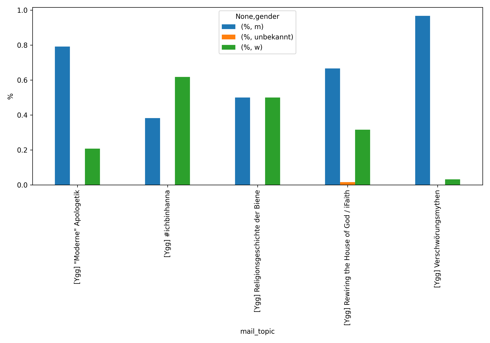
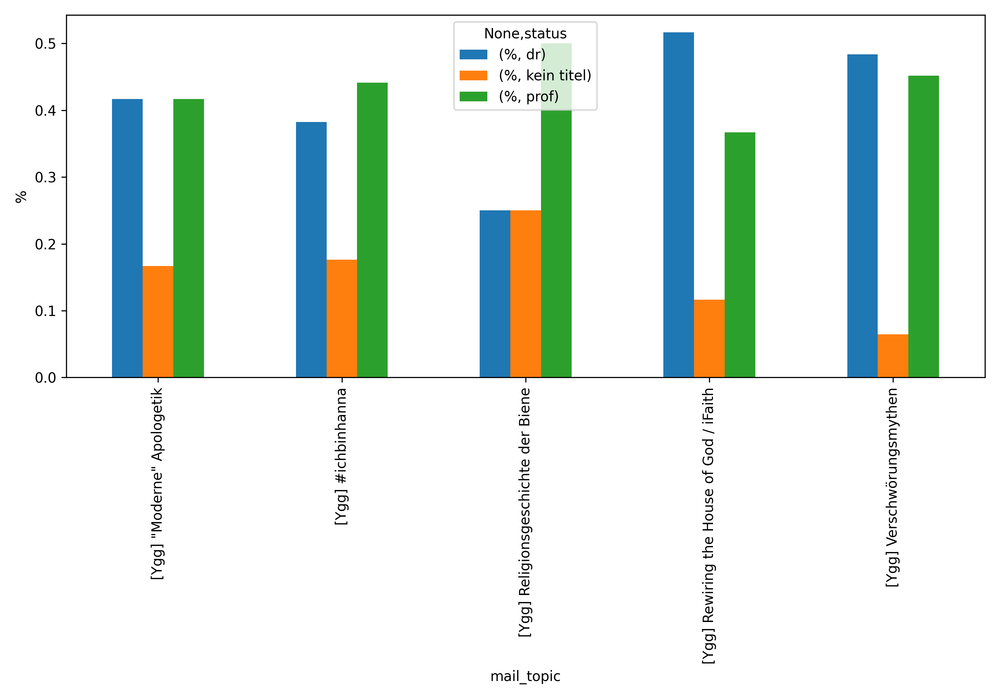

**Aktueller Stand**: 15. Dezember 2020

## Einführung
Die folgenden Visualisierungen und Statistiken basieren auf Beiträgen, die während des Jahres 2021 auf der religionswissenschaftlichen Informationsliste [Yggdrasill](https://www.lists.uni-marburg.de/lists/sympa/info/yggdrasill) veröffentlicht worden sind. Laut Beschreibung auf der offiziellen Webseite, die von der Universität Marburg gehostet wird, handelt es sich bei Yggdrasill um eine ...

>  ... religionswissenschaftliche Diskussions- und Informationsliste (...) \[Yggdrasill] ist eine Dienstleistung der Europäischen Gesellschaft für Religionswissenschaft (European Association for the Study of Religions, EASR). Die Diskussionen bei "Yggdrasill" werden hauptsächlich auf Deutsch geführt. Yggdrasill wird gegenwärtig von Sebastian Schüler (Leipzig) betreut.[^1]

Die folgenden statistischen Übersichten über die Diskussionsthemen sowie -teilnehmer/innen auf Yggdrasill verfolgen kein spezifisches Ziel. Sie sind vor allem aus dem Interesse und der Freude an der Generierung, Verarbeitung sowie Visualisierung digitaler Daten heraus entstanden.[^2]

Ein besonderes Augenmerk lag darauf, die Analysen und deren Visualisierungen so abstrakt zu halten, dass keine Rückschlüsse auf einzelne Listenmitglieder möglich bzw. sinnvoll sind. Falls sich dennoch jemand unbeabsichtigterweise angesprochen oder gar an den Pranger gestellt fühlt, bitte ich darum, mich zu kontaktieren, damit ich entsprechende Änderungen vornehmen kann.

Über Feedback, Hinweise (gerne auch technischer Natur) sowie Ideen für weitere Auswertungen würde ich mich sehr freuen. Gerne können Sie mich unter meiner Mailadresse <thomas.jurczyk-q88 _at_ rub.de> erreichen.

## Die Datenbasis
Die Datenbasis besteht aus aktuell **864** Mailbeiträgen (+35 zum Vorjahr), die im Laufe des Jahres 2021 auf Yggdrasill veröffentlicht wurden.[^3] Die Beiträge wurden manuell in meinem Mailprogramm gespeichert und von dort in Python als .mbox geladen und weiterverarbeitet. Zu der weiteren Bearbeitung gehörte neben automatisierten Auswertungen auch die manuelle Annotation der Kategorien (siehe weiter unten). Es wurden nur Beiträge berücksichtigt, die dezidiert für Yggdrasill bestimmt waren. Beiträge, die gleichzeitig auf mehreren Listen erschienen sind und mehrere Listenkürzel in der Betreffzeile führten, sind in der Regel nicht berücksichtigt worden. Trotzdem der Versuch unternommen wurde, alle Beiträge einzubeziehen, kann es sein, dass einige Beiträge übersehen bzw. aufgrund technischer Probleme nicht angezeigt wurden (darunter fallen derzeit mindestens fünf Beiträge, die nicht geparst werden konnten). Darüber hinaus kommt es immer wieder zur Problemen beim Parsing der Titelzeilen aus dem .mbox Format heraus, indem bspw. Leerzeichen/Umbrüche ignoriert werden. Auch sind hin und wieder Beiträge aus Cross-Listen-Postings in den Ordner gerutscht. Die folgenden absoluten Zahlen sind entsprechend mit Vorsicht zu interpretieren und sollten nur als allgemeine Trends gelesen werden.

## Yggdrasill 2021 Auswertung

### Anzahl der Beiträge pro Monat plus die Top-Themen
Der interaktive Plot zeigt die absolute Anzahl an Beiträgen pro Monat an. Wenn die Maus (oder der Finger im Falle eines Smartphones bzw. Tablets) über die Rechtecke geführt wird, wird außerdem das Top-Thema des jeweiligen Monats angezeigt. Die Auswertung der Top-Themen ist nicht immer ganz korrekt, da viele Themenstränge unter wechselnden Titelzeilen geführt werden und schon kleine Änderungen zu Fehlern in der Zählung führen können (die "#ichbinhanna" Diskussion ist dafür ein gutes Beispiel).

<iframe src="yggdrasill_2021_overview.html"
    sandbox="allow-same-origin allow-scripts"
    width="100%"
    height="700"
    scrolling="no"
    seamless="seamless"
    frameborder="0">
</iframe>

### Die Top 5 Themen 2021 (monatsübergreifend)

Da der obige Plot nur die Top-Themen eines jeden Monats anzeigt und damit Themen, die über Monatsgrenzen hinweg diskutiert werden, potentiell ignoriert, folgt hier die Liste der Top 5 (monatsübergreifend). Zusätzlich wurde versucht, in diese Zählung auch Beiträge einzubeziehen, die leicht geänderte Titelzeilen besitzen (und damit in der automatisierten Zählung als eigene Diskussionsstränge auftauchen).

| mail_topic                                                                                                                                                                                                              |   beiträge |
|:------------------------------------------------------------------------------------------------------------------------------------------------------------------------------------------------------------------------|----:|
| [Ygg] CfP reminder: Rewiring the House of God / iFaith (authors' workshop)                                                                                                                                              |  60 |
| [Ygg] #ichbinhanna (Debatte ums WissZeitVG)                                                                                                                                                                             |  34 |
| [Ygg] "Verschwörungsmythen"                                                                                                                                                                                             |  31 |
| [Ygg] Religionsgeschichte der Biene                                                                                                                                                                                     |  28 |
| [Ygg] "Moderne" Apologetik                                                                                                                                                                                              |  24 |

### Anzahl der Beiträge kategorisiert nach Gender
Der folgende *pie chart* zeigt die absolute Anzahl an Beiträgen auf Yggdrasill in 2021 kategorisiert nach Gender der Verfasser:innen. Das Label "unbekannt" wurde vergeben, wenn Listenbeiträge von Organisationen oder nicht identifizierbaren Personen verfasst wurden.

<iframe src="pie_chart_gender.html"
    sandbox="allow-same-origin allow-scripts"
    width="100%"
    height="400"
    scrolling="no"
    seamless="seamless"
    frameborder="0">
</iframe>

### Anzahl der Beiträge kategorisiert nach Titeln
Der folgende *pie chart* zeigt die absolute Anzahl an Beiträgen auf Yggdrasill in 2021 kategorisiert nach Titeln der Verfasser:innen. Die Titel sind dabei unterteilt in:

* Professoren
* Promoviert
* Kein Titel (Studierende, PhD students usw.)

Da die Titel der einzelnen Personen nicht immer leicht zu ermitteln waren, sind die hier präsentierten Zahlen nur als vage Annäherungen zu verstehen. Habilitierte Personen, die keine feste Professur innehaben, wurden zumeist in die Gruppe "Promoviert" aufgenommen. Da ich die Liste aus den letzten Jahren als Basis genommen habe, kann es gut sein, dass einzelne Statusänderungen noch nicht in die Statistik eingeflossen sind. Ich versuche, die Liste bei Gelegenheit zu updaten.

<iframe src="pie_chart_title.html"
    sandbox="allow-same-origin allow-scripts"
    width="100%"
    height="400"
    scrolling="no"
    seamless="seamless"
    frameborder="0">
</iframe>

### Genderanteil an Statusgruppen
Die folgende Tabelle bietet eine Übersicht über den prozentualen Anteil der Geschlechter an den jeweiligen Statusgruppen. **Aufgrund der schwierigen Datenbasis bitte mit Vorsicht zu interpretieren!**

|                             |   % |
|:----------------------------|---------:|
| ('dr', 'm')                 | 57 |
| ('dr', 'w')                 | 43 |
| ('kein titel', 'w')         | 52 |
| ('kein titel', 'm')         | 34 |
| ('kein titel', 'unbekannt') | 14 |
| ('prof', 'm')               | 74 |
| ('prof', 'w')               | 26 |

### Kategorisierung der Beiträge

Der letzte *pie chart* zeigt die absolute Anzahl an Beiträgen auf Yggdrasill in 2021 gruppiert nach übergreifenden Themen. Hierbei wurden die folgenden Oberkategorien festgelegt:

* Die Kategorie **Reflexion & Kritik** beinhaltet Beiträge, die sich mit allgemeinen Fragen und Entwicklungen der Religionswissenschaft beschäftigen. Darunter fallen beispielsweise Themen wie "#ichbinhanna".
* Die Kategorien **CfP** sowie **Veranstaltungen** und **Ankündigungen** weisen gewisse Schnittsmengen auf. Unter **Veranstaltungen** werden sämtliche Versammlungsformen gefasst (Workshop, Konferenz, Arbeitskreistreffen usw.). Die Kategorie **CfP** enthält nur Beiträge, in deren Betreffzeile "CfP" oder "Call for Papers" erwähnt wurden. Andere Beiträge, die eventuell ebenfalls als CfPs gewertet werden können, dies aber in der Betreffzeile nicht erwähnen, sind eventuell in anderen Kategorien wie **Veranstaltungen** oder **Ankündigungen** untergekommen.
* Die Kategorie **Religionswissenschaft** beinhaltet Beiträge, die sich mit konkreten religionswissenschaftlichen Fragen ("Moderne Apologetik"?") befassen oder nach religionswissenschaftlicher Expertise fragen ("Wer arbeitet noch zu Thema XY?"). Die Kategorie **Religionswissenschaft** weist häufig große Schnittmengen mit **Reflexion & Kritik** auf. 
* Die Kategorie **Publikation** beinhaltet alles, was irgendwie als "schriftlich" festgehalten angekündigt wurde. Darunter fallen Buchpublikationen, Artikel, aber auch Blogs, (schriftliche) Interviews oder Zeitungsartikel.
* Die Kategorie **Ankündigungen** enthält Bekanntmachungen, wozu u.a. Filmvorführungen, Podiumsdiskussionen, Radiofeatures etc. gehören.
* Die anderen Kategorien wie **CfA**, **Stipendien** oder **Studiengang** sollten selbsterklärend sein.

<iframe src="pie_chart_categories.html"
    sandbox="allow-same-origin allow-scripts"
    width="100%"
    height="400"
    scrolling="no"
    seamless="seamless"
    frameborder="0">
</iframe>

## Schlaglicht: #ichbinhanna Debatte
Die Diskussionen rund um #ichbinhanna und die damit verbundenen Probleme (prekärer) Beschäftigungsverhältnisse an Universitäten haben auch Yggdrasill erreicht und spielten eine zentrale Rolle in 2021. Dabei ist die hier untersuchte Anzahl von etwas über dreißig Beiträgen nur bedingt aussagekräftig, da sich die Diskussion auch in anderen Mails mit divergierenden Titeln fortsetzte.

Im Folgenden sollen jedoch nur die bereits oben aufgeführten Mails, die #ichbinhanna im Titel hatten, weiter untersucht werden. Denn hier gab es in der Tat einige Auffälligkeiten. So zeigt der folgende Plot, dass in dieser Diskussion, gerade im Vergleich zu den anderen Top-Themen, verhältnismäßig viele Beiträge von weiblichen Personen stammen.

Mit Blick auf die Statusgruppen wurden hingegen die meisten Beiträge von Personen mit Professur verfasst.

Das Verhältnis Gender/Statusgruppe sieht bei der #ichbinhanna Debatte wie folgt aus:

|                     |   % |
|:--------------------|---------:|
| ('dr', 'w')         | 57 |
| ('dr', 'm')         | 43 |
| ('kein titel', 'w') | 67 |
| ('kein titel', 'm') | 33 |
| ('prof', 'm')       | 67 |
| ('prof', 'w')       | 33 |

Es sei an dieser Stelle nochmals darauf hingewiesen, dass die prozentualen Werte in dieser Tabelle nicht den Grad der Beteiligung an der Debatte widerspiegeln. So könnten bspw. Professorinnen mehr zur Debatte geschrieben haben als ihre männlichen Kollegen.

Trotz aller Vorsicht mit Blick auf die schwierige Datenbasis und der Tatsache geschuldet, dass es sich hier um ein Hobbyprojekt und *keinen* Research Article handelt, mag dies ein Hinweis sein, dass die von #ichbinhanna aufgeworfenen Fragen in der Tat mehr Frauen als Männer in den unteren/mittleren Statusgruppen bewegen, die auch mit Blick auf die real existierenden Diskrepanzen in den höheren Statusgruppen wohl nicht ganz zu unrecht kritischer sind, was ihre Karriere angeht, als ihre männlichen Kollegen, die in dieser Debatte in den unteren/mittleren Statusgruppen häufig eine konservative Haltung eingenommen haben (ich weiß nicht, wer damit gemeint sein könnte...).

Über Feedback, Hinweise (gerne auch technischer Natur) sowie Ideen für weitere Auswertungen würde ich mich sehr freuen. Gerne können Sie mich unter meiner Mailadresse <thomas.jurczyk-q88 _at_ rub.de> kontaktieren.

## Fußnoten
***
[^1]: [Yggdrasill Beschreibung Uni Marburg](https://www.lists.uni-marburg.de/lists/sympa/info/yggdrasill) 

[^2]: Dabei wurden insbesondere die Programmiersprache [Python](https://www.python.org/) sowie die Python Bibliotheken [Bokeh](http://docs.bokeh.org/en/0.13.0/) und [pandas](https://pandas.pydata.org/) verwendet.

[^3]: Stand 15. Dezember 2021.

