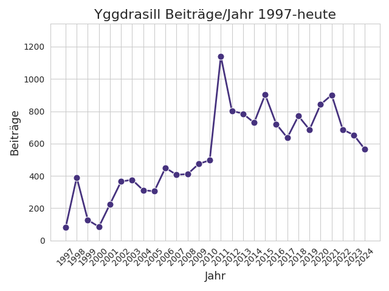
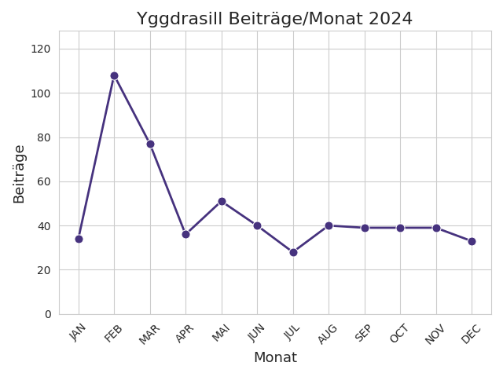
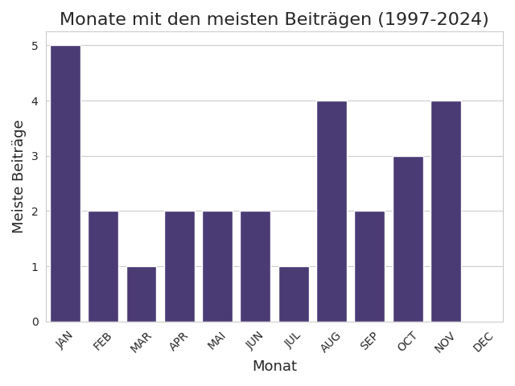
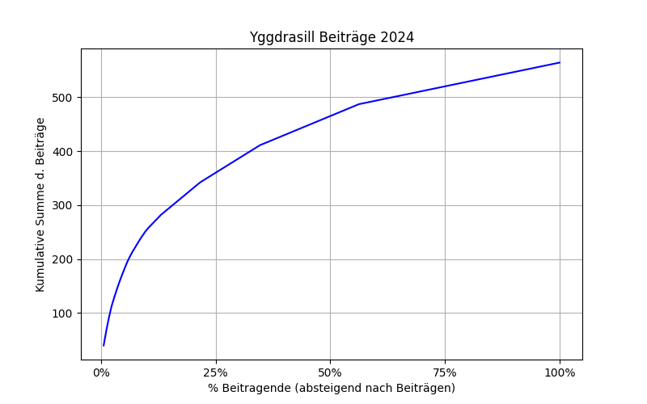
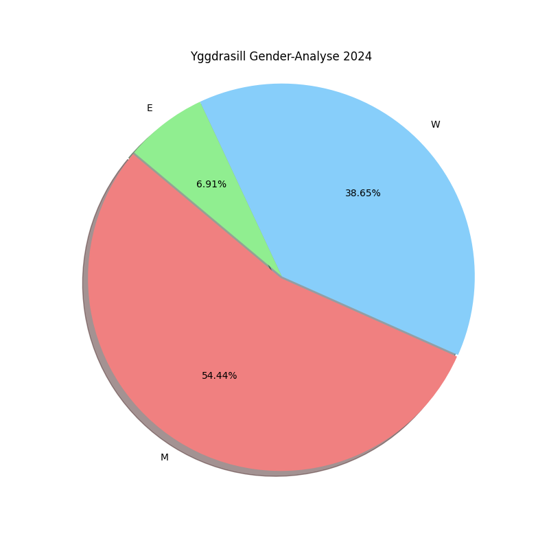

**Aktueller Stand**: 28. Dezember 2024

## Einführung
Die folgenden Visualisierungen und Statistiken basieren auf Beiträgen, die während des Jahres 2024 auf der religionswissenschaftlichen Informationsliste [Yggdrasill](https://www.lists.uni-marburg.de/lists/sympa/info/yggdrasill) veröffentlicht wurden. Laut Beschreibung auf der offiziellen Webseite, die von der Universität Marburg gehostet wird, handelt es sich bei Yggdrasill um eine ...

>  ... religionswissenschaftliche Diskussions- und Informationsliste (...) \[Yggdrasill] ist eine Dienstleistung der Europäischen Gesellschaft für Religionswissenschaft (European Association for the Study of Religions, EASR). Die Diskussionen bei "Yggdrasill" werden hauptsächlich auf Deutsch geführt. Yggdrasill wird gegenwärtig von Carmen Becker (Leibniz Universität Hannover) betreut.[^1]

Wie im Vorjahr enthält die Yggdrasill-Analyse für 2024 auch Kennzahlen zu allen bisher auf Yggdrasill veröffentlichten Beiträgen seit der Gründung der Liste (1997). Dies wurde unter anderem durch die freundliche Unterstützung von Frau Carmen Becker ermöglicht, die mir Zugriff auf das Mailarchiv gewährt hat.

Die folgenden statistischen Übersichten über die Diskussionsthemen sowie -teilnehmenden auf Yggdrasill verfolgen kein spezifisches Ziel. Sie sind vor allem aus dem Interesse und der Freude an der Generierung, Verarbeitung sowie Visualisierung digitaler Daten heraus entstanden.[^2]

Ein besonderes Augenmerk lag darauf, die Analysen und deren Visualisierungen so abstrakt zu halten, dass keine Rückschlüsse auf einzelne Listenmitglieder möglich bzw. sinnvoll sind. Falls sich dennoch jemand unbeabsichtigterweise angesprochen oder gar an den Pranger gestellt fühlt, bitte ich darum, mich zu kontaktieren, damit ich entsprechende Änderungen vornehmen kann.

Über Feedback, Hinweise (gerne auch technischer Natur) sowie Ideen für weitere Auswertungen würde ich mich sehr freuen. Gerne können Sie mich unter meiner Mailadresse <thomas.jurczyk-q88 _at_ rub.de> erreichen.

## Die Datenbasis
Die vollständige Datenbasis aller bisher auf Yggdrasill veröffentlichter Beiträge umfasst **15.326** Einträge. Die Datenbasis 2024 besteht aus aktuell **564** Mailbeiträgen (-89 im Vergleich zum Vorjahr), die im Laufe des Jahres 2024 auf Yggdrasill veröffentlicht wurden.[^3] Trotzdem der Versuch unternommen wurde, alle Beiträge einzubeziehen, kann es sein, dass einige Beiträge übersehen bzw. aufgrund technischer Probleme nicht angezeigt wurden. Die folgenden absoluten Zahlen sind entsprechend mit Vorsicht zu interpretieren und sollten nur als allgemeine Trends gelesen werden. Auch muss beachtet werden, dass es sich bei den jährlichen Yggdrasill-Analysen um einen *work in progress* handelt und sich bestimmte Suchparameter sowie Analyseverfahren im Laufe der Zeit ändern können, sodass ein Vergleich bestimmter Kennzahlen über die Jahre hinweg nur mit Einschränkungen möglich ist. Beispielsweise wurde in diesem Jahr das Verfahren zur Erkennung der Senderinformationen verbessert, was dazu führen dürfte, dass es in der Statistik weniger individuelle Beitragende als in den Vorjahren gibt.

Die Datenverarbeitung und -analyse wurde mit Python vorgenommen. Der Code in Form eines noch sehr unstrukturierten und wenig kommentierten Jupyter Notebook findet sich in einem [GitHub-Repository](https://github.com/thomjur/ygg-report).

## Yggdrasill 2024 Auswertung

### Übersicht über alle Beiträge
Der folgende Plot zeigt die Anzahl der Beiträge/Jahr seit Gründung der Yggdrasill-Liste (1997).

### Anzahl der Beiträge pro Monat plus die Top-Themen
Der folgende Plot zeigt die Anzahl der Beiträge pro Monat im Jahr 2024.

Von den Beiträgen waren knapp 9% (51) Call for Papers (CfP). Es fällt auf, dass genau wie im Vorjahr die intensivsten Diskussionen zu Beginn des Jahres geführt wurden, während die Anzahl an Beiträgen nach März 2024 merklich absinkt. Handelt es sich hierbei um ein Muster? Ein Blick auf die gesamte Datenbasis und die jeweiligen Monate mit den meisten Beiträgen zeigt, dass der Januar zwar häufig der Monat mit den meisten Beiträgen war, aber auch andere Monate im Jahresverlauf zu denen mit den meisten Beiträgen eines Jahres gehören können:

### Die fünf meistdiskutierten Themen 2024 (monatsübergreifend)

Es folgt die Liste der fünf meistdiskutierten Themen des Jahres 2024 auf Yggdrasill. Um die Zählung in weiten Teilen zu automatisieren, wurde der Versuch unternommen, die Betreffzeilen der Mails durch Bereinigungen so weit wie möglich zu vereinheitlichen, beispielsweise durch das Löschen von "Aw:", was allerdings nicht immer gelungen ist, weshalb die Ergebnisse anschließend manuell kontrolliert und zusammenhängende Themen zusammengelegt wurden (ein Beispiel aus diesem Jahr: "Wissenschaftsfreiheit und Antisemitismus" und "Als Ergänzung: Wissenschaftsfreiheit und Antisemitismus").

| Thema                                                                                                                                           |   Anz. Beiträge |
|:-----------------------------------------------------------------------------------------------------------------------------------------------------|----:|
| wissenschaftsfreiheit und antisemitismus                                                                                                                           |  38 |
| zionismus usw                                                                                                         |  14 |
| fair open access-journals                                                                               |  8 |
| professur religionswissenschaft wien                                                                                                                            |  7 |
| teilzeitstelle (50%): „wissenschaftliche\*r referent\*in (m/w/d)“ in der evangelischen zentralstelle für weltanschauungsfragen (ezw) in berlin |  7 |

Das dominierende Thema war die hitzige Debatte um Wissenschaftsfreiheit und Antisemitismus, die in Folge des Massakers in Israel und dessen Auswirkungen im ersten Quartal 2024 aufkam und auf die sich an dieser Stelle konzentriert werden soll. Bei den Themen, die unter der Überschrift "Wissenschaftsfreiheit und Antisemitismus" diskutiert wurden, ging es unter anderem um die Frage(n), welche Haltungen und Aussagen zu dem auf das Massaker folgenden Krieg in Gaza insbesondere in der deutschen akademischen Debatte zulässig sind. Für die folgenden Analysen wurde erstmalig versucht, mit Hilfe eines regulären Ausdrucks zitierte E-Mails aus E-Mails automatisiert zu entfernen, um so eine Vervielfältigung von Texten zu vermeiden, die zu falschen Ergebnissen in der Analyse führen könnten. Eine stichprobenartige manuelle Evaluierung der Ergebnisse hat ergeben, dass in der Tat die meisten Zitate aus den E-Mails entfernt werden konnten. Unter den am häufigsten auftretenden Wörtern während dieser Debatte befanden sich in nicht geordneter Reihenfolge "Debatte" (26), "Antisemitismus" (45), "Israel" (44) und "israelisch" (26), "Deutschland" (26) und "Wissenschaftsfreiheit" (24). Ebenfalls häufig anzutreffen waren die Begriffe "Vergleich" (17), "Politik" (20) sowie "Diskussion" (18) und der Begriff der "Kritik" (22).[^4]

Der Begriff des Antisemitismus wurde besonders häufig im Kontext der Begriffe "israelbezogen" und "wegdefinieren" verwendet, was eine Kollokationsanalyse der lemmatisierten Texte mit AntConc zeigen konnte. Im Zusammenhang mit "Meinungsfreiheit" kamen besonders häufig die Themen "IHRA", "Einschränkung" und "reagieren" vor.

### Anzahl der Beitragenden
Der automatisierten Auswertung zufolge wurden Beiträge von **176** verschiedenen E-Mail-Adressen gesendet. Dies entspricht jedoch *nicht* zwingend 176 individuellen Beitragenden, da einige Personen Beiträge von unterschiedlichen Mailadressen gesendet haben. Erwähnt werden soll auch, dass in diesem Jahr eine Verbesserung des E-Mail-Parsings vorgenommen wurde, sodass zusammengehörige Personen/E-Mail-Adressen besser erkannt werden, was zu einer Verringerung der Anzahl an unerschiedlichen Adressen im Vergleich zu den Vorjahren geführt haben dürfte. Im Falle von 176 Personen würde dies einem durchschnittlichen Beitragsmenge von ca. 3 Posts/Person entsprechen. Der folgende Plot mit der kumulativen Summe der Beiträge/Person (absteigend beginnend mit der Person bzw. Mailadresse mit den meisten Beiträgen) zeigt jedoch erneut, dass über die Hälfte der Posts von einem Viertel der Beitragenden verfasst wurden.

### Anzahl der Beiträge nach Geschlecht
Das folgende Tortendiagramm zeigt die relative Anzahl an Beiträgen auf Yggdrasill in 2024 nach Geschlecht der Verfasser:innen. Das Label "e" (=else) wurde vergeben, wenn Listenbeiträge von Organisationen oder nicht identifizierbaren Personen verfasst wurden. Es kann als durchaus problematisch betrachtet werden, dass die Kategorisierung in männlich oder weiblich hier lediglich binär erfolgt und dies auch noch rein auf Basis der Namen. Der Verfasser ist sich dieses Problems bewusst.

In diesem Jahr überwiegen eindeutig die Posts männlicher Diskussionsteilnehmender. 

## Fußnoten
***
[^1]: [Yggdrasill Beschreibung Uni Marburg](https://www.lists.uni-marburg.de/lists/sympa/info/yggdrasill). 

[^2]: Dabei wurden insbesondere die Programmiersprache [Python](https://www.python.org/) sowie die Python Bibliotheken [matplotlib](https://matplotlib.org/), [spaCy](https://spacy.io/) und [pandas](https://pandas.pydata.org/) verwendet.

[^3]: Stand 28. Dezember 2024.

[^4]: An dieser Stelle sei allgemein auf die Schwierigkeiten automatisierter Textanalysen von E-Mails hingewiesen, da der Inhalt einer E-Mail häufig die vorangegangenen E-Mails als Zitate ebenfalls enthält, was zu einer künstlichen Vergrößerung der Textmenge führt, die wiederum Einfluss auf die Auswertung hat.

[^5]: Der verwendete reguläre Ausdruck lautet: `(>.*\n)+|On .* wrote:\n|Am .* schrieb.*:\n`.
