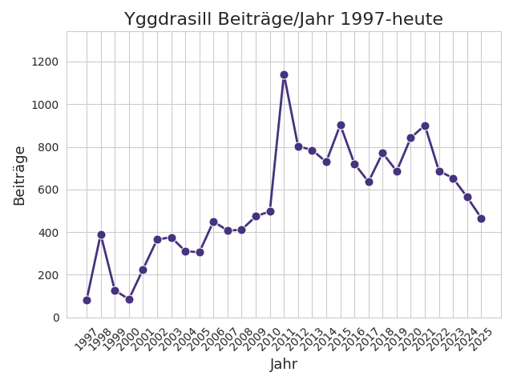
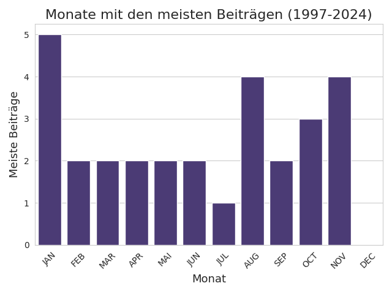

**Aktueller Stand**: 18. Dezember 2025

## Einführung
Die folgenden Visualisierungen und Statistiken basieren auf Beiträgen, die während des Jahres 2025 auf der religionswissenschaftlichen Informationsliste [Yggdrasill](https://www.lists.uni-marburg.de/lists/sympa/info/yggdrasill) veröffentlicht wurden. Laut Beschreibung auf der offiziellen Webseite, die von der Universität Marburg gehostet wird, handelt es sich bei Yggdrasill um eine ...

>  ... religionswissenschaftliche Diskussions- und Informationsliste (...) \[Yggdrasill] ist eine Dienstleistung der Europäischen Gesellschaft für Religionswissenschaft (European Association for the Study of Religions, EASR). Die Diskussionen bei "Yggdrasill" werden hauptsächlich auf Deutsch geführt. Yggdrasill wird gegenwärtig von Carmen Becker (Leibniz Universität Hannover) betreut.[^1]

Wie im Vorjahr enthält die Yggdrasill-Analyse für 2025 auch Kennzahlen zu allen bisher auf Yggdrasill veröffentlichten Beiträgen seit der Gründung der Liste (1997). Dies wurde unter anderem durch die freundliche Unterstützung von Frau Carmen Becker ermöglicht, die mir Zugriff auf das Mailarchiv gewährt hat.

Die folgenden statistischen Übersichten über die Diskussionsthemen sowie -teilnehmenden auf Yggdrasill verfolgen kein spezifisches Ziel. Sie sind vor allem aus dem Interesse und der Freude an der Generierung, Verarbeitung sowie Visualisierung digitaler Daten heraus entstanden.[^2]

Ein besonderes Augenmerk lag darauf, die Analysen und deren Visualisierungen so abstrakt zu halten, dass keine Rückschlüsse auf einzelne Listenmitglieder möglich bzw. sinnvoll sind. Falls sich dennoch jemand unbeabsichtigterweise angesprochen oder gar an den Pranger gestellt fühlt, bitte ich darum, mich zu kontaktieren, damit ich entsprechende Änderungen vornehmen kann.

Über Feedback, Hinweise (gerne auch technischer Natur) sowie Ideen für weitere Auswertungen würde ich mich sehr freuen. Gerne können Sie mich unter meiner Mailadresse <thomas.jurczyk-q88 _at_ rub.de> erreichen.

## Die Datenbasis
Die vollständige Datenbasis aller bisher auf Yggdrasill veröffentlichter Beiträge umfasst **15.792** Einträge. Die Datenbasis 2025 besteht aus aktuell **466** Mailbeiträgen (-98 im Vergleich zum Vorjahr), die im Laufe des Jahres 2025 auf Yggdrasill veröffentlicht wurden.[^3] Trotzdem der Versuch unternommen wurde, alle Beiträge einzubeziehen, kann es sein, dass einige Beiträge übersehen bzw. aufgrund technischer Probleme nicht angezeigt wurden. Die folgenden absoluten Zahlen sind entsprechend mit Vorsicht zu interpretieren und sollten nur als allgemeine Trends gelesen werden. Auch muss beachtet werden, dass es sich bei den jährlichen Yggdrasill-Analysen um einen *work in progress* handelt und sich bestimmte Suchparameter sowie Analyseverfahren im Laufe der Zeit ändern können, sodass ein Vergleich bestimmter Kennzahlen über die Jahre hinweg nur mit Einschränkungen möglich ist.

Die Datenverarbeitung und -analyse wurde mit Python vorgenommen. Der Code in Form eines noch sehr unstrukturierten und wenig kommentierten Jupyter Notebook findet sich in einem [GitHub-Repository](https://github.com/thomjur/ygg-report).

## Yggdrasill 2025 Auswertung

### Übersicht über alle Beiträge
Der folgende Plot zeigt die Anzahl der Beiträge/Jahr seit Gründung der Yggdrasill-Liste (1997). Es fällt auf, dass die Aktivität auf der Liste in den letzten Jahren kontinuerlich abnimmt und mittlerweile auf dem Niveau der 2000er Jahre ist. Eine Hypothese ist ein möglicher Zusammenhang zwischen DACH-übergreifenden Institutskürzungen, sinkenden Studierendenzahlen, und einem entsprechenden Bedeutungsverlust der Religionswissenschaft, der sich auch in den Aktivitäten auf der Liste niederschlägt. Dies soll im Folgenden näher untersucht werden soll.

Das Thema Schließungen von religionswissenschaftlichen Instituten, abnehmende Studierendenzahlen und eine vermutete abnehmende Relevanz der Religionswissenschaft nach Jahren der fortschreitenden Etablierung und Institutionalisierung war auch eines der meistdiskutierten Themen des Jahres unter dem Titel "Schließung der RelWiss Luzern" (siehe weiter unten).

An dieser Stelle soll jedoch datengetrieben einem anderen möglichen Indikator für diesen Abwärtstrend nachgegangen werden, nämlich der jährlichen Anzahl an auf Yggdrasill veröffentlichten Stellenangeboten.

#### Stellenangebote auf Yggdrasill (1997-2025)
Um die Frage nach einem möglichen Abwärtstrend der Religionwissenschaft nachzugehen, soll an dieser Stelle die Anzahl der auf Yggdrasill veröffentlichten Stellenanzeigen untersucht werden. Dafür wurden Betreffszeilen in den E-Mail-Daten gesucht und gezählt, die eines der folgenden Wörter enthielten[^6]:

1. Stellenangebot
2. Stellenanzeige
3. Job
4. Stelle(n)
5. Position
6. Fellow
7. Fellowship

Dabei muss beachten werden, dass die breite Suche auch zu falsch-positiven Ergebnissen geführt hat (Beispiel: "Aufgabe der Stelle in XYZ"). Eine manuelle Durchsicht der Ergebnisse hat jedoch gezeigt, dass dies nur in Ausnahmen der Fall war und die resultierenden Betreffszeilen zu großen Teilen den gesuchten Stellenausschreibungen entsprachen. Wichtig festzuhalten ist auch, dass die Stellenausschreibungen nicht nur akademische religionswissenschaftliche Stellen enthalten, sondern auch Stellen in einem weiteren Umfeld umfassen (Theologie, Digital Humanities) sowie Angebote außerhalb der Universität. Außerdem können einzelne Bekanntmachungen auch mehrere Stellenangebote umfassen, wobei ein jüngeres Beispiel mit einer einzelnen Ausschreibung zur Vergabe von 25 Positionen besonders prägnant war.

Der Plot zeigt, dass die Anzahl an Job-Angeboten im Laufe der 2000er Jahre kontinuerlich zunimmt und sich in den 2010er Jahren auf einem Niveau von 30+ Ausschreibungen/Jahr einpendelt (mit temporären Einbrüchen wie 2017). Ob es sich bei dem Knick im aktuellen Jahr 2025 (26 Ausschreibungen) ebenfalls nur um einen solchen temporären Einschnitt oder um einen längerfristigen Abwärtstrend handelt, muss sich in den nächsten Jahren erst zeigen. Im Kontext der aktuellen Diskussionen auf der Liste und Entwicklungen wie den sinkenden Studierendenzahlen könnte sich hier also durchaus eine mögliche Tendenz andeuten, bei der es aber noch zu früh ist, um festzustellen, ob diese sich in den kommenden Jahren verfestigen wird.

### Anzahl der Beiträge pro Monat plus die Top-Themen
Der folgende Plot zeigt die Anzahl der Beiträge pro Monat im Jahr 2025. Von 466 Nachrichten waren 42 (9.01%) Call for Papers und 32 (6.87%) Ankündigungen (Stellenausschreibungen, Bücher, Veranstaltungen usw.).

Dies entspricht in etwa der allgemeinen Tendenz, dass die meisten Diskussionen eher im ersten und dritten Quartal des Jahres zu verorten sind:

### Die fünf meistdiskutierten Themen 2025 (monatsübergreifend)

Es folgt die Liste der fünf meistdiskutierten Themen des Jahres 2025 auf Yggdrasill. Um die Zählung in weiten Teilen zu automatisieren, wurde der Versuch unternommen, die Betreffzeilen der Mails durch Bereinigungen so weit wie möglich zu vereinheitlichen, beispielsweise durch das Löschen von "Aw:", was allerdings nicht immer gelungen ist, weshalb die Ergebnisse anschließend manuell kontrolliert und zusammenhängende Themen zusammengelegt wurden (ein Beispiel aus diesem Jahr: "Schließung ReWi Luzern" und "Schließung ReWi Luzern? Leider ja").

| Thema                                                                                                                                           |   Anz. Beiträge |
|:-----------------------------------------------------------------------------------------------------------------------------------------------------|----:|
| trump und die religionsforschung                                                                                                                         |  34 |
| schließung rewi luzern                                                                                                         |  21 |
| updated agenda for the ga meeting that will be held at the 2025 iahr world congress                                                                               |  19 |
| rückgabe der in der ns-zeit konfiszierten bücher an die baha'i gemeinde                                                                                                                            |  9 |
| maha kumbh mela |  7 |

Das am intensivsten diskutierte Thema betraf **Trumps Amtsantritt in den USA** und damit die Frage, wie sich die Politik der neuen Administration auf die gesamte US-amerikanische religionswissenschaftliche – aber auch allgemein akademische – Landschaft auswirken würde. In diesem Zusammenhang wurden nicht nur verschiedene Perspektiven, sondern auch persönliche Einschätzungen und Erfahrungen geteilt, insbesondere zum Umgang mit politisch nicht mehr akzeptierten Themen wie Diversity.

Ebenso wurde die Verbindung zwischen Politik, Religion und Wissenschaft in den USA thematisiert sowie deren Auswirkungen auf den Rest der Welt diskutiert. Nicht zuletzt stand dabei die Frage im Raum, ob ähnliche Entwicklungen auch dem DACH-Raum bevorstehen könnten.

Bei der zweiten Debatte standen, wie bereits im Titel angedeutet, verschiedene Ursachen und Konsequenzen der **Schließung der Religionswissenschaft an der Universität Luzern** im Zentrum. Als Hauptgründe wurden sinkende Zahlen bei den (Hauptfach-)Studierenden, bevorstehende Emeritierungen sowie politisch-ökonomische Sparzwänge angeführt. Letztere scheinen Kriterien wie Drittmittelstärke und wissenschaftliche Relevanz zunehmend zu verdrängen.

In der weiteren Diskussion wurde die Frage aufgeworfen, ob hier ein allgemeiner Trend erkennbar sei, der auch andere Standorte im DACH-Raum betreffen könnte (dazu auch Michael Stausberg: [What is happening to Religious Studies?](https://onlinelibrary.wiley.com/doi/10.1111/rsr.17065)). Angesichts der aktuellen wirtschaftlichen und gesellschaftlichen Lage erscheinen Kürzungen in sogenannten „Orchideenfächern“ immer wahrscheinlicher – eine Einschätzung, die von der Mehrheit geteilt wurde; nur wenige Stimmen sprachen von einer möglichen Trendwende. Zudem zeige sich bei den Studierenden eine zunehmende Pragmatisierung der Studienwahl sowie ein potenziell sinkendes Interesse an religiösen Themen. Ein weiterer Faktor sei die künstliche Intelligenz, die es ermöglicht, sich Spezialwissen niedrigschwellig anzueignen, ohne zwingend ein Interessen-Studium aufnehmen zu müssen. Ob und wie sich dieser Trend auch in der Stellenpolitik und Forschungsförderung widerspiegelt, wurde unter anderem oben anhand der Analyse der Stellenausschreibungen auf Yggdrasill kurz diskutiert.

### Anzahl der Beitragenden
Der automatisierten Auswertung zufolge wurden Beiträge von **141** verschiedenen E-Mail-Adressen gesendet (was -34 im Vergleich zum Vorjahr entspricht). Dies entspricht jedoch *nicht* zwingend 141 individuellen Beitragenden, da einige Personen Beiträge von unterschiedlichen Mailadressen gesendet haben. Im Falle von 141 Personen würde dies einem durchschnittlichen Beitragsmenge von ca. 3,3 Posts/Person entsprechen. Der folgende Plot mit der kumulativen Summe der Beiträge/Person (absteigend beginnend mit der Person bzw. Mailadresse mit den meisten Beiträgen) zeigt jedoch erneut, dass über die Hälfte der Posts von einem Viertel der Beitragenden verfasst wurden.

### Anzahl der Beiträge nach Geschlecht
Das folgende Tortendiagramm zeigt die relative Anzahl an Beiträgen auf Yggdrasill in 2025 nach Geschlecht der Verfasser:innen. Das Label "e" (=else) wurde vergeben, wenn Listenbeiträge von Organisationen oder nicht identifizierbaren Personen verfasst wurden. Es kann als durchaus problematisch betrachtet werden, dass die Kategorisierung in männlich oder weiblich hier lediglich binär erfolgt und dies auch noch rein auf Basis der Namen. Der Verfasser ist sich dieses Problems bewusst.

Es überwiegen die Posts männlicher Diskussionsteilnehmender. 

## Fußnoten
***
[^1]: [Yggdrasill Beschreibung Uni Marburg](https://www.lists.uni-marburg.de/lists/sympa/info/yggdrasill). 

[^2]: Dabei wurden insbesondere die Programmiersprache [Python](https://www.python.org/) sowie die Python Bibliotheken [matplotlib](https://matplotlib.org/), [spaCy](https://spacy.io/) und [pandas](https://pandas.pydata.org/) verwendet.

[^3]: Stand 18. Dezember 2025.

[^4]: An dieser Stelle sei allgemein auf die Schwierigkeiten automatisierter Textanalysen von E-Mails hingewiesen, da der Inhalt einer E-Mail häufig die vorangegangenen E-Mails als Zitate ebenfalls enthält, was zu einer künstlichen Vergrößerung der Textmenge führt, die wiederum Einfluss auf die Auswertung hat.

[^5]: Der verwendete reguläre Ausdruck lautet: `(>.*\n)+|On .* wrote:\n|Am .* schrieb.*:\n`.

[^6]: Der verwendete reguläre Ausdruck lautet: `Stellenangebot|Stellenausschreibung|[Jj]ob|\b[Pp]osition\b|\bStelle\b|\bStellen\b|[Ff]ellowship|[Ff]ellow` sowie `!re.match(r"R[eE]:|A[wW]:")` (um Antworten auf Ausschreibungen zu exludieren).
